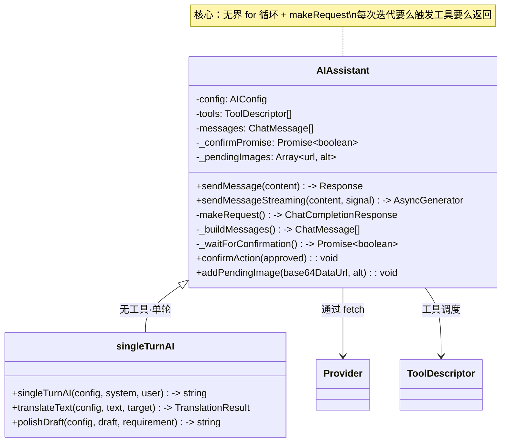
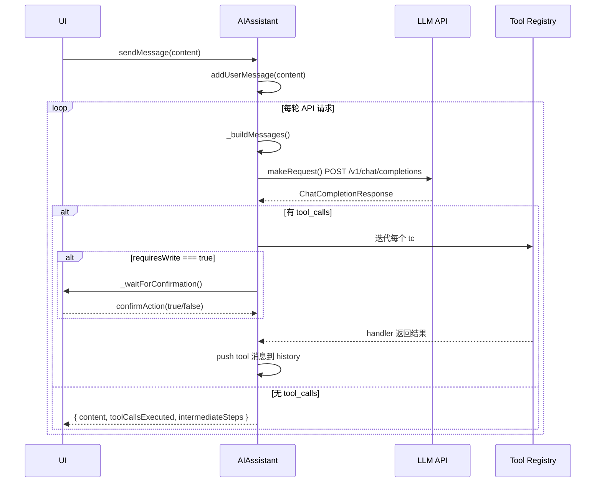

# AIAssistant：多提供者 LLM 引擎

`AIAssistant` 是 `@bsky/core` 的核心 AI 交互引擎，位于 **1 个类 + 3 个独立工具函数** 的薄层中。它不依赖任何框架（React/Vue 无关），纯 TypeScript 实现，通过 `fetch` 与任何 OpenAI 兼容 API 通信。一个类同时管理消息历史、工具调度、流式/非流式调用、写操作确认门与多模态注入。



---

## 1. 无界 for 循环：工具调用核心架构

`sendMessage()` 和 `sendMessageStreaming()` 共享同一个调度模式：**一个无硬上限的 `for` 循环，每次迭代 = 1 次 API 请求**。

```
for (let round = 0; ; round++) {
    response = await this.makeRequest();   // 发送完整消息历史
    if (response.tool_calls) {
        for (tc of tool_calls) {
            执行工具 → 推入 tool 消息 → 注入历史
        }
        continue;  // 继续循环，让模型看到工具结果
    }
    // 无 tool_calls → 最终回复
    return/break;
}
```

关键设计决策：
- **无硬循环上限**。注释写明 "No hard limit — user can pause/stop manually"。
- **每次 `continue` 相当于给 LLM 一轮新的上下文**：模型看到工具执行结果后，可能再次触发工具，也可能生成最终回复。
- 非流式版本（`sendMessage()`）通过 `intermediateSteps` 数组向上层报告每一步的工具调用，消费端（如 TUI）可以展示完整链。流式版本通过 `AsyncGenerator` yield 实时事件。

[来源](packages/core/src/ai/assistant.ts#L211-L315)
[来源](packages/core/src/ai/assistant.ts#L427-L640)

---

## 2. 非流式调用：sendMessage



### 2.1 核心流程

1. **构建请求体**：`_buildMessages()` 执行推理风格适配 + 多模态图片注入 + 过滤脏数据（无 `tool_call_id` 的 tool 消息会被剔除）。
2. **发起请求**：`makeRequest()` 使用 `fetch` 调用 `{cleanBaseUrl}/v1/chat/completions`。
3. **解析轮次**：检查 `choice.message.tool_calls`。有则执行工具，工具结果作为 `role: 'tool'` 消息追加入历史，`continue` 下一轮；无则作为最终回复返回。
4. **错误处理**：JSON 解析失败的 tool arguments 以 `{_raw: string}` 兜底，不会导致崩溃。

### 2.2 写操作确认门

```typescript
// 暂停 Promise 模式
private async _waitForConfirmation(): Promise<boolean> {
    this._confirmPromise = new Promise<boolean>((resolve) => {
        this._confirmResolve = resolve;
    });
    return this._confirmPromise;
}

// 外部调用（UI 层）
assistant.confirmAction(true);   // 批准
assistant.confirmAction(false);  // 取消
```

设计本质是一个 **暂停点（suspension point）**。当 `toolDesc.requiresWrite === true` 时，`await this._waitForConfirmation()` 将异步函数挂起，直到 UI 层调用 `confirmAction(bool)`。注意 `_waitForConfirmation` 不检查消息是否来自同一会话、不防重入——这是一个纯门控，信任上层调度。

取消时，工具不会执行，但一条内容为 `'User cancelled the operation.'` 的 tool 消息仍会推入历史，让 LLM 知晓用户拒绝了该操作。

[来源](packages/core/src/ai/assistant.ts#L194-L199)
[来源](packages/core/src/ai/assistant.ts#L247-L268)
[来源](packages/core/src/ai/assistant.ts#L594-L609)

---

## 3. 流式调用：sendMessageStreaming

流式版本在保留工具调用循环的基础上，将 API 响应解析从 JSON.parse 一次完成改为逐块 SSE 解析。

### 3.1 SSE 逐行解析

```
data: {"choices":[{"delta":{"content":"你好"}}]}
data: {"choices":[{"delta":{"content":"世界"}}]}
data: [DONE]
```

解析逻辑：
- 只处理 `startsWith('data: ')` 的行，忽略其他行。
- `data === '[DONE]'` 跳过。
- 使用 `TextDecoder` 的 `{ stream: true }` 模式处理 UTF-8 边界跨块。

### 3.2 三路增量累积

| 字段 | 累积方式 | yield 事件 |
|------|----------|-----------|
| `delta.content` | 字符串拼接 → `fullContent` | `{ type: 'token', content }` |
| `delta.reasoning_content` | 字符串拼接 → `reasoningContent` | `{ type: 'thinking', content }` |
| `delta.tool_calls` | `Map<index, {id, name, arguments}>` 分片拼接 | 流结束后统一 yield |

### 3.3 tool_calls 增量累积

SSE 流中 tool_calls 以分片形式到达：

```json
// chunk 1
{"delta":{"tool_calls":[{"index":0,"id":"call_1","function":{"name":"search_posts","arguments":""}}]}}
// chunk 2
{"delta":{"tool_calls":[{"index":0,"function":{"arguments":"{\"q\":"}}]}}
// chunk 3
{"delta":{"tool_calls":[{"index":0,"function":{"arguments":"\"AI\"}"}}]}}
```

累积策略：**用 `Map<number, Accumulator>` 按 `tc.index` 分组**。index 是 SSE 规范中用于区分同一轮多个并行工具调用的标识符。流结束后，`Array.from(toolCallAccum).sort(([a],[b]) => a-b)` 恢复顺序，合并为完整的 ToolCall 数组。

### 3.4 客户端暂停

`AbortSignal` 贯穿全程：
- 请求阶段：`fetch(url, { signal })` 自带的 abort 机制
- 读取阶段：每个 `while(true)` 循环迭代检查 `signal?.aborted`
- 异常捕获：`catch` 块中区分 `signal.aborted`（返回 `{type:'done'}`）和真实网络错误（抛出）

[来源](packages/core/src/ai/assistant.ts#L484-L560)
[来源](packages/core/src/ai/assistant.ts#L562-L629)
[来源](packages/core/src/ai/assistant.ts#L465-L476)

---

## 4. 多模态视觉支持

### 4.1 数据流

```
用户上传图片 → addPendingImage(base64DataUrl, alt)
                ↓
_buildMessages() 中检查 visionEnabled
                ↓
扫描 messages 中最后一个 user message
                ↓
content: string → content: ContentBlock[]
  [{ type: 'text', text: 用户消息 },
   { type: 'text', text: '[ALT: xxx]' },
   { type: 'image_url', image_url: { url: 'data:image/...', detail: 'auto' } }]
                ↓
消息推入 history 并清空 pendingImages
```

### 4.2 关键决策

- **图片只注入最近一条 user message**，从消息数组末尾向前扫描，找到第一个 `role === 'user'` 的消息。这是合理的——用户发送了一条带图片的消息，这张图片只与该轮对话相关。
- **同时修改 `this.messages[i]`**（第 353 行），将图片数据持久化到消息历史，确保后续轮次模型仍能"看到"图片上下文。
- `base64 data URL` 格式确保了与 OpenAI 兼容 API 的 `image_url.url` 格式要求的直接兼容，无需额外转换。
- `visionEnabled` 开关在 `AIConfig` 中（默认 `false`），`_buildMessages()` 先检查此开关再执行注入逻辑。

### 4.3 用户上传 vs 图片视图

`_pendingImages` 和 `_userUploads` 是两个独立存储：

| 存储 | 用途 | 数据格式 | 流向 |
|------|------|----------|------|
| `_pendingImages` | 多模态视觉分析 | `{ url: base64DataUrl, alt? }` | → `_buildMessages()` → LLM |
| `_userUploads` | 未来发帖上传 | `{ data: Uint8Array, mimeType, alt }` | → `create_post` 工具 → PDS |

前者是 AI 能看到的图像数据，后者是用户打算通过工具发布到 Bluesky 的原始二进制数据。

[来源](packages/core/src/ai/assistant.ts#L104-L107)
[来源](packages/core/src/ai/assistant.ts#L157-L166)
[来源](packages/core/src/ai/assistant.ts#L337-L358)

---

## 5. reasoningStyle 适配三模式

不同提供商（DeepSeek vs Mistral）对推理过程的输出格式不同。`providers.json` 中通过 `reasoningStyle` 字段声明：

| 模式 | 含义 | 代表提供商 | 处理策略 |
|------|------|-----------|---------|
| `'reasoning_content'` | 原生 `delta.reasoning_content` 字段 | DeepSeek | 保留原字段，流式中直接 yield `thinking` 事件，非流式中存入 `reasoning_content` 属性 |
| `'structured_content'` | content 内含结构化的 thinking/text 区块数组 | Mistral | `_buildMessages()` 中将历史中的 `reasoning_content` 合并为思考前缀。流式中解析 `Array.isArray(delta.content)`，识别 `type: 'thinking'` 和 `type: 'text'` 两种子块 |
| `'none'` | 无推理过程 | 其他 | 同上合并逻辑（走 `!== 'reasoning_content'` 分支） |

### 5.1 消息重建路径

非 `'reasoning_content'` 模式时，`_buildMessages()` 会将历史消息中的 `reasoning_content` 字段提取为文本前缀拼入 `content`：

```typescript
if (this.config.reasoningStyle !== 'reasoning_content') {
    msgs = msgs.map(m => {
        const rc = (m as any).reasoning_content;
        if (!rc || m.role !== 'assistant') return m;
        const prefix = `【上一步思考过程】\n${rc}\n\n`;
        // ... 合并到 content
    });
}
```

这样可以避免向不支持独立 `reasoning_content` 字段的 API（如 Mistral）发送未知字段（`extra_forbidden` 错误）。

### 5.2 流式 structured_content 解析

Mistral 的结构化内容可能形如：

```json
{
  "content": [
    { "type": "thinking", "thinking": [{ "type": "text", "text": "思考过程..." }] },
    { "type": "text", "text": "最终回复" }
  ]
}
```

流式解析中专门处理 `Array.isArray(delta.content)` 分支，递归展开 thinking 内部数组，分别 yield `thinking` 和 `token` 事件。

### 5.3 thinking 参数控制

仅 DeepSeek 使用非标准的 `thinking` 请求参数（通过 `shouldSendThinkingParam()` 函数判断）。`structured_content` 模式下额外发送 `reasoning_effort: 'high'` 提示模型深入推理。

[来源](packages/core/src/ai/assistant.ts#L323-L334)
[来源](packages/core/src/ai/assistant.ts#L367-L372)
[来源](packages/core/src/ai/assistant.ts#L517-L535)
[来源](packages/core/src/ai/providers.ts#L53-L56)
[来源](packages/core/src/ai/providers.json)

---

## 6. 独立工具函数

`AIAssistant` 类之外，三个无工具的单轮调用函数适用于翻译、润色等简化场景：

| 函数 | 用途 | 特点 |
|------|------|------|
| `singleTurnAI()` | 纯文本生成（无工具） | 最低配置，直接发请求返回 content |
| `translateText()` | 翻译（双模式） | `simple` 纯文本 / `json` 结构化输出+源语言检测。内置退避重试（最多 3 次，指数延迟） |
| `polishDraft()` | 润色草稿 | 调用 `singleTurnAI` 包装，固定 temperature 0.7 |

`translateText` 的健壮性值得关注：JSON 解析失败、content 为空、网络错误均有重试逻辑。JSON 模式下使用 `response_format: { type: 'json_object' }`（OpenAI 兼容参数），强制模型输出合法 JSON。

[来源](packages/core/src/ai/assistant.ts#L661-L707)
[来源](packages/core/src/ai/assistant.ts#L725-L818)
[来源](packages/core/src/ai/assistant.ts#L831-L840)

---

## 7. 消费端集成：useAIChat

React Hook `useAIChat`（位于 `packages/app/src/hooks/useAIChat.ts`）是 `AIAssistant` 的主要消费者，展示了一个标准的桥接模式：

- **生命周期映射**：`useState(() => new AIAssistant(config))` 创建单例，`useEffect` 同步 `updateConfig`。
- **流式状态机**：遍历 `AsyncGenerator` 的 event 类型（`tool_call`/`tool_result`/`thinking`/`token`/`done`/`confirmation_needed`），逐个更新 React state。
- **持久化桥接**：每次消息列表变化时自动调用 `chatStorage.saveChat()`，支持对话历史回放。
- **消息重建**：从存储加载历史时，将 `tool_call`/`tool_result` 事件还原为 `ChatMessage` 格式，使用 `assistant.loadMessages()` 注入。

[来源](packages/app/src/hooks/useAIChat.ts#L37-L483)

---

## 架构总览

```
                       ┌──────────────────────────────────────┐
                       │           LLM API (OpenAI 兼容)       │
                       └──────────┬───────────────────────────┘
                                  │ fetch POST /v1/chat/completions
              ┌───────────────────┴───────────────────────┐
              │              AIAssistant                    │
              │  ┌─────────┐  ┌──────────┐  ┌───────────┐ │
              │  │ 消息历史  │  │ 工具注册表 │  │ 配置中心   │ │
              │  └─────────┘  └──────────┘  └───────────┘ │
              │  ┌──────────────────────────────────────┐  │
              │  │   sendMessage / sendMessageStreaming   │  │
              │  │   (无界 for 循环 + makeRequest)         │  │
              │  └──────────────────────────────────────┘  │
              │  ┌──────────────────────────────────────┐  │
              │  │   写操作确认门 (Promise 暂停模式)      │  │
              │  └──────────────────────────────────────┘  │
              │  ┌──────────────────────────────────────┐  │
              │  │   多模态注入 (ContentBlock 替换)       │  │
              │  └──────────────────────────────────────┘  │
              └──────────────────┬───────────────────────┘
                                 │
              ┌──────────────────┴───────────────────────┐
              │           消费端 (useAIChat)               │
              │  React state 桥接 / 持久化 / AbortSignal   │
              └──────────────────────────────────────────┘
```

这个架构的核心设计哲学：**无界循环 + Promise 暂停 = 完全灵活的执行流**。确认门、多模态注入、推理风格适配都作为消息构建阶段的"转换器"（`_buildMessages`）存在，不侵入调度循环本身。

---

## 下一步

- 了解 AI 如何调用 [36 个 Bluesky 工具](36-个-ai-工具-从定义到执行.md) 的完整注册机制
- 查看 [Prompt 工程与多提供者注册表](prompt-工程与多提供者注册表.md) 了解系统提示词如何与运行时配置协同
- 探索 [AI Chat 与聊天历史](ai-chat-与聊天历史.md) 了解消费端的完整状态管理
- 阅读 [环境变量与配置](环境变量与配置.md) 了解 AI 提供者的运行环境配置