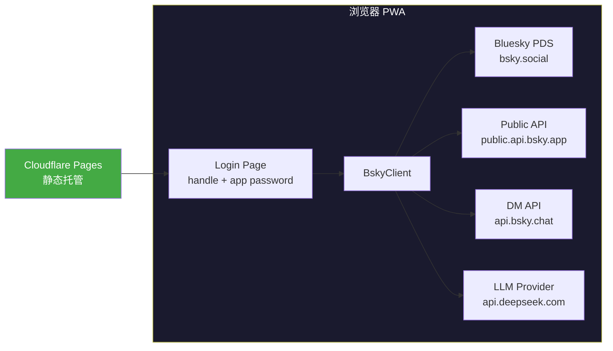

# PWA 部署指南

## 零后端架构

此 PWA 是一个**纯静态单页应用**。所有 API 调用直接从浏览器发出，没有任何代理服务器或后端进程。



支持 CORS 的原因决定了无需后端：
- **Bluesky PDS** (`*.bsky.social`) — 所有 `com.atproto.*` 和 `app.bsky.*` 端点均开放 CORS 头
- **Bluesky Public API** (`public.api.bsky.app`) — 公开查询接口同样支持跨域
- **Chat API** (`api.bsky.chat`) — DM 协议端点 CORS 无限制
- **LLM Provider** — 各 AI 厂商的 OpenAI 兼容 API 端点原生支持浏览器跨域请求

凭据从不发送到服务器。JWT 令牌和 AI API Key 存放在 `localStorage` 中，由 `useSessionPersistence` 和 `useAppConfig` 两个 hook 管理。

[来源](packages/pwa/src/hooks/useSessionPersistence.ts#L1-L26) | [来源](packages/pwa/src/hooks/useAppConfig.ts#L1-L63) | [来源](packages/pwa/src/components/LoginPage.tsx#L1-L105)

---

## 构建流水线

### 完整构建命令

```bash
# 从 monorepo 根目录
pnpm -r typecheck   # 类型检查所有包
pnpm -r build       # 构建 core → app → pwa
```

`pnpm -r build` 触发的工作流：

1. **`@bsky/core`** — TS 编译为 JS (`tsc -b`)
2. **`@bsky/app`** — TS 编译为 JS (`tsc -b`)
3. **`@bsky/pwa`** — `tsc -b && vite build`

第三步 `vite build` 的具体行为：

- 从 `packages/pwa/index.html` 入口，解析 React 组件树
- 使用 `@vitejs/plugin-react` 进行 JSX 编译和 HMR 剥离
- **注入构建元数据** — `vite.config.ts` 中的 `define` 配置在构建时捕获并硬编码三个值：

| 常量 | 来源 | 用途 |
|------|------|------|
| `__COMMIT_HASH__` | `git rev-parse HEAD` | About 页面显示当前部署版本 |
| `__COMMIT_DESC__` | `git log --format=%s -1` | 最近一次提交信息 |
| `__BUILD_TIME__` | `new Date().toISOString()` | 构建时间戳 |

- **Node 模块桩** — 将 `os`/`fs`/`path` 解析为 `src/stubs/*.ts`（空函数），消除 `@bsky/core` 中残留的 Node 依赖
- 输出目录：`packages/pwa/dist/`

**关键时序**：构建元数据始于 `git rev-parse HEAD`。修改代码后若不先 commit 就 build，hash 会指向旧 commit。正确的顺序是 `git commit → pnpm build → deploy`。

[来源](packages/pwa/vite.config.ts#L1-L33) | [来源](packages/pwa/package.json#L6-L11) | [来源](docs/LESSONS.md#L326-L336)

### 构建产物结构

```
packages/pwa/dist/
├── index.html              # 入口 HTML（hash 版本）
├── manifest.json           # 从 public/ 直接复制
├── sw.js                   # 从 public/ 直接复制
├── assets/
│   ├── index-xxxxx.js      # Vite 打包 JS（content hash）
│   └── index-xxxxx.css     # tailwind + CSS variables
└── icons/
    ├── icon-64.png
    ├── icon-192.png
    └── icon-512.png
```

`dist/` 是一个完全自包含的静态站点，可直接上传至任何静态托管服务。

---

## Cloudflare Pages 部署

### 命令行部署（推荐）

```bash
cd packages/pwa
npx wrangler pages deploy dist --project-name ai-bsky --commit-dirty=true
```

参数说明：
- `dist` — 部署目录（即 Vite 构建输出）
- `--project-name ai-bsky` — Cloudflare 项目名称，首次部署自动创建，后续复用
- `--commit-dirty=true` — 允许未提交的更改（仅临时测试用；生产环境建议先 commit）

### Cloudflare Dashboard 手动部署

当网络环境阻止 wrangler CLI 连接 API 时（如部分地区的网络限制）：

1. 登录 [Cloudflare Dashboard → Workers & Pages](https://dash.cloudflare.com/)
2. 选择 **Pages** → **Create** → **Direct Upload**
3. 将 `packages/pwa/dist/` 文件夹拖入上传区域
4. 设置项目名称为 `ai-bsky`
5. 点击 **Deploy**

### 路由配置

无需任何路由重写规则。PWA 使用**哈希路由**（URL hash `#/feed`、`#/thread/...`），所有路径请求都返回 `index.html` 由前端路由处理。

### 预览 URL

每次部署 Cloudflare Pages 会生成一个预览 URL：
```
https://<hash>.ai-bsky.pages.dev
```
生产域名固定为：
```
https://ai-bsky.pages.dev
```

[来源](docs/PWA_GUIDE.md#L12-L24) | [来源](AGENTS.local.md#L42-L76)

---

## PWA 注册与离线策略

### manifest.json

位于 `packages/pwa/public/manifest.json`，构建时直接复制到 `dist/`：

```json
{
  "name": "Bluesky Client",
  "short_name": "Bluesky",
  "display": "standalone",
  "background_color": "#FFFFFF",
  "theme_color": "#00A5E0",
  "start_url": "./",
  "orientation": "any",
  "icons": [
    { "src": "icons/icon-64.png", "sizes": "64x64" },
    { "src": "icons/icon-192.png", "sizes": "192x192", "purpose": "any maskable" },
    { "src": "icons/icon-512.png", "sizes": "512x512", "purpose": "any maskable" }
  ]
}
```

关键配置：
- **`display: standalone`** — 安装后以独立窗口运行，无浏览器 chrome
- **`theme_color: #00A5E0`** — 匹配 Bluesky 品牌蓝色，影响状态栏颜色
- **`start_url: ./`** — 启动后由哈希路由自动恢复上一个视图
- **`purpose: maskable`** — 192/512 图标适配 Android 自适应图标形状

`index.html` 中通过 `<meta>` 标签补充 Apple 生态的安装支持：
```html
<meta name="apple-mobile-web-app-capable" content="yes" />
<meta name="apple-mobile-web-app-status-bar-style" content="black-translucent" />
<link rel="apple-touch-icon" href="./icons/icon-192.png" />
```

[来源](packages/pwa/public/manifest.json#L1-L30) | [来源](packages/pwa/index.html#L1-L23)

### Service Worker

`public/sw.js` 实现四级缓存策略，无第三方 SW 框架依赖：

| 缓存策略 | 匹配目标 | 缓存名称 | 理由 |
|---------|---------|---------|------|
| **Cache-first** | `cdn.bsky.app` | `bsky-img-v1` | 内容寻址图片，URL 对应不变的内容 |
| **Cache-first** | `fonts.gstatic.com` | `bsky-font-v1` | 字体文件极少变更 |
| **Stale-while-revalidate** | `fonts.googleapis.com` | `bsky-font-v1` | CSS 字体声明可容忍短暂过期 |
| **Cache-first** | `/assets/*`, `/icons/*` | `bsky-v3` | Vite 打包产物带 content hash |
| **Stale-while-revalidate** | HTML/根路径 | `bsky-v3` | 确保用户看到最新 UI |
| **Network-first** | `bsky.social`, `public.api.bsky.app`, `api.deepseek.com`, `api.*` | — | API 必须实时数据 |
| **Network-first** | 其他 | — | 兜底策略 |

注册时机在 `src/main.tsx` 的 `load` 事件中：
```typescript
if ('serviceWorker' in navigator) {
  window.addEventListener('load', () => {
    navigator.serviceWorker.register('./sw.js', { scope: './' });
  });
}
```

**离线行为**：API 请求在网络不可用时返回 `{ error: 'Network offline' }` 状态码 503。已缓存的静态资源（界面框架、图标、字体）仍可加载，但所有动态数据（时间线、帖子、AI 响应）不可用。

缓存版本号（`CACHE_NAME = 'bsky-v3'`）变更时，`activate` 事件自动清理旧缓存。

[来源](packages/pwa/public/sw.js#L1-L123) | [来源](packages/pwa/src/main.tsx#L7-L15)

---

## 部署到其他静态托管

PWA 不需要 Cloudflare Pages 特有的功能。`dist/` 可部署到任何静态托管服务。

### Netlify

```bash
# 方式一：Netlify CLI
npx netlify deploy --prod --dir=packages/pwa/dist

# 方式二：Netlify Dashboard → Sites → Drag dist/ folder
```

由于使用哈希路由，**无需** `_redirects` 文件配置。如需清理 URL（去掉 `#`），则需添加：
```
/*    /index.html   200
```
但哈希路由当前设计不依赖此配置。

### Vercel

```bash
npx vercel --prod packages/pwa/dist
```

同样无需路由重写。

### 其他平台注意点

| 平台 | 注意事项 |
|------|---------|
| **GitHub Pages** | 确保 `base: './'` 已配置（`vite.config.ts` 已设置），否则资源路径错误 |
| **AWS S3 + CloudFront** | 配置 `index.html` 为默认文档，Error Document 也设为 `index.html` |
| **Nginx 静态服务器** | 确保 `sw.js` 的 MIME type 为 `application/javascript`，且 Service Worker 作用域包含根路径 |

**所有平台通用限制**：Bluesky API 和 LLM API 的 CORS 支持依赖于远端服务器，与托管平台无关。如果用户网络环境阻止跨域请求，该问题无法通过更换托管平台解决。

---

## 部署后的验证清单

部署完成后，在浏览器中打开线上 URL 验证以下要点：

1. **PWA 安装提示** — Chrome DevTools → Application → Manifest，确认 manifest 被正确解析，"Install" 按钮可用
2. **Service Worker 激活** — DevTools → Application → Service Workers，确认 `sw.js` 已注册且状态为 "activated"
3. **登录流程** — 输入 Bluesky handle + App Password，确认能成功创建会话
4. **AI 配置** — 进入设置页面，配置 API Key，发送一条 AI 消息确认流式响应正常
5. **离线检测** — DevTools → Network → Offline，刷新页面确认静态资源仍可加载，API 请求返回 503 错误
6. **缓存命中** — 首次加载后截图，清空缓存后再加载，确认 `cdn.bsky.app` 图片和字体从缓存加载

---

## 相关章节

- [PWA 架构与组件映射](pwa-架构与组件映射.md) — PWA 的 React 组件树与哈希路由设计
- [PWA 存储与离线能力](pwa-存储与离线能力.md) — IndexedDB 聊天存储与 localStorage 配置持久化
- [认证与会话管理](认证与会话管理.md) — JWT 生命周期、useAuth 与 session restore 流程
- [快速开始](快速开始.md) — PWA 本地开发环境搭建