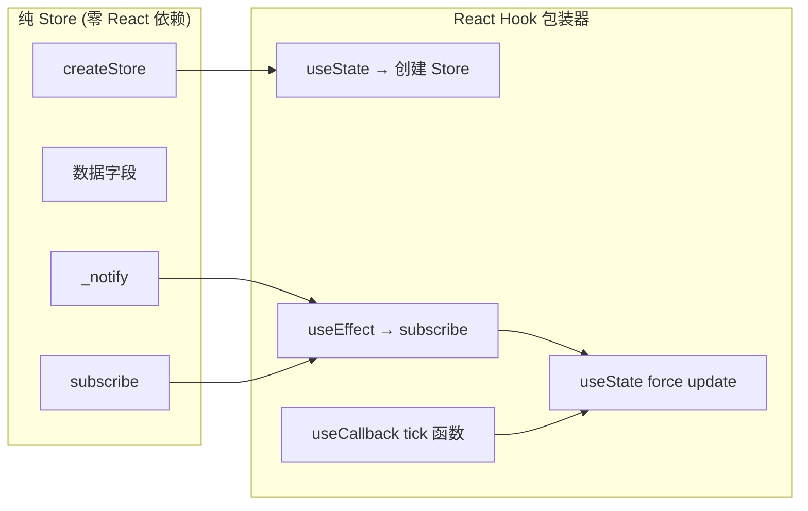
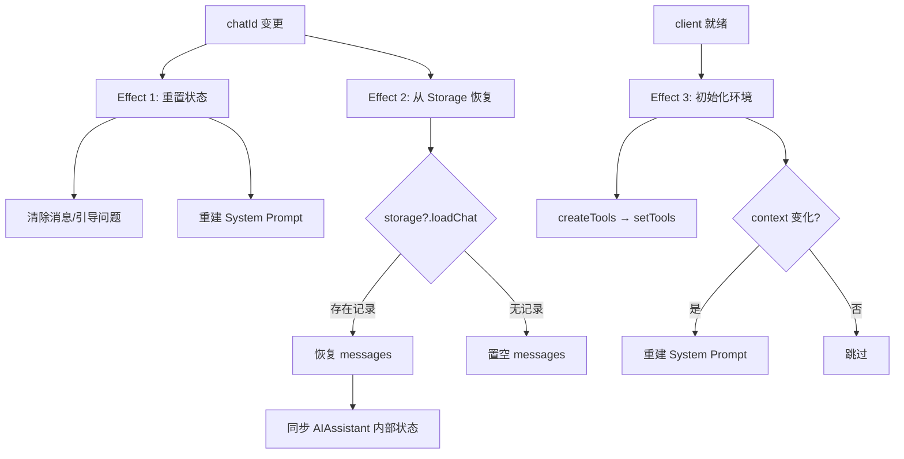

# React Hooks 架构与 Store 模式

> 纯状态对象 + React Hook 桥接：一种零 React 依赖的轻量状态管理方案。

## 全景图：20+ Hook 一览

整个应用的 React 状态管理由 `packages/app/src/hooks/` 下 **20 个独立 Hook** 构成，它们通过 `packages/app/src/index.ts` 统一导出。每个 Hook 遵循同一底层架构模式，但根据功能复杂度分为三种实现风格。

| Hook | Store 类型 | 返回类型 |
|------|-----------|---------|
| `useAuth` | `createAuthStore()` 纯 Store | `{ client, session, profile, loading, login, restoreSession }` |
| `useTimeline` | `createTimelineStore()` 纯 Store | `{ posts, loading, cursor, error, loadMore, refresh }` |
| `usePostDetail` | `createPostDetailStore()` 纯 Store | `{ post, flatThread, translations, translate, actions }` |
| `useNavigation` | `createNavigation()` 纯 Store（多监听器） | `{ currentView, canGoBack, goTo, goBack, goHome }` |
| `useThread` | 内联 state | `{ flatLines, loading, error, focusedIndex, ...likePost, repostPost, expandReplies }` |
| `useCompose` | 内联 state | `{ posts, addPost, removePost, setPostText, submitting, error, replyTo, ...submit, loadFromDraft }` |
| `useAIChat` | `AIAssistant` 类实例 | `{ messages, loading, guidingQuestions, send, stop, addUserImage, chatId, pendingConfirmation, confirmAction, rejectAction, edit, editByIndex }` |
| `useDrafts` | `createDraftsStore(client)` 纯 Store | `{ drafts, loading, saving, saveDraft, deleteDraft, syncDraft, refreshDrafts, loadDraft }` |
| `useI18n` | 单例纯 Store | `{ t, locale, setLocale, availableLocales, localeLabels }` |
| `useChatHistory` | `FileChatStorage` 实例 | `{ conversations, loadConversation, saveConversation, deleteConversation, refresh }` |
| `useTranslation` | 内联 state + Map 缓存 | `{ translate, loading, cache, lang, setLang, mode, setMode, LANG_LABELS }` |
| `useProfile` | 内联 state | `{ profile, loading, error, tab, setTab, posts, feedCursor, ...handleFollow, handleUnfollow, ...followList }` |
| `useSearch` | 内联 state | `{ query, results, loading, search }` |
| `useNotifications` | 内联 state | `{ notifications, loading, unreadCount, refresh }` |
| `useBookmarks` | 内联 state | `{ bookmarks, loading, isBookmarked, addBookmark, removeBookmark, toggleBookmark, refresh }` |
| `useConvoList` | 内联 state | `{ convos, cursor, loading, error, load, refresh }` |
| `useChatMessages` | 内联 state | `{ messages, convo, loading, sending, error, loadConvo, loadOlder, sendMessage, toggleReaction, ... }` |
| `useActiveFeed` | 模块级 ref | `{ getLastFeedUri, setLastFeedUri }` |
| `usePostActions` | 模块级 Set/Map | `{ isPostLiked, isPostReposted, getLikeCount, getRepostCount, likePost, repostPost, seedPostViewers }` |
| `useScrollRestore` | 模块级 Map | `{ saveScrollTop, getScrollTop }` |
| `registerWidget` / `getWidgetsForView` | 模块级 Map | Widget 注册表 |
| `toggleWidget` / `getEnabledWidgetIds` | 模块级 Set | Widget 启用/停用持久化 |
| `setComposeDraftForWidgets` / `replaceComposeDraft` | 模块级桥接 | ComposePage ↔ WidgetPanel 双向同步 |

[来源](packages/app/src/index.ts#L1-L82) | [来源](docs/HOOKS.md#L1-L34)

---

## 核心模式：纯 Store + React Hook 桥接

整个架构建立在一条强制分界线上：**Store 层零 React 依赖，Hook 层零业务逻辑**。

### 第一性原理



**左侧是纯 JavaScript 对象**，包含数据、异步业务方法和一对 `_notify`/`subscribe` 管道。**右侧是标准的 React 三件套**：`useState` 创建 Store 实例和 force update 计数器、`useEffect` 订阅变更、`useCallback` 包装通知函数。

### 纯 Store 模板

```typescript
// packages/app/src/stores/auth.ts — 纯对象，无 React import
function createAuthStore(): AuthStore {
  const store = {
    client: null,
    session: null,
    profile: null,
    loading: false,
    error: null,
    listener: null as (() => void) | null,

    async login(handle: string, password: string) {
      store.loading = true;
      store._notify();           // 通知 React 更新
      // ... 异步工作 ...
      store.loading = false;
      store._notify();           // 再次通知
    },

    _notify() { if (store.listener) store.listener(); },
    subscribe(fn) {
      store.listener = fn;
      return () => { store.listener = null; };  // 单监听器设计
    },
  };
  return store;
}
```

[来源](packages/app/src/stores/auth.ts#L18-L69)

`createTimelineStore` 和 `createPostDetailStore` 遵循完全相同结构：`listener: null`、`_notify()` 调用 `store.listener()`、`subscribe` 返回卸载函数。[来源](packages/app/src/stores/timeline.ts#L26-L93)

### React Hook 桥接模板

```typescript
// packages/app/src/hooks/useAuth.ts — 标准三件套
function useAuth() {
  const [store] = useState(() => createAuthStore());  // ① 创建
  const [, force] = useState(0);                        // ② force update
  const tick = useCallback(() => force(n => n + 1), []); // ③ tick

  useEffect(() => store.subscribe(tick), [store, tick]); // 订阅

  return {
    client: store.client,
    session: store.session,
    profile: store.profile,
    loading: store.loading,
    login: (h: string, p: string) => store.login(h, p),
    restoreSession: (s) => store.restoreSession(s),
  };
}
```

[来源](packages/app/src/hooks/useAuth.ts#L6-L22)

**关键细节**——`subscribe` 的 `store.listener` 是单槽位设计。如果同一个 Store 被两个组件同时订阅，后者会覆盖前者的回调。**这不是 bug 而是 feature**：每个 Store 实例由 `useState` 守卫，天然只属于一个组件实例，不存在多组件争用。[来源](docs/HOOKS.md#L74-L74)

### 变体：多监听器 Store（useNavigation）

`createNavigation()` 是唯一使用多监听器数组的 Store——因为它是一个全局单例，供多个组件同时读取 `currentView`：

```typescript
function createNavigation() {
  let listeners: Array<() => void> = [];

  function subscribe(fn: () => void) {
    listeners.push(fn);
    return () => { listeners = listeners.filter(l => l !== fn); };
  }

  function notify() {
    listeners.forEach(fn => fn());
  }
  // ...
}
```

[来源](packages/app/src/state/navigation.ts#L28-L70)

这意味着 `useNavigation` 不需要 `useState` 创建 Store 实例，而是直接使用模块级单例。其 Hook 也略有不同：用 `setState(nav.getState())` 而非 `force(n => n+1)`，因为 `NavigationState` 本身是结构化的不可变对象。[来源](packages/app/src/hooks/useNavigation.ts#L5-L20)

---

## useAIChat：三个 Effect 的分工协作

`useAIChat` 是架构中复杂度最高的 Hook——它桥接四个外部系统：`AIAssistant` 实例、`ChatStorage` 持久化、`BskyClient` 网络层和 `buildSystemPrompt` 提示词引擎。三个 `useEffect` 按**依赖链顺序**执行，相互独立又彼此衔接。



### Effect 1：chatId 变化 → 状态清空与 System Prompt 重建（第 94-113 行）

```typescript
useEffect(() => {
  if (options?.chatId === lastChatId.current) return;
  lastChatId.current = options?.chatId;

  assistant.clearMessages();
  setMessages([]);
  setGuidingQuestions([]);
  autoStartedRef.current = false;
  chatNotifiedRef.current = false;

  // 根据 contextPost / contextProfile 构建初始 system prompt
  if (options?.contextPost) {
    assistant.addSystemMessage(buildSystemPrompt(options.contextPost, undefined));
    setGuidingQuestions(P_GUIDING_QUESTIONS);
  } else if (options?.contextProfile) {
    assistant.addSystemMessage(buildSystemPrompt(undefined, options.contextProfile));
  } else {
    assistant.addSystemMessage(buildSystemPrompt(undefined, options?.contextProfile));
  }
}, [options?.chatId, buildSystemPrompt, options?.contextProfile, options?.contextPost]);
```

这是"入口守卫"——当用户切换聊天会话时，清空所有本地状态和 AIAssistant 内部上下文，然后基于导航参数（`contextPost` 或 `contextProfile`）注入初始 system prompt。[来源](packages/app/src/hooks/useAIChat.ts#L94-L113)

### Effect 2：chatId 变化 → Storage 恢复（第 116-172 行）

```typescript
useEffect(() => {
  if (!storage || !options?.chatId) return;
  void (async () => {
    const record = await storage.loadChat(options.chatId!);
    if (record) {
      setMessages(record.messages);
      // 从持久化记录恢复 context（穿越页面刷新）
      if (record.context) {
        contextRef.current = record.context;
        // 重新注入 system prompt
        if (record.context.type === 'post') {
          assistant.addSystemMessage(buildSystemPrompt(record.context.uri, undefined));
        } else {
          assistant.addSystemMessage(buildSystemPrompt(undefined, record.context.handle));
        }
      }
      // 将存储的消息重建成 AIAssistant 内部格式
      const system = assistant.getMessages().filter(m => m.role === 'system');
      const chatMsgs: ChatMessage[] = [];
      for (const m of record.messages) {
        // 按 role 分类还原：user / assistant / tool_call / tool_result
        // tool_call → assistant role + tool_calls 数组
        // tool_result → tool role + tool_call_id
        // user/assistant → 直接还原
      }
      assistant.loadMessages([...system, ...chatMsgs]);
    } else {
      setMessages([]);
    }
  })();
}, [options?.chatId, storage]);
```

这个 Effect **与 Effect 1 共享同一个依赖 `options?.chatId`**，但职责完全正交——Effect 1 负责初始化空会话的系统提示，Effect 2 负责从持久化层恢复历史消息。React 会按代码顺序执行它们，但 `async` 调用在微任务队列中完成后，两者通过 `setMessages` 最终合并。[来源](packages/app/src/hooks/useAIChat.ts#L116-L172)

**值得注意的是**：恢复过程需要将 `AIChatMessage`（扁平化 UI 格式）反向转换为 `ChatMessage`（OpenAI API 兼容格式），包括将 tool_call/tool_result 关系重建为 `tool_calls` 数组 + `tool` role 消息链。

### Effect 3：client 就绪 + Context 变化 → Tool 注册与 System Prompt（第 174-217 行）

```typescript
useEffect(() => {
  if (!client) return;
  const tools = createTools(client);
  assistant.setTools(tools);

  // 设置 contextRef 用于 auto-save
  if (options?.contextPost) {
    contextRef.current = { type: 'post', uri: options.contextPost };
  } else if (options?.contextProfile) {
    contextRef.current = { type: 'profile', handle: options.contextProfile };
  }

  // 检测 contextUri / contextPost / contextProfile 是否变化
  const changed = contextUri !== lastContextUri.current
    || options?.contextPost !== lastContextPost.current
    || options?.contextProfile !== lastContextProfile.current;
  
  // 更新 ref
  lastContextUri.current = contextUri;
  lastContextPost.current = options?.contextPost;
  lastContextProfile.current = options?.contextProfile;

  if (changed) {
    // 纯 chatId 变化 → 重建 system prompt（无 context 时跳过）
    // 有 context 变化 → 注入对应 system prompt
  }
}, [client, contextUri, assistant, options?.contextProfile, options?.contextPost, buildSystemPrompt]);
```

这是"运行时引擎初始化"——**仅在 `client` 非 null 时执行**。它做了两件事：将 `createTools(client)` 注册的 36 个 AT Protocol 工具注入 AIAssistant，以及处理导航上下文（查看帖子/查看个人资料）变化时动态重建 system prompt。[来源](packages/app/src/hooks/useAIChat.ts#L174-L217)

这三个 Effect 的执行时序在真实场景中的例子：

| 场景 | Effect 1 | Effect 2 | Effect 3 |
|------|----------|----------|----------|
| 首次加载聊天页 | 空 state → 基础 system prompt | 跳过（无 chatId） | client 就绪 → createTools + 注入 context prompt |
| 加载已有会话 | 清空 state → 基础 system prompt | `storage.loadChat` → 恢复 messages | 同上（unchanged context） |
| 导航到"分析帖子" | 清空 → 帖子 context prompt | 跳过（无 storage） | client 就绪 + context 变化 → 帖子分析 prompt |
| PWA 刷新页面后恢复 | 空 state（无 chatId） | 跳过 | client 就绪 → 无 context → 通用 prompt |

---

## 三种 Store 实现风格的比较

| 维度 | 纯 Store 对象 | 内联 state | 模块级 ref/Map |
|------|-------------|-----------|---------------|
| **典型 Hook** | `useAuth`, `useTimeline`, `useNavigation` | `useThread`, `useCompose`, `useBookmarks` | `useActiveFeed`, `usePostActions` |
| **代码位置** | `src/stores/*.ts` | `src/hooks/use*.ts` 内部 | `src/hooks/use*.ts` 模块级 |
| **测试性** | 高（纯函数，无 React） | 中 | 低（需模拟模块状态） |
| **复用场景** | 多组件共享同一逻辑 | 单组件独占 | 模块内跨组件共享 |
| **持久化** | `useState` 隔离实例 | `useState` 隔离 | 模块级变量非持久 |

纯 Store 对象是可测试性最优的选择——`createAuthStore()` 返回的 Plain Object 可以在 Node.js 中直接构造、调用、断言，无需 `renderHook` 或 `act` 等 React 测试基础设施。

---

## 下一步

- 进一步了解 `useAIChat` 在实际场景中的流式/非流式双模式：[AI Chat 与聊天历史](ai-chat-与聊天历史.md)
- 探索导航状态机与 AppView 联合类型：[导航与状态管理](导航与状态管理.md)
- 查看认证流程如何通过 `useAuth` 串联  BskyClient：[认证与会话管理](认证与会话管理.md)
- 理解 Widget 系统如何利用 `useState` 外的模块级状态实现跨组件通信：[Widget 系统与组合](widget-系统与组合.md)