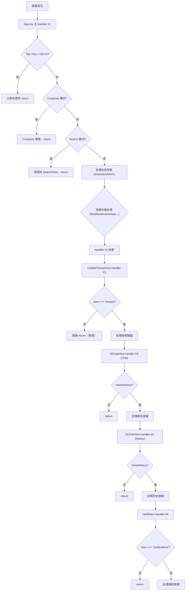

现在我已经收集了所有必要的信息。以下是完整的 Wiki 页面。

---

# TUI 键盘快捷键完全参考

本页是 `@bsky/tui` 终端客户端的完整快捷键地图。如果你是第一次使用，只需记住几个核心键就可以开始：

- **`t`** — 回到时间线
- **`j` / `↓`** — 向下移动光标
- **`k` / `↑`** — 向上移动光标
- **`Enter`** — 查看选中的帖子
- **`Esc`** — 返回上一页

## 键盘架构：Ink 的 `useInput` 与条件守卫

`@bsky/tui` 使用 **Ink** 框架（React 的终端渲染器）处理键盘输入。关键的概念是：**Ink 会在每次按键时，按注册顺序触发所有 `useInput` 处理函数**。每个处理函数必须通过条件守卫来"声明"自己何时应处理按键，何时应让按键"穿透"给其他处理函数。

### 注册点一览

代码中共有 **10 个 `useInput` 注册点**（原文档记载为 5 个，后续开发中新增）：

| # | 组件 | 文件位置 | 激活条件 |
|---|------|----------|----------|
| 1 | App（主处理函数） | `packages/tui/src/components/App.tsx#L217` | **始终激活** — 守卫内部按优先级处理 |
| 2 | FeedConfigOverlay | `packages/tui/src/components/App.tsx#L920` | 仅当 feed 配置覆盖层打开时 |
| 3 | UnifiedThreadView | `packages/tui/src/components/UnifiedThreadView.tsx#L68` | `currentView.type === 'thread'` |
| 4 | AIChatView（聊天模式） | `packages/tui/src/components/AIChatView.tsx#L169` | `showHistory === false` |
| 5 | AIChatView（历史模式） | `packages/tui/src/components/AIChatView.tsx#L254` | `showHistory === true` |
| 6 | NotifView | `packages/tui/src/components/NotifView.tsx#L20` | `currentView.type === 'notifications'` |
| 7 | ProfileView | `packages/tui/src/components/ProfileView.tsx#L49` | `currentView.type === 'profile'` |
| 8 | SearchView | `packages/tui/src/components/SearchView.tsx#L54` | `currentView.type === 'search'` |
| 9 | SettingsView | `packages/tui/src/components/SettingsView.tsx#L108` | `showSettings === true` |
| 10 | SetupWizard | `packages/tui/src/components/SetupWizard.tsx#L104` | 首次运行（`isFirstRun`） |

此外，还有一个 **`process.stdin.on('data')`** 原始监听器（`App.tsx#L609`）专门处理鼠标滚轮事件。

[来源](packages/tui/src/components/App.tsx#L217-L614)，[来源](packages/tui/src/components/UnifiedThreadView.tsx#L68-L145)，[来源](packages/tui/src/components/AIChatView.tsx#L169-L273)，[来源](packages/tui/src/components/NotifView.tsx#L20-L32)

### 守卫机制图示

**关键规则**：每个 handler 如果遇到自己不该处理的模式，**必须立即 return**，让按键继续传递给下一个 handler。例如 `NotifView` 在 `currentView.type !== 'notifications'` 时就直接返回。这种"穿透"机制是 Ink 应用的标准模式。

[来源](packages/tui/src/components/App.tsx#L217-L245)

---

## 全局导航键（所有视图生效）

以下按键在 **除 compose 外的所有视图** 中生效，由 App.tsx 的主 `useInput` 处理：

| 按键 | 动作 | 说明 |
|------|------|------|
| **`t`** | `goHome()` | 回到时间线（清除导航栈） |
| **`n`** | `goTo({ type: 'notifications' })` | 打开通知 |
| **`p`** | `goTo({ type: 'profile', actor: handle })` | 打开自己的个人资料 |
| **`s`** | `goTo({ type: 'search' })` | 打开搜索 |
| **`a`** | `goTo({ type: 'aiChat' })` | 打开 AI 聊天 |
| **`c`** | `goTo({ type: 'compose' })` | 打开写帖编辑器 |
| **`b`** | `goTo({ type: 'bookmarks' })` | 打开书签 |
| **`m`** | `goTo({ type: 'dm' })` | 打开私信（**feed 中 `m` 表示"加载更多"**） |
| **`L`**（大写） | `goTo({ type: 'lists' })` | 打开列表 |
| **`,`**（逗号） | `setShowSettings(true)` | 打开设置 |
| **`?`** | `goTo({ type: 'about' })` | 关于页面 |

[来源](packages/tui/src/components/App.tsx#L488-L498)

### 例外处理

- **Compose 视图**：全局导航键全部被 `if (currentView.type === 'compose')` 分支提前拦截
- **Thread 视图**：`c` 在 thread 中被线程自身拦截用于"回复"，全局 handler 跳过
- **AI Chat 视图（主面板聚焦时）**：`a` 和 `t` 导航到 feed，覆盖全局含义

[来源](packages/tui/src/components/App.tsx#L489-L497)

---

## 通用的 Tab 和 Esc

**Tab**：在 AI Chat 视图中切换 `focusedPanel`（`'main'` ↔ `'ai'`）；在 Compose 中（多帖时）循环切换当前编辑的帖子索引。

[来源](packages/tui/src/components/App.tsx#L219-L225)

**Esc**：行为因视图而异：

| 视图 | 第一次 Esc | 第二次 Esc |
|------|-----------|------------|
| AI Chat + 聚焦 AI 面板 | 取消聚焦 AI 面板 | `goBack()` |
| Compose + 输入图片路径 | 取消图片输入 | 提示保存草稿 → `goBack()` |
| Compose + 草稿列表/保存提示 | 关闭弹窗 | — |
| Thread / Profile / 通知 / 搜索 / 书签 | `goBack()` | — |
| Feed + FeedConfig 覆盖层 | 关闭覆盖层 | — |
| Feed（无覆盖层） | 无操作 | — |
| DM Chat | `goBack()` | — |
| 正在创建/编辑列表名 | 取消操作 | — |

[来源](packages/tui/src/components/App.tsx#L226-L244)

**`Ctrl+G`**（`\x07`）：在任何视图中启动 AI Chat，传入当前 thread URI 作为上下文（仅在 thread 视图中有效）。

[来源](packages/tui/src/components/App.tsx#L289)

---

## 各视图快捷键

### Feed 视图

| 按键 | 动作 |
|------|------|
| `j` / `↓` | 光标向下移动 |
| `k` / `↑` | 光标向上移动 |
| `PgUp` | 向上翻 5 条 |
| `PgDn` | 向下翻 5 条 |
| `Enter` | 查看选中帖子（进入 Thread 视图） |
| `m` | 加载更多（更早的帖子） |
| `r` | 刷新 Feed |
| `f` | 打开 Feed 配置覆盖层（切换/管理 Feed） |
| `v` | 收藏/取消收藏选中帖子 |
| `q` | 打开选中帖子的引用帖（若有 quote embed） |
| 鼠标滚轮上 | 光标上移 1 |
| 鼠标滚轮下 | 光标下移 1 |

**底部提示条**：`↑↓/jk:导航 Enter:查看 m:更多 r:刷新 f:切换Feed v:收藏 q:引用`

在 Feed 配置覆盖层（按 `f` 打开）中，额外支持：
- `jk` 导航
- `Enter` 选择 Feed
- `d` 删除 Feed
- `s` 设为默认
- `a` 添加自定义 Feed URI

[来源](packages/tui/src/components/App.tsx#L254-L255, L260-L265, L500-L516, L589-L593, L601-L607, L920-L956)

---

### Thread 视图

线程视图的按键由 `UnifiedThreadView.tsx` 处理，App.tsx 中对应此视图的全局导航键 (`t`, `a`, `c`, `b`, `p`, `n`, `s`) 仍然生效。

#### 导航

| 按键 | 动作 |
|------|------|
| `j` / `↓` | 光标下移（高亮，**不改变**聚焦帖子） |
| `k` / `↑` | 光标上移 |
| `Enter` | 将光标所在行设为新的聚焦帖子（完全重聚焦） |
| `h` / `H` | 回到根帖/主题帖 |

#### 光标行操作

| 按键 | 动作 |
|------|------|
| `l` / `L` | 点赞（已赞则无操作） |
| `r` | 转发（打开确认对话框） |
| `c` / `C` | 回复（打开 Compose，传入 replyTo） |
| `v` | 收藏切换 |
| `d` / `D` | 删除光标行帖子（仅自己发的，需 Y/N 确认） |
| `y` | **Yank URI** — 复制 `@handle uri bsky.app/...` 到 stderr（显示 5 秒） |
| `f` / `F` | 使用 AI 翻译光标行文本 |
| `u` / `U` | 关注/取关聚焦帖子的作者 |
| `g` / `G` | 跳转到聚焦帖子作者的个人资料 |

#### 转发确认对话框

| 按键 | 动作 |
|------|------|
| `y` / `Y` | 确认转发 |
| `n` / `N` 或 `Esc` | 取消转发 |
| `q` / `Q` | 打开引用帖 |

#### 删除确认对话框

| 按键 | 动作 |
|------|------|
| `y` / `Y` | 确认删除 |
| `n` / `N` 或 `Esc` | 取消删除 |

**底部提示条**：`h:主题帖 ↑↓/jk:移动 Enter:聚焦 c:回复 l:赞 r:转发 v:收藏 d:删除 f:翻译`

[来源](packages/tui/src/components/UnifiedThreadView.tsx#L68-L145)

---

### Compose 视图

Compose 中键盘焦点委托给 `TextInput` 组件。全局快捷键全部被拦截。Compose 有多种子模式：

#### 文本模式（默认）

| 按键 | 动作 |
|------|------|
| `Enter` | 提交帖子（发送） |
| `Esc` | 返回（若内容不为空则提示保存草稿） |
| `i` / `I` | 进入媒体路径输入模式（图片或视频，最多 4 图/1 视频） |
| `D` | 打开草稿列表（保存/加载/删除/同步） |
| `P` | 添加新帖到线程组合 |
| `X` | 从线程组合中移除当前帖子 |
| `f` / `F` | 进入润色需求输入模式 |
| `Tab` | 循环切换帖子索引（仅多帖时） |

#### 媒体路径输入模式

| 按键 | 动作 |
|------|------|
| `Enter` | 验证 + 上传媒体，然后进入 ALT 文本输入 |
| `Esc` | 取消媒体输入 |

#### ALT 文本输入模式

| 按键 | 动作 |
|------|------|
| `Enter` | 确认 ALT 文本 → 保存媒体 |
| `Esc` | 跳过 ALT → 以空 alt 保存媒体 |

#### 润色需求输入模式

| 按键 | 动作 |
|------|------|
| `Enter` | 提交需求 → 调用 AI 润色 |
| `Esc` | 取消润色 |

#### 润色结果模式

| 按键 | 动作 |
|------|------|
| `R` | 用润色结果替换当前帖子文本 |
| `C` | 复制结果到 stderr |
| `Esc` | 关闭结果 |

#### 草稿列表模式

| 按键 | 动作 |
|------|------|
| `j`/`k` 或 `↓`/`↑` | 导航草稿列表 |
| `Enter` | 加载选中的草稿 |
| `D` | 删除选中草稿 |
| `N` | 保存当前内容为新草稿并清空编辑器 |
| `S` | 同步（本地草稿） |
| `Esc` | 关闭草稿列表 |

#### 保存草稿提示

| 按键 | 动作 |
|------|------|
| `y` / `Y` | 保存草稿并返回 |
| `n` / `N` | 不保存，直接返回 |
| `Esc` | 取消返回 |

**底部提示条**：`Enter:发送 · Esc:取消 · i:媒体 · D:草稿 · f:润色 · P:加帖 · X:删帖`

[来源](packages/tui/src/components/App.tsx#L298-L483)

---

### AI Chat 视图

AI Chat 由 AIChatView 组件的两个 `useInput` 处理：一个用于聊天模式，一个用于历史模式。

#### 聊天模式（非历史）

| 按键 | 动作 | 条件 |
|------|------|------|
| `PgUp` | 上滚约 70% 可视高度 | 始终 |
| `PgDn` | 下滚约 70% 可视高度 | 始终 |
| `↑` | 上滚 3 行 | 仅 `focused === false` |
| `↓` | 下滚 3 行 | 仅 `focused === false` |
| `u` / `U` | 撤销最后一组对话（移除最后的 user+assistant） | `!loading` 且 `!focused` |
| `r` / `R` | 编辑最后一条消息（预填输入框） | `!loading` 且 `!focused` |
| `i` / `I` | 上传图片（输入文件路径后按 Enter） | `!loading` 且 `!focused` |
| `e` / `E` | 导出对话（1=JSON, 2=HTML, 3=MD） | `!loading` 且 `!focused` |
| `a` / `A` | 复制助手消息（输入编号选择） | `!loading` 且 `!focused` |
| `t` / `T` | 复制完整对话记录 | `!loading` 且 `!focused` |
| `p` / `P` | 暂停/停止 AI 响应 | `loading` 时 |

**写操作确认对话框**（打开时拦截所有其他键）：

| 按键 | 动作 |
|------|------|
| `y` / `Y` / `Enter` | 确认 — 执行写操作 |
| `n` / `N` / `Esc` | 拒绝 — 取消操作 |

当 `focused === true`（Tab 切换到 AI 面板）时，箭头键穿透给 TextInput 让用户正常输入。

**注意**：当 `focusedPanel === 'main'` 时，`a` 和 `t` 导航到 feed（覆盖全局含义）。

**底部提示条**（主面板聚焦时）：`Esc:返回 PgUp/PgDn:滚动 a:复制 r:编辑 t:全部复制 e:导出 i:图片`

#### 历史模式（showHistory === true）

| 按键 | 动作 |
|------|------|
| `Esc` | 返回 |
| `↑` | 在对话列表中上移 |
| `↓` | 在对话列表中下移 |
| `n` / `N` | 开始新对话 |
| `l` / `L` | 加载选中的对话 |
| `d` / `D` | 删除选中的对话 |

**底部提示条**：`Esc 返回 ↑↓:选 N:新建 L:加载 D:删除`

[来源](packages/tui/src/components/AIChatView.tsx#L169-L273)

---

### DM 视图

DM 列表由 App.tsx 的主 handler 处理，DMChatView **没有独立的 useInput**——它依赖 `TextInput.onSubmit` 处理发送。

#### DM 列表

| 按键 | 动作 |
|------|------|
| `j` / `↓` | 光标下移 |
| `k` / `↑` | 光标上移 |
| `Enter` | 打开选中的对话 |
| `r` | 刷新对话列表 |

**底部提示条**：`j/k:Nav Enter:Open r:Refresh`

#### DM 聊天

| 按键 | 动作 |
|------|------|
| `Esc` | 返回 DM 列表（由 App.tsx 全局处理） |
| `Enter` | 发送消息（由 TextInput onSubmit 处理） |

**底部提示条**：`输入消息 · Enter 发送 · Esc 返回`

[来源](packages/tui/src/components/App.tsx#L573-L587)，[来源](packages/tui/src/components/DMChatView.tsx#L15-L97)

---

### 通知视图

| 按键 | 动作 |
|------|------|
| `j` / `↓` | 光标下移 |
| `k` / `↑` | 光标上移 |
| `Enter` | 查看引用的帖子（若有 `reasonSubject`） |
| `r` / `R` | 刷新通知 |

**底部提示条**：`↑↓/jk:导航 Enter:查看帖子 R:刷新`

[来源](packages/tui/src/components/NotifView.tsx#L20-L32)

---

### 书签视图

| 按键 | 动作 |
|------|------|
| `j` / `↓` | 光标下移 |
| `k` / `↑` | 光标上移 |
| `Enter` | 查看书签帖子（进入 Thread） |
| `d` | 删除选中书签 |
| `r` | 刷新书签列表 |
| `q` | 打开引用帖 |

**底部提示条**：`↑↓/jk:导航 Enter:查看 d:删除 r:刷新 q:引用`

[来源](packages/tui/src/components/App.tsx#L256-L257, L519-L532)

---

### 列表视图

**全局快捷键**：`L`（大写，区别于 thread 中的 `l`=点赞）

#### 列表列表

| 按键 | 动作 |
|------|------|
| `j` / `↓` | 光标下移 |
| `k` / `↑` | 光标上移 |
| `Enter` | 打开选中的列表 |
| `d` | 删除选中列表 |
| `r` | 刷新列表 |
| `c` | 创建新列表 |
| `e` | 编辑列表名 |

#### 列表详情

| 按键 | 动作 |
|------|------|
| `Tab` | 切换 Posts / Members 标签页 |
| `j` / `↓` | 光标下移 |
| `k` / `↑` | 光标上移 |
| `Enter` | 查看帖子或个人资料 |
| `r` | 刷新 |

**底部提示条**：
- 列表：`j/k:Nav Enter:View c:Create d:Delete r:Refresh Esc:Back`
- 列表详情：`Tab:Switch j/k:Nav Enter:View r:Refresh Esc:Back`

[来源](packages/tui/src/components/App.tsx#L535-L571)

---

### 个人资料视图

ProfileView 有自己的 `useInput`，但与 App.tsx 全局 handler 同时运行。

| 按键 | 动作 | 条件 |
|------|------|------|
| `Esc` | 返回 | 始终 |
| `Tab` / `←` / `→` | 切换 Posts / Replies 标签 | 始终 |
| `j` / `k` / `↑` / `↓` | 导航帖子列表 | 始终 |
| `Enter` | 查看选中帖子 | 始终 |
| `a` / `A` | 用个人资料上下文打开 AI Chat | 始终 |
| `f` / `F` | 翻译个人资料简介 | 始终 |
| `u` / `U` | 关注/取关 | 始终 |
| `m` | 加载更多帖子 | 始终 |
| `p` | 打开关注列表 | 始终 |
| `P` | 打开粉丝列表 | 始终 |

在关注/粉丝列表中：
| `Esc` | 关闭列表 | — |
| `j`/`k` 或 `↓`/`↑` | 导航 | — |
| `Enter` | 查看选中个人资料 | — |
| `m` | 加载更多关注/粉丝 | — |

[来源](packages/tui/src/components/ProfileView.tsx#L49-L97)

---

### 搜索视图

| 按键 | 动作 |
|------|------|
| `Esc` | 返回 |
| `Tab` | 切换标签页（Top / Latest / Users / Feeds） |
| `Enter` | 提交搜索查询 / 查看选中结果 |
| `j` / `k` / `↑` / `↓` | 导航结果列表 |

[来源](packages/tui/src/components/SearchView.tsx#L54-L80)

---

### 设置视图

| 按键 | 动作 |
|------|------|
| `Esc` | 关闭设置 |
| `Tab` / `↑` / `↓` | 导航设置字段 |

[来源](packages/tui/src/components/SettingsView.tsx#L108)

---

### 首次运行向导

| 按键 | 动作 |
|------|------|
| `Tab` / `↓` | 移到下一个字段 |
| `↑` | 移到上一个字段 |
| `Enter` | 提交当前字段（由 TextInput onSubmit 处理） |

[来源](packages/tui/src/components/SetupWizard.tsx#L104-L134)

---

## 键冲突表

同一个键在不同视图中含义不同：

| 键 | Feed | Thread | 书签 | 通知 | AI Chat | Compose |
|-----|------|--------|-------|------|---------|---------|
| `t` | 回到首页 | 回到首页 | 回到首页 | 回到首页 | 回到 Feed（主聚焦） | 被拦截 |
| `a` | 去 AI Chat | 去 AI Chat | 去 AI Chat | 去 AI Chat | 回到 Feed（主聚焦） | 被拦截 |
| `c` | 去 Compose | **回复** ⚠️ | 去 Compose | 去 Compose | 去 Compose | 被拦截 |
| `b` | 去书签 | 去书签 | 去书签（全局） | 去书签 | 去书签 | 被拦截 |
| `r` | 刷新 | 转发确认 | — | 刷新 | — | 被拦截 |
| `l` | — | 点赞 | — | — | 加载对话（历史） | 被拦截 |
| `d` | — | 删除帖子 | 删除书签 | — | 删除对话（历史） | 被拦截 |
| `h` | — | 回到根帖 | — | — | — | 被拦截 |
| `y` | — | Yank URI | — | — | — | 被拦截 |
| `f` | 切换 Feed | 翻译 | — | — | — | 被拦截 |
| `i` | — | — | — | — | 上传图片 | **添加媒体** |
| `,` | 设置 | 设置 | 设置 | 设置 | 设置 | 设置 |
| `Enter` | 查看 Thread | 重聚焦帖子 | 查看 Thread | 查看帖子 | TextInput | 提交 |
| `m` | **加载更多** | — | — | — | — | 被拦截 |

**⚠️ 关于 Thread 中的 `c`**：全局 handler 在 `currentView.type === 'thread'` 时跳过 `c`，只有 Thread 本地的 `c`（带 replyTo 上下文）生效。[来源](packages/tui/src/components/App.tsx#L494)

---

## 全局保留键

以下按键永久保留，**不能**被视图级快捷键复用：

| 键 | 原因 |
|----|------|
| `t`, `n`, `p`, `s`, `a`, `c`, `b`, `m`, `L` | 全局导航（`m` 在 Feed 中也用于"加载更多"） |
| `Esc` | 通用返回 |
| `Tab` | AI 面板焦点切换 / Compose 帖子循环 |
| `Ctrl+G` | AI Chat 启动器 |

---

## 添加新快捷键的流程

1. **检查全局保留键表** — 不要使用上面保留的键
2. **检查冲突表** — 避免与其他视图已有含义的键冲突
3. **从可用键池中选择**：`f`, `z`, `x`, `w`, `u`, `o`, `g`, `q`, `e`, `d`（书签除外）、`l`（thread/AI-history 除外）、`h`（thread 除外）、`y`（thread 除外）、`i`（compose 除外）、`,`（逗号）
4. **在对应组件中添加 `useInput` / switch case**
5. **更新 i18n 语言文件**中的底部提示条（`keys.*` 键值）
6. **更新本文档**

---

## 下一步

了解了所有快捷键后，建议阅读  了解 Ink 如何将 React 组件渲染到终端，或者查看  理解背后驱动的状态机。