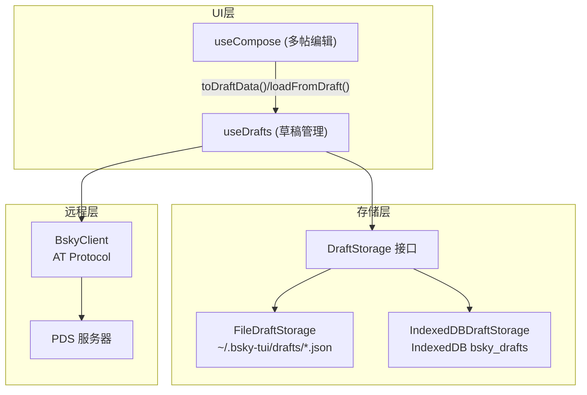

# 发帖与草稿管理

发帖是社交客户端的核心操作。本页分析两个层次：`useCompose` 提供的多帖线程编辑模型，以及 `DraftStorage` 接口定义的双存储策略。两者共同构成了从编辑、保存到提交的完整闭环。

## 多帖线程模型

`useCompose` 的核心数据结构是 `ComposePostItem[]` 数组——每个元素代表线程中的一篇帖子。

```typescript
export interface ComposePostItem {
  id: string;
  text: string;
}
```

[来源](packages/app/src/hooks/useCompose.ts#L13-L16)

### 线程构造的三元操作

| 操作 | 签名 | 语义 |
|---|---|---|
| `addPost` | `() => void` | 在末尾追加一篇空帖子 |
| `removePost` | `(id: string) => void` | 按 ID 移除帖子（至少保留一篇） |
| `setPostText` | `(id: string, text: string) => void` | 更新指定帖子的文本，自动截断至 300 字符 |

[来源](packages/app/src/hooks/useCompose.ts#L34-L48)

`addPost` 使用 `crypto.randomUUID()` 生成唯一 ID 确保每篇帖子可被独立寻址。`removePost` 内置保护逻辑：当数组长度 <= 1 时拒绝删除，防止用户误删最后一份草稿导致空白状态。

### 线程提交的回复链逻辑

`submit` 方法的精髓在于自动构建线程的回复链：

- **首帖**：如果设置了 `replyTo`（对外回复），则回复到目标 URI；否则成为线程的 `rootUri`。
- **后续帖**：依次回复前一篇已发布的帖子，形成一条链。第一帖的 `root` 是整个线程的根，后续帖的 `parent` 是前一篇帖子的 URI。

```typescript
// 第一帖：设置 reply 锚点到外部帖子
if (i === 0 && replyTo) { /* reply to external URI */ }
// 后续帖：chain 到前一帖
else if (i > 0 && rootUri && rootCid) {
  record.reply = {
    root: { uri: rootUri, cid: rootCid },
    parent: { uri: createdUris[i - 1], cid: createdCids[i - 1] },
  };
}
```

[来源](packages/app/src/hooks/useCompose.ts#L85-L101)

嵌入（引用帖、图片、视频）仅作用于首帖。这种设计符合 Bluesky 的典型 UX：引用帖出现在线程头部，后续帖是纯粹的文本延续。

### 部分提交失败处理

发布循环中如果中途出错，`submit` 不会回滚已发布的帖子。它会返回提示："已发布 N 篇，剩余 M 篇因错误未发布"，并将编辑器状态清空为空白。这个权衡意味着**最终一致性优先于原子性**——用户只需补发失败的帖子即可。

[来源](packages/app/src/hooks/useCompose.ts#L206-L213)

---

## DraftStorage 接口

`DraftStorage` 定义了四个操作，构成草稿持久化的最小完整基元：

```typescript
export interface DraftStorage {
  getAll(): Promise<AppDraft[]>;
  get(id: string): Promise<AppDraft | undefined>;
  set(draft: AppDraft): Promise<void>;
  delete(id: string): Promise<void>;
}
```

[来源](packages/app/src/services/draftStorage.ts#L16-L21)

`AppDraft` 数据模型携带元信息和同步状态：

```typescript
export interface AppDraft {
  id: string;                    // 本地 UUID
  serverId?: string;             // PDS 端 ID（同步后赋值）
  posts: { text: string }[];    // 多帖内容
  replyTo?: string;
  quoteUri?: string;
  createdAt: string;
  updatedAt: string;
  syncStatus: 'local' | 'synced' | 'modified';
}
```

[来源](packages/app/src/services/draftStorage.ts#L5-L14)

### 双实现：平台适配

| 实现类 | 平台 | 存储后端 |
|---|---|---|
| `FileDraftStorage` | TUI (Node.js) | `~/.bsky-tui/drafts/*.json` |
| `IndexedDBDraftStorage` | PWA (浏览器) | IndexedDB `bsky_drafts` 数据库 |

**FileDraftStorage** 的实现直截了当：每篇草稿一个 JSON 文件，文件名为 `{id}.json`。构造函数自动创建 `~/.bsky-tui/drafts/` 目录。`getAll()` 遍历目录下的 `.json` 文件，反序列化并按 `updatedAt` 降序排列，跳过损坏文件。

[来源](packages/app/src/services/draftStorage.ts#L23-L70)

**IndexedDBDraftStorage** 使用 `indexedDB.open` 打开 `bsky_drafts` 数据库，在 `drafts` 对象存储中以 `id` 为主键进行 CRUD。`getDB()` 方法缓存数据库连接实例，避免重复打开。

[来源](packages/pwa/src/services/indexeddb-draft-storage.ts#L1-L75)

### 工厂模式：平台感知的默认存储

`setDraftStorageFactory` / `getDefaultDraftStorage` 构成模块级单例的工厂模式：

```typescript
export function getDefaultDraftStorage(): DraftStorage {
  if (!_defaultDraftStorage) {
    if (_draftStorageFactory) {
      _defaultDraftStorage = _draftStorageFactory();        // 显式注入
    } else {
      // 自动检测：Node.js → FileDraftStorage
      // 浏览器未注入 → 抛错
    }
  }
  return _defaultDraftStorage;
}
```

[来源](packages/app/src/services/draftStorage.ts#L80-L100)

TUI 启动时注入文件存储，PWA 启动时注入 IndexedDB 存储：

```typescript
// TUI: packages/tui/src/cli.ts
setDraftStorageFactory(() => new FileDraftStorage());

// PWA: packages/pwa/src/App.tsx
setDraftStorageFactory(() => new IndexedDBDraftStorage());
```

[来源](packages/tui/src/cli.ts#L15-L17) | [来源](packages/pwa/src/App.tsx#L38)

---

## PDS 远程草稿同步

`useDrafts` 中的 `DraftStore` 是草稿管理的高层抽象，它在本地 `DraftStorage` 之上叠加了 PDS 远程同步层。

### 同步策略

保存草稿时（`saveDraft`）：先尝试 PDS 远程写入，再写入本地存储。

```typescript
if (_clientRef?.isAuthenticated()) {
  try {
    if (draft.serverId) {
      await _clientRef.updateDraft(draft.serverId, { posts: draft.posts });
    } else {
      const res = await _clientRef.createDraft({ posts: draft.posts });
      draft.serverId = res.id;
    }
    draft.syncStatus = 'synced';
  } catch {
    draft.syncStatus = 'local';   // PDS 不可用时降级为本地
  }
}
await storage.set(draft);          // 始终写入本地
```

[来源](packages/app/src/hooks/useDrafts.ts#L54-L72)

刷新草稿列表时（`refreshDrafts`）：先加载本地草稿，再向 PDS 拉取远程草稿列表。远程草稿按 `serverId` 匹配本地草稿，如果存在则用服务器内容覆盖（服务器权威），如果不存在则新建本地副本。最终合并列表按 `updatedAt` 降序排列。

[来源](packages/app/src/hooks/useDrafts.ts#L123-L189)

### BskyClient 的远程 API

PDS 端草稿 API 通过 AT Protocol 扩展实现，`BskyClient` 暴露四个方法：

| 方法 | 端点 | 说明 |
|---|---|---|
| `createDraft(draft: DraftInput)` | `app.bsky.draft.createDraft` | 创建远程草稿 |
| `updateDraft(id, draft: DraftInput)` | `app.bsky.draft.updateDraft` | 更新已有草稿 |
| `getDrafts(limit, cursor)` | `app.bsky.draft.getDrafts` | 分页获取远程草稿列表 |
| `deleteDraft(id)` | `app.bsky.draft.deleteDraft` | 删除远程草稿 |

[来源](packages/core/src/at/client.ts#L613-L641)

### DraftInput：跨设备同步的设计

`DraftInput` 接口是 PDS 端接收的草稿数据格式，其设计直接服务于跨设备同步：

```typescript
export interface DraftInput {
  posts: DraftPostInput[];   // 多帖内容
  deviceId?: string;         // 来源设备标识
  deviceName?: string;       // 来源设备名称（可读）
  langs?: string[];          // 语言标签
}
```

[来源](packages/core/src/at/types.ts#L291-L296)

`deviceId` 和 `deviceName` 允许 PDS 在草稿列表中标注来源设备——用户在桌面端编写的草稿同步到手机上时，可以清晰识别"这是从哪台设备创建的"。这避免了多设备场景下的草稿冲突困惑。`langs` 字段为 AI 润色和翻译功能提供上下文语言提示，相关机制参见 [翻译与草稿润色](翻译与草稿润色.md)。

---

## Widget 草稿桥接

在 Widget 系统中，右侧面板的组件（如 AI 润色 Widget）需要读取或写入编辑区中的草稿文本。`widgetStore` 提供了单向的数据桥接：

```typescript
setComposeDraftForWidgets(text: string)  // Compose 写入最新文本
getComposeDraftForWidgets(): string       // Widget 读取文本
registerComposeDraftSetter(fn)            // Widget 注册写入方法
replaceComposeDraft(text: string)         // Widget 替换草稿文本
```

[来源](packages/app/src/hooks/widgetStore.ts#L60-L67)

这个设计确保 Widget 不需要直接引用 `useCompose` 的 React state，通过模块级变量实现松散耦合。详细机制参见 [Widget 系统与组合](widget-系统与组合.md)。

---

## 架构全景



相关性：导航系统通过 `AppView` 联合类型将 `{ type: 'compose' }` 路由到发帖页面，详见 [导航与状态管理](导航与状态管理.md)。AI 润色功能调用 `useCompose` 的 `setPostText` 替换草稿内容，详见 [翻译与草稿润色](翻译与草稿润色.md)。