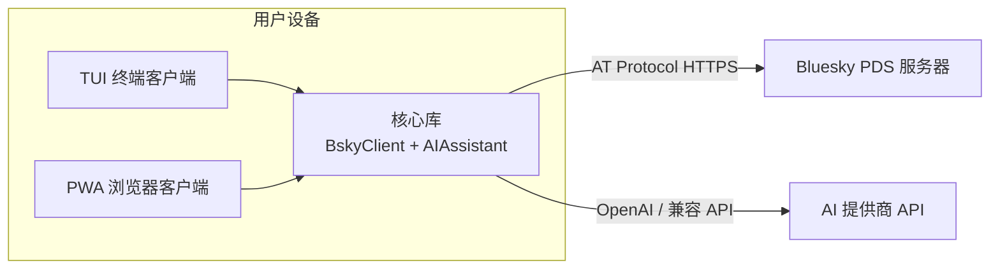

现在我开始撰写概览页面。

---

# 🦋 Bluesky 客户端：双界面 × AI 驱动的社交工具

**Bluesky Client** 是一个同时提供**终端（TUI）**和**浏览器（PWA）**双界面的 Bluesky 客户端，核心卖点是与 **AI 深度集成**——不止于聊天，AI 可以直接操控你的 Bluesky 账户。整个项目只有静态文件，**零后端**，你的凭证和数据从不离开你的设备。

如果你用过 Bluesky 官方客户端，会发现它能做的事有限：刷 timeline、发帖、私信……而已。而这个项目试图回答一个问题：**当 AI 能帮你读帖、分析线程、管理列表、润色草稿时，社交网络的体验可以变成什么样？**

[来源](README.md#L1-L4)

---

## 核心问题：为什么需要这个项目？

Bluesky 官方客户端（以及大多数第三方客户端）只提供了"人手动操作"的体验。但社交网络中有大量**重复性、信息密集型**的操作：

- 想了解某个帖子的讨论脉络？需要手动展开、翻看所有回复。
- 想管理多个列表的成员？需要逐一点击添加/移除。
- 想用另一种语言发帖？需要复制到翻译工具再贴回来。
- 信息过载时，想让 AI 帮你总结 timeline？

项目回应了这些场景：**让 AI 成为你的社交助手**，而不是一个独立的聊天机器人。AI 拥有 36 个工具，可以读你的 timeline、分析帖子、管理列表、发帖、点赞、关注——几乎覆盖 Bluesky AT Protocol 的全部能力。

[来源](README.md#L14-L26)

---

## 零后端架构：一切在客户端完成

从架构层面上说，整个项目最反直觉的一点是：**它没有后端服务器**。



无论是 TUI 还是 PWA，都直接通过 HTTPS 调用 Bluesky 的 **AT Protocol API** 和 AI 提供商的 API。没有中间件、没有代理、没有服务器端会话。这意味着：

- **部署即托管静态文件**——PWA 可以部署到 Cloudflare Pages、Netlify 等任何静态托管平台。
- **凭证在本地**——TUI 从 `.env` 读取 Bluesky 凭证和 AI key；PWA 在浏览器中通过登录表单输入，存储在 `localStorage`。两者都不会发送到任何第三方服务器。
- **离线可行**——PWA 有 Service Worker，可以通过 `IndexedDB` 存储聊天历史和配置。

[来源](README.md#L24-L26) | [来源](docs/ARCHITECTURE.md#L1-L4)

---

## Monorepo 三层拆分：core → app → tui/pwa

项目采用 pnpm workspace monorepo，四个包按依赖方向排列：

```
@bsky/core  ──→  @bsky/app  ──→  @bsky/tui  (Ink 终端 UI)
                              └─→  @bsky/pwa  (React DOM + Tailwind, PWA)
```

这三层的设计意图非常清晰：

| 层级 | 包名 | 职责 | 关键依赖 |
|------|------|------|----------|
| **Layer 0** | `@bsky/core` | 纯 TypeScript，零 UI 依赖。含 AT Protocol 客户端、AI 引擎、36 个工具、提示词模板、类型定义。 | ky（HTTP）、openai |
| **Layer 1** | `@bsky/app` | React Hooks + 纯 Store。封装了所有业务逻辑的状态管理，TUI 和 PWA 共享同一套 Hook。 | react、@bsky/core |
| **Layer 2 - TUI** | `@bsky/tui` | Ink 终端 UI。键盘驱动、viewport 渲染、鼠标滚轮支持。 | ink、react、@bsky/app |
| **Layer 2 - PWA** | `@bsky/pwa` | React DOM + Tailwind 浏览器 UI。哈希路由、IndexedDB、PWA manifest。 | react-dom、tailwindcss、@bsky/app |

核心设计原则：**core 不依赖任何 UI 框架**，理论上可以被任何前端框架甚至 Node.js 脚本直接使用。app 层封装了 React Hooks，但 store 本身是纯函数——PWA 和 TUI 共享同一套 `useAuth`、`useTimeline`、`useAIChat` 等 Hook，差异只体现在渲染组件上。

[来源](docs/ARCHITECTURE.md#L63-L86)

---

## 功能矩阵：它能做什么？

项目覆盖了 Bluesky 社交功能的绝大部分，外加 AI 增强。

| 功能域 | 能力 | AI 增强 |
|--------|------|---------|
| **Feed 时间线** | 关注 / 发现 / 自定义 Feed，虚拟滚动，滚动位置恢复 | AI 可读取时间线内容并分析 |
| **帖子与线程** | 完整回复树、引用帖卡片、展开/折叠 | AI 可分析线程、提取关键观点 |
| **发帖** | 多帖线程组合、图片+ALT 文本、草稿自动保存 | AI 可代发帖、润色草稿、翻译 |
| **列表** | 创建/编辑/删除列表、添加/移除成员、列表 Feed（15 个 API 方法） | AI 可管理列表成员 |
| **书签** | 内置 API 书签、任意帖子切换、虚拟滚动 | — |
| **私信** | 直接消息、表情反应、引用帖子、静音会话 | — |
| **搜索** | 热门/最新/用户/Feed 四标签 | — |
| **通知** | 实时刷新、标记已读 | — |
| **个人资料** | 关注/取消关注、编辑头像/横幅/昵称 | AI 可查看和分析个人资料 |
| **AI Chat** | 36 个工具（读/写/列表）、流式输出、思考过程显示、视觉模式、对话导出导入 | **这是核心功能** |
| **翻译** | 7 种语言、双语模式（simple / JSON 带源语言检测） | AI 驱动翻译 |
| **草稿润色** | AI 根据风格要求重写草稿 | AI 驱动润色 |
| **国际化** | 中文 / English / 日本語 三语言即时切换 | — |
| **主题** | CSS 变量暗色模式、跟随系统 | — |
| **PWA 能力** | 可安装、manifest.json、Service Worker | — |

[来源](README.md#L30-L48)

---

## 🔥 设计亮点

### 1. AI 36 个工具：读写分离 + 确认门

AI 不是"问一句答一句"的聊天机器人——它拥有 36 个具体工具，可以直接操作你的 Bluesky 账户。这些工具分为三类：

- **读工具（readonly）**：`resolve_handle`、`get_timeline`、`get_post_thread`、`get_profile` 等，可以读取任何公开数据。
- **写工具（requiresWrite）**：`create_post`、`like`、`repost`、`follow`、`create_list`、`add_to_list`、`remove_from_list` 等，会修改你的账户数据。
- **辅助工具**：`fetch_web_markdown`（抓取网页内容供 AI 阅读）、`view_image`（查看帖子图片）、`extract_images_from_post`（提取帖子图片 URL）等。

每个工具在定义时通过 `readonly: true/false` 标记读写属性。AI 引擎内部有一个 **写操作确认门（confirmation gate）**：当 AI 决定调用一个写工具时，引擎不会立即执行，而是先挂起等待用户确认。用户可以选择批准或取消。

```typescript
// 写确认门的核心逻辑（简化）
if (toolDesc.requiresWrite) {
  const approved = await this._waitForConfirmation();
  if (!approved) {
    toolResult = 'User cancelled the operation.';
  }
}
```

这个设计解决了 AI 自主操作的最大风险：**你始终有最终否决权**。AI 可以"提议"发帖、点赞、关注，但真正执行前需要你点头。

[来源](packages/core/src/ai/tools.ts#L57) | [来源](packages/core/src/ai/assistant.ts#L99-L101) | [来源](packages/core/src/ai/assistant.ts#L247-L260) | [来源](packages/core/src/ai/assistant.ts#L594-L605)

### 2. 双界面共享一套业务逻辑

TUI 和 PWA 看起来完全不同——终端里是键盘驱动的文本界面，浏览器里是鼠标驱动的图形界面——但它们背后的逻辑完全一样。两者都调用 `@bsky/app` 中的同一组 React Hooks：

- `useAuth` 管理认证
- `useTimeline` 加载时间线
- `useAIChat` 驱动 AI 对话
- `useCompose` 管理发帖草稿
- `useLists` 管理用户列表
- 等等 20+ 个 Hook

差异只在**渲染层**：TUI 用 Ink 组件渲染终端字符，PWA 用 React DOM + Tailwind 渲染 HTML。甚至连数据存储接口 `ChatStorage` 都是抽象的——TUI 用 JSON 文件存储聊天历史，PWA 用 IndexedDB。

[来源](docs/ARCHITECTURE.md#L99-L113)

### 3. 多提供商 AI 引擎

AI 引擎不是绑定某一家提供商。它支持 OpenAI 兼容 API 的任何提供商（OpenAI、Azure OpenAI、本地 ollama、vLLM 等），通过提供者注册表管理不同提供商的模型信息、API base URL、以及是否需要 `thinking` 参数。

这意味着你可以选择使用 GPT-4o、Claude（通过兼容 API）、或者本地运行的开源模型——代码不需要改动。

[来源](packages/core/src/ai/providers.ts#L26-L53)

---

## 下一步去哪里？

- **[快速开始](快速开始.md)**——5 分钟内分别在终端和浏览器中启动客户端
- **[项目结构导览](项目结构导览.md)**——详细了解 monorepo 每个目录的职责
- **[AI 36 个工具：从定义到执行](36-个-ai-工具-从定义到执行.md)**——深入每个工具的定义和执行机制
- **[AIAssistant：多提供商 LLM 引擎](aiassistant-多提供者-llm-引擎.md)**——流式/非流式调用、工具循环、确认门完整实现
- **[BskyClient：AT Protocol 客户端实现](bskyclient-at-protocol-客户端实现.md)**——完整的 Bluesky API 客户端、会话管理、JWT 自动刷新

---

> **项目状态**：v0.6.0 · MIT 许可 · [GitHub 仓库](https://github.com/epheiamoe/bsky) · [在线 Demo](https://ai-bsky.pages.dev)