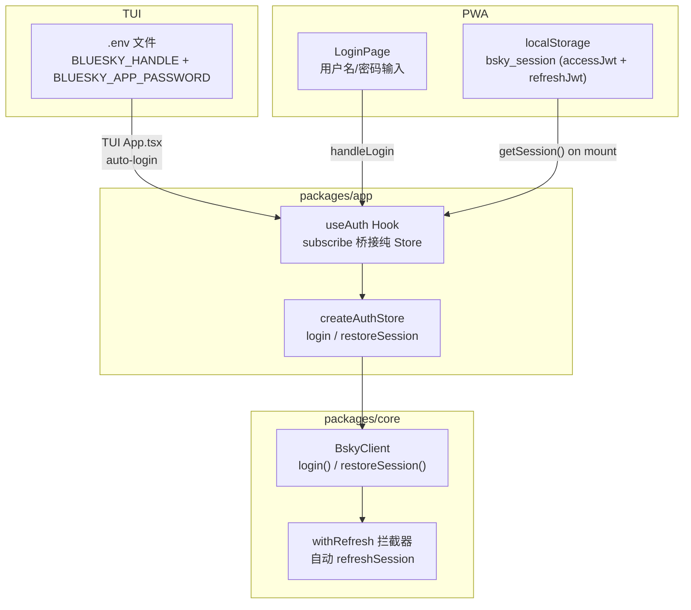

# 认证与会话管理

## 架构概览

认证体系由三层组成，自底向上依次为：**传输层**（BskyClient 的 HTTP 客户端与 JWT 刷新机制）、**状态层**（createAuthStore 纯 Store）、**视图层**（useAuth Hook 及 PWA 持久化逻辑）。三个界面（TUI、PWA 浏览器）共享同一套认证核心，仅在凭证来源和持久化策略上分化。



## createAuthStore：纯状态机

`createAuthStore()` 返回一个无框架依赖的 **纯 Store 对象**，内部维护四个核心状态字段：

| 字段 | 类型 | 含义 |
|------|------|------|
| `client` | `BskyClient \| null` | 认证后的 API 客户端实例 |
| `session` | `CreateSessionResponse \| null` | 会话数据（含 accessJwt / refreshJwt） |
| `profile` | `ProfileView \| null` | 当前用户个人资料 |
| `loading` | `boolean` | 登录请求进行中 |
| `error` | `string \| null` | 错误消息或 `'session_expired'` |

[来源](packages/app/src/stores/auth.ts#L4-L16)

纯 Store 通过经典的 **发布-订阅模式** 与 UI 层通信：`subscribe(fn)` 注册监听器，`_notify()` 触发更新。这种模式与 [React Hooks 架构与 Store 模式](react-hooks-架构与-store-模式.md) 中描述的架构一致——Store 本身不依赖 React。

### login 流程

`store.login(handle, password)` 的执行顺序是一条清晰的**三阶段调用链**：

1. **创建 BskyClient**：`new BskyClient()` 初始化三个 ky 实例（bsky.social / public.api.bsky.app / api.bsky.chat），并挂载 `withRefresh` 钩子。
2. **createSession**：调用 `c.login(handle, password)` 向 `com.atproto.server.createSession` 发送 POST，返回包含 `accessJwt`、`refreshJwt`、`handle`、`did` 的会话对象。
3. **获取 profile**：用刚得到的 JWT 调用 `c.getProfile(handle)`，将 `ProfileView` 存入 store。

三阶段的任一阶段失败都会将 `store.error` 设为错误消息，`store.loading` 在 finally 块中重置为 `false`。

[来源](packages/app/src/stores/auth.ts#L27-L42)

### restoreSession 与过期处理

`store.restoreSession(session)` 是 login 的逆操作——从已有的 session 数据恢复客户端，**不发起任何网络请求**：

1. 新建 BskyClient 实例
2. 调用 `c.restoreSession(session)` 直接设置 `this.session`
3. 异步获取 profile（网络请求）
4. 若获取 profile 失败且 `c.isAuthenticated()` 返回 `false`（例如 refresh 也失败），则清空 client 和 session，将 error 设为 `'session_expired'`

这个设计让 PWA 在页面刷新时能立即呈现已登录状态（profile 数据随后异步到达），而不是先显示加载页。

[来源](packages/app/src/stores/auth.ts#L44-L60)

## useAuth：React 桥接

`useAuth()` 是纯 Store 的 React Hook 封装，遵循 [React Hooks 架构与 Store 模式](react-hooks-架构与-store-模式.md) 中描述的"useState 种子 + useEffect 订阅"模式：

```typescript
export function useAuth() {
  const [store] = useState(() => createAuthStore());
  const [, force] = useState(0);
  const tick = useCallback(() => force(n => n + 1), []);
  useEffect(() => store.subscribe(tick), [store, tick]);
  return {
    client: store.client,
    session: store.session,
    profile: store.profile,
    loading: store.loading,
    error: store.error,
    login: (h, p) => store.login(h, p),
    restoreSession: (s) => store.restoreSession(s),
  };
}
```

`store` 通过 `useState` 惰性初始化**仅一次**，`subscribe` 在组件挂载时注册重渲染回调，整个生命周期内不存在重复创建 store 的问题。暴露的 `login` 和 `restoreSession` 直接委托给 store 的同名方法。

[来源](packages/app/src/hooks/useAuth.ts#L6-L22)

## BskyClient.login：AT Protocol 会话创建

`BskyClient.login(handle, password)` 是认证的**网络入口**，它向 `com.atproto.server.createSession` 发送 credentials，并将返回的 `CreateSessionResponse` 存入 `this.session`。响应中包含两个 JWT：

- **accessJwt**：短时效（约 2 小时），用于后续 API 请求的 Authorization header
- **refreshJwt**：长时效，用于自动续期 accessJwt

[来源](packages/core/src/at/client.ts#L132-L138) | [来源](packages/core/src/at/types.ts#L246-L254)

### 自动 JWT 刷新机制

BskyClient 在两个有状态 API 实例（`this.ky` 和 `this.chatKy`）上注册了 `afterResponse` 钩子 `withRefresh`。该钩子的工作逻辑：

1. 检查响应是否为 `400` 状态且 body 包含 `ExpiredToken` 或 `InvalidToken` 错误
2. 使用**共享 Promise 锁**（`_refreshPromise`）防止并发刷新：第一个 400 触发刷新，后续 400 等待同一个 Promise
3. 用 `refreshJwt` 向 `com.atproto.server.refreshSession` 发起 POST 请求
4. 刷新成功后，用新的 `accessJwt` **自动重试**原始请求
5. 若刷新失败（网络错误或 refreshJwt 也过期），将 `this.session` 置为 `null`

刷新前的 200ms 延迟（`setTimeout(r => r(), 200)`）是为了合并短时间内的批量请求的过期失败。

公共 API 实例 `this.publicKy` **没有**注册此钩子，因为它根本不需要认证。

[来源](packages/core/src/at/client.ts#L62-L124)

## PWA：localStorage 会话持久化

PWA 使用 `useSessionPersistence.ts` 将 session 存放到浏览器的 `localStorage`，key 为 `bsky_session`：

```typescript
interface StoredSession {
  accessJwt: string;
  refreshJwt: string;
  handle: string;
  did: string;
}
```

[来源](packages/pwa/src/hooks/useSessionPersistence.ts#L1-L8)

PWA App 组件在三个生命周期节点与持久化层交互：

| 时机 | 操作 | 实现 |
|------|------|------|
| **页面加载** | 从 localStorage 恢复 session | `getSession()` → `restoreSession()` |
| **登录成功** | 保存 session 到 localStorage | `saveSession({ accessJwt, refreshJwt, handle, did })` |
| **登出或 session 过期** | 清除 localStorage | `clearSession()` + `setIsLoggedIn(false)` |

`restoreSession` 调用后，profile 数据会异步到达，UI 无须等待即可进入主界面。这种"先展示、后填充"的策略让首次加载体验接近原生应用。

[来源](packages/pwa/src/App.tsx#L154-L187)

## TUI：环境变量凭证管理

TUI 是终端应用，没有浏览器 localStorage，因此采用**环境变量**配置凭证：

```bash
BLUESKY_HANDLE=your-handle.bsky.social
BLUESKY_APP_PASSWORD=your-app-password
```

[来源](.env.example#L1-L4)

`cli.ts` 中的 `getConfigFromEnv()` 读取这两个环境变量，若任一缺失则返回 `null`（触发 SetupWizard 引导用户配置）。

[来源](packages/tui/src/cli.ts#L63-L66)

### TUI 自动登录与断线重连

TUI App 组件在挂载后立即自动登录：

```typescript
useEffect(() => {
  if (!authLoading) login(config.blueskyHandle, config.blueskyPassword);
}, []);
```

同时监听 `client` 的认证状态变化，当已认证状态丢失时（例如系统休眠后 session 过期），自动重新登录：

```typescript
useEffect(() => {
  if (client?.isAuthenticated()) {
    setWasAuthenticated(true);
  } else if (wasAuthenticated) {
    setWasAuthenticated(false);
    login(config.blueskyHandle, config.blueskyPassword);
  }
}, [client]);
```

这种设计保证了 TUI 在长时间运行后仍能自动恢复会话，不会因 token 过期而需要手动重启。

[来源](packages/tui/src/components/App.tsx#L148-L162)

## 两界面的认证策略对比

| 维度 | PWA（浏览器） | TUI（终端） |
|------|--------------|-------------|
| 凭证来源 | LoginPage 用户输入 | `.env` 环境变量 |
| 持久化媒介 | `localStorage` | 无持久化，每次启动重新登录 |
| 页面刷新/重启 | 自动从 localStorage 恢复 | 自动从环境变量重新登录 |
| 登录触发时机 | 用户手动提交表单 | 应用启动自动触发 |
| 断线重连 | 通过 `session_expired` 错误触发登出页 | 通过 `isAuthenticated` 变化自动重登录 |
| 额外 UI | LoginPage 组件 | SetupWizard 引导配置 |

关于凭证配置的更多细节，参见 [环境变量与配置](环境变量与配置.md)。关于 BskyClient 完整的 API 覆盖（包括三条端点路由），参见 [BskyClient：AT Protocol 客户端实现](bskyclient-at-protocol-客户端实现.md)。关于 PWA 的其他离线能力，参见 [PWA 存储与离线能力](pwa-存储与离线能力.md)。