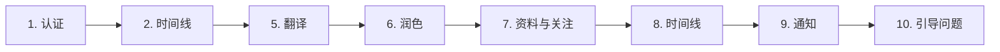

# 集成测试体系

## 零 Mock：一切皆真实

这个项目不做单元测试。没有桩、没有模拟、没有虚假服务器。全部 29+ 个集成测试直接向 **真实 Bluesky API** 和 **真实 DeepSeek API** 发起网络调用。

这不是偷懒——这是设计选择。当你的代码本质上是一个 AT Protocol 客户端和一个 LLM 工具调用引擎时，真正值得验证的是"它到底能不能在真实网络中工作"。Mock 只能告诉你"你的模拟逻辑是对的"，而真实调用告诉你"你的代码对了"。

[来源](docs/TESTING.md#L5-L7)

---

## 测试栈

| 维度 | 取值 |
|------|------|
| 运行器 | Vitest 3.x |
| 超时 | 全局 60 秒（`testTimeout`），Hook 30 秒（`hookTimeout`） |
| 环境变量 | `dotenv` 从项目根目录加载 `.env` |
| 脚本命令 | `pnpm test`（全部）、`pnpm test:e2e`（仅 E2E）、`pnpm test:watch`（监视模式） |

E2E 特化命令使用了 `--reporter=verbose` 来展示每一步的详细输出：

```bash
pnpm --filter @bsky/core test:e2e
```

[来源](packages/core/vitest.config.ts#L4-L8) · [来源](packages/core/package.json#L17-L19)

---

## 测试文件全景

5 个测试文件覆盖了从底层 API 到高层 AI 编排的每一个层次：

| 文件 | 测试数 | 覆盖范围 |
|------|--------|----------|
| `tests/auth.test.ts` | 3 | 登录、Handle 解析、获取个人资料 |
| `tests/feed.test.ts` | 8 | 创建帖子、获取线程、线程展平（flatten）、搜索、图片上传/下载 |
| `tests/ai_integration.test.ts` | 8 | 工具调用、AI 搜索、AI 查资料、翻译、润色、引导性问题 |
| `tests/e2e.test.ts` | 10 | 完整流程：认证 → 帖子 → 线程 → 图片 → AI 工具 → 翻译 → 润色 → 资料 → 时间线 → 通知 → 引导问题 |
| `tests/list.test.ts` | 12 | 创建列表、增删成员、获取列表/列表 Feed、静音/取消静音、更新描述、删除列表 |

> **注**：部分测试因不产生持久副作用（不创建实际帖子）而处于注释状态，但其代码结构与断言逻辑完整保留。

### 认证测试（auth.test.ts）

三段式验证：先确认会话能建立（`accessJwt` 非空、`did` 符合 `did:plc:` 格式），再确认 Handle 解析回相同的 DID，最后确认个人资料可获取。

```typescript
const client = new BskyClient();
const session = await client.login(HANDLE, APP_PASSWORD);
expect(session.accessJwt).toBeTruthy();
```

[来源](packages/core/tests/auth.test.ts#L23-L41)

### 订阅 Feed 测试（feed.test.ts）

曾包含完整的"发帖→读线程→展平→搜索→上传图片→嵌入图片→提取→下载"链路。当前活跃测试为搜索端点验证：

```typescript
const searchRes = await client.searchPosts({ q: 'Bluesky', limit: 25, sort: 'latest' });
expect(searchRes.posts.length).toBeGreaterThanOrEqual(0);
```

[来源](packages/core/tests/feed.test.ts#L78-L81)

### AI 集成测试（ai_integration.test.ts）

这是最复杂的测试文件之一。它验证 `AIAssistant` 与 `createTools` 配合工作的三个层面：

**1. 工具注册** — 确认所有 36 个工具定义被正确加载：
```typescript
expect(tools.length).toBeGreaterThan(20);
expect(names).toContain('get_post_thread_flat');
```

**2. 工具调用** — 让 AI 通过工具调用完成搜索和查资料：
```typescript
const result = await assistant.sendMessage(
  '在 Bluesky 上搜索包含 "Bluesky" 的帖子，告诉我找到了多少条。'
);
expect(result.toolCallsExecuted).toBeGreaterThanOrEqual(1);
```

**3. 翻译与润色** — 纯文本转换（无工具调用），验证中文输出：
```typescript
const result = await translateToChinese(AI_CONFIG, 'Hello, this is a test...');
expect(/[\u4e00-\u9fff]/.test(result)).toBe(true);
```

[来源](packages/core/tests/ai_integration.test.ts#L51-L59) · [来源](packages/core/tests/ai_integration.test.ts#L85-L102) · [来源](packages/core/tests/ai_integration.test.ts#L130-L135)

### 列表测试（list.test.ts）

完整 CRUD：创建列表 → 读取 → 添加成员 → 验证成员 → 获取列表 Feed → 静音/取消静音 → 更新描述 → 删除成员 → 清理删除列表。这是唯一一个完整执行写操作并自行清理的测试文件。

```typescript
// 创建
const result = await client.createList(TEST_LIST_NAME, 'app.bsky.graph.defs#curatelist', 'description');
// 静音/取消静音
await client.muteActorList(createdListUri!);
await client.unmuteActorList(createdListUri!);
// 清理
afterAll(async () => { await client.deleteList(createdListUri); });
```

[来源](packages/core/tests/list.test.ts#L33-L38) · [来源](packages/core/tests/list.test.ts#L94-L103) · [来源](packages/core/tests/list.test.ts#L122-L129)

---

## E2E 的 10 步流程

`tests/e2e.test.ts` 是这个项目的"健康检查"。每个测试步骤有编号，可以独立运行也可以全链路执行：



| 步骤 | 测试内容 | 超时 |
|------|----------|------|
| `[1]` | 登录 → Resolve Handle → 获取 Profile | 15s |
| `[2]` | 读取时间线 + 加载工具定义（验证工具数量 > 20） | 15s |
| `[5]` | AI 翻译：英文 → 中文（验证包含中文字符） | 60s |
| `[6]` | AI 润色：草稿→正式风格 | 60s |
| `[7]` | 获取 `bsky.app` 资料 + 自己的关注列表 | 15s |
| `[8]` | 再次读取时间线（独立验证） | 15s |
| `[9]` | 获取通知列表 | 15s |
| `[10]` | AI 生成引导性问题 | 60s |

编号跳过了 `[3]`（图片）和 `[4]`（AI 帖子分析），这两段因涉及发帖操作而注释保留。整个测试不产生持久数据。

[来源](packages/core/tests/e2e.test.ts#L37-L186)

---

## .env 加载机制

所有测试文件统一从项目根目录加载环境变量：

```typescript
const __dirname = path.dirname(fileURLToPath(import.meta.url));
dotenv.config({ path: path.resolve(__dirname, '..', '..', '..', '.env') });
```

路径计算逻辑：`packages/core/tests/*.test.ts` → 上三层到项目根目录。所需的三个核心变量：

- `BLUESKY_HANDLE` — Bluesky 账户 Handle
- `BLUESKY_APP_PASSWORD` — 应用密码（非账户密码）
- `LLM_API_KEY` — DeepSeek（或其他 OpenAI 兼容 API）的密钥

可选变量：`LLM_BASE_URL`（默认 `https://api.deepseek.com`）、`LLM_MODEL`（默认 `deepseek-v4-flash`）。

[来源](packages/core/tests/auth.test.ts#L7-L11) · [来源](packages/core/tests/ai_integration.test.ts#L17-L21)

---

## 超时策略

三层超时保障：

| 层级 | 配置 | 值 |
|------|------|----|
| 全局 | `vitest.config.ts` 中 `testTimeout` | 60s |
| Hook | `vitest.config.ts` 中 `hookTimeout` | 30s |
| 单测试 | `it()` 第三参数 | 15s / 30s / 60s / 120s 不等 |

AI 相关的测试（调用 DeepSeek 大模型）使用 60-120 秒超时；纯 API 调用（Bluesky 的 AT Protocol）使用 15 秒超时；涉及 blob 下载的极慢操作使用 60 秒超时。

[来源](packages/core/vitest.config.ts#L4-L8) · [来源](packages/core/tests/auth.test.ts#L28)

---

## 常见问题修复表

| 问题 | 原因 | 修复 |
|------|------|------|
| 测试超时（全局 30s 默认） | Vitest 默认超时不够 | 全局设为 60s；AI 相关测试单独设为 120s |
| Blob 下载超时 | 下载需经认证端点 | 下载前加 2s 延迟；使用 `authenticated` 端点 + 30s 超时 |
| 搜索返回空结果 | AT Protocol 搜索索引有延迟 | 搜索前等待 3s |
| AI 回答被截断 | 流式模式 + token 限制 | 使用非流式模式；`max_tokens` 设为 4096 |
| 账号中残留多条测试帖子 | 测试发帖后未清理 | 帖子标记 `[TRST 测试]` 便于识别（AT Protocol 不支持便捷删除） |

[来源](docs/TESTING.md#L76-L83)

---

## 边界与注意事项

**写操作不留垃圾**。除 `list.test.ts` 的 `afterAll` 会主动删除创建的列表外，其余测试均不执行写操作（相关代码已注释）。这意味着测试可以反复运行而不污染真实 Bluesky 数据。

**认证复用**。每个测试文件独立实例化 `BskyClient` 并独立登录。这避免了测试间的状态污染，但每次运行会产生多次认证请求。`BskyClient` 内部实现了自动 JWT 刷新，确保长耗时测试不断连。

**图片 blob 的可见性**。Bluesky 的 blob 存储与帖子绑定，即使帖子被删除，已上传的 blob 仍可通过 CID 访问（这是 AT Protocol 的数据持久性设计）。因此图片上传相关测试被注释，避免永久占用存储。

**关于 AI 提供者**。测试使用 DeepSeek 作为默认 LLM 提供者，但通过 `LLM_BASE_URL` 和 `LLM_MODEL` 环境变量可切换为任意 OpenAI 兼容 API。详情见 [环境变量与配置](环境变量与配置.md)。

---

## 运行测试

```bash
# 全部 29+ 个集成测试
pnpm test

# 仅运行 E2E 10 步流程
pnpm --filter @bsky/core test:e2e

# 监视模式（文件变更自动重跑）
pnpm --filter @bsky/core test:watch

# 指定单个文件
pnpm --filter @bsky/core test tests/auth.test.ts
```

所有命令前需确保 `.env` 文件已在项目根目录配置完毕。首次运行建议先执行 `auth.test.ts` 验证凭证可用性，再运行完整的 E2E 套件。

---

## 相关页面

- [BskyClient：AT Protocol 客户端实现](bskyclient-at-protocol-客户端实现.md) — 测试覆盖的底层 API 客户端
- [AIAssistant：多提供者 LLM 引擎](aiassistant-多提供者-llm-引擎.md) — AI 测试的核心对象
- [36 个 AI 工具：从定义到执行](36-个-ai-工具-从定义到执行.md) — `createTools` 输出的工具清单
- [测试模式与调试技巧](测试模式与调试技巧.md) — 分步调试、创建测试帖子、API 限制处理