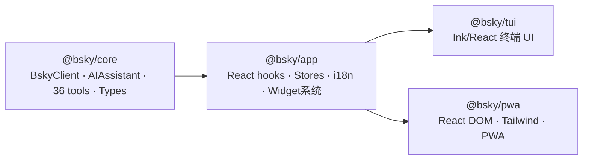

现在我已经收集了所有必要信息。

# 项目结构导览

本页面从头梳理整个项目的目录布局。你将看到一个 **pnpm monorepo** 如何组织 4 个相互依赖的包，以及 `contracts/` 和 `docs/` 两个特殊目录的角色。

---

## 整体鸟瞰

项目根目录的 `pnpm-workspace.yaml` 声明了两个工作区路径：

```yaml
packages:
  - 'packages/*'
  - 'contracts'
```

[来源](pnpm-workspace.yaml#L1-L3)

这意味着 `packages/` 下的每个子目录和 `contracts/` 都是一个可被其他包引用的**工作区包**（workspace package）。根 `package.json` 提供了统一的脚本入口：`pnpm build`、`pnpm test` 等命令会递归执行到所有子包。 [来源](package.json#L1-L19)

把完整的项目树展开到第二层，结构如下：

```
bsky/
├── packages/
│   ├── core/        # @bsky/core — 零 UI 依赖的核心层
│   ├── app/         # @bsky/app — React hooks + 纯状态管理
│   ├── tui/         # @bsky/tui — Ink/React 终端 UI
│   └── pwa/         # @bsky/pwa — React DOM 浏览器 PWA
├── contracts/       # @bsky/contracts — JSON Schema + 系统提示词
├── docs/            # 22 份 Markdown 文档（本文所在目录）
├── tsconfig.base.json  # 共享 TypeScript 配置
├── README.md / README.zh.md
└── pnpm-workspace.yaml
```

四种 TypeScript 编译选项全部继承 `tsconfig.base.json`：ES2022 目标、ESNext 模块、strict 模式。 [来源](tsconfig.base.json#L1-L20)

---

## 四层依赖架构

项目最核心的设计思想是**按 UI 能力分层**。下面的 Mermaid 图展示了包之间的依赖流向：



这张图直接取自 `docs/ARCHITECTURE.md` 中的依赖流向图——**`core` 在最底层，`app` 在中间，`tui` 和 `pwa` 并列为顶层 UI**。 [来源](docs/ARCHITECTURE.md#L63-L86)

> 如果你想了解这条路线的设计动机（为什么 `app` 层可以被两个 UI 共享），推荐阅读 [架构决策日志](概览.md)。

---

## 逐个包详解

### 1. `@bsky/core` — 零 UI 依赖的核心引擎

**包名**：`@bsky/core` | **入口**：`packages/core/src/index.ts`

这是整个项目的**基石**。它不依赖任何 UI 框架（无 React、无 Ink、无 DOM），纯 TypeScript 实现两大块功能：

- **Bluesky AT Protocol 客户端** (`src/at/client.ts`)：基于 `ky` HTTP 库，封装了会话创建、JWT 自动刷新、时间线、帖子、书签、私信等全部 API 端点。
- **AI 引擎** (`src/ai/assistant.ts`)：兼容 OpenAI 接口的多轮对话系统，支持流式/非流式输出、36 个工具调用循环、翻译和润色功能。
- **36 个 AI 工具** (`src/ai/tools.ts`)：每个工具都有 JSON Schema 定义 + 处理函数。
- **集中式提示词系统** (`src/ai/prompts.ts`)：所有 AI 提示词集中管理。
- **多提供商注册表** (`src/ai/providers.ts`)：支持 OpenAI、DeepSeek 等兼容 API。

关键文件：

| 文件 | 职责 |
|------|------|
| `src/at/client.ts` | BskyClient 类：所有 Bluesky API 端点 |
| `src/at/types.ts` | AT Protocol 全量 TypeScript 类型定义 |
| `src/ai/assistant.ts` | AIAssistant 类 + translateText + polishDraft |
| `src/ai/tools.ts` | createTools() → 36 个工具定义+处理函数 |
| `src/ai/prompts.ts` | 集中式提示词常量 |
| `src/ai/providers.ts` | 多提供商配置注册表 |

依赖：`ky`（唯一运行时依赖）。 [来源](packages/core/package.json#L1-L31)、[来源](packages/core/src/index.ts#L1-L94)

### 2. `@bsky/app` — 状态管理层（React Hooks + Pure Stores）

**包名**：`@bsky/app` | **入口**：`packages/app/src/index.ts`

这一层是所有**业务逻辑**的容器。它引用 `@bsky/core`，但自身只输出 React hooks 和纯状态机——**不输出任何渲染组件**。这意味着 TUI 和 PWA 可以共享同一套 hooks 和 store 模式。

关键子目录：

| 目录 | 内容 |
|------|------|
| `src/hooks/` | 20+ 个 React hooks（useAuth、useTimeline、useThread、useAIChat 等） |
| `src/stores/` | 纯发布订阅 store（auth、timeline、postDetail） |
| `src/state/` | 状态机（createNavigation、feedConfig 等） |
| `src/services/` | 存储接口（ChatStorage、DraftStorage 接口 + 文件实现） |
| `src/i18n/` | 国际化：中文/英文/日文三语言 |
| `src/hooks/widgetRegistry.ts` | 可插拔 Widget 系统注册表 |

核心 Hook 一览：

| Hook | 用途 |
|------|------|
| `useAuth` | 认证与会话管理 |
| `useTimeline` | 时间线数据流 |
| `useThread` | 帖子讨论串展平 |
| `useCompose` | 多帖组合发帖 |
| `useAIChat` | AI 流式/非流式对话 |
| `useTranslation` | 7 语言翻译 |
| `useNavigation` | 纯状态机导航控制 |

详细 Hook 签名见 [React Hooks 架构与 Store 模式](react-hooks-架构与-store-模式.md)。

依赖：`@bsky/core` + `react`（peer）。 [来源](packages/app/package.json#L1-L29)、[来源](packages/app/src/index.ts#L1-L82)

### 3. `@bsky/tui` — 终端 UI（Ink/React）

**包名**：`@bsky/tui` | **入口**：`packages/tui/src/cli.ts`

这是给**键盘党**的终端客户端。基于 Facebook 的 Ink 框架（用 React 渲染终端），运行命令：

```bash
cd packages/tui && npx tsx src/cli.ts
```

核心组件树：

| 文件 | 职责 |
|------|------|
| `src/cli.ts` | 入口：加载环境变量、启用 raw mode、渲染 App |
| `src/components/App.tsx` | 视图路由器 + 键盘分发 + 布局 (~400行集中式键盘处理) |
| `src/components/PostList.tsx` | 基于 viewport 的时间线列表 |
| `src/components/UnifiedThreadView.tsx` | 光标/焦点分离模式的讨论串浏览 |
| `src/components/AIChatView.tsx` | AI 对话视图 |
| `src/components/Sidebar.tsx` | 导航侧边栏 |
| `src/utils/text.ts` | CJK 感知的文本换行工具 |
| `src/utils/mouse.ts` | ANSI 鼠标追踪事件解析 |

完整快捷键表见 [TUI 键盘快捷键完全参考](tui-键盘快捷键完全参考.md)，渲染原理见 [TUI 组件架构与渲染原理](tui-组件架构与渲染原理.md)。

依赖：`@bsky/core` + `@bsky/app` + `ink` + `ink-text-input` + `react`。 [来源](packages/tui/package.json#L1-L41)

### 4. `@bsky/pwa` — 浏览器 PWA（React DOM + Tailwind）

**包名**：`@bsky/pwa` | **入口**：`packages/pwa/src/main.tsx`

这是给**浏览器用户**的渐进式 Web 应用。运行命令：

```bash
cd packages/pwa && pnpm dev   # localhost:5173
```

关键架构特点：

- **Hash 路由** (`src/hooks/useHashRouter.ts`)：`#/feed`、`#/thread?uri=...`、`#/ai?session=...` 等格式，兼容静态托管
- **IndexedDB 存储** (`src/services/indexeddb-chat-storage.ts`)：实现 ChatStorage 接口
- **Node 模块 stub** (`src/stubs/`)：为浏览器环境模拟 fs、path、os 模块
- **Tailwind CSS** 暗色模式
- **无需 .env**：登录和 AI 配置完全在浏览器内完成

核心组件：

| 组件 | 用途 |
|------|------|
| `FeedTimeline.tsx` | 虚拟滚动时间线 |
| `ThreadView.tsx` | 嵌套讨论串展示 |
| `ComposePage.tsx` | 发帖/回复/引用编辑器 |
| `AIChatPage.tsx` | AI 对话（Markdown 渲染 + 工具调用卡片） |
| `DMChatPage.tsx` | 私信聊天界面 |
| `SettingsModal.tsx` | 设置面板 |

PWA 特有功能：manifest.json、Service Worker 离线支持、可安装到桌面。详见 [PWA 架构与组件映射](pwa-架构与组件映射.md) 和 [PWA 部署指南](pwa-部署指南.md)。

依赖：`@bsky/core` + `@bsky/app` + `react-dom` + `react-markdown` + `tailwindcss`。 [来源](packages/pwa/package.json#L1-L36)

---

## `contracts/` — 共享契约

**包名**：`@bsky/contracts` | **目录**：`contracts/`

这不是一个代码包——它只存放**元数据**：

| 文件 | 内容 |
|------|------|
| `tools.json` | 全部 36 个 AI 工具的 JSON Schema（名称、描述、参数、端点、读写属性） |
| `system_prompts.md` | AI 助手的系统提示词、翻译提示词、润色提示词 |
| `package.json` | 仅包元数据，无代码 |

这些文件被 AI 工具注册和 Prompt 生成流程引用。详细说明见 [Prompt 工程与多提供者注册表](prompt-工程与多提供者注册表.md)。 [来源](contracts/package.json#L1-L6)

---

## `docs/` — 文档目录

这是**你正在阅读的 wiki 的源材料目录**。根目录下共有 22 份 Markdown 文档，每份聚焦一个主题：

| 文件 | 主题 |
|------|------|
| `ARCHITECTURE.md` | 整体架构、分层图、依赖流向 |
| `PACKAGES.md` | 各包详解、导出、关键文件 |
| `HOOKS.md` | 所有 React hook 签名参考 |
| `NAVIGATION.md` | AppView 状态机、goTo/goBack/goHome |
| `ENV.md` | 环境变量与配置 |
| `API_CLIENT.md` | BskyClient 所有端点 |
| `AI_SYSTEM.md` | AIAssistant 类、36 工具、提示词 |
| `CHAT_STORAGE.md` | ChatStorage 接口与实现 |
| `PWA_GUIDE.md` | PWA 构建指南 |
| `KEYBOARD.md` | TUI 快捷键完整参考 |
| `SCROLL.md` | 虚拟滚动 + 滚动恢复 |
| `DM.md` | 私信实现 |
| `DESIGN.md` | 设计决策记录 |
| `CONTEXT.md` | 上下文参考 |
| `TERMINOLOGY.md` | 术语与命名约定 |
| `TESTING.md` | 测试框架与模式 |
| `TUI_UTILS.md` | TUI 工具函数 |
| `TODO.md` | 待办事项 |
| `LESSONS.md` | 开发教训记录 |
| `AI_CONTEXT.md` | AI 上下文参考 |
| `USER_ISSUSES.md` | 用户反馈问题跟踪 |
| `README.md` | docs 目录索引（即本表） |

这份 wiki 中的每一页（本项目结构导览、概览、快速开始等）都是从这些源文件提炼而来，并在关键段落标注了来源行号。 [来源](docs/README.md#L1-L36)

---

## 技术栈一览

| 技术 | 用途 |
|------|------|
| TypeScript 5.x (strict) | 全项目语言 |
| pnpm workspace | monorepo 管理 |
| Ink 5 | TUI 终端渲染 |
| React 18 | UI 框架（TUI + PWA 共用） |
| ky | HTTP 客户端（core 层） |
| DeepSeek v3 | AI 提供商（兼容 OpenAI API） |
| Tailwind CSS | PWA 样式 |
| Vite | PWA 构建 |
| Vitest | 测试运行器 |
| IndexedDB | PWA 聊天存储 |

---

## 下一步

看到这里，你对整个项目的"地图"已经有了全景认知。推荐接下来的阅读顺序：

- 想看怎么跑起来？→ [快速开始](快速开始.md)
- 想知道环境变量怎么配？→ [环境变量与配置](环境变量与配置.md)
- 想知道核心 API 客户端怎么工作？→ [BskyClient：AT Protocol 客户端实现](bskyclient-at-protocol-客户端实现.md)
- 想知道 AI 引擎如何驱动 36 个工具？→ [AIAssistant：多提供者 LLM 引擎](aiassistant-多提供者-llm-引擎.md)