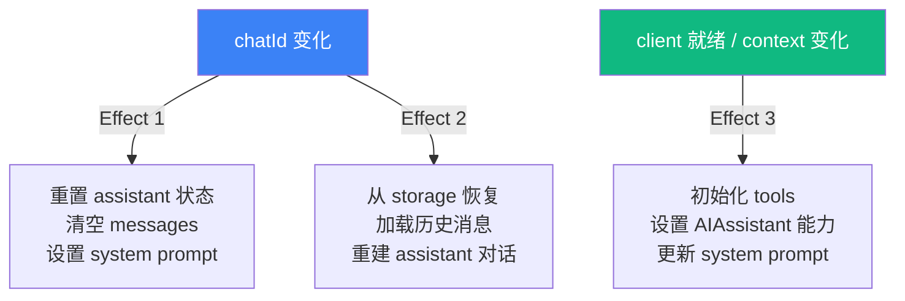

以下是基于 `docs/HOOKS.md` 和 `packages/app/src/index.ts` 最新状态的完整页面。

---

# React Hooks 架构与 Store 模式

**纯 Store + React Hook 桥接模式**，是本应用前端架构的基石。所有 23 个 Hook 遵循同一设计哲学：将**无 React 依赖的纯 Store 对象**与**发布订阅桥接层**分离，使得业务逻辑可测试、可共享、可脱离 React 独立运行。

## 核心模式

### 纯 Store 对象

Store 是普通的 JavaScript 对象——没有 `useState`、没有 `useEffect`，甚至不需要 `class`。它的核心是一个 `subscribe` 方法和一个内部 `_notify` 调用。

```typescript
// 纯 Store（无 React 依赖）
function createStore() {
  const store = {
    data: null,
    loading: false,
    listener: null as (() => void) | null,

    async load() {
      store.loading = true;
      store._notify();
      // ... 异步操作 ...
      store.loading = false;
      store._notify();
    },

    _notify() { if (store.listener) store.listener(); },
    subscribe(fn: () => void) {
      store.listener = fn;
      return () => { store.listener = null; };
    },
  };
  return store;
}
```

[来源](docs/HOOKS.md#L36-L61)

### React Hook 包装器

Hook 通过 `useState(() => createStore())` 在组件挂载时实例化 Store（仅一次），然后通过 `useState(0)` 的 tick 计数器触发重渲染。

```typescript
// React Hook（包装 Store）
function useStore() {
  const [store] = useState(() => createStore());
  const [, force] = useState(0);
  const tick = useCallback(() => force(n => n + 1), []);

  useEffect(() => store.subscribe(tick), [store, tick]);

  return { data: store.data, loading: store.loading };
}
```

[来源](docs/HOOKS.md#L63-L72)

> **注意**：这是单监听器模型。每个 Store 实例同时只允许一个 `useEffect(() => store.subscribe(tick))` 订阅。多个组件订阅同一 Store 实例会互相覆盖。部分 Hook（如 `usePostActions`）通过模块级数组 `_tickers` 实现多订阅者支持。

[来源](docs/HOOKS.md#L75)

### 三种实现变体

| 变体 | 示例 | 说明 |
|------|------|------|
| **`createStore()` + subscribe** | `useAuth`, `useTimeline`, `useI18n`, `useNavigation` | 外部函数创建 Store 对象，`subscribe` 桥接 React |
| **内联 `useState`** | `useThread`, `useCompose`, `useSearch` | 状态直接写在 Hook 内部，适合简单或独立的功能 |
| **模块级可变状态** | `usePostActions`, `useActiveFeed`, `useScrollRestore` | 全局 `Set`/`Map` + tick 数组，跨组件共享状态 |

[来源](packages/app/src/hooks/useAuth.ts#L6-L22)，[来源](packages/app/src/hooks/usePostActions.ts#L4-L14)

## Hook 全景

### 核心基础设施

| Hook | Store 类型 | 返回类型 | 说明 |
|------|-----------|----------|------|
| `useNavigation` | `createNavigation()` | `{ currentView, canGoBack, goTo, goBack, goHome }` | 纯状态机，`AppView` 联合类型驱动视图路由 |
| `useAuth` | `createAuthStore()` | `{ client, session, profile, loading, error, login, restoreSession }` | 会话生命周期管理 |
| `useI18n` | `getI18nStore(initialLocale)` | `{ t, locale, setLocale, availableLocales, localeLabels }` | 三语言切换，动态翻译 |

[来源](packages/app/src/index.ts#L1-L2)，[来源](packages/app/src/state/navigation.ts#L30-L72)

### 时间线与内容浏览

| Hook | Store 类型 | 返回类型 | 说明 |
|------|-----------|----------|------|
| `useTimeline` | `createTimelineStore()` | `{ posts, loading, cursor, loadMore, refresh }` | 分页时间线 |
| `usePostDetail` | `createPostDetailStore()` | `{ post, flatThread, loading, translations, translate, actions }` | 帖文详情 + AI 翻译 |
| `useThread` | 内联 state | `{ flatLines, loading, focusedIndex, focused, themeUri, likePost, repostPost, expandReplies, isLiked, isReposted }` | 线程展开与键盘焦点 |
| `useActiveFeed` | 模块级 ref | `{ getLastFeedUri, setLastFeedUri }` | 跨视图记住最后活跃 feed |
| `useScrollRestore` | 模块级 Map | `{ saveScrollTop, getScrollTop }` | 视图切换时恢复滚动位置 |

[来源](packages/app/src/index.ts#L4-L19)

### 社交交互

| Hook | Store 类型 | 返回类型 | 说明 |
|------|-----------|----------|------|
| `usePostActions` | 模块级 Set/Map | `{ isLiked, isReposted, likePost, repostPost, seedFromPosts, seedFromPost }` | 点赞/转发（含乐观更新） |
| `useCompose` | 内联 state | `{ posts: ComposePostItem[], addPost, removePost, setPostText, submitting, error, replyTo, setReplyTo, quoteUri, setQuoteUri, submit, loadFromDraft, toDraftData }` | 多帖线程组合 |
| `useDrafts` | `createDraftsStore(client)` | `{ drafts: AppDraft[], loading, saving, saveDraft, deleteDraft, syncDraft, refreshDrafts, loadDraft }` | PDS + 本地双存储草稿 |

[来源](packages/app/src/index.ts#L10-L18)

### AI 聊天

| Hook | Store 类型 | 返回类型 | 说明 |
|------|-----------|----------|------|
| `useAIChat` | `AIAssistant` 实例 | `{ messages, loading, guidingQuestions, send, stop, addUserImage, chatId, pendingConfirmation, confirmAction, rejectAction, edit, editByIndex, undoLastMessage }` | 流式/非流式双模式 |
| `useChatHistory` | `FileChatStorage` | `{ conversations, loadConversation, saveConversation, deleteConversation, refresh }` | IndexedDB 持久化聊天历史 |

[来源](packages/app/src/index.ts#L22-L26)

### 社交图谱

| Hook | Store 类型 | 返回类型 | 说明 |
|------|-----------|----------|------|
| `useProfile` | 内联 state | `{ profile, loading, error, tab, setTab, posts, feedCursor, feedLoading, loadMoreFeed, isFollowing, handleFollow, handleUnfollow, followList, followItems, loadMoreFollowList, openFollowList, closeFollowList, repostReasons }` | 用户主页 + 关注管理 |
| `useSearch` | 内联 state | `{ query, results, loading, search }` | AT Protocol 搜索 |
| `useNotifications` | 内联 state | `{ notifications, loading, unreadCount, refresh }` | 未读计数 |
| `useBookmarks` | 内联 state | `{ bookmarks, loading, isBookmarked, addBookmark, removeBookmark, toggleBookmark, refresh }` | 服务端书签 |
| `useLists` | 内联 state | `{ lists, loading, createList, deleteList }` | 用户列表 |
| `useListDetail` | 内联 state | `{ list, members, loading }` | 列表详情 |
| `useSocialCircle` | 内联 state | `{ state: SocialCircleState, analyze, reset }` | 社交圈分析：加权交互图 + Mermaid 图 |
| `useTranslation` | 内联缓存 | `{ translate, loading, cache, lang, setLang, mode, setMode, LANG_LABELS }` | 7 语言翻译（simple/json 双模式） |

[来源](packages/app/src/index.ts#L27-L42)

### 私信（DM）

| Hook | Store 类型 | 返回类型 | 说明 |
|------|-----------|----------|------|
| `useConvoList` | 内联 state | `{ convos, cursor, loading, error, load, refresh }` | 会话列表（chatKy 路由） |
| `useChatMessages` | 内联 state | `{ messages, convo, loading, sending, error, loadConvo, loadOlder, sendMessage, toggleReaction, refresh, deleteMessage, markRead, muteConvo, unmuteConvo }` | 完整 DM 操作 |

[来源](packages/app/src/index.ts#L40-L42)

### Widget 系统（非 Hook 纯模块）

| 导出函数 | 类型 | 说明 |
|---------|------|------|
| `registerWidget` / `getWidgetsForView` | 模块级 Map | Widget 注册与视图绑定 |
| `toggleWidget` / `getEnabledWidgetIds` | 模块级数组 | Widget 启用/禁用（localStorage 持久化） |
| `setComposeDraftForWidgets` / `replaceComposeDraft` | 模块级桥接 | ComposePage ↔ 右侧面板草稿同步 |
| `setFocusedProfileActor` / `getFocusedProfileActor` | 模块级桥接 | ThreadView → ProfilePreviewWidget 人物同步 |
| `initAIChatSession` / `getAIChatSessionId` | 模块级字符串 | AI Chat widget 会话 ID 管理 |

[来源](packages/app/src/index.ts#L57-L84)

> 这些是纯函数模块——无 React 依赖，可在组件、AI 工具、测试中直接 import 调用。

## useAIChat：三个 Effect 的精密分工

`useAIChat` 是架构复杂度的巅峰，内部三个 `useEffect` 各司其职：



**Effect 1（第 94-113 行）**：监听 `options?.chatId` 变化。当用户切换对话时，调用 `assistant.clearMessages()`、重置 `messages` 数组和 `guidingQuestions`。然后根据 `contextPost` 或 `contextProfile` 添加对应的 system message。

```typescript
useEffect(() => {
  if (options?.chatId === lastChatId.current) return;
  lastChatId.current = options?.chatId;
  assistant.clearMessages();
  setMessages([]);
  // ...根据 context 添加 system message
}, [options?.chatId, buildSystemPrompt, options?.contextProfile, options?.contextPost]);
```

[来源](packages/app/src/hooks/useAIChat.ts#L94-L113)

**Effect 2（第 116-172 行）**：当 `options?.chatId` 变化且有 `storage` 时，异步加载历史记录。如果找到已保存的 `ChatRecord`，恢复消息数组、重建 `assistant` 的内部对话状态（含 tool_call 重建逻辑）。**这使得页面刷新后仍能恢复对话**。

```typescript
useEffect(() => {
  if (!storage || !options?.chatId) return;
  void (async () => {
    const record = await storage.loadChat(options.chatId!);
    if (record) {
      setMessages(record.messages);
      // 恢复 context，重建 assistant 状态
      assistant.loadMessages([...system, ...chatMsgs]);
    }
  })();
}, [options?.chatId, storage]);
```

[来源](packages/app/src/hooks/useAIChat.ts#L116-L172)

**Effect 3（第 175-217 行）**：监听 `client` 就绪和 `contextUri`/`contextProfile`/`contextPost` 变化。当 client 可用时，调用 `createTools(client)` 初始化工具集。当 context 参数变化时，更新 system prompt 和 guiding questions。**如果同时没有 chatId 和 context，则重置为纯空白对话**。

```typescript
useEffect(() => {
  if (!client) return;
  const tools = createTools(client);
  assistant.setTools(tools);

  const changed = contextUri !== lastContextUri.current
    || options?.contextPost !== lastContextPost.current
    || options?.contextProfile !== lastContextProfile.current;

  if (changed) {
    if (!options?.chatId && !options?.contextProfile && !options?.contextPost) {
      assistant.clearMessages();
      setMessages([]);
    }
    // ...更新 system prompt
  }
}, [client, contextUri, assistant, options?.contextProfile, options?.contextPost, buildSystemPrompt]);
```

[来源](packages/app/src/hooks/useAIChat.ts#L175-L217)

### 自动保存机制

`autoSave` 在每次 `send` 完成后被调用。通过 `chatIdRef.current` 保持对当前 chatId 的引用，不受闭包捕获影响。首次保存时触发 `onChatSaved` 回调，用于刷新侧边栏对话列表。

[来源](packages/app/src/hooks/useAIChat.ts#L218-L236)

## 出口总览

`packages/app/src/index.ts` 现导出 **85 行**内容，涵盖：

- **22 个 Hook**（`useXxx`）
- **3 个纯 Store 工厂**（`createNavigation`、`setDraftStorageFactory`、`getDefaultDraftStorage`）
- **2 个存储实现**（`FileDraftStorage`、`FileChatStorage`）
- **5 组类型导出**（`AppView`、`PostDetailActions`、`FlatLine`、`DraftStore`、`AIChatMessage` 等）
- **4 组工具函数**（`getCdnImageUrl`、image URL helpers、`parsePostUri`）
- **Widget 系统**（`registerWidget`、`toggleWidget` 等 13 个函数）
- **状态持久化**（`saveViewState`/`getViewState`、`getFeedConfig`/`saveFeedConfig`）

## 相关页面

- [导航与状态管理](导航与状态管理.md)：`createNavigation` 纯状态机与 `AppView` 联合类型
- [认证与会话管理](认证与会话管理.md)：`useAuth` 与 `BskyClient` 生命周期
- [AI Chat 与聊天历史](ai-chat-与聊天历史.md)：`useAIChat` 的流式/非流式双模式详解
- [Widget 系统与组合](widget-系统与组合.md)：可插拔 Widget 注册表与视图绑定
- [私信（DM）与聊天](私信-dm-与聊天.md)：`useConvoList`、`useChatMessages` 的 DM 实现