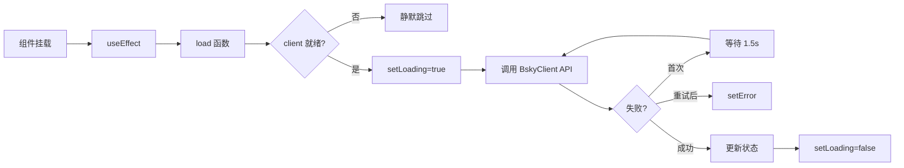

对比旧版本与实际代码，发现三个主要的更新点：① `useBookmarks` 的 API 表现已包含 `toggleBookmark`（共 5 个方法）；② bookmarks 数据有映射逻辑（`res.bookmarks.map(b => b.item)`）；③ 新增的 `useSearchHistory` Hook 提供了 localStorage 持久化的搜索历史管理。下面是更新后的页面。

---

# 书签、列表、通知与搜索

四个社交功能 Hook 构成了应用在核心时间线之外的主要交互面。它们共享一致的架构模式——纯状态管理 + BskyClient 桥接——但各自针对不同的数据领域做出了独特的设计选择。本文逐一拆解每个 Hook 的状态格局、API 调用链和分页策略。

## 总览：架构共性

所有四个 Hook 遵循 [React Hooks 架构与 Store 模式](react-hooks-架构与-store-模式.md) 中定义的纯函数模式：

1. **状态集**：使用 `useState` 管理本地状态（列表数据、加载标志、错误信息）
2. **加载器**：`load` 回调封装 API 调用，包含**自动重试**（失败后等待 1.5 秒重试一次）
3. **副作用**：`useEffect` 在加载器引用变化时自动触发初始加载
4. **刷新**：暴露 `refresh` 引用指向 `load`，供外部手动触发



---

## useBookmarks：Set 驱动的同步书签检查

**文件**：`packages/app/src/hooks/useBookmarks.ts`

### 状态格局

| 状态 | 类型 | 用途 |
|------|------|------|
| `bookmarks` | `PostView[]` | 已收藏帖子列表（从响应映射 `item` 字段） |
| `bookmarkedUris` | `Set<string>` | 快速查重集合 |
| `cursor` | `string \| undefined` | 分页游标（当前未暴露加载更多） |
| `loading` | `boolean` | 加载中 |
| `error` | `string \| null` | 错误信息 |

### 设计亮点：Set.has() O(1) 检查

这是整个应用中唯一使用 `Set` 作为索引的数据结构。`bookmarkedUris` 在初始加载时由 `getBookmarks` 响应的 `subject.uri` 构建：

```typescript
setBookmarkedUris(new Set(res.bookmarks.map(b => b.subject.uri)));
```

`bookmarks` 数组则取自响应的 `item` 字段，而非直接使用响应对象：[来源](packages/app/src/hooks/useBookmarks.ts#L17-L19)

```typescript
setBookmarks(res.bookmarks.map(b => b.item));
```

随后 `isBookmarked(uri)` 方法通过 `bookmarkedUris.has(uri)` 实现常量时间查重，直接服务于 `toggleBookmark` 和 `addBookmark`/`removeBookmark` 的前置守卫。[来源](packages/app/src/hooks/useBookmarks.ts#L34-L56)

### API 调用链

| 方法 | BskyClient API | AT Protocol 端点 |
|------|---------------|------------------|
| `load` | `client.getBookmarks(50)` | `app.bsky.bookmark.getBookmarks` |
| `addBookmark(uri, cid)` | `client.createBookmark(uri, cid)` | `app.bsky.bookmark.createBookmark` |
| `removeBookmark(uri)` | `client.deleteBookmark(uri)` | `app.bsky.bookmark.deleteBookmark` |
| `toggleBookmark(uri, cid)` | 组合 add/remove | — |

[来源](packages/core/src/at/client.ts#L574-L610)

`toggleBookmark` 是 `addBookmark` 和 `removeBookmark` 的组合守卫——先检查 `bookmarkedUris.has(uri)`，已收藏则删除，否则添加。[来源](packages/app/src/hooks/useBookmarks.ts#L53-L56)

### 分页与刷新

`getBookmarks` 返回 `cursor` 字段并存储在状态中，但 Hook **未暴露 `loadMore` 方法**。当前只支持一次性加载 50 条。`refresh` 指向 `load`，会重新拉取全部书签并重建 Set 索引。

---

## useLists + useListDetail：15 个 API 方法的双层覆盖

列表功能拆分为两个 Hook：

- **`useLists`**（列表概览）：获取用户创建/订阅的列表
- **`useListDetail`**（列表详情）：获取单个列表的成员、Feed 和元信息

### useLists：概览层

**文件**：`packages/app/src/hooks/useLists.ts`

状态简洁：`lists: ListView[]` + `cursor` + `loading` + `error`。

#### 暴露的 API 方法（4 个）

| 方法 | BskyClient API | 说明 |
|------|---------------|------|
| `load` | `client.getLists(target, 50)` | 获取指定用户的列表 |
| `createList(name, purpose, desc?)` | `client.createList(...)` | 创建新列表，乐观更新到 `lists` 头部 |
| `deleteList(uri)` | `client.deleteList(uri)` | 删除列表，从 `lists` 中过滤 |
| `updateListInfo(uri, params)` | `client.updateList(uri, params)` | 更新名称/描述，原地映射更新 |

其中 `createList` 在 API 返回后手动构造 `ListView` 对象插入状态头部，实现**乐观更新**。`createList` 返回 `Promise<ListView | null>`，调用方可根据返回值判断是否成功。[来源](packages/app/src/hooks/useLists.ts#L34-L54)

### useListDetail：详情层

**文件**：`packages/app/src/hooks/useListDetail.ts`

这是四个 Hook 中**最复杂**的一个，管理三个独立数据维度：

```
list (ListView) ─── members (ListItemView[]) ─── feed (PostView[])
                        ↑                            ↑
                   membersCursor                 feedCursor
```

#### 初始加载：并行请求

```typescript
Promise.all([
  client.getList(listUri, 50),      // 列表信息 + 成员
  client.getListFeed(listUri, 20),   // 列表 Feed
])
```

两个请求并行发起，分别填充 `list`/`members` 和 `feed`。[来源](packages/app/src/hooks/useListDetail.ts#L20-L23)

#### 暴露的 API 方法（11 个）

| 类别 | 方法 | BskyClient API |
|------|------|---------------|
| 数据加载 | `loadMoreMembers` | `client.getList(listUri, 50, membersCursor)` |
| 数据加载 | `loadMoreFeed` | `client.getListFeed(listUri, 20, feedCursor)` |
| 列表管理 | `updateListInfo(params)` | `client.updateList(listUri, params)` |
| 列表管理 | `deleteList()` | `client.deleteList(listUri)` |
| 成员管理 | `addMember(subjectDid)` | `client.addListItem(listUri, subjectDid)` → 加载 |
| 成员管理 | `removeMember(itemUri)` | `client.removeListItem(itemUri)` |
| 静音控制 | `toggleMute()` | `client.muteActorList(listUri)` / `client.unmuteActorList(listUri)` |

注意 `addMember` 调用后**触发完整重新加载**（`await load()`），而 `removeMember` 使用**乐观过滤**直接从 `members` 中移除，并递减 `listItemCount`。[来源](packages/app/src/hooks/useListDetail.ts#L75-L90)

#### 双游标分页

`membersCursor` 和 `feedCursor` 各自独立维护。`loadMoreMembers` 和 `loadMoreFeed` 分别追加数据到各自数组末尾。这是四个 Hook 中**唯一实现真分页加载更多**的场景。[来源](packages/app/src/hooks/useListDetail.ts#L43-L60)

---

## useNotifications：轻量通知中心

**文件**：`packages/app/src/hooks/useNotifications.ts`

### 状态格局

```
notifications: Notification[]     → 通知列表
unreadCount: number               → 未读数（客户端计算）
loading / error                   → 加载状态
```

### API 调用链

`client.listNotifications(30)` 调用 `app.bsky.notification.listNotifications` 端点。[来源](packages/core/src/at/client.ts#L413-L421)

### 优先通知支持

底层 `listNotifications` 方法接受可选的 `priority` 参数：

```typescript
async listNotifications(limit = 50, cursor?: string, priority?: boolean)
```

当 `priority=true` 时，Bluesky 服务端会优先返回高优先级通知（如回复 vs 点赞）。该参数通过 `searchParams` 传递。但当前 `useNotifications` Hook **未使用 `priority` 参数**——此能力留待上层组件按需扩展。[来源](packages/core/src/at/client.ts#L413-L416)

### 未读数计算

`unreadCount` 并非来自服务端字段，而是在客户端对 `notifications` 执行 `res.notifications.filter(n => !(n as Notification).isRead).length` 计算得出。[来源](packages/app/src/hooks/useNotifications.ts#L16-L17)

### 分页与刷新

`listNotifications` 返回值包含 `cursor`，但 Hook **未捕获或暴露它**。当前只支持一次性加载 30 条。`refresh` 指向 `load`，触发全量重新拉取。

---

## useSearch + useSearchHistory：四标签搜索引擎

### useSearch：核心搜索

**文件**：`packages/app/src/hooks/useSearch.ts`

这是四个 Hook 中**唯一不自动初始化加载**的——等待用户输入 `search(q, tab)`。

#### SearchTab 联合类型与 SearchState 接口

```typescript
export type SearchTab = 'top' | 'latest' | 'users' | 'feeds';

export interface SearchState {
  query: string;
  tab: SearchTab;
  posts: PostView[];
  users: ProfileViewBasic[];
  feeds: FeedGeneratorView[];
  loading: boolean;
  search: (q: string, tab: SearchTab) => Promise<void>;
  setTab: (t: SearchTab) => void;
}
```

[来源](packages/app/src/hooks/useSearch.ts#L5-L16)

#### 标签路由逻辑

```
search(q, t)
  ├── t === 'top'     → client.searchPosts({ q, limit: 25 })
  ├── t === 'latest'  → client.searchPosts({ q, limit: 25, sort: 'latest' })
  ├── t === 'users'   → client.searchActors({ q, limit: 25 })
  └── t === 'feeds'   → client.getPopularFeedGenerators(25)
                        → 客户端过滤 (displayName/description/creator 匹配 q)
```

[来源](packages/app/src/hooks/useSearch.ts#L32-L48)

#### 搜索语法

搜索能力完整依赖上游 Bluesky/AT Protocol：

- **`searchPosts`** 端点 `app.bsky.feed.searchPosts`：支持 Bluesky 原生搜索语法（引号精确匹配、`from:` 用户过滤、`#` 标签等）
- **`searchActors`** 端点 `app.bsky.actor.searchActors`：按用户名和显示名称匹配
- **`getPopularFeedGenerators`** 端点 `app.bsky.unspecced.getPopularFeedGenerators`：属于**非标准端点**，Hook 在客户端对结果做二次过滤（大小写不敏感的 `includes` 匹配）

[来源](packages/core/src/at/client.ts#L207-L227)

#### feeds 标签的客户端过滤

这是唯一在客户端做二次过滤的场景。因为 Bluesky 没有提供按名称搜索 Feed 的专用端点，所以先拉取热门 Feed 列表，再用 JavaScript 在 `displayName`、`description` 和 `creator.handle` 中匹配查询词。[来源](packages/app/src/hooks/useSearch.ts#L40-L47)

#### 分页

searchPosts 和 searchActors 的响应均包含 `cursor`，且 BskyClient 方法接受 `cursor` 参数。但 `useSearch` **未实现分页加载更多**——每次 `search` 调用都是全新的查询，替换而不是追加结果。

### useSearchHistory：搜索历史持久化

**文件**：`packages/app/src/hooks/useSearchHistory.ts`

与 `useSearch` 配套的搜索历史管理 Hook，使用 `localStorage` 持久化，按标签分类存储：

| 方法 | 说明 |
|------|------|
| `add(query)` | 添加查询到当前标签的历史，自动去重并限制 10 条 |
| `remove(query)` | 从当前标签的历史中移除指定查询 |
| `clear()` | 清空当前标签的全部历史 |
| `history` | 当前标签的搜索历史数组（`string[]`） |

[来源](packages/app/src/hooks/useSearchHistory.ts#L66-L95)

#### 设计细节

- **存储结构**：按标签分类，`Record<SearchTab, string[]>` 格式存于 `localStorage` 的 `bsky_search_history` 键
- **最大条目**：每个标签最多 10 条，超出时自动截断
- **去重机制**：添加时先过滤已存在的相同查询，再 `unshift` 到头部，确保无重复
- **跨标签同步**：通过 `Set<() => void>` 监听器模式通知跨组件更新——`addToHistory` 和 `removeFromHistory` 是**模块级纯函数**，`useSearchHistory` Hook 通过 `useState` tick 触发重渲染订阅

```typescript
const _listeners = new Set<() => void>();

function notify(): void {
  _listeners.forEach(fn => fn());
}
```

[来源](packages/app/src/hooks/useSearchHistory.ts#L24-L28)

SearchPage 组件在输入框获得焦点且未搜索时展示历史下拉面板，点击历史项直接触发搜索，并允许逐条删除或一键清空。[来源](packages/pwa/src/components/SearchPage.tsx#L108-L132)

---

## 横向对比

| 维度 | useBookmarks | useLists+useListDetail | useNotifications | useSearch | useSearchHistory |
|------|-------------|----------------------|-----------------|-----------|-----------------|
| 自动加载 | ✅ useEffect | ✅ useEffect | ✅ useEffect | ❌ 用户触发 | ✅ 懒读取 |
| 游标分页 | 存储 cursor，未暴露 | ✅ 双游标（详情层） | 未捕获 cursor | 未实现 | 不适用 |
| 乐观更新 | ❌ 写后重建 Set | ✅ createList/removeMember | 不适用 | 不适用 | ✅ 本地即时 |
| 重试机制 | ✅ 1.5s 延迟重试 | ✅ 1.5s 延迟重试 | ✅ 1.5s 延迟重试 | ❌ | 不适用 |
| API 方法数 | 5（含 toggleBookmark） | 15（4+11） | 1 | 4 路由 | 3（add/remove/clear） |
| 索引结构 | Set\<string\> | 无特殊索引 | 无 | 无 | localStorage |
| 搜索语法 | — | — | — | 上游 AT Protocol | — |
| 持久化 | 无 | 无 | 无 | 无 | ✅ localStorage |

---

## 下一步

- 查看 [时间线、帖子与线程](时间线-帖子与线程.md) 了解核心内容流的相似模式
- 阅读 [BskyClient：AT Protocol 客户端实现](bskyclient-at-protocol-客户端实现.md) 了解底层 API 调用实现
- 探索 [React Hooks 架构与 Store 模式](react-hooks-架构与-store-模式.md) 理解整体架构设计
- 对比 [私信（DM）与聊天](私信-dm-与聊天.md) 了解另一种双向通信的 Hook 设计