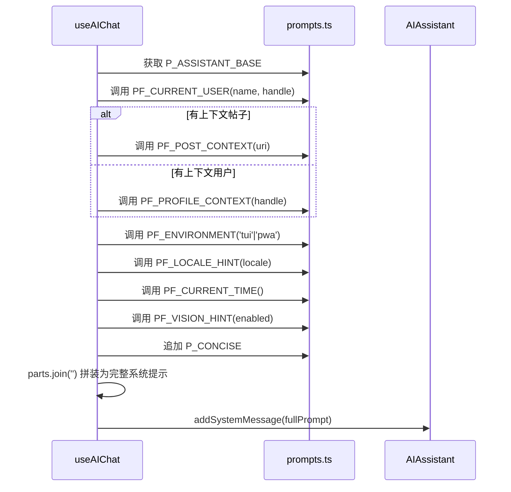

现在我已获取所有必要信息，开始撰写 Wiki 页面。

---

# AI 系统提示词与多提供商

## 设计意图

Bluesky 助手的 LLM 交互层基于两个核心决策：**提示词集中管理**避免字符串散落在各处，**多提供商注册表**标准化接入多个模型供应商。两者共同构成一个可维护、可扩展的 AI 后端骨架。

---

## 一、集中式提示词管理

所有 LLM 可见的文本——系统提示、翻译指令、润色模板、标题生成规则——统一收拢在 `prompts.ts` 中。这是"单一事实源"原则的体现：要修改 AI 行为，编辑这一个文件足矣。

代码采用双前缀命名约定：

| 前缀 | 含义 | 示例 |
|------|------|------|
| `P_` | **纯字符串常量** | `P_ASSISTANT_BASE`, `P_CONCISE`, `P_POLISH_SYSTEM` |
| `PF_` | **参数化函数**，根据参数返回拼装后的字符串 | `PF_CURRENT_USER(name, handle)`, `PF_TRANSLATE_JSON(lang)` |

[来源](packages/core/src/ai/prompts.ts#L1-L10)

### P_ASSISTANT_BASE：底座系统提示

这是多段字符串拼接而成的完整系统提示，包含：

- 角色定位（Bluesky 助手）
- 工具能力说明（instant_answer、search_wikipedia、fetch_web_markdown）
- search_posts 高级语法提示
- 图片/视频处理规则
- **四项安全约束**：禁止主动写操作、汇总时不建议发帖、明确要求后才执行、写操作由确认门拦截

[来源](packages/core/src/ai/prompts.ts#L30-L63)

### PF_* 函数族：上下文注入

每个 `PF_` 函数负责注入一个维度的上下文信息。拼装顺序见下面的序列图。

| 函数 | 注入内容 | 参数 |
|------|---------|------|
| `PF_CURRENT_USER` | 当前用户身份 | `name`, `handle?` |
| `PF_PROFILE_CONTEXT` | 正在查看的用户主页（含搜索建议） | `handle`, `currentUserHandle?` |
| `PF_POST_CONTEXT` | 正在查看的帖子 URI | `uri` |
| `PF_ENVIRONMENT` | 终端 / PWA 环境差异指示 | `env: 'tui'\|'pwa'` |
| `PF_LOCALE_HINT` | 回复语言偏好 | `locale` |
| `PF_CURRENT_TIME` | 当前时间 + 星期 | 无参数（动态获取系统时钟） |
| `PF_VISION_HINT` | 视觉模式开关状态及说明 | `enabled: boolean` |
| `P_CONCISE` | 简短回复指令 | （常量） |

[来源](packages/core/src/ai/prompts.ts#L70-L137)

### 提示词组装流程

以下展示 `useAIChat` 中 `buildSystemPrompt` 函数的组装全过程，它决定了 AI 每次对话接收到的系统消息：



最后还可以追加用户自定义提示词 `aiConfig.customSystemPrompt`，为高级用户提供 AI 行为微调入口。[来源](packages/app/src/hooks/useAIChat.ts#L71-L92)

---

## 二、多提供商注册表

`providers.ts` 加载 `providers.json`，由 TypeScript 接口确保类型安全，用户直接编辑 JSON 文件即可扩展提供商。

### 类型结构

```typescript
interface ProviderInfo {
  id: string;
  label: string;
  baseUrl: string;
  models: ModelInfo[];
  reasoningStyle: 'reasoning_content' | 'structured_content' | 'none';
}
```

[来源](packages/core/src/ai/providers.ts#L7-L20)

`reasoningStyle` 是区分提供商思考链路格式的关键字段：

| 提供商 | `reasoningStyle` | 含义 |
|--------|-----------------|------|
| **DeepSeek** | `reasoning_content` | 原生 `delta.reasoning_content` 字段，SSE 解析时直接透传 |
| **Mistral** | `structured_content` | content 中嵌入结构化数组（`[{type:'thinking',...},{type:'text',...}]`），SSE 解析时需按块类型分流 |

[来源](packages/core/src/ai/providers.json#L1-L24)

### 注册表模型清单

| 提供商 | 模型 ID | 标签 | 支持思维链 | 支持视觉 |
|--------|---------|------|-----------|---------|
| DeepSeek | `deepseek-v4-flash` | DeepSeek V4 Flash | ✅ | ❌ |
| DeepSeek | `deepseek-v4-pro` | DeepSeek V4 Pro | ✅ | ❌ |
| Mistral | `mistral-small-latest` | Mistral Small (24B) | ✅ | ✅ |
| Mistral | `pixtral-large-latest` | Pixtral Large (Vision) | ❌ | ✅ |
| Mistral | `mistral-medium-latest` | Mistral Medium (128B) | ❌ | ✅ |
| Mistral | `ministral-3b-latest` | Ministral 3B (Fast) | ❌ | ❌ |

### 辅助函数

- `getProviderById(id)` — 通过 ID 查找提供商
- `getProviderByBaseUrl(url)` — 通过 Base URL 匹配提供商（含尾部斜杠清理）
- `getModelInfo(providerId, modelId)` — 查询模型元数据
- `isCustomModel(providerId, modelId)` — 不在注册表中即为自定义模型
- `shouldSendThinkingParam(providerId)` — 仅 DeepSeek 使用非标准 `thinking` 参数

[来源](packages/core/src/ai/providers.ts#L26-L56)

### _buildMessages() 的提供商适配

非 `reasoning_content` 风格的提供商（如 Mistral），`_buildMessages` 会将 `reasoning_content` 字段合并为 `content` 的前缀文本，然后移除该字段，避免接口报 `extra_forbidden` 错误。[来源](packages/core/src/ai/assistant.ts#L321-L337)

---

## 三、translateText 的双模态设计与指数退避重试

`translateText` 是一个**单轮非流式** AI 调用函数，专为翻译场景优化。

### 双模态设计

| 模式 | 系统提示 | 响应格式 | 返回值 |
|------|---------|---------|--------|
| `simple` | `PF_TRANSLATE_SIMPLE` — 纯文本输出 | LLM 返回纯文本 | `{ translated: string }` |
| `json` | `PF_TRANSLATE_JSON` — 要求 JSON 格式 | `{"source_lang": "en", "translated": "..."}`；请求体追加 `response_format: { type: "json_object" }` | `{ translated: string, sourceLang: string }` |

[来源](packages/core/src/ai/prompts.ts#L148-L165)
[来源](packages/core/src/ai/assistant.ts#L728-L756)

### 指数退避重试

当以下情况触发重试（`maxRetries` 默认为 3）：

1. **空内容** — LLM 返回空白
2. **JSON 解析失败** — json 模式下 `JSON.parse` 出错
3. **缺少 translated 字段** — json 模式下解析成功但字段缺失
4. **网络/服务端错误** — HTTP 非 2xx

退避策略：

- 空内容/JSON 错误：`800 × (attempt + 1)` ms
- 网络/HTTP 错误：`1000 × (attempt + 1)` ms

所有尝试耗尽后抛出 `Translation failed after all retries`。

[来源](packages/core/src/ai/assistant.ts#L742-L821)

另提供便利函数 `translateToChinese(config, text)`，它等价于 `translateText(config, text, 'zh', 'simple')`。[来源](packages/core/src/ai/assistant.ts#L826-L829)

在 PWA 端，`useTranslation` hook 维护了 `Map<string, TranslationResult>` 作为翻译缓存，以 `${mode}::${lang}::${text}` 为键，避免重复翻译。[来源](packages/app/src/hooks/useTranslation.ts#L29-L51)

---

## 四、polishDraft 的调用链

`polishDraft` 是 `singleTurnAI` 的薄封装，用于润色帖子草稿。

### 调用链

```
polishDraft(config, draft, requirement)
  → singleTurnAI(config, systemPrompt, userPrompt, temperature=0.7, maxTokens=2000)
    → fetch POST {baseUrl}/v1/chat/completions
    → 返回 data.choices[0].message.content
```

其中：
- **systemPrompt** = `P_POLISH_SYSTEM`（"你是一个文字润色助手..."）
- **userPrompt** = `PF_POLISH_USER(requirement, draft)`（"用户要求：{requirement}\n\n草稿：\n{draft}"）
- **temperature** = 0.7（比翻译的 0.3 更高，允许一定创造性）
- **modelOverride?** — 可选，允许使用不同模型执行润色

[来源](packages/core/src/ai/assistant.ts#L834-L843)
[来源](packages/core/src/ai/prompts.ts#L171-L177)

### 消费端

- **TUI**：在 `App.tsx` 中通过 `Ctrl+P` 快捷键调用，用户输入润色要求后异步执行。[来源](packages/tui/src/components/App.tsx#L206-L207)
- **PWA**：`PolishWidget` 组件提供图形界面，用户拖入选中文本、输入要求，点击润色后展示 diff 操作。[来源](packages/pwa/src/components/widgets/PolishWidget.tsx#L33)

---

## 五、generateChatTitle 的自动标题生成

当用户发送首条真实消息并收到 AI 回复后，`useAIChat` 的 `autoSave` 函数会异步调用 `generateChatTitle`。

### 调用链

```
generateChatTitle(config, firstUserMsg, firstAiReply)
  → singleTurnAI(config, P_AUTO_TITLE_SYSTEM, PF_AUTO_TITLE_USER(...), temperature=0.3)
    → 返回 raw 文本
  → cleaned = raw.trim().replace(/^["「『\s]+|["」』\s]+$/g, '').slice(0, 50)
  → 返回 cleaned || firstUserMsg.slice(0, 50)  // 失败时回落为消息前50字符
```

### 提示词规则

系统提示 `P_AUTO_TITLE_SYSTEM` 规定了严格约束：

- 使用用户消息的语言
- 2-15 个字（中文/日文）或 3-8 个词（英文）
- 提取对话核心主题
- 只返回标题文本本身

[来源](packages/core/src/ai/prompts.ts#L209-L223)

### 触发时机

`useAIChat` 中通过 `titleGeneratedRef` 标记确保每段对话只生成一次标题。触发条件：

1. 存在非 `<currently_viewing>` 的用户消息（排除自动分析请求）
2. 存在至少一条 assistant 回复
3. 聊天记录已持久化

标题生成是 fire-and-forget 的异步操作：一旦生成成功，立即更新存储中的对话标题并调用 `onTitleChanged` 回调刷新列表。[来源](packages/app/src/hooks/useAIChat.ts#L247-L280)

---

## 总结

这四个模块构成了 AI 交互层的"基础设施层"：

- **提示词集中管理**确保 AI 行为可审计、可定制
- **提供商注册表**抹平了 DeepSeek 与 Mistral 的 API 差异
- **translateText** 的双模态 + 指数退避为翻译功能提供了容错保障
- **polishDraft** 和 **generateChatTitle** 展示了 `singleTurnAI` 作为通用单轮调用基座的可复用性

关于多轮对话引擎和工具调用循环的完整实现，参见 [](ai-对话引擎.md)。38 个工具的定义清单详见 [](38-个-ai-工具系统.md)。