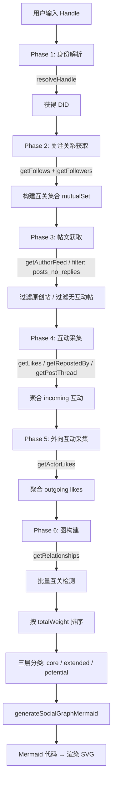

# AT Play 实验功能

> AT Play 是整个项目中的实验性功能实验室，目前仅 PWA 端可用。首个实验是**社交圈分析（Social Circle Analysis）**——一条从 Handle 到 Mermaid 图表的完整数据管线。

---

## 架构总览

AT Play 遵循与主应用相同的 `core → app → PWA` 分层架构，新增代码分散在三层中：

```
packages/
  core/src/at/client.ts         — 2 个新 API 方法（getActorLikes, getRelationships）
  core/src/at/types.ts          — 响应类型
  app/src/hooks/useSocialCircle.ts — 纯函数 + React Hook
  app/src/i18n/locales/*.ts     — 36+ i18n 键
  pwa/src/components/AtPlayPage.tsx       — 实验列表页 (#/atplay)
  pwa/src/components/AtPlaySocialCircle.tsx — 社交圈分析 UI (#/atplay/social-circle)
```

[来源](docs/ATPLAY.md#L16-L16)

### 导航流

```
Sidebar (🧪 AT Play)  →  #/atplay (experiment list)  →  #/atplay/social-circle (analysis)
```

实验列表页展示副标题"基于 AT Protocol 的实验性功能"和卡片式实验条目，每条含图标、名称、描述，点击跳转至对应分析页。[来源](docs/ATPLAY.md#L27-L32)

---

## 完整数据管线

社交圈分析的核心是一条 6 阶段流水线，从用户输入 Handle 到最终的可视化图表：



[来源](docs/ATPLAY.md#L47-L77)

### 各阶段详解

| 阶段 | 调用 API | 产出 | 关键参数 |
|------|----------|------|----------|
| Identity | `resolveHandle` | DID | 用户输入 handle |
| Relations | `getFollows` + `getFollowers` | 互关 DID 集合 | 各取前 100 |
| Posts | `getAuthorFeed` | 原创帖列表 | `maxPosts=30~100`, `filter=posts_no_replies` |
| Incoming | `getLikes` + `getRepostedBy` + `getPostThread` | 加权互动映射 | 每帖取前 100 互动者；仅解析回复数前 5 的帖 |
| Outgoing | `getActorLikes` | 外向点赞 | 取 50 条 |
| Graph | `getRelationships` | 互关标记 | 只查 top 30 互动者 |

[来源](packages/app/src/hooks/useSocialCircle.ts#L269-L402)

### 帖文过滤策略

`getAuthorFeed` 以 `posts_no_replies` 过滤器获取帖文后，依次执行两次过滤：

1. **剔除转发**：检查 `reason.$type !== 'app.bsky.feed.defs#reasonRepost'` [来源](packages/app/src/hooks/useSocialCircle.ts#L287-L287)
2. **筛选有互动**：只保留 `likeCount > 0 || repostCount > 0` 的帖 [来源](packages/app/src/hooks/useSocialCircle.ts#L292-L294)

> **为什么这样设计？** 转发不代表用户自己的内容产出；零互动的帖文也无法贡献互动者数据。两步过滤确保采集效率最优。

---

## 权重体系

`INTERACTION_WEIGHTS` 定义了三种互动类型的权重值：

```typescript
export const INTERACTION_WEIGHTS = {
  like:   1.5,   // 点赞：低成本互动，权重最低
  repost: 2.0,   // 转发：中等成本，代表内容认同
  reply:  3.0,   // 回复：高成本，代表深度对话
} as const;
```

[来源](packages/app/src/hooks/useSocialCircle.ts#L61-L65)

### 权重计算函数

两个纯函数分别计算**入向**和**出向**权重：

```typescript
function computeIncomingWeight(raw: RawInteraction): number {
  return raw.likes * 1.5 + raw.reposts * 2.0 + raw.replies * 3.0;
}

function computeOutgoingWeight(raw: RawInteraction): number {
  return raw.outgoingLikes * 1.5 + raw.outgoingReposts * 2.0 + raw.outgoingReplies * 3.0;
}

function computeWeight(raw: RawInteraction): number {
  return computeIncomingWeight(raw) + computeOutgoingWeight(raw);
}
```

[来源](packages/app/src/hooks/useSocialCircle.ts#L117-L135)

`totalWeight` = 入向权重 + 出向权重，既衡量"别人对你的互动"，也衡量"你对别人的互动"，实现双向社交亲密度评估。

### 当前限制

出向追踪**仅覆盖点赞**（`getActorLikes`），出向转发和回复尚未采集。[来源](docs/ATPLAY.md#L202-L203)

---

## 三层分类标准

所有互动者按 `totalWeight` 降序排列，划入三个圈层：

| 层级 | 常量 | 数量 | 筛选条件 |
|------|------|------|----------|
| **核心圈** Core | `CORE_CIRCLE_SIZE = 5` | 前 5 名 | 按 `totalWeight` 取 top 5 |
| **扩展圈** Extended | `EXTENDED_CIRCLE_SIZE = 10` | 第 6~15 名 | 前 5 名之后的下 10 位 |
| **潜在圈** Potential | 动态 | ≤ 5 名 | 剩余中 `isMutual=true` 且 `totalWeight > 0`，取前 5 |

[来源](packages/app/src/hooks/useSocialCircle.ts#L67-L69)

代码实现：

```typescript
const sorted = [...allInteractors].sort((a, b) => b.totalWeight - a.totalWeight);
const core = sorted.slice(0, CORE_CIRCLE_SIZE);
const extended = sorted.slice(CORE_CIRCLE_SIZE, CORE_CIRCLE_SIZE + EXTENDED_CIRCLE_SIZE);
const potential = sorted
  .filter(info => !core.includes(info) && !extended.includes(info) && info.isMutual && info.totalWeight > 0)
  .slice(0, 5);
```

[来源](packages/app/src/hooks/useSocialCircle.ts#L396-L401)

**潜在圈的设计意图**：识别"互相关注但互动很少"的人，帮助用户发现那些值得主动维护的关系。这是社交圈分析最有价值的产出之一。

---

## Mermaid 图表生成：纯函数设计

`generateSocialGraphMermaid` 是一个**零 React 依赖的纯函数**，接收三个层级的互动者数据，返回 Mermaid `graph TD` 代码字符串：

```typescript
export function generateSocialGraphMermaid(
  userHandle: string,
  core: InteractorInfo[],
  extended: InteractorInfo[],
  potential: InteractorInfo[],
): string
```

[来源](packages/app/src/hooks/useSocialCircle.ts#L160-L206)

### 生成逻辑

1. **用户节点**：用双圆 `(("..."))` 表示，CSS 类 `selfNode`（紫色）
2. **各层节点**：核心圈用圆角矩形 `(...)` + `coreNode`（蓝色）；扩展圈用 `[...]` + `extNode`（绿色）；潜在圈用 `[...]` + `potNode`（橙色）
3. **连线**：仅核心圈节点显示双向边 `↔`，线宽按 `totalWeight / maxWeight × 4` 等比映射
4. **互关标记**：互关节点使用 `(label)` 形状，非互关使用 `[label]`
5. **标签转义**：`displayName` 中的双引号替换为 `#quot;`

```typescript
// 样式定义
classDef selfNode fill:#8b5cf6,stroke:#6d28d9,color:white;
classDef coreNode fill:#3b82f6,stroke:#1d4ed8,color:white;
classDef extNode  fill:#10b981,stroke:#047857,color:white;
classDef potNode  fill:#f59e0b,stroke:#d97706,color:white;
```

[来源](packages/app/src/hooks/useSocialCircle.ts#L199-L203)

### 为什么强调"纯函数"？

该函数未来计划注册为一个 **AI 工具**——AI Assistant 可以直接调用它生成图表代码，无需经过 React hook 层。`buildSocialCircleShareText` 也是同样的纯函数设计，用于生成三语言分享文案。[来源](docs/ATPLAY.md#L235-L237)

### PWA 端渲染

使用动态导入 `import('mermaid')`（独立 chunk，不打包进主包）：

```typescript
// 配置
{ startOnLoad: false, theme: 'base', securityLevel: 'loose' }
// 渲染 ID: 模块级计数器 + useRef，保证唯一
// 输出: dangerouslySetInnerHTML 嵌入 SVG
// 降级: 渲染失败时展示 <pre> 原始代码
```

[来源](docs/ATPLAY.md#L209-L215)

---

## Compose 预填充 API

社交圈分析的"分享到 Bluesky"按钮使用了一套通用的**预填充机制**——任何页面只需一行代码即可跳转到发帖页并自动填入文本：

```typescript
goTo({ type: 'compose', initialText: 'Your pre-filled text here' });
```

[来源](docs/ATPLAY.md#L188-L190)

### 实现原理

```
AtPlaySocialCircle.tsx
    │
    │  buildSocialCircleShareText(result, locale) → text
    │
    ▼
goTo({ type: 'compose', initialText: text })
    │
    ▼
navigation.ts → AppView 支持 initialText? 字段
    │
    ▼
ComposePage.tsx → useEffect 检测 initialText
    │
    ▼
loadFromDraft([{ text: initialText }])  → 填充编辑器
    │
    ▼
initialTextAppliedRef.current = true   → 仅执行一次
```

关键实现细节：

1. **类型层**：`AppView` 的 `compose` 变体添加可选字段 `initialText?: string` [来源](packages/app/src/state/navigation.ts#L5-L5)
2. **守卫条件**：仅当 `initialText` 存在且 `draftId` 未设置时才触发填充——避免与草稿加载冲突 [来源](packages/pwa/src/components/ComposePage.tsx#L80-L83)
3. **一次性守卫**：`useRef(false)` 标记，确保只填充一次，后续页面切换不会重复覆盖 [来源](packages/pwa/src/components/ComposePage.tsx#L78-L78)

### 分享文案示例（中文）

```
我在 ai-bsky.pages.dev 分析了我的双向社交圈

📊 分析了 50 篇帖文
👥 发现 12 位互动者，5 位互关
💜 核心圈 5 人

双向分析：别人对我的赞/转发/回复 + 我对别人的赞

ai-bsky.pages.dev
```

[来源](docs/ATPLAY.md#L219-L229)

`buildSocialCircleShareText` 函数内置三语言（zh/en/ja）文案，根据传入的 `locale` 自动切换。[来源](packages/app/src/hooks/useSocialCircle.ts#L212-L246)

---

## 与现有系统的关系

| 系统 | 关联方式 |
|------|----------|
| [AT Protocol 客户端](at-protocol-客户端.md) | 复用 `BskyClient` 实例，新增 `getActorLikes`、`getRelationships` 方法 |
| [React Hooks 体系](react-hooks-体系.md) | `useSocialCircle` 是标准数据 hook，返回 `{ state, analyze, reset }` |
| [导航状态机](导航状态机.md) | 新增 `atplay`、`atplaySocialCircle` 两个 AppView 类型 |
| [国际化（i18n）系统](国际化-i18n-系统.md) | 新增 36+ 翻译键，覆盖三层分类名称、统计字段、交互文案 |
| [Store 订阅模式](store-订阅模式.md) | 未使用 Store，`useSocialCircle` 使用内部 `useState` 管理状态 |
| [38 个 AI 工具系统](38-个-ai-工具系统.md) | `generateSocialGraphMermaid` 与 `INTERACTION_WEIGHTS` 已预留为将来 AI 工具注册 |

---

## 已知局限

- **出向追踪不完整**：仅追踪点赞，未追踪出向转发和回复
- **50 帖默认窗口**：滑块可调 30~100，更大值产出更全面但耗时更长
- **无 AI 工具**：纯计算阶段，纯函数已导出但尚未注册为 AI 工具
- **仅 PWA 可用**：无 TUI 实现
- **分享不含 SVG**：当前纯文本分享，SVG 图片分享待开发

[来源](docs/ATPLAY.md#L202-L207)

---

## 推荐阅读

- [概览](概览.md) — 了解项目定位与双界面架构
- [AT Protocol 客户端](at-protocol-客户端.md) — 理解底层 API 调用的鉴权与重试机制
- [React Hooks 体系](react-hooks-体系.md) — 查看其他数据 hook 的设计模式对比
- [PWA 核心组件详解](pwa-核心组件详解.md) — 了解 ComposePage 完整实现