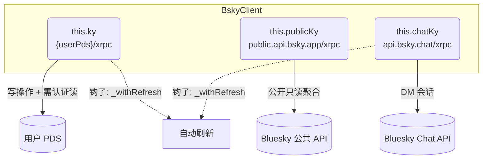
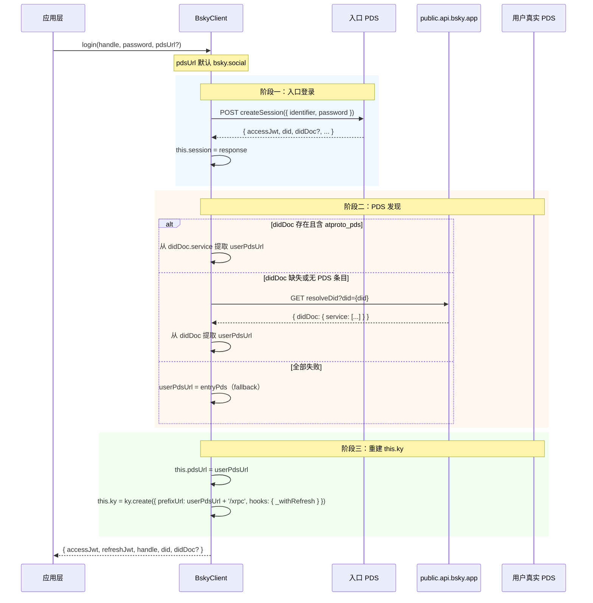

# AT Protocol 客户端

`BskyClient` 是 **@bsky/core** 包的核心类，封装了完整的 AT Protocol HTTP 通信。它不是一个轻量 API 封装，而是包含 **会话管理的状态机**、**自动 JWT 刷新**、**PDS 发现路由**和 **三重 HTTP 实例**的客户端架构。全文 835 行，50+ 公开方法，跨越公私混合 API 和 DM 专线。

---

## 一、构造函数：三重 `ky` 实例的职责分离

构造函数创建三个 **独立、持久** 的 `ky` 实例，分别对应三个不同的服务端点，职责严格分离：



| 实例 | 目标 URL | 职责范围 | 是否挂载 `_withRefresh` 钩子 |
|---|---|---|---|
| `this.ky` | `{pdsUrl}/xrpc` | 所有写操作（发帖、关注、点赞）、需认证的读（时间线、通知）、自定义端点（书签、草稿） | ✅ |
| `this.publicKy` | `public.api.bsky.app/xrpc` | 公开只读聚合（搜索用户、解析 handle、公开个人资料） | ❌ |
| `this.chatKy` | `api.bsky.chat/xrpc` | DM 私信操作（`chat.bsky.convo.*` 命名空间） | ✅ |

三个实例共用一个 **超时配置**（30s）和 **重试策略**（最多 1 次重试，覆盖 408/413/429/500/502/503/504）。这种三重实例设计的核心意图是：

- **`this.ky` 的地址在登录后可能变更**（PDS 发现），构造函数中的初始值指向入口 PDS，`login()` 完成后重建指向用户真实 PDS。
- **`this.publicKy` 永不变**，始终指向 Bluesky 官方的公共聚合 API，用于未认证或公开查询。
- **`this.chatKy` 也永不变**，DM 服务由 Bluesky 官方托管，独立于 PDS。[来源](packages/core/src/at/client.ts#L51-L128)

---

## 二、`_withRefresh`：并发安全的 JWT 自动刷新

这是 `BskyClient` 中最精妙的设计——一个 **挂载在 ky 钩子系统上的、带并发锁的令牌刷新机制**。

### 触发条件与流程

```typescript
this._withRefresh = async (request, _options, response) => {
  if (!response.ok) {
    const body = await response.clone().text();
    if (response.status === 400 && self.session) {
      const err = JSON.parse(body);
      if (err.error === 'ExpiredToken' || err.error === 'InvalidToken') {
        // → 执行刷新逻辑
      }
    }
  }
};
```

只有三个条件同时满足时才会触发刷新：HTTP 400、错误类型为 `ExpiredToken` 或 `InvalidToken`、且存在 session。[来源](packages/core/src/at/client.ts#L69-L110)

### 并发锁实现

```typescript
if (!self._refreshPromise) {
  self._refreshPromise = (async () => {
    // 200ms 防抖 + 发送 refreshSession 请求
    const r = await fetch(`${self.pdsUrl}/xrpc/com.atproto.server.refreshSession`, {
      method: 'POST',
      headers: { Authorization: `Bearer ${session.refreshJwt}` },
    });
    if (r.ok) {
      self.session = await r.json();
      return self.session;
    }
    self.session = null; // 刷新失败 → 清空会话
    return null;
  })();
  self._refreshPromise.finally(() => { self._refreshPromise = null; });
}
const refreshed = await self._refreshPromise;
```

关键特性：

1. **互斥锁**：`_refreshPromise` 作为锁变量，第一次进入时创建 Promise，后续并发请求 await 同一个 Promise，不会重复发起刷新。
2. **原子释放**：`.finally()` 无论刷新成功或失败都会重置锁，保证下次令牌过期时能再次触发。
3. **200ms 防抖**：`new Promise(r => setTimeout(r, 200))` 防止短时间内高频刷新的竞态。
4. **重试原始请求**：刷新成功后用新的 `accessJwt` 重放原始请求并返回结果，对调用方 **完全透明**。
5. **纯 `fetch`**：刷新请求故意 **不使用 ky**，避免触发递归钩子。[来源](packages/core/src/at/client.ts#L76-L104)

`_withRefresh` 挂载在 `this.ky` 和 `this.chatKy` 的 `hooks.afterResponse` 上，但 **不挂载在 `this.publicKy`**（公共 API 不需要鉴权，也无需刷新）。[来源](packages/core/src/at/client.ts#L116-L128)

---

## 三、两阶段 `login`：从入口 PDS 发现用户真实 PDS

这是 AT Protocol 客户端区别于普通 HTTP 封装的核心——**Two-PDS 模型**。



### 阶段一：入口登录

使用入口 PDS（默认 `https://bsky.social`）调用 `com.atproto.server.createSession`。如果构造函数传入了自定义 `pdsUrl`，它会被用作入口。[来源](packages/core/src/at/client.ts#L136-L148)

注意一个微妙细节：如果入口 PDS **不是** `bsky.social`，login 方法会创建一个 **临时 ky 实例**，而非使用 `this.ky`：

```typescript
const entryKy = entryUrl === BSKY_SERVICE || !this.ky
  ? ky.create({ prefixUrl: entryUrl + '/xrpc', ... })
  : this.ky;
```

这是因为登录完成前 `this.ky` 可能指向错误的 PDS。[来源](packages/core/src/at/client.ts#L138-L144)

### 阶段二：PDS 发现

`createSession` 的响应中可能包含 `didDoc`（DID Document）。客户端在其中查找 `id === '#atproto_pds'` 或 `type === 'AtprotoPersonalDataServer'` 的 service entry，提取 `serviceEndpoint`。[来源](packages/core/src/at/client.ts#L154-L166)

如果 `didDoc` 不存在（这是可选字段），调用 `_discoverPdsFromDid` 通过公共 API 的 `com.atproto.identity.resolveDid` 获取 DID 文档。[来源](packages/core/src/at/client.ts#L179-L187)

两种发现路径都失败时，**回退到入口 PDS**。这是最安全的策略——bsky.social 本身就是代理 PDS，转发请求到用户真实 PDS。[来源](packages/core/src/at/client.ts#L168)

### 阶段三：重建 `this.ky`

发现用户真实 PDS 后，重建 `this.ky`：

```typescript
this.pdsUrl = userPdsUrl;
this.ky = ky.create({
  prefixUrl: this.pdsUrl + '/xrpc',
  timeout: 30000,
  retry: { limit: 1, statusCodes: [408, 413, 429, 500, 502, 503, 504] },
  hooks: { afterResponse: [this._withRefresh] },
});
```

所有后续请求自动指向用户真实 PDS。[来源](packages/core/src/at/client.ts#L169-L174)

---

## 四、`restoreSession` 与会话持久化

`restoreSession` 是 `login` 的逆操作——不需要密码，直接重建已认证的客户端实例。

```typescript
restoreSession(session: CreateSessionResponse, pdsUrl?: string): void {
  this.session = session;
  if (pdsUrl) this.pdsUrl = pdsUrl;
  this.ky = ky.create({
    prefixUrl: this.pdsUrl + '/xrpc',
    timeout: 30000,
    retry: { limit: 1, statusCodes: [408, 413, 429, 500, 502, 503, 504] },
    hooks: { afterResponse: [this._withRefresh] },
  });
}
```

它不做网络请求，只做三件事：

1. **恢复 session**：设置 `this.session` 为已有的 `CreateSessionResponse`。
2. **恢复 PDS URL**：设置 `this.pdsUrl`（如果提供），否则沿用当前值。
3. **重建 this.ky**：用正确的 PDS URL 重建 ky 实例，并重新挂载 `_withRefresh` 钩子。

注意：`publicKy` 和 `chatKy` **不需要重建**，它们不依赖用户 PDS。[来源](packages/core/src/at/client.ts#L615-L624)

### 持久化链路

PWA 端通过 `useSessionPersistence.ts` 实现 localStorage 持久化：

```typescript
interface StoredSession {
  accessJwt: string;
  refreshJwt: string;
  handle: string;
  did: string;
  pdsUrl?: string;
}
```

序列化时只保存 **四个核心字段 + 可选的 pdsUrl**，不保存完整的 `CreateSessionResponse`。[来源](packages/pwa/src/hooks/useSessionPersistence.ts#L1-L27)

`AuthStore.restoreSession` 的恢复流程则更完整——它会在重建客户端后异步获取 profile，如果 profile 请求失败且 `isAuthenticated()` 返回 false，则标记 session 已过期。[来源](packages/app/src/stores/auth.ts#L47-L65)

---

## 五、全部 API 方法分组

`BskyClient` 的 50+ 公开方法按功能领域可分为以下 8 个组：

### 5.1 时间线与 Feed（6 个方法）

| 方法 | 端点 | 认证要求 | 使用的实例 |
|---|---|---|---|
| `getTimeline` | `app.bsky.feed.getTimeline` | 必需 | `this.ky` |
| `getAuthorFeed` | `app.bsky.feed.getAuthorFeed` | 可选 | `this.ky` / `this.publicKy` |
| `getFeed` | `app.bsky.feed.getFeed` | 可选 | `this.ky` / `this.publicKy` |
| `getListFeed` | `app.bsky.feed.getListFeed` | 可选 | `this.ky` / `this.publicKy` |
| `getFeedGenerator` | `app.bsky.feed.getFeedGenerator` | 可选 | `this.ky` / `this.publicKy` |
| `getSuggestedFeeds` | `app.bsky.feed.getSuggestedFeeds` | 必需 | `this.ky` |

[来源](packages/core/src/at/client.ts#L204-L211)

### 5.2 帖子操作（6 个方法）

| 方法 | 端点 | 说明 |
|---|---|---|
| `getPostThread` | `app.bsky.feed.getPostThread` | 线程视图，可选认证 |
| `getLikes` | `app.bsky.feed.getLikes` | 点赞列表 |
| `getRepostedBy` | `app.bsky.feed.getRepostedBy` | 转发列表 |
| `deletePost` | `com.atproto.repo.deleteRecord` | 删除帖子 |
| `createRecord` | `com.atproto.repo.createRecord` | 通用创建记录（发帖、点赞、关注） |
| `deleteRecord` | `com.atproto.repo.deleteRecord` | 通用删除记录 |

[来源](packages/core/src/at/client.ts#L225-L233)

### 5.3 社交图（10 个方法）

包括 `getFollows`、`getFollowers`、`getSuggestedFollows`、`follow`、`unfollow`、`getRelationships`、`getActorLikes`，以及列表相关：`getList`、`getLists`、`getListBlocks`、`getListMutes`、`getListsWithMembership`、`createList`、`deleteList`、`updateList`、`addListItem`、`removeListItem`、`blockList`、`unblockList`、`muteActorList`、`unmuteActorList`。[来源](packages/core/src/at/client.ts#L275-L457)

### 5.4 书签（3 个方法）

| 方法 | 端点 |
|---|---|
| `createBookmark` | `app.bsky.bookmark.createBookmark` |
| `deleteBookmark` | `app.bsky.bookmark.deleteBookmark` |
| `getBookmarks` | `app.bsky.bookmark.getBookmarks` |

⚠️ **非标准端点**：`app.bsky.bookmark.*` 是 Bluesky 自定义端点，不属于标准 AT Protocol，第三方 PDS 可能不实现。[来源](packages/core/src/at/client.ts#L626-L663)

### 5.5 草稿（4 个方法）

| 方法 | 端点 |
|---|---|
| `createDraft` | `app.bsky.draft.createDraft` |
| `updateDraft` | `app.bsky.draft.updateDraft` |
| `getDrafts` | `app.bsky.draft.getDrafts` |
| `deleteDraft` | `app.bsky.draft.deleteDraft` |

同样是非标准端点。[来源](packages/core/src/at/client.ts#L665-L693)

### 5.6 通知与趋势（2 个方法）

| 方法 | 端点 | 说明 |
|---|---|---|
| `listNotifications` | `app.bsky.notification.listNotifications` | 需认证 |
| `getTrends` | `app.bsky.unspecced.getTrends` | 可选认证，`personalizedFor` 参数 |

[来源](packages/core/src/at/client.ts#L459-L507)

### 5.7 搜索与身份（4 个方法）

| 方法 | 端点 | 使用的实例 |
|---|---|---|
| `searchPosts` | `app.bsky.feed.searchPosts` | `this.ky`（强制认证） |
| `searchActors` | `app.bsky.actor.searchActors` | `this.publicKy` |
| `resolveHandle` | `com.atproto.identity.resolveHandle` | `this.publicKy` |
| `getProfile` | `app.bsky.actor.getProfile` | 可选认证 |

注意：`searchPosts` 强制要求认证，公共 API 返回 403。[来源](packages/core/src/at/client.ts#L189-L273)

### 5.8 私信（DM）— 9 个方法

DM 方法通过 `chatKy` 实例通信，全部使用私有辅助方法 `chatGet<T>` 和 `chatPost<T>`：

| 方法 | 端点 |
|---|---|
| `listConvos` | `chat.bsky.convo.listConvos` |
| `getConvoForMembers` | `chat.bsky.convo.getConvoForMembers` |
| `getMessages` | `chat.bsky.convo.getMessages` |
| `sendMessage` | `chat.bsky.convo.sendMessage` |
| `addReaction` | `chat.bsky.convo.addReaction` |
| `removeReaction` | `chat.bsky.convo.removeReaction` |
| `updateRead` | `chat.bsky.convo.updateRead` |
| `deleteMessageForSelf` | `chat.bsky.convo.deleteMessageForSelf` |
| `muteConvo` / `unmuteConvo` / `leaveConvo` | `chat.bsky.convo.*` |

详细 DM 架构见 [Direct Messages 私信系统](direct-messages-私信系统.md)。[来源](packages/core/src/at/client.ts#L703-L784)

### 5.9 辅助方法（6 个）

| 方法 | 用途 |
|---|---|
| `getDID()` | 获取当前用户 DID |
| `getHandle()` | 获取当前用户 handle |
| `getAccessJwt()` | 获取当前 access JWT |
| `isAuthenticated()` | 检查是否已认证 |
| `getVideoThumbnailUrl()` | 生成视频缩略图 URL |
| `getVideoPlaylistUrl()` | 生成 HLS 播放列表 URL |

[来源](packages/core/src/at/client.ts#L596-L701)

---

## 关键设计决策

1. **ky 而非 fetch**：选择 [ky](https://github.com/sindresorhus/ky) 而非裸 fetch，因为它内置了超时、重试和钩子系统——三个实例共用的 `retry` 配置（`{ limit: 1 }`）和 `_withRefresh` 钩子都是 ky 生态的产物。

2. **`_withRefresh` 是箭头函数**：定义在构造函数中而非原型方法上，因为需要捕获 `this` 的正确引用（`const self = this`），闭包方式确保即使在 ky 上下文（`this` 被绑定）中也能访问实例。[来源](packages/core/src/at/client.ts#L67-L69)

3. **`publicKy` 不使用 `_withRefresh`**：公共 API 的请求不需要鉴权，也不会返回 `ExpiredToken`。如果误挂载钩子，反而可能导致无意义的刷新调用。

4. **login 的临时 ky**：登录方法创建临时 ky 而非复用 `this.ky`，是为了避免登录前 `this.ky` 指向错误 PDS 导致的请求失败。[来源](packages/core/src/at/client.ts#L138-L144)

5. **chatKy 也挂载 `_withRefresh`**：DM 服务的 JWT 与主 PDS 的 JWT 属于同一签发体系，过期后同样需要刷新。[来源](packages/core/src/at/client.ts#L127)

---

## 推荐阅读

- [三层架构详解](三层架构详解.md) — 理解 `BskyClient` 在 core → app → tui/pwa 层级中的定位
- [第三方 PDS 支持](第三方-pds-支持.md) — Two-PDS 模型的完整文档与 CORS 处理
- [AT Protocol 类型系统](at-protocol-类型系统.md) — 所有响应类型的定义与 AT URI 解析
- [Store 订阅模式](store-订阅模式.md) — `AuthStore` 如何桥接 BskyClient 与 React 组件
- [关键教训与架构决策记录](关键教训与架构决策记录.md) — JWT 刷新、PDS 发现等核心教训汇编