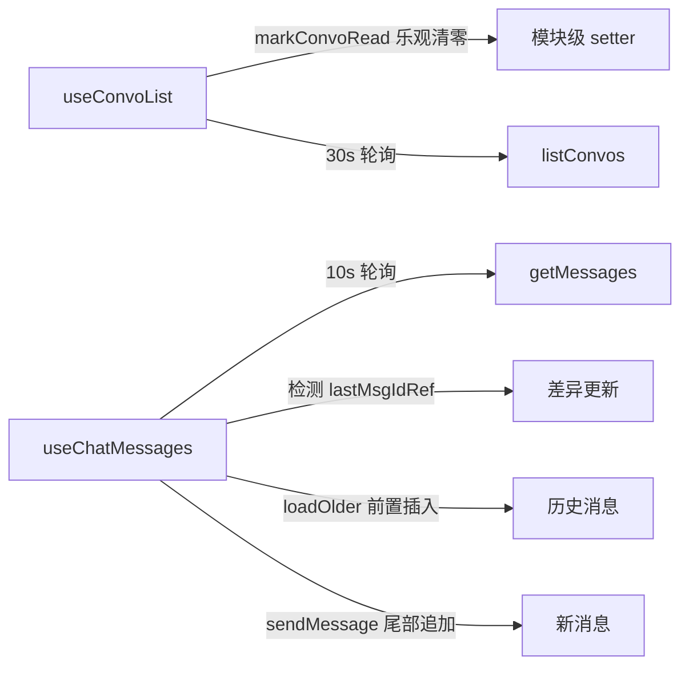

# Direct Messages 私信系统

Bluesky 的私信系统是这套应用中与主信息流截然不同的**独立传输平面**。它由独立的聊天服务 `api.bsky.chat` 托管，不走 PDS 代理，直接用 Session JWT 鉴权。这一架构决策源于 AT Protocol 的服务分离设计，也经历了一段试错过程才找到正确路径。

---

## 架构总览：一个独立于 PDS 的聊天平面

所有 `chat.bsky.convo.*` 端点由 `https://api.bsky.chat/xrpc` 提供，与 `app.bsky.*` 主端点完全分离。`BskyClient` 为此维护了三个独立的 ky 实例：

```
this.chatKy = ky.create({
  prefixUrl: 'https://api.bsky.chat/xrpc',  // 独立端点
  timeout: 30000,
  hooks: { afterResponse: [this._withRefresh] },
});
```

三个 ky 实例各司其职：

| 实例 | 端点 | 用途 |
|------|------|------|
| `this.ky` | `{pdsUrl}/xrpc` | 用户 PDS 代理（含自动 JWT 刷新） |
| `this.publicKy` | `https://public.api.bsky.app/xrpc` | 公共只读 API（无需鉴权） |
| `this.chatKy` | `https://api.bsky.chat/xrpc` | 聊天 API（直连，Session JWT 鉴权） |

聊天 API 使用 `chatGet<T>` / `chatPost<T>` 两个私有辅助方法统一处理 GET 和 POST 请求，它们都调用 `this.getAuthHeaders()` 注入 `Authorization: Bearer {accessJwt}` 头。

[来源](packages/core/src/at/client.ts#L51-L53) — 常量定义
[来源](packages/core/src/at/client.ts#L60-L60) — `chatKy` 实例声明
[来源](packages/core/src/at/client.ts#L123-L128) — `chatKy` 实例创建
[来源](packages/core/src/at/client.ts#L705-L718) — `chatGet` 和 `chatPost` 辅助方法

---

## 鉴权探索：三条死路与一条活路

在到达正确的直连方案之前，代码经历了三次错误尝试，全部返回 **501 Not Implemented**。理解这些死路有助于加深对 AT Protocol 服务边界的认识。

### 错误路径一：`getServiceAuth` → Service JWT

```
bsky.social/xrpc/com.atproto.server.getServiceAuth → 501
```

`getServiceAuth` 是 AT Protocol 中为服务间鉴权设计的端点，它签发一个基于 Session 的 **Service JWT**，理论上应作为聊天 API 的鉴权凭据。但 Bluesky PDS 尚未实现此端点。即使未来实现，`api.bsky.chat` 也同时接受 Session JWT 直连，因此这条路径可以被安全地绕开。

### 错误路径二：Session JWT + `xrpc-service-proxy` Header（经 PDS 代理）

```
bsky.social/xrpc/chat.bsky.convo.listConvos → 501
```

`xrpc-service-proxy` 是 AT Protocol 允许客户端通过 PDS 代理调用第三方服务的 header 机制。然而 Bluesky PDS **不支持聊天服务的代理转发**，所有聊天请求必须直接发往 `api.bsky.chat`。

### 错误路径三：Session JWT + `xrpc-service-proxy`（经用户 PDS）

```
{userPds}.host.bsky.network/xrpc/chat.bsky.convo.* → 501
```

即便是用户的私有 PDS（如 `*.host.bsky.network`），同样不支持聊天代理。这一结果与路径二一致，原因相同。

### 正确路径：Session JWT 直连 `api.bsky.chat`

```
POST https://api.bsky.chat/xrpc/chat.bsky.convo.sendMessage
Authorization: Bearer {accessJwt}

GET https://api.bsky.chat/xrpc/chat.bsky.convo.listConvos?limit=30
Authorization: Bearer {accessJwt}
```

**关键发现**：聊天服务直接信任 Bluesky PDS 签发的 Session JWT（JWT 的 `aud` 指向 PDS，但跨服务信任关系成立）。所以：
- **主机**：`https://api.bsky.chat/xrpc`
- **鉴权**：`accessJwt`（与 `app.bsky.*` 共用同一个 token）
- **不需要**：`getServiceAuth`、`xrpc-service-proxy` header、PDS 代理

[来源](docs/DM.md#L26-L46) — 三条错误路径与正确路径

---

## API 端点全景

| 端点 | 方法 | 用途 | 核心参数 |
|------|------|------|----------|
| `chat.bsky.convo.listConvos` | GET | 分页列出会话 | `limit`, `cursor` |
| `chat.bsky.convo.getConvoForMembers` | GET | 按成员 DID 获取或创建 1:1 会话 | `members`（逗号分隔） |
| `chat.bsky.convo.getMessages` | GET | 游标分页获取消息 | `convoId`, `limit`, `cursor` |
| `chat.bsky.convo.sendMessage` | POST | 发送文字消息 | `convoId`, `message: { text, facets?, embed? }` |
| `chat.bsky.convo.sendMessageBatch` | POST | 批量发送 | — |
| `chat.bsky.convo.addReaction` | POST | 添加 emoji 反应（幂等） | `convoId`, `messageId`, `value` |
| `chat.bsky.convo.removeReaction` | POST | 移除 emoji 反应 | `convoId`, `messageId`, `value` |
| `chat.bsky.convo.updateRead` | POST | 标记已读 | `convoId`, `messageId?` |
| `chat.bsky.convo.getLog` | GET | 轮询事件日志 | —（**未实现**） |
| `chat.bsky.convo.muteConvo` | POST | 静音会话 | `convoId` |
| `chat.bsky.convo.unmuteConvo` | POST | 取消静音 | `convoId` |
| `chat.bsky.convo.deleteMessageForSelf` | POST | 删除自己的消息 | `convoId`, `messageId` |
| `chat.bsky.convo.leaveConvo` | POST | 离开会话 | `convoId` |

[来源](docs/DM.md#L11-L22) — API 端点表格
[来源](packages/core/src/at/client.ts#L720-L784) — 全部聊天方法实现

---

## 数据模型

以下 TypeScript 接口定义位于核心类型的聊天专用区域：

### ConvoView — 会话视图

```typescript
interface ConvoView {
  id: string;
  rev: string;
  members: ProfileViewBasic[];       // 参与成员列表
  lastMessage?: MessageView | DeletedMessageView | SystemMessageView;
  lastReaction?: { message: MessageView; reaction: ReactionView };
  muted: boolean;
  status: 'request' | 'accepted';    // 请求状态
  unreadCount: number;
  kind: 'direct' | 'group';          // 会话类型
}
```

### MessageView — 消息视图

```typescript
interface MessageView {
  id: string;
  rev: string;
  text: string;
  facets?: Array<{
    index: { byteStart: number; byteEnd: number };
    features: Array<{ $type: string; [k: string]: unknown }>;
  }>;
  embed?: {
    $type: string;
    record: { uri: string; cid: string; author?: ProfileViewBasic; value?: { text: string } };
  };
  reactions: ReactionView[];
  sender: { did: string };
  sentAt: string;
}
```

### ReactionView — 反应视图

```typescript
interface ReactionView {
  value: string;         // 1 个 emoji grapheme
  sender: { did: string };
  createdAt: string;
}
```

### MessageInput — 消息发送输入

```typescript
interface MessageInput {
  text: string;                                  // 最大 10000 字节 / 1000 graphemes
  facets?: Array<{                               // 富文本分段
    index: { byteStart: number; byteEnd: number };
    features: Array<{ $type: string; [k: string]: unknown }>;
  }>;
  embed?: {                                      // 引用 embed
    $type: 'app.bsky.embed.record';
    record: { uri: string; cid: string };
  };
}
```

### 其他类型

```typescript
interface DeletedMessageView {
  id: string; rev: string; sender: { did: string }; sentAt: string;
}
interface SystemMessageView {
  id: string; rev: string; sentAt: string; data: { $type: string; [k: string]: unknown };
}
interface ConvoListResponse {
  cursor?: string; convos: ConvoView[];
}
interface GetMessagesResponse {
  cursor?: string; messages: Array<MessageView | DeletedMessageView | SystemMessageView>;
}
```

**约束规则**：
- 反应值必须是 1 个 grapheme（即 1 个 emoji，含肤色修饰符算 1 个）
- 消息文本上限：10000 字节 / 1000 graphemes
- 引用 embed 仅支持 `app.bsky.embed.record` 类型

[来源](packages/core/src/at/types.ts#L401-L476) — 全部聊天类型定义
[来源](docs/DM.md#L48-L85) — 数据模型与限制

---

## 双 Hook 体系：会话列表 + 消息流

DM 的前端状态管理由两个 React Hook 分层承担。`useConvoList` 管理会话列表（列表层），`useChatMessages` 管理单个会话的消息流（详情层）。二者都实现了**分页加载 + 轮询刷新**的双重机制。

### useConvoList — 会话列表

```
useConvoList(client) → { convos, cursor, loading, error, load, refresh }
```

**分页加载**：`load(reset)` 通过 `client.listConvos(30, cursor)` 实现游标分页。`reset=true` 时重置游标从头加载；`reset=false` 时追加下一页。

**轮询刷新**：以 **30 秒**为间隔执行 `silentPoll`，无 loading 指示器、静默捕获异常。返回的最新会话列表直接替换状态。

**乐观清除未读**：通过模块级 setter `_clearUnread` 注册一个回调函数。`DMChatPage` 在进入会话后调用 `markConvoRead(convoId)`，立即将对应会话的 `unreadCount` 置零，无需等待下次 API 请求。

[来源](packages/app/src/hooks/useConvoList.ts#L4-L75) — 完整实现

### useChatMessages — 消息流

```
useChatMessages(client) → {
  messages, convo, loading, sending, error,
  loadConvo, loadOlder, sendMessage, toggleReaction,
  refresh, deleteMessage, markRead, muteConvo, unmuteConvo
}
```

**初始加载**：`loadConvo(conversationId, reset)` 通过 `getConvoForMembers` 获取或创建会话，然后调用 `getMessages` 获取最新 30 条消息，**逆序**（`mr.messages.reverse()`）转换为时间正序。

**滚动加载历史**：`loadOlder()` 使用当前游标获取更早的消息，**前置插入**到消息列表头部（`[...mr.messages.reverse(), ...prev]`）。

**发送消息**：`sendMessage(text, embed?)` 调用 `client.sendMessage` 写入，成功后**追加**到消息列表尾部（`[...prev, msg]`）。

**反应切换**：`toggleReaction(messageId, value, isPresent)` 根据 `isPresent` 调用 `addReaction` 或 `removeReaction`，成功后用返回值**替换**对应消息。失败时静默忽略。

**轮询刷新**：以 **10 秒**为间隔执行 `silentPoll`，通过 `lastMsgIdRef`（`useRef` 存储的最后一个消息 ID）判断是否有新消息。只有最后一个消息 ID 发生变化时才更新列表，避免无效重渲染。



[来源](packages/app/src/hooks/useChatMessages.ts#L9-L162) — 完整实现

---

## UI 层：PWA 与 TUI 双端适配

两个 hook 被 PWA 和 TUI 两端分别消费：

| 视图 | 平台 | 组件 | 使用方式 |
|------|------|------|----------|
| 会话列表 | PWA | `ConvoListPage` | `useConvoList(client)` + 点击跳转 |
| 会话列表 | TUI | `DMListView` | 接收 `convos` 属性，纯展示 |
| 消息详情 | PWA | `DMChatPage` | `useChatMessages(client)` + 气泡/反应/引用 |
| 消息详情 | TUI | `DMChatView` | `useChatMessages(client)` + Ink 终端渲染 |

PWA 端的 `DMChatPage` 在进入会话时自动调用 `markRead()` 和 `markConvoRead(conversationId)` 以清除未读标记。它还实现了 scroll-to-bottom 自动滚动守卫（距离底部 < 120px 时自动滚动），滚动到顶部则触发 `loadOlder()` 加载历史消息。

[来源](packages/pwa/src/components/ConvoListPage.tsx#L13-L36) — PWA 会话列表用法
[来源](packages/pwa/src/components/DMChatPage.tsx#L18-L50) — PWA 聊天页面核心逻辑
[来源](packages/tui/src/components/DMListView.tsx#L17-L30) — TUI 会话列表
[来源](packages/tui/src/components/DMChatView.tsx#L15-L30) — TUI 聊天视图

---

## 引用帖解析：parsePostUri

`useChatMessages` 中附带了一个工具函数 `parsePostUri`，用于在发送消息时解析用户粘贴的帖子链接，自动构造 `app.bsky.embed.record` embed。它识别三种格式：

- `at://did:plc:xxx/app.bsky.feed.post/rkey`
- `at://handle.bsky.social/app.bsky.feed.post/rkey`
- `https://bsky.app/profile/handle/post/rkey`

[来源](packages/app/src/hooks/useChatMessages.ts#L164-L184) — `parsePostUri` 实现

---

## 已知限制

| 限制 | 当前处理 |
|------|----------|
| `getServiceAuth` 不可用（PDS 501） | 已绕开，直接使用 Session JWT |
| 事件轮询 `getLog` 未实现 | 使用 10s/30s 轮询替代 |
| Group conversation（API 标 unstable） | 未实现 |
| 消息删除 | 已实现 `deleteMessageForSelf`，无全量删除 |
| WebSocket 实时推送 | 不适用（纯 HTTP API） |

[来源](docs/DM.md#L143-L151) — 已知限制清单

---

## 推荐阅读

- [AT Protocol 客户端](at-protocol-客户端.md) — 了解 `BskyClient` 的三重 ky 实例架构与 JWT 刷新机制
- [三层架构详解](三层架构详解.md) — 理解 core→app→tui/pwa 的依赖流通路径
- [React Hooks 体系](react-hooks-体系.md) — 查看更多数据 hooks 的设计模式
- [虚拟滚动与滚动恢复](虚拟滚动与滚动恢复.md) — DMChatPage 的 auto-scroll 守卫实现细节
- [PWA 核心组件详解](pwa-核心组件详解.md) — 了解 `ConvoListPage` 和 `DMChatPage` 的完整渲染逻辑