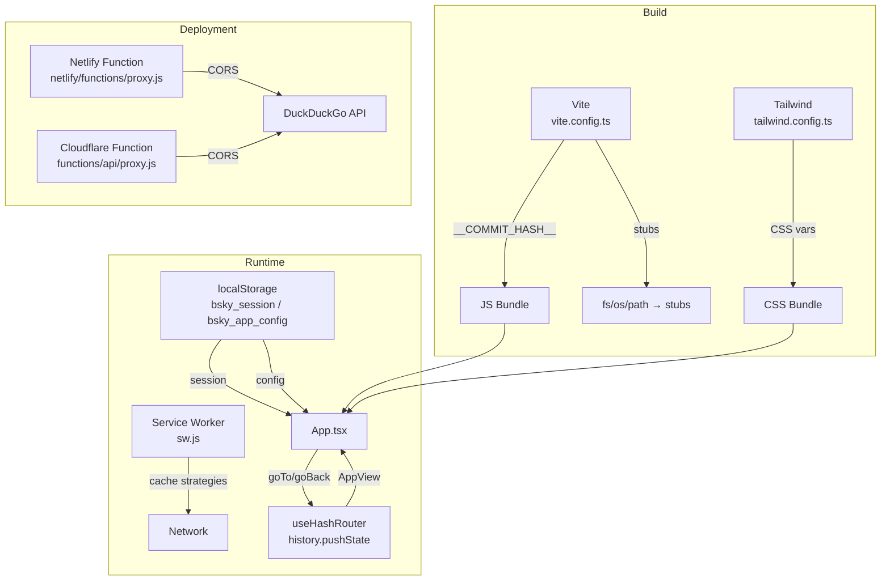

以下是完整的页面内容：

---

# PWA 应用架构

PWA 包位于 `packages/pwa/`，是项目双界面架构中的浏览器端。与 TUI 的终端渲染不同，PWA 面向现代 Web 标准构建：Vite 作为构建工具、Tailwind CSS 驱动主题、hash-based 路由适配静态托管、Service Worker 实现离线策略，并同时支持 Netlify 和 Cloudflare Pages 两种部署平台。

## 构建配置：Vite + 编译时常量注入

`vite.config.ts` 是整个 PWA 的构建中枢。它加载 `@vitejs/plugin-react` 启用 JSX 编译，并设置 `base: './'`（相对路径）以支持子目录部署。

```ts
// packages/pwa/vite.config.ts
const commitHash = execSync('git rev-parse HEAD').toString().trim();
const commitDesc = execSync('git log --format=%s -1').toString().trim();
const buildTime = new Date().toISOString();

define: {
  __COMMIT_HASH__: JSON.stringify(commitHash),
  __COMMIT_DESC__: JSON.stringify(commitDesc),
  __BUILD_TIME__: JSON.stringify(buildTime),
}
```

三个编译时常量（`__COMMIT_HASH__`、`__COMMIT_DESC__`、`__BUILD_TIME__`）通过 Vite 的 `define` 选项注入，在 `AboutPage.tsx` 中展示给用户。TypeScript 一侧通过 `env.d.ts` 声明全局变量类型：

```ts
declare const __COMMIT_HASH__: string;
```

[来源](packages/pwa/vite.config.ts#L6-L24) | [来源](packages/pwa/src/env.d.ts#L1-L3) | [来源](packages/pwa/src/components/AboutPage.tsx#L12-L22)

### Node.js 原生模块的浏览器适配

PWA 依赖 `@bsky/core` 和 `@bsky/app`，而这两个库内部引用了 Node.js 内置模块（`fs`、`os`、`path`）。Vite 通过 `resolve.alias` 将它们替换为浏览器端的 stub 实现：

| Node 模块 | Stub 文件 | 行为 |
|-----------|-----------|------|
| `fs` | `src/stubs/fs.ts` | 所有操作返回空值/空数组 |
| `os` | `src/stubs/os.ts` | `homedir()` 返回 `'/'` |
| `path` | `src/stubs/path.ts` | `join()` 用 `/` 拼接参数 |

[来源](packages/pwa/vite.config.ts#L13-L18) | [来源](packages/pwa/src/stubs/fs.ts#L1-L7) | [来源](packages/pwa/src/stubs/os.ts#L1-L2) | [来源](packages/pwa/src/stubs/path.ts#L1-L2)

### 开发服务器与 API 代理

开发模式下 Vite 运行在 `:5173`，并将 `/api` 前缀的请求代理到 `http://127.0.0.1:8788`（用于 DuckDuckGo API 代理的本地函数模拟）。

[来源](packages/pwa/vite.config.ts#L29-L38)

---

## 双主题系统：CSS 变量驱动的 Tailwind 设计

PWA 的 Light/Dark 主题采用 **CSS 变量 + Tailwind `class` 策略**，而非 Tailwind 的自动媒体查询模式。

### 变量定义（`index.css`）

```css
:root {
  --color-primary: #00A5E0;
  --color-surface: #F8F9FA;
  --color-border: #E5E7EB;
  --color-text-primary: #0F172A;
  --color-text-secondary: #64748B;
}

.dark {
  --color-primary: #00A5E0;
  --color-surface: #121212;
  --color-border: #27272A;
  --color-text-primary: #F1F5F9;
  --color-text-secondary: #A3B4C0;
}
```

### Tailwind 映射（`tailwind.config.ts`）

```ts
darkMode: 'class',
theme: {
  extend: {
    colors: {
      primary: {
        DEFAULT: 'var(--color-primary)',
        hover: 'var(--color-primary-hover)',
      },
      surface: 'var(--color-surface)',
      border: 'var(--color-border)',
      'text-primary': 'var(--color-text-primary)',
      'text-secondary': 'var(--color-text-secondary)',
    },
  },
}
```

### 切换机制

`Layout.tsx` 中的 `toggleDark` 函数负责切换 `document.documentElement` 上的 `dark` class，同时持久化到 `useAppConfig` 的 `darkMode` 字段：

```tsx
const [dark, setDark] = useState(() =>
  document.documentElement.classList.contains('dark')
);
useEffect(() => {
  document.documentElement.classList.toggle('dark', dark);
}, [dark]);
```

`index.html` 的 `<body>` 标签使用 Tailwind 的 `dark:` 变体兜底：`bg-white dark:bg-[#0A0A0A]`，确保 JS 加载前的首屏渲染正确。

[来源](packages/pwa/src/index.css#L5-L21) | [来源](packages/pwa/tailwind.config.ts#L4-L16) | [来源](packages/pwa/src/components/Layout.tsx#L53-L56) | [来源](packages/pwa/src/components/Layout.tsx#L134-L138) | [来源](packages/pwa/index.html#L19)

---

## 三个专属 Hook

PWA 层的三个 React hook 承担着与 TUI 完全不同的职责——它们直接对接浏览器 API（`localStorage`、`history.pushState`），而非终端标准输入输出。

### useHashRouter：Hash → AppView 编解码

这是整个 PWA 的导航引擎。它维护一个 `AppView` 状态，通过 `window.location.hash` 与浏览器历史栈同步。

**编解码规则**：`parseHash()` 从 `window.location.hash` 解析出 `AppView` 联合类型；`encodeView()` 反向生成 hash 字符串。每条路由对应一个视图类型：

| Hash 模式 | AppView 类型 | 示例 |
|-----------|-------------|------|
| `#/feed?feed=at://...` | `feed` | 主时间线 |
| `#/thread?uri=at://...` | `thread` | 帖子线索 |
| `#/profile?actor=did:plc:...` | `profile` | 用户主页 |
| `#/compose?replyTo=at://...` | `compose` | 发帖 |
| `#/ai?session=xxx` | `aiChat` | AI 对话 |

**默认 Feed 重定向**：当用户访问裸 `#/feed` 或首页时，hook 自动从 `getFeedConfig()` 读取 `defaultFeedUri`，若未配置则回退到 `BUILTIN_FEEDS.following`。

**导航 API**：暴露 `goTo`、`goBack`、`goHome` 三个方法，内部使用 `history.pushState` / `history.back()`，避免真实页面跳转。

[来源](packages/pwa/src/hooks/useHashRouter.ts#L21-L74) | [来源](packages/pwa/src/hooks/useHashRouter.ts#L76-L167) | [来源](packages/pwa/src/hooks/useHashRouter.ts#L169-L247)

完整的视图路由类型定义见 [导航状态机](导航状态机.md)。

### useSessionPersistence：localStorage 会话持久化

将 Bluesky 会话（`accessJwt`、`refreshJwt`、`handle`、`did`、`pdsUrl`）序列化到 `localStorage` 的 `bsky_session` 键下。提供三个纯函数：

- `getSession()` — 应用启动时恢复会话
- `saveSession(session)` — 登录成功后持久化
- `clearSession()` — 登出或会话过期时清除

在 `App.tsx` 中，`useEffect` 监听 `session` 状态变化：登录成功时调用 `saveSession`；认证错误时调用 `clearSession` 并重置登录状态。

[来源](packages/pwa/src/hooks/useSessionPersistence.ts#L1-L27) | [来源](packages/pwa/src/App.tsx#L159-L192)

### useAppConfig：应用配置持久化

将用户的完整应用配置持久化到 `localStorage` 的 `bsky_app_config` 键下。配置类型 `AppConfig` 包含：

| 字段 | 类型 | 用途 |
|------|------|------|
| `aiConfig` | `AIConfig` | AI 服务的 baseUrl / model / apiKey |
| `darkMode` | `boolean` | 深色模式开关 |
| `targetLang` | `string` | 翻译目标语言 |
| `apiKeys` | `Record<string, string>` | 多提供商 API 密钥 |
| `scenarioModels` | `{ aiChat, translate, polish }` | 场景级模型覆盖 |
| `enabledWidgets` | `string[]` | 右侧面板启用的 widget |

`getAppConfig()` 从 localStorage 读取并与 `DEFAULT_CONFIG` 合并，确保新增字段有合理的默认值。

[来源](packages/pwa/src/hooks/useAppConfig.ts#L1-L65)

---

## PWA 离线能力：Service Worker 策略

`public/sw.js` 是一个手写的 Service Worker（非 `vite-plugin-pwa` 自动生成），实现了四级缓存策略。

### 缓存命名空间

```
CACHE_NAME  = 'bsky-v3'     // 应用 shell + JS/CSS 资源
IMG_CACHE   = 'bsky-img-v1' // Bluesky CDN 图片
FONT_CACHE  = 'bsky-font-v1' // Google 字体
```

### 路由矩阵

| 请求目标 | 策略 | 依据 |
|----------|------|------|
| `cdn.bsky.app` 图片 | Cache-first | 内容寻址，不可变 URL |
| `fonts.gstatic.com` | Cache-first | 字体文件极少变更 |
| `fonts.googleapis.com` | Stale-while-revalidate | CSS 可能小版本更新 |
| `bsky.social` / `public.api.bsky.app` / API | Network-first | 数据必须新鲜 |
| `/assets/*` / `/icons/*`（Vite 构建产物） | Cache-first | 文件名含 hash，不可变 |
| 其余（根 HTML） | Stale-while-revalidate | 快速加载，后台更新 |

### 激活阶段的缓存清理

`activate` 事件中删除不在白名单中的所有旧缓存（`bsky-v1`、`bsky-v2` 等），确保用户不会加载陈旧版本。

### 注册时机

在 `main.tsx` 中，`window.onload` 后注册 SW，scope 设为 `'./'`：

```ts
if ('serviceWorker' in navigator) {
  window.addEventListener('load', () => {
    navigator.serviceWorker.register('./sw.js', { scope: './' });
  });
}
```

[来源](packages/pwa/public/sw.js#L1-L123) | [来源](packages/pwa/src/main.tsx#L7-L15)

---

## 部署配置：Netlify 与 Cloudflare Pages 双通道

PWA 同时支持两种无服务器部署平台，两者的共同需求是**单页应用历史回退**和**DuckDuckGo API 代理**。

### Netlify（`netlify.toml`）

```toml
[build]
  command = "echo 'Built externally — see monorepo build'"
  publish = "dist"

[[redirects]]
  from = "/api/proxy"
  to = "/.netlify/functions/proxy"
  status = 200

[[redirects]]
  from = "/*"
  to = "/index.html"
  status = 200
```

Netlify 会自动发现 `netlify/functions/` 目录中的 `proxy.js`，通过 `/* → /index.html` 的 rewrite 实现 SPA fallback。

[来源](packages/pwa/netlify.toml#L1-L16)

### Cloudflare Pages

Cloudflare Pages 函数位于 `functions/api/proxy.js`，功能与 Netlify 版本相同——代理 DuckDuckGo Instant Answer API，解决浏览器 `Sec-Fetch-*` 头触发的反爬检测。关键设计：

- 严格的域名白名单：仅允许 `https://api.duckduckgo.com/`
- 全 CORS 头支持
- `User-Agent: bsky-client/0.9.0` 标识

Cloudflare Pages 的 SPA 回退在项目设置的 "Functions" 选项卡中配置 `/* → /index.html` 的 `_redirects` 规则。

[来源](packages/pwa/functions/api/proxy.js#L1-L68) | [来源](packages/pwa/netlify/functions/proxy.js#L1-L46)

---

## 架构全景图



---

## 与其他架构层的关系

- **[三层架构详解](三层架构详解.md)**：PWA 位于架构最上层，依赖 `@bsky/app` 获取 hooks 和数据接口，依赖 `@bsky/core` 获取类型和工具函数。
- **[导航状态机](导航状态机.md)**：`AppView` 联合类型是 PWA 和 TUI 共享的路由协议，`useHashRouter` 是该状态机的 hash 适配实现。
- **[存储抽象层](存储抽象层.md)**：PWA 使用 `IndexedDBDraftStorage` 实现草稿存储，通过 `setDraftStorageFactory()` 在 `App.tsx` 中注册。
- **[Widget 组件系统](widget-组件系统.md)**：PWA 的右侧面板通过 `registerWidget` 在 `App.tsx` 中注册 6 个内置 widget，状态持久化到 `useAppConfig` 的 `enabledWidgets` 字段。
- **[React Hooks 体系](react-hooks-体系.md)**：PWA 专属的三个 hook 与 `@bsky/app` 提供的 20+ 数据 hooks 配合使用。
- **[PWA 设计系统](pwa-设计系统.md)**：`DESIGN.md` 定义的色彩语义、排版层级和组件变体是 Tailwind 配置的设计源头。

---

## 下一步

- 阅读 [PWA 核心组件详解](pwa-核心组件详解.md) 了解 PostCard、FeedTimeline、ThreadView 等核心组件的实现
- 阅读 [PWA 设计系统](pwa-设计系统.md) 掌握 DESIGN.md 中的完整设计规范
- 阅读 [虚拟滚动与滚动恢复](虚拟滚动与滚动恢复.md) 了解 FeedTimeline 中的虚拟列表实现