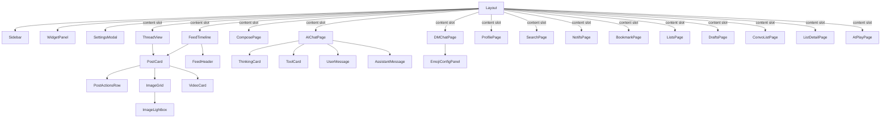

现在我来撰写完整的 Wiki 页面。

# PWA 核心组件详解

## 概览：30+ 组件的职责图谱

`packages/pwa/src/components/` 目录包含 34 个组件文件，覆盖从 Feed 信息流到私信聊天、从 AI 对话到个人资料编辑的全部 UI 层。这些组件遵循一套统一的模式：每个组件接收 `goTo: (v: AppView) => void` 作为导航回调，使用 `@bsky/app` 层导出的 hook 获取数据，再通过 `PostCard` + `PostActionsRow` 的组合渲染帖子。

---

## 一、Feed 与帖子：虚拟滚动 + 统一操作行

### FeedTimeline：基于 `@tanstack/react-virtual` 的虚拟列表

`FeedTimeline` 是所有帖子列表页面的核心容器。它的接口设计为**纯受控组件**——由父级传入 `posts` 数组和 `loadMore` 回调，自身只负责渲染和滚动管理。

**关键实现细节：**

- **虚拟滚动**：使用 `useVirtualizer` 创建虚拟列表，固定估计高度 `ESTIMATED_POST_HEIGHT = 120px`，overscan 5 项（[FeedTimeline.tsx#L52-L57](packages/pwa/src/components/FeedTimeline.tsx#L52-L57)）。每个虚拟项通过 `transform: translateY()` 定位，配合 `ref={virtualizer.measureElement}` 动态测量实际高度。
- **像素级滚动恢复**：通过 `initialScrollTop` 属性和 `requestAnimationFrame` 在下一次渲染帧恢复滚动位置（[FeedTimeline.tsx#L60-L69](packages/pwa/src/components/FeedTimeline.tsx#L60-L69)）。
- **自动加载哨兵**：使用 `IntersectionObserver` 监听 `sentinelRef` 元素，当用户滚动到底部附近（`rootMargin: '200px'`）时触发 `loadMore()`（[FeedTimeline.tsx#L89-L98](packages/pwa/src/components/FeedTimeline.tsx#L89-L98)）。
- **骨架屏**：首次加载时显示 5 个 `SkeletonCard` 占位组件。

**使用的 hook：** `useI18n`、`useEffect`、`useRef`、`useCallback`、`useVirtualizer`

[来源](packages/pwa/src/components/FeedTimeline.tsx#L1-L189)

### PostCard：统一帖子卡片的双模式设计

`PostCard` 支持两种输入模式：传入 `post: PostView`（API 原始数据）或 `line: FlatLine`（扁平化线程数据），通过 TypeScript 联合类型 `PostCardWithPost | PostCardWithLine` 实现类型安全（[PostCard.tsx#L284-L294](packages/pwa/src/components/PostCard.tsx#L284-L294)）。

**嵌入媒体提取逻辑：**

- `extractEmbeds()` 处理 `app.bsky.embed.video`、`app.bsky.embed.images`、`app.bsky.embed.external`、`app.bsky.embed.recordWithMedia` 四种嵌入类型（[PostCard.tsx#L35-L89](packages/pwa/src/components/PostCard.tsx#L35-L89)）。
- `extractQuotedPost()` 从 API 解析后的顶层 `embed.record` 中提取引用帖，支持 `#view` 格式（[PostCard.tsx#L91-L148](https://github.com/bsky/packages/pwa/src/components/PostCard.tsx#L91-L148)）。
- `linkifyText()` 使用正则 `LINK_REGEX` 将正文中的 URL、@提及、`#话题` 转换为可点击链接（[PostCard.tsx#L158-L184](packages/pwa/src/components/PostCard.tsx#L158-L184)）。

**交互特性：**

- 头像点击导航到个人资料页（[PostCard.tsx#L379-L383](packages/pwa/src/components/PostCard.tsx#L379-L383)）
- `ImageGrid` 内嵌 ALT 标签气泡按钮和全屏 Lightbox（Portal 渲染到 `document.body`，[PostCard.tsx#L186-L198](packages/pwa/src/components/PostCard.tsx#L186-L198)）
- 视频嵌入委托给 `VideoCard` 组件，支持 HLS 流式播放

**使用的 hook：** `useState`

[来源](packages/pwa/src/components/PostCard.tsx#L1-L479)

### PostActionsRow：统一操作行

**一行操作按钮**——回复、转发/引用（弹出菜单）、点赞、书签、AI 分析——在所有视图（Feed、Thread、Profile、Bookmark、ListDetail、Search）中复用。操作状态从模块级函数 `isPostLiked`/`isPostReposted` 读取，而非 props 层层传递（[PostActionsRow.tsx#L39-L42](packages/pwa/src/components/PostActionsRow.tsx#L39-L42)）。

**AI 分析入口**：根据 `isWidgetEnabled('aiChat')` 决定是打开侧边栏 Widget 还是跳转到独立 AI 聊天页面（[PostActionsRow.tsx#L8-L18](packages/pwa/src/components/PostActionsRow.tsx#L8-L18)）。

**使用的 hook：** `useState`

[来源](packages/pwa/src/components/PostActionsRow.tsx#L1-L82)

### VideoCard：HLS 流媒体播放器

`VideoCard` 在用户点击播放按钮后动态加载 `hls.js`（懒加载 `await import('hls.js')`），同时支持原生 HLS（Safari）。视频 `<video>` 元素始终存在于 DOM 中（通过 CSS `hidden` 控制显隐），以确保 `videoRef` 永不为 null（[VideoCard.tsx#L94-L107](packages/pwa/src/components/VideoCard.tsx#L94-L107)）。失败时显示「Retry」按钮。

**使用的 hook：** `useState`、`useRef`、`useCallback`、`useEffect`

[来源](packages/pwa/src/components/VideoCard.tsx#L1-L144)

---

## 二、发帖系统：多帖线程 + 图片上传 + 草稿管理

### ComposePage：支持线程的多帖编辑器

`ComposePage` 是 PWA 中最复杂的页面之一，集成多帖线程编辑、图片/视频上传、引用预览、AI 润色模态框、草稿保存提示等能力。

**多帖线程模型：**

- 使用 `useCompose` hook 管理 `posts: ComposePostItem[]` 数组，每帖独立 `id`、`text` 和 `toDraftData` 序列化（[ComposePage.tsx#L73](packages/pwa/src/components/ComposePage.tsx#L73)）。
- 线程帖子之间以分隔线连接，非首帖可删除，支持最多 10 帖（[ComposePage.tsx#L565](packages/pwa/src/components/ComposePage.tsx#L565)）。
- 提交时逐帖上传媒体 blob，再整体调用 `submit(mediaMap)`。

**图片上传管线：**

1. 用户选择文件 → `handleFileSelect`（[ComposePage.tsx#L169-L222](packages/pwa/src/components/ComposePage.tsx#L169-L222)）
2. `compressImage()` 自动压缩图片（显示压缩前后大小对比，5 秒后自动消失）
3. 图片或视频二选一（不可混用），视频上限 100MB
4. 每张图片有独立的 ALT 文本输入框
5. 提交前 ALT 缺失警告（[ComposePage.tsx#L331-L338](packages/pwa/src/components/ComposePage.tsx#L331-L338)）

**引用帖预览：** 通过 `replyTo`/`quoteUri` props 初始化，自动调用 `client.getPostThread()` 获取引用帖信息并渲染预览卡片（[ComposePage.tsx#L120-L141](packages/pwa/src/components/ComposePage.tsx#L120-L141)）。

**草稿桥接：** 与 Widget 系统双向同步——当前焦点帖子的文本通过 `setComposeDraftForWidgets` 暴露给 `PolishWidget`，同时注册 `registerComposeDraftSetter` 让 Widget 可以回写文本（[ComposePage.tsx#L156-L167](packages/pwa/src/components/ComposePage.tsx#L156-L167)）。

**后退守卫：** 当有内容时，显示「保存草稿/丢弃」选择面板（[ComposePage.tsx#L254-L273](packages/pwa/src/components/ComposePage.tsx#L254-L273)）。

**使用的 hook：** `useCompose`、`useDrafts`、`useI18n`、`useState`、`useEffect`、`useCallback`、`useRef`

[来源](packages/pwa/src/components/ComposePage.tsx#L1-L593)

### DraftsPage：草稿列表与云同步

`DraftsPage` 展示 `useDrafts` hook 返回的 `AppDraft[]` 草稿列表，每项显示首帖预览、多帖标记、回复标记、本地/同步状态。关键交互：

- 点击草稿跳转到 `ComposePage` 并传入 `draftId`（[DraftsPage.tsx#L76](packages/pwa/src/components/DraftsPage.tsx#L76)）
- 状态为 `local` 的草稿可执行 `syncDraft` 操作，上传到 AT Protocol 记录存储（[DraftsPage.tsx#L107-L119](packages/pwa/src/components/DraftsPage.tsx#L107-L119)）
- 删除草稿需二次确认

**使用的 hook：** `useDrafts`、`useI18n`、`useState`

[来源](packages/pwa/src/components/DraftsPage.tsx#L1-L146)

---

## 三、AI 对话系统：流式渲染 + 工具调用可视化

### AIChatPage：全功能 AI 聊天界面

`AIChatPage` 是 [AI 对话引擎](ai-对话引擎.md)的前端实现，包含侧边栏历史管理、流式消息渲染、工具调用可视化、导入/导出、图片上传等能力。

**消息分组与渲染管线：**

`useMemo` 将 `AIChatMessage[]` 消息流分组为 `thinking | tool | user | assistant` 四种类型。关键在于 `tool_call` + `tool_result` 的配对——紧跟的 tool_call 和 tool_result 合并为单个 `ToolCard`（[AIChatPage.tsx#L56-L81](packages/pwa/src/components/AIChatPage.tsx#L56-L81)）。

**自动展开逻辑：** 在流式加载期间，最后一条 `thinking` 或 `tool` 组自动展开（`lastStreamGroupIndex` 计算），用户可点击切换展开/折叠（[AIChatPage.tsx#L83-L91](packages/pwa/src/components/AIChatPage.tsx#L83-L91)）。

**视觉视口适配：** 监听 `window.visualViewport.resize` 事件，在移动端键盘弹出时调整聊天区域高度（[AIChatPage.tsx#L102-L110](packages/pwa/src/components/AIChatPage.tsx#L102-L110)）。

**导入/导出：** 支持 JSON（`bsky-chat-v1` 格式）、HTML、Markdown 三种导出格式；JSON 导入时严格验证格式和消息结构（[AIChatPage.tsx#L171-L273](packages/pwa/src/components/AIChatPage.tsx#L171-L273)）。

**写操作确认门：** 当 AI 发起写操作时，显示模态框 `pendingConfirmation`，用户确认后才执行（[AIChatPage.tsx#L493-L504](packages/pwa/src/components/AIChatPage.tsx#L493-L504)）。

**引导问题：** 空对话时显示 `guidingQuestions` 按钮列表（[AIChatPage.tsx#L534-L551](packages/pwa/src/components/AIChatPage.tsx#L534-L551)）。

**使用的 hook：** `useAIChat`、`useChatHistory`、`useI18n`、`useMemo`、`useCallback`、`useEffect`、`useRef`、`useState`

[来源](packages/pwa/src/components/AIChatPage.tsx#L1-L695)

### ThinkingCard：思考过程折叠卡片

紫色大脑图标 + 首行摘要 + 可展开/折叠的思考内容。通过 CSS `max-h` 动画实现平滑展开/折叠（[ThinkingCard.tsx#L42-L49](packages/pwa/src/components/ai/ThinkingCard.tsx#L42-L49)）。`compact` 属性在 Widget 模式中缩小尺寸。

**使用的 hook：** `useI18n`

[来源](packages/pwa/src/components/ai/ThinkingCard.tsx#L1-L52)

### ToolCard：工具调用结果可视化

琥珀色扳手图标 + 工具名称标签 + 格式化结果摘要。核心逻辑在 `formatToolResult()` 函数中，为每个工具名（约 38 个）编写特定的 JSON 解析和摘要生成逻辑（[formatToolResult.ts](packages/pwa/src/components/ai/formatToolResult.ts)）。例如 `get_profile` 显示 `handle | followers/following/posts` 统计，`get_timeline` 显示前 3 条帖文摘要。

**使用的 hook：** `useI18n`、`useMemo`

[来源](packages/pwa/src/components/ai/ToolCard.tsx#L1-L77)

### UserMessage / AssistantMessage：用户/AI 气泡

- **UserMessage**：蓝色气泡右对齐，支持编辑按钮（`onEdit` 回调修改已发送消息）
- **AssistantMessage**：灰色气泡左对齐，使用 `react-markdown` + `remark-gfm` 渲染 Markdown，支持复制按钮

[来源](packages/pwa/src/components/ai/UserMessage.tsx#L1-L30) | [来源](packages/pwa/src/components/ai/AssistantMessage.tsx#L1-L46)

---

## 四、私信系统：轮询刷新 + Emoji 反应

### ConvoListPage：会话列表

从 `useConvoList` 获取 `ConvoView[]` 列表，显示每个会话的最新消息预览和未读计数。会话项点击后调用 `goTo({ type: 'dmChat', conversationId })` 进入聊天（[ConvoListPage.tsx#L34](packages/pwa/src/components/ConvoListPage.tsx#L34)）。

**轮询刷新：** 顶部刷新按钮触发 `refresh()`，通过钩子内部的轮询机制保持最新状态。

**成员解析：** 从 `convo.members` 中过滤出非当前用户的对方成员，用于显示头像和名称。

**使用的 hook：** `useConvoList`、`useI18n`、`useEffect`、`useState`

[来源](packages/pwa/src/components/ConvoListPage.tsx#L1-L159)

### DMChatPage：单聊对话

`DMChatPage` 是 PWA 中最精细化的聊天界面，完整实现了 [Direct Messages 私信系统](direct-messages-私信系统.md) 的前端。

**消息加载与刷新：**

- 首次加载调用 `loadConvo(conversationId, true)` 并标记已读（[DMChatPage.tsx#L35-L37](packages/pwa/src/components/DMChatPage.tsx#L35-L37)）
- `loadOlder()` 在用户滚动到顶部时触发，加载更早消息（`scrollTop < 60px` 阈值，[DMChatPage.tsx#L49-L57](packages/pwa/src/components/DMChatPage.tsx#L49-L57)）
- 底部自动滚动守卫：当用户靠近底部（`< 120px`）时自动跟随新消息（[DMChatPage.tsx#L39-L46](packages/pwa/src/components/DMChatPage.tsx#L39-L46)）

**Emoji 反应系统：**

- 每条消息下方的反应栏显示已添加的 emoji 和「添加反应」按钮
- 点击弹出 `activeReactionMsgId` 对应的 emoji 选择器，从 `customEmojis`（localStorage 配置）渲染（[DMChatPage.tsx#L272-L305](packages/pwa/src/components/DMChatPage.tsx#L272-L305)）
- `EmojiConfigPanel` 全屏模态框：从 `fetchAllEmojis()` 获取所有可用 emoji，以 8 列网格展示，支持肤色变体选择（[DMChatPage.tsx#L370-L477](packages/pwa/src/components/DMChatPage.tsx#L370-L477)）

**引用回复：** 输入框中粘贴 AT URI 自动解析为引用预览（`parsePostUri` + `client.getRecord`）。

**消息操作：** 自己的消息可删除（hover 显示删除按钮），会话可静音/取消静音。

**使用的 hook：** `useChatMessages`、`useI18n`、`useState`、`useEffect`、`useRef`、`useCallback`

[来源](packages/pwa/src/components/DMChatPage.tsx#L1-L477)

---

## 五、功能页面群像

### ThreadView：线程视图

`ThreadView` 使用 `useThread` hook 获取扁平化的 `FlatLine[]`，按 `depth` 分割为 `parentLines`（父链）、`focused`（当前帖）、`replyLines`（回复）。深度缩进通过 `style={{ marginLeft: Math.min((line.depth - 1) * 20, 60) }}` 实现（[ThreadView.tsx#L306](packages/pwa/src/components/ThreadView.tsx#L306)）。

**内联翻译：** 使用 `useTranslation` hook 翻译当前帖文本，结果显示在蓝色边框面板中，可切换回原文（[ThreadView.tsx#L84-L94](packages/pwa/src/components/ThreadView.tsx#L84-L94)）。

**内联关注：** 当前帖作者的头像旁有关注/取消关注按钮。

**使用 `line` 模式渲染：** 回复帖使用 `PostCard line={line}`，而非 `post` 模式。

**使用的 hook：** `useThread`、`useBookmarks`、`useTranslation`、`useI18n`、`useMemo`、`useState`、`useCallback`、`useEffect`

[来源](packages/pwa/src/components/ThreadView.tsx#L1-L330)

### ProfilePage：个人资料页

`ProfilePage` 使用 `useProfile` hook 管理资料数据、标签页切换（Posts / Replies）、关注/取消关注、弹窗粉丝/关注列表。

**头像/横幅灯箱：** 使用 `createPortal` 将全屏图片模态框渲染到 `document.body`，支持下载（[ProfilePage.tsx#L31-L42](packages/pwa/src/components/ProfilePage.tsx#L31-L42)）。

**内联翻译简介：** 使用 `useTranslation` 翻译 `profile.description`，结果显示为原文覆盖（[ProfilePage.tsx#L338-L352](packages/pwa/src/components/ProfilePage.tsx#L338-L352)）。

**资料编辑：** 点击编辑图标弹出 `EditProfileModal`，支持修改 displayName、description，上传头像/横幅图片（先上传 blob 再调用 `client.putProfile`）。

**虚拟滚动：** 帖子和关注列表均使用 `useVirtualizer` + `IntersectionObserver` 哨兵。

**使用的 hook：** `useProfile`、`useTranslation`、`useI18n`、`useScrollRestore`、`useVirtualizer`、`useState`、`useEffect`、`useRef`

[来源](packages/pwa/src/components/ProfilePage.tsx#L1-L512)

### SearchPage：四标签搜索

`SearchPage` 使用 `useSearch` hook 管理 Top / Latest / Users / Feeds 四个标签页的搜索结果。支持搜索历史（`useSearchHistory`）和输入框聚焦时显示历史下拉菜单（[SearchPage.tsx#L108-L132](packages/pwa/src/components/SearchPage.tsx#L108-L132)）。

**Feed 订阅：** 在 Feeds 标签页可直接订阅搜索结果中的 Feed Generator。

**使用的 hook：** `useSearch`、`useI18n`、`useScrollRestore`、`useSearchHistory`、`useState`、`useEffect`

[来源](packages/pwa/src/components/SearchPage.tsx#L1-L222)

### NotifsPage：通知列表

`NotifsPage` 使用 `useNotifications` 获取通知列表，每项显示 emoji 图标（根据 reason 映射）、作者头像、时间。未读通知右侧有蓝色圆点标记。点击通知跳转到对应帖子或资料页。

**使用的 hook：** `useNotifications`、`useI18n`

[来源](packages/pwa/src/components/NotifsPage.tsx#L1-L142)

### BookmarkPage：书签管理

`BookmarkPage` 使用 `useBookmarks` hook 获取收藏帖子列表，基于 `useVirtualizer` 虚拟滚动。每帖右上角有 X 按钮可移除书签。

**使用的 hook：** `useBookmarks`、`useI18n`、`useScrollRestore`、`useVirtualizer`、`useRef`

[来源](packages/pwa/src/components/BookmarkPage.tsx#L1-L108)

### ListsPage / ListDetailPage：列表管理

**ListsPage** 使用 `useLists` hook 管理用户列表（Curated / Moderation 两种类型）。支持创建列表（带名称/描述/类型选择）、删除（二次确认）、查看他人列表时弹出「添加到我列表」面板（[ListsPage.tsx#L257-L315](packages/pwa/src/components/ListsPage.tsx#L257-L315)）。

**ListDetailPage** 使用 `useListDetail` hook 管理单个列表详情，Posts / Members 双标签页，各使用独立的 `useVirtualizer` 实例。支持编辑名称/描述（点击笔图标）、静音/取消静音列表、删除成员、删除列表。

**使用的 hook：** `useLists`、`useListDetail`、`useI18n`、`useScrollRestore`、`useVirtualizer`、`useState`、`useRef`、`useEffect`、`useCallback`

[来源](packages/pwa/src/components/ListsPage.tsx#L1-L332) | [来源](packages/pwa/src/components/ListDetailPage.tsx#L1-L335)

---

## 共享基础设施

### FeedHeader：Feed 切换 + 配置

`FeedHeader` 支持在下拉菜单中切换已订阅的 feed，并打开 `FeedConfigModal` 管理订阅列表（添加/删除/设置默认 feed）和浏览推荐 feed。

[来源](packages/pwa/src/components/FeedHeader.tsx#L1-L228)

### Icon：内联 SVG 图标系统

`Icon` 组件利用 Vite 的 `import.meta.glob` 批量加载 `src/icons/*.svg` 为原始字符串，运行时根据 `name` 查找对应 SVG 并注入尺寸和 `fill` 样式。所有图标名在 `ICON_NAMES` 常量中可用。

[来源](packages/pwa/src/components/Icon.tsx#L1-L57)

### Layout / Sidebar：应用骨架

`Layout` 组件提供三层结构：顶部 Header（含返回按钮、主题切换、设置入口）、左侧 Sidebar（导航标签，含未读计数角标）、右侧 WidgetPanel（可开启/关闭/拖拽排序的 Widget 面板）。Layout 还管理 Widget 状态的持久化：初始化时从 `config.enabledWidgets` 恢复，切换时自动写入 `localStorage`。当进入 `aiChat` 视图时自动禁用 AI Widget 以避免重复渲染（[Layout.tsx#L96-L109](packages/pwa/src/components/Layout.tsx#L96-L109)）。

**Sidebar** 定义了 10 个导航标签（Feed / Notifications / DM / Search / Bookmarks / Lists / Profile / AI Chat / Compose / AT Play），各带独立图标和未读计数。

[来源](packages/pwa/src/components/Layout.tsx#L1-L281) | [来源](packages/pwa/src/components/Sidebar.tsx#L1-L91)

---

## 推荐阅读

- [虚拟滚动与滚动恢复](虚拟滚动与滚动恢复.md) — `@tanstack/react-virtual` 的像素值恢复策略详解
- [React Hooks 体系](react-hooks-体系.md) — `useCompose`、`useThread`、`useAIChat` 等所有数据 hook 的完整签名
- [Widget 组件系统](widget-组件系统.md) — 组件注册表、启用/关闭状态管理与 ComposePage 桥接
- [Store 订阅模式](store-订阅模式.md) — 纯对象 Store + React Hook 桥接的单监听器模式