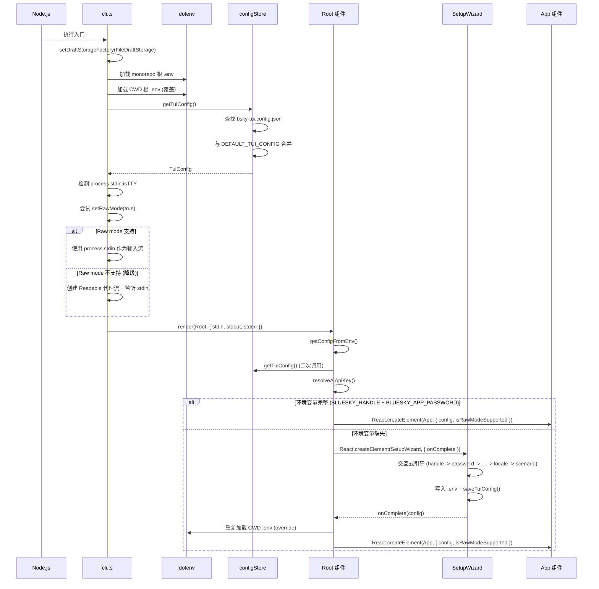

下面开始编写页面。

---

# TUI 入口与配置加载

`packages/tui/src/cli.ts` 是整个 TUI 应用的唯一入口点。它在一个文件中完成了从环境变量加载、配置文件合并、终端能力检测到首次运行引导的全流程。理解这个文件，就等于拿到了整个 TUI 架构的总钥匙。

## 完整启动序列



[来源](packages/tui/src/cli.ts#L17-L116)

## dotenv 多路径加载

启动的第一步不是初始化 React，而是加载环境变量。代码定义了两个路径，依次调用 `dotenv.config()`：

```typescript
const envPaths = [
  path.resolve(__dirname, '..', '..', '..', '.env'),  // monorepo 根
  path.resolve(process.cwd(), '.env'),                  // 当前工作目录
];
```

**加载策略是"后加载覆盖前加载"**——如果两个路径下都存在 `.env`，后者（CWD）的相同键会覆盖前者（monorepo 根）的值。`DEFAULT_FEED`、`BSKY_FEEDS` 等可选变量也在此阶段被读取，供后续 `App.tsx` 的 feed 配置使用。

> 注意：`__dirname` 通过 `import.meta.url` + `fileURLToPath` 计算得到，确保 ESM 环境下路径正确。

[来源](packages/tui/src/cli.ts#L19-L28)

## 配置文件合并策略

非凭据配置存储在 `bsky-tui.config.json` 中，由 `configStore` 模块管理。

### 路径查找

`resolveConfigPath()` 的查找顺序与 `.env` 镜像一致：

1. monorepo 根目录下的 `bsky-tui.config.json`
2. 当前工作目录下的 `bsky-tui.config.json`
3. 如果都不存在，返回 CWD 路径（用于首次保存时的写入位置）

[来源](packages/tui/src/config/configStore.ts#L52-L60)

### 默认值与浅层合并

`DEFAULT_TUI_CONFIG` 定义了完整的默认值：

| 字段 | 默认值 | 说明 |
|------|--------|------|
| `aiConfig.baseUrl` | `https://api.deepseek.com` | DeepSeek API |
| `aiConfig.model` | `deepseek-v4-flash` | 默认模型 |
| `aiConfig.provider` | `deepseek` | 默认提供商 |
| `aiConfig.reasoningStyle` | `reasoning_content` | 推理风格 |
| `targetLang` | `zh` | 目标语言 |
| `translateMode` | `simple` | 翻译模式 |

合并策略是**浅层展开 + 嵌套覆盖**。`getTuiConfig()` 在读取 JSON 后，用 `{ ...defaults, ...parsed }` 及对 `aiConfig`、`scenarioModels`、`apiKeys` 的逐层展开，保证即便 JSON 文件中缺失某些字段也能获得合理默认值。若文件读取或解析失败（如 JSON 格式错误），则直接返回 `DEFAULT_TUI_CONFIG` 的深拷贝。

[来源](packages/tui/src/config/configStore.ts#L33-L80)

## Raw Mode 检测与降级

TUI 依赖键盘事件驱动导航，这需要终端支持 **raw mode**（按键即时响应，无需 Enter 确认）。检测逻辑简洁明了：

```typescript
let isRawMode = false;
try {
  const stdin = process.stdin as ReadStream;
  if (stdin.isTTY) {
    stdin.setRawMode(true);
    isRawMode = true;
  }
} catch {}
```

当 `isTTY` 为 `false`（管道输入、IDE 内置终端等）或 `setRawMode` 抛出异常时，`isRawMode` 保持 `false`。此时启动**降级策略**：

1. 创建一个空的 `Readable` 流作为 ink 的 `stdin`
2. 用 `rsObj.isTTY = true` 伪造成 TTY，使 ink 认为运行在正常终端
3. 监听 `process.stdin` 的 `data` 事件，将实际输入管道到代理流

这种降级确保应用在 CI 环境、日志重定向等场景下也能启动并输出，只是交互体验受限。

[来源](packages/tui/src/cli.ts#L119-L144)

## AppConfig 构建逻辑

`AppConfig` 是 TUI 各层共享的配置接口，定义了 `blueskyHandle`、`blueskyPassword`、`aiConfig`、`targetLang`、`apiKeys` 和 `scenarioModels` 六个核心字段。其构建函数 `getConfigFromEnv()` 采用**环境变量 + JSON 配置**的双源输入模式：

| 配置项 | 来源 | 优先级 |
|--------|------|--------|
| `blueskyHandle` | `.env` — `BLUESKY_HANDLE` | 必填，缺失则触发 SetupWizard |
| `blueskyPassword` | `.env` — `BLUESKY_APP_PASSWORD` | 同上 |
| `blueskyPds` | `.env` — `BLUESKY_PDS` | 可选，默认 undefined |
| `aiConfig.apiKey` | `LLM_API_KEY` 环境变量 > `configStore.apiKeys` | 环境变量优先 |
| `aiConfig.*` | `configStore.aiConfig` | 来自 JSON 默认值或用户配置 |

`resolveAiApiKey()` 函数体现了这种优先级逻辑：先检查 `process.env.LLM_API_KEY`，有则直接返回；否则回退到 `tuiConfig.apiKeys[providerId]`。这种设计支持两种使用模式——单提供商用户只需设置一个环境变量，多提供商用户则通过 JSON 管理各自的 API Key。

[来源](packages/tui/src/cli.ts#L30-L93)

## SetupWizard 首次运行引导

当 `getConfigFromEnv()` 返回 `null`（即环境变量缺失）时，Root 组件渲染 `SetupWizard` 替代主界面。这是一个完整的**交互式引导流程**，按固定步骤推进：

```
handle → password → pds(可选) → provider → model → apikey → locale → scenario(可选) → done
```

每个步骤的交互方式分两类：

- **文本输入步骤**（handle, password, pds, apikey, 自定义模型）：使用 `ink-text-input`，按 Enter 提交并进入下一步
- **选择步骤**（provider, model, locale, scenario）：使用方向键导航，Enter 确认

引导结束后，`handleDone()` 执行两项写入操作：

1. **写入 `.env`**：将 `BLUESKY_HANDLE` 和 `BLUESKY_APP_PASSWORD`（及可选的 `BLUESKY_PDS`）写入 CWD 的 `.env` 文件
2. **写入 `bsky-tui.config.json`**：通过 `saveTuiConfig()` 保存非凭据配置，包括 AI 提供商、模型、语言、场景模型映射等

> 凭据（Handle 和 Password）仅存储在 `.env` 中，而 `bsky-tui.config.json` 仅存储非敏感配置。这种分离策略与 `.gitignore` 配合，降低凭据意外提交的风险。

然后通过 `onComplete` 回调通知 Root 组件：Root 重新加载 `.env`（带 `override: true`），再次调用 `getConfigFromEnv()`，若成功则用 `newConfig` 更新状态，使 React 重新渲染 `App` 主组件。

[来源](packages/tui/src/components/SetupWizard.tsx#L44-L106)

## Root 组件决策逻辑

Root 组件是整个启动流程的**条件分岔点**：

```typescript
function Root({ isRawModeSupported }: { isRawModeSupported: boolean }) {
  const [appConfig, setAppConfig] = React.useState<AppConfig | null>(getConfigFromEnv);

  if (!appConfig) {
    return React.createElement(SetupWizard, { onComplete: ... });
  }

  return React.createElement(App, { config: appConfig, isRawModeSupported });
}
```

`useState` 的初始值直接由 `getConfigFromEnv()` 计算得出——这是一个惰性初始化，仅在组件挂载时执行一次。如果配置完整，直接进入主 App；如果缺失，进入 SetupWizard。SetupWizard 完成后，Root 的 `appConfig` 状态更新，触发 Re-render，此时 `App` 组件才被挂载。

这种设计确保了 **App 组件内部无需处理"未配置"状态**，其 `config` prop 一定包含完整配置，简化了 `App.tsx` 的边界条件判断。

[来源](packages/tui/src/cli.ts#L95-L116)

---

### 推荐阅读

- [环境配置详解](环境配置详解.md) 全面解析三种配置方式的优先级与交互关系
- [TUI 视图组件架构](tui-视图组件架构.md) 了解 App 组件在启动后的视图调度逻辑
- [三层架构详解](三层架构详解.md) 理解 cli.ts → App.tsx → core 的数据流