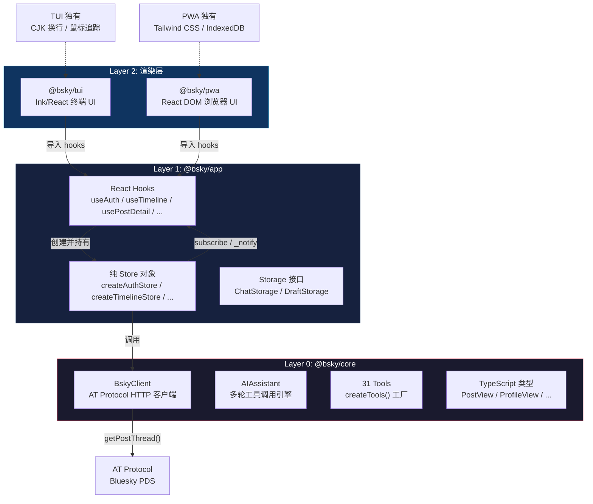
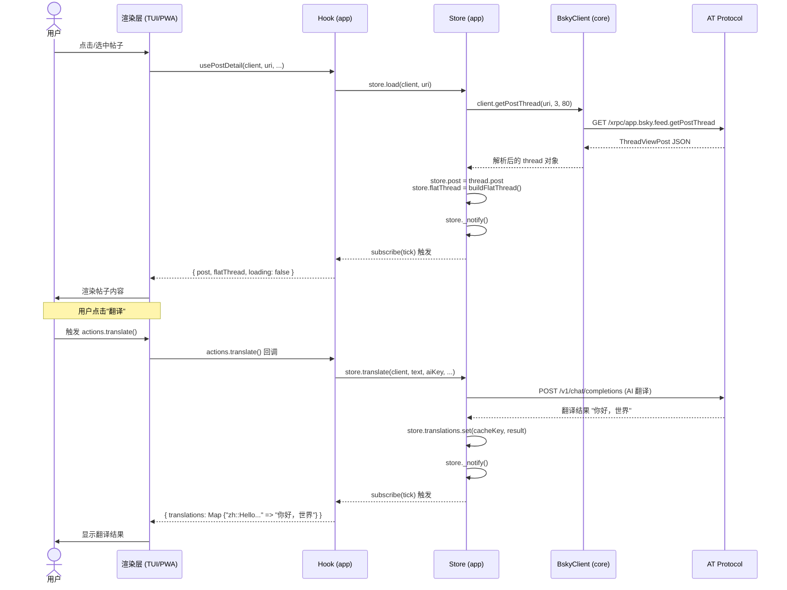

# 三层架构详解

## 总览：依赖从中心向外流动

`bsky` 采用 **三层同心圆架构**：`core` 在圆心，`app` 包裹其外，`tui` 和 `pwa` 作为两个并列的渲染层在最外层。依赖方向始终向内——渲染层依赖 `app`，`app` 依赖 `core`，`core` 不依赖任何 UI 框架。



**依赖声明**在三份 `package.json` 中清晰可见：`@bsky/core` 仅依赖 `ky`（HTTP 客户端）；`@bsky/app` 依赖 `@bsky/core` + `react`（peer）；`@bsky/tui` 和 `@bsky/pwa` 依赖 `@bsky/app`。

[来源](packages/core/package.json#L22-L25) · [来源](packages/app/package.json#L21-L23) · [来源](packages/tui/package.json#L23-L24) · [来源](docs/ARCHITECTURE.md#L66-L86)

---

## Layer 0：`@bsky/core` — 纯 TypeScript，零 UI 依赖

### 设计原则

**核心层不引用任何 UI 框架。** 没有 `react`，没有 `ink`，没有 `react-dom`。它是整个项目的逻辑基石，可以在任何 JavaScript 运行时中复用——CLI 脚本、Node.js 服务、甚至 Deno。

**依赖**只有两个：`ky`（轻量 HTTP 客户端）和 `dotenv`（仅 dev）。[来源](packages/core/package.json#L22-L25)

### 暴露的三大模块

| 模块 | 入口文件 | 职责 |
|------|---------|------|
| **BskyClient** | `src/at/client.ts` | AT Protocol 全部 API 封装，含三重 `ky` 实例、JWT 自动刷新、PDS 发现 |
| **AIAssistant + tools** | `src/ai/assistant.ts` + `src/ai/tools.ts` | 多轮工具调用循环、流式 SSE 解析、38 个工具定义 |
| **TypeScript 类型** | `src/at/types.ts` | `PostView`、`ProfileView`、`ThreadViewPost` 等全部 AT Protocol 类型 |

此外还导出 `translateText`、`singleTurnAI`、`polishDraft` 等单轮 AI 函数，以及集中式系统提示词常量。[来源](packages/core/src/index.ts#L1-L101)

### 技术亮点

- **三重 `ky` 实例**：`this.ky`（PDS 认证请求）、`this.publicKy`（公共 API 只读请求）、`this.chatKy`（Chat API 消息请求）。[来源](packages/core/src/at/client.ts#L55-L61)
- **JWT 自动刷新**：`afterResponse` 钩子检测 `ExpiredToken`/`InvalidToken` 错误后，用 refreshJwt 换取新 token 并重试原始请求。[来源](packages/core/src/at/client.ts#L69-L110)
- **38 个 AI 工具**：27 个读工具 + 4 个写工具 + 7 个新增工具，定义与处理器分离，JSON Schema 描述输入输出。[来源](packages/core/src/ai/tools.ts)

---

## Layer 1：`@bsky/app` — React Hooks + 纯 Stores

### 设计原则

app 层是 **PWA-ready 的状态管理层**。它只依赖 `react`（作为 peer dependency），不依赖任何渲染引擎。它的所有 hooks 既可以在 TUI 的 Ink 环境中运行，也可以在 PWA 的 React DOM 环境中运行。

**核心模式**：纯 JavaScript 对象作为 Store + React Hook 作为桥接。

[来源](packages/app/package.json#L21-L23) · [来源](docs/PACKAGES.md#L28-L88)

### 纯 Store 模式源码解析

每个 Store 都是一组状态字段 + 一个简单的发布-订阅机制。以 `createAuthStore` 为例：

```typescript
// packages/app/src/stores/auth.ts
export interface AuthStore {
  client: BskyClient | null;
  session: CreateSessionResponse | null;
  profile: ProfileView | null;
  loading: boolean;
  error: string | null;
  listener: (() => void) | null;  // ← 单监听器

  _notify(): void;                 // 触发更新
  subscribe(fn: () => void): () => void;  // 注册监听器，返回取消函数
}
```

其 `_notify` 实现极度简洁：

```typescript
_notify() { if (store.listener) store.listener(); },
subscribe(fn) {
  store.listener = fn;
  return () => { store.listener = null; };
},
```

[来源](packages/app/src/stores/auth.ts#L67-L71)

### Hook 桥接：Store ↔ React 的粘合剂

每个 hook 在组件挂载时创建 Store 实例，通过 `useState` 的 force-update 技巧实现 React 重渲染：

```typescript
// packages/app/src/hooks/useAuth.ts
export function useAuth() {
  const [store] = useState(() => createAuthStore());   // ① 创建纯 Store
  const [, force] = useState(0);                        // ② force-update 计数器
  const tick = useCallback(() => force(n => n + 1), []);// ③ tick 函数

  useEffect(() => store.subscribe(tick), [store, tick]);// ④ 订阅

  return {
    client: store.client,
    loading: store.loading,
    profile: store.profile,
    login: (h, p, pdsUrl) => store.login(h, p, pdsUrl),
    // ...其余字段透传
  };
}
```

**关键设计点**：

| 步骤 | 作用 |
|------|------|
| `useState(() => createAuthStore())` | 惰性初始化，只在挂载时创建一次 Store |
| `useState(0)` 的 `force` | 触发 `useState` 的 setter 即可让 React 重新渲染 |
| `useCallback(() => force(n => n + 1), [])` | 稳定的 tick 引用，避免 useEffect 无限循环 |
| `store.subscribe(tick)` | 当 Store 调用 `_notify()`，tick 被执行，force 更新 |

这个模式在所有 hooks 中一致使用：`useTimeline`、`usePostDetail`、`useThread`、`useCompose`、`useAIChat` 等 20+ 个 hooks 均采用相同的架构。[来源](packages/app/src/hooks/useAuth.ts#L6-L23) · [来源](packages/app/src/hooks/useTimeline.ts#L6-L47)

### 完整 hooks 清单

app 层导出的 hooks 可分为四类：

**认证与导航**：`useAuth`、`useNavigation`

**数据 hooks**：`useTimeline`、`usePostDetail`、`useThread`、`useCompose`、`useProfile`、`useSearch`、`useNotifications`、`useBookmarks`、`useDrafts`、`useLists`、`useListDetail`、`useConvoList`、`useChatMessages`

**AI hooks**：`useAIChat`、`useChatHistory`、`useTranslation`

**实用 hooks**：`useI18n`、`usePostActions`、`useScrollRestore`、`useActiveFeed`

[来源](packages/app/src/index.ts#L1-L87)

### Storage 接口体系

app 层定义了纯接口层，将存储实现推迟到渲染层：

- **`ChatStorage` 接口**：`saveConversation`、`loadConversation`、`deleteConversation` → TUI 用 `FileChatStorage`（JSON 文件），PWA 用 `IndexedDBChatStorage`
- **`DraftStorage` 接口**：`saveDraft`、`loadDraft`、`listDrafts` → TUI 用 `FileDraftStorage`，PWA 用 `IndexedDBDraftStorage`
- **工厂模式**：`setDraftStorageFactory()` 允许渲染层在启动时注入自己的存储实现

[来源](packages/app/src/services/chatStorage.ts) · [来源](packages/app/src/services/draftStorage.ts)

---

## Layer 2：渲染层 — TUI 与 PWA

两个渲染层**平级**，共享 `@bsky/app` 导出的全部 hooks，各自负责不同的渲染终端。

### `@bsky/tui` — 终端 UI

**渲染引擎**：Ink（React 的终端渲染器）

**入口**：`src/cli.ts` → `tsx src/cli.ts`

**核心职责**：

- 读取 `.env` + `bsky-tui.config.json` 配置
- 调用 `useAuth` 登录，获取 `client`
- 根据 `AppView` 联合类型分发到对应视图组件
- 集中式键盘调度（`useInput` 唯一实例）
- 动态布局计算（`sidebarW = cols * 0.14`）

```typescript
// packages/tui/src/components/App.tsx (约 400 行)
export function App({ config }: AppProps) {
  const { currentView, goTo, goBack } = useNavigation();
  const { client, loading, login } = useAuth();
  const { unreadCount } = useNotifications(client);
  // ...视图路由通过 currentView.type 分发
  switch (currentView.type) {
    case 'feed':     return <PostList ... />;
    case 'detail':   return <PostDetailView ... />;
    case 'thread':   return <UnifiedThreadView ... />;
    case 'compose':  return <ComposeView ... />;
    // ...
  }
}
```

所有视图组件存放在 `src/components/` 下，包括 `PostList`、`PostItem`、`UnifiedThreadView`、`AIChatView`、`Sidebar` 等。

**TUI 独有工具**（PWA 不需要）：
- `visualWidth(str)` / `wrapLines()`：CJK 感知的终端列宽计算与换行
- `enableMouseTracking()` / `parseMouseEvent()`：ANSI 鼠标追踪序列解析

[来源](packages/tui/src/components/App.tsx#L47-L80) · [来源](docs/ARCHITECTURE.md#L90-L96)

### `@bsky/pwa` — 浏览器 UI

**渲染引擎**：React DOM

**入口**：`src/main.tsx` → `ReactDOM.createRoot`

**核心职责**：

- Hash-based SPA 路由（`useHashRouter` 将 `#/feed`、`#/thread?uri=...` 等 URL 映射为 `AppView`）
- 会话持久化（`localStorage` 存取 `CreateSessionResponse`）
- 虚拟滚动（`@tanstack/react-virtual`）
- 注册 PWA 特有的存储实现（`IndexedDBDraftStorage`）

```typescript
// packages/pwa/src/App.tsx
export function App() {
  // 注入浏览器独有的存储实现
  setDraftStorageFactory(() => new IndexedDBDraftStorage());
  
  const { currentView, goTo, goBack } = useHashRouter();
  const { client, loading, login, restoreSession } = useAuth();
  const timeline = useTimeline(client, feedUri);
  // ...路由分发
}
```

两个渲染层使用**完全相同的 hooks 签名**——`useAuth()` 返回的 `{ client, loading, login }` 在 TUI 和 PWA 中结构一致，区别只在于消费方式：终端用 `Box`+`Text`，浏览器用 `div`+`Tailwind CSS`。

[来源](packages/pwa/src/App.tsx#L39-L57) · [来源](docs/PACKAGES.md#L119-L178)

---

## 数据流实战："用户查看帖子详情"

以下串联展示一条完整请求如何流经三层架构。

### 步骤序列



### 分层职责拆解

| 阶段 | 所属层 | 代码位置 | 细节 |
|------|--------|---------|------|
| 用户交互 | 渲染层 | `tui/App.tsx` 或 `pwa/ThreadView.tsx` | 用户按下 Enter / 点击帖子 URI |
| 路由分发 | 渲染层 + app | `currentView.type === 'detail'` | TUI 通过 `switch`，PWA 通过 `useHashRouter` |
| Hook 调用 | app 层 | `usePostDetail(client, uri, goTo, ...)` | 创建 Store，传入 `client` 和 `uri` |
| Store 加载 | app 层 | `store.load(client, uri)` | 设置 `loading=true`，调用 core 的 `BskyClient` |
| API 调用 | core 层 | `client.getPostThread(uri, depth, limit)` | 通过 `this.ky` 实例发送 HTTP 请求 |
| JWT 刷新 | core 层 | `_withRefresh` 钩子 | 若 token 过期，自动 refresh 后重试 |
| 数据处理 | app 层 | `buildFlatThread()` | 递归遍历 thread 树，生成纯文本表示 |
| 状态通知 | app 层 | `store._notify()` | 调用 `store.listener`（即 hook 的 `tick`） |
| React 重渲染 | app 层 + 渲染层 | `force(n => n + 1)` | Hook 返回新数据，渲染层拿到最新 `post` |

[来源](packages/app/src/stores/postDetail.ts#L29-L57) · [来源](packages/app/src/hooks/usePostDetail.ts#L15-L71)

---

## 架构决策总结

| 决策点 | 选择 | 理由 |
|--------|------|------|
| Core 的 UI 依赖 | **零依赖** | 可被任何框架消费，可在 Node 脚本中独立运行 |
| Store 模式 | **纯对象 + `_notify()`** | 比 Redux 轻量，比 Context 精确，不引入额外依赖 |
| 监听器模型 | **单监听器** | 每个 Store 只有一个 `listener` slot，避免数组遍历开销 |
| Hook 与 Store 的关系 | **1:1 创建** | 每个组件挂载时 `useState(() => createXxxStore())`，非单例 |
| 存储抽象 | **接口 + 工厂模式** | 同一套接口在 TUI（文件）和 PWA（IndexedDB）不同实现 |
| 渲染层职责 | **仅渲染 + 键盘/路由** | 所有业务逻辑在 app 层，渲染层不重复实现状态管理 |

---

## 推荐阅读

- 更深入地了解 app 层的每个 hooks 签名和返回值，参见 [React Hooks 体系](react-hooks-体系.md)
- 纯 Store 订阅机制的完整实现分析，参见 [Store 订阅模式](store-订阅模式.md)
- TUI 的键盘调度和视图组件详解，参见 [TUI 视图组件架构](tui-视图组件架构.md)
- PWA 的路由系统和设计规范，参见 [PWA 应用架构](pwa-应用架构.md)
- 存储抽象的双端实现对比，参见 [存储抽象层](存储抽象层.md)