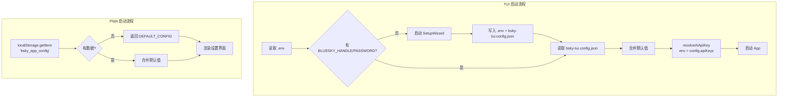

# 环境配置详解

bsky 项目采用 **双环境配置策略**：TUI（终端界面）使用 `.env` + `bsky-tui.config.json` 双层存储，PWA（浏览器界面）则统一使用 `localStorage`。无论哪种方式，核心原则都是**凭证与非凭证配置分离**——密码和 API Key 单独存放，模型偏好等设置独立管理。

---

## 一、TUI：双层配置架构

TUI 将配置拆成两个文件，各司其职：

| 文件 | 存储内容 | 是否提交 Git |
|------|---------|-------------|
| `.env` | Bluesky 账号密码、LLM API Key（可选）、自定义 PDS 地址 | ❌（已 gitignore） |
| `bsky-tui.config.json` | 模型选择、提供商、翻译偏好、多提供商 Key、场景模型覆盖 | ❌（已 gitignore） |

### 1.1 `.env` — 凭证层

TUI 启动时（`cli.ts`）从项目根目录或当前工作目录加载 `.env`：

```env
# 必填：Bluesky 账号
BLUESKY_HANDLE=your-handle.bsky.social
BLUESKY_APP_PASSWORD=your-app-password

# 可选：自定义 PDS 主机（不填则默认 bsky.social）
# BLUESKY_PDS=https://your-pds.example.com

# 可选：LLM API Key（优先级最高，可覆盖 config.json 中的 per-provider Key）
# LLM_API_KEY=sk-your-api-key

# 可选：翻译目标语言（zh/en/ja/ko/fr/de/es）
TRANSLATE_TARGET_LANG=zh
```

**关键优先级规则**：`LLM_API_KEY` 环境变量会**覆盖** `bsky-tui.config.json` 中的 per-provider Key。这在单提供商场景下最简单——只填一个 Key 即可，无需在 config.json 中重复配置。[来源](packages/tui/src/cli.ts#L55-L62)

首次运行时的 [SetupWizard](tui-入口与配置加载.md) 会引导用户填写这些值，并自动写入 `.env` 和 `bsky-tui.config.json`。[来源](packages/tui/src/components/SetupWizard.tsx#L64-L90)

### 1.2 `bsky-tui.config.json` — 非凭证层

所有非敏感设置集中在这个 JSON 文件中。完整模板如下：

```json
{
  "$schema": "./packages/tui/schemas/config.schema.json",

  "targetLang": "zh",
  "translateMode": "simple",

  "aiConfig": {
    "baseUrl": "https://api.deepseek.com",
    "model": "deepseek-v4-flash",
    "provider": "deepseek",
    "reasoningStyle": "reasoning_content",
    "thinkingEnabled": true,
    "visionEnabled": false
  },

  "apiKeys": {
    "deepseek": "",
    "mistral": ""
  },

  "scenarioModels": {
    "aiChat": "",
    "translate": "",
    "polish": ""
  }
}
```

[来源](bsky-tui.config.example.json#L1-L22)

**配置合并逻辑**（`configStore.ts`）：读取时使用 `Object.assign` 风格的深度合并——文件中缺失的字段自动填充默认值，部分覆盖不会丢失其他设置。[来源](packages/tui/src/config/configStore.ts#L62-L80)

### 完整配置项一览

| 配置路径 | 类型 | 默认值 | 说明 | 适用场景 |
|---------|------|--------|------|---------|
| `.env` → `BLUESKY_HANDLE` | string | — | Bluesky 用户名（如 `user.bsky.social`） | 必填，登录凭据 |
| `.env` → `BLUESKY_APP_PASSWORD` | string | — | Bluesky 应用密码 | 必填，登录凭据 |
| `.env` → `BLUESKY_PDS` | string | `undefined` | 自定义 PDS 地址 | 可选，自建 PDS 用户 |
| `.env` → `LLM_API_KEY` | string | `undefined` | 通用 LLM API Key，优先级最高 | 单提供商快速配置 |
| `.env` → `TRANSLATE_TARGET_LANG` | string | `zh` | 翻译目标语言 | 多语言用户 |
| `aiConfig.baseUrl` | string | `https://api.deepseek.com` | LLM API 端点 | 切换提供商 |
| `aiConfig.model` | string | `deepseek-v4-flash` | 默认模型 ID | 选择模型 |
| `aiConfig.provider` | string | `deepseek` | 提供商标识 | 多提供商切换 |
| `aiConfig.reasoningStyle` | string | `reasoning_content` | 推理风格 | DeepSeek/Mistral 差异 |
| `aiConfig.thinkingEnabled` | boolean | `true` | 是否显示思考过程 | 需要推理过程或追求速度 |
| `aiConfig.visionEnabled` | boolean | `false` | 是否启用视觉识别 | 图片理解场景 |
| `targetLang` | string | `zh` | 翻译目标语言 | 多语言用户 |
| `translateMode` | string | `simple` | 翻译模式（`simple`/`json`） | 简单翻译 vs 结构化输出 |
| `apiKeys` | object | `{}` | 按提供商存储的 API Key | 多 Key 管理 |
| `scenarioModels` | object | `{aiChat,translate,polish}` | 场景级模型覆盖 | 不同场景用不同模型 |

注意：`BLUESKY_HANDLE` 和 `BLUESKY_APP_PASSWORD` 来自 `.env` 而非 config.json，其余非凭证配置均来自 `bsky-tui.config.json`。[来源](packages/tui/src/cli.ts#L64-L93)

---

## 二、PWA：localStorage 统一存储

PWA 将所有配置存入浏览器 `localStorage`，Key 为 `bsky_app_config`。无需手动编辑文件——所有设置在浏览器设置界面中操作。

```typescript
interface AppConfig {
  aiConfig: AIConfig;                    // apiKey, baseUrl, model, provider, thinking/vision
  targetLang: string;                    // 默认 'zh'
  translateMode: 'simple' | 'json';
  darkMode: boolean;                     // 暗色模式
  thinkingEnabled: boolean;              // 是否显示思考过程
  visionEnabled: boolean;                // 是否启用视觉识别
  apiKeys: Record<string, string>;       // 按提供商存储的 Key
  scenarioModels: {
    aiChat: string;
    translate: string;
    polish: string;
  };
  enabledWidgets: string[];              // 右侧面板启用的 Widget
  customSystemPrompt?: string;           // 自定义 AI 系统提示词
}
```

默认值配置（首次访问或 localStorage 为空时使用）：

| 字段 | 默认值 |
|------|--------|
| `aiConfig.baseUrl` | `https://api.deepseek.com` |
| `aiConfig.model` | `deepseek-v4-flash` |
| `targetLang` | `zh` |
| `translateMode` | `simple` |
| `darkMode` | `false` |
| `thinkingEnabled` | `true` |
| `visionEnabled` | `false` |
| `apiKeys` | `{}` |
| `scenarioModels` | `{ aiChat: '', translate: '', polish: '' }` |
| `enabledWidgets` | `[]` |

[来源](packages/pwa/src/hooks/useAppConfig.ts#L5-L44)

三个核心 API 函数：

- **`getAppConfig()`** — 读取并合并默认值，JSON 解析失败时返回默认配置
- **`saveAppConfig(config)`** — 完整写入 localStorage
- **`updateAppConfig(partial)`** — 部分更新，仅传入要改的字段

[来源](packages/pwa/src/hooks/useAppConfig.ts#L46-L65)

与 TUI 的关键差异：PWA 的 `aiConfig` 中直接包含 `apiKey` 字段（TUI 从 `.env` 读取），且多了 `darkMode`（主题切换）和 `enabledWidgets`（Widget 开关）两个 TUI 没有的配置项。

---

## 三、AI 多提供商配置

项目内置两个 LLM 提供商注册表，支持在运行时切换：

| 提供商 ID | 标签 | 默认 API 端点 | 推理风格 |
|-----------|------|--------------|---------|
| `deepseek` | DeepSeek | `https://api.deepseek.com` | `reasoning_content` |
| `mistral` | Mistral | `https://api.mistral.ai` | `structured_content` |

[来源](packages/core/src/ai/providers.json#L1-L24)

### 3.1 `apiKeys` — 多 Key 管理

`apiKeys` 是一个键值对对象，Key 为提供商 ID：

```json
{
  "apiKeys": {
    "deepseek": "sk-ds-your-key-here",
    "mistral": "sk-mistral-your-key-here"
  }
}
```

**Key 解析优先级**（仅 TUI）：
1. 环境变量 `LLM_API_KEY`（最高优先级）
2. `bsky-tui.config.json` 中按当前 `provider` 查找 `apiKeys[providerId]`
3. 如果都为空，返回空字符串

[来源](packages/tui/src/cli.ts#L55-L62)

### 3.2 `scenarioModels` — 场景模型覆盖

`scenarioModels` 允许为三个场景指定不同的模型，格式为 `"provider/model"`：

| 场景 | 字段 | 默认行为 |
|------|------|---------|
| AI 对话 | `aiChat` | 空字符串 = 使用 `aiConfig.model` |
| 翻译 | `translate` | 空字符串 = 使用 `aiConfig.model` |
| 润色 | `polish` | 空字符串 = 使用 `aiConfig.model` |

示例：对话用 DeepSeek V4 Pro，翻译用 Ministral 3B（更快）：

```json
{
  "aiConfig": {
    "provider": "deepseek",
    "model": "deepseek-v4-pro"
  },
  "apiKeys": {
    "deepseek": "sk-ds-key",
    "mistral": "sk-mistral-key"
  },
  "scenarioModels": {
    "aiChat": "",
    "translate": "mistral/ministral-3b-latest",
    "polish": ""
  }
}
```

场景模型格式为 `"providerId/modelId"`，留空则回退到 `aiConfig.model`。[来源](packages/tui/src/config/configStore.ts#L23-L28)

### 3.3 完整的多提供商配置示例

**TUI 版**（`.env` + `bsky-tui.config.json`）：

```json
// bsky-tui.config.json
{
  "targetLang": "en",
  "translateMode": "json",
  "aiConfig": {
    "baseUrl": "https://api.deepseek.com",
    "model": "deepseek-v4-flash",
    "provider": "deepseek",
    "reasoningStyle": "reasoning_content",
    "thinkingEnabled": true,
    "visionEnabled": false
  },
  "apiKeys": {
    "deepseek": "sk-ds-abc123",
    "mistral": "sk-mist-xyz789"
  },
  "scenarioModels": {
    "aiChat": "",
    "translate": "mistral/ministral-3b-latest",
    "polish": "deepseek/deepseek-v4-pro"
  }
}
```

```env
BLUESKY_HANDLE=my-handle.bsky.social
BLUESKY_APP_PASSWORD=my-password
TRANSLATE_TARGET_LANG=en
```

**PWA 版**（localStorage 中的 JSON）：

```json
{
  "aiConfig": {
    "apiKey": "sk-ds-abc123",
    "baseUrl": "https://api.deepseek.com",
    "model": "deepseek-v4-flash",
    "provider": "deepseek",
    "thinkingEnabled": true,
    "visionEnabled": false
  },
  "targetLang": "en",
  "translateMode": "json",
  "darkMode": true,
  "apiKeys": {
    "deepseek": "sk-ds-abc123",
    "mistral": "sk-mist-xyz789"
  },
  "scenarioModels": {
    "aiChat": "",
    "translate": "mistral/ministral-3b-latest",
    "polish": ""
  },
  "enabledWidgets": ["translate", "emoji-picker"]
}
```

---

## 配置加载流程图



---

## 下一步

- 了解 TUI 完整的启动流程，参见 [TUI 入口与配置加载](tui-入口与配置加载.md)
- 深入 AI 提供商注册表的设计，参见 [AI 系统提示词与多提供商](ai-系统提示词与多提供商.md)
- 动手搭建双环境，参见 [快速开始](快速开始.md)
- 了解存储抽象层的实现差异，参见 [存储抽象层](存储抽象层.md)