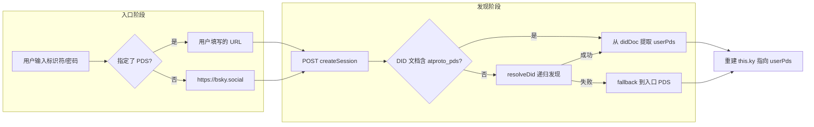
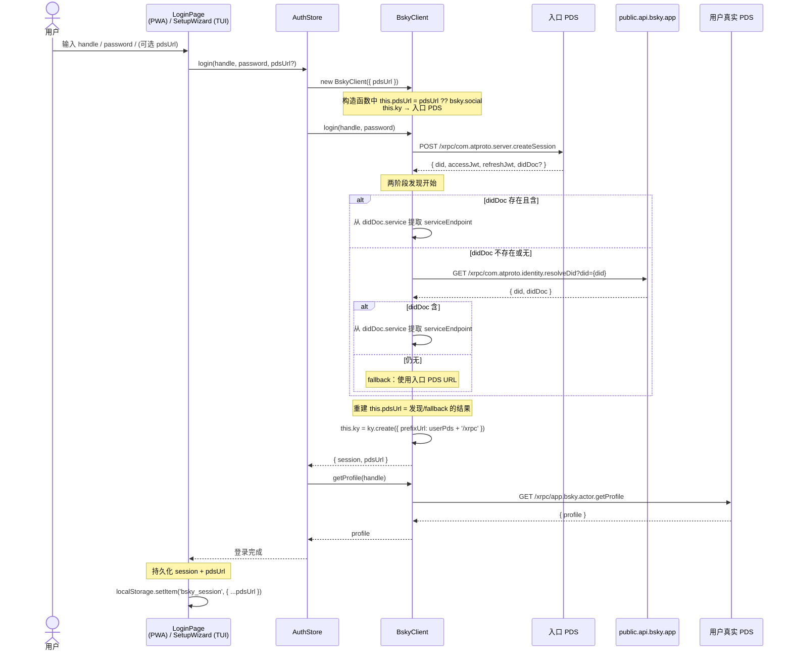

以下是 **第三方 PDS 支持** 页面的完整输出。文中已按要求嵌入所有交叉引用和源码链接。

---

# 第三方 PDS 支持

AT Protocol 的核心理念之一是 **PDS（Personal Data Server）** 的自治性——用户的数据可以托管在任何兼容的服务器上，而非必须依赖 `bsky.social`。本项目的 PDS 支持围绕一个关键洞察展开：用户登录时使用的 PDS 和用户数据实际托管的 PDS **可能是两个不同的服务器**。由此衍生出整个 Two-PDS 模型和两阶段发现流程。

---

## Two-PDS 模型

项目区分两个 PDS 角色：

- **入口 PDS（Entry PDS）**：用户提交登录表单时指定的服务器。留空则默认 `https://bsky.social`。
- **用户 PDS（User PDS）**：用户数据实际托管、写操作和需认证读操作发往的服务器。

两者可能相同（大多数 `bsky.social` 用户），也可能不同（例如用 `bsky.social` 认证但数据托管在自建 PDS 上）。



`BskyClient` 的构造函数接受 `pdsUrl` 参数设置入口 PDS，若未提供则默认为 `BSKY_SERVICE`（`https://bsky.social`）：

[来源](packages/core/src/at/client.ts#L64-L67)

```typescript
constructor(options?: { pdsUrl?: string }) {
    const entryPds = options?.pdsUrl ?? BSKY_SERVICE;
    this.pdsUrl = entryPds;
    // ...
    this.ky = ky.create({ prefixUrl: entryPds + '/xrpc', ... });
}
```

**关键设计决策**：`CreateSessionResponse` 类型本身不包含 `pdsUrl` 字段——PDS URL 作为客户端状态独立存储，不污染 session 类型。`AuthStore` 中 `pdsUrl` 与 `session` 平级。

[来源](packages/app/src/stores/auth.ts#L5-L8)

---

## 两阶段登录

`login()` 方法完整实现了从入口认证到真实 PDS 发现的转换：

### 阶段一：入口认证

用入口 PDS 创建一个临时 `ky` 实例（如果是 `bsky.social` 则新建，否则复用已有实例），调用 `com.atproto.server.createSession`：

[来源](packages/core/src/at/client.ts#L136-L148)

```typescript
async login(handle: string, password: string): Promise<CreateSessionResponse> {
    const entryUrl = this.pdsUrl;
    const entryKy = entryUrl === BSKY_SERVICE || !this.ky
        ? ky.create({ prefixUrl: entryUrl + '/xrpc', ... })
        : this.ky;
    const res = await entryKy.post('com.atproto.server.createSession', {
        json: { identifier: handle, password },
    }).json<CreateSessionResponse & { didDoc?: DidDocument }>();
    this.session = res;
```

### 阶段二：PDS 发现

从 `createSession` 返回的 `didDoc`（可选字段）中寻找 `#atproto_pds` 服务：

[来源](packages/core/src/at/client.ts#L152-L166)

```typescript
let userPdsUrl = entryUrl;
if (res.didDoc) {
    const pdsService = res.didDoc.service?.find(
        s => s.id === '#atproto_pds' || s.type === 'AtprotoPersonalDataServer'
    );
    if (pdsService?.serviceEndpoint) {
        userPdsUrl = pdsService.serviceEndpoint.replace(/\/+$/, '');
    }
} else {
    try {
        const discovered = await this._discoverPdsFromDid(res.did);
        if (discovered) userPdsUrl = discovered;
    } catch { /* stay with entryUrl */ }
}
```

`_discoverPdsFromDid` 方法作为 **fallback 方案**，通过公共 API `com.atproto.identity.resolveDid` 获取 DID 文档：

[来源](packages/core/src/at/client.ts#L179-L187)

```typescript
private async _discoverPdsFromDid(did: string): Promise<string | null> {
    const didDoc = await this.publicKy.get('com.atproto.identity.resolveDid', {
        searchParams: { did },
    }).json<ResolveDidResponse>();
    const pdsService = didDoc.didDoc?.service?.find(
        s => s.id === '#atproto_pds' || s.type === 'AtprotoPersonalDataServer'
    );
    return pdsService?.serviceEndpoint?.replace(/\/+$/, '') ?? null;
}
```

两个阶段之间的桥梁是 `session.did`——从 session 中获取 DID，再用 DID 查询 DID 文档。**过渡透明**：发现完成后立即用用户 PDS 重建 `this.ky`，后续所有请求均已路由到正确 PDS。

[来源](packages/core/src/at/client.ts#L168-L176)

### fallback 优先级

| 条件 | 行为 |
|------|------|
| `didDoc` 存在且包含 `#atproto_pds` | 使用 didDoc 中的 `serviceEndpoint` |
| `didDoc` 存在但无 `#atproto_pds` | fallback 到入口 PDS |
| `didDoc` 不存在 | 调用 `resolveDid` 获取 DID 文档 |
| `resolveDid` 成功且有 `#atproto_pds` | 使用解析结果 |
| `resolveDid` 失败或无 `#atproto_pds` | fallback 到入口 PDS |

[来源](docs/PDS.md#L107-L114)

---

## 三个 ky 实例的 PDS 感知路由

`BskyClient` 维护三个独立的 `ky` HTTP 客户端实例，各有固定目标：

| 实例 | 目标 URL | 职责 | JWT 认证 |
|------|----------|------|----------|
| `this.ky` | `{userPds}/xrpc` | 写操作、需认证读、JWT 刷新 | ✅ 是 |
| `this.publicKy` | `public.api.bsky.app/xrpc` | 公开只读聚合（不变） | ❌ 否 |
| `this.chatKy` | `api.bsky.chat/xrpc` | DM 私信（不变） | ✅ 是 |

其中 **`this.ky` 是 PDS 感知的**——构造时指向入口 PDS，登录成功后重建指向用户 PDS。`this.publicKy` 和 `this.chatKy` 固定不变，因为公共 API 和聊天 API 是全局服务，不依赖 PDS。

[来源](packages/core/src/at/client.ts#L112-L128)

`JWT 刷新` 也使用 `this.pdsUrl` 而非硬编码的 `BSKY_SERVICE`：

[来源](packages/core/src/at/client.ts#L69-L110)

```typescript
const r = await fetch(`${self.pdsUrl}/xrpc/com.atproto.server.refreshSession`, {
    method: 'POST',
    headers: { Authorization: `Bearer ${session.refreshJwt}` },
});
```

`downloadBlob` 同样使用用户 PDS：

[来源](packages/core/src/at/client.ts#L586-L594)

```typescript
async downloadBlob(did: string, cid: string): Promise<Uint8Array> {
    const blobUrl = `${this.pdsUrl}/xrpc/com.atproto.sync.getBlob`;
    // ...
}
```

**零侵入设计**：所有 hooks、UI 组件、AI 工具对 PDS 逻辑完全无感知。`useAuth()` 暴露的 `client`、`session`、`pdsUrl` 接口签名统一，PDS 路由完全封装在 `BskyClient` 和 `AuthStore` 内部。

[来源](docs/PDS.md#L47-L48)

---

## 浏览器 CORS 错误处理

第三方 PDS 可能未配置 `Access-Control-Allow-Origin` 响应头。这在 TUI（终端）中不是问题——Node.js 的 `fetch` 不受 CORS 限制。但在 PWA（浏览器）中，浏览器会抛出 `TypeError: Failed to fetch`。

项目的 CORS 策略是 **"检测 + 提示"**，而非尝试绕过。浏览器安全模型下，客户端 JavaScript 无法绕过 CORS，只能引导用户：

1. `createSession` 连接失败 → 错误消息显示连接错误
2. 错误信息包含 PDS URL，提示用户检查 PDS 是否配置了 CORS
3. 建议用户更换 PDS 或使用 TUI 模式

[来源](docs/PDS.md#L175-L177)

> **"CORS 不可控"** 是项目中明确记录的关键教训之一。第三方 PDS 是否支持 CORS 取决于其运维者，客户端对此无能为力。

---

## 会话恢复与 PDS URL 序列化

会话持久化需要同时保存 session 数据和 PDS URL，否则恢复时无法重建 `this.ky`。

### 序列化格式

`StoredSession` 接口在原有 session 字段基础上增加 `pdsUrl`：

[来源](packages/pwa/src/hooks/useSessionPersistence.ts#L3-L9)

```typescript
export interface StoredSession {
    accessJwt: string;
    refreshJwt: string;
    handle: string;
    did: string;
    pdsUrl?: string;
}
```

### 写入时机

登录成功后，PWA `App.tsx` 监听 `session` 变化并将 `client.pdsUrl` 写入 localStorage：

[来源](packages/pwa/src/App.tsx#L172-L184)

```typescript
useEffect(() => {
    if (session && client?.isAuthenticated()) {
        saveSession({
            accessJwt: session.accessJwt,
            refreshJwt: session.refreshJwt,
            handle: session.handle,
            did: session.did,
            pdsUrl: client.pdsUrl,   // ← 保存 PDS URL
        });
        setIsLoggedIn(true);
    }
}, [session, client]);
```

### 读取与重建

页面加载时从 localStorage 读取，调用 `restoreSession` 重建：

[来源](packages/pwa/src/App.tsx#L158-L170)

```typescript
useEffect(() => {
    const saved = getSession();
    if (saved && !client) {
        restoreSession({
            accessJwt: saved.accessJwt,
            refreshJwt: saved.refreshJwt,
            handle: saved.handle,
            did: saved.did,
        }, saved.pdsUrl ?? 'https://bsky.social');
        setIsLoggedIn(true);
    }
}, []);
```

`restoreSession` 重建 `this.ky` 实例指向持久化的 PDS URL：

[来源](packages/core/src/at/client.ts#L615-L624)

```typescript
restoreSession(session: CreateSessionResponse, pdsUrl?: string): void {
    this.session = session;
    if (pdsUrl) this.pdsUrl = pdsUrl;
    this.ky = ky.create({
        prefixUrl: this.pdsUrl + '/xrpc',
        timeout: 30000,
        retry: { limit: 1, statusCodes: [408, 413, 429, 500, 502, 503, 504] },
        hooks: { afterResponse: [this._withRefresh] },
    });
}
```

### 恢复失败处理

如果恢复的 PDS 不可用，`getProfile` 调用会抛出错误 → `AuthStore` 将 `client` 和 `session` 置为 null，标记 `error = 'session_expired'` → PWA 的清单监听 `authError` 后清除 session 并回到登录页：

[来源](packages/pwa/src/App.tsx#L186-L192)
[来源](packages/app/src/stores/auth.ts#L53-L65)

---

## PDS 发现完整序列图

以下时序图展示了完整的两阶段登录 + PDS 发现流程：



---

## 配置方式

### PWA 登录页

PWA 的 `LoginPage` 在 handle 和 password 之间插入一个琥珀色警告背景的 PDS 输入块：

- 文本框默认空，placeholder 显示 `bsky.social (留空自动发现)`
- 警告文本："自定义 PDS 仅适用于技术用户，如果你不知道这是什么意思，请不要修改"
- 提交时传入 `pdsUrl.trim() || undefined`

[来源](packages/pwa/src/components/LoginPage.tsx#L98-L112)

### TUI 配置向导

SetupWizard 在 password 步骤之后插入 PDS 步骤，支持留空。配置写入 `.env` 文件的 `BLUESKY_PDS` 变量：

[来源](packages/tui/src/components/SetupWizard.tsx#L50-L71)
[来源](.env.example#L4)

### 不变的服务

以下全局服务不依赖 PDS，保持不变：

| 服务 | URL | 说明 |
|------|-----|------|
| CDN | `cdn.bsky.app` | 全局图片缓存 |
| 视频 | `video.bsky.app` | 独立视频播放服务 |
| 公共 API | `public.api.bsky.app` | 聚合所有 PDS 的数据 |

[来源](docs/PDS.md#L41-L44)

---

## 下一步

- 了解 `BskyClient` 的整体设计：[AT Protocol 客户端](at-protocol-客户端.md)
- 查看会话管理的 React hook 封装：[React Hooks 体系](react-hooks-体系.md)
- 理解 JWT 自动刷新的完整机制：详见 `BskyClient._withRefresh` 方法 [来源](packages/core/src/at/client.ts#L69-L110)
- 回顾 CORS 问题的架构教训：[关键教训与架构决策记录](关键教训与架构决策记录.md)
- 若使用 TUI 模式，查看配置加载流程：[TUI 入口与配置加载](tui-入口与配置加载.md)