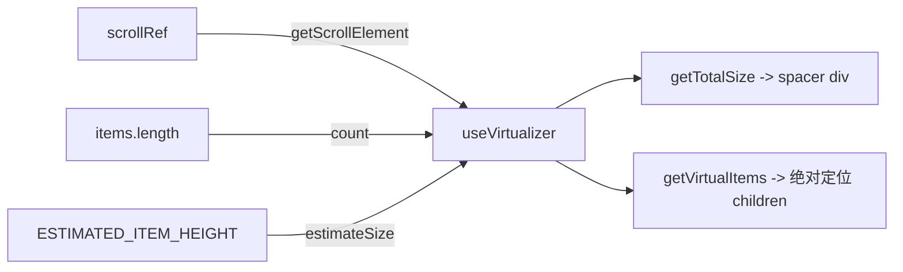

以下是"虚拟滚动与滚动恢复"页面的完整内容：

---

# 虚拟滚动与滚动恢复

## 概览

PWA 端需要渲染长列表（Feed 时间线、个人主页帖子、书签、列表等），直接渲染全部 DOM 节点会导致性能灾难。解决方案是 **虚拟滚动**：只渲染可视区域附近的条目，用绝对定位模拟滚动效果。

配套问题是 **滚动位置恢复**：用户在 Page A 滚动到第 50 帖，点进一个帖子，按返回后应该回到之前的位置。这要求跨页面切换持久化滚动状态。

本页完整覆盖这两套机制的实现规范、核心 hook 与所有已适配页面的状态。

---

## 一、虚拟滚动标准模板

### 技术选型

PWA 使用 `@tanstack/react-virtual`（`useVirtualizer`）。TUI 使用 Ink 内置渲染，不需要虚拟滚动。

[来源](docs/SCROLL.md#L7-L9)

### 三要素模式

每个使用虚拟滚动的组件都遵循同一模式：



三个核心要素缺一不可：

1. **`scrollRef`** — 固定高度的滚动容器 `<div ref={scrollRef} className="h-[calc(100vh-3rem)] overflow-y-auto">`
2. **`virtualizer`** — `useVirtualizer({ count, getScrollElement, estimateSize, overscan: 5 })`
3. **绝对定位渲染** — spacer div 撑开总高度 + `translateY(${vi.start}px)` 定位每个条目

标准实现模板：

```tsx
const ESTIMATED_ITEM_HEIGHT = 120;
const scrollRef = useRef<HTMLDivElement>(null);

const virtualizer = useVirtualizer({
  count: items.length,
  getScrollElement: () => scrollRef.current,
  estimateSize: () => ESTIMATED_ITEM_HEIGHT,
  overscan: 5,
});

// JSX
<div ref={scrollRef} className="h-[calc(100vh-3rem)] overflow-y-auto">
  <div style={{ height: virtualizer.getTotalSize(), position: 'relative', width: '100%' }}>
    {virtualizer.getVirtualItems().map(vi => {
      const item = items[vi.index]!;
      return (
        <div
          key={vi.key}
          data-index={vi.index}
          ref={virtualizer.measureElement}
          style={{
            position: 'absolute',
            top: 0,
            transform: `translateY(${vi.start}px)`,
            width: '100%',
          }}
        >
          {/* item content */}
        </div>
      );
    })}
  </div>
</div>
```

[来源](docs/SCROLL.md#L11-L47)

### 关键参数

| 参数 | 值 | 说明 |
|------|-----|------|
| `estimateSize` | `120` (Feed/Bookmark/ListDetail), `150` (Profile), `80` (Lists), `52` (ListDetail members) | 估算高度，实际高度由 `measureElement` 修正 |
| `overscan` | `5` | 视口外额外渲染条目数，防白屏闪烁 |

各组件使用的 `estimateSize` 值：

| 组件 | 常量 | 值 |
|------|------|-----|
| FeedTimeline | `ESTIMATED_POST_HEIGHT` | `120` |
| ProfilePage | `ESTIMATED_POST_HEIGHT` | `150` |
| BookmarkPage | `ESTIMATED_POST_HEIGHT` | `120` |
| ListsPage | 内联 | `80` |
| ListDetailPage (posts) | `ESTIMATED_POST_HEIGHT` | `120` |
| ListDetailPage (members) | `ESTIMATED_MEMBER_HEIGHT` | `52` |

[来源](packages/pwa/src/components/FeedTimeline.tsx#L44-L44) · [来源](packages/pwa/src/components/ProfilePage.tsx#L25-L25) · [来源](packages/pwa/src/components/BookmarkPage.tsx#L16-L16) · [来源](packages/pwa/src/components/ListsPage.tsx#L68-L68) · [来源](packages/pwa/src/components/ListDetailPage.tsx#L18-L19)

---

## 二、像素值恢复 vs 索引恢复

### 教训：索引恢复导致系统性偏移

这是项目早期踩过的一个坑，记录在 [关键教训与架构决策记录](关键教训与架构决策记录.md) 的 Lesson 32 中。

**错误做法**（已在 FeedTimeline 中修复）：

```tsx
// ❌ 索引恢复 — 虚拟器在 ResizeObserver 触发前使用估算高度
virtualizer.scrollToIndex(N, { align: 'start' });
// 导致偏移 5-6 帖（估算 120px vs 实际 ~170px）
```

**根因**：`scrollToIndex` 调用时，虚拟器只有估算高度（`ESTIMATED_POST_HEIGHT=120px`），但实际帖子高度约 170px。`measureElement` 和 `ResizeObserver` 尚未触发修正 → scroll 位置偏移 5-6 个帖子。

**修复方案**：改为像素值恢复。

```tsx
// ✅ 像素值恢复 — 直接设置 scrollTop，虚拟器自然处理
scrollRef.current.scrollTop = savedScrollTop;
```

直接操作 `scrollTop` 后，虚拟器根据像素偏移自动计算哪些条目可见，无需等待 ResizeObserver。

[来源](docs/CONTEXT.md#L207-L210) · [来源](docs/SCROLL.md#L66-L81)

### FeedTimeline 的演化见证

`FeedTimeline` 的 props 签名直接记录了这次重构：

```
// 修复前
initialScrollIndex / onFirstVisibleIndexChange
// 修复后
initialScrollTop / onScrollTopChange
```

`App.tsx` 中对应存储从 `feedScrollIndexRef` 改为 `feedScrollTopRef`。

[来源](docs/CONTEXT.md#L209-L209) · [来源](packages/pwa/src/App.tsx#L57-L57)

---

## 三、`useScrollRestore` Hook

### 架构

```mermaid
graph TD
    A[模块级 Map: _scrollTops] -->|键值存储| B{useScrollRestore}
    B --> C[on mount: 读取 Map → 设置 scrollTop]
    B --> D[on unmount: 读取 scrollTop → 写入 Map]
    C --> E[scrollRef.current.scrollTop = saved]
    D --> F[_scrollTops.set(key, currentScrollTop)]
```

[来源](packages/app/src/hooks/useScrollRestore.ts#L3-L4)

### 完整源码

```tsx
const _scrollTops = new Map<string, number>();

export function saveScrollTop(key: string, value: number): void {
  if (key) _scrollTops.set(key, value);
}

export function getScrollTop(key: string): number | undefined {
  return _scrollTops.get(key);
}

function getGlobalScrollY(): number {
  try { return (globalThis as any).scrollY ?? 0; } catch { return 0; }
}

function setGlobalScrollTop(y: number): void {
  try { (globalThis as any).scrollTo(0, y); } catch {}
}

export function useScrollRestore(
  key: string | undefined,
  scrollRef: any,
  ready: boolean
) {
  const restored = useRef(false);

  useEffect(() => {
    if (!key || !ready || restored.current) return;
    const saved = _scrollTops.get(key);
    if (saved !== undefined) {
      if (scrollRef?.current) {
        scrollRef.current.scrollTop = saved;       // 容器级恢复
      } else {
        setGlobalScrollTop(saved);                  // 全局滚动恢复
      }
      restored.current = true;
    }
  }, [key, ready]);

  useEffect(() => {
    return () => {
      if (key) {
        _scrollTops.set(
          key,
          scrollRef?.current ? scrollRef.current.scrollTop : getGlobalScrollY()
        );
      }
    };
  }, [key]);
}
```

[来源](packages/app/src/hooks/useScrollRestore.ts#L28-L51)

### 设计要点

| 层面 | 设计 |
|------|------|
| **存储** | **模块级 `Map<string, number>`** — 不在 React state 中，不在 context 中。组件卸载后数据仍在，返回时直接读取。 |
| **Key** | 字符串标识，如 `'profile-${actor}'`。不同页面用不同 key，同页面的不同条目也应有不同 key（如 `search-${query}`）。 |
| **Ref 参数** | 传入 `scrollRef` → 容器级恢复；传入 `null` → 全局 `window.scrollTo` 恢复。 |
| **Ready 守卫** | `ready` 为 `true` 时才开始恢复，避免数据未加载完成就滚动到错误位置。 |
| **单次恢复** | `restored` ref 确保只恢复一次，后续数据刷新不再触发。 |

[来源](packages/app/src/hooks/useScrollRestore.ts#L3-L4) · [来源](packages/app/src/hooks/useScrollRestore.ts#L28-L42)

### FeedTimeline 的特殊处理

`FeedTimeline` 不直接使用 `useScrollRestore` hook，而是通过 **props 回调** 与 `App.tsx` 协作：

```tsx
// App.tsx
const feedScrollTopRef = useRef(0);

// 传入 FeedTimeline
<FeedTimeline
  initialScrollTop={feedScrollTopRef.current}
  onScrollTopChange={(top) => { feedScrollTopRef.current = top; }}
/>
```

`FeedTimeline` 内部用 `requestAnimationFrame` 确保在布局稳定后设置 `scrollTop`，同时通过 `'scroll'` 事件监听实时上报位置。

[来源](packages/pwa/src/App.tsx#L57-L57) · [来源](packages/pwa/src/App.tsx#L256-L257) · [来源](packages/pwa/src/components/FeedTimeline.tsx#L60-L86)

---

## 四、DMChatPage Auto-scroll 守卫

### 问题

聊天页面有新消息到达时，是否应该自动滚动到底部？

### 规则

**只在用户已处于底部时自动滚动。** 用户向上翻看历史消息时，新消息到达**不会**将其拉回底部。

```tsx
useEffect(() => {
  const el = scrollContainerRef.current;
  if (!el) return;
  const isNearBottom = el.scrollHeight - el.scrollTop - el.clientHeight < 120;
  if (isNearBottom) {
    bottomRef.current?.scrollIntoView({ behavior: 'smooth' });
  }
}, [messages]);
```

[来源](packages/pwa/src/components/DMChatPage.tsx#L39-L46)

### 120px 阈值的含义

`scrollHeight - scrollTop - clientHeight` 可理解为"当前可见区域底部到内容底部的距离"。当这个距离小于 **120px** 时视为"在底部附近"。120px 约等于一条短消息的高度，提供了一定的容差，避免用户恰好差几个像素时被意外拉回。

---

## 五、所有页面滚动状态总表

### 虚拟滚动适配

| 页面 | 虚拟滚动 | estimateSize | 状态 |
|------|---------|-------------|------|
| FeedTimeline | ✅ | `120` | ✅ |
| ProfilePage | ✅ | `150` | ✅ |
| BookmarkPage | ✅ | `120` | ✅ |
| ListsPage | ✅ | `80` | ✅ |
| ListDetailPage (posts) | ✅ | `120` | ✅ |
| ListDetailPage (members) | ✅ | `52` | ✅ |
| SearchPage | ⬜ | — | 待适配 |
| NotifsPage | ⬜ | — | 低优先级 |
| DMChatPage | ⬜ | — | 纯文本，暂不需要 |
| DraftsPage | ⬜ | — | 条目太少 |
| ConvoListPage | ⬜ | — | 条目轻量 |

[来源](docs/SCROLL.md#L49-L61)

### 滚动恢复状态

| 页面 | 恢复方式 | Key | Ref 类型 | 实现 | 状态 |
|------|---------|-----|---------|------|------|
| FeedTimeline | ✅ 像素 | `feedScrollTopRef` (App.tsx ref) | container ref | props 回调 | ✅ v0.5.1 修复 |
| ProfilePage | ✅ 像素 | `profile-${actor}` | container ref | useScrollRestore | ✅ |
| BookmarkPage | ✅ 像素 | `bookmarks` | container ref | useScrollRestore | ✅ v0.5.1 |
| ListsPage | ✅ 像素 | `lists` | container ref | useScrollRestore | ✅ |
| ListDetailPage (posts) | ✅ 像素 | `listDetail-posts-${listUri}` | container ref | useScrollRestore | ✅ |
| ListDetailPage (members) | ✅ 像素 | `listDetail-members-${listUri}` | container ref | useScrollRestore | ✅ |
| SearchPage | ✅ 像素 | `search-${query}` | `null` (window) | useScrollRestore | ✅ |
| NotifsPage | ⬜ | — | — | — | 待添加 |
| ThreadView | ⬜ | — | — | — | 不需要（逐次加载） |
| DMChatPage | ⬜ | — | — | — | 部分保留（auto-scroll 底部） |

[来源](docs/SCROLL.md#L99-L108)

---

## 六、最佳实践清单

1. **总是使用像素值恢复**，永远不要用 `scrollToIndex`。这是经 Lesson 32 验证过的硬性规范。
2. **`ready` 条件要严格**：数据加载完成且列表非空时才设为 `true`，否则恢复时虚拟器总高度为 0。
3. **Key 要唯一且稳定**：包含足够的信息来区分页面，如 `'profile-${actor}'`、`'search-${query}'`。使用 `undefined` 的 key 可阻止保存（如 SearchPage 搜索前）。
4. **FeedTimeline 优先用 props 模式**：它是唯一一个需要 `App.tsx` 直接管理滚动状态的组件（因为 feed 切换不经过页面路由）。
5. **DMChatPage 不要用 `useScrollRestore`**：聊天页面的滚动逻辑是"总是在底部除非主动翻阅"，与位置恢复冲突。
6. **新页面加入虚拟滚动**时，复制 BookmarkPage 的模板最简洁——它有最干净的虚拟滚动 + 滚动恢复实现。

---

## 相关文档

- [关键教训与架构决策记录](关键教训与架构决策记录.md) — Lesson 32 记录了索引→像素值的重构根因
- [PWA 核心组件详解](pwa-核心组件详解.md) — PostCard、FeedTimeline 等组件的详细实现
- [React Hooks 体系](react-hooks-体系.md) — `useScrollRestore` 所在 hooks 体系的完整清单
- [Direct Messages 私信系统](direct-messages-私信系统.md) — DMChatPage 所属的私信模块详情