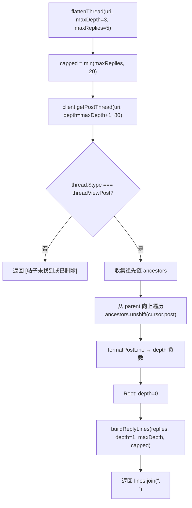

现在我对所有变更有了完整的理解。开始编写更新后的页面。

# 38 个 AI 工具系统

`createTools` 工厂函数将 Bluesky 社交网络的能力暴露为 38 个 AI 可调用工具（31 个只读 + 7 个写操作），供 [`AI 对话引擎`](ai-对话引擎.md) 在多轮对话中使用。工具系统围绕 `ToolDescriptor` 三要素设计，涵盖搜索、时间线、帖子线程、社交图、图片、列表、知识查询和写操作八大类别。

---

## ToolDescriptor 三要素

每个工具由 `packages/core/src/ai/tools.ts` 中定义的 `ToolDescriptor` 接口描述：

```typescript
export interface ToolDescriptor {
  definition: ToolDefinition;  // name + description + inputSchema（供 LLM 理解）
  handler: ToolHandler;        // (params, assistant?) => Promise<string>
  requiresWrite: boolean;     // 是否触发用户确认门
}
```

- **`definition`** —— 遵循 OpenAI 函数调用规范的 JSON Schema，描述工具名称、用途和输入参数。`AIAssistant.getToolDefinitions()` 将其暴露给 LLM。[来源](packages/core/src/ai/tools.ts#L15-L23)
- **`handler`** —— 实现层。接收 `Record<string, unknown>` 参数和可选的 `assistant` 实例引用（用于 `view_image` 和 `create_post` 等需要访问 AIAssistant 内部状态的工具）。返回 JSON 字符串。[来源](packages/core/src/ai/tools.ts#L69-L70)
- **`requiresWrite`** —— 布尔标志，唯一决定是否触发 [`AI 对话引擎`](ai-对话引擎.md) 的写操作确认门。`false` 的工具直接执行，`true` 的工具暂停执行等待用户批准。[来源](packages/core/src/ai/tools.ts#L71-L75)

`createTools(client: BskyClient)` 接收 [`AT Protocol 客户端`](at-protocol-客户端.md) 实例，返回 `ToolDescriptor[]`。`AIAssistant.setTools()` 将其构建为 `Map<string, ToolDescriptor>` 以便按名称快速查找。[来源](packages/core/src/ai/assistant.ts#L120-L126)

---

## 工具分类总览

| 类别 | 包含工具 | write 数 | 总计 |
|------|---------|---------|------|
| 搜索 | `resolve_handle`, `search_posts`, `search_actors` | 0 | 3 |
| 时间线/Feed | `get_timeline`, `get_author_feed`, `get_popular_feed_generators`, `get_feed_generator`, `get_feed` | 0 | 5 |
| 线程/帖子 | `get_post_thread`, `get_post_thread_flat`, `get_post_subtree`, `get_post_context`, `get_quotes`, `get_record`, `list_records` | 0 | 7 |
| 社交图 | `get_profile`, `get_follows`, `get_followers`, `get_suggested_follows`, `get_likes`, `get_reposted_by` | 0 | 6 |
| 图片/媒体 | `extract_images_from_post`, `download_image`, `view_image`, `extract_external_link` | 0 | 4 |
| 列表 | `get_lists`, `get_list_feed`, `create_list`, `add_to_list`, `remove_from_list` | 3 | 5 |
| 通知 | `list_notifications` | 0 | 1 |
| 知识查询 | `fetch_web_markdown`, `instant_answer`, `search_wikipedia` | 0 | 3 |
| 写操作 | `create_post`, `like`, `repost`, `follow` | 4 | 4 |
| **总计** | | **7** | **38** |

---

## 1. 搜索工具（3 个）

| 工具名 | 功能 | BskyClient 方法 | 默认 limit |
|--------|------|-----------------|-----------|
| `resolve_handle` | handle→DID 解析 | `resolveHandle()` | — |
| `search_posts` | 全文搜索帖子，支持 `sort` 参数（`top` / `latest`） | `searchPosts()` | 25 |
| `search_actors` | 搜索用户 | `searchActors()` | 25 |

`search_posts` 返回结构化数据：`{ posts: [{ uri, author, text, likeCount, repostCount, indexedAt }], hitsTotal }`。`text` 从 `post.record` 中提取，受 `PostRecord` 类型约束。[来源](packages/core/src/ai/tools.ts#L171-L188)

---

## 2. 时间线/Feed 工具（5 个）

| 工具名 | 功能 |
|--------|------|
| `get_timeline` | 已认证用户的主页时间线 |
| `get_author_feed` | 指定用户的所有帖子 |
| `get_popular_feed_generators` | 热门 Feed Generator 列表 |
| `get_feed_generator` | 单个 Feed Generator 详情 |
| `get_feed` | 指定 Feed 的帖子流 |

这组工具都映射到 `app.bsky.feed.*` 端点。`get_timeline` 和 `get_author_feed` 的 handler 提取 `feed[].post.record.text`（截断至 200 字符），返回包含 `cursor` 的分页结构。[来源](packages/core/src/ai/tools.ts#L199-L291)

---

## 3. 线程/帖子工具（7 个）

### 核心：`get_post_thread`

原始树结构，参数 `depth` 默认 6。返回 AT Protocol 的 `ThreadViewPost` 嵌套类型。适合需要精确树结构的场景。[来源](packages/core/src/ai/tools.ts#L294-L311)

### 优化：`get_post_thread_flat`——线程扁平化算法

这是 LLM 理解对话的首选工具。`flattenThread()` 函数的执行流程：



**关键设计点**：

1. **深度限制**：`maxDepth` 默认 3（远小于 `get_post_thread` 的 6），因为 LLM 上下文敏感，浅层平铺比深层树更实用。内部调用 `getPostThread` 时用 `Math.max(maxDepth + 1, 6)` 确保有足够的 buffer。[来源](packages/core/src/ai/tools.ts#L1164)
2. **`maxReplies` 上限 20**：通过 `const capped = Math.min(maxReplies, 20)` 硬限制，防止工具返回超长输出（超过 LLM 输出 token 限制）。[来源](packages/core/src/ai/tools.ts#L1162)
3. **祖先链反转**：从目标帖子的 `parent` 向上遍历，用 `ancestors.unshift()` 将祖先链按时间正序排列。祖先链使用 **负 depth** 标记（如 `depth:-2`、`depth:-1`）。[来源](packages/core/src/ai/tools.ts#L1172-L1181)
4. **同层排序**：`buildReplyLines()` 中按 `indexedAt` 升序排列回复，确保输出稳定可复现。[来源](packages/core/src/ai/tools.ts#L1212-L1216)
5. **折叠提示**：超出 `maxSiblings` 的回复显示 `（还有 N 条回复被折叠，可调用 get_post_subtree 展开）`。[来源](packages/core/src/ai/tools.ts#L1238-L1241)

**`formatPostLine` 输出示例**：

```
depth:0 | alice.bsky.social (Alice) (post:3jklm456)
text: 这是原始帖子[图片: 2 张]
  ↳ → (post:3jklm456)depth:1 | bob.bsky.social (Bob) (post:4xyz789)
text: 回复内容[链接: example.com]
    ↳depth:2 | charlie.bsky.social (Charlie) (post:5abc123)
text: 子回复
```

此格式由 `formatPostLine()` 生成，包含深度标记 `depth:N`、作者句柄+显示名称、帖子 rkey、文本和媒体摘要（图片/链接/引用/视频）。[来源](packages/core/src/ai/tools.ts#L1244-L1277)

### 扩展工具

- **`get_post_subtree`** —— 与 `flattenThread` 共享同一实现，设计用于展开被折叠的回复子树，接受 `maxReplies` 参数。[来源](packages/core/src/ai/tools.ts#L331-L345)
- **`get_post_context`** —— 组合工具：调用 `flattenThread` 获取线程 + `getRecord` 获取帖子记录的详细嵌入信息。现支持检测 video embed（输出 `视频: 1 个`）和 `recordWithMedia` 类型，并返回 `hasReply` 布尔值指示帖子是否为回复。[来源](packages/core/src/ai/tools.ts#L348-L387)
- **`get_quotes`** —— 通过 `searchPosts` 查找引用某帖子的所有帖子。[来源](packages/core/src/ai/tools.ts#L429-L450)
- **`get_record` / `list_records`** —— 底层 AT Protocol 操作，`get_record` 解析 AT URI 后调用 `client.getRecord()`，`list_records` 遍历集合。[来源](packages/core/src/ai/tools.ts#L121-L156)

---

## 4. 社交图工具（6 个）

| 工具名 | 功能 |
|--------|------|
| `get_profile` | 完整用户资料（did, handle, displayName, description, 计数）。支持 `actor="me"` 获取当前已认证用户。 |
| `get_follows` | 用户关注列表 |
| `get_followers` | 用户粉丝列表 |
| `get_suggested_follows` | 推荐关注 |
| `get_likes` | 帖子的点赞用户 |
| `get_reposted_by` | 帖子的转发用户 |

`get_profile` 的描述中明确提示"Use this to resolve a DID to a handle and vice versa."，暗示 LLM 优先使用此工具而非 `resolve_handle` 进行双向解析。当 `actor="me"` 时，handler 调用 `client.getHandle()` 获取当前用户 handle。[来源](packages/core/src/ai/tools.ts#L475-L493)

---

## 5. 图片/媒体工具（4 个）

| 工具名 | 功能 |
|--------|------|
| `extract_images_from_post` | 提取帖子的图片引用（did + cid + mimeType + alt）。递归处理 `recordWithMedia` 嵌入。 |
| `download_image` | 下载图片到本地 Downloads 文件夹（Node.js），失败时回退 data URL（浏览器/PWA） |
| `view_image` | 供视觉模型分析图片（通过 `addPendingImage` 传递给 LLM） |
| `extract_external_link` | 提取帖子的外部链接嵌入 |

**`view_image` 的双源设计**：支持两种图片来源——
1. **Bluesky 帖子图片**：通过 `did` + `cid`（来自 `extract_images_from_post`）下载 blob。
2. **用户聊天上传图片**：通过 `uploadIndex`（来自 `AIAssistant.getUserUpload()` 的内部存储）。

它将 base64 数据 URL 通过 `assistant.addPendingImage()` 存储，留给多模态 LLM 在下一轮响应中使用。返回值中的 `note` 字段根据 `visionEnabled` 配置动态切换：开启时提示模型"you will see this image"，关闭时提示"Vision mode is OFF"。[来源](packages/core/src/ai/tools.ts#L661-L707)

---

## 6. 列表工具（5 个）

| 工具名 | 功能 | requiresWrite |
|--------|------|:---:|
| `get_lists` | 获取用户的所有列表，返回 `purpose`（`curated`/`moderation`）和 `memberCount`。`actor` 参数可选，默认当前用户。 | ❌ |
| `get_list_feed` | 获取列表成员的帖子流，默认 limit 30 | ❌ |
| `create_list` | 创建新列表，`purpose` 参数支持 `curated` 或 `moderation` | ✅ |
| `add_to_list` | 添加用户到列表 | ✅ |
| `remove_from_list` | 从列表移除用户。先 `listRecords` 查找匹配项，然后**删除所有匹配条目**（若用户被多次添加则全部移除）。 | ✅ |

`get_lists` 的 handler 将 AT Protocol 的 `purpose` 值映射为可读格式：`app.bsky.graph.defs#modlist` → `moderation`，其余 → `curated`。同时输出 `memberCount`（`listItemCount`）。[来源](packages/core/src/ai/tools.ts#L1040-L1053]

`remove_from_list` 的实现需要留意：它先 `listRecords` 查找匹配项，然后**删除所有匹配条目**（若用户被多次添加则全部移除）。[来源](packages/core/src/ai/tools.ts#L1137-L1151]

---

## 7. 写工具与确认门触发条件

### 触发条件

`AIAssistant` 在工具执行循环中检查 `toolDesc.requiresWrite`。若为 `true`，则在 handler 执行前暂停：

```
非流式（_runToolCalls）: 调用 _waitForConfirmation() → 等待 confirmAction(boolean)
流式（_streamChat）:     yield { type: 'confirmation_needed', content: desc, toolName } → 等待 _waitForConfirmation()
```

[来源](packages/core/src/ai/assistant.ts#L250-L256)

### 需确认的 7 个写工具

| 工具名 | 描述 | 确认时显示 |
|--------|------|-----------|
| `create_post` | 创建帖子/回复/引用（支持图片附件） | `创建帖子: "{前100字符}"` |
| `like` | 点赞 | `点赞帖子: {uri}` |
| `repost` | 转发 | `转发帖子: {uri}` |
| `follow` | 关注用户 | `关注用户: {did}` |
| `create_list` | 创建列表 | `创建列表: "{name}" (精选/管理)` |
| `add_to_list` | 添加用户到列表 | `添加用户 {did} 到列表` |
| `remove_from_list` | 从列表移除用户 | `从列表移除用户 {did}` |

描述由 `buildToolDescription()` 生成，使用中文模板。[来源](packages/core/src/ai/assistant.ts#L647-L659)

### 用户取消流程

若用户拒绝：
- 工具返回 `'User cancelled the operation.'` 作为结果消息。
- 该消息被推入 `messages` 数组的 `role: 'tool'` 条目，LLM 据此知道操作未执行。
- `toolCallsExecuted` 仍递增，继续下一轮循环。[来源](packages/core/src/ai/assistant.ts#L257-L269)

### `create_post` 的图片附件流程

这是 `create_post` 最复杂的实现部分。当其 handler 收到 `images` 参数时，执行完整流程：

1. **来源分叉**：`pendingImageIndex`（用户聊天上传）→ 从 `assistant.getUserUpload()` 读取；`did`+`cid`（Bluesky 帖子）→ 调用 `client.downloadBlob()` 下载。
2. **上传到用户 PDS**：调用 `client.uploadBlob(data, mimeType)` 将图片数据上传到用户自己的 PDS，获得 blob 引用。
3. **构造 embed**：构建 `app.bsky.embed.images` 对象。
4. **与引用合并**：若同时有 `quoteUri`，将图片 embed 包装在 `app.bsky.embed.recordWithMedia` 中。[来源](packages/core/src/ai/tools.ts#L917-L963)

---

## 8. 零密钥知识查询工具（3 个）

这三个工具的共同特征：**无需 API 密钥**，利用公开 API 实现事实知识检索。且所有响应格式统一为 `{heading: string, content: string}` 的 JSON 结构，便于 LLM 解析。

### `fetch_web_markdown`

通过 **r.jina.ai** 代理将外部网页转换为干净的 Markdown。URL 构造为 `https://r.jina.ai/{url}`，请求头设置 `Accept: text/markdown`。响应内容截断至 10000 字符以防止 token 溢出，并通过 `extractTitle()` 函数提取页面标题。无需代理，浏览器和 Node.js 均可直接调用。[来源](packages/core/src/ai/tools.ts#L742-L754]

### `instant_answer`

通过 DuckDuckGo Instant Answer API (`api.duckduckgo.com`) 查询。响应通过 `formatDDGResponse()` 格式化为结构化 `{heading, content}` JSON。

**关键实现细节**：
- **`skip_disambig=1`** 默认启用，跳过维基百科消歧义页面。[来源](packages/core/src/ai/tools.ts#L772)
- **浏览器环境的路由策略**：检测 `typeof document !== 'undefined' && typeof window !== 'undefined'` 时（使用 `globalThis` 对象判断），通过 Cloudflare Pages Function `/api/proxy` 代理请求。这是因为 DDG API 对浏览器发送的 `Sec-Fetch-*` 头敏感，会返回空数据。Pages Function 的服务端 `fetch` 没有这些头，DDG 返回完整响应。[来源](packages/core/src/ai/tools.ts#L781-L795]
- **Node.js 环境**：直接 `fetch`，设置 `User-Agent: bsky-client/0.9.0`。[来源](packages/core/src/ai/tools.ts#L799-L802]
- **响应格式**：`formatDDGResponse()` 提取 `Heading`、`Answer`、`Abstract`、`Definition`、`Infobox`、`Results` 和 `RelatedTopics`，合并为 Markdown 正文后包装为 `JSON.stringify({heading, content})`。若无结果，`content` 为 `'No instant answer found for this query.'`。[来源](packages/core/src/ai/tools.ts#L1290-L1338]

### `search_wikipedia`

通过 Wikipedia REST API (`/{lang}.wikipedia.org/api/rest_v1/page/summary/{query}`) 获取文章摘要。无需代理——Wikipedia API 支持 CORS，浏览器可直接调用。`lang` 参数支持任意语言代码（`zh`、`ja` 等），通过正则 `/^[a-z]+/` 过滤防注入。[来源](packages/core/src/ai/tools.ts#L833-L851]

响应通过 `formatWikipediaSummary()` 处理，输出格式：

```json
{
  "heading": "Albert Einstein",
  "content": "# Albert Einstein\n\n> Theoretical physicist\n\nAlbert Einstein was a German-born theoretical physicist...\n\nSource: https://en.wikipedia.org/wiki/Albert_Einstein"
}
```

404 时返回明确的 `'No Wikipedia article found matching that query.'` 错误消息。[来源](packages/core/src/ai/tools.ts#L838-L839]

---

## 推荐阅读

- [`AI 对话引擎`](ai-对话引擎.md) —— `AIAssistant` 的多轮工具调用循环和确认门的完整实现
- [`AT Protocol 客户端`](at-protocol-客户端.md) —— `BskyClient` 各方法的底层实现
- [`AT Protocol 类型系统`](at-protocol-类型系统.md) —— `ThreadViewPost`、`PostView` 等类型定义
- [`AI 系统提示词与多提供商`](ai-系统提示词与多提供商.md) —— 提示词中如何引导 LLM 使用这些工具