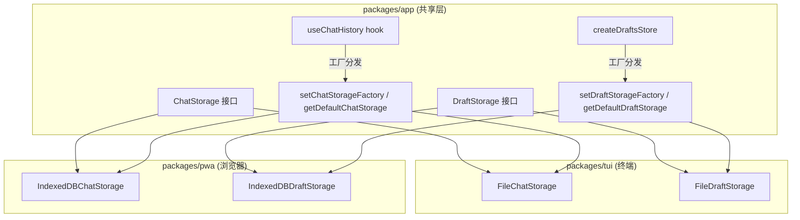

# 存储抽象层

AI 对话历史和帖子草稿是两种需要持久化的数据。两者共享同一个设计模式：**接口定义契约 → 双平台各自实现 → 消费端零感知**。两者均使用 **工厂模式** 实现平台解耦，但草稿系统额外叠加了与 PDS 的双存储回退策略。



[来源](packages/app/src/services/chatStorage.ts#L33-L38), [来源](packages/app/src/services/draftStorage.ts#L16-L21)

---

## ChatStorage：AI 对话持久化

### 接口定义

`ChatStorage` 接口定义了四个操作，覆盖对话的完整 CRUD：

```typescript
export interface ChatStorage {
  saveChat(chat: ChatRecord): Promise<void>;
  loadChat(id: string): Promise<ChatRecord | null>;
  listChats(): Promise<ChatSummary[]>;
  deleteChat(id: string): Promise<void>;
}
```

关联的数据类型包括 `ChatRecord`（完整对话，含 `id`、`title`、`contextUri`、`context`、`messages: AIChatMessage[]`、时间戳等）和 `ChatSummary`（列表摘要，含 `messageCount`）。`AIChatMessage` 支持 `user`、`assistant`、`tool_call`、`tool_result`、`thinking` 五种角色，并预留了 `reasoning_content` 和 `tool_calls` 字段用于思维链展示。`ChatRecord` 中的 `contextUri` 和 `context` 字段用于记录对话的上下文来源（帖子 URI 或个人主页 handle），以便在 AI 对话页面中恢复上下文。[来源](packages/app/src/services/chatStorage.ts#L5-L31)

### FileChatStorage：TUI 的文件系统实现

终端环境下，每个对话保存为 `~/.bsky-tui/chats/{id}.json` 文件：

- **saveChat** — 将 `ChatRecord` 序列化为 JSON 写入文件，自动刷新 `updatedAt`。[来源](packages/app/src/services/chatStorage.ts#L50-L54)
- **loadChat** — 按 ID 读取对应 JSON 文件，解析失败返回 `null`（文件不存在或格式损坏）。[来源](packages/app/src/services/chatStorage.ts#L56-L64)
- **listChats** — 扫描目录下所有 `.json` 文件，逐个反序列化并提取摘要，按 `updatedAt` 降序排列。循环中包裹 `try/catch` 跳过损坏文件。[来源](packages/app/src/services/chatStorage.ts#L66-L87)
- **deleteChat** — `unlinkSync` 删除文件，忽略文件不存在的错误。[来源](packages/app/src/services/chatStorage.ts#L89-L93)

### IndexedDBChatStorage：PWA 的 IndexedDB 实现

浏览器环境下，对话存于 IndexedDB 数据库 `bsky-chats`，对象存储名 `chats`，主键为 `id`：

```typescript
import type { ChatStorage, ChatRecord, ChatSummary } from '@bsky/app';

const DB_NAME = 'bsky-chats';
const DB_VERSION = 1;
const STORE_NAME = 'chats';

function openDB(): Promise<IDBDatabase> {
  return new Promise((resolve, reject) => {
    const req = indexedDB.open(DB_NAME, DB_VERSION);
    req.onupgradeneeded = () => {
      const db = req.result;
      if (!db.objectStoreNames.contains(STORE_NAME)) {
        db.createObjectStore(STORE_NAME, { keyPath: 'id' });
      }
    };
    req.onsuccess = () => resolve(req.result);
    req.onerror = () => reject(req.error);
  });
}

function withStore(mode: IDBTransactionMode): Promise<IDBObjectStore> {
  return openDB().then(db => {
    const tx = db.transaction(STORE_NAME, mode);
    return tx.objectStore(STORE_NAME);
  });
}

export class IndexedDBChatStorage implements ChatStorage {
  async saveChat(chat: ChatRecord): Promise<void> {
    const store = await withStore('readwrite');
    return new Promise((resolve, reject) => {
      const req = store.put({ ...chat, updatedAt: chat.updatedAt ?? new Date().toISOString() });
      req.onsuccess = () => resolve();
      req.onerror = () => reject(req.error);
    });
  }

  async loadChat(id: string): Promise<ChatRecord | null> {
    const store = await withStore('readonly');
    return new Promise((resolve, reject) => {
      const req = store.get(id);
      req.onsuccess = () => resolve(req.result ?? null);
      req.onerror = () => reject(req.error);
    });
  }

  async listChats(): Promise<ChatSummary[]> {
    const store = await withStore('readonly');
    return new Promise((resolve, reject) => {
      const req = store.getAll();
      req.onsuccess = () => {
        const all = req.result as ChatRecord[];
        resolve(
          all
            .map(c => ({
              id: c.id,
              title: c.title,
              messageCount: c.messages.filter(m => m.role === 'user' || m.role === 'assistant').length,
              updatedAt: c.updatedAt,
            }))
            .sort((a, b) => new Date(b.updatedAt).getTime() - new Date(a.updatedAt).getTime())
        );
      };
      req.onerror = () => reject(req.error);
    });
  }

  async deleteChat(id: string): Promise<void> {
    const store = await withStore('readwrite');
    return new Promise((resolve, reject) => {
      const req = store.delete(id);
      req.onsuccess = () => resolve();
      req.onerror = () => reject(req.error);
    });
  }
}
```

与 `FileChatStorage` 对照，逻辑完全对等：`put` 等价于写文件，`get` 等价于读文件，`getAll` 等价于扫描目录，`delete` 等价于 `unlinkSync`。区别在于 `withStore` 辅助函数每次操作都重新打开数据库并获取事务——这是一种简单直接的实现，没有使用连接池或缓存。[来源](packages/pwa/src/services/indexeddb-chat-storage.ts#L1-L76)

### 工厂模式：setChatStorageFactory / getDefaultChatStorage

ChatStorage **也采用了工厂模式**，与 DraftStorage 的设计完全对称：

```typescript
let _defaultChatStorage: ChatStorage | null = null;
let _chatStorageFactory: (() => ChatStorage) | null = null;

export function setChatStorageFactory(factory: () => ChatStorage): void {
  _chatStorageFactory = factory;
  _defaultChatStorage = null;
}

export function getDefaultChatStorage(): ChatStorage {
  if (!_defaultChatStorage) {
    if (_chatStorageFactory) {
      _defaultChatStorage = _chatStorageFactory();
    } else {
      // Fallback: auto-detect platform
      const g = globalThis as { process?: { versions?: { node?: string } } };
      if (g.process?.versions?.node) {
        _defaultChatStorage = new FileChatStorage();
      } else {
        throw new Error('No chat storage factory set. Call setChatStorageFactory()...');
      }
    }
  }
  return _defaultChatStorage;
}
```

工作流程与 DraftStorage 一致：

1. 各平台在启动入口处注册工厂函数。
2. `useChatHistory` 内部通过 `getDefaultChatStorage()` 获取实例。
3. 工厂只执行一次，结果缓存在模块级 `_defaultChatStorage` 中。
4. 未注册工厂时自动检测 Node.js 环境，回退到 `FileChatStorage`；浏览器环境则抛出错误，要求显式注册。

[来源](packages/app/src/services/chatStorage.ts#L95-L132)

### 平台注册点

**PWA** 在 `App.tsx` 组件体内同时注册两个存储工厂：

```typescript
import { setDraftStorageFactory, setChatStorageFactory } from '@bsky/app';
import { IndexedDBDraftStorage } from './services/indexeddb-draft-storage.js';
import { IndexedDBChatStorage } from './services/indexeddb-chat-storage.js';

setDraftStorageFactory(() => new IndexedDBDraftStorage());
setChatStorageFactory(() => new IndexedDBChatStorage());
```
[来源](packages/pwa/src/App.tsx#L42-L43)

**TUI** 在 `cli.ts` 入口处只注册 `FileDraftStorage`，而 `FileChatStorage` 依赖自动检测回退：

```typescript
import { setDraftStorageFactory, FileDraftStorage } from '@bsky/app';
setDraftStorageFactory(() => new FileDraftStorage());
```
[来源](packages/tui/src/cli.ts#L17)

### 消费端：useChatHistory

`useChatHistory` hook 接受可选的 `storage` 参数，默认使用 `getDefaultChatStorage()` 获取实例：

```typescript
export function useChatHistory(storage?: ChatStorage) {
  const store = storage ?? getDefaultChatStorage();
  // ...
}
```

返回 `{ conversations, loading, loadConversation, saveConversation, deleteConversation, refresh, storage }`。[来源](packages/app/src/hooks/useChatHistory.ts#L5-L39)

PWA 的 `AIChatPage` 直接调用 `useChatHistory()` 无参形式，通过工厂模式自动获取 `IndexedDBChatStorage`。[来源](packages/pwa/src/components/AIChatPage.tsx#L39)

### 使用方式对比

| 维度 | TUI (FileChatStorage) | PWA (IndexedDBChatStorage) |
|------|------------------------|---------------------------|
| 实例化方式 | 自动检测回退（Node.js） | 工厂注册 `setChatStorageFactory` |
| 注册位置 | 无需显式注册 | `App.tsx` 组件体 |
| 存储位置 | `~/.bsky-tui/chats/` 目录 | 浏览器 IndexedDB `bsky-chats` 数据库 |
| 序列化格式 | 独立的 JSON 文件 | IndexedDB 原生对象存储 |

---

## DraftStorage：帖子草稿持久化

### 接口定义

`DraftStorage` 的接口比 ChatStorage 更简洁，方法名也更接近 Map 语义：

```typescript
export interface DraftStorage {
  getAll(): Promise<AppDraft[]>;
  get(id: string): Promise<AppDraft | undefined>;
  set(draft: AppDraft): Promise<void>;
  delete(id: string): Promise<void>;
}
```

`AppDraft` 包含 `id`、`serverId`、`posts: { text: string }[]`（支持多帖线程）、`replyTo`、`quoteUri`、时间戳，以及关键的 `syncStatus: 'local' | 'synced' | 'modified'` 字段，用于追踪与 PDS 的同步状态。[来源](packages/app/src/services/draftStorage.ts#L5-L14)

### FileDraftStorage：TUI 的文件系统实现

逻辑与 `FileChatStorage` 几乎一致：每个草稿存为 `~/.bsky-tui/drafts/{id}.json`。`getAll` 扫描目录、反序列化、按 `updatedAt` 降序，同样跳过损坏文件（额外校验 `draft.id` 和 `Array.isArray(draft.posts)`）。[来源](packages/app/src/services/draftStorage.ts#L23-L70)

### 工厂模式：setDraftStorageFactory / getDefaultDraftStorage

```typescript
let _defaultDraftStorage: DraftStorage | null = null;
let _draftStorageFactory: (() => DraftStorage) | null = null;

export function setDraftStorageFactory(factory: () => DraftStorage) {
  _draftStorageFactory = factory;
  _defaultDraftStorage = null;
}

export function getDefaultDraftStorage(): DraftStorage {
  if (!_defaultDraftStorage) {
    if (_draftStorageFactory) {
      _defaultDraftStorage = _draftStorageFactory();
    } else {
      const g = globalThis as { process?: { versions?: { node?: string } } };
      if (g.process?.versions?.node) {
        _defaultDraftStorage = new FileDraftStorage();
      } else {
        throw new Error('No draft storage factory set...');
      }
    }
  }
  return _defaultDraftStorage;
}
```

模式与 ChatStorage 完全对称。区别在于：DraftStorage 在浏览器中同样要求显式注册工厂，而非静默回退。[来源](packages/app/src/services/draftStorage.ts#L72-L100)

### IndexedDBDraftStorage：PWA 的 IndexedDB 实现

数据库名 `bsky_drafts`，对象存储名 `drafts`，主键 `id`：

```typescript
import type { AppDraft, DraftStorage } from '@bsky/app';

const DB_NAME = 'bsky_drafts';
const DB_VERSION = 1;
const STORE_NAME = 'drafts';

function openDB(): Promise<IDBDatabase> {
  return new Promise((resolve, reject) => {
    const req = indexedDB.open(DB_NAME, DB_VERSION);
    req.onupgradeneeded = () => {
      if (!req.result.objectStoreNames.contains(STORE_NAME)) {
        req.result.createObjectStore(STORE_NAME, { keyPath: 'id' });
      }
    };
    req.onsuccess = () => resolve(req.result);
    req.onerror = () => reject(req.error);
  });
}

export class IndexedDBDraftStorage implements DraftStorage {
  private dbPromise: Promise<IDBDatabase> | null = null;

  private getDB(): Promise<IDBDatabase> {
    if (!this.dbPromise) this.dbPromise = openDB();
    return this.dbPromise;
  }

  async getAll(): Promise<AppDraft[]> {
    const db = await this.getDB();
    return new Promise((resolve, reject) => {
      const tx = db.transaction(STORE_NAME, 'readonly');
      const store = tx.objectStore(STORE_NAME);
      const req = store.getAll();
      req.onsuccess = () => {
        const drafts: AppDraft[] = req.result || [];
        drafts.sort((a, b) => new Date(b.updatedAt).getTime() - new Date(a.updatedAt).getTime());
        resolve(drafts);
      };
      req.onerror = () => reject(req.error);
    });
  }

  async get(id: string): Promise<AppDraft | undefined> {
    const db = await this.getDB();
    return new Promise((resolve, reject) => {
      const tx = db.transaction(STORE_NAME, 'readonly');
      const store = tx.objectStore(STORE_NAME);
      const req = store.get(id);
      req.onsuccess = () => resolve(req.result ?? undefined);
      req.onerror = () => reject(req.error);
    });
  }

  async set(draft: AppDraft): Promise<void> {
    const db = await this.getDB();
    return new Promise((resolve, reject) => {
      const tx = db.transaction(STORE_NAME, 'readwrite');
      const store = tx.objectStore(STORE_NAME);
      const req = store.put(draft);
      req.onsuccess = () => resolve();
      req.onerror = () => reject(req.error);
    });
  }

  async delete(id: string): Promise<void> {
    const db = await this.getDB();
    return new Promise((resolve, reject) => {
      const tx = db.transaction(STORE_NAME, 'readwrite');
      const store = tx.objectStore(STORE_NAME);
      const req = store.delete(id);
      req.onsuccess = () => resolve();
      req.onerror = () => reject(req.error);
    });
  }
}
```

与 `IndexedDBChatStorage` 有两个细微区别：一是通过 `dbPromise` 缓存了数据库连接（`getDB()` 惰性初始化）；二是每个方法内部手动获取事务和对象存储，而非通过 `withStore` 辅助函数。[来源](packages/pwa/src/services/indexeddb-draft-storage.ts#L1-L75)

---

## 双存储回退策略：PDS + 本地

草稿系统比对话系统多了一层复杂度——它需要与 AT Protocol 的 PDS 同步。`createDraftsStore` 实现了**优先写入 PDS，失败则回退到本地**的策略。

### saveDraft：写入流程

```
saveDraft(data)
    │
    ├─ 如果客户端已登录
    │   ├─ 已有 serverId → updateDraft (更新 PDS)
    │   │     成功 → syncStatus = 'synced'
    │   │     失败 → syncStatus = 'local' (静默回退)
    │   │
    │   └─ 无 serverId → createDraft (创建 PDS)
    │         成功 → 记录 serverId, syncStatus = 'synced'
    │         失败 → syncStatus = 'local' (静默回退)
    │
    └─ 始终写入本地 storage.set(draft)
```

关键设计细节：**无论 PDS 同步是否成功，本地存储总是写入**。这保证了离线状态下草稿不会丢失。`syncStatus` 字段为后续手动同步提供依据。[来源](packages/app/src/hooks/useDrafts.ts#L36-L89)

### deleteDraft：双端删除

删除时同样尝试两端删除：先 PDS（如果存在 `serverId`），再本地。PDS 删除失败被静默忽略。[来源](packages/app/src/hooks/useDrafts.ts#L91-L103)

### syncDraft：手动同步

用户可手动触发同步，将 `'local'` 或 `'modified'` 状态的草稿推送到 PDS。[来源](packages/app/src/hooks/useDrafts.ts#L105-L121)

### refreshDrafts：启动时合并

应用启动时，`refreshDrafts` 执行双向合并：

1. 先从本地加载所有草稿，构建 `localMap`（按 `id` 索引）和 `localByServerId`（按 `serverId` 索引）。
2. 再从 PDS 拉取服务器草稿列表。
3. 对于 PDS 上的每个草稿：如果本地已有匹配的 `serverId`，用服务器数据覆盖本地（**服务器权威**）；如果本地没有，新建本地草稿记录并关联 `serverId`。
4. 最后将本地独有的草稿（从未同步的）追加到结果列表。

这种合并策略确保了用户在不同设备上创建的草稿最终能被汇集。[来源](packages/app/src/hooks/useDrafts.ts#L123-L189)

---

## 设计对比

| 维度 | ChatStorage | DraftStorage |
|------|-------------|--------------|
| 接口方法 | save/load/list/delete | set/get/getAll/delete |
| 平台分发 | 工厂模式 (+ 自动检测回退) | 工厂模式 (+ 自动检测回退) |
| 远端同步 | 无 | PDS 双存储回退 |
| TUI 实现 | FileChatStorage | FileDraftStorage |
| PWA 实现 | IndexedDBChatStorage | IndexedDBDraftStorage |
| 数据库连接管理 | 每次 `withStore` 重开 | `dbPromise` 缓存 |

---

## 推荐阅读

- 了解存储层在整体架构中的位置，见 [三层架构详解](三层架构详解.md)。
- `useChatHistory` 和 `useDrafts` 的完整签名见 [React Hooks 体系](react-hooks-体系.md)。
- AT Protocol 客户端如何与 PDS 通信（`createDraft` / `getDrafts` / `updateDraft` / `deleteDraft`），见 [AT Protocol 客户端](at-protocol-客户端.md)。
- AI 对话引擎如何使用 `ChatStorage` 持久化多轮对话，见 [AI 对话引擎](ai-对话引擎.md)。