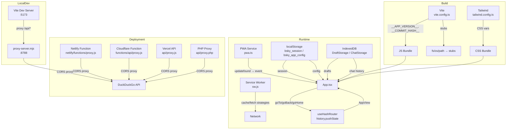

现在我已掌握所有变更点。开始撰写更新后的页面。

---

# PWA 应用架构

PWA 包位于 `packages/pwa/`，是项目双界面架构中的浏览器端。与 TUI 的终端渲染不同，PWA 面向现代 Web 标准构建：Vite 作为构建工具、Tailwind CSS 驱动主题、hash-based 路由适配静态托管、Service Worker 实现离线策略与版本更新通知，并同时支持 Netlify、Cloudflare Pages、Vercel 和通用 PHP 四种部署方式。

## 构建配置：Vite + 编译时常量注入

`vite.config.ts` 是整个 PWA 的构建中枢。它加载 `@vitejs/plugin-react` 启用 JSX 编译，并设置 `base: './'`（相对路径）以支持子目录部署。构建产物输出到 `dist/`，资源文件汇聚到 `dist/assets/`。

```ts
// packages/pwa/vite.config.ts
const commitHash = execSync('git rev-parse HEAD').toString().trim();
const commitDesc = execSync('git log --format=%s -1').toString().trim();
const buildTime = new Date().toISOString();

define: {
  __APP_VERSION__: JSON.stringify(pkg.version),
  __COMMIT_HASH__: JSON.stringify(commitHash),
  __COMMIT_DESC__: JSON.stringify(commitDesc),
  __BUILD_TIME__: JSON.stringify(buildTime),
}
```

相比旧版新增了 `__APP_VERSION__`，从 `package.json` 的 `version` 字段注入。四个编译时常量通过 Vite 的 `define` 选项注入，在 `AboutPage.tsx` 中展示给用户。TypeScript 一侧通过 `env.d.ts` 声明全局变量类型：

```ts
declare const __APP_VERSION__: string;
declare const __COMMIT_HASH__: string;
declare const __COMMIT_DESC__: string;
declare const __BUILD_TIME__: string;
```

[来源](packages/pwa/vite.config.ts#L1-L41) | [来源](packages/pwa/src/env.d.ts#L1-L4) | [来源](packages/pwa/src/components/AboutPage.tsx#L14-L25)

### Node.js 原生模块的浏览器适配

PWA 依赖 `@bsky/core` 和 `@bsky/app`，而这两个库内部引用了 Node.js 内置模块（`fs`、`os`、`path`）。Vite 通过 `resolve.alias` 将它们替换为浏览器端的 stub 实现：

| Node 模块 | Stub 文件 | 行为 |
|-----------|-----------|------|
| `fs` | `src/stubs/fs.ts` | 所有操作返回空值/空数组 |
| `os` | `src/stubs/os.ts` | `homedir()` 返回 `'/'` |
| `path` | `src/stubs/path.ts` | `join()` 用 `/` 拼接参数 |

[来源](packages/pwa/vite.config.ts#L14-L19) | [来源](packages/pwa/src/stubs/fs.ts#L1-L7) | [来源](packages/pwa/src/stubs/os.ts#L1-L2) | [来源](packages/pwa/src/stubs/path.ts#L1-L2)

### 开发服务器与 API 代理

开发模式下 Vite 运行在 `:5173`，并将 `/api` 前缀的请求代理到 `http://127.0.0.1:8788`（用于 DuckDuckGo API 代理的本地 Node.js 服务器）。`open: true` 配置让启动时自动打开浏览器。

[来源](packages/pwa/vite.config.ts#L31-L40)

---

## 双主题系统：CSS 变量驱动的 Tailwind 设计

PWA 的 Light/Dark 主题采用 **CSS 变量 + Tailwind `class` 策略**，而非 Tailwind 的自动媒体查询模式。

### 变量定义（`index.css`）

`index.css` 定义了完整的 Light/Dark 色板，并添加了全局 `body` 文本颜色绑定和滚动容器防弹性滚动规则：

```css
:root {
  --color-primary: #00A5E0;
  --color-primary-hover: #0095C9;
  --color-surface: #F8F9FA;
  --color-border: #E5E7EB;
  --color-text-primary: #0F172A;
  --color-text-secondary: #64748B;
}

.dark {
  --color-primary: #00A5E0;
  --color-primary-hover: #00B5F0;
  --color-surface: #121212;
  --color-border: #27272A;
  --color-text-primary: #F1F5F9;
  --color-text-secondary: #A3B4C0;
}

body {
  color: var(--color-text-primary);
}

/* Prevent rubber-banding on all scrollable containers */
[class*="overflow-y-auto"] {
  overscroll-behavior-y: contain;
}
.scroll-container {
  overscroll-behavior: contain;
  -webkit-overflow-scrolling: touch;
}
```

此外，`index.css` 还包含了完整的 `.markdown-body` 样式系统（h1-h6、代码块、引用、表格、列表等），深色模式滚动条定制，以及四组动画关键帧：`fadeIn`、`slideUp`、`messageIn`、`scaleIn`，配合 `.stagger-1` 至 `.stagger-6` 实现列表元素逐条入场效果，以及 `.btn-press:active` 的缩放反馈。

[来源](packages/pwa/src/index.css#L1-L171)

### Tailwind 映射（`tailwind.config.ts`）

配置将 CSS 变量映射为 Tailwind 语义色板，新增 Inter 字体系列、内容最大宽度和侧边栏/右侧面板的固定宽度：

```ts
darkMode: 'class',
theme: {
  extend: {
    colors: {
      primary: {
        DEFAULT: 'var(--color-primary)',
        hover: 'var(--color-primary-hover)',
      },
      surface: 'var(--color-surface)',
      border: 'var(--color-border)',
      'text-primary': 'var(--color-text-primary)',
      'text-secondary': 'var(--color-text-secondary)',
    },
    fontFamily: {
      sans: ['Inter', 'system-ui', '-apple-system', ...],
    },
    maxWidth: {
      content: '880px',
    },
    spacing: {
      sidebar: '280px',
      'right-panel': '390px',
    },
  },
}
```

[来源](packages/pwa/tailwind.config.ts#L1-L30)

### 切换机制与首屏保护

`Layout.tsx` 中的 `toggleDark` 函数负责切换 `document.documentElement` 上的 `dark` class，同时通过 React state 驱动持久化。`App.tsx` 的挂载 `useEffect` 从 `getAppConfig()` 读取并同步 `dark` class。`index.html` 的 `<body>` 标签使用 Tailwind 的 `dark:` 变体兜底：`bg-white dark:bg-[#0A0A0A] font-sans antialiased`，确保 JS 加载前的首屏渲染正确。

[来源](packages/pwa/src/components/Layout.tsx#L140-L144) | [来源](packages/pwa/src/App.tsx#L164-L167) | [来源](packages/pwa/index.html#L19)

---

## 三个专属 Hook

PWA 层的三个 React hook 承担着与 TUI 完全不同的职责——它们直接对接浏览器 API（`localStorage`、`history.pushState`），而非终端标准输入输出。

### useHashRouter：Hash → AppView 编解码

这是整个 PWA 的导航引擎。它维护一个 `AppView` 状态，通过 `window.location.hash` 与浏览器历史栈同步。

**完整的编解码规则**：`parseHash()` 从 `window.location.hash` 解析出 `AppView` 联合类型；`encodeView()` 反向生成 hash 字符串。支持的视图类型保持不变，与 [导航状态机](导航状态机.md) 定义的 `AppView` 联合类型一致：

| Hash 模式 | AppView 类型 | 说明 |
|-----------|-------------|------|
| `#/feed` / `#/feed?feed=at://...` | `feed` | 主时间线，支持 feed URI 参数 |
| `#/thread?uri=at://...` | `thread` | 帖子线索 |
| `#/profile?actor=...&tab=...` | `profile` | 用户主页，支持 `tab` |
| `#/notifications` | `notifications` | 通知页面 |
| `#/search` / `#/search?q=...&tab=...` | `search` | 搜索，支持 `q` 和 `tab` |
| `#/bookmarks` | `bookmarks` | 书签 |
| `#/lists` / `#/lists?actor=...` | `lists` | 列表集合 |
| `#/list?uri=...&tab=...` | `listDetail` | 列表详情，支持 `posts`/`members` tab |
| `#/drafts` | `drafts` | 草稿箱 |
| `#/dm` / `#/dm?conv=...` | `dm` / `dmChat` | 私信列表与对话 |
| `#/components` | `components` | 组件展示页 |
| `#/about` | `about` | 关于页 |
| `#/atplay` | `atplay` | AT Play 实验功能 |
| `#/atplay/social-circle` | `atplaySocialCircle` | 社交圈分析 |
| `#/compose?replyTo=...&quoteUri=...&draftId=...` | `compose` | 发帖，支持回复、引用和草稿 |
| `#/ai` / `#/ai?session=...&post=...&profile=...` | `aiChat` | AI 对话，支持会话/上下文帖/上下文用户 |

**默认 Feed 重定向**：当用户访问裸 `#/feed` 或首页（空 hash）时，hook 在 `useEffect` 中自动执行 `history.replaceState` 到 `#/feed?feed=<defaultFeedUri>`，默认 Feed 从 `getFeedConfig().defaultFeedUri` 读取，若未配置则回退到 `BUILTIN_FEEDS.following`。

**导航 API**：暴露 `goTo`（含裸 feed 解析）、`goBack`、`goHome` 三个方法。`goTo` 中如果 feed 导航缺少 `feedUri`，会自动调用 `getLastFeedUri()` 获取最近活跃 feed，再回退到默认 feed。`goHome` 始终导航到默认 feed 并重置 `canGoBack` 为 `false`。`canGoBack` 状态通过对比当前 hash 与 `#/feed` 判断。

[来源](packages/pwa/src/hooks/useHashRouter.ts#L21-L74)

### useSessionPersistence：localStorage 会话持久化

将 Bluesky 会话（`accessJwt`、`refreshJwt`、`handle`、`did`、`pdsUrl`）序列化到 `localStorage` 的 `bsky_session` 键下。提供类型化的 `StoredSession` 接口和三个纯函数：

- `getSession()` — 应用启动时恢复会话
- `saveSession(session)` — 登录成功后持久化
- `clearSession()` — 登出或会话过期时清除

`pdsUrl` 字段支持 [第三方 PDS 支持](第三方-pds-支持.md) 场景，当用户使用非官方 PDS 登录时保存其 PDS 地址。

在 `App.tsx` 中，`useEffect` 监听 `session` 状态变化：登录成功时调用 `saveSession`（含 `client.pdsUrl`）；认证错误时调用 `clearSession` 并重置登录状态。

[来源](packages/pwa/src/hooks/useSessionPersistence.ts#L1-L27) | [来源](packages/pwa/src/App.tsx#L200-L211)

### useAppConfig：应用配置持久化

将用户的完整应用配置持久化到 `localStorage` 的 `bsky_app_config` 键下。配置类型 `AppConfig` 的字段体系：

| 字段 | 类型 | 默认值 | 用途 |
|------|------|--------|------|
| `aiConfig` | `AIConfig` | deepseek-v4-flash | AI 服务的 baseUrl / model / apiKey |
| `darkMode` | `boolean` | `false` | 深色模式开关 |
| `targetLang` | `string` | `'zh'` | 翻译目标语言 |
| `translateMode` | `'simple' \| 'json'` | `'simple'` | 翻译模式（单轮/JSON 结构） |
| `thinkingEnabled` | `boolean` | `true` | AI 思维链显示开关 |
| `visionEnabled` | `boolean` | `false` | 视觉识别能力开关 |
| `apiKeys` | `Record<string, string>` | `{}` | 多提供商 API 密钥 |
| `scenarioModels` | `{ aiChat, translate, polish }` | 均为 `''` | 场景级模型覆盖 |
| `enabledWidgets` | `string[]` | `[]` | 右侧面板启用的 widget |
| `customSystemPrompt` | `string` (可选) | — | 自定义 AI 系统提示 |

提供三个操作函数：`getAppConfig()` 读取并与 `DEFAULT_CONFIG` 深度合并；`saveAppConfig()` 全量写入；`updateAppConfig(partial)` 部分更新。`apiKeys` 键为 provider ID（如 `'deepseek'`、`'mistral'`），在 `App.tsx` 的 `resolveScenarioConfig()` 中与场景模型结合解析出完整 `AIConfig`。

[来源](packages/pwa/src/hooks/useAppConfig.ts#L1-L65)

---

## PWA 更新与 Service Worker 策略

PWA 的离线能力由手写 Service Worker `public/sw.js` 提供，搭配新增的 `src/services/pwa.ts` 模块实现版本更新通知。

### 缓存命名空间

```
CACHE_NAME  = 'bsky-v3'       // 应用 shell + JS/CSS 资源
IMG_CACHE   = 'bsky-img-v1'   // Bluesky CDN 图片
FONT_CACHE  = 'bsky-font-v1'  // Google 字体
```

### 路由矩阵

| 请求目标 | 策略 | 依据 |
|----------|------|------|
| `cdn.bsky.app` 图片 | Cache-first | 内容寻址，不可变 URL |
| `fonts.gstatic.com` | Cache-first | 字体文件极少变更 |
| `fonts.googleapis.com` | Stale-while-revalidate | CSS 可能小版本更新 |
| `bsky.social` / `public.api.bsky.app` / `api.deepseek.com` / 含 `api.` 的域名 | Network-first | 数据必须新鲜 |
| `/assets/*` / `/icons/*`（Vite 构建产物） | Cache-first | 文件名含 hash，不可变 |
| 其余（根 HTML） | Stale-while-revalidate | 快速加载，后台更新 |

### 激活阶段的缓存清理与客户端接管

`activate` 事件中删除不在白名单中的所有旧缓存（`bsky-v1`、`bsky-v2` 等），并调用 `self.clients.claim()` 确保当前页面立即被 SW 接管，无需等待页面刷新。安装阶段预缓存 `./`、`./index.html` 和 `./manifest.json`。

[来源](packages/pwa/public/sw.js#L1-L124)

### 注册与版本更新机制（`main.tsx` + `pwa.ts`）

在 `main.tsx` 中，SW 注册逻辑相比旧版大幅增强：

```ts
// main.tsx
if ('serviceWorker' in navigator) {
  window.addEventListener('load', () => {
    navigator.serviceWorker.register('./sw.js', { scope: './' }).then(
      (reg) => {
        setSwRegistration(reg);  // 存储注册引用

        reg.addEventListener('updatefound', () => {
          const newWorker = reg.installing;
          newWorker.addEventListener('statechange', () => {
            if (newWorker.state === 'installed' && navigator.serviceWorker.controller) {
              if (!shouldIgnoreUpdate()) {
                window.dispatchEvent(new CustomEvent('pwa-update-available'));
              }
            }
          });
        });
      },
    );
  });
}

// 页面可见性变化时自动检查更新
document.addEventListener('visibilitychange', () => {
  if (document.visibilityState === 'visible') {
    checkForPwaUpdate();
  }
});
```

`src/services/pwa.ts` 模块管理三个职责：

| 函数 | 用途 |
|------|------|
| `setSwRegistration(reg)` | 存储 SW 注册引用 |
| `getSwRegistration()` | 获取注册引用，用于手动触发更新 |
| `checkForPwaUpdate()` | 调用 `registration.update()`，3 秒内忽略重复检测 |
| `shouldIgnoreUpdate()` | 避免 `visibilitychange` 导致的重复通知 |

当新 SW 安装完成且当前页面已被控制时，`pwa-update-available` 自定义事件触发。`App.tsx` 监听该事件，在页面右下角渲染绿色更新通知条："有新版本可用" + "立即更新"按钮，点击执行 `window.location.reload()`。

[来源](packages/pwa/src/main.tsx#L8-L38) | [来源](packages/pwa/src/services/pwa.ts#L1-L24) | [来源](packages/pwa/src/App.tsx#L79-L84)

### 显式版本检查（`AboutPage.tsx`）

`AboutPage.tsx` 新增了"检查更新"按钮。用户点击后触发 `checkForPwaUpdate()`，5 秒超时后若无更新事件则显示"已是最新"。检测到更新时显示绿色"立即更新"按钮触发页面热重载。

[来源](packages/pwa/src/components/AboutPage.tsx#L31-L44)

---

## Web App Manifest 与 PWA 安装

`public/manifest.json` 遵循 Web App Manifest 规范，配置了完整的 PWA 安装体验：

- `display: standalone` — 安装后以独立窗口运行，无浏览器 chrome
- `background_color: #FFFFFF` — 启动时的背景色
- `theme_color: #00A5E0` — 与品牌色一致的状态栏颜色
- `orientation: any` — 允许任意方向
- `categories: ["social", "utilities"]` — 应用商店分类
- 三级图标：64px（favicon）、192px（maskable）、512px（maskable）

`index.html` 通过 `apple-mobile-web-app-capable`、`apple-mobile-web-app-status-bar-style`、`apple-touch-icon` 等 meta 标签确保 iOS Safari 的"添加到主屏幕"体验一致。`view-fit=cover` 适配刘海屏安全区域。Google Fonts Inter 字体的 preconnect 与 stylesheet 保证了首屏字体加载性能。

[来源](packages/pwa/public/manifest.json#L1-L30) | [来源](packages/pwa/index.html#L1-L23)

---

## 部署配置：四通道无服务器部署

PWA 支持四种部署方式，共同需求是**单页应用历史回退**和**DuckDuckGo API 代理**（解决浏览器 `Sec-Fetch-*` 头触发的反爬检测）。

### Netlify（`netlify.toml` + `netlify/functions/proxy.js`）

```toml
[build]
  command = "echo 'Built externally — see monorepo build'"
  publish = "dist"

[[redirects]]
  from = "/api/proxy"
  to = "/.netlify/functions/proxy"
  status = 200

[[redirects]]
  from = "/*"
  to = "/index.html"
  status = 200
```

Netlify 自动发现 `netlify/functions/` 目录中的 `proxy.js`（使用 CommonJS `exports.handler`），通过 `/* → /index.html` 的 rewrite 实现 SPA fallback。`skip_processing = true` 避免 Netlify 对已构建产物的重复处理。

[来源](packages/pwa/netlify.toml#L1-L16) | [来源](packages/pwa/netlify/functions/proxy.js#L1-L46)

### Cloudflare Pages（`functions/api/proxy.js`）

使用 ES module 的 `onRequest` 导出模式。SPA 回退在项目设置的"Functions"选项卡中通过 `_redirects` 文件或仪表盘配置 `/* → /index.html` 规则。域名白名单和 `User-Agent: bsky-client/0.9.0` 标识与其他版本一致。

[来源](packages/pwa/functions/api/proxy.js#L1-L68)

### Vercel（`api/proxy.js`）

已从旧版的 CommonJS `module.exports` 迁移为 ESM `export default` 导出。Vercel 自动发现项目根的 `api/` 目录，需将 Vercel 项目根目录指向 `packages/pwa`。

[来源](packages/pwa/api/proxy.js#L1-L46)

### PHP 通用版（`api/proxy.php`）

零依赖 PHP 8.0+ 脚本（`str_starts_with`），可部署到任意 PHP 虚拟主机。无需 Composer、无需框架。开发调试指南见 [DDG Instant Answer API 调试](docs/DDG_INSTANT_ANSWER_DEBUG.md)。

[来源](packages/pwa/api/proxy.php#L1-L64)

### 本地开发代理（`scripts/proxy-server.mjs`）

独立 Node.js HTTP 服务器监听 `:8788`，支持 VPS 场景下的 PM2/forever 部署：

```bash
node scripts/proxy-server.mjs
# Listening on http://localhost:8788/api/proxy?url=...
```

[来源](packages/pwa/scripts/proxy-server.mjs#L1-L64)

---

## 架构全景图



---

## 与管理其他架构层的关系

- [三层架构详解](三层架构详解.md)：PWA 位于架构最上层，依赖 `@bsky/app` 获取 hooks 和数据接口，依赖 `@bsky/core` 获取类型和工具函数。
- [导航状态机](导航状态机.md)：`AppView` 联合类型是 PWA 和 TUI 共享的路由协议，`useHashRouter` 是该状态机的 hash 适配实现。
- [存储抽象层](存储抽象层.md)：PWA 使用 `IndexedDBDraftStorage` 实现草稿存储、`IndexedDBChatStorage` 实现 AI 聊天历史存储，通过 `setDraftStorageFactory()` 和 `initChatService()` 在 `App.tsx` 中注册。
- [Widget 组件系统](widget-组件系统.md)：PWA 的右侧面板通过 `registerWidget` 在 `App.tsx` 中注册 7 个内置 widget（含 ProfilePreviewWidget），状态持久化到 `useAppConfig` 的 `enabledWidgets` 字段。
- [React Hooks 体系](react-hooks-体系.md)：PWA 专属的三个 hook 与 `@bsky/app` 提供的 20+ 数据 hooks 配合使用。
- [PWA 设计系统](pwa-设计系统.md)：`DESIGN.md` 定义的色彩语义、排版层级和组件变体是 Tailwind 配置的设计源头。
- [AI 对话引擎](ai-对话引擎.md)：PWA 的 `AIChatPage` 使用 `useAIChat` hook 驱动多轮工具调用，会话存储在 `IndexedDBChatStorage` 中。

---

## 下一步

- 阅读 [PWA 核心组件详解](pwa-核心组件详解.md) 了解 PostCard、FeedTimeline、ThreadView 等核心组件的实现
- 阅读 [PWA 设计系统](pwa-设计系统.md) 掌握 DESIGN.md 中的完整设计规范
- 阅读 [虚拟滚动与滚动恢复](虚拟滚动与滚动恢复.md) 了解 FeedTimeline 中的虚拟列表实现
- 阅读 [AI 对话引擎](ai-对话引擎.md) 了解 PWA AI Chat 页面的完整对话流程