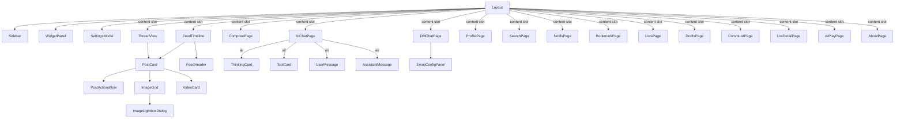

Now I have a thorough understanding of all 37+ component files. Let me write the updated page, keeping what's accurate and updating the areas that have changed.

```markdown
# PWA 核心组件详解

## 概览：37+ 组件的职责图谱

`packages/pwa/src/components/` 目录包含 **37 个组件文件**（含 `ai/` 子目录中的 4 个共享组件），覆盖从 Feed 信息流到私信聊天、从 AI 对话到个人资料编辑的全部 UI 层。这些组件遵循一套统一的模式：每个组件接收 `goTo: (v: AppView) => void` 作为导航回调，使用 `@bsky/app` 层导出的 hook 获取数据，再通过 `PostCard` + `PostActionsRow` 的组合渲染帖子。



---

## 一、Feed 与帖子：虚拟滚动 + 统一操作行

### FeedTimeline：基于 `@tanstack/react-virtual` 的虚拟列表

`FeedTimeline` 是所有帖子列表页面的核心容器。接口设计为**纯受控组件**——由父级传入 `posts` 数组和 `loadMore` 回调，自身只负责渲染和滚动管理。

**关键实现细节：**

- **虚拟滚动**：使用 `useVirtualizer` 创建虚拟列表，固定估计高度 `ESTIMATED_POST_HEIGHT = 120px`，overscan 5 项（[FeedTimeline.tsx#L55-L68](packages/pwa/src/components/FeedTimeline.tsx#L55-L68)）。每个虚拟项通过 `transform: translateY()` 定位，配合 `ref` 回调中调用 `virtualizer.measureElement(el)` 动态测量实际高度，并将结果存入模块级 `_heightCache` 映射（key 为 `post.uri`，[FeedTimeline.tsx#L46-L47](packages/pwa/src/components/FeedTimeline.tsx#L46-L47)）。
- **像素级滚动恢复**：通过 `initialScrollTop` 属性和 `initialOffset` 选项传递给 virtualizer 实例（[FeedTimeline.tsx#L67](packages/pwa/src/components/FeedTimeline.tsx#L67)）。
- **滚动位置上报**：使用 `requestAnimationFrame` + `scroll` 事件监听器向父级上报 `scrollTop`（[FeedTimeline.tsx#L76-L85](packages/pwa/src/components/FeedTimeline.tsx#L76-L85)）。
- **自动加载哨兵**：使用 `IntersectionObserver` 监听 `sentinelRef` 元素，当用户滚动到底部附近（`rootMargin: '200px'`）时触发 `loadMore()`（[FeedTimeline.tsx#L88-L97](packages/pwa/src/components/FeedTimeline.tsx#L88-L97)）。
- **骨架屏**：首次加载时显示 5 个 `SkeletonCard` 占位组件。

**使用的 hook：** `useI18n`、`useEffect`、`useRef`、`useCallback`、`useVirtualizer`

[来源](packages/pwa/src/components/FeedTimeline.tsx#L1-L195)

### PostCard：统一帖子卡片的双模式设计

`PostCard` 支持两种输入模式：传入 `post: PostView`（API 原始数据）或 `line: FlatLine`（扁平化线程数据），通过 TypeScript 联合类型 `PostCardWithPost | PostCardWithLine` 实现类型安全（[PostCard.tsx#L288-L298](packages/pwa/src/components/PostCard.tsx#L288-L298)）。

**嵌入媒体提取逻辑：**

- `extractEmbeds()` 处理 `app.bsky.embed.video`、`app.bsky.embed.images`、`app.bsky.embed.external`、`app.bsky.embed.recordWithMedia` 四种嵌入类型（[PostCard.tsx#L41-L95](packages/pwa/src/components/PostCard.tsx#L41-L95)）。
- `extractQuotedPost()` 从 API 解析后的顶层 `embed.record` 中提取引用帖，支持 `#view` 格式（[PostCard.tsx#L97-L146](packages/pwa/src/components/PostCard.tsx#L97-L146)）。
- `linkifyText()` 使用正则 `LINK_REGEX` 将正文中的 URL、@提及、`#话题` 转换为可点击链接（[PostCard.tsx#L156-L182](packages/pwa/src/components/PostCard.tsx#L156-L182)）。
- `getReplyDepth()` 检测回复深度，显示 `↩` 或 `↩2+` 角标（[PostCard.tsx#L34-L39](packages/pwa/src/components/PostCard.tsx#L34-L39)）。

**交互特性：**

- 头像点击导航到个人资料页（[PostCard.tsx#L379-L383](packages/pwa/src/components/PostCard.tsx#L379-L383)）
- `ImageGrid` 内嵌 ALT 标签气泡按钮和全屏 `ImageLightboxDialog`（Portal 渲染到 `document.body`，使用 **framer-motion** spring 动画过渡，[PostCard.tsx#L184-L278](packages/pwa/src/components/PostCard.tsx#L184-L278)）
- 视频嵌入委托给 `VideoCard` 组件，支持 HLS 流式播放
- `repostBy` prop 在个人资料页显示转发来源

**使用的 hook：** `useState`、`useRef`

[来源](packages/pwa/src/components/PostCard.tsx#L1-L463)

### PostActionsRow：统一操作行

**一行操作按钮**——回复、转发/引用（弹出菜单）、点赞、书签、AI 分析——在所有视图（Feed、Thread、Profile、Bookmark、ListDetail、Search）中复用。操作状态从模块级函数 `isPostLiked`/`isPostReposted` 读取，通过 `liked`/`reposted` props 支持覆盖（[PostActionsRow.tsx#L39-L42](packages/pwa/src/components/PostActionsRow.tsx#L39-L42)）。点赞和转发计数同样通过 `getLikeCount`/`getRepostCount` 模块函数获取。

**AI 分析入口**：根据 `isWidgetEnabled('aiChat')` 决定是打开侧边栏 Widget 还是跳转到独立 AI 聊天页面（[PostActionsRow.tsx#L8-L18](packages/pwa/src/components/PostActionsRow.tsx#L8-L18)）。

**使用的 hook：** `useState`

[来源](packages/pwa/src/components/PostActionsRow.tsx#L1-L83)

### VideoCard：HLS 流媒体播放器

`VideoCard` 在用户点击播放按钮后动态加载 `hls.js`（懒加载 `await import('hls.js')`），同时支持原生 HLS（Safari）。视频 `<video>` 元素始终存在于 DOM 中（通过 CSS `hidden` 控制显隐），以确保 `videoRef` 永不为 null。HLS 实例的创建和销毁通过 `useEffect` 的 cleanup 管理（[VideoCard.tsx#L64-L71](packages/pwa/src/components/VideoCard.tsx#L64-L71)）。失败时显示「Retry」按钮。通过 `aspectRatio` 属性维持视频宽高比（[VideoCard.tsx#L86-L92](packages/pwa/src/components/VideoCard.tsx#L86-L92)）。

**使用的 hook：** `useState`、`useRef`、`useCallback`、`useEffect`

[来源](packages/pwa/src/components/VideoCard.tsx#L1-L145)

### FeedHeader：Feed 切换 + 配置

`FeedHeader` 支持在下拉菜单中切换已订阅的 feed，并打开 `FeedConfigModal` 管理订阅列表（添加/删除/设置默认 feed）和浏览推荐 feed。推荐 feed 通过 `client.getSuggestedFeeds(20)` 获取（[FeedHeader.tsx#L101-L108](packages/pwa/src/components/FeedHeader.tsx#L101-L108)）。

[来源](packages/pwa/src/components/FeedHeader.tsx#L1-L230)

---

## 二、发帖系统：多帖线程 + 图片上传 + 草稿管理

### ComposePage：支持线程的多帖编辑器

`ComposePage` 是 PWA 中最复杂的页面之一，集成多帖线程编辑、图片/视频上传、引用预览、AI 润色模态框、草稿保存提示等能力。

**多帖线程模型：**

- 使用 `useCompose` hook 管理 `posts: ComposePostItem[]` 数组，每帖独立 `id`、`text` 和 `toDraftData` 序列化（[ComposePage.tsx#L73](packages/pwa/src/components/ComposePage.tsx#L73)）。
- 线程帖子之间以分隔线连接，非首帖可删除，支持最多 10 帖（[ComposePage.tsx#L565](packages/pwa/src/components/ComposePage.tsx#L565)）。
- 提交时逐帖上传媒体 blob，再整体调用 `submit(mediaMap)`。

**图片上传管线：**

1. 用户选择文件 → `handleFileSelect`（[ComposePage.tsx#L169-L222](packages/pwa/src/components/ComposePage.tsx#L169-L222)）
2. `compressImage()` 自动压缩图片（显示压缩前后大小对比，5 秒后自动消失）
3. 图片或视频二选一（不可混用），视频上限 100MB
4. 每张图片有独立的 ALT 文本输入框
5. ALT 缺失时通过 `window.confirm` 警告（[ComposePage.tsx#L330-L338](packages/pwa/src/components/ComposePage.tsx#L330-L338)）

**引用帖预览：** 通过 `replyTo`/`quoteUri` props 初始化，自动调用 `client.getPostThread()` 获取引用帖信息并渲染预览卡片（[ComposePage.tsx#L120-L141](packages/pwa/src/components/ComposePage.tsx#L120-L141)）。

**AI 润色集成：** 通过 `polishConfig` prop 启用润色按钮。点击打开 `WidgetModal` 以模态框形式调用 `PolishWidget`，支持多帖切换（[ComposePage.tsx#L356-L363](packages/pwa/src/components/ComposePage.tsx#L356-L363)）。

**草稿桥接：** 当前焦点帖子的文本通过 `setComposeDraftForWidgets` 暴露给 widget 系统，同时注册 `registerComposeDraftSetter` 让 Widget 可以回写文本（[ComposePage.tsx#L156-L167](packages/pwa/src/components/ComposePage.tsx#L156-L167)）。

**后退守卫：** 当有内容时，显示「保存草稿/丢弃」选择面板（[ComposePage.tsx#L254-L273](packages/pwa/src/components/ComposePage.tsx#L254-L273)）。

**使用的 hook：** `useCompose`、`useDrafts`、`useI18n`、`useState`、`useEffect`、`useCallback`、`useRef`

[来源](packages/pwa/src/components/ComposePage.tsx#L1-L594)

### DraftsPage：草稿列表与云同步

`DraftsPage` 展示 `useDrafts` hook 返回的 `AppDraft[]` 草稿列表，每项显示首帖预览、多帖标记、回复标记、本地/同步状态。交互特点：

- 点击草稿跳转到 `ComposePage` 并传入 `draftId`（[DraftsPage.tsx#L76](packages/pwa/src/components/DraftsPage.tsx#L76)）
- **二次确认删除**：首次点击「删除」按钮变为红色「确认」，再次点击或失焦取消（[DraftsPage.tsx#L126-L134](packages/pwa/src/components/DraftsPage.tsx#L126-L134)）
- 状态为 `local` 的草稿可执行 `syncDraft` 操作，上传到 AT Protocol 记录存储（[DraftsPage.tsx#L106-L119](packages/pwa/src/components/DraftsPage.tsx#L106-L119)）

**使用的 hook：** `useDrafts`、`useI18n`、`useState`

[来源](packages/pwa/src/components/DraftsPage.tsx#L1-L147)

---

## 三、AI 对话系统：流式渲染 + 工具调用可视化

### AIChatPage：全功能 AI 聊天界面

`AIChatPage` 是 [AI 对话引擎](ai-对话引擎.md)的前端实现，包含侧边栏历史管理、流式消息渲染、工具调用可视化、导入/导出、图片上传、写操作确认门等能力。

**消息分组与渲染管线：**

`useMemo` 将 `AIChatMessage[]` 消息流分组为 `thinking | tool | user | assistant` 四种类型。`tool_call` + `tool_result` 配对合并为单个 `ToolCard`（[AIChatPage.tsx#L53-L78](packages/pwa/src/components/AIChatPage.tsx#L53-L78)）。

**自动展开逻辑：** 在流式加载期间，最后一条 `thinking` 或 `tool` 组自动展开（`lastStreamGroupIndex` 计算），用户可点击切换展开/折叠（[AIChatPage.tsx#L81-L88](packages/pwa/src/components/AIChatPage.tsx#L81-L88)）。

**视觉视口适配：** 监听 `window.visualViewport.resize` 事件，在移动端键盘弹出时调整聊天区域高度（[AIChatPage.tsx#L99-L107](packages/pwa/src/components/AIChatPage.tsx#L99-L107)）。

**导入/导出：** 支持 JSON（`bsky-chat-v1` 格式）、HTML、Markdown 三种导出格式；JSON 导入时严格验证格式和消息结构，导入成功后自动创建新会话（[AIChatPage.tsx#L168-L268](packages/pwa/src/components/AIChatPage.tsx#L168-L268)）。

**写操作确认门：** 当 AI 发起写操作时，显示模态框 `pendingConfirmation`，用户确认后才执行（[AIChatPage.tsx#L488-L499](packages/pwa/src/components/AIChatPage.tsx#L488-L499)）。

**会话管理：** 侧边栏列出历史会话，支持重命名（内联编辑模态框）、删除、新建。当前会话高亮显示（[AIChatPage.tsx#L282-L315](packages/pwa/src/components/AIChatPage.tsx#L282-L315)）。

**/view 命令增强：** 输入以 `/view` 开头时，自动注入当前浏览上下文（帖子/用户），并在输入框上方显示预览卡片（[AIChatPage.tsx#L133-L139](packages/pwa/src/components/AIChatPage.tsx#L133-L139)）。

**引导问题：** 空对话时显示 `guidingQuestions` 按钮列表（[AIChatPage.tsx#L528-L547](packages/pwa/src/components/AIChatPage.tsx#L528-L547)）。

**使用的 hook：** `useAIChat`、`useChatHistory`、`useI18n`、`useMemo`、`useCallback`、`useEffect`、`useRef`、`useState`

[来源](packages/pwa/src/components/AIChatPage.tsx#L1-L691)

### ThinkingCard：思考过程折叠卡片

紫色大脑图标 + 首行摘要 + 可展开/折叠的思考内容。通过 CSS `max-h` 动画实现平滑展开/折叠（[ThinkingCard.tsx#L42-L49](packages/pwa/src/components/ai/ThinkingCard.tsx#L42-L49)）。`compact` 属性在 Widget 模式中缩小尺寸。

**使用的 hook：** `useI18n`

[来源](packages/pwa/src/components/ai/ThinkingCard.tsx#L1-L52)

### ToolCard：工具调用结果可视化

琥珀色扳手图标 + 工具名称标签 + 参数格式化 + 格式化结果摘要。核心逻辑委托给 `formatToolResult()` 函数（独立的 `formatToolResult.ts`），为每个工具名（约 38 个）编写特定的 JSON 解析和摘要生成逻辑。参数通过 JSON 解析后以 `key=value` 格式显示（[ToolCard.tsx#L20-L30](packages/pwa/src/components/ai/ToolCard.tsx#L20-L30)）。`compact` 属性在 Widget 模式中缩小尺寸。

**使用的 hook：** `useI18n`、`useMemo`

[来源](packages/pwa/src/components/ai/ToolCard.tsx#L1-L78)

### UserMessage / AssistantMessage：用户/AI 气泡

- **UserMessage**：蓝色气泡右对齐，支持编辑按钮（`onEdit` 回调修改已发送消息），通过 `loading` 属性控制编辑按钮可见性（[UserMessage.tsx#L12-L30](packages/pwa/src/components/ai/UserMessage.tsx#L12-L30)）
- **AssistantMessage**：灰色气泡左对齐，使用 `react-markdown` + `remark-gfm` 渲染 Markdown，支持复制按钮，`isError` 属性切换红色错误样式（[AssistantMessage.tsx#L13-L46](packages/pwa/src/components/ai/AssistantMessage.tsx#L13-L46)）

[来源](packages/pwa/src/components/ai/UserMessage.tsx#L1-L30) | [来源](packages/pwa/src/components/ai/AssistantMessage.tsx#L1-L46)

---

## 四、私信系统：轮询刷新 + Emoji 反应

### ConvoListPage：会话列表

从 `useConvoList` 获取 `ConvoView[]` 列表，显示每个会话的最新消息预览和未读计数。导航使用对方用户的 DID 作为 `conversationId`（[ConvoListPage.tsx#L33-L35](packages/pwa/src/components/ConvoListPage.tsx#L33-L35)）。

**轮询刷新：** 顶部刷新按钮触发 `refresh()`，刷新时按钮显示旋转动画。

**成员解析：** 从 `convo.members` 中过滤出非当前用户的对方成员，用于显示头像、名称和 handle。已静音会话显示铃声图标。

**使用的 hook：** `useConvoList`、`useI18n`、`useEffect`、`useState`

[来源](packages/pwa/src/components/ConvoListPage.tsx#L1-L160)

### DMChatPage：单聊对话

`DMChatPage` 是 PWA 中最精细化的聊天界面，完整实现了 [Direct Messages 私信系统](direct-messages-私信系统.md) 的前端。

**消息加载与刷新：**

- 首次加载调用 `loadConvo(conversationId, true)` 并标记已读（[DMChatPage.tsx#L35-L37](packages/pwa/src/components/DMChatPage.tsx#L35-L37)）
- `loadOlder()` 在用户滚动到顶部时触发，使用 `loadingOlderRef` 防止重复请求（`scrollTop < 60px` 阈值，[DMChatPage.tsx#L49-L57](packages/pwa/src/components/DMChatPage.tsx#L49-L57)）
- 底部自动滚动守卫：当用户靠近底部（`< 120px`）时自动跟随新消息（[DMChatPage.tsx#L39-L46](packages/pwa/src/components/DMChatPage.tsx#L39-L46)）

**Emoji 反应系统：**

- 每条消息下方的反应栏显示已添加的 emoji（按值分组，含计数）和「添加反应」按钮
- 点击弹出 `activeReactionMsgId` 对应的 emoji 选择器，从 `customEmojis`（localStorage 配置）渲染（[DMChatPage.tsx#L272-L305](packages/pwa/src/components/DMChatPage.tsx#L272-L305)）
- `EmojiConfigPanel` 全屏模态框：从 `fetchAllEmojis()` 获取所有可用 emoji，以 8 列网格展示，支持肤色变体选择（[DMChatPage.tsx#L370-L477](packages/pwa/src/components/DMChatPage.tsx#L370-L477)）

**引用回复：** 输入框中粘贴 AT URI 自动解析为引用预览（`parsePostUri` + `client.getRecord`），支持 handle 解析（[DMChatPage.tsx#L72-L97](packages/pwa/src/components/DMChatPage.tsx#L72-L97)）。

**消息操作：** 自己的消息 hover 显示删除按钮，会话可静音/取消静音（[DMChatPage.tsx#L173-L181](packages/pwa/src/components/DMChatPage.tsx#L173-L181)）。

**使用的 hook：** `useChatMessages`、`useI18n`、`useState`、`useEffect`、`useRef`、`useCallback`

[来源](packages/pwa/src/components/DMChatPage.tsx#L1-L478)

---

## 五、功能页面群像

### ThreadView：线程视图

`ThreadView` 使用 `useThread` hook 获取扁平化的 `FlatLine[]`，按 `depth` 分割为 `parentLines`（父链）、`focused`（当前帖）、`replyLines`（回复）。深度缩进通过 `style={{ marginLeft: Math.min((line.depth - 1) * 20, 60) }}` 实现（[ThreadView.tsx#L301](packages/pwa/src/components/ThreadView.tsx#L301)）。

**内联翻译：** 使用 `useTranslation` hook 翻译当前帖文本，结果显示在蓝色边框面板中，可切换回原文（[ThreadView.tsx#L88-L98](packages/pwa/src/components/ThreadView.tsx#L88-L98)）。

**内联关注：** 当前帖作者的头像旁有关注/取消关注按钮，通过 `setFocusedProfileActor` 共享关注状态（[ThreadView.tsx#L68-L75](packages/pwa/src/components/ThreadView.tsx#L68-L75)）。

**帖子信息模态框：** 点击信息图标弹出 `PostInfoModal`，展示 AT URI、CID、时间戳、统计数据、查看者视图、嵌入类型详情（[ThreadView.tsx#L324-L412](packages/pwa/src/components/ThreadView.tsx#L324-L412)）。

**丰富的媒体渲染：** 当前帖支持 `ImageGrid`、`VideoCard`、`externalLink` 卡片和引用帖完整渲染（[ThreadView.tsx#L216-L269](packages/pwa/src/components/ThreadView.tsx#L216-L269)）。

**使用的 hook：** `useThread`、`useBookmarks`、`useTranslation`、`useI18n`、`useMemo`、`useState`、`useCallback`、`useEffect`

[来源](packages/pwa/src/components/ThreadView.tsx#L1-L413)

### ProfilePage：个人资料页

`ProfilePage` 使用 `useProfile` hook 管理资料数据、标签页切换（Posts / Replies）、关注/取消关注、弹窗粉丝/关注列表。

**头像/横幅灯箱：** 使用 `ImageLightboxDialog` 全屏图片模态框渲染到 Portal，支持自然宽高比计算和 spring 动画过渡（[ProfilePage.tsx#L506-L521](packages/pwa/src/components/ProfilePage.tsx#L506-L521)）。

**内联翻译简介：** 使用 `useTranslation` 翻译 `profile.description`，结果显示为原文覆盖（[ProfilePage.tsx#L344-L357](packages/pwa/src/components/ProfilePage.tsx#L344-L357)）。

**资料编辑：** 点击编辑图标弹出 `EditProfileModal`，支持修改 displayName、description，上传头像/横幅图片。

**快速操作：** 互关用户间可发送 DM（`getConvoForMembers`），查看对方列表，AI 分析资料（[ProfilePage.tsx#L278-L312](packages/pwa/src/components/ProfilePage.tsx#L278-L312)）。

**关注列表全屏视图：** 点击粉丝/关注计数切换为全屏列表视图，支持虚拟滚动和 `IntersectionObserver` 哨兵加载更多（[ProfilePage.tsx#L129-L201](packages/pwa/src/components/ProfilePage.tsx#L129-L201)）。

**虚拟滚动：** 帖子列表使用 `useVirtualizedList` hook，`IntersectionObserver` 哨兵触发 `loadMoreFeed`（[ProfilePage.tsx#L71-L88](packages/pwa/src/components/ProfilePage.tsx#L71-L88)）。

**使用的 hook：** `useProfile`、`useTranslation`、`useI18n`、`useVirtualizedList`、`useState`、`useEffect`、`useRef`

[来源](packages/pwa/src/components/ProfilePage.tsx#L1-L529)

### SearchPage：四标签搜索

`SearchPage` 使用 `useSearch` hook 管理 Top / Latest / Users / Feeds 四个标签页的搜索结果。支持搜索历史（`useSearchHistory`）和输入框聚焦时显示历史下拉菜单（[SearchPage.tsx#L114-L138](packages/pwa/src/components/SearchPage.tsx#L114-L138)）。

**Feed 订阅：** 在 Feeds 标签页可直接订阅搜索结果中的 Feed Generator（[SearchPage.tsx#L188-L191](packages/pwa/src/components/SearchPage.tsx#L188-L191)）。

**虚拟滚动：** 使用 `useVirtualizedList` hook，根据标签页动态设置项高度（posts 120px / users 60px）（[SearchPage.tsx#L44-L49](packages/pwa/src/components/SearchPage.tsx#L44-L49)）。

**URL 同步：** 搜索输入和标签页切换时更新 URL，支持返回恢复搜索状态。

**使用的 hook：** `useSearch`、`useI18n`、`useSearchHistory`、`useVirtualizedList`、`useState`、`useEffect`

[来源](packages/pwa/src/components/SearchPage.tsx#L1-L212)

### NotifsPage：通知列表

`NotifsPage` 使用 `useNotifications` 获取通知列表，使用 `useVirtualizedList` 实现虚拟滚动（[NotifsPage.tsx#L99-L101](packages/pwa/src/components/NotifsPage.tsx#L99-L101)）。每项显示 emoji 图标（根据 reason 映射）、作者头像、时间。未读通知右侧有蓝色圆点标记。点击通知跳转到对应帖子或资料页。

**使用的 hook：** `useNotifications`、`useI18n`、`useVirtualizedList`

[来源](packages/pwa/src/components/NotifsPage.tsx#L1-L163)

### BookmarkPage：书签管理

`BookmarkPage` 使用 `useBookmarks` hook 获取收藏帖子列表，基于 `useVirtualizedList` 虚拟滚动（[BookmarkPage.tsx#L20-L22](packages/pwa/src/components/BookmarkPage.tsx#L20-L22)）。每帖右上角有 X 按钮可移除书签。顶部有刷新按钮。

**使用的 hook：** `useBookmarks`、`useI18n`、`useVirtualizedList`

[来源](packages/pwa/src/components/BookmarkPage.tsx#L1-L101)

### ListsPage / ListDetailPage：列表管理

**ListsPage** 使用 `useLists` hook 管理用户列表（Curated / Moderation 两种类型）。支持创建列表（带名称/描述/类型选择）、删除（通过 `Modal` 二次确认）、查看他人列表时弹出「添加到我的列表」面板（`getListsWithMembership` API）。支持虚拟滚动（[ListsPage.tsx#L322](packages/pwa/src/components/ListsPage.tsx#L322)）。

**ListDetailPage** 使用 `useListDetail` hook 管理单个列表详情，Posts / Members 双标签页，各使用独立的 `useVirtualizedList` 实例（[ListDetailPage.tsx#L37-L47](packages/pwa/src/components/ListDetailPage.tsx#L37-L47)）。支持内联编辑名称和描述（`updateListInfo`）、静音/取消静音列表、删除成员、删除列表。

**使用的 hook：** `useLists`、`useListDetail`、`useI18n`、`useVirtualizedList`、`useState`、`useRef`、`useEffect`、`useCallback`

[来源](packages/pwa/src/components/ListsPage.tsx#L1-L325) | [来源](packages/pwa/src/components/ListDetailPage.tsx#L1-L330)

---

## 共享基础设施

### Layout / Sidebar：应用骨架

`Layout` 组件提供三层结构：顶部 Header（含返回按钮、主题切换、设置入口、登录状态指示灯、关于页面入口）、左侧 Sidebar（导航标签，含未读计数角标）、右侧 WidgetPanel（可开启/关闭/拖拽排序的 Widget 面板）。Layout 管理 Widget 状态的持久化：初始化时从 `config.enabledWidgets` 恢复，通过 `setWidgetToggleCallback` 注册切换回调自动写入 `localStorage`（[Layout.tsx#L91-L98](packages/pwa/src/components/Layout.tsx#L91-L98)）。当进入 `aiChat` 视图时自动禁用 AI Widget 以避免重复渲染，退出时恢复（[Layout.tsx#L102-L115](packages/pwa/src/components/Layout.tsx#L102-L115)）。移动端侧边栏使用 **framer-motion** `AnimatePresence` + `motion.div` 实现弹簧动画滑出。

**Sidebar** 定义了 10 个导航标签（Feed / Notifications / DM / Search / Bookmarks / Lists / Profile / AI Chat / Compose / AT Play）加一个 Components 调试页面入口，各带独立图标和未读计数（通知/草稿/DM）。当前活跃标签通过蓝色左边框和背景色高亮（[Sidebar.tsx#L50-L54](packages/pwa/src/components/Sidebar.tsx#L50-L54)）。

[来源](packages/pwa/src/components/Layout.tsx#L1-L304) | [来源](packages/pwa/src/components/Sidebar.tsx#L1-L92)

### WidgetPanel：右侧 Widget 渲染容器

`WidgetPanel` 根据 `viewType` 获取可用 widget 列表，只渲染已启用的 widget。每个 widget 渲染在统一卡片容器中，带标题栏（图标 + 标题 + 上下箭头 + 关闭按钮），通过 `widgetMap` 保持 `enabledIds` 顺序（[WidgetPanel.tsx#L20-L23](packages/pwa/src/components/WidgetPanel.tsx#L20-L23)）。

[来源](packages/pwa/src/components/WidgetPanel.tsx#L1-L87)

### Icon：内联 SVG 图标系统

`Icon` 组件利用 Vite 的 `import.meta.glob` 批量加载 `src/icons/*.svg` 为原始字符串，运行时根据 `name` 查找对应 SVG 并注入尺寸和 `fill` 样式。通过 `injectSize()` 替换 SVG 中的 `width/height="24"` 为目标尺寸（[Icon.tsx#L28-L33](packages/pwa/src/components/Icon.tsx#L28-L33)）。所有图标名在 `ICON_NAMES` 常量中可用。

[来源](packages/pwa/src/components/Icon.tsx#L1-L58)

### ImageLightboxDialog：全屏图片灯箱

使用 **framer-motion** 的 `motion.div` 实现从原始图片位置到全屏的 spring 动画过渡。支持键盘导航（Esc 关闭、左右箭头切换）、ALT 文字显示、多图片计数指示器。通过 `createPortal` 渲染到 `document.body`（[ImageLightboxDialog.tsx#L94-L181](packages/pwa/src/components/ImageLightboxDialog.tsx#L94-L181)）。

[来源](packages/pwa/src/components/ImageLightboxDialog.tsx#L1-L182)

### Modal：通用模态框

`Modal` 组件使用 `createPortal` 渲染，提供背景遮罩、点击外部关闭、键盘 Esc 关闭等功能。`ListDetailPage`、`ListsPage`、`ThreadView` 等组件均复用此组件。

### EditProfileModal：资料编辑模态框

支持修改 displayName、description，上传头像/横幅图片（先上传 blob 再调用 `client.putProfile`）。

### SettingsModal：设置面板

从 `Layout` 进入，集成 `onRelogin`、`onConfigChange`、`onLogout` 等配置操作。

### WelcomeCard：首次运行向导

显示 AI 提供商配置指南（DeepSeek、Mistral、自定义），隐私说明和无需 AI 即可使用的功能提示。

### AboutPage：关于页面

展示应用版本、commit hash、构建时间、仓库链接、Demo 链接，集成 **PWA 更新检查**（`checkForPwaUpdate()`，监听 `pwa-update-available` 事件，[AboutPage.tsx#L31-L43](packages/pwa/src/components/AboutPage.tsx#L31-L43)）。

---

## 推荐阅读

- [虚拟滚动与滚动恢复](虚拟滚动与滚动恢复.md) — `@tanstack/react-virtual` 的像素值恢复策略详解
- [React Hooks 体系](react-hooks-体系.md) — `useCompose`、`useThread`、`useAIChat` 等所有数据 hook 的完整签名
- [Widget 组件系统](widget-组件系统.md) — 组件注册表、启用/关闭状态管理与 ComposePage 桥接
- [Store 订阅模式](store-订阅模式.md) — 纯对象 Store + React Hook 桥接的单监听器模式
- [PWA 设计系统](pwa-设计系统.md) — 色彩语义、排版层级、布局网格与组件变体规范
```