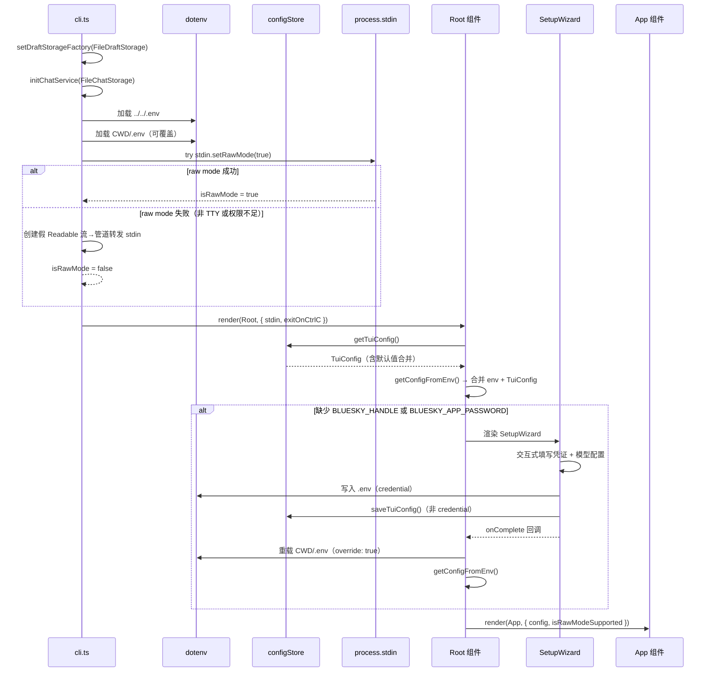

以下是基于 `packages/tui/src/cli.ts` 及协作者逐行解析生成的完整文档。

---

# TUI 入口与配置加载

## 启动管线总览

TUI 的启动流程是一条从模块初始化到 Ink 渲染的线性管线。这条管线由 `packages/tui/src/cli.ts` 驱动，在 `tsx src/cli.ts` 或执行编译后的入口文件时触发。整个过程可按顺序划分为 5 个阶段：



[来源](packages/tui/src/cli.ts#L1-L154)

---

## 1. 模块级副作用：存储初始化

在解析任何配置之前，`cli.ts` 首先执行两个模块级别的初始化调用：

```typescript
setDraftStorageFactory(() => new FileDraftStorage());
initChatService(new FileChatStorage());
```

- **`setDraftStorageFactory`** 注册草稿存储工厂函数，后续 `useDrafts` hook 通过该工厂创建 `FileDraftStorage` 实例，将草稿以文件形式持久化。
- **`initChatService`** 初始化聊天服务层，传入 `FileChatStorage` 实现，将 AI 对话历史保存到本地文件系统。

这两个调用位于文件顶部（import 之后、其他逻辑之前），确保在组件树渲染之前存储层已就绪。该设计遵循「依赖先于业务」的初始化策略。

[来源](packages/tui/src/cli.ts#L15-L18)

---

## 2. Dotenv 多路径加载

```typescript
const envPaths = [
  path.resolve(__dirname, '..', '..', '..', '.env'),   // 路径 A: monorepo 根
  path.resolve(process.cwd(), '.env'),                  // 路径 B: CWD
];
for (const envPath of envPaths) {
  dotenv.config({ path: envPath });
}
```

加载顺序为**先 monorepo 根、后 CWD**。`dotenv.config()` 的默认行为是**不覆盖已存在的环境变量**，因此：

- 如果两文件定义了相同的变量，**先加载的 monorepo 根 `.env` 优先**。
- CWD 的 `.env` 仅在 monorepo 根 `.env` **未定义**某变量时才生效。

这一策略与配置文件的搜索顺序（见下节）保持一致——都优先在 monorepo 根目录查找，再回退到 CWD。

`__dirname` 的计算使用了 `fileURLToPath(import.meta.url)`，适配 ESM 模块规范。

[来源](packages/tui/src/cli.ts#L20-L29)

---

## 3. 配置文件合并策略：bsky-tui.config.json

### 3.1 文件搜索路径

`configStore.ts` 中的 `resolveConfigPath()` 遵循与 `.env` 相同的搜索顺序：

```typescript
function resolveConfigPath(): string {
  const monoRoot = path.resolve(__dirname, '..', '..', '..', '..', CONFIG_FILENAME);
  if (existsSync(monoRoot)) return monoRoot;
  const cwd = path.resolve(process.cwd(), CONFIG_FILENAME);
  if (existsSync(cwd)) return cwd;
  return cwd; // 写入时默认用 CWD
}
```

注意：由于 `configStore.ts` 位于 `packages/tui/src/config/`（比 `cli.ts` 深一层），其 `__dirname` 回退到 monorepo 根需要多跳一级 `..`。

[来源](packages/tui/src/config/configStore.ts#L52-L60)

### 3.2 深合并与默认值

`getTuiConfig()` 执行**深合并**，而非简单的浅合并：

```typescript
const merged: TuiConfig = {
  ...defaults,
  ...parsed,
  aiConfig: { ...defaults.aiConfig, ...(parsed.aiConfig || {}) },
  scenarioModels: { ...defaults.scenarioModels, ...(parsed.scenarioModels || {}) },
  apiKeys: { ...defaults.apiKeys, ...(parsed.apiKeys || {}) },
};
```

**默认值 (`DEFAULT_TUI_CONFIG`)** 定义如下：

| 字段 | 默认值 |
|------|--------|
| `targetLang` | `'zh'` |
| `translateMode` | `'simple'` |
| `aiConfig.baseUrl` | `'https://api.deepseek.com'` |
| `aiConfig.model` | `'deepseek-v4-flash'` |
| `aiConfig.provider` | `'deepseek'` |
| `aiConfig.reasoningStyle` | `'reasoning_content'` |
| `aiConfig.thinkingEnabled` | `true` |
| `aiConfig.visionEnabled` | `false` |
| `apiKeys` | `{}` |
| `scenarioModels` | `{ aiChat: '', translate: '', polish: '' }` |

深合并的规则是：
- 顶层字段：parsed 覆盖 defaults。
- `aiConfig`、`scenarioModels`、`apiKeys` 三个子对象：分别独立合并，parsed 中存在的键覆盖 defaults。
- 文件不存在或解析失败时，返回 `DEFAULT_TUI_CONFIG` 的深拷贝。

`TuiConfig` 接口还支持 `dmEmojis?: string[]`（DM 反应表情）和 `aiConfig.customSystemPrompt?: string` 等可选高级字段，但默认均为 `undefined`。

[来源](packages/tui/src/config/configStore.ts#L33-L80)

---

## 4. Raw Mode 检测与降级

TUI 使用 Ink 作为 React 终端渲染框架，Ink 依赖 TTY 的 raw mode 来拦截键盘事件。`cli.ts` 在渲染之前执行 raw mode 检测：

```typescript
let isRawMode = false;
try {
  const stdin = process.stdin as ReadStream;
  if (stdin.isTTY) {
    stdin.setRawMode(true);
    isRawMode = true;
  }
} catch {}
```

**成功路径**：`stdin.isTTY` 为 true 且 `setRawMode` 无异常 → `isRawMode = true` → 直接使用 `process.stdin` 作为 Ink 输入流。

**降级路径**：当运行在非 TTY 环境（如管道、重定向、某些 CI）或 `setRawMode` 抛出异常时：

```typescript
const rs = new Readable({ read() {} });
(rs as any).isTTY = true;
(rs as any).setRawMode = () => rs;
inputStream = rs as ReadStream;
process.stdin.on('data', (c) => { rs.push(c); });
```

降级流通过**管道转发**真实 `stdin` 的数据到伪造的 Readable 流，同时提供假的 `isTTY` 和 `setRawMode` 属性，以欺骗 Ink 的 TTY 检测逻辑。

判断结果 `isRawMode` 作为 prop 传递给 `Root` 组件，并最终传递给 `App` 组件，供需要区分 TTY 能力的特性（如鼠标支持）使用。

[来源](packages/tui/src/cli.ts#L120-L145)

---

## 5. Root 组件与 AppConfig 构建

### 5.1 getConfigFromEnv 函数

`getConfigFromEnv()` 是配置合并的核心逻辑，其输入源有两个：

1. **环境变量**（来自 `.env` 文件或进程环境）：
   - `BLUESKY_HANDLE`（必需，缺则返回 null）
   - `BLUESKY_APP_PASSWORD`（必需，缺则返回 null）
   - `BLUESKY_PDS`（可选）
   - `LLM_API_KEY`（可选，优先级最高）

2. **配置文件**（来自 `bsky-tui.config.json`）：通过 `getTuiConfig()` 加载

**API Key 解析优先级**：

```typescript
function resolveAiApiKey(tuiConfig: TuiConfig, providerId: string | undefined): string {
  const envKey = process.env.LLM_API_KEY;        // 1st: 环境变量
  if (envKey) return envKey;
  if (providerId && tuiConfig.apiKeys[providerId]) return tuiConfig.apiKeys[providerId]!; // 2nd: 配置文件
  return '';                                     // 3rd: 空字符串
}
```

**最终 AppConfig 结构**：

| AppConfig 字段 | 来源 |
|----------------|------|
| `blueskyHandle` | 环境变量 `BLUESKY_HANDLE` |
| `blueskyPassword` | 环境变量 `BLUESKY_APP_PASSWORD` |
| `blueskyPds` | 环境变量 `BLUESKY_PDS`（可选） |
| `aiConfig.apiKey` | `resolveAiApiKey()` 返回值 |
| `aiConfig.baseUrl` | `tuiConfig.aiConfig.baseUrl` |
| `aiConfig.model` | `tuiConfig.aiConfig.model` |
| `aiConfig.thinkingEnabled` | `tuiConfig.aiConfig.thinkingEnabled ?? true` |
| `aiConfig.visionEnabled` | `tuiConfig.aiConfig.visionEnabled ?? false` |
| `aiConfig.provider` | `tuiConfig.aiConfig.provider` |
| `aiConfig.reasoningStyle` | `tuiConfig.aiConfig.reasoningStyle` |
| `targetLang` | `tuiConfig.targetLang` |
| `translateMode` | `tuiConfig.translateMode` |
| `apiKeys` | `tuiConfig.apiKeys`（完整 Record） |
| `scenarioModels` | `tuiConfig.scenarioModels` |

[来源](packages/tui/src/cli.ts#L56-L94)

### 5.2 Root 组件逻辑：配置存在性检查

```typescript
function Root({ isRawModeSupported }: { isRawModeSupported: boolean }) {
  const [appConfig, setAppConfig] = React.useState<AppConfig | null>(getConfigFromEnv);

  if (!appConfig) {
    return React.createElement(SetupWizard, {
      onComplete: (config) => { /* ... */ },
    });
  }

  return React.createElement(App, { config: appConfig, isRawModeSupported });
}
```

`useState` 的初始值由 `getConfigFromEnv` 惰性求值获得。该函数返回 `null` 的充分必要条件是**环境变量中缺少 `BLUESKY_HANDLE` 或 `BLUESKY_APP_PASSWORD` 之一**——即使 AI 配置完全缺失，只要 Bluesky 凭证存在，应用也会启动（AI 功能在缺失配置时会优雅降级）。

[来源](packages/tui/src/cli.ts#L96-L117)

---

## 6. SetupWizard 首次运行引导

当 `getConfigFromEnv()` 返回 `null` 时，触发 SetupWizard 交互式设置程序。

### 6.1 步骤序列

SetupWizard 使用有限状态机（`Step` 联合类型）控制流程，共 9 步：

```
handle → password → pds → provider → model → apikey → locale → scenario → done
```

| 步骤 | 交互方式 | 输入内容 |
|------|----------|----------|
| `handle` | TextInput | Bluesky 用户名（如 `user.bsky.social`） |
| `password` | TextInput（密码） | App Password |
| `pds` | TextInput（可选） | 自定义 PDS URL，留空使用 bsky.social |
| `provider` | 方向键选择 | LLM 提供商（当前支持 DeepSeek / Mistral） |
| `model` | 方向键选择 / 自定义输入 | 模型 ID，含能力标注（💭思考 👁视觉） |
| `apikey` | TextInput（密码） | 所选提供商的 API Key |
| `locale` | 方向键选择 | 界面语言（zh / en / ja） |
| `scenario` | 方向键+Enter 切换 | 按场景分配不同模型（可选） |
| `done` | Enter 确认 | 显示总结信息 |

[来源](packages/tui/src/components/SetupWizard.tsx#L30-L30)

### 6.2 完成回调：写入与重载

`handleDone()` 函数执行两个写入操作：

1. **写入 `.env`**（凭证信息）：
   ```typescript
   const lines = [
     `BLUESKY_HANDLE=${handle}`,
     `BLUESKY_APP_PASSWORD=${password}`,
   ];
   if (pdsUrl) lines.push(`BLUESKY_PDS=${pdsUrl}`);
   writeFileSync(envPath, lines.join('\n') + '\n', 'utf-8');
   ```

2. **写入 `bsky-tui.config.json`**（非凭证信息）：
   ```typescript
   const tuiConfig: TuiConfig = {
     targetLang, translateMode,
     aiConfig: { baseUrl, model, provider, reasoningStyle, thinkingEnabled, visionEnabled },
     apiKeys: { [selectedProvider.id]: apiKey },
     scenarioModels,
   };
   saveTuiConfig(tuiConfig);
   ```

注意：API Key 被**同时写入两个位置**：`.env` 和 `config.json` 的 `apiKeys`。设计上的考虑是 `.env` 中的 `LLM_API_KEY` 优先级更高，以支持单提供商快速配置；`apiKeys` 则支持多提供商场景。

`onComplete` 回调中，Root 组件**重新加载 `.env`（`override: true`）并重新调用 `getConfigFromEnv()`**，以确保新写入的配置立即生效，无需重启进程。

[来源](packages/tui/src/components/SetupWizard.tsx#L64-L106)

### 6.3 提供商模型注册表

提供商列表来自 `@bsky/core` 的 `PROVIDERS` 数组，通过 `providers.json` JSON 文件定义。当前注册为：

| 提供商 | 基础 URL | 模型数 | reasoningStyle |
|--------|----------|--------|----------------|
| DeepSeek | `https://api.deepseek.com` | 2 | `reasoning_content` |
| Mistral | `https://api.mistral.ai` | 4 | `structured_content` |

每个模型标注了 `thinking`（是否支持思考）和 `vision`（是否支持视觉识别）能力，SetupWizard 在选择界面中以 💭 和 👁 图标可视化展示。

[来源](packages/core/src/ai/providers.json#L1-L24)

---

## 7. 场景模型分配（Scenario Models）

`AppConfig` 中的 `scenarioModels` 字段支持**按场景分配不同的模型/提供商**。该机制在 `App.tsx` 中通过 `resolveScenarioConfig()` 函数解析：

```typescript
const resolveScenarioConfig = useCallback((scenarioModel: string): AIConfig => {
  if (!scenarioModel || !scenarioModel.includes('/')) {
    return { ...config.aiConfig };  // 无覆盖，使用默认配置
  }
  const [providerId, model] = scenarioModel.split('/');
  const provider = getProviderById(providerId);
  const modelInfo = provider ? getModelInfo(providerId, model) : undefined;
  return {
    ...config.aiConfig,
    baseUrl: provider?.baseUrl || config.aiConfig.baseUrl,
    model,
    apiKey: config.apiKeys?.[providerId] || config.aiConfig.apiKey,
    provider: provider?.id,
    reasoningStyle: provider?.reasoningStyle,
    thinkingEnabled: modelInfo?.thinking ?? config.aiConfig.thinkingEnabled ?? true,
    visionEnabled: modelInfo?.vision ?? config.aiConfig.visionEnabled ?? false,
  };
}, [config]);
```

场景模型以 `"providerId/modelId"` 格式存储。空字符串表示使用默认 AI 配置。三个预定义场景为：
- **`aiChat`**：AI 对话
- **`translate`**：翻译
- **`polish`**：润色

这种设计允许用户为不同任务分配不同模型（如翻译用 Mistral、AI 聊天用 DeepSeek Pro），而不需要在切换场景时手动修改配置。

[来源](packages/tui/src/components/App.tsx#L129-L147)

---

## 8. 场景配置交互：SettingsView

与 SetupWizard 的一次性引导不同，运行时配置调整通过 `SettingsView` 完成。`SettingsView` 同样使用 `TuiConfig` 结构，通过 `getTuiConfig()` / `updateTuiConfig()` 读写配置，修改后**实时更新** `App.tsx` 的状态：

其核心交互路径为：
1. 用户按 `,` 键打开设置面板
2. 调整语言、提供商、模型等配置
3. 保存时调用 `updateTuiConfig(partial)` 写入 config.json
4. 回调通过 `config.aiConfig` / `config.targetLang` 等 prop 变更触发 React 重渲染

[来源](packages/tui/src/components/App.tsx#L293-L293)

---

## 9. 配置优先级总结

| 优先级 | 来源 | 示例 | 说明 |
|--------|------|------|------|
| 1（最高） | 进程环境变量 | `LLM_API_KEY` | 运行时注入，优先级最高 |
| 2 | `.env` 文件 | `BLUESKY_HANDLE` | 多路径加载，monorepo 根优先 |
| 3 | `bsky-tui.config.json` | `aiConfig.model` | 非凭证配置，深合并默认值 |
| 4（最低） | 代码内默认值 | `DEFAULT_TUI_CONFIG` | 仅当以上均缺失时生效 |

对于 API Key 的解析，还有一层内部优先级：`LLM_API_KEY` 环境变量 > `apiKeys[providerId]` 配置字段。

---

## 下一步

- 了解 TUI 的视图组件体系：[TUI 视图组件架构](tui-视图组件架构.md)
- 深入 AI 配置的应用层：[AI 对话引擎](ai-对话引擎.md)
- 查看完整的环境变量参考：[环境配置详解](环境配置详解.md)