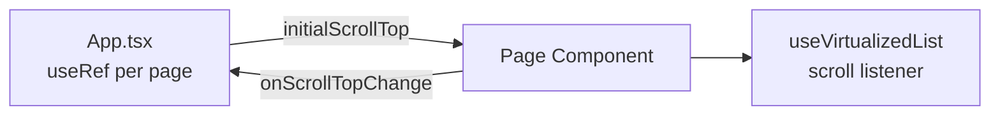

Now I have all the information. Let me write the updated page.

---

# 虚拟滚动与滚动恢复

> 2026-05-10 · 本文档覆盖 PWA 端虚拟滚动实现规范、像素级滚动恢复策略，以及两个自动滚动守卫的实现。

## 虚拟滚动

### 技术选型

PWA 使用 `@tanstack/react-virtual`（`useVirtualizer`）。TUI 使用 Ink 内置渲染，不需要虚拟滚动。[来源](packages/app/src/hooks/useVirtualizedList.ts#L1-L2)

### 实现模式

项目中有两种使用 `useVirtualizer` 的方式：

**模式 A：FeedTimeline 独立使用（原始模式）**

FeedTimeline 是第一个适配虚拟滚动的组件，直接导入 `useVirtualizer`，管理自己的 `_heightCache`（模块级 Map）和 scroll ref：

```tsx
import { useVirtualizer } from '@tanstack/react-virtual';

const ESTIMATED_POST_HEIGHT = 120;
const _heightCache = new Map<string, number>();

// container ref
const scrollRef = useRef<HTMLDivElement>(null);

// virtualizer
const virtualizer = useVirtualizer({
  count: loading && posts.length === 0 ? 5 : posts.length,
  getScrollElement: () => scrollRef.current,
  estimateSize: (index) => {
    const post = posts[index];
    if (post) {
      const cached = _heightCache.get(post.uri);
      if (cached) return cached;
    }
    return ESTIMATED_POST_HEIGHT;
  },
  overscan: 5,
  initialOffset: (initialScrollTop ?? 0) > 0 ? initialScrollTop : 0,
});

// 渲染：绝对定位
<div ref={scrollRef} className="flex-1 overflow-y-auto">
  <div style={{ height: `${virtualizer.getTotalSize()}px`, position: 'relative', width: '100%' }}>
    {virtualizer.getVirtualItems().map((vi) => {
      const post = posts[vi.index];
      return (
        <div
          key={post.uri}
          data-index={vi.index}
          ref={(el) => {
            if (el) {
              virtualizer.measureElement(el);
              const h = el.getBoundingClientRect().height;
              if (h > 0) _heightCache.set(post.uri, h);
            }
          }}
          style={{
            position: 'absolute', top: 0, left: 0, width: '100%',
            transform: `translateY(${vi.start}px)`,
          }}
        >
          <PostCard post={post} ... />
        </div>
      );
    })}
  </div>
</div>
```

[来源](packages/pwa/src/components/FeedTimeline.tsx#L46-L168)

**模式 B：useVirtualizedList hook（统一封装）**

其余 7 个页面通过 `useVirtualizedList` hook 统一使用虚拟滚动，消除模板代码重复：

```tsx
import { useVirtualizedList } from '@bsky/app';

const { scrollRef, virtualizer, measureAndCache } = useVirtualizedList(
  items,           // 数据数组
  'page-cache-key', // 高度缓存 key
  120,             // 估算高度（px）
  item => item.uri, // 每个 item 的高度缓存 key
  { initialScrollTop, onScrollTopChange }, // 滚动恢复
);

// JSX:
<div ref={scrollRef} className="flex-1 overflow-y-auto">
  <div style={{ height: virtualizer.getTotalSize(), position: 'relative', width: '100%' }}>
    {virtualizer.getVirtualItems().map((vi) => {
      const item = items[vi.index];
      return (
        <div
          key={item.uri}
          data-index={vi.index}
          ref={(el) => measureAndCache(el, item)}
          style={{
            position: 'absolute', top: 0, left: 0,
            transform: `translateY(${vi.start}px)`, width: '100%',
          }}
        >
          {renderItem(item)}
        </div>
      );
    })}
  </div>
</div>
```

[来源](packages/app/src/hooks/useVirtualizedList.ts#L6-L68)

`useVirtualizedList` 内部结构：

- **模块级高度缓存** `_globalHeightCaches`（`Map<string, Map<string, number>>`）跨 mount 持久
- **scrollTop 通过 `options.initialScrollTop` / `options.onScrollTopChange` 传入传出**，完全复制 FeedTimeline 模式
- **`estimateSize`** 优先使用高度缓存中的实测值，fallback 到传入的 `estimateHeight`
- **scroll listener** 通过 `onScrollTopChange` 回调实时上报（deps 含 `items.length`，确保延迟出现的容器也能挂上 listener）
- **`measureAndCache`** 测量实际高度 → 写入 `_globalHeightCaches` + 调用 `virtualizer.measureElement`
- **`initialOffset`** 仅在 `initialScrollTop > 0` 时设置，避免零值覆盖

[来源](packages/app/src/hooks/useVirtualizedList.ts#L4-L68)

### 页面适配状态

| 页面 | 虚拟滚动 | 实现方式 | 状态 |
|------|---------|---------|------|
| FeedTimeline | ✅ | 独立 `useVirtualizer` + `_heightCache` | ✅ (保持独立 pattern) |
| ProfilePage | ✅ | `useVirtualizedList` | ✅ v0.10.6 |
| BookmarkPage | ✅ | `useVirtualizedList` | ✅ v0.10.6 |
| ListsPage | ✅ | `useVirtualizedList` | ✅ v0.10.6 |
| ListDetailPage | ✅ | `useVirtualizedList` x2（posts + members） | ✅ v0.10.6 |
| NotifsPage | ✅ | `useVirtualizedList` | ✅ v0.10.6 |
| SearchPage | ✅ | `useVirtualizedList` | ✅ v0.10.6 |
| DMChatPage | ⬜ | — | 纯文本，非均匀高度 |
| DraftsPage | ⬜ | — | 条目太少，无需优化 |
| ConvoListPage | ⬜ | — | 条目轻量，无需优化 |

[来源](packages/pwa/src/components/FeedTimeline.tsx#L49-L168) · [来源](packages/pwa/src/components/BookmarkPage.tsx#L20-L22) · [来源](packages/pwa/src/components/ListsPage.tsx#L20-L22) · [来源](packages/pwa/src/components/NotifsPage.tsx#L99-L101) · [来源](packages/pwa/src/components/ProfilePage.tsx#L71-L73) · [来源](packages/pwa/src/components/SearchPage.tsx#L47-L49) · [来源](packages/pwa/src/components/ListDetailPage.tsx#L38-L48)

---

## 滚动位置恢复

### 架构：FeedTimeline 路径

所有虚拟滚动页面统一使用 FeedTimeline 路径：**App.tsx 持有 `useRef` → props `initialScrollTop`/`onScrollTopChange` 透传 → 页面组件实时上报**。



**App.tsx** — 每页一个 `useRef` + props 透传：

```tsx
const feedScrollTopRef = useRef(0);
const profileScrollTopRef = useRef(0);
const bookmarksScrollTopRef = useRef(0);
const listsScrollTopRef = useRef(0);
const listDetailFeedScrollTopRef = useRef(0);
const listDetailMemberScrollTopRef = useRef(0);
const notifsScrollTopRef = useRef(0);
const searchScrollTopRef = useRef(0);

// 透传示例：
<BookmarkPage
  initialScrollTop={bookmarksScrollTopRef.current}
  onScrollTopChange={(top) => { bookmarksScrollTopRef.current = top; }}
/>
```

[来源](packages/pwa/src/App.tsx#L70-L77) · [来源](packages/pwa/src/App.tsx#L372-L378)

**页面组件** — 透传给 `useVirtualizedList`：

```tsx
interface PageProps {
  initialScrollTop?: number;
  onScrollTopChange?: (top: number) => void;
}
```

[来源](packages/pwa/src/components/BookmarkPage.tsx#L9-L15) · [来源](packages/pwa/src/components/ListsPage.tsx#L8-L15)

**FeedTimeline** — 直接在内部管理 scroll listener，不使用 `useVirtualizedList`：

```tsx
const reportScrollTop = useCallback(() => {
  if (!onScrollTopChange || !scrollRef.current) return;
  onScrollTopChange(scrollRef.current.scrollTop);
}, [onScrollTopChange]);

useEffect(() => {
  const el = scrollRef.current;
  if (!el) return;
  el.addEventListener('scroll', reportScrollTop, { passive: true });
  const raf = requestAnimationFrame(reportScrollTop);
  return () => {
    el.removeEventListener('scroll', reportScrollTop);
    cancelAnimationFrame(raf);
  };
}, [reportScrollTop]);
```

[来源](packages/pwa/src/components/FeedTimeline.tsx#L70-L85)

### 调用 `items.length` deps 的原因

`useEffect` deps 包含 `items.length`。当容器因 loading 状态延迟出现时（典型场景：SearchPage 首次访问，数据未加载时无 scroll 容器），scroll listener 会在 `items.length` 从 0 → N 时自动重挂。否则 listener 永不会挂到延迟出现的容器上，scrollTop 永远无法保存。[来源](packages/app/src/hooks/useVirtualizedList.ts#L66) · [来源](docs/SCROLL_DEBUG.md#L55-L65)

### 数据缓存层

scroll 恢复依赖数据在 mount 时立即可用。`packages/app/src/stores/cache.ts` 提供：

```typescript
readCache<T>(key: string): T | undefined    // 同步读取
writeCache<T>(key: string, data: T): void    // 写入
hasCache(key: string): boolean               // 判断是否已缓存
clearCache(key: string): void                // 清除
```

所有虚拟滚动页面的 data hook 在 mount 时读取缓存 → `ready=true` → `initialOffset` 生效。背景刷新异步更新数据，不阻塞恢复流程。已在以下 hook 中集成：`useBookmarks`、`useNotifications`、`useLists`、`useListDetail`、`useProfile`、`useSearch`。[来源](packages/app/src/stores/cache.ts#L1-L18)

### 非虚拟滚动页面：useScrollRestore

对于不需要虚拟滚动但希望保留滚动位置的页面，使用 `useScrollRestore` hook：

```tsx
import { useScrollRestore } from '@bsky/app';

useScrollRestore('page-key', scrollRef, !loading && items.length > 0);
```

`useScrollRestore` 结构：

- **模块级 Map** `_scrollTops` 存储像素值，跨页面切换持久
- **on unmount** 保存当前 `scrollRef.current.scrollTop`
- **on mount** 当 `ready` 为 true 时恢复 `scrollRef.current.scrollTop = saved`
- **key** 用于区分不同页面的滚动位置；`scrollRef` 可传 `null`（此时使用全局 `window.scrollY`）
- **`restored` ref** 防止重复恢复（仅恢复一次，后续 mount 不再覆盖用户手动滚动）

[来源](packages/app/src/hooks/useScrollRestore.ts#L1-L51)

---

## 关键教训：必须使用像素值，不能用索引

**错误做法**（已在 FeedTimeline 中修复）：

```tsx
// ❌ 索引恢复 — 虚拟器在 ResizeObserver 触发前使用估算高度
virtualizer.scrollToIndex(N, { align: 'start' });
// 导致偏移 5-6 帖（估算 120px vs 实际 ~170px）
```

**正确做法**：

```tsx
// ✅ 像素值恢复 — 直接设置 scrollTop，虚拟器自然处理
scrollRef.current.scrollTop = savedScrollTop;
```

### 像素恢复 vs 索引恢复对比

| 维度 | 像素值恢复 | 索引恢复 |
|------|-----------|---------|
| 恢复时机 | mount 后立即生效 | 需要等虚拟器初始化完成 |
| 对高度估计误差的敏感度 | 不敏感 | 极敏感——估算 vs 实际偏差直接酿成视差 |
| 与 `useVirtualizer({ initialOffset })` 集成方式 | 直接传入 `initialOffset` | 需要 `scrollToIndex` 异步调用 |
| 实测偏移 | 0px | 5-6 帖（~300px） |
| 代码复杂度 | 一行 `scrollTop = saved` | 需要协调时机 |

### 滚动位置恢复故障根因链（SCROLL_DEBUG.md 摘要）

历经三个迭代（v0.10.4 → v0.10.6）才完整修复：

1. **根因 1：scrollTop 保存时机** — `useEffect` cleanup 保存时 DOM 已移除 → `scrollTop = 0`。**修复**：改用 scroll 事件实时回调模式，不依赖 cleanup。

2. **根因 2：RAF 初始报告覆盖已保存值** — mount 时的 `requestAnimationFrame(report)` 保存 `scrollTop = 0`，覆盖上一轮非零值。**修复**：放弃内部 RAF，由 App.tsx `useRef` 通过 props 传 `initialScrollTop`。

3. **根因 3（最终根因）：scroll listener 未挂到延迟出现的容器** — SearchPage 首次访问时 loading=true → 无 scroll 容器 → listener 从未挂上。**修复**：`useEffect` deps 加 `items.length`，API 返回后 items 从 0→N 时重新挂 listener。

[来源](docs/SCROLL_DEBUG.md#L19-L68)

---

## 滚动位置状态表

所有虚拟滚动页面均使用 FeedTimeline 路径（App.tsx `useRef` → props `initialScrollTop`/`onScrollTopChange`）：

| 页面 | 位置恢复 | Ref 容器 | 状态 |
|------|---------|---------|------|
| FeedTimeline | ✅ 像素 | `feedScrollTopRef` | ✅ v0.10.4 |
| ProfilePage | ✅ 像素 | `profileScrollTopRef` | ✅ v0.10.6 |
| BookmarkPage | ✅ 像素 | `bookmarksScrollTopRef` | ✅ v0.10.6 |
| ListsPage | ✅ 像素 | `listsScrollTopRef` | ✅ v0.10.6 |
| ListDetailPage (posts) | ✅ 像素 | `listDetailFeedScrollTopRef` | ✅ v0.10.6 |
| ListDetailPage (members) | ✅ 像素 | `listDetailMemberScrollTopRef` | ✅ v0.10.6 |
| NotifsPage | ✅ 像素 | `notifsScrollTopRef` | ✅ v0.10.6 |
| SearchPage | ✅ 像素 | `searchScrollTopRef` | ✅ v0.10.6 |
| ThreadView | ⬜ | — | 不需要（逐次加载） |
| DM Chat | ⬜ | — | 不需要（auto-scroll 底部） |

[来源](packages/pwa/src/App.tsx#L70-L77) · [来源](packages/pwa/src/App.tsx#L284-L395)

---

## 自动滚动守卫

### DMChatPage — 120px 阈值

DM 聊天页面在消息列表更新时检查用户是否在底部附近，仅当接近底部时才自动滚动到最新消息：

```tsx
useEffect(() => {
  const el = scrollContainerRef.current;
  if (!el) return;
  const isNearBottom = el.scrollHeight - el.scrollTop - el.clientHeight < 120;
  if (isNearBottom) {
    bottomRef.current?.scrollIntoView({ behavior: 'smooth' });
  }
}, [messages]);
```

用户向上翻看历史消息时，新消息到达**不会**将其拉回底部。[来源](packages/pwa/src/components/DMChatPage.tsx#L39-L46)

### AIChatPage — 80px 阈值

AI 对话页面使用更严格的 80px 阈值，并通过 `autoScroll` 状态控制是否跟随流式输出：

```tsx
const [autoScroll, setAutoScroll] = useState(true);

const handleScroll = useCallback(() => {
  const el = scrollContainerRef.current;
  if (!el) return;
  setAutoScroll(el.scrollHeight - el.scrollTop - el.clientHeight < 80);
}, []);
```

[来源](packages/pwa/src/components/AIChatPage.tsx#L112-L118)

### 设计原则

| 页面 | 阈值 | 实现方式 | 说明 |
|------|------|---------|------|
| DMChatPage | 120px | `scrollIntoView({ behavior: 'smooth' })` | 宽松阈值，确保用户视野不丢失 |
| AIChatPage | 80px | `useState<autoScroll>` + 条件 `scrollIntoView` | 更严格，流式输出频繁刷新时避免抖动 |
| FeedTimeline | — | IntersectionObserver（200px rootMargin） | 无限滚动加载，非 auto-scroll |

---

## 推荐阅读

- [PWA 核心组件详解](pwa-核心组件详解.md)——FeedTimeline 等核心组件的详细实现
- [PWA 应用架构](pwa-应用架构.md)——Vite 构建、Tailwind 主题系统等架构背景
- [关键教训与架构决策记录](关键教训与架构决策记录.md)——Lesson 32 像素值恢复决策的完整背景