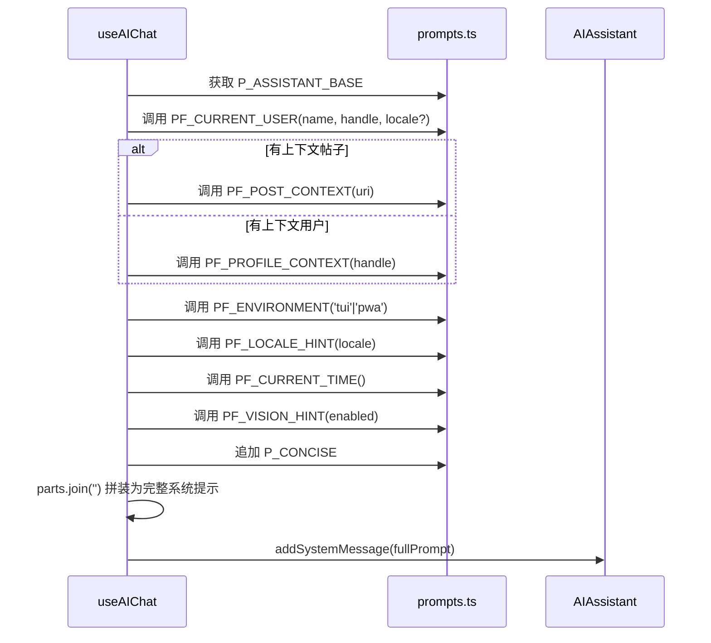

以下是根据最新代码重新编写的页面。我已逐一比对旧版与当前源码，只更新过时的部分，保留准确的内容。

---

# AI 系统提示词与多提供商

## 设计意图

Bluesky 助手的 LLM 交互层基于两个核心决策：**提示词集中管理**避免字符串散落在各处，**多提供商注册表**标准化接入多个模型供应商。两者共同构成一个可维护、可扩展的 AI 后端骨架。

---

## 一、集中式提示词管理

所有 LLM 可见的文本——系统提示、翻译指令、润色模板、标题生成规则——统一收拢在 `prompts.ts` 中。这是"单一事实源"原则的体现：要修改 AI 行为，编辑这一个文件足矣。

代码采用双前缀命名约定：

| 前缀 | 含义 | 示例 |
|------|------|------|
| `P_` | **纯字符串常量** | `P_ASSISTANT_BASE`, `P_CONCISE`, `P_POLISH_SYSTEM` |
| `PF_` | **参数化函数**，根据参数返回拼装后的字符串 | `PF_CURRENT_USER(name, handle, locale?)`, `PF_TRANSLATE_JSON(lang)` |

[来源](packages/core/src/ai/prompts.ts#L1-L10)

### 语言标签映射

`LANG_LABELS` 是一个 `Record<string, string>` 常量，将语言代码映射为自然语言名称（如 `zh → '中文'`, `en → 'English'`, `ja → '日本語'`）。翻译提示词通过它解析可读语言名，PWA 端的 `useTranslation` hook 也引用了同一套映射。[来源](packages/core/src/ai/prompts.ts#L16-L24)

### P_ASSISTANT_BASE：底座系统提示

这是多段字符串拼接而成的完整系统提示，包含：

- 角色定位（Bluesky 助手）
- 工具能力说明（instant_answer、search_wikipedia、fetch_web_markdown）
- search_posts 高级语法提示
- 图片上传后通过 `pendingImageIndex` 参数发帖的规则
- 视频帖子的处理限制（不可分析视频内容）
- **五项安全约束**：禁止主动写操作、汇总时不建议发帖、明确要求后才执行、写操作由确认门拦截、当前用户 handle 已在提示词中给出

[来源](packages/core/src/ai/prompts.ts#L30-L66)

### PF_* 函数族：上下文注入

每个 `PF_` 函数负责注入一个维度的上下文信息。拼装顺序见下面的序列图。

| 函数 | 注入内容 | 参数 | 新增/变更 |
|------|---------|------|-----------|
| `PF_CURRENT_USER` | 当前用户身份 + 界面语言提示 | `name`, `handle?`, `locale?` | **v3 新增 locale 参数** |
| `PF_PROFILE_CONTEXT` | 正在查看的用户主页（含搜索建议） | `handle`, `currentUserHandle?` | — |
| `PF_POST_CONTEXT` | 正在查看的帖子 URI | `uri` | — |
| `PF_ENVIRONMENT` | 终端 / PWA 环境差异指示 | `env: 'tui'\|'pwa'` | — |
| `PF_LOCALE_HINT` | 回复语言偏好 | `locale` | — |
| `PF_CURRENT_TIME` | 当前时间 + 星期 | 无参数（动态获取系统时钟） | — |
| `PF_VISION_HINT` | 视觉模式开关状态及说明 | `enabled: boolean` | — |
| `PF_AUTO_ANALYSIS` | 打开用户主页时的自动分析提示 | `handle` | **新增** |
| `P_CONCISE` | 简短回复指令 | （常量） | — |
| `P_GUIDING_QUESTIONS` | 无上下文时的引导问题列表 | （常量数组） | **新增** |

[来源](packages/core/src/ai/prompts.ts#L74-L204)

### 提示词组装流程

以下展示 `useAIChat` 中 `buildSystemPrompt` 函数的组装全过程，它决定了 AI 每次对话接收到的系统消息：



最后还可以追加用户自定义提示词 `aiConfig.customSystemPrompt`，为高级用户提供 AI 行为微调入口。[来源](packages/app/src/hooks/useAIChat.ts#L71-L92)

此外，当通过 `contextProfile` 打开新对话时，`useAIChat` 会在 **500ms 延迟后自动发送** `PF_AUTO_ANALYSIS(handle)` 作为首条用户消息，触发 AI 对目标主页的自动分析。[来源](packages/app/src/hooks/useAIChat.ts#L416-L425)

---

## 二、多提供商注册表

`providers.ts` 加载 `providers.json`，由 TypeScript 接口确保类型安全，用户直接编辑 JSON 文件即可扩展提供商。

### 类型结构

```typescript
interface ModelInfo {
  id: string;
  label: string;
  thinking: boolean;   // 是否支持思维链
  vision: boolean;     // 是否支持视觉输入
}

interface ProviderInfo {
  id: string;
  label: string;
  baseUrl: string;
  models: ModelInfo[];
  reasoningStyle: 'reasoning_content' | 'structured_content' | 'none';
}
```

[来源](packages/core/src/ai/providers.ts#L7-L20)

`thinking` 和 `vision` 从旧版的字符串描述升级为**布尔标记**，使模型能力查询更精确。[来源](packages/core/src/ai/providers.ts#L35-L39)

`reasoningStyle` 是区分提供商思考链路格式的关键字段：

| 提供商 | `reasoningStyle` | 含义 |
|--------|-----------------|------|
| **DeepSeek** | `reasoning_content` | 原生 `delta.reasoning_content` 字段，SSE 解析时直接透传 |
| **Mistral** | `structured_content` | content 中嵌入结构化数组（`[{type:'thinking',...},{type:'text',...}]`），SSE 解析时需按块类型分流 |

[来源](packages/core/src/ai/providers.json#L1-L24)

### 注册表模型清单

| 提供商 | 模型 ID | 标签 | 思维链 | 视觉 |
|--------|---------|------|--------|------|
| DeepSeek | `deepseek-v4-flash` | DeepSeek V4 Flash | ✅ | ❌ |
| DeepSeek | `deepseek-v4-pro` | DeepSeek V4 Pro | ✅ | ❌ |
| Mistral | `mistral-small-latest` | Mistral Small (24B) | ✅ | ✅ |
| Mistral | `pixtral-large-latest` | Pixtral Large (Vision) | ❌ | ✅ |
| Mistral | `mistral-medium-latest` | Mistral Medium (128B) | ❌ | ✅ |
| Mistral | `ministral-3b-latest` | Ministral 3B (Fast) | ❌ | ❌ |

> 模型 ID 相比旧版已升级：DeepSeek 从 `deepseek-chat`/`deepseek-reasoner` 更新为 `deepseek-v4-flash`/`deepseek-v4-pro`；Mistral 新增了 `ministral-3b-latest`。[来源](packages/core/src/ai/providers.json#L1-L24)

### 辅助函数

- `getProviderById(id)` — 通过 ID 查找提供商
- `getProviderByBaseUrl(url)` — 通过 Base URL 匹配提供商（含尾部斜杠清理）
- `getModelInfo(providerId, modelId)` — 查询模型元数据
- `cleanBaseUrl(baseUrl)` — 从 URL 中剥离 `/v1/chat/completions` 等路径后缀
- `isCustomModel(providerId, modelId)` — 不在注册表中即为自定义模型
- `shouldSendThinkingParam(providerId)` — 仅 DeepSeek 使用非标准 `thinking` 参数

[来源](packages/core/src/ai/providers.ts#L26-L56)

### makeRequest 的提供商适配

请求构建阶段，根据提供商类型发送不同的思维链参数：

- **DeepSeek**（`reasoning_content`）：发送 `thinking: { type: 'enabled' | 'disabled' }` 到请求体
- **Mistral**（`structured_content`）：发送 `reasoning_effort: 'high'` 到请求体（前提是 `thinkingEnabled !== false`）

[来源](packages/core/src/ai/assistant.ts#L370-L375)

### _buildMessages() 的提供商适配

非 `reasoning_content` 风格的提供商（如 Mistral），`_buildMessages` 会将 `reasoning_content` 字段合并为 `content` 的前缀文本（格式为 `【上一步思考过程】\n...\n\n`），然后移除该字段，避免接口报 `extra_forbidden` 错误。

同时增加了一重安全过滤：**移除 `tool_call_id` 缺失的 tool 消息**，防止损坏的持久化数据导致 API 报错。[来源](packages/core/src/ai/assistant.ts#L321-L339)

---

## 三、translateText 的双模态设计与指数退避重试

`translateText` 是一个**单轮非流式** AI 调用函数，专为翻译场景优化。

### 双模态设计

| 模式 | 系统提示 | 响应格式 | 返回值 |
|------|---------|---------|--------|
| `simple` | `PF_TRANSLATE_SIMPLE` — 纯文本输出 | LLM 返回纯文本 | `{ translated: string }` |
| `json` | `PF_TRANSLATE_JSON` — 要求 JSON 格式 | `{"source_lang": "en", "translated": "..."}`；请求体追加 `response_format: { type: "json_object" }` | `{ translated: string, sourceLang: string }` |

[来源](packages/core/src/ai/prompts.ts#L148-L170)
[来源](packages/core/src/ai/assistant.ts#L727-L820)

当前实现相比旧版有两个重要变更：

1. **翻译时禁用思维链**：请求体设置 `thinking: { type: 'disabled' }`，避免推理模型在翻译时输出多余的思考过程。[来源](packages/core/src/ai/assistant.ts#L751)
2. **语言标签通过 LANG_LABELS 解析**：`targetLang` 传入语言代码（如 `'zh'`），由 `LANG_LABELS` 映射为可读标签（如 `'中文'`）后嵌入提示词。

### 指数退避重试

当以下情况触发重试（`maxRetries` 默认为 3）：

1. **空内容** — LLM 返回空白
2. **JSON 解析失败** — json 模式下 `JSON.parse` 出错
3. **缺少 translated 字段** — json 模式下解析成功但字段缺失
4. **网络/服务端错误** — HTTP 非 2xx

退避策略：

- 空内容/JSON 错误：`800 × (attempt + 1)` ms
- 网络/HTTP 错误：`1000 × (attempt + 1)` ms

**行为差异**：空内容与 JSON 解析失败在耗尽重试后不再抛出异常，而是回退返回 `{ translated: content, sourceLang: 'und' }`，保证至少返回原始响应。只有网络级错误在所有尝试耗尽后抛出异常。[来源](packages/core/src/ai/assistant.ts#L775-L816)

便利函数 `translateToChinese(config, text)` 等价于 `translateText(config, text, 'zh', 'simple')`，返回 `result.translated`。[来源](packages/core/src/ai/assistant.ts#L825-L828)

在 PWA 端，`useTranslation` hook 维护了 `Map<string, TranslationResult>` 作为翻译缓存，以 `${mode}::${lang}::${text}` 为键，避免重复翻译。它通过动态 `import('@bsky/core')` 懒加载 `translateText`。[来源](packages/app/src/hooks/useTranslation.ts#L22-L51)

---

## 四、polishDraft 的调用链

`polishDraft` 是 `singleTurnAI` 的薄封装，用于润色帖子草稿。

### 调用链

```
polishDraft(config, draft, requirement, modelOverride?)
  → singleTurnAI(config, systemPrompt, userPrompt, temperature=0.7, maxTokens=2000, modelOverride)
    → fetch POST {cleanBaseUrl(baseUrl)}/v1/chat/completions
    → 返回 data.choices[0].message.content
```

其中：
- **systemPrompt** = `P_POLISH_SYSTEM`（"你是一个文字润色助手..."）
- **userPrompt** = `PF_POLISH_USER(requirement, draft)`（"用户要求：{requirement}\n\n草稿：\n{draft}"）
- **temperature** = 0.7（比翻译的 0.3 更高，允许一定创造性）
- **modelOverride?** — 新增可选参数，允许使用不同模型执行润色（如使用更便宜的模型）

[来源](packages/core/src/ai/assistant.ts#L833-L842)
[来源](packages/core/src/ai/prompts.ts#L171-L182)

### 消费端

- **TUI**：在 `App.tsx` 中通过 `Ctrl+P` 快捷键调用，用户输入润色要求后异步执行。`polishDraft` 通过动态 `import('@bsky/core')` 懒加载，润色使用的分辨率模型在 `config.scenarioModels.polish` 中独立配置。[来源](packages/tui/src/components/App.tsx#L200-L213)
- **PWA**：`PolishWidget` 组件提供图形界面，用户拖入选中文本、输入要求，点击润色后展示 diff 操作。PWA 也支持 `scenarioModels.polish` 为润色场景指定独立模型。[来源](packages/pwa/src/components/widgets/PolishWidget.tsx#L27-L34)

两个界面都使用了**场景模型分辨率**（`resolveScenarioConfig`）：AI Chat、翻译、润色各自可以绑定不同的模型和提供商。[来源](packages/pwa/src/App.tsx#L85)

---

## 五、generateChatTitle 的自动标题生成

当用户发送首条真实消息并收到 AI 回复后，`useAIChat` 的 `autoSave` 函数会异步调用 `generateChatTitle`。

### 调用链

```
generateChatTitle(config, firstUserMsg, firstAiReply)
  → singleTurnAI(config, P_AUTO_TITLE_SYSTEM, PF_AUTO_TITLE_USER(...), temperature=0.3)
    → 返回 raw 文本
  → cleaned = raw.trim().replace(/^["「『\s]+|["」』\s]+$/g, '').slice(0, 50)
  → 返回 cleaned || firstUserMsg.slice(0, 50)  // 失败时回落为消息前50字符
```

与旧版的区别：输入文本在传递给 LLM 前做了**长度裁剪**——首条用户消息截取前 150 字符，AI 回复截取前 300 字符，减少 token 消耗。[来源](packages/core/src/ai/assistant.ts#L848-L865)

### 提示词规则

系统提示 `P_AUTO_TITLE_SYSTEM` 规定了严格约束：

- 使用用户消息的语言
- 2-15 个字（中文/日文）或 3-8 个词（英文）
- 提取对话核心主题
- 只返回标题文本本身

[来源](packages/core/src/ai/prompts.ts#L209-L221)

### 触发时机

`useAIChat` 中通过 `titleGeneratedRef` 标记确保每段对话只生成一次标题。触发条件：

1. 存在非 `<currently_viewing>` 的用户消息（排除自动分析请求）
2. 存在至少一条 assistant 回复
3. 聊天记录已持久化

标题生成采用 fire-and-forget 模式：通过动态 `import('@bsky/core')` 懒加载 `generateChatTitle`，异步调用后通过 `storage.saveChat` 更新标题并调用 `onTitleChanged` 回调刷新列表。增加了**版本号守卫**（`saveVersionRef`），防止并发保存导致的旧数据覆盖新数据。[来源](packages/app/src/hooks/useAIChat.ts#L247-L284)

---

## 六、流式 SSE 解析与思维链分派

流式模式下，`sendMessageStreaming` 的 SSE 解析器根据 `reasoningStyle` 分两条路径处理：

```
                          ┌─ reasoning_content 字段 → yield { type: 'thinking' }
SSE chunk → delta ───────┤
                          └─ delta.content (array) ──┬─ block.type === 'thinking' → yield { type: 'thinking' }
                                                      └─ block.type === 'text'     → yield { type: 'token' }
```

- **DeepSeek**：读取 `delta.reasoning_content` 直接产出 `thinking` 类型事件
- **Mistral**：遍历 `delta.content` 数组，根据每个 block 的 `type` 字段分流——`thinking` 类型的 block 内含嵌套的 `thinking[].text`，需递归提取

[来源](packages/core/src/ai/assistant.ts#L510-L538)

### 幻觉防护：pendingImage 注入

当启用了视觉模式且有等待处理的图片时，`_buildMessages` 会定位到**最后一条用户消息**，将图片以 `ContentBlock[]` 形式注入：

```
原始 content: "分析这张图片"
注入后 content: [
  { type: 'text', text: "分析这张图片" },
  { type: 'text', text: "[图片 ALT: ...]" },
  { type: 'image_url', image_url: { url: "data:..." } },
]
```

图片会**持久化**到 `this.messages` 中，确保跨轮对话上下文不丢失。[来源](packages/core/src/ai/assistant.ts#L340-L362)

---

## 总结

这个"基础设施层"的最新演进展现在五个方面：

- **提示词集中管理**新增了自动分析提示（`PF_AUTO_ANALYSIS`）和引导问题（`P_GUIDING_QUESTIONS`），覆盖更多入口场景
- **提供商注册表**完成了模型清单的版本升级（DeepSeek V4 系列），并为 Mistral 新增了 `reasoning_effort` 参数适配
- **translateText** 禁用了翻译时的思维链，避免推理污染翻译结果
- **polishDraft** 和 **generateChatTitle** 新增了 `modelOverride` 参数和场景模型独立配置，支持为不同任务选择不同模型
- **流式 SSE 解析器**统一处理了 `reasoning_content` 和 `structured_content` 两种思维链格式

关于多轮对话引擎和工具调用循环的完整实现，参见 [](ai-对话引擎.md)。38 个工具的定义清单详见 [](33-个-ai-工具系统.md)。