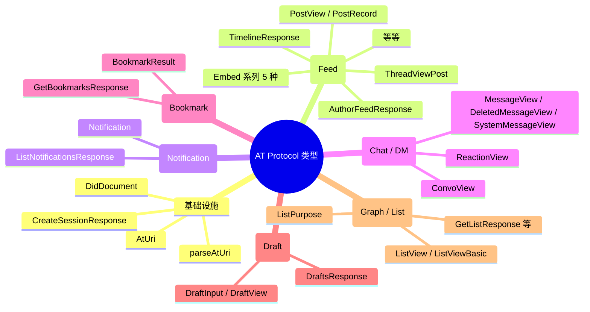
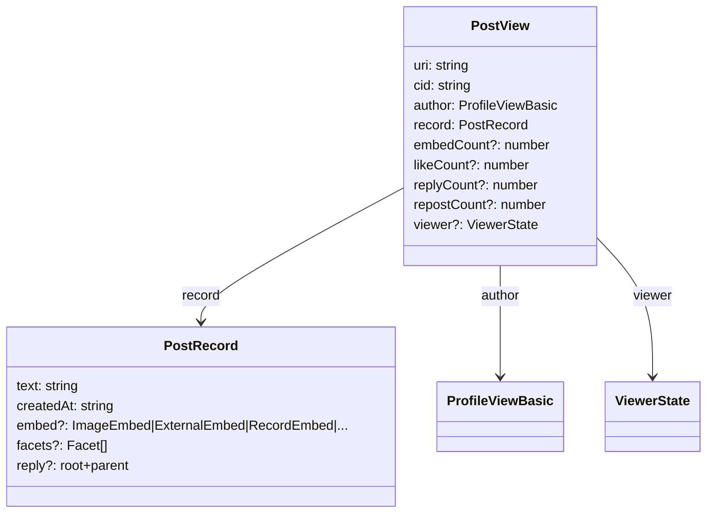

以下是 `packages/core/src/at/types.ts`（及少量关联文件）中所有类型定义的完整导览。

---

# AT Protocol 类型系统

所有 Bluesky AT Protocol 的 API 响应模型、请求体、嵌入实体和工具函数集中存放在一个文件中。这个文件是 `@bsky/core` 包中对外的数据契约——只要前端（TUI 或 PWA）需要与 AT Protocol 交互，它依赖的类型都从这里导出。[来源](packages/core/src/at/types.ts)

---

## 类型全景总览

整个类型系统可按命名空间划分为六大功能群组，外加一组基础设施类型（URI 解析、会话、DID）。



---

## 1. 基础设施：AT URI 解析与 DID

### `AtUri` 接口

解析后的 AT URI 包含四个字段：

| 字段 | 类型 | 说明 |
|---|---|---|
| `uri` | `string` | 原始 URI 字符串 |
| `did` | `string` | 完整的 DID 标识符（含前缀 `did:plc:` 或 `did:web:`） |
| `collection` | `string` | 集合名称（如 `app.bsky.feed.post`） |
| `rkey` | `string` | 记录键（通常是 `3jk123` 格式） |

[来源](packages/core/src/at/types.ts#L1-L6)

### `parseAtUri()` 函数

```typescript
export function parseAtUri(uri: string): AtUri
```

正则表达式：`/^at:\/\/(did:[^:]+:[^\/]+)\/([^\/]+)\/([^\/]+)$/`

该正则通过 `did:[^:]+:[^/]+` 匹配 **两种 DID 格式**：

| DID 格式 | 示例 URI | `match[1]` 结果 |
|---|---|---|
| `did:plc` | `at://did:plc:abc123/app.bsky.feed.post/3lk123` | `did:plc:abc123` |
| `did:web` | `at://did:web:example.com/app.bsky.feed.post/3lk123` | `did:web:example.com` |

关键设计：正则中 `did:` 后第一个 `[^:]+` 匹配方式前缀（`plc` / `web`），第二个 `[^/]+` 匹配其后的值，所以 `did:web:example.com` 中虽含 `.` 但不含 `/`，也能正确捕获整个 DID 标识符。如果 URI 不匹配模式，函数会抛出 `Error`。[来源](packages/core/src/at/types.ts#L8-L19)

### `DidDocument` 与认证

```typescript
export interface DidDocument {
  id: string;
  alsoKnownAs?: string[];
  service?: Array<{
    id: string;
    type: string;
    serviceEndpoint: string;
  }>;
}
```

`ResolveDidResponse` 包装了 DID 文档和可选的 handle，`ResolveHandleResponse` 仅返回 DID 字符串。[来源](packages/core/src/at/types.ts#L257-L275)

---

## 2. Feed 命名空间：帖子、嵌入与线程

### 核心类型：`PostRecord` 与 `PostView`

`PostRecord` 是用户发帖时写入的**记录本体**，`PostView` 是 API 返回的**视图**（含作者信息和交互统计）。



[来源](packages/core/src/at/types.ts#L21-L75)

### 五种 Embed 类型

嵌入（embed）是多态的联合体，统一字段 `$type` 用于区分类型：

| 接口 | `$type` 值 | 说明 |
|---|---|---|
| `ImageEmbed` | `app.bsky.embed.images` | 单张或多张图片 |
| `ExternalEmbed` | `app.bsky.embed.external` | 外部链接卡片 |
| `RecordEmbed` | `app.bsky.embed.record` | 引用另一条帖子（引文 embed） |
| `RecordWithMediaEmbed` | `app.bsky.embed.recordWithMedia` | 引文 + 图片/链接 |
| `VideoEmbed` | `app.bsky.embed.video` | 视频（含可选的 `aspectRatio` 和 `captions`） |

所有引用 blob 的字段都遵守相同的 `{ $type: 'blob'; ref: { $link: string }; mimeType: string; size: number }` 结构。[来源](packages/core/src/at/types.ts#L29-L56)

### `Facet`（富文本标记）

```typescript
export interface Facet {
  index: { byteStart: number; byteEnd: number };
  features: Array<{ $type: string; uri?: string; did?: string; tag?: string }>;
}
```

`features` 是多态数组，通过 `$type` 区分 @ 提及、链接、标签等。[来源](packages/core/src/at/types.ts#L58-L61)

### `ThreadViewPost` — 递归树结构

这是帖子详情页使用的核心类型，也是一个**递归结构**：

```typescript
export interface ThreadViewPost {
  $type: 'app.bsky.feed.defs#threadViewPost';
  post: PostView;
  parent?: ThreadViewPost | NotFoundPost;   // 向上追溯
  replies?: Array<ThreadViewPost | NotFoundPost>;  // 向下展开
}
```

- `parent` 和 `replies` 都可能出现 `NotFoundPost`（帖子被删除或权限不足时）。
- `NotFoundPost` 只有三个字段：`$type`、`uri`、`notFound: boolean`。[来源](packages/core/src/at/types.ts#L103-L114)

```
                  ┌──────────────┐
                  │  root Post   │
                  │  (ThreadViewPost) │
                  └──────┬───────┘
                         │ parent?
                  ┌──────┴───────┐
                  │  parent Post │
                  │  (或 NotFound)│
                  └──────┬───────┘
                         │
                    ┌────┴────┐
                    │ replies │
              ┌─────┴──┐  ┌───┴──────┐
              │ reply1 │  │  reply2   │
              │ TVP    │  │  TVP      │
              └───┬────┘  └───┬───────┘
                  │ replies    │ replies
                  ...          ...
```

### 响应类型继承关系

`TimelineResponse`、`AuthorFeedResponse`、`GetFeedResponse`、`GetListFeedResponse` 共享相同的 `feed` 数组结构：

```typescript
feed: Array<{ 
  post: PostView; 
  reply?: { parent: PostView; root: PostView }; 
  reason?: unknown 
}>
```

区别仅在于语义：时间线、作者主页、自定义 Feed、列表 Feed。[来源](packages/core/src/at/types.ts#L147-L206)

### 用户资料层级

```
ProfileViewBasic (did + handle + displayName? + avatar?)
       │
       ▼
ProfileView (extends ProfileViewBasic)
       + description?, followersCount?, followsCount?,
         postsCount?, banner?, indexedAt?, viewer?
```

[来源](packages/core/src/at/types.ts#L77-L92)

---

## 3. Graph / List 命名空间

### `ListPurpose` 联合类型

```typescript
export type ListPurpose = 
  | 'app.bsky.graph.defs#modlist'      // 屏蔽列表
  | 'app.bsky.graph.defs#curatelist'    // 精选列表
  | 'app.bsky.graph.defs#referencelist'; // 参考列表
```

[来源](packages/core/src/at/types.ts#L333)

### 列表类型继承

```
ListViewBasic (uri + cid + name + purpose + avatar? + labels? + viewer?)
       │
       ▼
ListView (extends ListViewBasic)
       + creator: ProfileViewBasic
       + description?
       + descriptionFacets?: Facet[]
```

`ListItemView` 表示列表中的成员（`subject: ProfileViewBasic`）。`ListWithMembership` 将列表与某个成员条目配对，用于判断当前用户是否已在列表中。[来源](packages/core/src/at/types.ts#L340-L392)

---

## 4. Chat / DM 命名空间

私信系统的数据模型围绕三个核心概念：**会话（Convo）→ 消息（Message）→ 反应（Reaction）**。

### `ConvoView`

```typescript
export interface ConvoView {
  id: string;
  rev: string;
  members: ProfileViewBasic[];
  lastMessage?: MessageView | DeletedMessageView | SystemMessageView;
  lastReaction?: { message: MessageView; reaction: ReactionView };
  muted: boolean;
  status: 'request' | 'accepted';
  unreadCount: number;
  kind: 'direct' | 'group';
}
```

`kind` 区分一对一聊天直接模式和群聊模式。`status` 表示请求状态——在 Bluesky 上私信需要双方同意。[来源](packages/core/src/at/types.ts#L401-L411)

### 消息三态

```mermaid
classDiagram
    class MessageView {
      id: string
      rev: string
      text: string
      facets?: Facet[]
      embed?: RecordEmbed
      reactions: ReactionView[]
      sender: { did: string }
      sentAt: string
    }
    class DeletedMessageView {
      id: string
      rev: string
      sender: { did: string }
      sentAt: string
    }
    class SystemMessageView {
      id: string
      rev: string
      sentAt: string
      data: { $type: string; ... }
    }
    class ReactionView {
      value: string
      sender: { did: string }
      createdAt: string
    }
    MessageView --> ReactionView : reactions
    GetMessagesResponse --> MessageView : messages 数组（联合）
    GetMessagesResponse --> DeletedMessageView : messages 数组（联合）
    GetMessagesResponse --> SystemMessageView : messages 数组（联合）
```

`GetMessagesResponse.messages` 是三者的联合数组，前端需要根据 `$type` 或字段存在性（如 `text`、`notFound`、`data`）进行类型守卫。[来源](packages/core/src/at/types.ts#L456-L464)

---

## 5. Bookmark 命名空间

书签是项目自定义实现的收藏功能（非 Bluesky 原生协议），通过扩展 API 实现。

```typescript
export interface BookmarkResult {
  subject: { uri: string; cid: string };
  createdAt: string;
  item: PostView;          // 完整帖子视图
}

export interface GetBookmarksResponse {
  cursor?: string;
  bookmarks: BookmarkResult[];
}
```

注意 `BookmarkResult` 嵌套了完整的 `PostView`，因此前端无需再发起额外的获取帖子请求。[来源](packages/core/src/at/types.ts#L286-L302)

---

## 6. Draft 命名空间

草稿同样为项目自定义，服务于多帖编辑/发送功能。

```
DraftPostInput → { text: string }
DraftInput → { posts: DraftPostInput[], deviceId?, deviceName?, langs? }
DraftView → { id: string, draft: DraftInput, createdAt, updatedAt }
```

`langs` 字段支持多语言标注。`deviceId`/`deviceName` 用于跨设备同步时区分来源。[来源](packages/core/src/at/types.ts#L304-L329)

---

## 7. 响应类型快速查找表

以下按操作名称索引，快速定位对应的请求/响应类型：

| API 操作 | 响应类型 | 核心字段 |
|---|---|---|
| `app.bsky.feed.getTimeline` | `TimelineResponse` | `feed: FeedItem[]` |
| `app.bsky.feed.getAuthorFeed` | `AuthorFeedResponse` | `feed: FeedItem[]` |
| `app.bsky.feed.getPostThread` | `PostThreadResponse` | `thread: ThreadViewPost | NotFoundPost` |
| `app.bsky.feed.getLikes` | `GetLikesResponse` | `likes: LikeItem[]` |
| `app.bsky.feed.getRepostedBy` | `GetRepostedByResponse` | `repostedBy: ProfileViewBasic[]` |
| `app.bsky.feed.searchPosts` | `SearchPostsResponse` | `posts: PostView[]` |
| `app.bsky.actor.searchActors` | `SearchActorsResponse` | `actors: ProfileView[]` |
| `app.bsky.actor.getProfile` | `ProfileView` | 用户资料全貌 |
| `app.bsky.graph.getFollows` | `GetFollowsResponse` | `follows: ProfileViewBasic[]` |
| `app.bsky.graph.getFollowers` | `GetFollowersResponse` | `followers: ProfileViewBasic[]` |
| `app.bsky.graph.getList` | `GetListResponse` | `list: ListView`, `items: ListItemView[]` |
| `app.bsky.notification.list` | `ListNotificationsResponse` | `notifications: Notification[]` |
| `chat.bsky.convo.listConvos` | `ConvoListResponse` | `convos: ConvoView[]` |
| `chat.bsky.convo.getMessages` | `GetMessagesResponse` | `messages: MessageView[]` 联合类型 |
| 自定义书签 | `GetBookmarksResponse` | `bookmarks: BookmarkResult[]` |
| 自定义草稿 | `DraftsResponse` | `drafts: DraftView[]` |

---

## 8. 工具函数 `parseAtUri`

实际使用时：

```typescript
import { parseAtUri } from '@bsky/core';

const parsed = parseAtUri('at://did:plc:abc123/app.bsky.feed.post/3lk123');
// → { uri: '...', did: 'did:plc:abc123', collection: 'app.bsky.feed.post', rkey: '3lk123' }

const parsedWeb = parseAtUri('at://did:web:example.com/app.bsky.feed.post/3lk456');
// → { uri: '...', did: 'did:web:example.com', collection: 'app.bsky.feed.post', rkey: '3lk456' }
```

[来源](packages/core/src/at/types.ts#L8-L19)

---

## 推荐阅读

- [AT Protocol 客户端](at-protocol-客户端.md) — `BskyClient` 如何使用这些类型发起请求和序列化响应
- [Direct Messages 私信系统](direct-messages-私信系统.md) — `ConvoView`/`MessageView` 在实际 DM 流程中的应用
- [三层架构详解](三层架构详解.md) — 理解 core 层作为纯数据层在前端消费中的位置
- [38 个 AI 工具系统](33-个-ai-工具系统.md) — AI 工具如何构造和消费 `PostView`、`ProfileView` 等类型