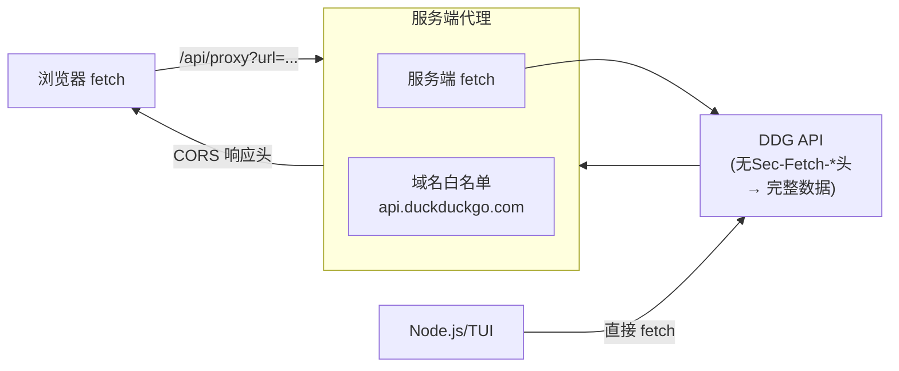

# 关键教训与架构决策记录

> 从代码演进中提炼的 65 个关键教训，按主题分类。每个教训包含根因分析、修复方案和预防措施。重点标记架构级决策。

## 快速索引

| # | 主题 | 关键教训 | 严重程度 |
|---|------|----------|----------|
| L1 | AI 安全 | 自动发帖预防——3 条硬规则 | 🔴 红线 |
| L2 | AI 安全 | `view_image` 返回提示误导 AI 自我限制 | 🟡 重要 |
| L3 | AI 安全 | 场景模型提取模型名但不切换提供商 | 🟡 重要 |
| L4 | AI 安全 | `buildToolDescription` 遗漏新写工具 | 🟡 重要 |
| L5 | AI 引擎 | `tool_call_id` 三个死亡路径 | 🔴 阻断 |
| L6 | AI 引擎 | 双重格式化——`tryJsonSummary` vs `formatToolResult` | 🟡 重要 |
| L7 | AI 引擎 | `useState(() => new AIAssistant)` 仅运行一次 | 🟡 重要 |
| L8 | AI 引擎 | 编辑消息后 API 400 `missing field tool_call_id` | 🔴 阻断 |
| L9 | AI 引擎 | 工具调用 10 轮上限拦截复杂分析 | 🟡 重要 |
| L10 | AI 引擎 | AI `tool_call.arguments` JSON 格式不良崩溃 | 🔴 阻断 |
| L11 | AI 引擎 | 查看图片后对话上下文不持久 | 🟡 重要 |
| L12 | AI 引擎 | AI 自动命名标题：`maxTokens` + thinking 模式冲突 | 🟡 重要 |
| L13 | AI 引擎 | AI 标题生成后 UI 未更新 | 🟡 重要 |
| L14 | AI 引擎 | `/view` 上下文干扰标题生成 | 🟡 重要 |
| L15 | AI 引擎 | AI 卡片数据留存——`mapMessages` 丢失 thinking/tool 序列 | 🟡 重要 |
| L16 | 认证/JWT | `withRefresh` 闭包必须可复用 | 🔴 架构 |
| L17 | 认证/JWT | JWT 刷新并发锁——`_refreshPromise` 缓存模式 | ⚪ 设计 |
| L18 | 认证/JWT | `ky` retry 显式配置 statusCodes | 🟡 重要 |
| L19 | 认证/JWT | DM chat API 鉴权演进——最终直连 `api.bsky.chat` | 🔴 架构 |
| L20 | PDS 发现 | `didDoc` 返回可选——两阶段 fallback | 🔴 架构 |
| L21 | PDS 发现 | `login()` 的 `this.ky` 鸡生蛋问题 | 🔴 架构 |
| L22 | PDS 架构 | AppView 去重 vs PDS 不去重——`getList` vs `listRecords` | 🟡 重要 |
| L23 | PDS 架构 | `searchActors` 统一使用 publicKy（鉴权端点 503） | 🟡 重要 |
| L24 | PDS 架构 | AI 搜索工具强制 authenticated endpoint（403） | 🟡 重要 |
| L25 | 网络/错误 | 浏览器 `TypeError: Failed to fetch` 大小写 | 🟡 重要 |
| L26 | 网络/错误 | DNS 污染导致 API 不可达 | 🟡 重要 |
| L27 | UI/Widget | Widget 排序索引与过滤列表错位 | 🟡 重要 |
| L28 | UI/Widget | Widget 系统统一 header bar 设计 | ⚪ 设计 |
| L29 | UI/Widget | 组件启用状态不持久化 | 🟡 重要 |
| L30 | UI/Widget | Widget 临时禁用与恢复——`useRef` 快照 | 🟡 重要 |
| L31 | UI/Widget | `Array.splice` vs `Set.add`——有序状态用数组 | ⚪ 设计 |
| L32 | UI/Widget | Widget 按钮移至 header 行内——`headerButtons` + module refs | ⚪ 设计 |
| L33 | UI/Widget | 组件持久化——module-level toggle 需要回调 | 🟡 重要 |
| L34 | UI/组件 | SVG 图标必须硬编码到共享组件 | 🟡 重要 |
| L35 | UI/组件 | PWA SVG 图标显示为文字 | 🟡 重要 |
| L36 | UI/组件 | 各帖子列表不统一——`PostActionsRow` 共享 | ⚪ 设计 |
| L37 | UI/组件 | ThreadView 竖线过犹不及 | ⚪ 设计 |
| L38 | UI/组件 | 引用帖显示空卡片——读 `#view` 字段 | 🟡 重要 |
| L39 | UI/组件 | 搜索历史 dropdown 遮挡 tabs | 🟡 重要 |
| L40 | UI/组件 | 点赞/转发计数不更新——模块级 `_likeCountAdj` | 🟡 重要 |
| L41 | UI/组件 | @handle 链接 401——`slice(1)` 去 @ 再编码 | 🟡 重要 |
| L42 | UI/组件 | 润色只操作 `post[0]` | 🟡 重要 |
| L43 | UI/组件 | 草稿永远「未保存到服务器」——`_clientRef` 模式 | 🔴 阻断 |
| L44 | UI/组件 | 表情皮肤变体分组——Unicode 检测 vs 正则 | 🟡 重要 |
| L45 | UI/动画 | AI 卡片不可条件渲染，必须 CSS transition | 🟡 重要 |
| L46 | 性能 | 流式输出滚动——`requestAnimationFrame` 必需 | 🟡 重要 |
| L47 | 性能 | 移动键盘 `100dvh` 不够——`visualViewport.height` | 🟡 重要 |
| L48 | 性能 | 滚动恢复：索引→像素值 | 🔴 架构 |
| L49 | 性能 | DMChatPage auto-scroll 守卫——`isNearBottom` | 🟡 重要 |
| L50 | 性能 | BookmarkPage 虚拟滚动 | 🟡 重要 |
| L51 | 存储 | 草稿存储——`_clientRef` 避免闭包捕获旧 client | 🔴 阻断 |
| L52 | 存储 | ChatService 模块级单例 + debounce 持久化（取代工厂模式） | 🔴 架构 |
| L53 | 存储 | ChatService 消除 5 个叠加的存储竞态根因（取代版本戳） | 🔴 架构 |
| L54 | 国际化 | `{{n}}` vs `{n}`——单大括号插值约定 | 🟡 重要 |
| L55 | 第三方 | DuckDuckGo `Sec-Fetch-*` 检测——多平台代理 | 🔴 架构 |
| L56 | 第三方 | Wikipedia API——`page/summary` 直接使用 | ⚪ 设计 |
| L57 | 第三方 | MediaWiki API——`&origin=*` 参数必需 | 🟡 重要 |
| L58 | DM | `markConvoRead` 乐观清除未读标记 | 🟡 重要 |
| L59 | 构建 | 构建顺序——先 commit 再 build | 🟡 重要 |
| L60 | AI 工具 | `get_profile` actor="me" 支持 | 🟡 重要 |
| L61 | 性能 | 帖子重置修复——`lastFeed.current` render body 初始化 | 🟡 重要 |
| L62 | 性能 | 滚动恢复最终修复——`items.length` deps + `_heightCache` | 🔴 架构 |
| L63 | PWA | PWA 更新检查——`services/pwa.ts` + `_ignoreNextUpdate` | 🟡 重要 |
| L64 | UI/组件 | 回复深度标签——`getReplyDepth` 推断嵌套层级 | ⚪ 设计 |
| L65 | UI/组件 | PostInfoModal——AT URI/CID 调试信息弹窗 | ⚪ 设计 |

---

## 🔴 AI 安全红线

AI 安全是本项目最高优先级的设计约束。任何提示词级别的模糊措辞都可能导致自动发帖、自动互动等不可逆操作。

### L1: 自动发帖预防——3 条硬规则

**根因**：`P_ASSISTANT_BASE` 中的「生成一条回复」「并与我互动」等措辞让 AI 主动代表用户写操作。`PF_PROFILE_CONTEXT` 中的「回复指令」和 `PF_AUTO_ANALYSIS` 中的「互动」也触发了此行为。

**修复**：在 `P_ASSISTANT_BASE` 中嵌入 3 条硬规则，并追加第 4 条（告知 AI 确认对话框会自动弹出）和第 5 条（handle 使用提示）：

```
1. 绝对不要主动代表用户发帖、回复、点赞、转发或关注任何人。
2. 汇总资料时直接输出分析结果，不要附加"我帮你发条帖子吧"之类的建议。
3. 如果用户要求你发帖，你才通过 create_post 工具执行，否则永远不要。
4. 当你调用写操作工具时，系统会自动弹出确认对话框，无需额外询问。
5. 当前用户的信息会作为"当前用户"提示告知你（包含 handle）。
```

同时移除 `PF_PROFILE_CONTEXT` 中的回复指令和 `PF_AUTO_ANALYSIS` 中的互动措辞。

**预防措施**：
- 提示词中**一个字**都可能导致写行为——必须鲜明的否定性指令
- 确认门（`requiresWrite` + `buildToolDescription` + UI 弹窗）是最后防线，不可替代提示词约束
- 新增场景或上下文提示词时，必须审计是否存在「替用户做决定」的语义

[来源](packages/core/src/ai/prompts.ts#L53-L65)

### L2: `view_image` 返回提示误导 AI 自我限制

**根因**：`view_image` 工具返回硬编码了 `"Text-only models: skip image analysis"`——AI 读到后即便视觉模式已开启也自我限制。

**修复**：工具返回动态化——根据 `visionEnabled` 返回不同提示：「you will see this image」或「vision mode is OFF」。

**预防措施**：工具返回文本必须感知当前能力状态，而非静态模板。

[来源](packages/core/src/ai/tools.ts#L699-L706)

### L3: 场景模型提取模型名但不切换提供商

**根因**：场景 `deepseek/deepseek-v4-flash` 只提取 `deepseek-v4-flash`，但 `baseUrl` 和 `apiKey` 仍用主配置→请求发到错误端点。

**修复**：`App.tsx` 的 `resolveScenarioConfig()` 从场景模型字符串解析出完整 `AIConfig`（含 `baseUrl`、`apiKey`、`provider`）。

**预防措施**：模型选择器必须返回完整的端点配置，不仅仅是模型名。

[来源](docs/CONTEXT.md#L156-L158)

### L4: `buildToolDescription` 遗漏新写工具

**根因**：`buildToolDescription` 只有 `create_post`、`like`、`repost`、`follow`、`upload_blob` 的 switch case。新增 `create_list`/`add_to_list`/`remove_from_list` 落到 default 的 `JSON.stringify(args)` 截断。

**修复**：每个 `requiresWrite: true` 的工具必须在 `buildToolDescription` 添加 human-readable case。

**预防措施**：确认门的三层（`requiresWrite` → `buildToolDescription` → UI 弹窗）必须完整覆盖。新增 write 工具时三层都要检查。

[来源](docs/LESSONS.md#L384-L398)

### L60: `get_profile` actor="me" 支持

**根因**：AI 需要获取自己资料时，不知道自己的 handle/DID，导致猜测错误或工具调用失败。

**修复**：工具描述和 handler 支持 `actor="me"`——自动解析为 `client.getHandle()`。AI 无需猜测自己的 handle。同时 `PF_CURRENT_USER` 提示词中明确告知 AI 其 handle。

**预防措施**：AI 工具应提供「自我引用」的快捷方式（`me`、`self`），避免 AI 猜测身份信息。

[来源](packages/core/src/ai/tools.ts#L476-L494)

---

## 🧠 AI 对话引擎

### L5: `tool_call_id` 的三个死亡路径

**根因**：`tool_call_id` 在三条路径上丢失：① `assistant.ts` 正常执行路径 yield 缺少 `toolCallId`（取消路径有但正常路径忘）；② `useAIChat` 会话恢复路径将 `tool_call` 和 `tool_result` 都映射为 `role: 'tool'`，破坏消息序列；③ `mapMessages` 编辑/撤销恢复路径丢失 `toolName` 和 `toolCallId`。

**修复**：三个路径全部修复——补上 `toolCallId: tc.id`；恢复路径重建正确的 assistant→tool 序列；`mapMessages` 保留所有字段。

**预防措施**：存储格式（`AIChatMessage`）与 API 格式（`ChatMessage`）的转换是高风险区。每个字段的端到端路径需验证——存在性、序列化保留性、恢复还原性。

[来源](docs/LESSONS.md#L39-L53)

### L6: 双重格式化——`tryJsonSummary` vs `formatToolResult`

**根因**：`useAIChat` 的流式处理器先用 `tryJsonSummary(event.content)` 把 JSON 压缩为短字符串，再存入 `AIChatMessage.content`。然后 `formatToolResult` 收到已压缩的字符串→`JSON.parse` 失败→fallback 显示泛泛标签。

**修复**：`useAIChat` 直接存储原始 `event.content`，让 `formatToolResult` 处理所有显示；`formatToolResult` 的最终 fallback 改为显示内容第一行。

**预防措施**：格式化层不能重复。只能保留一层——要么在数据层（TUI 场景），要么在视图层（PWA 场景）。参考 [AI 对话引擎](ai-对话引擎.md) 的数据流设计。

[来源](docs/LESSONS.md#L57-L68)

### L7–L15 系列：AI 会话生命周期教训

这些教训围绕 AI 会话的创建、恢复、编辑和展示展开：

| 教训 | 问题 | 关键措施 |
|------|------|----------|
| L7 | `useState(() => new AIAssistant)` 初始化器仅运行一次 | `updateConfig()` + `useEffect` 同步 |
| L9 | `MAX_TOOL_ROUNDS = 10` 拦截复杂分析 | 改为无限循环+用户手动控制 |
| L10 | `JSON.parse(tc.function.arguments)` 无 try-catch | 加 try-catch，回退到 `{ _raw: rawText }` |
| L11 | 图片注入后未写回 `this.messages` | 注入后更新 `this.messages[i].content` |
| L12 | `maxTokens: 50` + thinking 模式消耗所有 token | 移除 maxTokens 覆盖，或禁用 thinking |
| L13 | `autoSave` 保存标题但不触发 hook 刷新 | `onTitleChanged` 回调 |
| L14 | `/view` 注入的系统消息干扰标题生成 | 过滤 `<currently_viewing>` 前缀 |
| L15 | `mapMessages` 丢弃 `reasoning_content` 和 `tool_calls` | 双向转换保留所有字段 |

**预防措施（统一）**：AI 会话的存储/恢复路径必须端到端验证。`ChatMessage`（API）和 `AIChatMessage`（存储）的转换必须是双向完整的。

[来源](docs/CONTEXT.md#L152-L248)  |  [来源](docs/LESSONS.md#L369-L381)

---

## 🔐 认证与 JWT 刷新

### L16: `withRefresh` 闭包必须可复用（架构级设计）

**根因**：`withRefresh` 在构造函数中定义为局部 `const`，登录后重建 `this.ky` 时无法引用同一 hook，导致新 ky 实例没有刷新能力。

**修复**：将 `withRefresh` 存储为 `this._withRefresh` 实例属性，重建 `this.ky` 时传入同一引用。

```typescript
// ❌ 局部变量—重建后丢失
const withRefresh = async (...) => { ... };
this.ky = ky.create({ hooks: { afterResponse: [withRefresh] } });

// ✅ 实例属性—引用可复用
this._withRefresh = async (...) => { ... };
this.ky = ky.create({ hooks: { afterResponse: [this._withRefresh] } });
// 登录后重建
this.ky = ky.create({ hooks: { afterResponse: [this._withRefresh] } });
```

**预防措施**：闭包引用在对象重建时必须作为实例属性保存。`this.ky` 可以重建，但 `this._withRefresh` 保持同一引用。

[来源](packages/core/src/at/client.ts#L61-L69)

### L17: JWT 刷新并发锁——`_refreshPromise` 缓存模式（架构级设计）

**设计模式**：`withRefresh` 内部使用 `_refreshPromise` 作为**并发锁**——当多个请求同时遇到 400 ExpiredToken 时，只有第一个触发刷新，其余复用结果：

```typescript
if (!self._refreshPromise) {
  self._refreshPromise = (async () => {
    // 200ms 去抖 + refreshSession 调用
  })();
  self._refreshPromise.finally(() => { self._refreshPromise = null; });
}
const refreshed = await self._refreshPromise;
```

**关键决策**：
- `refreshSession` 请求指向 `this.pdsUrl`（用户真实 PDS）而非硬编码 `BSKY_SERVICE`
- 刷新后的 `accessJwt` 通过 `retryRes = await fetch(request.url, { Authorization: ... })` 重试原始请求
- 刷新失败时 `self.session = null`，后续请求自然降级

[来源](packages/core/src/at/client.ts#L76-L104)

### L18: `ky` retry 显式配置

**根因**：ky 的默认 retry 配置可能因版本差异未生效，504 时不重试。

**修复**：所有 ky 实例显式传入：
```typescript
retry: { limit: 1, statusCodes: [408, 413, 429, 500, 502, 503, 504] }
```
`publicKy` 和 `chatKy` 也按同样配置创建。

**预防措施**：网络库的重试行为不应依赖默认值。

[来源](packages/core/src/at/client.ts#L112-L128)

### L19: DM chat API 鉴权演进——最终架构

**错误路径（已废弃）**：
1. `getServiceAuth` → `bsky.social` → 501（PDS 未实现）
2. session JWT + `xrpc-service-proxy: did:web:api.bsky.chat` → PDS 代理 → 501（PDS 不支持聊天代理）
3. 同上但用用户 PDS → 同样 501

**最终架构**：
- `chatKy = ky.create({ prefixUrl: 'https://api.bsky.chat/xrpc', hooks: { afterResponse: [this._withRefresh] } })` + `this.getAuthHeaders()`（session JWT）
- 不需要 `getServiceAuth`、不需要 PDS 代理、不需要 `xrpc-service-proxy`
- `chatKy` 挂载 `_withRefresh` 钩子，自动刷新 JWT

**陷阱**：`sendMessage` 返回 `MessageView` 直接（不是 `{ message: MessageView }`），但 `addReaction`/`removeReaction` 返回 `{ message: MessageView }`——需逐个确认 Lexicon schema。

[来源](packages/core/src/at/client.ts#L123-L128)

---

## 🏗️ PDS 发现与两阶段架构

### L20: `didDoc` 返回可选——两阶段 fallback（架构级设计）

**根因**：`com.atproto.server.createSession` 的响应中 `didDoc` 是**可选**字段——Bluesky PDS 可能包含也可能不包含。

**修复**：两阶段发现：

```
阶段 1: response.didDoc 存在 → 直接提取 pdsService.serviceEndpoint
阶段 2: response.didDoc 不存在 → 调用 resolveDid(did) 补查
         → 仍无 → 使用 entryPds（用户登录时指定的 PDS）
```

```typescript
if (res.didDoc) {
  const pdsService = res.didDoc.service?.find(
    s => s.id === '#atproto_pds' || s.type === 'AtprotoPersonalDataServer'
  );
  if (pdsService?.serviceEndpoint) userPdsUrl = ...;
} else {
  const discovered = await this._discoverPdsFromDid(res.did);
}
```

**预防措施**：AT Protocol 响应字段的可选性必须始终作为假设下限。所有 `didDoc`、`service`、`serviceEndpoint` 都是可选的。

[来源](packages/core/src/at/client.ts#L154-L166)

### L21: `login()` 的 `this.ky` 鸡生蛋问题（架构级设计）

**根因**：`login()` 使用 `this.ky` 发送 `createSession`，但此时 `this.ky` 指向构造时确定的入口 PDS（可能硬编码 `bsky.social`）。登录后才知道用户真实 PDS，无法重新指向。

**修复**：两阶段 ky 创建：
1. 认证阶段：用临时 `entryKy`（或传入的 PDS URL）发送 `createSession`
2. 操作阶段：获取 session 和 didDoc 后，重建 `this.ky` 指向用户真实 PDS

**核心原则**：认证流和目标操作流可以分离。入口 PDS（auth）和数据 PDS（operations）不必相同。

详细架构参见 [AT Protocol 客户端](at-protocol-客户端.md) 的三重 ky 实例设计。

[来源](packages/core/src/at/client.ts#L136-L174)

### L22: AppView 去重 vs PDS 不去重——`getList` vs `listRecords`

**根因**：`app.bsky.graph.getList` 是 AppView 水合视图，Lexicon 规格明确规定**去重 `(subject, list)` 对**。当 PDS 有两条重复记录时，`getList` 只返回一条→`remove_from_list` 删除一条后 AppView 标记为"不在列表"→第二条残留无法删除。

**修复**：改用 `com.atproto.repo.listRecords`（PDS 层，不去重）查找所有匹配记录。

**预防措施**：需要完整数据（特别是处理重复/脏数据）时，必须使用 PDS 层 API（`com.atproto.repo.*`），而非 AppView（`app.bsky.graph.*`）。

[来源](docs/LESSONS.md#L279-L297)

### L23: `searchActors` 统一使用 publicKy

**根因**：`searchActors` 使用 `this.session ? this.ky : this.publicKy` 模式。已登录时走 authenticated endpoint（bsky.social）→ 503。其他公共读端点使用同一模式可行，唯独 `searchActors` 在 bsky.social 上不可用。

**修复**：`searchActors` 统一使用 `this.publicKy`，无论是否已登录。`public.api.bsky.app` 正常返回 200。

**预防措施**：不是所有公共端点都能通过 PDS 代理正常访问。遇到 503 时先测试 `public.api.bsky.app` 是否可用。

[来源](docs/LESSONS.md#L433-L446)

---

## 🎨 UI 与 Widget 系统

### L27: Widget 排序索引与过滤列表错位

**根因**：箭头使用 `enabledWidgets.map((w, idx) => ...)` 的视觉 `idx`，但 `handleReorderWidget` 操作的是 `enabledIds`（完整数组）。当某些 widget 有 `views` 限制时，两个索引偏移。

**修复**：使用 `enabledIds.indexOf(w.id)` 获取真实索引。

**预防措施**：任何涉及「过滤后列表索引→完整列表索引」的映射必须显式转换。

[来源](docs/LESSONS.md#L7-L35)

### L28: Widget 系统统一 header bar 设计

**最终设计**：

```
┌─ WidgetPanel 统一提供 ──────────────────┐
│  [icon] [title]            [↑] [↓] [×]  │
├─────────────────────────────────────────┤
│  widget 内容（无标题、无关闭按钮）        │
└─────────────────────────────────────────┘
```

**原则**：WidgetPanel 为所有 widget 提供统一的 header；widget 只负责内容区域。详细参见 [Widget 组件系统](widget-组件系统.md)。

[来源](docs/LESSONS.md#L83-L104)

### L29–L33: Widget 状态管理系列

| 教训 | 问题 | 措施 |
|------|------|------|
| L29 | 组件启用状态不持久化 | `handleToggleWidget` 追加 `saveAppConfig()` |
| L30 | 临时禁用（如 AI 页面）后不恢复 | `useRef` 快照+`initEnabledWidgets` 恢复 |
| L31 | `Set` 顺序不可靠导致 widget 排序错乱 | 完全改用 `string[]` 数组 |
| L32 | widget 按钮在内容区内 | `headerButtons` 字段+module ref 传递运行时回调 |
| L33 | module-level toggle 不触发持久化 | `_onWidgetToggle` 回调机制 |

### L34: SVG 图标必须硬编码到共享组件

**根因**：`Icon.tsx` 通过 `import.meta.glob` 动态加载 SVG 文件。`ai/` 目录下的共享组件（ThinkingCard、ToolCard）跨目录引用此 loader，路径差异导致图标加载失败。

**修复**：SVG path 直接硬编码为常量，用 `dangerouslySetInnerHTML` 渲染。

**预防措施**：被多个上下文引用的共享组件不能依赖动态文件加载。PWA 架构细节见 [PWA 应用架构](pwa-应用架构.md)。

[来源](docs/LESSONS.md#L71-L79)

### L64: 回复深度标签——`getReplyDepth`

**问题**：嵌套回复帖无法直观看出对话深度，用户不知道当前回复是 1 层深还是多层深。

**根因**：PostCard 之前只渲染头像、用户名和帖子内容，无任何指示回复层级的信息。

**修复**：在 `PostCard.tsx` 中新增 `getReplyDepth(post)` 函数：

```typescript
function getReplyDepth(post: PostView): number | '2+' | null {
  const reply = (post.record as any).reply;
  if (!reply) return null;
  if (reply.root.uri === reply.parent.uri) return 1;
  return '2+';
}
```

在 avatar 列下方显示 `↩`（深度 1）或 `↩ 2+`（嵌套 2+ 层）。仅 `post` 路径（feed/search/profile）显示，ThreadView 不显示（线程视图中层级由缩进表达）。

**预防措施**：帖子元信息的推断逻辑应放在 `PostCard` 组件内部（`getReplyDepth`），而非污染 `FlatLine` 数据结构。

[来源](packages/pwa/src/components/PostCard.tsx#L34-L39)

### L65: PostInfoModal——AT URI/CID 调试信息

**问题**：ThreadView 聚焦帖缺少帖子元数据（AT URI、CID、时间戳、统计、Viewer 状态）的可视化面板，开发者和高级用户无法快速获取帖子标识信息。

**修复**：在 ThreadView 聚焦帖的 action row 新增 ⓘ 按钮 → `createPortal` 到 `document.body` 弹窗（`PostInfoModal`），展示：
- AT URI（可复制）
- CID（可复制）
- 时间戳（绝对时间）
- 统计（like/repost/reply 计数，SVG 图标）
- Viewer 状态（是否已赞/转发）
- 内嵌类型（images ×N、video、link、quote）

**设计约束**：杜绝 emoji。所有图标使用 SVG。

**预防措施**：调试信息弹窗不应挂载在组件树内（避免 z-index 和 overflow 问题），使用 `createPortal` 到 `document.body`。

[来源](packages/pwa/src/components/ThreadView.tsx#L330-L380)

---

## 📦 存储与状态持久化

### L43/L51: 草稿永远「未保存到服务器」

**根因**：`useDrafts` 单例 `_draftStoreInstance` 缓存了首次渲染时的 `client`（此时 auth 未完成，`client === null`）。后续所有 `saveDraft` 执行 `null?.isAuthenticated()`→永不同步。

**修复**：模块级 `_clientRef` + 可变对象 `setClient()` 方法 + `useEffect` 同步最新 client。

```typescript
// ❌ 闭包捕获 — 永远 null
const instance = new DraftStore(client);
// ✅ 可变引用 — useEffect 更新
let _clientRef: { current: BskyClient | null } = { current: null };
export function setClient(c: BskyClient) { _clientRef.current = c; }
```

**预防措施**：DraftStore 的所有 `saveDraft/syncDraft/refreshDrafts` 使用模块级 `_clientRef`，不可闭包捕获 client。参见 [存储抽象层](存储抽象层.md)。

[来源](docs/CONTEXT.md#L187-L190)

### L52: ChatService 模块级单例 + debounce 持久化（架构级重构）

**旧方案（v0.10.4 及之前）**：ChatStorage 工厂模式（`setChatStorageFactory` + `getDefaultChatStorage`）——`useChatHistory` 硬编码 `new FileChatStorage()`，PWA 在 render 顶层 `setChatStorageFactory(() => new IndexedDBChatStorage())`。

**新方案（v0.10.5+）**：模块级单例 `ChatService`，零 React 依赖：

```typescript
// packages/app/src/services/chatService.ts
let _storage: ChatStorage | null = null;
let _writeQueue = Promise.resolve();
let _debounceTimers = new Map<string, ReturnType<typeof setTimeout>>();
let _latestSnapshot = new Map<string, ChatRecord>();

export function initChatService(storage: ChatStorage): void {
  if (!_storage) _storage = storage;  // idempotent guard
}

export function saveChat(id, messages, title?, context?) {
  if (messages.length === 0) return;  // 空消息 guard
  _latestSnapshot.set(id, record);    // 快照覆盖
  const existing = _debounceTimers.get(id);
  if (existing) clearTimeout(existing);
  _debounceTimers.set(id, setTimeout(() => {
    const snap = _latestSnapshot.get(id);
    if (!snap || snap.messages.length === 0) return; // 二次 guard
    _writeQueue = _writeQueue.then(() => storage.saveChat(snap));
  }, 300));  // debounce 300ms
}
```

**架构演进**：

```
v0.10.4 (工厂模式):                    v0.10.5+ (ChatService):
setChatStorageFactory()                initChatService()
  ↓ render 顶层执行 → 每 render 重置      ↓ useEffect mount 时执行一次
getDefaultChatStorage()                _storage 模块级稳定引用
  ↓ 每 render 不同 → effect 重跑          ↓ 所有组件共享同一引用
```

**为什么替换工厂模式**：`setChatStorageFactory()` 在 `App.tsx` render 顶层执行，每次 render 重置 `_defaultChatStorage = null` → PWA 端 `storage` 引用每 render 变化 → load effect 依赖 `[chatId, storage]` → 流式响应期间 effect 重新触发 → `setMessages(record.messages)` 覆盖累积数据。

**关键设计决策**：
- `initChatService` 的 idempotent guard（`if (!_storage)`）确保只设置一次
- Debounce 300ms + 快照覆盖替代版本跳过——"数据稳定后再写"而非"区分新旧版本"
- `_writeQueue`（Promise 链）串行化 IndexedDB 写入，防止并发 `put` 乱序
- `messagesRef`——React `setMessages` 异步，但 `messagesRef.current` 同步更新，autoSave 从 ref 读最新数据
- Load effect 只依赖 `chatId`（不再依赖 `storage`），只在 chatId 变化时触发

**配置方式**：

```typescript
// PWA: App.tsx
useEffect(() => { initChatService(new IndexedDBChatStorage()); }, []);

// TUI: cli.ts
initChatService(new FileChatStorage());
```

**预防措施**：模块级单例 + idempotent guard 是消除 React 生命周期依赖的通用模式。工厂模式适用于调用方需要选择实现的场景，但当实现的选择在应用启动时固定时，模块级单例更稳定。

[来源](packages/app/src/services/chatService.ts#L27-L64) | [来源](packages/pwa/src/App.tsx#L46-L48) | [来源](packages/tui/src/cli.ts#L15-L18)

### L53: ChatService 消除 5 个叠加的存储竞态根因（架构级修复）

**旧方案（v0.10.4）**：`saveVersionRef` 版本戳机制——每次 autoSave 递增版本号，写入完成后检查是否被替代。

**问题**：版本跳过无法判断哪个版本的 messages 更完整。`saveVersionRef` 只知"新/旧"不知"完整/残缺"。`autoSave(完整数据) → version=1; autoSave(残缺数据) → version=2;` → 版本检查跳过"旧"版本(完整)保留"新"版本(残缺)。

**5 个叠加的 root cause**（v0.10.4 的 ChatService 重构动机）：

| # | 问题 | 后果 |
|---|------|------|
| 1 | `App.tsx` 中 `setChatStorageFactory()` 在渲染顶层执行 | 每 render 重置 `_defaultChatStorage = null` → PWA 端 `storage` 引用每 render 变化 |
| 2 | load effect 依赖 `[options?.chatId, storage]` | `storage` 变化 → 流式响应期间 load effect 重新触发 → `setMessages(record.messages)` 覆盖累积的对话数据 |
| 3 | `autoSave` 的 `saveVersionRef` 版本跳过机制 | 版本检查无法区分"完整"和"残缺"→ 保留残缺覆盖完整 |
| 4 | 无空消息 guard | `autoSave(messages: [])` 直接写入 IndexedDB 覆盖完整历史 |
| 5 | `send` 的 `setMessages` 与 load effect 的 `setMessages` 竞态 | 用户消息发出后被 load effect 的 `setMessages(record.messages)` 覆盖 |

**ChatService 的 5 层防护**：

```
1. 模块级单例 → storage 引用稳定，不随 render 变化 → 消除根因 1+2
2. Debounce + 快照覆盖 → 数据稳定再写，多次调用合并 → 消除根因 3
3. 空消息 guard（入口 + 定时器双 check） → 消除根因 4
4. messagesRef 同步真相源 → 消除根因 5
5. _writeQueue Promise 链 → 串行化 IndexedDB 写入
```

**预防措施**：写入同一个 key 的异步操作必须串行化（Promise 链）。`void` + `IndexedDB.put()` + 同一个 key = 竞态。版本跳过机制表面合理，实际无法区分"新"版本是否更"完整"——debounce + 快照覆盖更可靠。

[来源](docs/CHAT_SERVICE.md#L19-L31)

---

## ⚡ 性能与滚动

### L48: 滚动恢复：索引→像素值（架构级规范）

**根因**：`FeedTimeline` 用 `scrollToIndex(N)` 恢复滚动位置，但调用时虚拟器只有估算高度（`ESTIMATED_POST_HEIGHT=120px`），实际帖子~170px→偏移 5-6 帖。

**修复**：改为像素值恢复——`scrollRef.current.scrollTop = savedPixel`，虚拟器自然根据像素计算可见条目。

**规范**：所有页面的滚动恢复必须使用像素值而非索引。详见 [虚拟滚动与滚动恢复](虚拟滚动与滚动恢复.md)。

[来源](docs/CONTEXT.md#L214-L217)

### L46: 流式输出滚动——`requestAnimationFrame` 必需

**根因**：React `useEffect` 在 DOM 提交后触发，但此时浏览器未完成布局/绘制。读取 `scrollHeight` 并设 `scrollTop` 拿到的是旧值。

**修复**：`requestAnimationFrame(() => { container.scrollTop = container.scrollHeight; })`。

**预防措施**：`requestAnimationFrame` 延迟到浏览器完成 layout/paint 后执行，此时 DOM 尺寸已准确。`scrollIntoView({ behavior: 'smooth' })` 对流式场景不可靠。

[来源](docs/LESSONS.md#L124-L142)

### L47: 移动键盘——`100dvh` 不够，用 `visualViewport.height`

**根因**：`100dvh` 是布局视口高度，键盘弹出后 visual viewport 缩小但 layout viewport 不变。

**修复**：监听 `window.visualViewport.resize` 事件，用 `vv.height` 设置容器高度。

**预防措施**：PWA 全屏聊天等应用必须使用 `window.visualViewport` API，而非 `100dvh` 或 `100vh`。

[来源](docs/LESSONS.md#L145-L166)

### L49: DMChatPage auto-scroll 守卫——`isNearBottom`

**根因**：`useEffect([messages])` 无条件 `scrollIntoView` 到底部→用户翻看历史时新消息到达被拉回→`loadOlder` 加载更早消息也被拉回。

**修复**：加 `isNearBottom` 守卫（`scrollHeight - scrollTop - clientHeight < 120`），仅当用户接近底部时才自动滚动。

**预防措施**：任何 auto-scroll 机制都必须检测用户是否已手动滚离底部。

[来源](docs/CONTEXT.md#L219-L222)

### L61: 帖子重置修复——`lastFeed.current` render body 初始化

**根因**：`useTimeline.lastFeed.current` 初始为 `undefined`。`FeedTimeline` 首次渲染时 `feedUri` prop 未就绪（auth 未完成），auth 后 `feedUri` 变为有效值 → effect 误判为 feed 切换 → `store.posts=[]`、`loaded=false` → `store.load()` 重置到 20 条 → posts 缩水 + `savedScrollTop` 超限 clamp。

**修复**：在 render body 中初始化 `lastFeed.current = effFeedUri`：

```typescript
// Before: useEffect 中比较 — feedUri 从 undefined→有效时触发清除
useEffect(() => {
  if (lastFeed.current !== feedUri) { store.posts = []; lastFeed.current = feedUri; }
}, [feedUri]);

// After: render body 中初始化 — 首次渲染就设置
lastFeed.current = lastFeed.current ?? effFeedUri;
```

**预防措施**：需要在 effect 中比较的"上一次值"，应该在 render body 中初始化（而非依赖 effect 的首次执行）。React 的 effect 在 mount 后执行，首次值时就已经是有效值——但我们需要的是"变化"而非"首次"。

[来源](docs/SCROLL_DEBUG.md#L95-L101)

### L62: 滚动恢复最终修复——`items.length` deps + `_heightCache`

**根因**（三层叠加，三个迭代解决）：

| 版本 | 根因 | 修复 |
|------|------|------|
| v0.10.4 | `useEffect` cleanup 保存 scrollTop 时 DOM 已移除 → `scrollTop=0` | 改用 scroll 事件实时回调模式 |
| v0.10.5 | RAF 初始报告覆盖已保存的 scrollTop | 放弃内部 RAF，用 App.tsx `useRef` 持有值 |
| v0.10.6 | scroll listener 未挂到延迟出现的容器上 | `useEffect` deps 加 `items.length` |

**最终根因（v0.10.6）**——这是 SearchPage 和 ProfilePage 的致命问题：

```
首次访问 SearchPage:
  render 1: loading=true → spinner → 无 scroll 容器
    ↓
  useEffect 执行 → scrollRef.current = null → return → listener 从未挂上
    ↓
  API 返回 → loading=false → scroll 容器出现
    ↓
  useEffect 未重新执行（deps 没变） → listener 仍然没挂！
    ↓
  用户滚动 → onScrollTopChange 从未被调用 → ref 始终 0
    ↓
  返回 → initialScrollTop=0 → 位置丢失 ❌
```

**修复**：`useEffect` deps 加 `items.length`：

```typescript
useEffect(() => {
  const el = scrollRef.current;
  if (!el) return;
  // 挂 scroll listener
  return () => { /* 移除 listener */ };
}, [onScrollTopChange, cacheKey, items.length]);
//                                             ^^^^^^^^^^^^
```

当 API 返回后 items 从 0→N，容器出现，effect 重新执行，listener 挂到新元素上。

**同时修复**：模块级 `_globalHeightCaches` Map（`_heightCache`）跨 mount 持久化实测帖子高度。当导航返回时，虚拟器直接使用缓存高度而非估算高度，scrollTop 恢复精确。

**架构演进**：

```
v0.10.4: FeedTimeline 专属修复（scroll 事件 + App.tsx useRef）
v0.10.5: 统一 useVirtualizedList hook（内部管理 scrollTop，有 bug）
v0.10.6: FeedTimeline 路径全面推广 + items.length deps + _heightCache
```

**预防措施**：
- Scroll listener 必须在容器出现后才挂载——`items.length` 是容器是否就绪的信号
- 挂载 scroll listener 的 effect 必须有「容器出现/消失」的依赖
- 实际帖子高度应在卸载时缓存（`_globalHeightCaches`），跨 mount 持久化

[来源](docs/SCROLL_DEBUG.md#L33-L68)

---

## 💬 DM 私信系统

### L58: `markConvoRead` 乐观清除未读标记

**根因**：`markRead()`（`chat.bsky.convo.updateRead`）只更新服务端状态。客户端 `useConvoList.convos` 数组中的 `unreadCount` 保持旧值，直到 `silentPoll`（30s 间隔）拉回最新数据。`App.tsx` 的 `dmCount` 和 `Sidebar` 的标记均依赖此数据。

**修复**：在 `useConvoList` 中新增模块级 `markConvoRead(convoId)` 函数——`DMChatPage` mount 时调用 `markRead()` 之后立即调用 `markConvoRead(convoId)`，将 `unreadCount` 乐观设置为 0：

```typescript
let _clearUnread: ((convoId: string) => void) | null = null;
export function markConvoRead(convoId: string): void {
  _clearUnread?.(convoId);
}
// Hook 内部：setConvos(prev => prev.map(c =>
//   c.id === id ? { ...c, unreadCount: 0 } : c
// ));
```

**预防措施**：服务端状态变更必须同步反映到客户端——乐观更新是必需的，不能等到下一轮轮询。模块级函数（而非 prop drilling）适合在不同组件树分支间传递状态变更。

[来源](docs/LESSONS.md#L401-L428)

---

## 🌐 国际化（i18n）

### L54: `{{n}}` vs `{n}`——单大括号插值约定

**根因**：i18n 的 `interpolate()` 使用正则 `/\\{(\\w+)\\}/g` 匹配单大括号。`'{{n}}'` 中外括号不匹配正则，内括号被替换→外括号残留→显示为 `{1}`。

**修复**：所有 i18n 模板字符串改为单大括号 `{n}`。

**预防措施**：项目中所有其他插值（`ai.messageCount`、`thread.replyCount`）都使用单大括号，新增键必须遵循同一约定。详见 [国际化（i18n）系统](国际化-i18n-系统.md)。

[来源](docs/LESSONS.md#L263-L275)

---

## 🌍 第三方 API 兼容

### L55: DuckDuckGo `Sec-Fetch-*` 检测——多平台代理（架构级设计）

**根因**：DuckDuckGo Instant Answer API 使用 `Sec-Fetch-*` 系列请求头做客户端指纹识别。当检测到浏览器专属头时，故意返回字段值全空的 JSON 响应。这些头由浏览器自动附加且无法通过 JavaScript 修改（forbidden headers）。

**修复**：创建服务端代理，在服务端执行 fetch，附加 CORS 响应头返回给浏览器。支持多平台部署：

| 平台 | 实现文件 | 说明 |
|------|----------|------|
| **Cloudflare Pages** | `packages/pwa/functions/api/proxy.js` | 自动发现，零配置 |
| **PHP** (VPS) | `packages/pwa/api/proxy.php` | 最省事的自建方式 |
| **Vercel** | `packages/pwa/api/proxy.js` | Serverless Function |
| **Netlify** | `packages/pwa/netlify/functions/proxy.js` | Netlify Functions |
| **Node.js** (dev) | `packages/pwa/scripts/proxy-server.mjs` | 本地开发，Vite proxy |



所有实现共享相同架构：域名白名单检查（仅允许 `api.duckduckgo.com`）→ 服务端 fetch → 返回 CORS 响应头。`tools.ts` 始终调用 `/api/proxy`，各平台确保该路径可用。

**预防措施**：遇到 curl 正常、浏览器异常的 API 调用，优先怀疑 `Sec-Fetch-*` 头。解决方案是服务端代理（Serverless Function > CORS proxy > JSONP）。

[来源](packages/pwa/functions/api/proxy.js#L1-L68) | [来源](docs/PAGES_FUNCTION.md#L1-L132)

### L56: Wikipedia API——`page/summary` 直接使用

**决策**：完全绕过搜索步骤，直接调用 `page/summary/{query}`——Wikipedia 自动处理重定向和模糊匹配：
- `page/summary/Bluesky%20social%20network` → 返回 "Bluesky" 的正确数据和 extract
- 不存在的查询（如 "xyzxyzxyz"）返回 404
- 支持 `lang` 参数（默认 en），如 `zh.wikipedia.org` 返回中文内容

**教训**：写 Wikipedia 集成时先查 REST API 文档确认端点是否存在。`page/summary` 是直接可用的知识摘要端点，自带 CORS。

[来源](packages/core/src/ai/tools.ts#L817-L853)

### L57: MediaWiki API——`&origin=*` 参数必需

**根因**：MediaWiki API 要求 URL 中显式包含 `&origin=*` 参数才会返回 `Access-Control-Allow-Origin: *`。

**教训**：任何使用 MediaWiki API 的浏览器端调用都必须附带 `&origin=*` 参数。`page/summary` REST API 则原生支持 CORS，无需额外参数。

[来源](docs/LESSONS.md#L487-L499)

---

## 🔧 构建与部署

### L59: 构建顺序——先 commit 再 build

**根因**：Vite `define: { __COMMIT_HASH__: execSync('git rev-parse HEAD') }` 在 build 时执行。如果先 build 再 commit，hash 是上次 commit 的旧值。

**修复**：流程改为 `git commit` → `pnpm build` → `wrangler deploy`。确保 build 时 HEAD 就是目标 commit。

**预防措施**：构建时注入的元数据（commit hash、build time）必须在 commit 之后产生，否则与代码不同步。

[来源](docs/LESSONS.md#L329-L336)

### L63: PWA 更新检查

**根因**：PWA 使用 Service Worker + Cloudflare Pages 部署后，用户浏览器缓存了旧版本。没有任何机制通知用户「有新版本可用」。

**修复**：新增 `packages/pwa/src/services/pwa.ts`，提供 `checkForPwaUpdate()` 函数：

```typescript
let _registration: ServiceWorkerRegistration | null = null;
let _ignoreNextUpdate = false;

export function setSwRegistration(reg: ServiceWorkerRegistration): void {
  _registration = reg;
}

export function checkForPwaUpdate(): void {
  _ignoreNextUpdate = true;       // 去重
  _registration?.update();        // 触发 Service Worker 更新检查
  setTimeout(() => { _ignoreNextUpdate = false; }, 3000);
}
```

About 页新增「检查更新」按钮，同时监听 `visibilitychange` 事件自动检查。用 `_ignoreNextUpdate` 标志位防止重复触发。

**预防措施**：PWA 的 Service Worker 更新检查需要手动触发，不能依赖浏览器自动行为。去重标志和「更新可用」的 UI toast 是必要的 UX 保障。

[来源](packages/pwa/src/services/pwa.ts#L1-L25)

---

## 架构级决策汇总

以下 10 个决策构成了项目最核心的架构基础，任何修改需要全面评估影响：

| 决策 | 层级 | 影响范围 |
|------|------|----------|
| AI 写操作 3 条硬规则 + 确认门三层 | 安全 | AI 工具、提示词、UI |
| `_refreshPromise` 并发锁 + 实例属性闭包 | JWT | 所有认证请求、ky 重建 |
| 两阶段 PDS 发现（didDoc→resolveDid→fallback） | 网络 | 登录流程、第三方 PDS |
| 入口 PDS（auth）与数据 PDS（operations）分离 | 架构 | `login()`、`this.ky` 重建 |
| chat API 直连 `api.bsky.chat` + session JWT | DM | 私信系统架构 |
| DDG API 走 Pages Function 服务端代理（多平台） | 第三方 | `instant_answer` 工具 |
| **ChatService 模块级单例 + debounce + 写队列** | 存储 | AI 对话持久化、TUI/PWA 双端 |
| **滚动恢复 FeedTimeline 路径——App.tsx useRef + items.length deps + _heightCache** | 性能 | 所有虚拟滚动页面的位置恢复 |
| `messagesRef` 同步真相源（替代 `setMessages` 闭包） | 并发 | AI 对话数据一致性 |
| `initChatService` 的 idempotent guard 消除 React 生命周期依赖 | 架构 | 跨视图、跨 render 的存储稳定性 |

---

## 相关文档

- [AT Protocol 客户端](at-protocol-客户端.md)：三重 ky 实例架构、会话管理与 JWT 刷新
- [第三方 PDS 支持](第三方-pds-支持.md)：Two-PDS 模型与 DID 文档发现
- [AI 对话引擎](ai-对话引擎.md)：多轮工具调用循环与写操作确认门
- [AI 系统提示词与多提供商](ai-系统提示词与多提供商.md)：集中式提示词管理与提供商注册表
- [38 个 AI 工具系统](33-个-ai-工具系统.md)：工具定义模式、38 个工具的完整清单
- [Widget 组件系统](widget-组件系统.md)：组件注册表与状态管理
- [存储抽象层](存储抽象层.md)：ChatStorage 与 DraftStorage 接口设计、ChatService 重构
- [虚拟滚动与滚动恢复](虚拟滚动与滚动恢复.md)：像素值恢复策略与 `items.length` deps
- [国际化（i18n）系统](国际化-i18n-系统.md)：三语言键值对管理与插值约定
- [Direct Messages 私信系统](direct-messages-私信系统.md)：chat API 架构与鉴权演化
- [测试体系](测试体系.md)：集成测试覆盖的关键路径