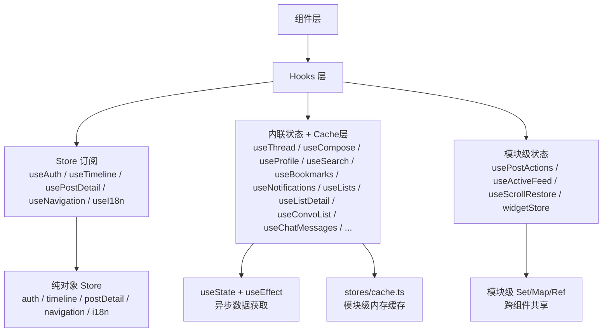

现在我已经掌握了所有变更。以下是更新后的页面：

---

# React Hooks 体系

整个 `packages/app/src/hooks/` 目录包含 25 个 React Hook，加上 `widgetRegistry.ts` 和 `widgetStore.ts` 两个模块级状态管理器，构成 PWA 和 TUI 双端共享的数据消费层。所有 Hook 遵循同一底层模式——纯对象 Store 通过单监听器订阅桥接到 React 的 `useState` 重渲染循环，或者直接使用 `useState` 内联管理异步数据。详细模式见 [Store 订阅模式](store-订阅模式.md)。



三种状态管理策略对应不同场景：**Store 订阅**用于需要被多处组件共享的全局状态（auth、timeline）；**内联状态**用于视图内一次性数据获取（profile、search、bookmarks），新引入的全局 Cache 层（`stores/cache.ts`）在内存中缓存 API 结果，组件挂载时直接恢复缓存状态；**模块级状态**用于跨组件/跨视图的共享但无需持久化的状态（post actions、scroll restore）。

[来源](packages/app/src/hooks/useAuth.ts#L6-L23) | [来源](packages/app/src/stores/auth.ts#L19-L74) | [来源](packages/app/src/hooks/usePostActions.ts#L108-L127) | [来源](packages/app/src/stores/cache.ts#L1-L18)

---

## 分类总览

| 类别 | Hooks | 数据来源 |
|------|-------|----------|
| 认证 | `useAuth` | AuthStore |
| 时间线 | `useTimeline`, `useActiveFeed` | TimelineStore / 模块级 ref |
| 帖子 | `usePostDetail`, `usePostActions` | PostDetailStore / 模块级 Set+Map |
| 线程 | `useThread` | 内联 useState + stores/cache |
| 发帖 | `useCompose`, `useDrafts` | 内联 useState / DraftStore |
| 资料 | `useProfile` | 内联 useState + stores/cache |
| 搜索 | `useSearch`, `useSearchHistory` | 内联 useState + stores/cache / localStorage |
| AI | `useAIChat`, `useTranslation` | AIAssistant 实例 / 内联缓存 |
| 私信 | `useConvoList`, `useChatMessages`, `useDmEmojiConfig` | 内联 useState / localStorage |
| 书签 | `useBookmarks` | 内联 useState + stores/cache |
| 列表 | `useLists`, `useListDetail` | 内联 useState + stores/cache |
| 社交圈 | `useSocialCircle` | 内联 useState |
| 实用工具 | `useNavigation`, `useNotifications`, `useChatHistory`, `useScrollRestore`, `useVirtualizedList`, `widgetRegistry` / `widgetStore` | 各 Store / 模块级 Map / @tanstack/react-virtual |

---

## 认证

### `useAuth`

```typescript
function useAuth(): {
  client: BskyClient | null;
  session: CreateSessionResponse | null;
  pdsUrl: string | null;
  profile: ProfileView | null;
  loading: boolean;
  error: string | null;
  errorLog: LoginErrorDetail | null;
  login: (handle: string, password: string, pdsUrl?: string) => Promise<void>;
  restoreSession: (s: CreateSessionResponse, pdsUrl: string) => void;
}
```

**说明**：通过 `createAuthStore()` 创建单例 Store，内部持有 `BskyClient` 实例。`login` 依次完成创建客户端、鉴权、获取 Profile 三个步骤。`restoreSession` 从持久化存储恢复已登录会话——如果 JWT 已过期，`getProfile()` 异步失败后将 `client` 和 `session` 置空并返回 `session_expired` 错误。返回的是 Store 属性的直接映射，非 React 代码可通过导入 `createAuthStore()` 获取相同 Store 对象。

**`errorLog`**：当登录失败时，如果异常携带 `cause` 且为 `LoginErrorDetail` 类型，`errorLog` 返回该详细结构体，供 UI 显示具体错误码或服务端提示。

[来源](packages/app/src/hooks/useAuth.ts#L6-L23) | [来源](packages/app/src/stores/auth.ts#L19-L74)

---

## 时间线

### `useTimeline`

```typescript
function useTimeline(
  client: BskyClient | null,
  feedUri?: string,           // 不传则跟随 lastGoodFeed 或加载主页时间线
): {
  posts: PostView[];
  loading: boolean;
  cursor: string | undefined;
  error: string | null;
  loadMore: (() => void) | undefined;
  refresh: (() => void) | undefined;
}
```

**说明**：通过 `createTimelineStore()` 订阅。`feedUri` 为可选的自定义 Feed（如 `at://did:plc:xxx/app.bsky.feed.generator/xxx`），留空则跟随 `lastGoodFeed` ref（导航离开/返回时不重置）。Store 内部通过 `shouldUseTimeline(feedUri)` 判断走 `client.getTimeline()` 还是 `client.getFeed()`。`loadMore` 使用 cursor 分页追加，`refresh` 重置 cursor 并重新加载。

**设计细节**：Store 在 `load()` 中内置了一次重试——首次请求若失败，等 1.5 秒后自动重试，以应对 JWT 刷新竞态。`lastGoodFeed` ref 确保导航离开/返回时不触发不必要的重置。

**典型用例**：
```tsx
const { posts, loading, loadMore, refresh } = useTimeline(client, feedUri);
```
结合虚拟滚动组件，在滚动到底时调用 `loadMore`。详见 [虚拟滚动与滚动恢复](虚拟滚动与滚动恢复.md)。

[来源](packages/app/src/hooks/useTimeline.ts#L6-L47) | [来源](packages/app/src/stores/timeline.ts#L26-L93)

### `useActiveFeed`

```typescript
function useActiveFeed(): {
  resolveFeed: (feedUri?: string | null) => string | undefined;
  recordFeed: (uri: string | undefined) => void;
  goHomeFeed: () => string | undefined;
}
```

**纯辅助 Hook**，不引发重渲染。`resolveFeed` 解析当前有效的 Feed URI（参数优先 → 模块级记忆 → 默认 Feed）。`recordFeed` 在用户切换 Feed 时调用保存记忆。`goHomeFeed` 返回配置的默认 Feed。

[来源](packages/app/src/hooks/useActiveFeed.ts#L4-L44)

---

## 帖子

### `usePostDetail`

```typescript
function usePostDetail(
  client: BskyClient | null,
  uri: string | undefined,
  goTo: (v: AppView) => void,
  aiKey: string,
  aiBaseUrl: string,
  targetLang?: string,      // 默认 'zh'
): {
  post: PostView | null;
  flatThread: string;       // 纯文本扁平线程（供 AI 上下文使用）
  loading: boolean;
  error: string | null;
  translations: Map<string, string>;
  translate: (text: string) => Promise<string>;
  actions: PostDetailActions;  // { like, repost, reply, translate, openAI, viewThread }
}
```

**说明**：通过 `createPostDetailStore()` 订阅。`flatThread` 是纯文本格式的线程拼接，专为 `useAIChat` 提供上下文。`actions` 中的 `reply` 跳转 `compose` 视图，`openAI` 跳转 `aiChat`，`translate` 调用 Store 内建的翻译方法（直接 `fetch` AI API 而非通过 `@bsky/core`）。

[来源](packages/app/src/hooks/usePostDetail.ts#L15-L71) | [来源](packages/app/src/stores/postDetail.ts#L59-L88)

### `usePostActions`

```typescript
function usePostActions(client: BskyClient | null): {
  isLiked: (uri: string) => boolean;
  isReposted: (uri: string) => boolean;
  likePost: (uri: string, cid?: string) => Promise<void>;
  repostPost: (uri: string, cid?: string) => Promise<void>;
  seedFromPosts: (posts: any[]) => void;
  seedFromPost: (post: any) => void;
}
```

**核心设计**：模块级 Set/Map 作为单一事实来源。所有赞/转发的状态（`_liked`、`_reposted`、`_likeRecords`、`_repostRecords`、`_likeCountAdj`、`_repostCountAdj`）存储在模块级变量中，通过 `notifyAll()` 触发所有监听 Hook 的 tick。`seedPostViewer(s)` 在时间线/线程加载时批量注入 API 返回的 `viewer` 状态。

**纯函数导出**：底层函数同时以纯函数形式导出（`isPostLiked`、`isPostReposted`、`likePost`、`repostPost`、`seedPostViewer`、`seedPostViewers`、`getLikeCount`、`getRepostCount`），可被任何非 React 代码导入使用（如 AI 工具系统中的 `formatPostSummary`）。

**关键行为**：like/repost 是**即时乐观更新**——调用 `likePost` 立即修改 Set 和 count 调整 Map，API 请求在后台进行。失败时仅打印错误，不回滚 UI。如果帖子已被点赞，再次调用 `likePost` 会执行取消点赞（toggle 行为），并记录/删除 `_likeRecords` 中的 record URI 以支持正确的 API 撤销。

[来源](packages/app/src/hooks/usePostActions.ts#L4-L127)

---

## 线程

### `useThread`

```typescript
function useThread(
  client: BskyClient | null,
  uri: string | undefined,
): {
  flatLines: FlatLine[];
  loading: boolean;
  error: string | null;
  focusedIndex: number;
  focused: FlatLine | undefined;
  themeUri: string | undefined;
  threadgate?: {
    rules: ThreadgateRule[];
    listInfo?: Array<{ uri: string; name: string }>;
  };
  expandReplies: () => void;
  likePost: (uri: string) => Promise<void>;
  repostPost: (uri: string) => Promise<boolean>;
  isLiked: (uri: string) => boolean;
  isReposted: (uri: string) => boolean;
  getPostView: (uri: string) => PostView | undefined;
}
```

**`FlatLine` 接口**：

```typescript
interface FlatLine {
  depth: number;               // 负数=祖先, 0=根节点, 正数=回复
  uri: string;
  cid: string;
  rkey: string;
  text: string;
  handle: string;
  displayName: string;
  authorAvatar?: string;
  hasReplies: boolean;
  imageDetails: Array<{ url: string; alt: string }>;
  externalLink: { uri: string; title: string; description: string } | null;
  hasVideo: boolean;
  videoThumbnailUrl?: string;
  videoPlaylistUrl?: string;
  videoAlt?: string;
  videoAspectRatio?: { width: number; height: number };
  quotedPost?: {
    uri: string; cid: string; text: string; handle: string;
    displayName: string; authorAvatar?: string;
    imageDetails: Array<{ url: string; alt: string }>;
    externalLink: { uri: string; title: string; description: string } | null;
  };
  isRoot: boolean;
  isTruncation: boolean;
  likeCount: number;
  repostCount: number;
  replyCount: number;
  indexedAt: string;
  threadgate?: {
    rules: ThreadgateRule[];
    listInfo?: Array<{ uri: string; name: string }>;
  };
}
```

**设计细节**：`flattenThreadTree()` 将 API 返回的嵌套 `ThreadViewPost` 树压平成基于 depth 的线性数组。`loadThread` 调用 `client.getPostThread(uri, 5, 80)` 后解析 `res.threadgate`——如果存在 `record.allow` 规则，则将其及其关联的列表信息存入 `threadgate` 状态。回复按时间升序排列。`expandReplies` 增加 `maxSiblings` 后重新展开。

**`getPostView()`**：通过 `postViewsRef` Map 返回指定 URI 的完整 `PostView`，供信息弹窗等场景使用。

[来源](packages/app/src/hooks/useThread.ts#L46-L151)

---

## 发帖

### `useCompose`

```typescript
function useCompose(
  client: BskyClient | null,
  goBack: () => void,
  onSuccess?: (uris?: string[]) => void,  // 返回已发布帖子的 URI 数组
): {
  posts: ComposePostItem[];           // [{ id, text }]
  addPost: () => void;
  removePost: (id: string) => void;
  setPostText: (id: string, text: string) => void;  // 自动截断 300 字符
  submitting: boolean;
  error: string | null;
  replyTo: string | undefined;
  setReplyTo: (uri: string | undefined) => void;
  quoteUri: string | undefined;
  setQuoteUri: (uri: string | undefined) => void;
  threadgateRules: ThreadgateRule[] | null | undefined;
  setThreadgateRules: (rules: ThreadgateRule[] | null | undefined) => void;
  submit: (mediaMap?: Map<string, ComposeMedia[]>) => Promise<void>;
  loadFromDraft: (posts, replyTo?, quoteUri?) => void;
  toDraftData: () => { posts: { text: string }[]; replyTo?: string; quoteUri?: string };
}
```

**`ComposeMedia` 接口**：`type: 'image' | 'video'` + `blobRef: { $link: string; mimeType: string; size: number }` + `alt: string`。`mediaMap` 键为帖子的 `id`，值为此帖附加的媒体文件列表。`ComposeImage` 已标记为 `@deprecated`，改用 `ComposeMedia`。

**`threadgateRules` 语义**：
- `undefined` → 所有人可回复（不创建 threadgate 记录）
- `null` → 未显式设置（等同所有人）
- `[]` → 无人可回复
- `[...rules]` → 限制为特定规则

**嵌入逻辑**：第一帖支持 `app.bsky.embed.video`（视频）、`app.bsky.embed.images`（多图）、`app.bsky.embed.record`（引用帖）以及 `app.bsky.embed.recordWithMedia`（引用帖+图片组合）。后续帖子也可携带媒体。

**Threadgate 应用**：`submit` 在第一帖发布后（且第一帖不是回复帖时）根据 `threadgateRules` 调用 `client.putThreadgate(res.uri, threadgateRules)`。

**`onSuccess` 回调**：现在接受 `uris?: string[]` 参数，包含此次发布的所有帖子的 AT URI，供调用方追踪发布结果。

**错误处理**：部分成功时（如已发布 3 篇中的前 2 篇），error 显示 `"已发布 ${created} 篇，剩余 ${remaining} 篇因错误未发布"`。

[来源](packages/app/src/hooks/useCompose.ts#L27-L248)

### `useDrafts`

```typescript
function useDrafts(client: BskyClient | null): {
  drafts: AppDraft[];
  loading: boolean;
  saving: boolean;
  saveDraft: (data, draftId?) => Promise<string>;
  deleteDraft: (id: string) => Promise<void>;
  syncDraft: (id: string) => Promise<void>;
  refreshDrafts: () => Promise<void>;
  loadDraft: (id: string) => AppDraft | undefined;
}
```

**设计细节**：通过 `createDraftsStore(client)` 创建 `DraftStore` 对象（非 React Store），Hook 通过 `useState` tick 桥接。客户端引用使用**模块级 `_clientRef`** 避免闭包过期——`useEffect` 在 `client` 变化时调用 `store.setClient(client)` 更新全局 ref。数据存储使用 `getDefaultDraftStorage()`（TUI 用文件存储，PWA 用 IndexedDB）。

**三层合并策略**：`refreshDrafts()` 先加载本地草稿 → 尝试从 PDS 拉取 → 按 `serverId` 匹配合并 → 排序输出。`AppDraft` 包含 `syncStatus: 'local' | 'synced'` 字段和 `serverId`。

[来源](packages/app/src/hooks/useDrafts.ts#L199-L241)

---

## 资料

### `useProfile`

```typescript
function useProfile(
  client: BskyClient | null,
  actor: string | undefined,          // DID 或 handle
  initialTab?: 'posts' | 'replies',   // 默认 'posts'
): {
  profile: ProfileView | null;
  loading: boolean;
  error: string | null;
  tab: 'posts' | 'replies';
  setTab: (t: 'posts' | 'replies') => void;
  posts: PostView[];
  repostReasons: Record<string, string>;  // postUri → 转发者 handle
  feedCursor: string | undefined;
  feedLoading: boolean;
  loadMoreFeed: () => void;
  isFollowing: boolean;
  handleFollow: () => Promise<void>;
  handleUnfollow: () => Promise<void>;
  followList: 'follows' | 'followers' | null;
  followItems: FollowListItem[];
  followListCursor: string | undefined;
  followListLoading: boolean;
  openFollowList: (type: 'follows' | 'followers') => Promise<void>;
  closeFollowList: () => void;
  loadMoreFollowList: () => Promise<void>;
}
```

**说明**：管理资料页面的全部状态。`loadProfile` 内建一次 1.5 秒延迟的重试，应对 JWT 刷新竞态。`loadFeed` 根据 `tab` 选择 `posts_no_replies` 或全部含回复的帖子，并解析 `reasonRepost` 构建 `repostReasons` 映射。`handleFollow`/`handleUnfollow` 在 API 调用后重新获取 Profile 以更新 `viewer.following`。

**Cache 集成**：通过 `readCache<ProfileCache>(ck)` 在挂载时恢复上次加载的 profile、posts、feedCursor、isFollowing 等信息，条件为 `hasCache(ck)` 时静默加载。Cache key 为 `profile-${actor}`。

[来源](packages/app/src/hooks/useProfile.ts#L14-L192) | [来源](packages/app/src/stores/cache.ts#L1-L18)

---

## 搜索

### `useSearch`

```typescript
type SearchTab = 'top' | 'latest' | 'users' | 'feeds';

function useSearch(
  client: BskyClient | null,
  initialTab?: SearchTab,
  initialQuery?: string,           // 初始化搜索词
): SearchState {
  query: string;
  tab: SearchTab;
  posts: PostView[];
  users: ProfileViewBasic[];
  feeds: FeedGeneratorView[];
  loading: boolean;
  search: (q: string, tab: SearchTab) => Promise<void>;
  setTab: (t: SearchTab) => void;
}
```

**说明**：`search` 方法根据 tab 调用不同 API：`top`/`latest` 走 `client.searchPosts()`（`latest` 模式传入 `sort: 'latest'`），`users` 走 `client.searchActors()`，`feeds` 先调用 `getPopularFeedGenerators()` 获取全部热门 Feed，再在客户端做 displayName/description/creator.handle 过滤（因 AT Protocol 没有 Feed 搜索端点）。

**Cache 集成**：`initialQuery` 参数支持挂载时自动恢复上次搜索结果。通过 `searchCacheKey(q, t)` 从 `stores/cache.ts` 读取缓存，silent 模式加载不触发 loading 状态。

[来源](packages/app/src/hooks/useSearch.ts#L18-L82) | [来源](packages/app/src/stores/cache.ts#L1-L18)

### `useSearchHistory`

```typescript
function useSearchHistory(tab: SearchTab): {
  history: string[];       // 最多 10 条
  add: (query: string) => void;
  remove: (query: string) => void;
  clear: () => void;
}
```

**说明**：纯 localStorage 存储，4 个 tab 各自独立。`add` 自动去重并插到队首。模块级 `_listeners` Set 实现跨组件通知——多个 `useSearchHistory` 实例之间自动同步。导出的纯函数 `addToHistory`/`removeFromHistory`/`clearHistory`/`getHistory` 可供非 React 代码调用。

[来源](packages/app/src/hooks/useSearchHistory.ts#L30-L95)

---

## AI

### `useAIChat`（核心重点）

```typescript
interface UseAIChatOptions {
  chatId?: string;              // 加载已有对话
  stream?: boolean;             // 启用流式输出（默认 false，TUI 行为）
  userHandle?: string;
  userDisplayName?: string;
  environment?: 'tui' | 'pwa';
  locale?: string;
  contextProfile?: string;      // 用户导航传递的 profile handle（非 URL）
  contextPost?: string;         // 用户导航传递的 at:// URI
  onChatSaved?: () => void;
  onTitleChanged?: () => void;
}

function useAIChat(
  client: BskyClient | null,
  aiConfig: AIConfig,
  contextUri?: string,           // 传统方式传递的上下文 URI
  options?: UseAIChatOptions,
): {
  messages: AIChatMessage[];
  loading: boolean;
  guidingQuestions: string[];
  wasRepaired: boolean;            // 新增：加载时是否修复了损坏消息
  send: (text: string) => Promise<void>;
  stop: () => void;                            // AbortController.abort()
  addUserImage: (data: Uint8Array, mimeType: string, alt: string) => number;
  chatId: string;
  pendingConfirmation: { toolName: string; description: string } | null;
  confirmAction: () => void;
  rejectAction: () => void;
  undoLastMessage: () => void;
  edit: () => string | null;
  editByIndex: (n: number) => string | null;
}
```

**核心设计**：不再接受 `storage` 参数（自动通过 `chatService.ts` 的 `saveChat`/`loadChat` 管理）。新增 `contextProfile`/`contextPost` 选项替代传统 `contextUri` 参数。`AIConfig` 新增 `visionEnabled`、`thinkingEnabled`、`provider`、`reasoningStyle`、`customSystemPrompt` 字段。

**系统提示词构建**：`buildSystemPrompt` 动态拼接以下片段（均从 `@bsky/core` 的 `prompts.ts` 导入）：
- `P_ASSISTANT_BASE` — 基础角色定义（Bluesky 助手，含搜索语法说明、图片/视频处理规则、写操作安全规则）
- `PF_CURRENT_USER` — 当前用户身份标识（handle + displayName + locale）
- `PF_PROFILE_CONTEXT` — 资料页面上下文（来自 `contextProfile`，含 `from:handle` 搜索提示）
- `PF_POST_CONTEXT` — 帖子上下文（来自 `contextPost` 或 `contextUri`）
- `PF_ENVIRONMENT` — 运行环境（TUI/PWA）
- `PF_LOCALE_HINT` — 语言偏好
- `PF_CURRENT_TIME` — 系统当前时间（含星期）
- `PF_VISION_HINT` — 视觉模式提示（引导用户开启/提醒模型能力）
- `P_CONCISE` — 简洁回答指令
- `aiConfig.customSystemPrompt` — 用户自定义提示词

[来源](packages/app/src/hooks/useAIChat.ts#L123-L144) | [来源](packages/core/src/ai/prompts.ts#L31-L143)

**消息损坏自动修复**：`useAIChat` 内建一个 **`repairCorruptedMessages()`** 修复函数（内置而非导出），用于检测并修复 pre-v0.12.2 版本产生的消息乱序问题。两种修复模式：1）移除空内容的 assistant 消息（重建加载时的假性产物）；2）重排 tool_call 块顺序：将 `[tool_calls, assistant, tool_results]` 纠正为 `[assistant, tool_calls, tool_results]`。加载会话时如果检测到需要修复，即刻修复内存并写回存储。`wasRepaired` 在修复发生时置为 `true`，供 UI 展示修复提示。

[来源](packages/app/src/hooks/useAIChat.ts#L38-L87) | [来源](packages/app/src/hooks/useAIChat.ts#L181-L188)

**上下文持久化**：`contextRef` 保存当前上下文（`{ type: 'post', uri }` 或 `{ type: 'profile', handle }`），通过 `saveChat` 写入 `ChatRecord.context` 字段。页面刷新后重新加载时，根据 `record.context` 恢复系统提示词。详见 [存储抽象层](存储抽象层.md)。

[来源](packages/app/src/hooks/useAIChat.ts#L177-L238) | [来源](packages/app/src/services/chatService.ts#L31-L64)

**Streaming 模式与非 Streaming 模式的行为差异**：

| 维度 | `stream: false`（默认，TUI） | `stream: true`（PWA） |
|------|------|------|
| API 调用 | `assistant.sendMessage(text)` | `assistant.sendMessageStreaming(text, signal)` |
| 返回形式 | 一次返回 `{ intermediateSteps, content }` | 逐 token 产出 `StreamEvent` |
| 消息更新 | 全部步骤一次性追加到 `messages` | 实时更新 `messages` 中最后一条 assistant 消息 |
| Thinking 展示 | 不展示 | `thinking` 事件实时累积到 thinking 消息 |
| 工具调用展示 | `tool_call` + `tool_result` 逐步追加 | `tool_call` 事件先清空流式内容再追加 tool_call 消息 |
| 中止能力 | `stop()` 调用 `AbortController.abort()` 即时终止 | 同左 |
| 错误处理 | 非 `aborted` 错误 → 追加 error 消息 | 同左 |

**Streaming 事件流**：`assistant.sendMessageStreaming()` 产生的 `StreamEvent` 类型包括：
- `token` — 文本片段，累积到 `streamingContent`，实时更新 UI
- `tool_call` — 追加工具调用消息（含 `toolName`、`toolCallId`）
- `tool_result` — 追加工具结果消息
- `thinking` — 累积到 thinking 消息（PWA 可展示推理过程）
- `confirmation_needed` — 写操作确认门，触发 `setPendingConfirmation`
- `done` — 流结束

[来源](packages/app/src/hooks/useAIChat.ts#L334-L416) | [来源](packages/core/src/ai/assistant.ts#L421-L644)

**自动保存**：两种模式均在消息更新后通过 `autoSave()` 写入 ChatService。`autoSave` 直接调用 `saveChat(chatIdRef.current, msgs, title, contextUri, contextRef.current)`，不再手动管理 saveVersionRef/saveQueueRef。`saveChat` 内置 **300ms 防抖**和写队列串行化（由 `chatService.ts` 的模块级 `_debounceTimers` 和 `_writeQueue` 管理）。首次助理回复后，Hook 通过 `import('@bsky/core').then(({ generateChatTitle }) => ...)` **异步生成标题**（不阻塞主流程），生成成功后调用 `saveChat` 覆盖保存。

[来源](packages/app/src/hooks/useAIChat.ts#L285-L319) | [来源](packages/app/src/services/chatService.ts#L31-L64)

**编辑/回退机制**：`editByIndex(n)` 回滚 `AIAssistant` 内部消息到第 n 条用户消息之前，并返回该消息文本。`undoLastMessage()` 回滚到最后一条用户消息。`edit()` 是 `editByIndex` 的快捷方式（定位最后一条用户消息）。三者均通过 `assistant.loadMessages(keep)` 重新加载裁剪后的消息列表，并同步 `messagesRef.current` 以确保后续 `autoSave` 不会持久化过期状态。

[来源](packages/app/src/hooks/useAIChat.ts#L538-L580)

**消息展示顺序**：`mapMessages()` 将 `AIAssistant` 内部消息转换为展示用 `AIChatMessage[]` 时，assistant 文本内容优先于 tool_call 消息排列（即 `assistant text → tool_call → tool_result`），以修正 pre-v0.12.2 版本中 tool_call 跑到 assistant 之前的乱序问题。

[来源](packages/app/src/hooks/useAIChat.ts#L479-L535)

**自动分析**：当 `options.contextProfile` 首次设置且 `messages` 为空时，500ms 延迟后自动发送 `PF_AUTO_ANALYSIS(handle)` 提示词。

[来源](packages/app/src/hooks/useAIChat.ts#L458-L467) | [来源](packages/core/src/ai/prompts.ts#L192-L194)

### `useTranslation`

```typescript
type TargetLang = 'zh' | 'en' | 'ja' | 'ko' | 'fr' | 'de' | 'es';

interface TranslationResult {
  translated: string;
  sourceLang?: string;
}

function useTranslation(
  aiKey: string,
  aiBaseUrl: string,
  aiModel?: string,              // 默认 'deepseek-v4-flash'
  targetLang?: TargetLang,       // 默认 'zh'
  initialMode?: 'simple' | 'json',  // 默认 'simple'
): {
  translate: (text: string, overrideLang?: TargetLang) => Promise<TranslationResult>;
  loading: boolean;
  cache: Map<string, TranslationResult>;
  lang: TargetLang;
  setLang: (l: TargetLang) => void;
  mode: 'simple' | 'json';
  setMode: (m: 'simple' | 'json') => void;
  LANG_LABELS: Record<TargetLang, string>;
}
```

**双模式行为**：`simple` 模式直接返回翻译文本；`json` 模式使用 `response_format: "json_object"` 返回 `{translated, source_lang}` 结构。底层动态导入 `@bsky/core` 的 `translateText()`，该函数具备最多 3 次指数退避重试（基础间隔 800ms），遇空内容、缺少 translated 字段、JSON 解析失败时触发重试。

**`LANG_LABELS`**：从 `@bsky/core` 导出，支持 7 个语言标签的本地化显示。

[来源](packages/app/src/hooks/useTranslation.ts#L22-L54) | [来源](packages/core/src/ai/assistant.ts#L727-L795)

---

## 私信（DM）

### `useConvoList`

```typescript
function useConvoList(client: BskyClient | null): {
  convos: ConvoView[];
  cursor?: string;
  loading: boolean;
  error: string | null;
  load: (reset?: boolean) => Promise<void>;   // false 时分页追加
  refresh: () => Promise<void>;
}
```

**说明**：通过 `client.listConvos(30, cursor)` 获取会话列表。内置 **30 秒静默轮询**，不触发 loading 状态。模块级 `_clearUnread` 函数支持乐观清除未读——`DMChatPage` 调用 `markConvoRead(convoId)` 后，`useConvoList` 立即将该会话的 `unreadCount` 置零。

**导出 `markConvoRead`**：纯函数形式导出，可被任何组件直接引用。

[来源](packages/app/src/hooks/useConvoList.ts#L10-L75)

### `useChatMessages`

```typescript
function useChatMessages(client: BskyClient | null): {
  messages: AnyChatMessage[];         // MessageView | DeletedMessageView | SystemMessageView
  convo: ConvoView | null;
  loading: boolean;
  sending: boolean;
  error: string | null;
  loadConvo: (conversationId: string, reset?: boolean) => Promise<void>;
  loadOlder: () => Promise<void>;
  sendMessage: (text: string, embed?: MessageInput['embed']) => Promise<void>;
  toggleReaction: (messageId: string, value: string, isPresent: boolean) => Promise<void>;
  refresh: () => Promise<void>;
  deleteMessage: (messageId: string) => Promise<void>;
  markRead: () => Promise<void>;
  muteConvo: () => Promise<void>;
  unmuteConvo: () => Promise<void>;
}
```

**说明**：`loadConvo(id)` 先通过 `client.getConvoForMembers([did])` 获取或创建会话，再 `getMessages(convoId, 30)` 获取消息（结果反转以按时间升序排列）。内置 **10 秒静默轮询**检测新消息，通过比对 `lastMsgIdRef` 决定是否更新 UI。

**导出 `parsePostUri()`**：纯函数解析三种 URI 格式：`at://did:plc:xxx/...`、`at://handle/...`、`https://bsky.app/profile/handle/post/rkey`，用于 DM 中嵌入帖子链接的自动识别。

详见 [Direct Messages 私信系统](direct-messages-私信系统.md)。

[来源](packages/app/src/hooks/useChatMessages.ts#L9-L184)

### `useDmEmojiConfig`

非典型纯函数模块——主要提供 `getDmEmojiConfig()`/`saveDmEmojiConfig()` 等纯函数和 `fetchAllEmojis()`（从 `/emoji.txt` 加载全量 Emoji，支持肤色变体分组）。Emoji 配置存储在 localStorage，键 `bsky_dm_emoji`。`EmojiItem` 接口包含 `key`、`emoji`、`hasVariants`、`variants` 字段，肤色变体自动聚合到基础 Emoji 下。

[来源](packages/app/src/hooks/useDmEmojiConfig.ts#L1-L74)

---

## 书签

### `useBookmarks`

```typescript
function useBookmarks(client: BskyClient | null): {
  bookmarks: PostView[];
  loading: boolean;
  error: string | null;
  isBookmarked: (uri: string) => boolean;
  addBookmark: (uri: string, cid: string) => Promise<void>;
  removeBookmark: (uri: string) => Promise<void>;
  toggleBookmark: (uri: string, cid: string) => Promise<void>;
  refresh: () => Promise<void>;
}
```

**说明**：`isBookmarked` 是同步 `Set.has()` 操作。`toggleBookmark` 内部判断当前状态后调用 add/remove。书签存储于服务端 `app.bsky.graph.bookmark` 集合，通过 `client.getBookmarks(50)` 加载。**Cache 集成**：通过 `readCache<BookmarkCache>(CACHE_KEY)` 在挂载时恢复 `bookmarks`、`bookmarkedUris` 和 `cursor`。

[来源](packages/app/src/hooks/useBookmarks.ts#L5-L72) | [来源](packages/app/src/stores/cache.ts#L1-L18)

---

## 列表

### `useLists`

```typescript
function useLists(client: BskyClient | null, actor?: string): {
  lists: ListView[];
  loading: boolean;
  error: string | null;
  createList: (name: string, purpose: ListPurpose, description?: string) => Promise<ListView | null>;
  deleteList: (uri: string) => Promise<void>;
  updateListInfo: (uri: string, params: { name?: string; description?: string }) => Promise<void>;
  refresh: () => Promise<void>;
}
```

**说明**：获取指定 actor 的所有订阅列表。`actor` 可选，不传则取当前登录用户（通过 `client.getHandle()`）。`createList` 在 API 返回后构造本地 `ListView` 对象并乐观插入列表头部。**Cache 集成**：Cache key 为 `lists-${actor ?? 'self'}`。

[来源](packages/app/src/hooks/useLists.ts#L5-L93) | [来源](packages/app/src/stores/cache.ts#L1-L18)

### `useListDetail`

```typescript
function useListDetail(client: BskyClient | null, listUri: string): {
  list: ListView | null;
  loading: boolean;
  error: string | null;
  members: ListItemView[];
  membersCursor: string | undefined;
  loadMoreMembers: () => Promise<void>;
  feed: PostView[];
  feedCursor: string | undefined;
  loadMoreFeed: () => Promise<void>;
  isMuted: boolean;
  toggleMute: () => Promise<void>;
  addMember: (subjectDid: string) => Promise<void>;
  removeMember: (itemUri: string) => Promise<void>;
  updateListInfo: (params) => Promise<void>;
  deleteList: () => Promise<void>;
  refresh: () => Promise<void>;
}
```

**说明**：同时管理成员列表和列表 Feed 两种数据，两者独立分页。`load()` 通过 `Promise.all` 并行获取列表详情和 Feed。`toggleMute` 调用 `muteActorList`/`unmuteActorList`。**Cache 集成**：Cache key 为 `listDetail-${listUri}`。

[来源](packages/app/src/hooks/useListDetail.ts#L5-L148) | [来源](packages/app/src/stores/cache.ts#L1-L18)

---

## 社交圈

### `useSocialCircle`

```typescript
function useSocialCircle(client: BskyClient | null): {
  state: SocialCircleState;
  analyze: (options: SocialCircleOptions) => Promise<void>;
  reset: () => void;
}

interface SocialCircleState {
  status: 'idle' | 'loading' | 'done' | 'error';
  progress: SocialCircleProgress;    // { phase, current, total }
  result: SocialCircleResult | null;
  error: string | null;
}

interface SocialCircleOptions {
  handle: string;
  maxPosts?: number;   // 默认 50
}

interface SocialCircleResult {
  summary: SocialCircleSummary;
  core: InteractorInfo[];
  extended: InteractorInfo[];
  potential: InteractorInfo[];
  mermaidCode: string;
}
```

**分析管线**（6 个阶段，串行执行，通过 `progress` 实时反馈）：
1. **Identity** — `client.resolveHandle(handle)` 获取 DID
2. **Mutual Check** — 并行获取 `getFollows` + `getFollowers`（各 100 条），构建互关集合
3. **Posts** — `getAuthorFeed` 获取帖子（不含转发）
4. **Interactions** — 逐帖获取 `getLikes`/`getRepostedBy`，以及 Top 5 回复作者的 `getPostThread`，聚合所有互动者
5. **Outgoing** — `getActorLikes` 获取用户自己对别人的点赞
6. **Graph** — `getRelationships` 确定前 30 位互动者的互关关系，按加权总分排序并分类到 core/extended/potential

**纯函数导出**：`INTERACTION_WEIGHTS`（赞×1.5、转发×2.0、回复×3.0）、`computeWeight()`、`computeIncomingWeight()`、`computeOutgoingWeight()`、`aggregateInteractions()`、`generateSocialGraphMermaid()`、`buildSocialCircleShareText()` 均可被 AI 工具系统复用。

详见 [AT Play 实验功能](at-play-实验功能.md)。

[来源](packages/app/src/hooks/useSocialCircle.ts#L59-L135)

---

## 实用工具

### `useNavigation`

```typescript
function useNavigation(): {
  currentView: AppView;
  canGoBack: boolean;
  goTo: (v: AppView) => void;
  goBack: () => void;
  goHome: () => void;
}
```

通过 `createNavigation()` Store 订阅（来自 `state/navigation.js`），管理视图栈。`AppView` 为联合类型（见 [导航状态机](导航状态机.md)）。

[来源](packages/app/src/hooks/useNavigation.ts#L5-L20)

### `useNotifications`

```typescript
function useNotifications(client: BskyClient | null): {
  notifications: Notification[];
  loading: boolean;
  unreadCount: number;
  error: string | null;
  refresh: () => Promise<void>;
}
```

`unreadCount` 在客户端计算（`notifications.filter(n => !n.isRead).length`）。通过 `client.listNotifications(30)` 加载，内建一次 1.5 秒重试。**Cache 集成**：Cache key 为 `notifications`，条件为 `hasCache(CACHE_KEY)` 时静默加载。

[来源](packages/app/src/hooks/useNotifications.ts#L5-L45) | [来源](packages/app/src/stores/cache.ts#L1-L18)

### `useChatHistory`

```typescript
function useChatHistory(storage?: ChatStorage): {
  conversations: ChatSummary[];
  loading: boolean;
  loadConversation: (id: string) => Promise<ChatRecord | null>;
  saveConversation: (chat: ChatRecord) => Promise<void>;
  deleteConversation: (id: string) => Promise<void>;
  refresh: () => Promise<void>;
  storage: ChatStorage;
}
```

**说明**：不传 `storage` 时自动使用 `getChatStorage()`（来自 `chatService.ts`，TUI 使用 `FileChatStorage`，PWA 使用 `IndexedDBChatStorage`，需通过 `initChatService()` 在启动时注册）。`saveConversation` 和 `deleteConversation` 调用后自动 `refresh()` 更新列表。`loadConversation`/`saveConversation`/`deleteConversation` 委托给 `chatService.ts` 的 `loadChat`/`saveChatNow`/`deleteChat` 函数——注意 `saveConversation` 直写存储而不走防抖队列，适合手动触发的保存操作。

[来源](packages/app/src/hooks/useChatHistory.ts#L5-L39)

### `useI18n`

```typescript
function useI18n(initialLocale?: Locale): {
  t: (key: string, params?: Record<string, string | number>) => string;
  locale: string;
  setLocale: (l: Locale) => void;
  availableLocales: Locale[];
  localeLabels: Record<Locale, string>;
}
```

通过 `getI18nStore()` 单例 Store 订阅（来自 `i18n/store.ts`）。支持三语言（zh/en/ja）运行时切换与插值语法。详见 [国际化（i18n）系统](国际化-i18n-系统.md)。

[来源](packages/app/src/i18n/useI18n.ts#L6-L20)

### `useScrollRestore`

```typescript
function useScrollRestore(
  key: string | undefined,  // 视图唯一键（如 'profile-actor'）
  scrollRef: any,           // 滚动容器 ref（null = 全局 scroll）
  ready: boolean,           // 数据是否就绪
): void
```

在组件挂载时恢复滚动位置（从模块级 `_scrollTops` Map 读取），卸载时保存当前滚动位置。仅首次 mount 恢复一次（`restored` ref 保护）。导出的纯函数 `saveScrollTop()`/`getScrollTop()` 可供非 React 代码使用。

[来源](packages/app/src/hooks/useScrollRestore.ts#L28-L51)

### `useVirtualizedList`

```typescript
function useVirtualizedList<T>(
  items: T[],
  cacheKey: string,
  estimateHeight: number,
  getItemKey: (item: T) => string,
  options?: {
    overscan?: number;
    initialScrollTop?: number;
    onScrollTopChange?: (top: number) => void;
  },
): {
  scrollRef: React.RefObject<HTMLDivElement>;
  virtualizer: ReturnType<typeof useVirtualizer>;
  measureAndCache: (el: HTMLDivElement | null, item: T) => void;
}
```

**说明**：封装 `@tanstack/react-virtual`，提供尺寸缓存和滚动位置实时回调。全局 `_heightCaches`（`Map<id, Map<itemKey, height>>`）跨视图保留测量过的元素高度，避免列表项尺寸跳动。`measureAndCache` 在组件渲染时调用，实测量后更新对应 item 的缓存高度。

**典型用例（FeedTimeline 模式）**：
```tsx
const { scrollRef, virtualizer, measureAndCache } = useVirtualizedList(
  posts, 'timeline-main', 120, p => p.uri,
  { onScrollTopChange: saveScrollTop },
);
```

详见 [虚拟滚动与滚动恢复](虚拟滚动与滚动恢复.md)。

[来源](packages/app/src/hooks/useVirtualizedList.ts#L6-L69)

### `registerWidget` / Widget 辅助函数

```typescript
// widgetRegistry.ts
function registerWidget(def: WidgetDefinition, render: (props: WidgetProps) => ReactNode): void;
function getWidget(id: string): WidgetEntry | undefined;
function getWidgets(): WidgetEntry[];
function getWidgetsForView(viewType: string): WidgetEntry[];

// widgetStore.ts
function getEnabledWidgetIds(): string[];
function isWidgetEnabled(id: string): boolean;
function enableWidget(id: string): void;
function disableWidget(id: string): void;
function toggleWidget(id: string): boolean;
function getEnabledWidgetsForView(viewType: string): (WidgetDefinition & { enabled: boolean })[];
function initEnabledWidgets(ids: string[]): void;
function setWidgetToggleCallback(fn: ((id: string) => void) | null): void;
function initAIChatSession(): string;
function getAIChatSessionId(): string;
function setAIChatSessionId(id: string): void;
function resetAIChatSession(): string;
function setComposeDraftForWidgets(text: string): void;
function getComposeDraftForWidgets(): string;
function registerComposeDraftSetter(fn: ((text: string) => void) | null): void;
function replaceComposeDraft(text: string): void;
function setFocusedProfileActor(actor: string | null): void;
function getFocusedProfileActor(): string | null;
```

`widgetStore` 维护了 AI Chat 会话 ID 的桥接、ComposePage 草稿桥接以及 `FocusedProfileActor` 桥接（供右侧栏 Profile 预览 Widget 使用）。`WidgetContext` 接口提供 `composeDraft`、`onComposeDraftChange`、`viewType`、`client`、`threadUri` 等上下文。`WidgetDefinition` 新增 `headerButtons` 字段。详见 [Widget 组件系统](widget-组件系统.md)。

[来源](packages/app/src/hooks/widgetRegistry.ts#L44-L58) | [来源](packages/app/src/hooks/widgetStore.ts#L1-L73)

---

## Cache 层模式

多个 Hook（`useProfile`、`useBookmarks`、`useNotifications`、`useLists`、`useListDetail`、`useSearch`）共享同一内存缓存机制：

```typescript
// stores/cache.ts
readCache<T>(key: string): T | undefined
writeCache<T>(key: string, data: T): void
hasCache(key: string): boolean
clearCache(key: string): void
```

**模式**：Hook 在 `useState` 初始化时调用 `readCache` 恢复上次数据，将 `loading` 初始化为 `!hasCache(key)`。`load()` 成功后将最新数据通过 `writeCache` 写入。缓存仅在内存中存在，页面刷新后丢弃。此模式消除挂载时的白屏闪烁，同时不引入持久化复杂度。

[来源](packages/app/src/stores/cache.ts#L1-L18)

---

## 推荐阅读

- [Store 订阅模式](store-订阅模式.md) — 理解纯对象 Store + 单监听器 Subscribe 的实现原理
- [三层架构详解](三层架构详解.md) — Hook 层在整个架构中的位置（core → app → tui/pwa）
- [AI 对话引擎](ai-对话引擎.md) — `AIAssistant` 类的多轮工具调用循环实现
- [33 个 AI 工具系统](33-个-ai-工具系统.md) — `createTools` 工厂函数，被 `useAIChat` 内部调用
- [AI 系统提示词与多提供商](ai-系统提示词与多提供商.md) — 集中式提示词管理、多 LLM 提供商注册表
- [Direct Messages 私信系统](direct-messages-私信系统.md) — DM 相关 Hook 背后的协议实现
- [AT Play 实验功能](at-play-实验功能.md) — 社交圈分析的数据管线与权重图构建
- [虚拟滚动与滚动恢复](虚拟滚动与滚动恢复.md) — `useVirtualizedList` 与 `useScrollRestore` 的协作模式
- [Widget 组件系统](widget-组件系统.md) — 注册表、启闭管理与 ComposePage/AIChat 桥接