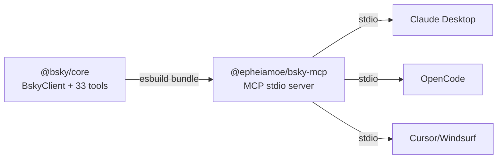
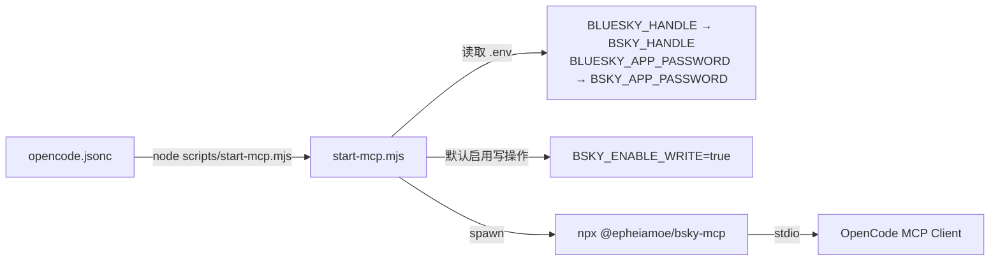

现在我已完全掌握当前代码状态。以下是更新后的 Wiki 页面。

---

# MCP 服务器

> **包名**: `@epheiamoe/bsky-mcp`（npm）/ `packages/mcp`（monorepo）
> **版本**: 0.1.3
> **状态**: 已发布，已验证可运行

---

## 动机

外部 AI 客户端（Claude Desktop、ChatGPT、VS Code、Cursor、Windsurf、OpenCode）都支持 MCP 协议以连接第三方工具。本项目有 33 个 AI 工具被封装在 `@bsky/core` 中，通过 MCP 服务器导出后，任何 MCP 兼容的 AI 客户端都可以直接使用这些工具与 Bluesky 交互。 [来源](docs/MCP.md#L9-L11)

---

## 架构

```
@bsky/core (BskyClient + 33 个工具)
    └── @epheiamoe/bsky-mcp (MCP stdio 服务器)
            └── 外部 MCP 客户端 (Claude Desktop, OpenCode 等)
```



### 依赖策略

- `@bsky/mcp` **仅在构建时**依赖 `@bsky/core`（`devDependencies: workspace:*`）
- 构建时，esbuild 将 `@bsky/core` 和 `@bsky/ddg-search` 打包成一个 96 KB 的单文件
- **运行时**仅需 3 个 npm 包：`@modelcontextprotocol/sdk`、`dotenv`、`ky`
- 无需将 `@bsky/core` 发布到 npm

[来源](packages/mcp/package.json#L14-L24)

### 构建流程

```
src/*.ts → tsc --noEmit (仅类型检查)
        → esbuild (打包 + 可选压缩)
           ├── bundle: @bsky/core + @bsky/ddg-search
           ├── external: @modelcontextprotocol/sdk, dotenv, ky
           └── output: dist/index.js (96 KB, 自包含)
```

[来源](packages/mcp/esbuild.config.mjs#L7-L28)

### 启动流程

```
npx @epheiamoe/bsky-mcp
  └── packages/mcp/src/index.ts
       └── main()
            ├── loadConfig() — 从环境变量读取配置
            ├── new BskyClient() — 初始化 AT Protocol 客户端
            ├── client.login() — 登录 Bluesky
            ├── getMcpTools() — 获取工具定义
            ├── Server.setRequestHandler(ListToolsRequestSchema)
            ├── Server.setRequestHandler(CallToolRequestSchema)
            └── StdioServerTransport — 通过 stdio 通信
```

[来源](packages/mcp/src/index.ts#L11-L45) [来源](packages/mcp/src/server.ts#L11-L45)

---

## 实现细节

### 工具映射

核心的 `createTools(client)` 函数返回 33 个 `ToolDescriptor`，MCP 层将其转换为标准 MCP 工具模式。 [来源](packages/core/src/ai/tools.ts#L75-L76)

```typescript
createTools(client: BskyClient) → ToolDescriptor[] (33 个工具)
  → filter by BSKY_ENABLE_WRITE gate
  → map 到 MCP tool schema (name, description, inputSchema)
  → 注册 via Server.setRequestHandler(ListToolsRequestSchema)
  → 分发 via Server.setRequestHandler(CallToolRequestSchema)
```

[来源](packages/mcp/src/tools.ts#L23-L39) [来源](packages/mcp/src/server.ts#L34-L41)

### 处理器适配器

在 MCP 上下文中，`assistant` 参数为 `undefined`，因为外部 AI 客户端不共享内部 `AIAssistant` 实例。调用时使用 try-catch 包裹以确保稳定的 JSON 错误响应。 [来源](packages/mcp/src/tools.ts#L41-L80)

```typescript
// 内部处理器: (params, assistant?) → Promise<string>
// MCP 处理器:  (args) → Promise<{ content: { type: 'text', text: string }[] }>
async function callTool(name, args, descriptors, client, enableWrite) {
  const tool = descriptors.find(d => d.definition.name === name);
  if (!tool) return { error: `Unknown tool: ${name}` };
  if (tool.requiresWrite && !enableWrite) return { error: '写工具已禁用' };
  try {
    const jsonText = await tool.handler(args, undefined); // 无 assistant
    return { content: [{ type: 'text', text: jsonText }] };
  } catch (err) {
    return { content: [{ type: 'text', text: JSON.stringify({ error: err.message }) }] };
  }
}
```

[来源](packages/mcp/src/tools.ts#L57-L79)

### 完整工具清单

> 共 **27 个读工具** + **6 个写工具** = **33 个工具**。写工具默认隐藏，通过 `BSKY_ENABLE_WRITE=true` 暴露。

#### 读工具（27 个）

| 工具名 | 类别 | 说明 |
|--------|------|------|
| `resolve_handle` | 身份解析 | 将 handle (alice.bsky.social) 解析为 DID |
| `get_record` | 记录读取 | 通过完整 AT URI 获取任意类型的原始记录 |
| `list_records` | 记录枚举 | 列出仓库集合中的所有记录，支持游标分页 |
| `search_posts` | 搜索 | 关键词搜索帖子，支持 Lucene 语法和排序 |
| `get_timeline` | 时间线 | 获取已认证用户的主页时间线 |
| `get_author_feed` | 用户内容 | 获取指定用户的所有帖子，支持 `actor='me'` |
| `get_popular_feed_generators` | 订阅源 | 获取热门 Feed Generator 列表 |
| `get_feed_generator` | 订阅源详情 | 获取指定 Feed Generator 的详细信息 |
| `get_feed` | 订阅源内容 | 从指定 Feed Generator 获取帖子 |
| `get_post_thread` | 帖子线程 | 获取帖子线程，支持 flat/tree/subtree 三种格式 |
| `get_post_context` | 帖子上下文 | 获取帖子的完整上下文（父链+回复+媒体） |
| `get_post_interactions` | 互动查看 | 查看帖子的点赞/转发的用户列表 |
| `get_quotes` | 引用查看 | 查找引用指定 URI 的帖子 |
| `search_actors` | 用户搜索 | 按名称/handle/关键词搜索用户 |
| `get_profile` | 用户资料 | 获取用户个人资料，支持 `actor='me'` |
| `get_connections` | 社交关系 | 查看关注/粉丝列表，支持分页 |
| `get_suggested_follows` | 推荐关注 | 获取系统推荐关注的用户 |
| `list_notifications` | 通知 | 获取已认证用户的通知列表 |
| `extract_images_from_post` | 图片提取 | 从帖子中提取图片的 DID + CID 引用 |
| `download_image` | 图片下载 | 下载帖子图片到本地 Downloads 文件夹 |
| `view_image` | 图片查看 | 供视觉模型使用的图片查看工具 |
| `extract_external_link` | 链接提取 | 提取帖子中的外链卡片信息 |
| `fetch_web_markdown` | 网页抓取 | 通过 r.jina.ai 代理将网页转为 Markdown |
| `search_web_ddg` | 网页搜索 | 通过 DuckDuckGo 进行网页搜索（0 配置） |
| `search_wikipedia` | 知识查询 | 搜索 Wikipedia 并返回摘要（0 配置） |
| `get_lists` | 列表查询 | 获取用户创建的所有列表（策展/管理） |
| `get_list_feed` | 列表内容 | 获取列表成员的最新帖子集合 |

[来源](packages/core/src/ai/tools.ts#L75-L1126)

#### 写工具（6 个）

| 工具名 | 说明 |
|--------|------|
| `create_post` | 发帖/回复/引用，支持图片和 Threadgate 设置 |
| `like` | 点赞帖子 |
| `repost` | 转发帖子 |
| `follow` | 关注用户 |
| `create_list` | 创建用户列表（策展/管理） |
| `edit_list_members` | 添加/移除列表成员 |

[来源](packages/core/src/ai/tools.ts#L782-L1125)

### 写操作门

写操作通过双层防护控制：

1. **注册时过滤**：`getMcpTools()` 根据 `enableWrite` 决定是否将写工具加入工具列表
2. **调用时二次确认**：`callTool()` 中再次检查 `tool.requiresWrite && !enableWrite`，返回错误
3. **命名标记**：写工具的描述前会加上 `[WRITE]` 前缀，帮助客户端区分

写工具集合在 `WRITE_TOOL_NAMES` 中集中定义。 [来源](packages/mcp/src/tools.ts#L4-L11)

### 环境变量

| 变量 | 必需 | 用途 | 默认值 |
|------|:----:|------|:------:|
| `BSKY_HANDLE` | 是 | Bluesky 用户名 (handle) | — |
| `BSKY_APP_PASSWORD` | 是 | Bluesky 应用密码 | — |
| `BSKY_PDS` | 否 | 自定义 PDS 地址 | `https://bsky.social` |
| `BSKY_ENABLE_WRITE` | 否 | 设置为 `"true"` 暴露写工具 | `"false"` |

[来源](packages/mcp/src/config.ts#L1-L25)

---

## OpenCode 集成

### Launcher 脚本方案

OpenCode 支持 `{env:VAR}` 引用传递环境变量给 MCP 子进程，但存在以下问题：
- `.env` 文件不会自动加载到进程环境
- PowerShell 中的 `$env:VAR = value` 不会在 `bash` 工具调用间持久化（每次调用都是新进程）
- 结果：MCP 服务器启动时环境变量为空 → 登录失败

**解决方案**：使用 `scripts/start-mcp.mjs` 启动器脚本，加载 `.env` 后再启动 MCP 服务器： [来源](scripts/start-mcp.mjs#L1-L43)



**关键特性**：
- 自动从 `.env` 读取 `BLUESKY_HANDLE` 和 `BLUESKY_APP_PASSWORD`，映射为 `BSKY_*` 环境变量
- **默认将 `BSKY_ENABLE_WRITE` 设为 `"true"`**，使客户端默认拥有写权限
- Windows 上使用 `shell: true`，因为 `npx` 是 `.cmd` 脚本而非原生二进制文件

[来源](scripts/start-mcp.mjs#L10-L33)

### OpenCode 配置

```jsonc
{
  "$schema": "https://opencode.ai/config.json",
  "mcp": {
    "bsky": {
      "type": "local",
      "command": ["node", "scripts/start-mcp.mjs"],
      "enabled": true
    }
  }
}
```

[来源](opencode.jsonc#L1-L10)

---

## 已知限制与设计决策

### 无 `assistant` 上下文

`view_image` 和 `create_post` 中的 `assistant.getUserUpload(index)` 用于获取聊天中用户上传的图片。在 MCP 上下文中，`assistant` 为 `undefined`，因此通过 `uploadIndex` 路径访问图片会返回错误。DID/CID 路径（Bluesky 帖子中的图片）正常工作。 [来源](packages/core/src/ai/tools.ts#L616-L619)

### 分页

所有带 `cursor` 的工具都会在响应中返回 `cursor`。LLM 客户端自行决定是否继续请求下一页。无需自动分页——让 AI 客户端掌控节奏。

### 无交互式确认

MCP 协议原生不支持确认对话框。写操作仅由 `BSKY_ENABLE_WRITE` 环境变量控制，无逐操作确认。需要更安全的两阶段确认见下方「未来规划」。

### bin 移除警告

在 Windows 上 `npm publish` 时会出现 `"bin[bsky-mcp]" script name dist/index.js was invalid and removed` 警告，但发布的包**确实包含**正确的 bin 入口。这只是外观警告，不影响功能。 [来源](docs/MCP.md#L153-L154)

### Workspace 依赖处理

`@bsky/core` 使用 `workspace:*` 协议（仅 pnpm 可用），直接发布到 npm 会导致最终用户安装失败。esbuild 将 workspace 依赖打包进 dist，仅留下 npm 注册表包作为运行时依赖。 [来源](docs/MCP.md#L156-L157)

---

## 经验教训

1. **`{env:VAR}` 读取进程环境变量，不是 `.env` 文件** —— 需要启动器脚本或系统环境变量
2. **bash 工具调用是全新进程** —— 一次调用设置的环境变量不会传递到下一次
3. **`npm publish` 在 Windows 上移除 bin 但发布正确** —— 仅是外观警告，注册表中的 bin 完好
4. **`workspace:*` 不能发布到 npm** —— 必须打包或单独发布
5. **`spawn(npx, ...)` 在 Windows 上需要 `shell: true`** —— npx 是 .cmd 脚本，不是原生二进制
6. **esbuild 打包比多包发布更简单** —— 单个 96 KB 文件，无依赖链

[来源](docs/MCP.md#L161-L168)

---

## 未来规划

- [ ] v0.2.0: MCP Resource 支持（将 Feed/List 暴露为资源）
- [ ] v0.2.0: MCP Sampling 用于写操作确认（两阶段）
- [ ] v0.2.0: 大结果集的自动分页
- [ ] v0.3.0: 多账户支持
- [ ] 注册到 Smithery / MCP Hub 目录

---

## 相关页面

- [33 个 AI 工具系统](33-个-ai-工具系统.md)——每个工具的详细定义、输入输出和 handler 实现
- [AI 对话引擎](ai-对话引擎.md)——`AIAssistant` 类的多轮工具调用循环和写操作确认门机制
- [AT Protocol 客户端](at-protocol-客户端.md)——`BskyClient` 的会话管理和 PDS 发现
- [环境配置详解](环境配置详解.md)——`.env` 文件的完整变量说明
- [三层架构详解](三层架构详解.md)——core → app → tui/pwa 的分层设计哲学

---

*最后更新: 2026-05-13*