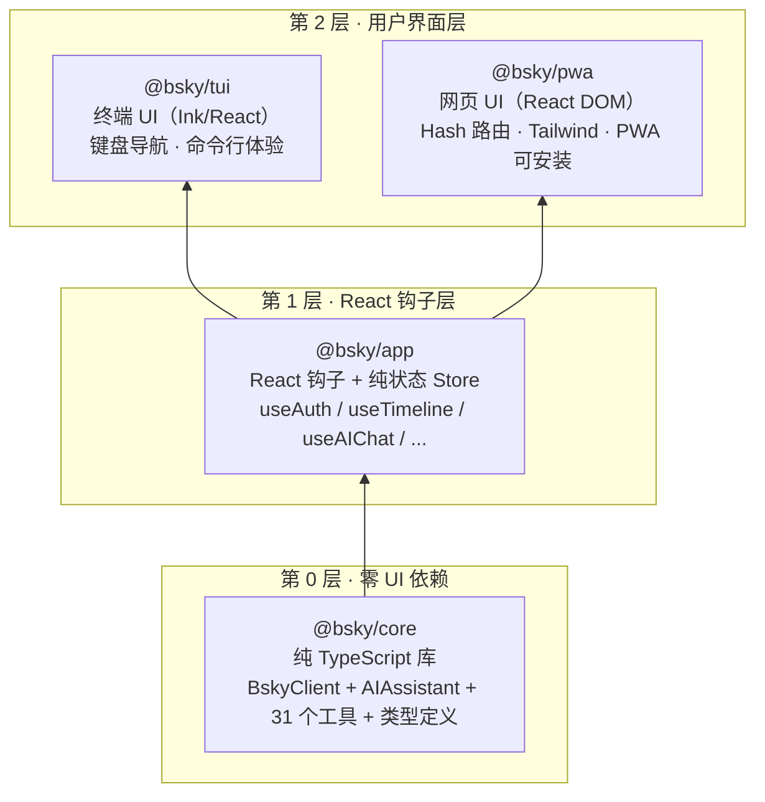

欢迎来到 **bsky** 项目——一个为 Bluesky 社交网络构建的、拥有**双用户界面**（终端 TUI + 网页 PWA）的客户端，并且内置了**深度 AI 集成能力**。无论你是刚接触 AT 协议（即 Bluesky 底层协议"认证传输协议"）的新手，还是对 AI 工具调用体系感兴趣，本指南都将帮你建立对项目的全局认知。

Bsky 不是官方客户端的简单克隆，而是在三个方面超越了官方客户端：它提供了**终端界面**供开发者/高级用户高效浏览，也提供了**可安装的 PWA 网页应用**供日常使用，并且深度集成了 AI 对话、智能翻译、草稿润色等官方客户端根本不存在的功能。

Sources: [README.md](README.md#L1-L5), [docs/ARCHITECTURE.md](docs/ARCHITECTURE.md#L1-L10)

---

## 项目核心：一条黄金法则

这个项目遵循一条基本原则，理解它就能理解全部架构：

> **业务逻辑只写一次，TUI 和 PWA 只是纯渲染层。**

换句话说，所有 AT 协议通信（调用 Bluesky API 获取时间线、发送帖子等）、AI 对话引擎、31 个 AI 工具、国际化系统——所有这些核心代码都只存在于 `@bsky/core` 和 `@bsky/app` 两个包中。终端界面（TUI）和网页界面（PWA）仅仅是两个不同的"皮肤"，共享同一套底层逻辑。

以下是项目全景目录：

```
bsky/
├── packages/
│   ├── core/         ← 第 0 层：零 UI 依赖，纯 TypeScript
│   ├── app/          ← 第 1 层：React 钩子 + 纯状态管理
│   ├── tui/          ← 第 2 层：Ink/React 终端 UI（TUI）
│   └── pwa/          ← 第 2 层：React DOM 网页应用（PWA）
├── contracts/        ← JSON Schema、系统提示词、工具定义
├── docs/             ← 全部文档（你正在阅读的 wiki 的源材料）
└── package.json      ← 根工作区配置文件
```

Sources: [docs/ARCHITECTURE.md](docs/ARCHITECTURE.md#L8-L24), [pnpm-workspace.yaml](pnpm-workspace.yaml#L1-L4)

---

## 架构全景：三层依赖体系

理解架构的最快方式是看一个依赖流向图。整个项目是 **pnpm 单体仓库**（monorepo），包含 4 个包，遵循严格的**单向依赖**原则：



**为什么这样分层？** 因为 `@bsky/core` 没有任何 UI 依赖，它可以在任何 JavaScript 环境下运行——Node.js 脚本、React Native 应用、甚至 Deno。`@bsky/app` 层封装了所有 React 钩子和状态管理，这意味着 TUI 和 PWA 共同使用完全相同的 `useAIChat`、`useAuth`、`useTimeline` 等钩子。当需要修复一个 Bug 或添加新功能时，你只需要改动一处代码，两个界面同时受益。

Sources: [docs/ARCHITECTURE.md](docs/ARCHITECTURE.md#L26-L46), [README.md](README.md#L148-L161)

---

## 包详解

### @bsky/core — 核心引擎

这是整个项目的心脏，零 UI 依赖（甚至不依赖 React）。它包含：

| 模块 | 文件 | 职责 |
|------|------|------|
| **BskyClient** | [client.ts](packages/core/src/at/client.ts#L1-L385) | AT 协议 HTTP 客户端，双端点架构（bsky.social + public.api.bsky.app），自动 JWT 刷新 |
| **31 个 AI 工具** | [tools.ts](packages/core/src/at/tools.ts#L1-L898) | 31 个 Bluesky 操作工具，分为只读工具（read）和写工具（write），写工具需要用户确认 |
| **AIAssistant** | [assistant.ts](packages/core/src/ai/assistant.ts#L1-L688) | AI 对话引擎：多轮工具调用循环（最多 10 轮）、写操作确认门、流式输出 |
| **类型定义** | [types.ts](packages/core/src/at/types.ts#L1-L260) | PostView、ProfileView、ThreadViewPost 等所有 AT 协议类型 |

`@bsky/core` 仅依赖两个运行时包：`ky`（轻量 HTTP 客户端）和 `dotenv`（环境变量加载）。

Sources: [packages/core/package.json](packages/core/package.json#L1-L32), [packages/core/src/index.ts](packages/core/src/index.ts#L1-L25)

### @bsky/app — React 钩子层

这一层封装了所有 React 钩子和纯状态管理，是 TUI 和 PWA 共享的核心逻辑层。它导出了 15+ 个钩子和一系列状态 Store。

**状态管理**采用**单向监听器 Store 模式**——每个 Store 就是一个纯对象 + 订阅列表，不依赖 Redux 或 Zustand，简单高效。

**核心钩子清单**：

| 钩子 | 文件 | 用途 |
|------|------|------|
| `useAuth` | [useAuth.ts](packages/app/src/hooks/useAuth.ts#L1-L23) | 登录认证、会话管理、BskyClient 实例提供 |
| `useTimeline` | [useTimeline.ts](packages/app/src/hooks/useTimeline.ts) | 时间线获取与分页 |
| `useThread` | [useThread.ts](packages/app/src/hooks/useThread.ts) | 讨论串展开为 FlatLine 平面列表 |
| `useAIChat` | [useAIChat.ts](packages/app/src/hooks/useAIChat.ts#L1-L348) | AI 对话：流式渲染、写操作确认、撤销/重试、自动保存 |
| `usePostDetail` | [usePostDetail.ts](packages/app/src/hooks/usePostDetail.ts) | 帖子详情、翻译缓存、操作集合（点赞/转发/书签） |
| `useCompose` | [useCompose.ts](packages/app/src/hooks/useCompose.ts) | 发帖编辑器：文本输入、图片上传（最多 4 张）、回复/引用 |
| `useDrafts` | [useDrafts.ts](packages/app/src/hooks/useDrafts.ts) | 草稿管理：保存、恢复、自动保存 |
| `useTranslation` | [useTranslation.ts](packages/app/src/hooks/useTranslation.ts) | 智能翻译封装 |
| `useNavigation` | [useNavigation.ts](packages/app/src/hooks/useNavigation.ts) | 导航状态机：基于栈的 AppView 路由 |
| `useI18n` | [i18n/index.ts](packages/app/src/i18n/index.ts) | 国际化：zh/en/ja 三语言即时切换 |

此外，这一层定义了**导航状态机**（[navigation.ts](packages/app/src/state/navigation.ts#L1-L66)），它基于栈的数据结构管理视图切换。`AppView` 是项目中最核心的类型之一，它定义了 9 种视图：`feed`（时间线）、`detail`（帖子详情）、`thread`（讨论串）、`compose`（发帖）、`profile`（个人资料）、`notifications`（通知）、`search`（搜索）、`aiChat`（AI 对话）、`bookmarks`（书签）。

它还定义了**聊天存储抽象接口** `ChatStorage`（[chatStorage.ts](packages/app/src/services/chatStorage.ts)），TUI 使用文件系统实现（`FileChatStorage`），PWA 使用 IndexedDB 实现。

Sources: [packages/app/src/index.ts](packages/app/src/index.ts#L1-L31), [packages/app/package.json](packages/app/package.json#L1-L30)

### @bsky/tui — 终端界面

TUI（Text-based User Interface）基于 [Ink](https://github.com/vadimdemedes/ink) 构建——这是一个让你用 React 语法编写终端的库。整个 TUI 的入口是 [cli.ts](packages/tui/src/cli.ts#L1-L128)，它首先尝试从 `.env` 文件加载环境变量，如果缺少凭据则启动交互式 **SetupWizard**（首次配置向导）。

TUI 的独特之处在于：

- **CJK 感知文本处理**：`visualWidth()` 和 `wrapLines()` 能正确处理中日韩文字宽度，这在终端渲染中是一个挑战
- **自研 Markdown 渲染器**：零依赖的 Ink 终端 Markdown 解析，而不是引入沉重的库
- **ANSI 鼠标追踪**：终端中支持鼠标滚轮滚动，这在传统 CLI 应用中很少见
- **视口渲染（Viewport）**：帖子列表预计算为平面行数组，避免复杂的嵌套布局

TUI 主要组件包括：
`App.tsx`（路由+键盘调度）、`PostList.tsx`（视口时间线）、`UnifiedThreadView.tsx`（讨论串）、`AIChatView.tsx`（AI 对话）、`Sidebar.tsx`（导航侧边栏）等。

Sources: [packages/tui/src](packages/tui/src), [packages/tui/package.json](packages/tui/package.json#L1-L39)

### @bsky/pwa — 网页应用

PWA（Progressive Web App）基于 **React DOM + Vite + Tailwind CSS** 构建，支持离线使用和桌面安装。入口文件是 [main.tsx](packages/pwa/src/main.tsx#L1-L22)，它注册了 Service Worker 以实现离线缓存和 PWA 安装能力。

PWA 与 TUI 的关键区别：

- **Hash 路由**：`useHashRouter` 基于 `history.pushState` + `popstate` 实现 SPA 导航，#路径格式兼容静态托管
- **IndexedDB 持久化**：聊天历史存储在浏览器 IndexedDB 中（[indexeddb-chat-storage.ts](packages/pwa/src/services/indexeddb-chat-storage.ts)）
- **Node 模块存根（stubs）**：由于浏览器环境没有 `fs`、`path`、`os` 模块，PWA 提供了轻量存根（[stubs/](packages/pwa/src/stubs)）
- **Tailwind 设计系统**：完整的语义色板、响应式布局、暗色模式（[index.css](packages/pwa/src/index.css)）
- **@tanstack/react-virtual**：虚拟滚动优化大量帖子的渲染性能

Sources: [packages/pwa/src](packages/pwa/src), [packages/pwa/package.json](packages/pwa/package.json#L1-L34)

---

## 双界面功能对比

核心业务逻辑一致，但两个界面的交互方式、技术约束和用户体验不同：

| 功能 | TUI 终端 | PWA 网页 |
|------|:--------:|:--------:|
| 时间线（虚拟滚动） | ✅ | ✅ |
| 讨论串查看（回复树） | ✅ | ✅ |
| 发帖/回复/引用 | ✅ | ✅ |
| 图片上传（最多 4 张） | ✅ | ✅ |
| 点赞 / 转发 / 回复 | ✅ | ✅ |
| 通知列表 | ✅ | ✅ |
| 搜索帖子/用户 | ✅ | ✅ |
| 个人资料查看 | ✅ | ✅ |
| 书签（内置 API） | ✅ | ✅ |
| AI 对话（工具调用+流式） | ✅ | ✅ |
| AI 智能翻译（7 种语言） | ✅ | ✅ |
| AI 草稿润色 | ✅ | ✅ |
| Markdown 渲染 | ✅（自研解析器） | ✅（react-markdown + GFM） |
| 图片展示（CDN） | ✅ | ✅ |
| 暗色模式 | 终端原生 | ✅ Tailwind 实现 |
| PWA 可安装 | N/A | ✅ |
| Hash 路由 | N/A | ✅ |
| JWT 自动刷新 | ✅ | ✅ |
| 聊天历史持久化 | JSON 文件 | IndexedDB |

Sources: [README.md](README.md#L81-L118)

---

## AI 集成系统：超越官方客户端

这是本项目区别于所有其他 Bluesky 客户端的核心亮点。AI 集成不是"套壳聊天机器人"，而是深度嵌入到客户端的每一个操作中。

### 31 个 AI 工具

`@bsky/core` 定义了 31 个 AI 工具（[tools.ts](packages/core/src/at/tools.ts#L1-L898)），分为两大类：

**只读工具（Read Tools）**——AI 可以自由调用，无需用户确认：
- `get_timeline` / `get_author_feed` / `get_post_thread` — 获取时间线/用户动态/讨论串
- `get_profile` / `get_follows` / `get_followers` — 获取用户资料和社交关系
- `search_posts` / `search_actors` — 搜索帖子和用户
- `get_likes` / `get_reposted_by` — 查看点赞和转发的用户列表
- `get_notifications` / `get_bookmarks` / `get_feed_generators` — 通知/书签/订阅源
- `list_records` / `get_record` — 通用记录查询

**写工具（Write Tools）**——AI 需要等待用户确认后才能执行：
- `like_post` / `unlike_post` — 点赞/取消点赞
- `repost_post` / `unrepost_post` — 转发/取消转发
- `create_post` / `delete_post` — 发帖/删帖
- `reply_to_post` — 回复帖子
- `follow_actor` / `unfollow_actor` — 关注/取消关注
- `upload_blob` — 上传图片
- `create_bookmark` / `delete_bookmark` — 创建/删除书签

**写安全门（Write Confirmation Gate）**：当一个 AI 工具执行写操作时，`AIAssistant` 会暂停并向用户弹出一个确认对话框，用户审批后才会实际执行。这防止 AI 在未经授权的情况下代表用户操作。

### 多轮工具调用引擎

AI 对话的流程不是一个简单的"提问→回答"往返。整个流程由 `AIAssistant.sendMessage()` 方法驱动：

1. 用户输入消息
2. AIAssistant 将消息发送给大语言模型（默认 DeepSeek V4 Flash）
3. 如果模型返回工具调用指令，则执行对应的工具
4. 将工具执行结果返回给模型
5. 模型可能再次调用工具（最多 10 轮），或给出最终回答

这种"思考→工具→再思考→再工具"的循环，使得 AI 能够完成复杂的任务，比如"查看我关注的人最近发的帖子，找有趣的转给我看看"，AI 会依次调用 `get_timeline`、分析内容、然后执行转发。

Sources: [docs/AI_SYSTEM.md](docs/AI_SYSTEM.md#L1-L200), [packages/core/src/ai/assistant.ts](packages/core/src/ai/assistant.ts#L1-L688)

### 流式输出（SSE）

PWA 支持**流式渲染**：AI 回复不是一次性出现的，而是像 ChatGPT 一样逐字逐句流出。这一机制基于 OpenAI 兼容的 SSE（Server-Sent Events）协议，由 `AIAssistant.sendMessageStreaming()` 方法实现。

在 `useAIChat` 钩子中（[useAIChat.ts](packages/app/src/hooks/useAIChat.ts#L1-L348)），流式事件被细粒度处理：

| 事件类型 | 含义 | UI 处理方式 |
|---------|------|------------|
| `token` | AI 回复的文本片段 | 实时追加到当前助手消息 |
| `thinking` | DeepSeek 的推理过程 | 可选展示推理轨迹 |
| `tool_call` | AI 调用了工具 | 显示工具调用指示器 |
| `tool_result` | 工具执行返回结果 | 可折叠显示结果摘要 |

### 智能翻译系统

翻译功能（[assistant.ts](packages/core/src/ai/assistant.ts) 中的 `translateText`）支持**双模式**：

- **Simple 模式**：目标语言是中日韩（CJK）或文本较短时，使用标准提示词，直接输出翻译文本
- **JSON 模式**：目标语言是欧洲语言或文本较长时，使用 `response_format: { type: 'json_object' }`，返回结构化结果（包含 `translation` 和 `source_lang`）

翻译系统还有**指数退避重试**机制：最多尝试 4 次，等待时间逐步增加（800ms、1600ms、2400ms），应对 DeepSeek JSON 模式偶尔返回空白内容的已知问题。

支持的 7 种目标语言：中文（zh）、英文（en）、日文（ja）、韩文（ko）、法文（fr）、德文（de）、西班牙文（es）。

Sources: [docs/AI_SYSTEM.md](docs/AI_SYSTEM.md#L107-L176), [docs/ENV.md](docs/ENV.md#L25-L28)

---

## 配置方式

因为这个项目同时服务于终端用户和网页用户，两种运行环境的配置方式也截然不同，但最终效果一致。

### TUI 配置：`.env` 文件

终端用户通过 `.env` 文件配置凭据（该文件会被 `.gitignore` 忽略，不会误提交）：

| 变量 | 用途 | 示例值 |
|------|------|--------|
| `BLUESKY_HANDLE` | Bluesky 账户标识 | `user.bsky.social` |
| `BLUESKY_APP_PASSWORD` | Bluesky 应用密码 | `xxxx-xxxx-xxxx-xxxx` |
| `LLM_API_KEY` | AI 大模型 API 密钥 | `sk-your-api-key` |
| `LLM_BASE_URL` | AI API 地址 | `https://api.deepseek.com` |
| `LLM_MODEL` | 模型名称 | `deepseek-v4-flash` |
| `TRANSLATE_TARGET_LANG` | 翻译目标语言 | `zh`（默认） |

Sources: [.env.example](.env.example#L1-L12), [docs/ENV.md](docs/ENV.md#L1-L51)

### PWA 配置：浏览器内操作

PWA 用户不需要接触任何配置文件。所有凭据通过**登录表单**和**设置页面**输入，保存在浏览器 `localStorage` 中。**凭据永远不会离开用户的浏览器**——这是 PWA 架构和 TUI 的重要区别。

```
PWA 配置流程：
1. 打开网页 → 看到登录页面
2. 输入 Bluesky Handle + App Password → 登录
3. 在设置页面输入 AI API Key + Base URL + Model → 开始使用 AI 功能
4. 所有配置自动持久化到 localStorage（刷新页面后保留）
```

---

## 文档阅读路径

这是一个包含 30 个页面的大型 wiki，建议你按以下顺序探索：

### 入门三部曲

1. **[项目概览：双界面 Bluesky 客户端与深度 AI 集成](1-xiang-mu-gai-lan-shuang-jie-mian-bluesky-ke-hu-duan-yu-shen-du-ai-ji-cheng)** ← 你在这里
2. **[快速启动：TUI 终端客户端安装与运行](2-kuai-su-qi-dong-tui-zhong-duan-ke-hu-duan-an-zhuang-yu-yun-xing)** — 亲手启动终端客户端
3. **[快速启动：PWA 浏览器客户端安装与部署](3-kuai-su-qi-dong-pwa-liu-lan-qi-ke-hu-duan-an-zhuang-yu-bu-shu)** — 部署你的网页版客户端

### 核心架构（建议最先阅读）

- **[单体仓库架构：core → app → tui/pwa 的三层依赖体系](5-dan-ti-cang-ku-jia-gou-core-app-tui-pwa-de-san-ceng-yi-lai-ti-xi)** — 深入理解包之间的依赖关系
- **[导航状态机：基于栈的 AppView 路由与视图切换](7-dao-hang-zhuang-tai-ji-ji-yu-zhan-de-appview-lu-you-yu-shi-tu-qie-huan)** — 理解 9 种视图如何切换
- **[核心术语与命名约定：讨论串、UI 元素、代码命名规范](9-he-xin-zhu-yu-yu-ming-ming-yue-ding-tao-lun-chuan-ui-yuan-su-dai-ma-ming-ming-gui-fan)** — 理解项目特有的术语体系

### AT 协议与 Bluesky

- **[BskyClient：AT 协议 HTTP 客户端、双端点架构与 JWT 自动刷新](10-bskyclient-at-xie-yi-http-ke-hu-duan-shuang-duan-dian-jia-gou-yu-jwt-zi-dong-shua-xin)** — 理解客户端的网络层
- **[31 个 AI 工具系统：工具定义、读写安全门与工具执行循环](11-31-ge-ai-gong-ju-xi-tong-gong-ju-ding-yi-du-xie-an-quan-men-yu-gong-ju-zhi-xing-xun-huan)** — 完整了解 AI 工具体系

### AI 集成（项目亮点）

- **[AIAssistant：多轮工具调用引擎与 SSE 流式输出](12-aiassistant-duo-lun-gong-ju-diao-yong-yin-qing-yu-sse-liu-shi-shu-chu)** — AI 对话引擎核心
- **[useAIChat 钩子：流式渲染、写操作确认、撤销/重试与自动保存](13-useaichat-gou-zi-liu-shi-xuan-ran-xie-cao-zuo-que-ren-che-xiao-zhong-shi-yu-zi-dong-bao-cun)** — AI 对话的 React 层
- **[智能翻译系统：双模式翻译（simple/json）与指数退避重试](14-zhi-neng-fan-yi-xi-tong-shuang-mo-shi-fan-yi-simple-json-yu-zhi-shu-tui-bi-zhong-shi)** — 翻译功能详解

### 选择你感兴趣的界面

**如果你更喜欢终端：**
- **[TUI 入口与 SetupWizard：交互式首次配置流程](20-tui-ru-kou-yu-setupwizard-jiao-hu-shi-shou-ci-pei-zhi-liu-cheng)**
- **[键盘快捷键架构：5 个 useInput 处理器与全局保留键规则](21-jian-pan-kuai-jie-jian-jia-gou-5-ge-useinput-chu-li-qi-yu-quan-ju-bao-liu-jian-gui-ze)**
- **[自研 Markdown 渲染器：零依赖的 Ink 终端 Markdown 解析](23-zi-yan-markdown-xuan-ran-qi-ling-yi-lai-de-ink-zhong-duan-markdown-jie-xi)**

**如果你更喜欢网页：**
- **[PWA 组件全景：页面组件、钩子与服务层清单](24-pwa-zu-jian-quan-jing-ye-mian-zu-jian-gou-zi-yu-fu-wu-ceng-qing-dan)**
- **[Hash 路由系统：useHashRouter 与基于 URL hash 的 SPA 导航](25-hash-lu-you-xi-tong-usehashrouter-yu-ji-yu-url-hash-de-spa-dao-hang)**
- **[PWA 离线支持：Service Worker、manifest.json 与桌面安装](26-pwa-chi-xian-zhi-chi-service-worker-manifest-json-yu-zhuo-mian-an-zhuang)**

---

当你浏览完这些页面后，你对这个项目的理解将达到足以进行实际贡献的水平。祝你编码愉快！🦋