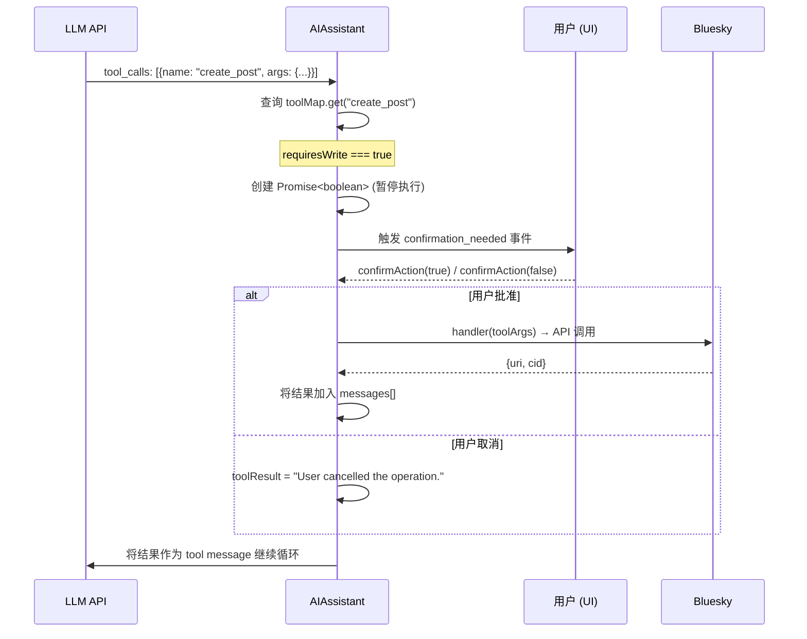

本文档深入剖析 Bluesky TUI/PWA 项目中 AI 助手的 31 个工具系统。该系统遵循"契约优先"的设计原则——工具定义、读写权限标记和执行逻辑分离为三个独立层次，架构清晰且可审计。理解这一系统，是掌握 AI 与 Bluesky AT 协议深度整合机制的关键入口。

## 架构总览：三层分离模型

整个工具系统由三个层构成，每层有明确职责且互不依赖：

```
┌─────────────────────────────────────────────────────┐
│                  契约层 (Contract)                    │
│              contracts/tools.json                    │
│         31 个工具的 JSON Schema 定义                  │
│         readonly 标记 → 读写安全门依据                  │
└──────────────────────┬──────────────────────────────┘
                       │ 加载
┌──────────────────────▼──────────────────────────────┐
│                  工具层 (Tool Layer)                  │
│        packages/core/src/at/tools.ts                 │
│  ToolDescriptor { definition, handler, requiresWrite }│
│  createTools(client) → 31 个 ToolDescriptor          │
└──────────────────────┬──────────────────────────────┘
                       │ 注册
┌──────────────────────▼──────────────────────────────┐
│                  执行层 (Execution Layer)              │
│        packages/core/src/ai/assistant.ts             │
│  AIAssistant: 多轮工具循环 + 写操作确认门              │
│  toolMap: Map<string, ToolDescriptor>                 │
│  sendMessage() / sendMessageStreaming()              │
└─────────────────────────────────────────────────────┘
```

**契约层**定义了工具的"是什么"——名称、描述、参数 Schema、端点映射和读写标记。**工具层**实现了"怎么做"——每个 handler 函数将参数映射为 BskyClient 的 API 调用。**执行层**决定了"何时做"——AI 模型选择调用哪个工具、多轮循环如何流转、写操作如何等待用户确认。

Sources: [contracts/tools.json](contracts/tools.json#L1-L425), [packages/core/src/at/tools.ts](packages/core/src/at/tools.ts#L1-L898), [packages/core/src/ai/assistant.ts](packages/core/src/ai/assistant.ts#L1-L695)

## 工具清单：26 读 + 5 写 = 31 工具

31 个工具按语义划分为四大类别：

| 类别 | 工具数量 | 代表工具 | 用途 |
|------|---------|---------|------|
| **身份与记录** | 3 | resolve_handle, get_record, list_records | 解析 DID、获取/列举 AT 协议记录 |
| **Feed 与帖子** | 10 | search_posts, get_timeline, get_author_feed, get_feed, get_feed_generator, get_popular_feed_generators, get_post_thread, get_post_thread_flat, get_post_subtree, get_post_context | 搜索、时间线、帖子线程与上下文 |
| **社交图谱与交互** | 9 | get_likes, get_reposted_by, get_quotes, search_actors, get_profile, get_follows, get_followers, get_suggested_follows, list_notifications | 点赞、转发、引用、用户搜索与通知 |
| **媒体与外部** | 4 | extract_images_from_post, download_image, extract_external_link, fetch_web_markdown | 图片提取、下载、外链解析与网页抓取 |
| **写操作** | 5 | create_post, like, repost, follow, upload_blob | 发帖、点赞、转发、关注、上传图片 |

26 个**只读工具**的 `endpoint` 全部映射到 AT 协议或 Bluesky 的 Lexicon API（如 `app.bsky.feed.getTimeline`），其中部分工具（如 `get_post_thread_flat`、`get_post_context`）是**复合工具**——在 handler 内部组合多次 API 调用并格式化输出。5 个**写工具**均通过 `com.atproto.repo.createRecord` 写入 AT 协议仓库，对应不同的集合（collection）：`app.bsky.feed.post`、`app.bsky.feed.like`、`app.bsky.feed.repost`、`app.bsky.graph.follow`。

Sources: [contracts/tools.json](contracts/tools.json#L1-L425), [packages/core/src/at/tools.ts](packages/core/src/at/tools.ts#L598-L795)

## 工具定义契约：typesafe 的 Schema 系统

### 双源设计：JSON 契约 + TypeScript 实现

工具定义有一个独特的设计——`contracts/tools.json` 作为独立于代码的**参照契约**，而 `packages/core/src/at/tools.ts` 中的 `ToolDefinition` 接口是 TypeScript 类型系统的运行时实现：

```typescript
// tools.ts 中的核心类型
export interface ToolDefinition {
  name: string;                    // 工具名称，例如 "create_post"
  description: string;             // LLM 看到的描述文本
  inputSchema: {
    type: 'object';
    properties: Record<string, { type: string; description: string }>;
    required: string[];
  };
}

export interface ToolDescriptor {
  definition: ToolDefinition;      // 元数据（给 AI 模型看）
  handler: ToolHandler;            // 执行函数（给系统调用）
  requiresWrite: boolean;          // 安全门标记
}
```

`ToolDescriptor` 将三个维度——**元数据**（definition）、**执行逻辑**（handler）、**安全属性**（requiresWrite）——聚合为一个可注册的单位。其中 `definition` 的 `inputSchema` 格式与 OpenAI 的 function calling Schema 完全兼容，使得 AIAssistant 可以直接将其序列化为 `tools` 参数发送给 LLM API。

Sources: [packages/core/src/at/tools.ts](packages/core/src/at/tools.ts#L21-L43)

### 从契约到执行：createTools 工厂函数

`createTools(client: BskyClient)` 是工具系统的**构造工厂**，接收一个 `BskyClient` 实例，返回 31 个 `ToolDescriptor` 的数组。每个工具的 handler 闭包捕获了 `client` 引用，从而能够在运行时调用实际的 AT 协议 API。例如 `search_posts` 工具的 handler：

```typescript
handler: async (p) => {
  const res = await client.searchPosts({
    q: p.q as string,
    limit: (p.limit as number) ?? 25,
    sort: p.sort as string | undefined,
  });
  const posts = res.posts.map((post: PostView) => ({
    uri: post.uri,
    author: post.author.handle,
    text: (post.record as unknown as PostRecord)?.text?.slice(0, 200) ?? '',
    likeCount: post.likeCount,
    repostCount: post.repostCount,
    indexedAt: post.indexedAt,
  }));
  return JSON.stringify({ posts, total: posts.length, hitsTotal: res.hitsTotal });
},
```

每个 handler 接收 `Record<string, unknown>` 的参数对象，返回 `Promise<string>`（JSON 字符串）。这种统一签名使得 AIAssistant 可以抽象地遍历和调用任何工具，无需感知具体实现差异。

Sources: [packages/core/src/at/tools.ts](packages/core/src/at/tools.ts#L64-L898)

## 读写安全门：写操作的确认机制

系统的安全架构围绕 `requiresWrite` 标记构建。**5 个写工具**在定义时将 `requiresWrite` 设为 `true`，其余 26 个读工具设为 `false`。`AIAssistant` 在执行工具时检查此标记：



### Promise 暂停模式

安全门的核心实现是**Promise 暂停模式**——`AIAssistant` 在执行写工具前创建一个未 resolve 的 Promise，并保存其 resolve 函数引用：

```typescript
private async _waitForConfirmation(): Promise<boolean> {
  this._confirmPromise = new Promise<boolean>((resolve) => {
    this._confirmResolve = resolve;
  });
  return this._confirmPromise;
}
```

`_waitForConfirmation()` 的 `await` 会挂起当前 async 函数的执行，但不阻塞事件循环。UI 层通过 `confirmAction(true/false)` 调用 resolve 函数来恢复执行。这种设计使得执行循环逻辑保持线性可读，无需状态机或回调注册。

Sources: [packages/core/src/ai/assistant.ts](packages/core/src/ai/assistant.ts#L95-L115)

### UI 层的确认编排

`useAIChat` 钩子监听流式事件中的 `type === 'confirmation_needed'`，将待确认信息存入 React state 的 `pendingConfirmation` 对象。TUI 的 `AIChatView` 组件据此渲染确认横幅：显示黄色边框的提示信息，并注册 `Y/Enter`（确认）和 `N/Esc`（取消）键盘快捷键。用户选择后，`confirmAction()` 或 `rejectAction()` 调用 `assistant.confirmAction(true/false)` 恢复执行循环。

```typescript
// useAIChat 中的确认处理
if ((event as any).type === 'confirmation_needed') {
  setPendingConfirmation({
    toolName: (event as any).toolName || '',
    description: event.content,
  });
  continue;
}

// TUI AIChatView 的键盘处理
if (pendingConfirmation) {
  if (input === 'y' || input === 'Y' || key.return) { confirmAction(); return; }
  if (input === 'n' || input === 'N' || key.escape) { rejectAction(); return; }
  return; // 阻塞所有其他键盘输入
}
```

**关键设计决策**：写操作前暂停，而非写操作后撤销。这意味着写操作要么被用户明确批准后执行，要么被取消后完全不执行——不会出现"先执行再回滚"的复杂撤销逻辑。所有写工具的 description 都明确标注"Requires user confirmation."，提醒 AI 模型该操作需要用户介入。

Sources: [packages/app/src/hooks/useAIChat.ts](packages/app/src/hooks/useAIChat.ts#L1-L348), [packages/tui/src/components/AIChatView.tsx](packages/tui/src/components/AIChatView.tsx#L1-L202)

## 工具执行循环：多轮 tool calling 与流式渲染

### 非流式执行循环

`sendMessage()` 方法实现了最长达 10 轮的工具调用循环：

```
用户输入 → 添加 user message → LLM API 调用（带 tools 参数）
                                   │
                    ┌───────────────┴───────────────┐
                    │  response.choices[0].message   │
                    │  .tool_calls 存在?              │
                    │         │                      │
                    │        YES ←─── 继续循环 ──┐    │
                    │         │                  │    │
                    │   为每个 tool_call:          │    │
                    │   ├─ 查询 toolMap           │    │
                    │   ├─ 写工具? → 等待确认     │    │
                    │   └─ handler(toolArgs)      │    │
                    │   添加 tool result 消息      │    │
                    │   再次调用 LLM API ──────────┘    │
                    │                                  │
                    │  NO (finish_reason === "stop")    │
                    │   返回 { content, toolCalls,       │
                    │          intermediateSteps }       │
```

循环在以下条件下终止：
1. **LLM 返回的 message 中无 tool_calls** → 返回最终文本
2. **达到 MAX_TOOL_ROUNDS = 10** → 抛出 `'Max tool calling rounds exceeded'` 错误（防止无限循环）

每次循环中，`intermediateSteps` 数组记录 `tool_call` 和 `tool_result` 事件，供 UI 渲染中间步骤。`toolCallsExecuted` 计数追踪实际执行次数。

Sources: [packages/core/src/ai/assistant.ts](packages/core/src/ai/assistant.ts#L117-L190)

### 流式执行循环

`sendMessageStreaming()` 是 AsyncGenerator 版本的执行循环，使用 SSE（Server-Sent Events）解析逐 token 输出。其核心是通过 `ReadableStream` 的 `getReader()` 逐行读取 LLM API 的流式响应，实时解析 `data:` 前缀的 JSON chunk：

```typescript
const reader = res.body!.getReader();
const decoder = new TextDecoder();

// 逐 chunk 读取
const { done, value } = await reader.read();
const text = decoder.decode(value, { stream: true });
const lines = text.split('\n');

for (const line of lines) {
  if (!line.startsWith('data: ')) continue;
  const data = line.slice(6);
  if (data === '[DONE]') continue;

  const chunk = JSON.parse(data);
  const delta = chunk.choices?.[0]?.delta;
  // delta.content → yield { type: 'token' }
  // delta.reasoning_content → yield { type: 'thinking' }
  // delta.tool_calls → 累积到 toolCallAccum Map
}
```

流式引入了一个特殊事件类型——`type: 'thinking'`，用于输出 AI 模型的**推理过程**（reasoning_content）。当启用 `thinkingEnabled` 时（默认开启），`deepseek-v4-flash` 等支持推理的模型会在输出最终文本前先输出推理链。useAIChat 钩子将 thinking tokens 累积为 `role: 'thinking'` 的消息，UI 渲染为灰色的 `💭 Thinking:` 前缀文本。

流式执行循环同样包含写操作安全门——当遇到 `requiresWrite: true` 的工具时，yield `type: 'confirmation_needed'` 事件并等待用户确认。

Sources: [packages/core/src/ai/assistant.ts](packages/core/src/ai/assistant.ts#L191-L470)

### 流式与非流式的使用场景

| 特性 | 非流式 (sendMessage) | 流式 (sendMessageStreaming) |
|------|---------------------|---------------------------|
| **输出方式** | 一次性返回完整结果 | AsyncGenerator 实时 yield |
| **适用 UI** | TUI（单次响应） | TUI + PWA（实时渲染） |
| **中间步骤聚合** | intermediateSteps 数组 | 每个事件独立 yield |
| **推理过程** | 仅保留 reasoning_content 字段 | yield `thinking` 类型事件 |
| **写操作确认** | 同步 await _waitForConfirmation | yield `confirmation_needed` 事件 |
| **useAIChat 默认** | 当 `options.stream` 为 false 时使用 | 当 `options.stream` 为 true 时使用 |

TUI 默认使用非流式路径（无需实时渲染 token），PWA 使用流式路径（提供打字机效果）。两种路径共享相同的工具循环逻辑和安全门，仅在输出机制上差异。

Sources: [packages/core/src/ai/assistant.ts](packages/core/src/ai/assistant.ts#L117-L470), [packages/app/src/hooks/useAIChat.ts](packages/app/src/hooks/useAIChat.ts#L85-L190)

## 工具描述的可读性构建

`buildToolDescription()` 函数为写操作确认对话框生成人类可读的描述文本。它根据工具名称做 switch-case 映射，展示关键参数：

```typescript
function buildToolDescription(toolName: string, args: Record<string, unknown>): string {
  switch (toolName) {
    case 'create_post': return `创建帖子: "${String(args.text || '').slice(0, 100)}"`;
    case 'like':        return `点赞帖子: ${String(args.uri || '')}`;
    case 'repost':      return `转发帖子: ${String(args.uri || '')}`;
    case 'follow':      return `关注用户: ${String(args.subject || '')}`;
    case 'upload_blob': return '上传图片';
    default:            return `${toolName}: ${JSON.stringify(args).slice(0, 100)}`;
  }
}
```

对于 `create_post`，描述截取前 100 个字符的文本内容，让用户快速确认即将发布的帖子内容。

## 线程展平工具：复合工具的设计范例

`get_post_thread_flat`、`get_post_subtree`、`get_post_context` 是三个**复合只读工具**的典型代表。它们不直接映射到单一的 AT 协议端点，而是组合多次 API 调用并做格式化处理：

1. `get_post_thread_flat` 调用 `getPostThread` API 获取线程树，然后递归遍历树结构
2. 构建**祖先链**（ancestors）：从当前帖子的 parent 向上追溯到根
3. 构建**回复链**（replies）：向下递归遍历子回复（最大深度 5，最大兄弟节点 5 个）
4. 每行包含 `depth:N` 深度标记、作者 handle、帖子的 rkey 以及文本摘要
5. 超过 MAX_SIBLINGS 的折叠回复显示提示："还有 X 条回复被折叠，可调用 get_post_subtree 展开"

```typescript
// 示例输出格式
depth:-2 | alice.bsky.social (post:abc123)
"这是根帖子内容" [图片: 2 张]
  depth:1 | bob.bsky.social (post:def456)
"回复内容"
    depth:2 | charlie.bsky.social (post:ghi789)
"更深层的回复"
  depth:1 | eve.bsky.social (post:jkl012)
"另一条回复"
（还有 3 条回复被折叠，可调用 get_post_subtree 展开）
```

这种"树→扁平列表"的转换使 LLM 能够以线性文本理解帖子线程结构，而非处理复杂的嵌套 JSON。

Sources: [packages/core/src/at/tools.ts](packages/core/src/at/tools.ts#L797-L898)

## 关键设计决策总结

1. **契约即文档**：`contracts/tools.json` 作为参照契约，使得工具的元数据可被非 TypeScript 工具（如 json-schema 验证器、自动化文档生成器）处理
2. **安全前移**：写操作标记 `requiresWrite` 在工具定义阶段就已确定，执行阶段零误判空间
3. **Promise 暂停而非状态机**：`_waitForConfirmation` 的 Promise 暂停模式让异步执行循环保持线性可读，无需引入复杂的状态转换
4. **复合工具封装**：多步骤读操作（如线程展平）封装为单一工具调用，减少 LLM 的多轮调用开销
5. **10 轮上限**：硬性限制防止 AI 模型陷入无限工具循环，同时 10 轮足以覆盖大多数多步推理场景
6. **双路径执行**：流式与非流式路径共享工具执行核心逻辑，仅在输出机制上分化，由 useAIChat 的 stream 选项控制

Sources: [packages/core/src/at/tools.ts](packages/core/src/at/tools.ts#L1-L898), [packages/core/src/ai/assistant.ts](packages/core/src/ai/assistant.ts#L1-L695), [packages/app/src/hooks/useAIChat.ts](packages/app/src/hooks/useAIChat.ts#L1-L348)

---

**下一步阅读建议**：理解工具系统后，推荐继续阅读 [AIAssistant：多轮工具调用引擎与 SSE 流式输出](12-aiassistant-duo-lun-gong-ju-diao-yong-yin-qing-yu-sse-liu-shi-shu-chu) 深入掌握执行引擎的流式实现细节，以及 [useAIChat 钩子：流式渲染、写操作确认、撤销/重试与自动保存](13-useaichat-gou-zi-liu-shi-xuan-ran-xie-cao-zuo-que-ren-che-xiao-zhong-shi-yu-zi-dong-bao-cun) 了解 UI 层如何集成工具执行循环。