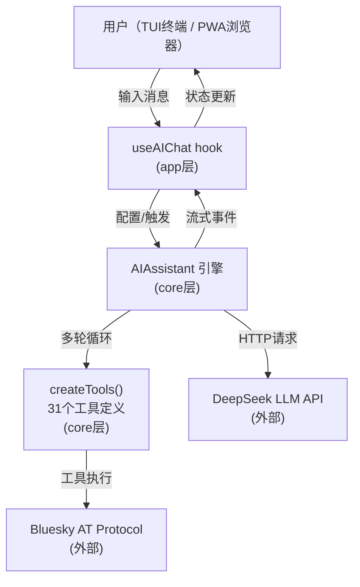
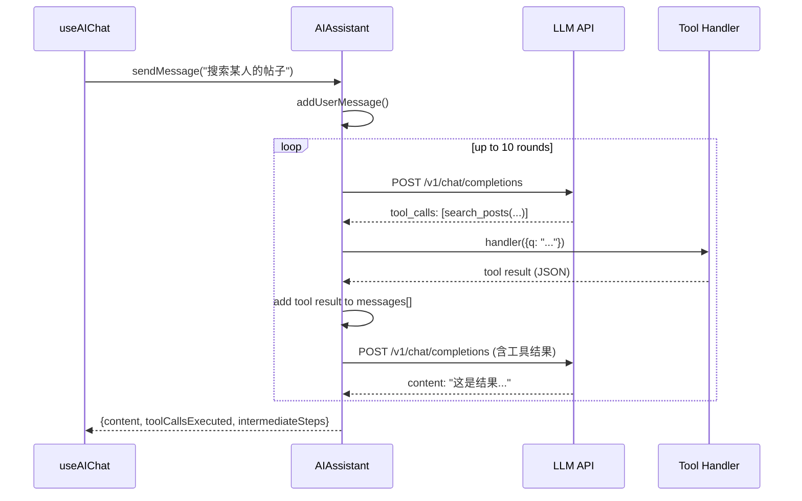
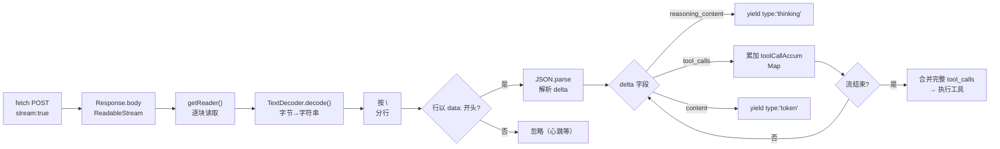
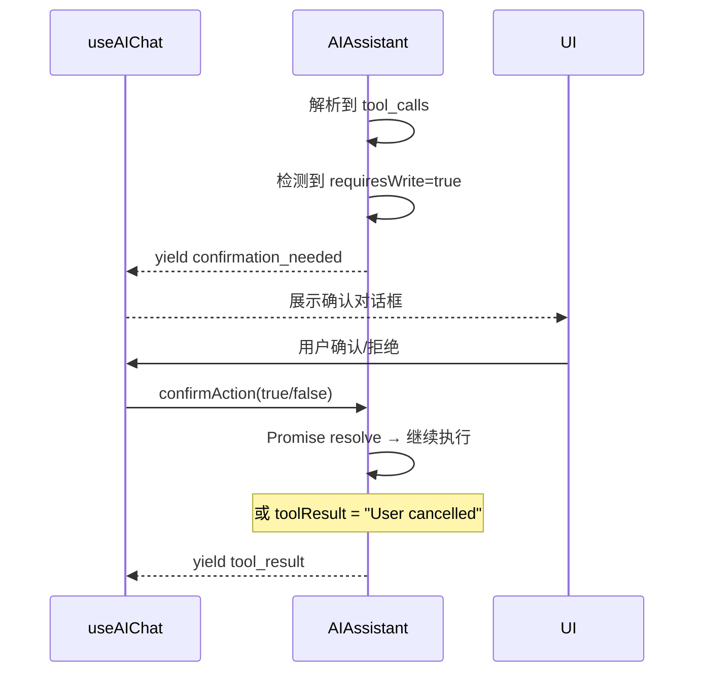

## 一、架构概览与核心职责

`AIAssistant` 类位于 `packages/core/src/ai/assistant.ts`，是整个系统的 AI 交互引擎。它的职责是从用户原始消息出发，驱动大语言模型（LLM）在**多轮工具调用循环**中自主推理、调用 Bluesky API 工具，最终产出自然语言回复。它与工具定义层（`packages/core/src/at/tools.ts`）和 React 消费层（`packages/app/src/hooks/useAIChat.ts`）形成清晰的三层依赖结构。

以下是 AIAssistant 在整个系统中的定位：



Sources: [AIAssistant class](packages/core/src/ai/assistant.ts#L76-L497), [createTools](packages/core/src/at/tools.ts#L48-L768), [useAIChat hook](packages/app/src/hooks/useAIChat.ts#L19-L315)

---

## 二、多轮工具调用循环

### 2.1 基本原理

AIAssistant 的核心是一个**同步阻塞式循环**，而非回调或事件驱动。单次 `sendMessage()` 调用内部最多可执行 10 轮（`MAX_TOOL_ROUNDS = 10`）工具调用 - 内容生成交替过程：



核心逻辑在 `sendMessage()` 方法中（第 151–262 行）：每一次循环先调用 `makeRequest()` 向 LLM 发送完整消息历史（含 system/user/assistant/tool 四类消息），然后检查响应中的 `finish_reason`：

```typescript
// 简化后的循环核心
for (let round = 0; round < MAX_TOOL_ROUNDS; round++) {
  const response = await this.makeRequest();
  const message = response.choices[0].message;

  if (message.tool_calls && message.tool_calls.length > 0) {
    // 添加 assistant 消息（含 tool_calls）到历史
    this.messages.push({ role: 'assistant', content, tool_calls });

    for (const tc of message.tool_calls) {
      const toolDesc = this.toolMap.get(tc.function.name);
      // 执行工具 → 添加 tool 消息到历史
      const toolResult = await toolDesc.handler(JSON.parse(tc.function.arguments));
      this.messages.push({ role: 'tool', content: toolResult, tool_call_id: tc.id });
    }
    continue; // 继续下一轮，让 LLM 基于工具结果生成最终回复
  }

  // 无 tool_calls — 返回最终内容
  return { content: message.content, toolCallsExecuted, intermediateSteps };
}
```

Sources: [sendMessage loop](packages/core/src/ai/assistant.ts#L151-L262), [MAX_TOOL_ROUNDS](packages/core/src/ai/assistant.ts#L160)

### 2.2 消息历史结构

AIAssistant 维护一个 `ChatMessage[]` 数组作为对话上下文，支持四种角色：

| 角色 | 用途 | 来源 |
|------|------|------|
| `system` | 系统提示词，设定 AI 行为和约束 | `addSystemMessage()` 由 useAIChat 按上下文构建 |
| `user` | 用户原始输入 | `sendMessage()` / `sendMessageStreaming()` 入口 |
| `assistant` | LLM 的回复内容（含 tool_calls 字段时表示正在调用工具） | LLM API 返回 |
| `tool` | 工具执行结果，通过 `tool_call_id` 与对应调用关联 | 工具 handler 执行后注入 |

这一结构完全遵循 OpenAI 兼容 API 的 `messages` 格式规范，确保 DeepSeek 或其他兼容 API 能正确理解上下文。Sources: [ChatMessage interface](packages/core/src/ai/assistant.ts#L3-L10)

### 2.3 循环终止条件

循环在以下三种情况下终止：
1. **正常终止**：LLM 返回 `finish_reason: 'stop'` 且无 `tool_calls`，返回最终内容
2. **异常终止**：达到 10 轮上限，抛出 `Max tool calling rounds exceeded` 错误（第 261 行）
3. **API 错误**：网络问题或认证失败，在 `makeRequest()` 中抛出详细错误（第 291–313 行）

---

## 三、SSE 流式输出引擎

### 3.1 双路径设计

AIAssistant 提供两条并行的消息路径：
- **非流式路径** `sendMessage()`：等待完整响应后一次性返回，适用于 TUI 环境（终端等待完整消息再渲染）
- **流式路径** `sendMessageStreaming()`：通过 `AsyncGenerator` 逐 token 产出事件，适用于 PWA 浏览器环境（实时增量渲染）

两者共享相同的工具调用循环逻辑，区别在于网络请求方式和事件产出机制。Sources: [双路径设计](packages/core/src/ai/assistant.ts#L151-L497)

### 3.2 SSE 流解析架构

`sendMessageStreaming()` 是一个 `AsyncGenerator`（第 319 行），内部执行以下 SSE 解析流程：



关键设计决策在于 **tool_calls 的累加策略**：SSE 分块中 `delta.tool_calls` 可能是增量片段（每个 chunk 可能只包含 `function.arguments` 的一部分），引擎使用 `Map<number, { id, name, arguments }>` 按 `index` 聚合，在流结束后合并为完整 JSON 再执行。Sources: [SSE 解析与 tool_call 累加](packages/core/src/ai/assistant.ts#L374-L483)

### 3.3 事件类型体系

流式生成器产出以下 5 种事件类型：

| 事件类型 | 含义 | 产生时机 |
|----------|------|----------|
| `thinking` | 模型推理过程（来自 DeepSeek 的 `reasoning_content` 字段） | SSE 解析到 `delta.reasoning_content` 时 |
| `token` | 逐 token 的最终回复内容 | SSE 解析到 `delta.content` 时 |
| `tool_call` | AI 决定调用某个工具，含工具名和参数 | 流结束后，合并完成的 tool_calls 执行前 |
| `tool_result` | 工具执行结果（截断至 500 字符） | 工具 handler 返回后 |
| `done` | 整个对话轮次完成，含最终完整内容 | 无工具调用时，或所有工具执行完毕后的 LLM 回复 |

消费方（`useAIChat`）通过 `for await...of` 消费这些事件，按类型驱动不同的 UI 更新策略。Sources: [事件类型定义](packages/core/src/ai/assistant.ts#L319-L323), [消费方逻辑](packages/app/src/hooks/useAIChat.ts#L152-L204)

### 3.4 DeepSeek 特有字段处理

针对 DeepSeek 模型，引擎支持两个非标准字段：
- **`thinking` 参数**（请求层）：`thinking: { type: 'enabled' | 'disabled' }`，控制是否启用深度推理（第 272 行）
- **`reasoning_content` 字段**（响应层）：SSE 解析时识别 `delta.reasoning_content`，将其作为 `thinking` 事件暴露给消费方（第 397–399 行）

Sources: [thinking 参数](packages/core/src/ai/assistant.ts#L272), [reasoning_content 解析](packages/core/src/ai/assistant.ts#L397-L399)

---

## 四、写操作确认门（Write Confirmation Gate）

### 4.1 设计动机

在 31 个 AI 工具中，5 个写工具（`create_post`、`like`、`repost`、`follow`、`upload_blob`）标注了 `requiresWrite: true`。为避免 AI 在未获用户同意的情况下擅自执行破坏性操作，引擎实现了**挂起式确认门**。

### 4.2 机制原理

确认门基于 Promise 挂起技术，将工具执行暂停在人机交互边界上：

```typescript
// AIAssistant 内部
private _confirmPromise: Promise<boolean> | null = null;
private _confirmResolve: ((v: boolean) => void) | null = null;

private async _waitForConfirmation(): Promise<boolean> {
  this._confirmPromise = new Promise<boolean>((resolve) => {
    this._confirmResolve = resolve;
  });
  return this._confirmPromise; // 挂起，直到外部调用 confirmAction()
}

// 工具执行时
if (toolDesc.requiresWrite) {
  yield { type: 'confirmation_needed', content: desc, toolName };
  const approved = await this._waitForConfirmation(); // 阻塞！
  if (!approved) {
    toolResult = 'User cancelled the operation.';
    // ...
  }
}
```



核心要点：`_waitForConfirmation()` 返回的 Promise **不会 resolve，直到外部通过 `confirmAction(boolean)` 方法注入决策**。在这期间，工具执行循环被挂起，UI 层有机会展示确认对话框。

Sources: [确认门实现](packages/core/src/ai/assistant.ts#L82-L148), [消费方处理确认](packages/app/src/hooks/useAIChat.ts#L153-L158)

### 4.3 拟人化描述生成

`buildToolDescription()` 函数（第 500–509 行）将工具调用转换为人类可读的中文描述：

```typescript
function buildToolDescription(toolName, args) {
  switch (toolName) {
    case 'create_post': return `创建帖子: "${args.text.slice(0, 100)}"`;
    case 'like':        return `点赞帖子: ${args.uri}`;
    case 'repost':      return `转发帖子: ${args.uri}`;
    case 'follow':      return `关注用户: ${args.subject}`;
    case 'upload_blob': return '上传图片';
    default:            return `${toolName}: ${JSON.stringify(args).slice(0, 100)}`;
  }
}
```

Sources: [buildToolDescription](packages/core/src/ai/assistant.ts#L500-L509)

---

## 五、请求构造与错误处理

### 5.1 请求体结构

`makeRequest()`（非流式，第 264–313 行）和 `sendMessageStreaming()` 内部（流式，第 329–348 行）构造的请求体结构几乎一致，仅 `stream` 字段不同：

```typescript
const body = {
  model: this.config.model,             // 默认 deepseek-v4-flash
  messages: this.messages,              // 完整对话历史
  temperature: 0.7,                     // 固定温度
  max_tokens: 4096,                     // 最大输出 token
  stream: true/false,                   // 唯一差异点
  thinking: { type: 'enabled' },        // DeepSeek 特有
  tools: toolDefinitions,               // 所有注册工具（仅当 tools.length > 0）
  tool_choice: 'auto',                  // 由 AI 自主决定是否调用工具
};
```

Sources: [请求体构造](packages/core/src/ai/assistant.ts#L264-L286)

### 5.2 错误处理策略

| 错误类型 | 检测方式 | 用户可见消息 |
|----------|----------|-------------|
| 网络不可达 | `fetch` 抛出 `TypeError: fetch failed` | `Network error: unable to reach LLM API at {url}. Check LLM_BASE_URL and network.` |
| HTTP 错误（4xx/5xx） | `!res.ok` | `AI API error {status}: {errorText}` |
| 无响应 | `choices[0]` 为空 | `No response from AI` |
| 工具执行异常 | 工具 handler 内 `catch` | `Error executing tool: {message}` |
| 工具不存在 | `toolMap.get(toolName)` 返回 undefined | `Unknown tool: {toolName}` |
| 超过最大轮次 | 循环自然结束 | `Max tool calling rounds exceeded` |

Sources: [错误处理](packages/core/src/ai/assistant.ts#L290-L310)

---

## 六、工具注册与映射表

### 6.1 ToolDescriptor 结构

工具通过 `createTools(client: BskyClient)` 工厂函数统一注册，每个工具是一个 `ToolDescriptor` 对象：

```typescript
interface ToolDescriptor {
  definition: ToolDefinition;  // name, description, inputSchema
  handler: ToolHandler;        // (params) => Promise<string>
  requiresWrite: boolean;      // 写操作确认门开关
}
```

工具分为两大类别：

| 类别 | 数量 | requiresWrite | 行为 |
|------|------|---------------|------|
| **读工具** | 26 | `false` | 直接执行，无需用户确认 |
| **写工具** | 5 | `true` | 触发确认门，等待用户批准 |

Sources: [ToolDescriptor 定义](packages/core/src/at/tools.ts#L26-L30)

### 6.2 31 个工具清单

**读工具（26 个）**：`resolve_handle`、`get_record`、`list_records`、`search_posts`、`get_timeline`、`get_author_feed`、`get_popular_feed_generators`、`get_feed_generator`、`get_feed`、`get_post_thread`、`get_post_thread_flat`、`get_post_subtree`、`get_post_context`、`get_likes`、`get_reposted_by`、`get_quotes`、`search_actors`、`get_profile`、`get_follows`、`get_followers`、`get_suggested_follows`、`list_notifications`、`extract_images_from_post`、`download_image`、`extract_external_link`、`fetch_web_markdown`

**写工具（5 个）**：`create_post`、`like`、`repost`、`follow`、`upload_blob`

Sources: [工具完整定义](packages/core/src/at/tools.ts#L48-L768)

---

## 七、AIConfig 与默认值

`AIAssistant` 的配置通过 `AIConfig` 接口注入：

```typescript
interface AIConfig {
  apiKey: string;          // LLM API 密钥（必填）
  baseUrl: string;         // 默认: https://api.deepseek.com
  model: string;           // 默认: deepseek-v4-flash
  thinkingEnabled?: boolean; // 默认: true
}
```

默认值定义在 `DEFAULT_CONFIG` 常量（第 70–74 行），构造函数通过展开合并用户配置与默认值。`thinkEnabled` 控制是否在 API 请求中发送 `thinking: { type: 'enabled' }` 参数。Sources: [AIConfig 与默认值](packages/core/src/ai/assistant.ts#L63-L74)

---

## 八、与其他模块的协作

### 8.1 useAIChat 消费层

`useAIChat` hook（`packages/app/src/hooks/useAIChat.ts`）是 AIAssistant 在 React 生态中的核心消费者：

- **初始化时机**：`useState(() => new AIAssistant(aiConfig))` 惰性初始化，保证单例（第 25 行）
- **工具注入**：当 `client` 就绪时，通过 `createTools(client)` 创建工具并调用 `assistant.setTools(tools)`（第 97–98 行）
- **路径选择**：根据 `options.stream` 标志决定走流式（第 147 行）还是非流式（第 228 行）
- **消息映射**：将 AIAssistant 的 `ChatMessage` 转换为 UI 层 `AIChatMessage`（含 `tool_call`/`tool_result` 等自定义角色）
- **确认门桥接**：监听 `confirmation_needed` 事件 → 设置 `pendingConfirmation` 状态 → 通过 `confirmAction`/`rejectAction` 回调反馈（第 272–280 行）

### 8.2 聊天存储集成

`useAIChat` 通过 `autoSave` 回调（第 122–135 行）在每次消息更新后自动持久化到 `ChatStorage` 实现中。`chatId` 用于关联同一对话，TUI 和 PWA 环境各有独立的存储实现。

### 8.3 独立工具函数

同一文件 `assistant.ts` 还导出了三个独立的单轮调用函数：
- `singleTurnAI()` — 无工具的纯 LLM 调用，用于草稿润色
- `translateText()` — 带指数退避重试的翻译引擎（支持 simple/json 双模式）
- `polishDraft()` — 帖子草稿润色

这些函数不经过工具调用循环，直接向 LLM API 发送 system+user 消息并返回响应内容。Sources: [独立工具函数](packages/core/src/ai/assistant.ts#L514-L695)

---

## 九、架构决策要点

| 决策 | 选择 | 理由 |
|------|------|------|
| 工具执行模式 | 同步阻塞循环 | 简化心智模型，避免竞态；`sendMessage` 的调用方期望一次性结果 |
| SSE 解析实现 | 原生 `ReadableStream.getReader()` | 零依赖，无外部 SSE 库；代码体积小且可控 |
| tool_calls 累加 | Map<index, chunk> 逐 chunk 合并 | 兼容 SSE 增量分块特性；流结束后再执行确保参数完整 |
| 确认门机制 | Promise 挂起 | 零外部状态管理库；天然适合异步等待用户输入 |
| 最大轮次 | 硬编码 10 | 防止无限循环；兼顾复杂任务需求（最多 10 次工具调用+推理） |
| 默认模型 | deepseek-v4-flash | 支持工具调用和 reasoning_content 的兼容模型 |

---

## 下一步阅读

至此你已经理解了 AIAssistant 引擎的完整设计。建议按以下顺序继续深入：

1. **[useAIChat 钩子：流式渲染、写操作确认、撤销/重试与自动保存](13-useaichat-gou-zi-liu-shi-xuan-ran-xie-cao-zuo-que-ren-che-xiao-zhong-shi-yu-zi-dong-bao-cun)** — 本页的消费方，理解事件如何驱动 UI 更新
2. **[31 个 AI 工具系统：工具定义、读写安全门与工具执行循环](11-31-ge-ai-gong-ju-xi-tong-gong-ju-ding-yi-du-xie-an-quan-men-yu-gong-ju-zhi-xing-xun-huan)** — 深入理解工具注册机制和读写门设计
3. **[智能翻译系统：双模式翻译（simple/json）与指数退避重试](14-zhi-neng-fan-yi-xi-tong-shuang-mo-shi-fan-yi-simple-json-yu-zhi-shu-tui-bi-zhong-shi)** — 了解独立工具函数中的翻译实现
4. **[AI 草稿润色与单轮对话工具函数](15-ai-cao-gao-run-se-yu-dan-lun-dui-hua-gong-ju-han-shu)** — 了解单轮调用的实际应用场景