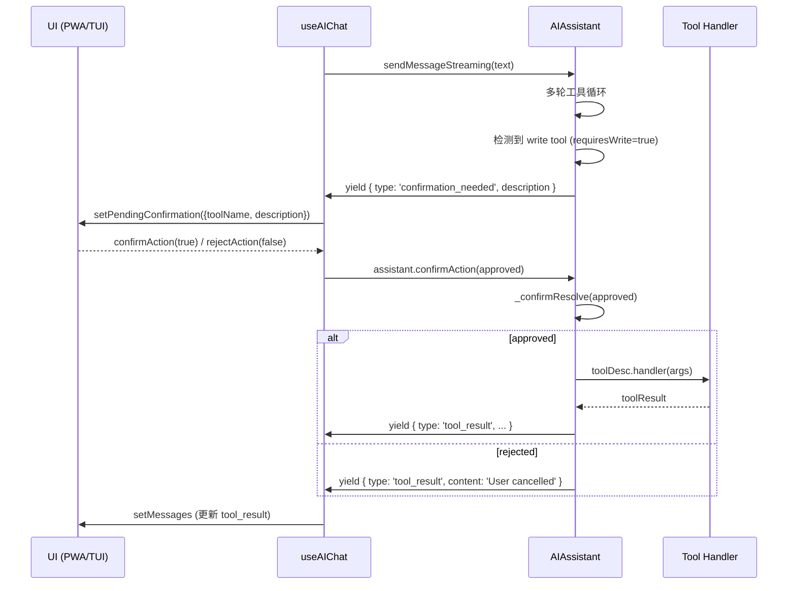

`useAIChat` 是连接 AI 引擎与 UI 层的核心 React 钩子，驻留在 `packages/app/src/hooks/useAIChat.ts` 中。它将 `AIAssistant` 类（来自 `@bsky/core`）的底层多轮工具调用能力封装为 React 状态驱动的声明式接口，同时承载了两个界面（TUI 终端与 PWA 浏览器）共享的三个关键交互模式：**流式逐令牌渲染**（PWA 的实时体验基石）、**写操作确认门**（对 Bluesky 数据写入的安全管控）、以及**撤销/重试与自动保存**（用户操作容错与持久化保障）。

Sources: [useAIChat.ts](packages/app/src/hooks/useAIChat.ts#L1-L315)

## 架构总览：从 AIAssistant 到 React 状态的双层映射

钩子的设计遵循一个清晰的**双层架构**：底层由 `AIAssistant` 实例持有完整的对话状态（包括系统提示词、工具注册表、消息历史），上层通过 React state 对 UI 需要感知的部分做选择性镜像。这种分离使得 `AIAssistant` 保持为纯逻辑引擎（不依赖 React），而 `useAIChat` 只做「必要的最小渲染映射」。

```mermaid
graph TD
    subgraph "React Layer (useAIChat)"
        A[state: messages<br/>AIChatMessage[]] --> B[UI 渲染]
        C[state: loading<br/>boolean] --> B
        D[state: pendingConfirmation<br/>{toolName, description} | null] --> B
        E[state: guidingQuestions<br/>string[]] --> B
    end

    subgraph "Engine Layer (AIAssistant)"
        F[AIAssistant instance<br/>useState 持有] --> G[ChatMessage[]<br/>完整对话历史]
        F --> H[ToolDescriptor[]<br/>31 个工具 + 写标记]
        F --> I[confirmation gate<br/>Promise<boolean> 机制]
    end

    J[useCallback: send] -->|stream=true| K[assistant.sendMessageStreaming]
    J -->|stream=false| L[assistant.sendMessage]

    K --> M[AsyncGenerator<br/>token | tool_call | tool_result | thinking | done<br/>confirmation_needed]
    M -->|yield 逐事件处理| A
    
    L --> N[返回 intermediateSteps + content]
    N -->|批量更新| A

    O[useCallback: undoLastMessage] --> P[trim assistant messages + reset state]
    Q[useCallback: retry] --> R[find last user msg + resend]

    S[useEffect: autoSave] --> T[storage.saveChat<br/>每次 send 完成后]
```

Sources: [useAIChat.ts](packages/app/src/hooks/useAIChat.ts#L19-L38), [assistant.ts](packages/core/src/ai/assistant.ts#L76-L497)

钩子的构造函数参数体现了这种设计的考量：`client`（BskyClient 实例，用于创建工具）、`aiConfig`（API 密钥/地址/模型配置）、`contextUri`（当前浏览的帖子 URI）、以及一个可选的 `options` 对象承载存储、流式开关、用户信息等上下文。

| 参数 | 类型 | 作用 |
|------|------|------|
| `client` | `BskyClient \| null` | 驱动所有工具调用的 HTTP 客户端，null 时工具不初始化 |
| `aiConfig` | `AIConfig` | AI 模型的 API 端点、密钥、模型名、思考模式开关 |
| `contextUri` | `string \| undefined` | 上下文锚点——帖子 URI 或用户 handle（用于 profile 分析） |
| `options.chatId` | `string \| undefined` | 对话 ID，用于加载已有对话或创建新对话 |
| `options.storage` | `ChatStorage \| undefined` | 持久化接口，提供 saveChat/loadChat 能力 |
| `options.stream` | `boolean \| undefined` | 流式开关：PWA 默认 true，TUI 默认 undefined（走批处理） |
| `options.environment` | `'tui' \| 'pwa'` | 影响系统提示词中的环境描述 |
| `options.contextProfile` | `string \| undefined` | 用户主页 handle，触发自动分析流程 |

Sources: [useAIChat.ts](packages/app/src/hooks/useAIChat.ts#L8-L24)

## 双路径渲染：流式 vs 批处理

`useAIChat` 最核心的设计决策是**根据 `options.stream` 的值选择两条完全不同的渲染路径**。这并非简单的性能优化，而是两种界面范式的根本差异——PWA 需要实时逐字反馈给用户「AI 正在思考」，而 TUI 终端更适合一次性输出完整结果以避免闪烁。

### 流式路径（PWA，stream: true）

当 `stream: true` 时，`send` 函数调用 `assistant.sendMessageStreaming(text)`，该方法返回一个 `AsyncGenerator`，逐事件 yield 以下类型：

| 事件类型 | 触发时机 | UI 处理方式 |
|----------|----------|-------------|
| `thinking` | SSE chunk 中包含 `reasoning_content` 时 | 累积到 `role: 'thinking'` 消息末尾，实时追加显示 |
| `token` | SSE chunk 中包含 `content` 时 | 追加到 `role: 'assistant'` 消息的 `content` 中 |
| `tool_call` | 一轮 SSE 流结束，检测到 `tool_calls` 时 | 创建新的 `role: 'tool_call'` 消息，重置流式缓冲区 |
| `confirmation_needed` | 即将执行写工具时 | 设置 `pendingConfirmation` 状态，暂停流处理 |
| `tool_result` | 工具执行完成时 | 创建 `role: 'tool_result'` 消息，使用 `tryJsonSummary` 智能截断 |
| `done` | 最终回复完成时 | 触发自动保存 |

流式路径的关键实现细节在 `assistant.ts` 的 `sendMessageStreaming` 方法中：它解析 SSE 数据流，使用 `toolCallAccum: Map<number, {id, name, arguments}>` 累积分块到达的工具调用参数（因为工具调用的 `function.arguments` 可能跨多个 SSE chunk 到达），等流结束后一次性组装并执行。

```typescript
// Streaming 路径的核心事件循环（useAIChat.ts 第 147-211 行）
const stream = assistant.sendMessageStreaming(text);
let streamingContent = '';

for await (const event of stream) {
  if ((event as any).type === 'confirmation_needed') {
    setPendingConfirmation({ toolName, description });  // 暂停等待用户确认
    continue;
  }
  if (event.type === 'tool_call') {
    streamingContent = '';  // 重置缓冲区，准备下一轮助手回复
    setMessages(prev => [...prev, { role: 'tool_call', content: `🔧 ${event.content}`, toolName }]);
  } else if (event.type === 'token') {
    streamingContent += event.content;
    setMessages(prev => {
      const last = prev[prev.length - 1];
      if (last?.role === 'assistant') {
        // 追加到已有助手消息
        return [...prev.slice(0, -1), { ...last, content: streamingContent }];
      }
      return [...prev, { role: 'assistant', content: streamingContent }];
    });
  } else if (event.type === 'thinking') {
    // 累积推理内容
    // ...
  }
}
```

Sources: [useAIChat.ts](packages/app/src/hooks/useAIChat.ts#L147-L211), [assistant.ts](packages/core/src/ai/assistant.ts#L319-L497)

### 批处理路径（TUI，stream: undefined/false）

非流式路径走 `assistant.sendMessage(text)`，该方法内部执行多轮工具调用循环后，一次性返回包含 `intermediateSteps` 和 `content` 的结果对象。钩子中遍历 `intermediateSteps`，将 `tool_call` 和 `tool_result` 步骤展开为独立消息，最后追加助手的完整回复。

```typescript
// 非流式路径（useAIChat.ts 第 227-257 行）
const result = await assistant.sendMessage(text);
setMessages(prev => {
  const newMsgs: AIChatMessage[] = [];
  for (const step of result.intermediateSteps) {
    if (step.type === 'tool_call') {
      newMsgs.push({ role: 'tool_call', content: step.content, toolName: extractToolName(step.content) });
    } else if (step.type === 'tool_result') {
      newMsgs.push({ role: 'tool_result', content: truncateToolResult(step.content) });
    }
  }
  newMsgs.push({ role: 'assistant', content: result.content });
  return [...prev, ...newMsgs];
});
```

两种路径共享相同的错误处理模式：捕获异常后创建 `isError: true` 标记的助手消息，将错误信息以用户可见的消息形式注入对话流，而非抛出未处理的异常。

Sources: [useAIChat.ts](packages/app/src/hooks/useAIChat.ts#L227-L257)

## 写操作确认门：安全与流畅的权衡

这是整个钩子中实现最精妙的部分。在 `AIAssistant` 层面，工具的 `requiresWrite` 属性（定义于 `tools.ts` 的 `ToolDescriptor`）标记了哪些工具是写操作。当流式路径中要执行写工具时，引擎**不直接阻塞**，而是 yield 一个 `confirmation_needed` 事件，并暂停 generator 的执行，等待外部调用 `confirmAction(true/false)` 来 resolve 内部的 Promise。



这个确认门的实现依赖 `AIAssistant` 类中的两个私有字段：

```typescript
private _confirmPromise: Promise<boolean> | null = null;
private _confirmResolve: ((v: boolean) => void) | null = null;
```

`_waitForConfirmation()` 方法创建一个永不被 reject 的 Promise，其 resolve 函数被保存到 `_confirmResolve` 中。这意味着如果 UI 层从未调用 `confirmAction`，generator 将永远挂起——这是一种 deliberate deadlock 设计，确保写操作**必须**经过用户确认。

PWA 的实现将 `pendingConfirmation` 渲染为一个模态对话框（`AIChatPage.tsx` 第 200-212 行），点击背景 reject，点击「确认」按钮或「取消」按钮分别调用 `confirmAction` 和 `rejectAction`。TUI 则在内联横幅中提供 `[Y/Enter] 确认 [N/Esc] 取消` 的键盘交互（`AIChatView.tsx` 第 171-176 行）。

Sources: [assistant.ts](packages/core/src/ai/assistant.ts#L81-L148), [assistant.ts](packages/core/src/ai/assistant.ts#L448-L463), [AIChatView.tsx](packages/tui/src/components/AIChatView.tsx#L104-L111)

## 撤销与重试：消息历史的时间旅行

`undoLastMessage` 和 `retry` 实现了用户侧的操作容错。两者的实现逻辑高度对称——都在 `AIAssistant` 的消息历史中从后向前查找最后一个 `role: 'user'` 的消息。

**撤销** (`undoLastMessage`)：找到最后一个用户消息的索引，保留其之前的所有消息，调用 `assistant.loadMessages(keep)` 重置引擎状态，同时同步更新 React 的 `messages` 状态。

```typescript
const undoLastMessage = useCallback(() => {
  const allMsgs = assistant.getMessages();
  let lastUserIdx = -1;
  for (let i = allMsgs.length - 1; i >= 0; i--) {
    if (allMsgs[i]!.role === 'user') { lastUserIdx = i; break; }
  }
  if (lastUserIdx < 0) return;
  const keep = allMsgs.slice(0, lastUserIdx);
  assistant.loadMessages(keep);
  setMessages(keep.map(m => ({
    role: (m.role === 'tool' ? 'tool_result' : m.role) as AIChatMessage['role'],
    content: m.content,
  })));
}, [assistant]);
```

**重试** (`retry`)：在 `undoLastMessage` 的基础上，取出被撤销的用户消息内容，调用 `send(lastUserContent)` 重新发送。注意 `send` 是异步的，而 `retry` 本身不管理 loading 状态——这由 `send` 内部的 `setLoading(true/false)` 负责。

| 操作 | 引擎状态变更 | UI 渲染效果 |
|------|-------------|-------------|
| `undoLastMessage` | `loadMessages(keep)` — 移除最后一条用户消息及之后所有 AI 回复 | 消息列表回退到撤销点 |
| `retry` | 同 undo + 重新调用 `send` | 消息列表先回退，然后 AI 重新生成回复 |

这两个功能在 PWA 中通过每条用户消息旁的 ↻（重试）和 ↩（撤销）按钮触发（`AIChatPage.tsx` 第 274-279 行），在 TUI 中通过 `u` 和 `r` 快捷键触发（`AIChatView.tsx` 第 113-116 行）。

> **设计权衡**：撤销/重试操作的是 `AIAssistant` 层级的原始 `ChatMessage[]`，而非 React 的 `AIChatMessage[]`。这意味着角色映射（`tool` → `tool_result`）是必要的转换步骤。这种设计确保了引擎状态的完整性——`loadMessages` 后引擎的 `messages` 数组是自洽的，不会出现半截工具调用记录。

Sources: [useAIChat.ts](packages/app/src/hooks/useAIChat.ts#L282-L312), [AIChatView.tsx](packages/tui/src/components/AIChatView.tsx#L113-L116)

## 自动保存与对话恢复

自动保存机制通过 `autoSave` 回调实现，该回调在每次 `send` 完成后被调用——无论是流式路径（在流结束后通过 `setMessages` 的回调函数触发）还是批处理路径（在批量更新后触发）。

```typescript
const autoSave = useCallback(async (msgs: AIChatMessage[]) => {
  if (!storage) return;
  const title = msgs.find(m => m.role === 'user')?.content.slice(0, 80) ?? '新对话';
  try {
    await storage.saveChat({
      id: chatIdRef.current,
      title,
      contextUri,
      messages: msgs,
      createdAt: new Date().toISOString(),
      updatedAt: new Date().toISOString(),
    });
  } catch { /* silently fail */ }
}, [storage, contextUri]);
```

关键设计点：
- **无感静默失败**：`catch { /* silently fail */ }` — 存储失败不影响用户体验，这是典型的基础设施降级策略
- **标题自动提取**：使用第一条用户消息的前 80 字符作为对话标题，若对话为空则使用默认标题「新对话」
- **chatId 存在性**：`chatIdRef.current` 初始值为 `options?.chatId ?? uuidv4()`，确保即使在未指定 `chatId` 的情况下新对话也有唯一标识
- **存储接口无关性**：通过 `ChatStorage` 抽象（定义于 `chatStorage.ts`），TUI 使用 `FileChatStorage`（JSON 文件），PWA 使用 `IndexedDBChatStorage`（浏览器 IndexedDB）

对话恢复同样在 `useEffect` 中实现：当 `chatId` 变化时，从 `storage.loadChat(chatId)` 加载记录，如果存在则直接设置 `messages` 状态，避免了重新调用 AI 的空耗。

```typescript
useEffect(() => {
  if (!storage || !options?.chatId) return;
  void (async () => {
    const record = await storage.loadChat(options.chatId!);
    if (record) {
      setMessages(record.messages);
      // 如果有 contextUri，添加系统提示词覆盖
    }
  })();
}, [options?.chatId, storage]);
```

Sources: [useAIChat.ts](packages/app/src/hooks/useAIChat.ts#L122-L135), [useAIChat.ts](packages/app/src/hooks/useAIChat.ts#L78-L92), [chatStorage.ts](packages/app/src/services/chatStorage.ts#L28-L33)

## 自动启动与引导问题系统

钩子实现了两种上下文感知的初始化模式：

### ContextProfile 自动分析

当设置了 `options.contextProfile`（例如用户在 PWA 中从一个用户主页进入 AI 聊天），钩子的 `useEffect`（第 261-270 行）会在首次渲染且消息列表为空时，自动发送一条分析请求：

```typescript
useEffect(() => {
  if (options?.contextProfile && messages.length === 0 && client && !loading && !autoStartedRef.current) {
    autoStartedRef.current = true;
    const timer = setTimeout(() => {
      send(`请分析 @${displayName} 的主页，概括他们的近期动态并与我互动。`);
    }, 500);
    return () => clearTimeout(timer);
  }
}, [options?.contextProfile, messages.length, client, loading, send]);
```

`autoStartedRef` 确保这个自动启动只触发一次，避免了 React 严格模式下的重复调用。

### 引导问题（Guiding Questions）

`guidingQuestions` 状态在 `contextUri` 变化时被设置，为不同上下文提供不同的建议问题列表：

- 帖子上下文（`contextUri` 为 AT URI）：`['总结这个讨论', '查看作者动态', '分析帖子情绪']`
- 用户主页上下文（`contextProfile`）：空数组（因为自动启动了分析流程，无需显示问题）
- 无上下文：空数组

PWA 将引导问题渲染为可点击的按钮（`AIChatPage.tsx` 第 222-237 行），用户点击即可发送，而 TUI 则渲染为内联数字列表（`AIChatView.tsx` 第 164-169 行）。

Sources: [useAIChat.ts](packages/app/src/hooks/useAIChat.ts#L112-L115), [useAIChat.ts](packages/app/src/hooks/useAIChat.ts#L261-L270)

## 工具结果智能摘要

`useAIChat.ts` 末尾定义了一组辅助函数（`tryJsonSummary`、`truncateToolResult`、`extractToolName`），它们负责将工具调用的原始返回数据转化为用户可读的简短摘要。`tryJsonSummary` 对常见的 Bluesky 响应模式做了针对性处理：

| 响应结构 | 摘要格式 |
|----------|----------|
| `{ posts, total }` | `搜索到 N 个帖子` |
| `{ feed }` | `获取了 N 条时间线` |
| `{ thread }` | 截取前 200 字符的讨论串内容 |
| `{ likes, total }` | `N 人赞了` |
| `{ did, handle, displayName }` | `用户: @handle (displayName)` |
| `{ notifications }` | `N 条通知` |
| 其他 JSON | 截取前 200 字符 |
| 非 JSON | 截取前 200 字符 |

所有工具结果在渲染前都会被截断到 300 字符（流式路径）或 500 字符（`AIAssistant` 内部），这是为了防止过长的原始数据污染对话界面。

Sources: [useAIChat.ts](packages/app/src/hooks/useAIChat.ts#L332-L347), [assistant.ts](packages/core/src/ai/assistant.ts#L474)

## 消息模型与角色体系

`useAIChat` 使用 `AIChatMessage` 类型作为渲染层的消息模型，它与 `AIAssistant` 内部的 `ChatMessage` 类型存在映射关系：

| AIChatMessage (UI 层) | ChatMessage (引擎层) | 说明 |
|------------------------|----------------------|------|
| `user` | `user` | 用户输入 |
| `assistant` | `assistant` | AI 回复（流式路径中逐步累积） |
| `tool_call` | `assistant` (含 tool_calls) | 引擎层不单独区分，UI 层展开为独立条目 |
| `tool_result` | `tool` | 角色名变更：引擎用 `tool`，UI 用 `tool_result` |
| `thinking` | `reasoning_content` | 引擎附加在消息中，UI 层独立渲染 |

这种角色分离反映了架构的层级关注点：引擎层关心的是 API 兼容的 `ChatCompletionRequest` 格式，而 UI 层关心的是可视化的消息分类。

Sources: [chatStorage.ts](packages/app/src/services/chatStorage.ts#L5-L10), [assistant.ts](packages/core/src/ai/assistant.ts#L3-L10)

## 总结

`useAIChat` 钩子是一个经过精心设计的 React 边界层，它在维持底层 `AIAssistant` 引擎纯净的同时，为 UI 提供了四种核心交互能力：

1. **流式渲染**——通过 `AsyncGenerator` 将 SSE token 流实时映射为 React state 变更，为 PWA 提供逐字显示体验
2. **写操作确认**——利用 Promise 挂起机制实现非阻塞的安全确认对话框，确保写工具必须经用户授权
3. **撤销/重试**——通过消息历史的切片与重载实现时间旅行，不依赖额外的撤销栈
4. **自动保存**——无感静默持久化，chatId 驱动的对话恢复，TUI 与 PWA 共用接口抽象

这些能力的共同点在于它们都是**状态驱动的**——`messages` 数组是唯一的事实源（single source of truth），无论是流式事件写入、撤销后的 slice 操作、还是从存储恢复，最终都归结为 `setMessages` 调用。这种简单性使得钩子的行为可预测，也使得两个差异巨大的界面（Ink 终端渲染 vs React Web 渲染）能够共享同一套交互逻辑。