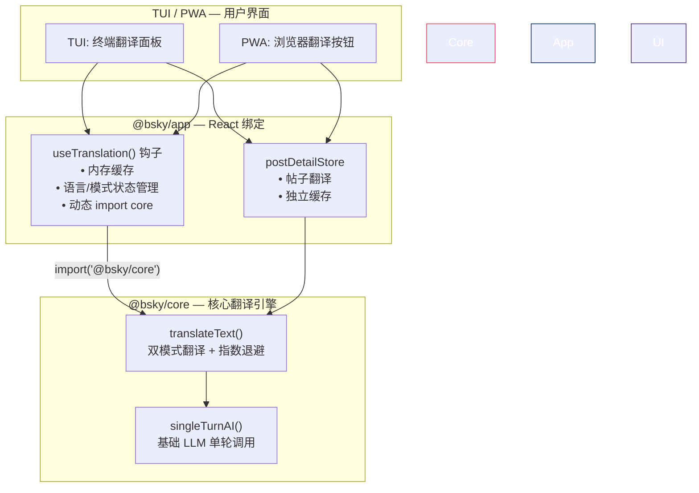
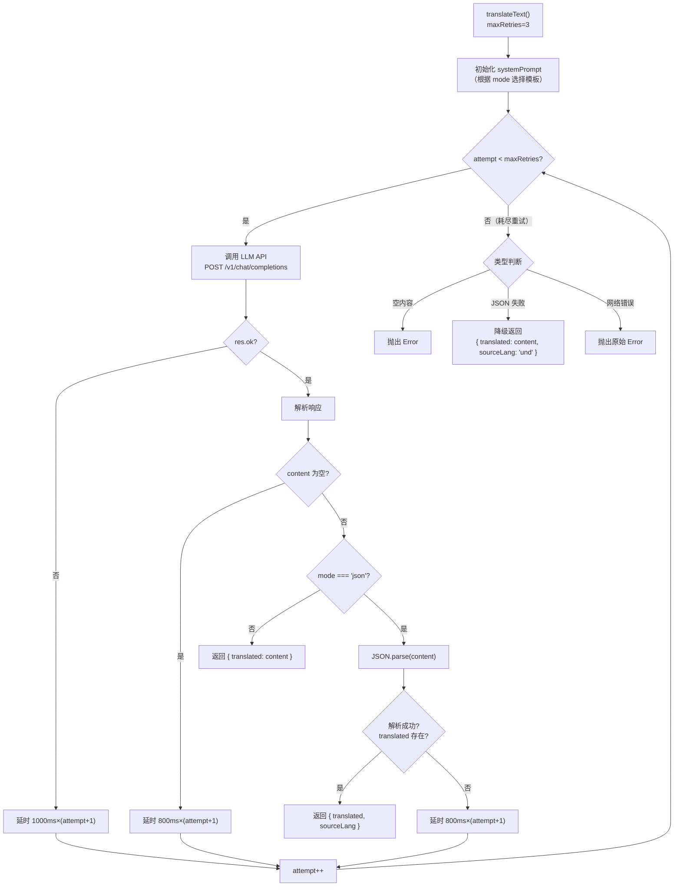

## 概览与设计动机

智能翻译系统是 Bsky 客户端中帖子内容翻译的核心基础设施。它由两个分层模块组成：**Core 层的 `translateText()` 函数**（位于 `@bsky/core` 包中）提供底层的 LLM API 调用与容错逻辑；**App 层的 `useTranslation` React 钩子**（位于 `@bsky/app` 中）提供状态管理、缓存和 UI 绑定。这个分层设计遵循了单体仓库中 core → app → tui/pwa 的三层依赖体系，使得翻译逻辑可以跨 TUI 和 PWA 两种界面复用，而无需重复实现。此外，`usePostDetail` 钩子内部的 `postDetailStore` 也内嵌了自己的翻译方法，用于帖子详情页面的按需翻译。

Sources: [assistant.ts](packages/core/src/ai/assistant.ts#L590-L695) | [useTranslation.ts](packages/app/src/hooks/useTranslation.ts#L1-L48) | [postDetail.ts](packages/app/src/stores/postDetail.ts#L51-L70)

## 系统架构



### 组件职责说明

| 组件 | 位置 | 职责 | 关键特性 |
|------|------|------|----------|
| `translateText()` | `packages/core/src/ai/assistant.ts` | 核心翻译函数，执行 LLM 调用 | 双模式输出、指数退避重试、JSON 模式的结构化响应 |
| `singleTurnAI()` | `packages/core/src/ai/assistant.ts` | 基础单轮 AI 调用引擎 | 无工具调用、低温度(0.3)、禁用 thinking |
| `useTranslation()` | `packages/app/src/hooks/useTranslation.ts` | React 钩子层 | 内存缓存 Map、语言/模式切换、懒加载 core 模块 |
| `postDetailStore.translate()` | `packages/app/src/stores/postDetail.ts` | 帖子级别的按需翻译 | 独立缓存、硬编码 prompts、无重试机制 |
| `translateToChinese()` | `packages/core/src/ai/assistant.ts` | 旧兼容接口 | 简单封装 translateText(zh, simple) |
| `LANG_LABELS` | 两处分别定义 | 语言标签映射表 | 支持 zh/en/ja/ko/fr/de/es |

Sources: [assistant.ts](packages/core/src/ai/assistant.ts#L590-L695) | [useTranslation.ts](packages/app/src/hooks/useTranslation.ts#L1-L48) | [postDetail.ts](packages/app/src/stores/postDetail.ts#L51-L70) | [index.ts](packages/core/src/index.ts#L17-L19)

## 双模式翻译：simple 与 json

`translateText()` 函数的第一个核心设计是双模式输出。参数 `mode` 控制返回格式：

### Simple 模式（默认）

```typescript
// 调用示例
translateText(config, "Hello, world!", "zh", "simple")
// 返回: { translated: "你好，世界！" }
```

系统 Prompt 为纯文本指令，要求 LLM 只输出译文，不做任何解释。此模式适用于 UI 中直接嵌入翻译结果的场景，延迟最低、token 消耗最少。

### JSON 模式

```typescript
// 调用示例
translateText(config, "Hello, world!", "zh", "json")
// 返回: { translated: "你好，世界！", sourceLang: "en" }
```

系统 Prompt 要求 LLM 输出严格 JSON 格式，包含 `source_lang`（ISO 639-1 代码，不确定时用 `'und'`）和 `translated` 两个 key。此模式下还会在请求体中附加 `response_format: { type: 'json_object' }` 参数，强制 LLM 返回合法 JSON。适用于需要源语言检测的场景，如多语言帖子自动识别语言来源。

### 双模式对比

| 维度 | Simple 模式 | JSON 模式 |
|------|-------------|-----------|
| 输出格式 | 纯文本 | `{ translated: string, source_lang: string }` |
| 额外信息 | 无 | 源语言检测 |
| 系统 Prompt 长度 | 较短 (~50 chars) | 较长 (~200 chars) |
| 容错处理 | 无需解析，直接使用 | 需要 JSON.parse，失败时降级为 plain text |
| API 参数 | 无特殊参数 | 附加 `response_format: { type: 'json_object' }` |
| 适用场景 | UI 内嵌翻译、快速翻译 | 需要语言检测的分析场景 |

Sources: [assistant.ts](packages/core/src/ai/assistant.ts#L625-L655) | [assistant.ts](packages/core/src/ai/assistant.ts#L608-L626)

## 指数退避重试机制

翻译系统设计了系统化的重试策略，以应对 LLM API 的不稳定性。这是 `translateText()` 的第二大核心设计。

### 重试触发条件

有三种情况会触发重试：

1. **空内容响应**：LLM 返回了 `content` 但为空字符串
2. **JSON 解析失败**（JSON 模式）：返回内容无法被 `JSON.parse` 解析
3. **网络/API 错误**：`fetch` 抛出异常或 HTTP 状态码非 200

### 延迟策略

```
第一类（空内容 / JSON 解析失败）：800ms × (attempt + 1)
  第 0 次: 800ms → 第 1 次: 1600ms → 第 2 次: 2400ms

第二类（网络/API 错误）：1000ms × (attempt + 1)
  第 0 次: 1000ms → 第 1 次: 2000ms → 第 2 次: 3000ms
```

两类错误使用不同的基础延迟系数（800ms vs 1000ms），因为网络错误通常需要更长的等待时间来恢复。

### 重试流程图



### 重试边界与降级策略

- **最大重试次数**：`maxRetries = 3`（默认值），可通过参数覆盖
- **JSON 模式的优雅降级**：当 JSON 解析持续失败时，不会抛出异常，而是将原始 LLM 输出作为 `translated` 返回，并标记 `sourceLang: 'und'`（未知语言）。确保用户至少能看到翻译内容，即使结构不完整
- **空内容的硬失败**：如果所有重试后 LLM 仍返回空内容，则抛出明确的错误信息 `"Translation returned empty content after retries"`
- **网络错误的透传**：网络/API 错误在所有重试用尽后会向上抛出原始异常，让调用层（useTranslation 或 postDetailStore）自行处理

Sources: [assistant.ts](packages/core/src/ai/assistant.ts#L590-L695)

## 内存缓存策略

系统在 React 层实现了轻量级内存缓存，避免对相同文本的重复翻译。

### useTranslation 钩子的缓存

```typescript
const [cache] = useState(() => new Map<string, TranslationResult>());
```

缓存键的生成规则：`${mode}::${lang}::${text}`。这意味着同一段文本使用不同模式（simple/json）或不同目标语言时，会被视为不同的缓存条目。缓存是整个钩子生命周期内有效的单例，且不支持过期回收——适用于单页面会话内不会频繁切换超大量文本的场景。

### postDetailStore 的缓存

```typescript
store.translations: Map<string, string>
```

缓存键的生成规则：`${targetLang}::${text}`。这里的缓存只缓存翻译结果字符串（不包含 sourceLang），且 `clear()` 会在每次加载新帖子时被调用，确保帖子切换时缓存不污染。

### 缓存差异对比

| 特性 | useTranslation | postDetailStore |
|------|----------------|-----------------|
| 键范围 | `mode::lang::text` | `lang::text` |
| 值类型 | `TranslationResult`（含 sourceLang） | `string`（纯译文） |
| 生命周期 | 钩子挂载期间 | 当前帖子存活期间 |
| 清理时机 | 手动 setLang/mode 不清理 | 每次 load 新帖子时 clear() |
| 大小 | 无限制（会话内缓存） | 无限制（但随帖子切换清空） |

Sources: [useTranslation.ts](packages/app/src/hooks/useTranslation.ts#L22-L36) | [postDetail.ts](packages/app/src/stores/postDetail.ts#L19-L70)

## useTranslation 钩子：状态管理与懒加载

`useTranslation` 是 UI 层访问翻译功能的主要入口。它的设计体现了两个关键模式：

### 参数与状态

```typescript
function useTranslation(
  aiKey: string,       // OpenAI 兼容 API Key
  aiBaseUrl: string,   // API 基础 URL
  aiModel?: string,    // 模型名，默认 deepseek-v4-flash
  targetLang?: TargetLang,  // 目标语言，默认 'zh'
  initialMode?: 'simple' | 'json', // 翻译模式，默认 'simple'
)
```

返回的状态包括：
- `translate(text, overrideLang?)` — 翻译函数，可选覆盖目标语言
- `loading` — 布尔状态，指示翻译进行中
- `cache` — 底层的 Map 实例（暴露给调用方做超细粒度控制）
- `lang` / `setLang` — 当前目标语言及切换方法
- `mode` / `setMode` — 当前翻译模式及切换方法
- `LANG_LABELS` — 语言标签映射表（渲染 UI 选择器用）

### 懒加载策略

```typescript
const { translateText } = await import('@bsky/core');
```

这是关键的设计决策：`translateText` 不是静态导入，而是通过动态 `import()` 在首次调用时加载。这个策略确保：

1. **代码分割**：翻译引擎的完整代码（包括 LLM API 调用逻辑）不会被包含在初始 bundle 中
2. **按需加载**：只有在用户真正触发翻译时，Core 包的翻译模块才会被请求和加载
3. **TUI/PWA 通用**：无论终端（Node.js）还是浏览器环境，动态 import 都能正常工作

Sources: [useTranslation.ts](packages/app/src/hooks/useTranslation.ts#L1-L48)

## postDetailStore 的翻译实现：独立但精简化

`postDetailStore.translate()` 是与 `useTranslation` 并行的翻译实现，专为帖子详情页设计。它与核心 `translateText()` 有三点显著差异：

### 1. 硬编码 System Prompt

```typescript
const prompts: Record<string, string> = {
  zh: '你是一个专业翻译，将以下文本翻译成中文，保持原意，仅输出翻译结果，不做解释。',
  en: 'You are a professional translator. Translate the following text into English. Output only the translation.',
  ja: 'プロの翻訳者です。以下のテキストを日本語に翻訳してください。翻訳結果だけを出力してください。',
};
```

只有三种目标语言（zh/en/ja），不支持 ko/fr/de/es 等其他语言。这意味着帖子内翻译的语言覆盖面不如 useTranslation 广。

### 2. 无重试机制

```typescript
const data = await res.json() as { choices: Array<{ message: { content: string } }> };
const result = data.choices[0]?.message?.content ?? '';
```

直接调用 fetch 并解析结果，没有任何异常处理、重试或指数退避。如果 LLM API 暂时不可用，翻译会直接失败，错误会向上冒泡到调用方。

### 3. 无模式切换

始终使用 simple 模式（纯文本输出），不支持 JSON 模式的结构化响应。因此也没有源语言检测功能。

### 为什么需要两种实现？

这是一个演进中的架构：`postDetailStore.translate()` 是早期实现，直接嵌入在帖子详情 store 中；`useTranslation` + `translateText()` 是后来的统一抽象。两者目前共存，但新功能（如 JSON 模式、重试机制）只在核心的 `translateText()` 中实现。存在架构迁移的方向：当 `usePostDetail` 重构时，可以预计 `postDetailStore.translate()` 将被 `translateText()` 替换。

Sources: [postDetail.ts](packages/app/src/stores/postDetail.ts#L51-L70)

## 旧的兼容接口：translateToChinese

```typescript
export async function translateToChinese(config: AIConfig, text: string): Promise<string> {
  const result = await translateText(config, text, 'zh', 'simple');
  return result.translated;
}
```

`translateToChinese` 是 `translateText` 的一个极简封装，专门用于英译中场景。它的返回类型是 `string`（而非 `TranslationResult`），这是为了向后兼容早期代码。集成测试中有对应的测试用例：

```typescript
it('should translate English to Chinese', async () => {
  const result = await translateToChinese(AI_CONFIG, 'Hello, this is a test post about Bluesky and the AT Protocol.');
  expect(result).toBeTruthy();
  expect(/[\u4e00-\u9fff]/.test(result)).toBe(true);
});
```

Sources: [assistant.ts](packages/core/src/ai/assistant.ts#L674-L677) | [ai_integration.test.ts](packages/core/tests/ai_integration.test.ts#L104-L109)

## 安全注意事项：思考模式显式禁用

翻译功能在 LLM 调用时显式禁用了思考模式（DeepSeek 的深度思考功能）：

```typescript
thinking: { type: 'disabled' },
```

与此形成对比的是 `AIAssistant` 主类中的多轮工具调用默认启用了思考模式。这个设计决策源于翻译场景的特性：
- 翻译需要**确定性输出**而非创造性推理
- 思考模式会引入不必要的延迟和 token 消耗
- 禁用思考模式后，LLM 更倾向于直接输出简洁的译文

temperature 也设为 0.3（低于 AIAssistant 的 0.7），进一步抑制输出随机性。

Sources: [assistant.ts](packages/core/src/ai/assistant.ts#L635-L637)

## 集成测试覆盖

翻译系统通过 `ai_integration.test.ts` 进行端到端测试，使用真实的 LLM API（默认 DeepSeek）：

| 测试名称 | 测试内容 | 验证点 |
|----------|----------|--------|
| "should translate English to Chinese" | translateToChinese 英译中功能 | 返回中文字符 |
| "should polish a draft post" | polishDraft 草稿润色（更正式） | 输出非空 |
| "should polish a draft to be more humorous" | polishDraft 草稿润色（更幽默） | 输出非空 |

这些测试都依赖 `.env` 文件中的 `LLM_API_KEY` 环境变量，如果未配置则自动跳过。测试超时时间设为 60 秒（`60000ms`），以应对 LLM API 的延迟波动。

Sources: [ai_integration.test.ts](packages/core/tests/ai_integration.test.ts#L96-L129)

## 阅读导航

下一篇文章将深入 AI 系统中的另一核心工具函数：草稿润色与单轮对话。请继续阅读 [AI 草稿润色与单轮对话工具函数](15-ai-cao-gao-run-se-yu-dan-lun-dui-hua-gong-ju-han-shu) 了解 `polishDraft` 和 `singleTurnAI` 的详细设计。

如果您尚未了解翻译系统的上层用户——帖子详情页面的完整操作集合，建议先阅读 [usePostDetail：帖子详情、翻译缓存与操作集合](18-usepostdetail-tie-zi-xiang-qing-fan-yi-huan-cun-yu-cao-zuo-ji-he)。