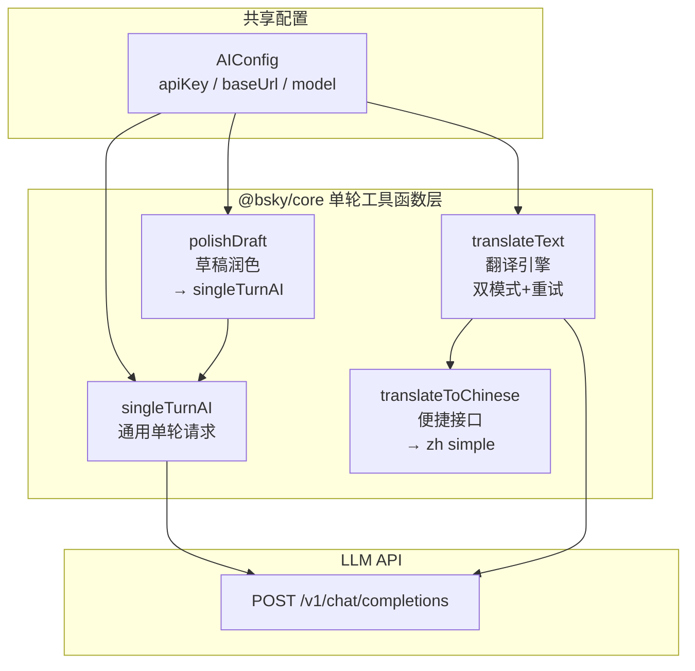

## 设计定位与职责边界

在 AI 集成架构中，`AIAssistant` 类承担多轮工具调用引擎的重任，而 `singleTurnAI`、`translateText`、`translateToChinese` 和 `polishDraft` 四个导出函数则构成了一个**轻量级单轮对话工具层**。它们共享相同的底层 LLM API 调用通道，但**刻意剥离了工具调用（tool calling）机制**——无中间步骤、无写操作确认门、无会话历史累积。这种职责分离的设计并非冗余，而是服务于三类无需工具介入的原子化 AI 任务：独立翻译、草稿润色和一次性问答生成。

从架构层级看，这四个函数全部定义于 `packages/core/src/ai/assistant.ts` 文件末尾，与 `AIAssistant` 类同源但逻辑解耦。它们通过 `packages/core/src/index.ts` 的公共 API 暴露给上层使用：
```typescript
// core/src/index.ts
export { AIAssistant, singleTurnAI, translateToChinese, translateText, polishDraft } from './ai/assistant.js';
```
Sources: [assistant.ts](packages/core/src/ai/assistant.ts#L601-L695), [index.ts](packages/core/src/index.ts#L18-L21)

---

## 核心函数架构

下图展示了四个单轮工具函数之间的关系、各自的特化方向以及它们在调用链中的位置：



四个函数的依赖路径为：`polishDraft` 直接委托 `singleTurnAI`（包装系统提示词和用户提示词的组合），`translateToChinese` 直接委托 `translateText`（固定 targetLang='zh'、mode='simple'）。`singleTurnAI` 和 `translateText` 则是平级关系——前者是通用底层，后者内置了重试逻辑和双模式输出解析。

Sources: [assistant.ts](packages/core/src/ai/assistant.ts#L601-L695)

---

## singleTurnAI：通用单轮调用

`singleTurnAI` 是最基础的单轮对话函数，构成了其他所有单轮工具的基石。它的参数签名清晰地反映了其设计目标——无状态、无工具、一次性完成：

```typescript
export async function singleTurnAI(
  config: AIConfig,       // API 配置（key、URL、模型名）
  systemPrompt: string,   // 系统级指令
  userPrompt: string,     // 用户输入
  temperature = 0.3,      // 温度参数，默认低随机性
  maxTokens = 2000,       // 最大输出长度
): Promise<string>        // 返回纯文本
```

从实现角度看，它做了三件事：

1. **构造请求体**：仅包含 `system` 和 `user` 两条消息，无 `tools` 数组、无 `tool_choice`、`stream: false`
2. **发送 HTTP 请求**：使用原生 `fetch` 向 LLM API 的 `/v1/chat/completions` 端点 POST，包含 Bearer Token 鉴权
3. **提取响应文本**：从 `data.choices[0].message.content` 中提取纯文本返回
4. **网络错误处理**：检查 `TypeError` 且消息为 `'fetch failed'` 时，抛出包含 URL 和网络提示的友好错误信息

值得注意的是，`singleTurnAI` **默认启用 thinking 模式**（`thinking: { type: config.thinkingEnabled !== false ? 'enabled' : 'disabled' }`），这与 `translateText` 不同——后者强制禁用 thinking（`thinking: { type: 'disabled' }`）。这反映了设计意图：翻译任务追求稳定可预测的输出格式，不需要模型进行深度推理；而润色和通用问答可能需要推理来提升质量。

Sources: [assistant.ts](packages/core/src/ai/assistant.ts#L601-L650)

---

## polishDraft：草稿润色

`polishDraft` 是 `singleTurnAI` 最直接的封装。它接受三个参数：AI 配置、草稿文本和用户润色要求，返回润色后的纯文本：

```typescript
export async function polishDraft(
  config: AIConfig,
  draft: string,
  requirement: string,
): Promise<string>
```

它的实现极为简洁——将 `requirement` 和 `draft` 拼接成一条 user prompt，传给 `singleTurnAI`：

```typescript
const systemPrompt = `你是一个文字润色助手，根据用户要求调整以下帖子草稿，只返回润色后的文本。`;
return singleTurnAI(
  config,
  systemPrompt,
  `用户要求：${requirement}\n\n草稿：\n${draft}`,
  0.7,    // 温度提升到 0.7——润色任务需要更多创意
  2000,   // 最大 2000 tokens
);
```

这里有一个值得注意的细微设计：**温度参数被设为 0.7**，高于 `singleTurnAI` 默认的 0.3。这意味着润色任务允许模型有更多创造性发挥空间——改写措辞、调整语气、注入风格——而非严格遵循字面原意。系统提示词中的"只返回润色后的文本"约束了输出格式，但温度控制着文本输出的多样性程度。

集成测试验证了三种典型场景：中文翻译一致性（输出含中文字符）、风格化润色（"更正式"）、创意润色（"更幽默"）。每次调用的超时为 60 秒。

Sources: [assistant.ts](packages/core/src/ai/assistant.ts#L683-L695), [ai_integration.test.ts](packages/core/tests/ai_integration.test.ts#L132-L157)

---

## translateText：翻译引擎的双模式设计与指数退避

`translateText` 是这四个函数中**实现最复杂**的一个，因为它需要处理模态切换、结构化 JSON 解析、以及基于重试的容错。它的函数签名如下：

```typescript
export async function translateText(
  config: AIConfig,
  text: string,
  targetLang: string,        // ISO 639-1 语言代码
  mode: 'simple' | 'json' = 'simple',
  maxRetries = 3,
): Promise<TranslationResult>
```

返回类型 `TranslationResult` 在两种模式下略有差异：
```typescript
export interface TranslationResult {
  translated: string;
  sourceLang?: string;  // 仅 json 模式返回，ISO 639-1 或 'und'
}
```

### 双模式对比

| 维度 | simple 模式 | json 模式 |
|------|------------|----------|
| **系统提示词** | 仅要求输出翻译文本，不附加说明 | 要求输出 JSON 对象，包含 `source_lang` 和 `translated` 两个字段 |
| **API 参数** | 无 `response_format` | `response_format: { type: 'json_object' }` |
| **解析逻辑** | 直接取 `content` 作为翻译结果 | `JSON.parse(content)` 后提取字段 |
| **失败兜底** | 空内容直接重试 | JSON 解析失败时有两种路径：重试 > 将原始文本作为 `translated`、`sourceLang` 设为 `'und'` |
| **源语言检测** | 无 | 有，通过 `source_lang` 字段返回 |
| **使用场景** | 追求速度、无需源语言信息 | 需要探测原文语言、结构化输出 |

### 指数退避重试机制

重试逻辑贯穿整个函数：外层 `for` 循环控制最多 `maxRetries`（默认 3）次尝试，内部根据失败原因使用不同的退避策略：

1. **空内容重试**：`content.trim()` 为空时，等待 `800 * (attempt + 1)` 毫秒后重试
2. **JSON 解析失败**（json 模式）：同上，800ms 递增退避
3. **HTTP/网络异常**：`catch` 块中，等待 `1000 * (attempt + 1)` 毫秒后重试

这种设计提供了**分层容错能力**：空内容和 JSON 解析失败是"软错误"（模型输出格式问题），使用较短退避；网络异常是"硬错误"，使用较长退避。当所有重试用尽后，json 模式会尝试**优雅降级**——将原始 LLM 输出作为翻译文本、源语言标记为 `'und'`，而非直接抛出异常。

### 语言标签映射

函数内部维护了一个 `LANG_LABELS` 字典，将 ISO 639-1 代码转换为该语言的自称（如 `zh → 中文`、`ja → 日本語`）。这个映射用于构造系统提示词中的目标语言描述，使 LLM 能更准确地理解翻译方向。目前支持 7 种语言：中文、英文、日文、韩文、法文、德文、西班牙文。

Sources: [assistant.ts](packages/core/src/ai/assistant.ts#L651-L682)

---

## translateToChinese：便捷兼容接口

`translateToChinese` 是 `translateText` 的语法糖——它将 `targetLang` 固定为 `'zh'`、`mode` 固定为 `'simple'`，并解构返回结果直接返回 `translated` 字符串而非 `TranslationResult` 对象：

```typescript
export async function translateToChinese(
  config: AIConfig,
  text: string,
): Promise<string> {
  const result = await translateText(config, text, 'zh', 'simple');
  return result.translated;
}
```

这个函数的存在是为了**向后兼容**：在早期架构中，翻译功能仅面向中文，且不需要源语言检测。集成测试中也仍以其作为主要测试入口：
```typescript
it('should translate English to Chinese', async () => {
  const result = await translateToChinese(AI_CONFIG, 'Hello, this is a test post...');
  expect(/[\u4e00-\u9fff]/.test(result)).toBe(true);
}, 60000);
```
Sources: [assistant.ts](packages/core/src/ai/assistant.ts#L676-L682), [ai_integration.test.ts](packages/core/tests/ai_integration.test.ts#L124-L131)

---

## 与 useTranslation 钩子的集成

在上层应用中，这些单轮工具函数通过 `useTranslation` 钩子与 React 组件结合。该钩子定义于 `packages/app/src/hooks/useTranslation.ts`，封装了翻译的缓存层和状态管理：

```typescript
export function useTranslation(
  aiKey: string,
  aiBaseUrl: string,
  aiModel = 'deepseek-v4-flash',
  targetLang: TargetLang = 'zh',
  initialMode: 'simple' | 'json' = 'simple',
)
```

关键设计细节：

- **按需加载**：`translateText` 通过 `await import('@bsky/core')` 动态导入，避免在首屏加载时将整个 core 包拉入
- **内存缓存**：使用 `Map<string, TranslationResult>` 作为缓存容器，缓存键为 `${mode}::${lang}::${text}` 的组合字符串，确保不同模式/语言/原文的组合各自独立缓存
- **状态暴露**：钩子向外暴露 `loading`（请求进行中）、`lang`（当前目标语言）、`mode`（当前模式）以及对应的 setter，允许组件动态切换翻译参数

缓存粒度的设计值得注意：同一个文本若先以 simple 模式翻译后又以 json 模式请求，由于缓存键不同，会触发两次独立的 API 调用——这是缓存正确性优先于命中率的权衡。

Sources: [useTranslation.ts](packages/app/src/hooks/useTranslation.ts)

---

## 系统提示词约定

根据 `contracts/system_prompts.md` 的约定，所有单轮工具函数使用的系统提示词遵循统一的指令风格：

| 函数 | 系统提示词 | 指令特点 |
|------|-----------|---------|
| `polishDraft` | 你是一个文字润色助手，根据用户要求调整以下帖子草稿，只返回润色后的文本。 | 约束输出格式（仅文本）、限定角色（润色助手） |
| `translateText` (simple) | Translate the following text to {langLabel}. Keep the original meaning, output only the translation, no explanations. | 语言对齐、禁止解释性输出 |
| `translateText` (json) | You are a translator...Output valid JSON with these keys...Output ONLY the JSON object. | 结构化输出要求、字段名约定 |
| `singleTurnAI`（引导问题场景） | 你是一个深度集成 Bluesky 的终端助手。用户正在查看这个帖子: {post_uri}。请生成 3 个引导性问题... | 场景化、格式要求（行分割） |

这些提示词都遵循**同一个模式**：在消息开头定义角色和任务边界，在结尾精确约束输出格式。这种"角色 + 约束"结构显著提高了输出格式的一致性，尤其在 json 模式下。

Sources: [system_prompts.md](contracts/system_prompts.md#L16-L21)

---

## 使用场景与导航

这四个单轮工具函数在多轮 AI 对话之外提供了轻量的原子化能力。当你需要**不涉及工具调用的一次性 AI 操作**时——无论是翻译一篇文章、润色一条推文、还是生成对某个帖子的引导问题——这些函数是比实例化 `AIAssistant` 更轻量的选择。

进一步的阅读方向：

- 若需了解多轮工具调用的完整引擎，参见 [AIAssistant：多轮工具调用引擎与 SSE 流式输出](12-aiassistant-duo-lun-gong-ju-diao-yong-yin-qing-yu-sse-liu-shi-shu-chu)
- 若需了解 React 层面的流式渲染和持久化集成，参见 [useAIChat 钩子：流式渲染、写操作确认、撤销/重试与自动保存](13-useaichat-gou-zi-liu-shi-xuan-ran-xie-cao-zuo-que-ren-che-xiao-zhong-shi-yu-zi-dong-bao-cun)
- 若需了解翻译系统的完整设计，参见 [智能翻译系统：双模式翻译（simple/json）与指数退避重试](14-zhi-neng-fan-yi-xi-tong-shuang-mo-shi-fan-yi-simple-json-yu-zhi-shu-tui-bi-zhong-shi)