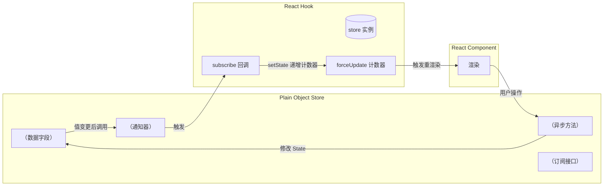

本页深入剖析项目中核心的状态管理范式——**单向监听器 Store（One-way Listener Store）**。这是一种轻量级的纯对象状态管理模式，以工厂函数创建可观察的 store 对象，再通过 React 钩子建立组件与 store 之间的订阅关系。整个方案不依赖 Redux、Zustand 或 Context API，而是用不到 30 行模板代码实现可预测的、单向数据流的状态管理。核心思想可概括为：**用纯 JavaScript 对象管理状态，用回调函数桥接 React 渲染**。

---

## 模式概览：从「数据变更」到「UI 更新」的最短路径



整个流程是一条清晰的**单向路径**：用户操作 → store 方法 → 修改数据 → 调用 `_notify()` → 触发钩子的订阅回调 → `forceUpdate` 导致 React 重渲染。没有任何双向绑定或中间件，数据流在一轮同步/异步操作完成后一次性通知 UI。

Sources: [auth.ts](packages/app/src/stores/auth.ts#L1-L70), [timeline.ts](packages/app/src/stores/timeline.ts#L1-L75), [postDetail.ts](packages/app/src/stores/postDetail.ts#L1-L128)

---

## 核心模式：工厂函数 + 订阅契约

每个 store 由**工厂函数**（如 `createAuthStore`）创建，返回一个**可变（mutable）纯 JavaScript 对象**。这种设计刻意选择了最低抽象层次——没有类继承、没有代理（Proxy）、没有不可变数据强制。它的契约只包含三个要素：

### 1. 订阅接口（Subscribe Contract）

```typescript
interface ListenerStore {
  listener: (() => void) | null;    // 持有唯一订阅回调
  _notify(): void;                   // 通知当前 listener
  subscribe(fn: () => void): () => void;  // 注册/返回取消函数
}
```

`subscribe` 将回调存入 `store.listener`，返回的取消函数将 `listener` 置为 `null`。这是**单监听器模型**——一个 store 实例同时只能被一个 React 组件订阅。这在当前架构中是有意为之的约束：每个 store 实例通过 `useState(() => createStore())` 创建，与组件生命周期 1:1 绑定，因此不需要多监听器支持。

关键实现（以 `createAuthStore` 为例）：

```typescript
_notify() { if (store.listener) store.listener(); },
subscribe(fn) {
  store.listener = fn;
  return () => { store.listener = null; };
},
```

Sources: [auth.ts](packages/app/src/stores/auth.ts#L63-L65), [timeline.ts](packages/app/src/stores/timeline.ts#L68-L70), [postDetail.ts](packages/app/src/stores/postDetail.ts#L120-L122)

### 2. 异步方法中的通知点（Notification Points）

`_notify()` 的调用位置遵循固定模式—**在异步操作的前后各调用一次**。这使得钩子能立即响应 `loading` 状态的变化：

```typescript
async load(client: BskyClient) {
  store.loading = true;     // 1. 设置 loading
  store._notify();          // 2. 通知 UI 显示加载中
  try {
    const res = await client.getTimeline(20);
    store.posts = res.feed.map(f => f.post);  // 3. 更新数据
    store.error = null;
  } catch (e) {
    store.error = e instanceof Error ? e.message : String(e);
  } finally {
    store.loading = false;  // 4. 清除 loading
    store._notify();        // 5. 通知 UI 显示结果
  }
}
```

这种**双通知模式**确保 `loading` 状态在异步操作的开始和结束时都能触发 UI 更新，避免了「加载中指示器不显示」或「结果到达后 UI 不刷新」的问题。

Sources: [timeline.ts](packages/app/src/stores/timeline.ts#L14-L43), [auth.ts](packages/app/src/stores/auth.ts#L16-L36)

### 3. 状态访问（State Access）

因为 store 是可变对象，React 钩子可以直接读取 `store.posts`、`store.loading` 等属性。不需要像 Redux 那样通过 selector 选择切片，也不需要像 Zustand 那样调用 `getState()`。数据总是**当前最新值**。

---

## 两种订阅变体

| 特征 | 单监听器模型（Stores） | 多监听器模型（i18n / Navigation） |
|------|----------------------|----------------------------------|
| 适用场景 | 组件局部 store（auth / timeline / postDetail） | 全局单例（i18n）或需多处订阅（navigation） |
| 监听器存储 | `listener: (() => void) \| null` | `Set<() => void>` 或数组 |
| 多订阅支持 | ❌ 不支持 | ✅ 支持 |
| 生命周期 | 与 `useState` 创建的组件绑定 | 模块级常驻内存 |
| 示例文件 | [auth.ts](packages/app/src/stores/auth.ts) | [store.ts](packages/app/src/i18n/store.ts#L1-L85), [navigation.ts](packages/app/src/state/navigation.ts#L1-L66) |

### 多监听器变体示例（i18n）

国际化系统需要全局共享翻译函数和当前语言设置，因此使用**模块级单例** + **多监听器 Set**：

```typescript
const listeners = new Set<() => void>();

// ...
setLocale(locale: Locale) {
  if (!allMessages[locale]) return;
  store.locale = locale;
  store.messages = allMessages[locale];
  listeners.forEach(fn => fn());  // 通知所有订阅者
},
subscribe(fn) {
  listeners.add(fn);
  return () => { listeners.delete(fn); };
},
```

与单监听器模型相比，这里用 `listeners.forEach(fn => fn())` 代替了 `if (store.listener) store.listener()`，用 `Set.delete` 代替了将 `listener` 置为 `null`。语义上等价，但支持多个 React 组件（页头语言选择器 + 页面内容）同时响应语言切换。

Sources: [store.ts](packages/app/src/i18n/store.ts#L38-L53), [navigation.ts](packages/app/src/state/navigation.ts#L24-L31)

---

## React 钩子集成：桥接纯状态与 React 渲染

钩子的任务是建立 store 与 React 组件之间的订阅关系，采用一个**固定的四步模板**：

```typescript
function useAuth() {
  // Step 1: 创建 store 实例（惰性初始化，仅在组件挂载时执行一次）
  const [store] = useState(() => createAuthStore());

  // Step 2: 创建 forceUpdate 机制
  const [, force] = useState(0);
  const tick = useCallback(() => force(n => n + 1), []);

  // Step 3: 订阅 store，组件卸载时自动取消
  useEffect(() => store.subscribe(tick), [store, tick]);

  // Step 4: 返回 UI 所需的数据和方法
  return {
    client: store.client,
    session: store.session,
    profile: store.profile,
    loading: store.loading,
    error: store.error,
    login: (h: string, p: string) => store.login(h, p),
    restoreSession: (s: CreateSessionResponse) => store.restoreSession(s),
  };
}
```

### 四步模板详解

| 步骤 | 代码 | 作用 | 为什么这样写 |
|------|------|------|------------|
| **1. store 实例** | `useState(() => createStore())` | 惰性创建 store，组件卸载时 store 被 GC | 工厂函数只在首次渲染执行；`useRef` 也可以但 `useState` 更语义化 |
| **2. forceUpdate** | `useState(0)` + `useCallback` | 提供稳定的、零副作用的强制渲染触发器 | `tick` 函数引用不变，避免 `useEffect` 重复执行 |
| **3. 订阅** | `useEffect(() => store.subscribe(tick), [store, tick])` | 挂载时注册，卸载时取消 | `subscribe` 返回的取消函数被 `useEffect` 的 cleanup 自动调用 |
| **4. 数据投影** | 返回新对象 | 解耦 store 内部结构与组件接口 | 组件只消费它需要的字段，store 可以自由重构 |

### 为什么不用 `useContext` / Redux / Zustand？

- **无需 Context Provider**：每个 `useState(() => createStore())` 创建的 store 实例天然隔离，不需要 Provider 包裹树
- **零额外依赖**：只依赖 React 自带的 `useState` / `useEffect` / `useCallback`
- **可测试性**：store 是纯对象，不依赖 React 即可单元测试；钩子可通过渲染测试验证订阅行为
- **类型安全**：TypeScript 接口明确定义 store 形状，工厂函数返回的类型就是钩子的数据源

### 另一种模式：直接 forceUpdate（useDrafts）

`useDrafts` 走了一条不同的路——它不使用 `subscribe/_notify` 模式，而是在 action 方法中直接调用 `forceUpdate`：

```typescript
const saveDraft = useCallback((d) => {
  store.saveDraft(d);
  tick(n => n + 1);  // 手动触发重渲染
}, [store]);
```

这适用于**纯本地状态**（草稿列表只被一个组件操作，不需要外部方法修改）。这种模式更简洁，但失去了解耦性——如果未来需要在组件外部（如 `useAIChat` 自动保存草稿时）修改 draft store，单监听器模型的 `_notify` 模式会更合适。

Sources: [useAuth.ts](packages/app/src/hooks/useAuth.ts#L1-L23), [useTimeline.ts](packages/app/src/hooks/useTimeline.ts#L1-L30), [useDrafts.ts](packages/app/src/hooks/useDrafts.ts#L27-L57)

---

## 不同钩子的 Store 使用策略

| 钩子 | Store 类型 | 实例化方式 | 订阅模型 | 说明 |
|------|-----------|-----------|---------|------|
| `useAuth` | 标准 Store | `useState(() => createAuthStore())` | 单监听器 | 登录状态，组件级实例 |
| `useTimeline` | 标准 Store | `useState(() => createTimelineStore())` | 单监听器 | 时间线数据，含 `loadedRef` 防止重复加载 |
| `usePostDetail` | 标准 Store | `useState(() => createPostDetailStore())` | 单监听器 | 帖子详情 + 翻译缓存 |
| `useNavigation` | 独立实现 | `useState(() => createNavigation())` | 多监听器数组 | 通过 `getState()` 获取完整快照 |
| `useI18n` | 模块级单例 | `getI18nStore()` | 多监听器 Set | 全局唯一，`subscribe` + `unsubscribe` 完备 |
| `useDrafts` | 简化 Store | `useState(() => createDraftsStore())` | 无订阅 | 直接在 action 中 `tick()` |
| `useThread` | 无 Store | 纯 `useState` | 不适用 | 所有状态在钩子内部，无外部可修改性需求 |

Sources: [HOOKS.md](docs/HOOKS.md#L7-L27)

---

## 设计取舍与演进空间

### 当前设计的优点
- **零运行时依赖**：不需要引入 Redux Toolkit、Zustand、Jotai 等状态管理库
- **极低的心智负担**：工厂函数 + 纯对象，不需要理解 reducer、selector、immer 等概念
- **调试友好**：store 是纯对象，浏览器控制台可直接查看 `store.posts`
- **树摇友好**：每个 store 是独立的 ECMAScript 模块，未被使用的 store 不会打包
- **与 React 松耦合**：store 本身没有任何 React 依赖，可以在 Node.js 测试中直接调用

### 当前设计的局限
- **单监听器约束**：If 两个 React 组件需要共享同一个 store 实例（而非各自创建），单监听器模式会出问题。目前通过「各自创建实例」规避，但某些场景（如多处显示未读通知数）可能需要多监听器或 Context
- **缺少选择器 / 记忆化**：每次 `_notify()` 触发都会导致整个钩子重新执行，组件接收到的引用是 `store.posts` 的原引用——如果数组原地修改，`useMemo` / `React.memo` 的浅比较会失效。当前通过每次更新时创建新数组（`store.posts = res.feed.map(...)`）规避
- **缺少批量更新**：如果一次 `_notify()` 中间有多次属性修改（如 `store.loading=false; store.posts=[...]; store.error=null`），当前是一次性通知，但无法保证 React 将多次 `setState` 合并为一次渲染（因为 `tick` 函数只有一次调用）

### 向多 Store 演进的方向

如果未来需要 redux-like 的全局状态管理模式，最自然的迁移路径是：

1. 保持工厂函数模式不变
2. 将多个 store 实例集中到单一 StoreManager 中管理
3. 保留 `_notify/subscribe` 的接口契约，对上层透明

---

## 与 Hooks 层的关系回顾

```
┌─────────────────────────────────────────────────────┐
│                   React 组件层                       │
│  (tui 中的 Ink 组件 / pwa 中的 React 组件)          │
└───────────────────┬─────────────────────────────────┘
                    │ 使用
┌───────────────────▼─────────────────────────────────┐
│               Hooks 层（useAuth / useTimeline 等）    │
│           作用：订阅 store + 投影给组件               │
└───────────────────┬─────────────────────────────────┘
                    │ 调用/订阅
┌───────────────────▼─────────────────────────────────┐
│           Store 层（纯对象 + _notify + subscribe）    │
│           作用：数据 + 状态 + 业务逻辑                │
└───────────────────┬─────────────────────────────────┘
                    │ 调用
┌───────────────────▼─────────────────────────────────┐
│           Core 层（BskyClient / AIAssistant 等）      │
│           作用：API 通信 + 领域逻辑                   │
└─────────────────────────────────────────────────────┘
```

Store 层位于四层架构中的第三层，上承 Hooks（提供可订阅的状态容器），下接 Core（调用 API 客户端和 AI 引擎），自身不依赖任何 UI 框架。

Sources: [架构文档](5-dan-ti-cang-ku-jia-gou-core-app-tui-pwa-de-san-ceng-yi-lai-ti-xi)

---

## 下一步阅读

- **[数据钩子清单](17-shu-ju-gou-zi-qing-dan-useauth-usetimeline-usethread-useprofile-deng)**：查看所有基于本 Store 模式构建的钩子的完整签名和使用方法
- **[国际化系统](29-guo-ji-hua-xi-tong-zh-en-ja-san-yu-yan-dan-li-store-yu-ji-shi-qie-huan)**：了解多监听器变体在全局单例场景下的具体应用
- **[导航状态机](7-dao-hang-zhuang-tai-ji-ji-yu-zhan-de-appview-lu-you-yu-shi-tu-qie-huan)**：查看另一种状态管理模式——基于栈的导航实现
- **[HOOKS.md](docs/HOOKS.md)**：完整的 Hook-Store 映射表与所有钩子签名参考