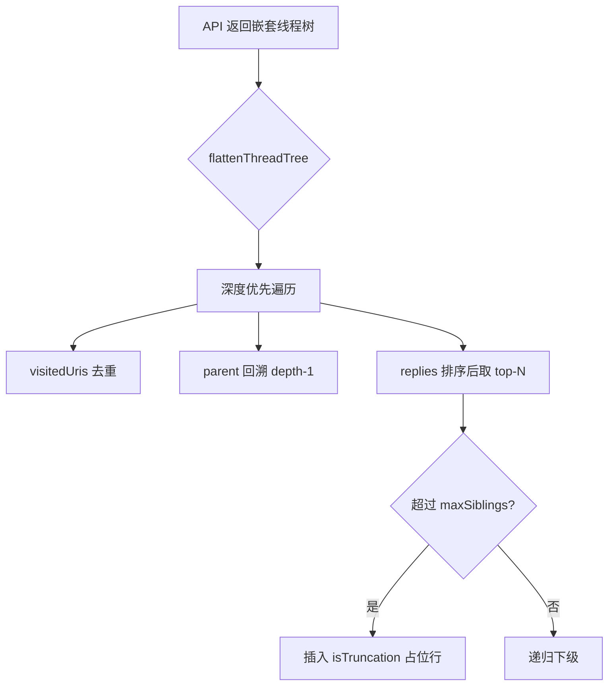

`@bsky/app` 包是连接纯数据层（`@bsky/core`）与渲染层（TUI / PWA）的桥梁，其核心资产就是 **14 个 React 数据钩子**。所有钩子统一遵循一个架构原则：**Store 在外、状态在内、副作用通过 `useEffect` 触发**。本文逐一解析每个钩子的签名、返回值和内部实现模式，帮助你快速定位、选用并避免常见陷阱。

---

## 架构全景：两派钩子与 Store 模式

所有数据钩子可划分为两大阵营——**Store 派**与**内联派**。Store 派使用 `packages/app/src/stores/` 下的独立 Store 对象管理状态，钩子只做订阅代理；内联派则直接用 `useState` + 自定义 `useCallback` 管理全部状态。二者的界线取决于状态的可复用程度和复杂度。

```mermaid
graph TB
    subgraph "Store 派 (5 个钩子)"
        A1[useAuth] --> S1[createAuthStore]
        A2[useTimeline] --> S2[createTimelineStore]
        A3[usePostDetail] --> S3[createPostDetailStore]
        A4[useNavigation] --> S4[createNavigation]
        A5[useDrafts] --> S5[createDraftsStore]
    end

    subgraph "内联派 (9 个钩子)"
        B1[useThread]
        B2[useProfile]
        B3[useSearch]
        B4[useNotifications]
        B5[useBookmarks]
        B6[useCompose]
        B7[useAIChat]
        B8[useChatHistory]
        B9[useTranslation]
    end

    subgraph "统一机制"
        C1["useState(createStore) → 惰性初始化"]
        C2["useRef + useEffect → 一次性加载"]
        C3["useState(0) → forceUpdate 触发重渲染"]
    end

    A1 -.-> C1
    A1 -.-> C2
    A1 -.-> C3
    B1 -.-> C3
```



Store 派钩子的核心订阅模式极其简洁——一个单监听器回调、一个 `useState(0)` 的 forceUpdate：

```typescript
// Store 内部实现
const store = {
  listener: null as (() => void) | null,
  _notify() { if (store.listener) store.listener(); },
  subscribe(fn: () => void) {
    store.listener = fn;
    return () => { store.listener = null; };
  },
};

// Hook 内包装
const [, force] = useState(0);
const tick = useCallback(() => force(n => n + 1), []);
useEffect(() => store.subscribe(tick), [store, tick]);
```

**注意**：这是单监听器模型，每个 Store 实例只能同时被一个 `useEffect` 订阅。多个组件共享同一个 Store 时，后一个订阅会覆盖前一个。这在目前架构中不是问题，因为每个 Store 实例都是通过 `useState(() => createStore())` 在每个钩子调用中独立创建的。

Sources: [packages/app/src/stores/auth.ts](packages/app/src/stores/auth.ts#L1-L70), [packages/app/src/stores/timeline.ts](packages/app/src/stores/timeline.ts#L1-L75)

---

## 身份认证：useAuth

| 属性 | 类型 | 说明 |
|------|------|------|
| `client` | `BskyClient \| null` | AT 协议 HTTP 客户端实例，登录后赋值 |
| `session` | `CreateSessionResponse \| null` | 完整的 session 对象（含 JWT） |
| `profile` | `ProfileView \| null` | 当前登录用户的个人资料 |
| `loading` | `boolean` | login 过程中为 true |
| `error` | `string \| null` | 登录失败的错误信息 |
| `login` | `(handle, password) => Promise<void>` | 使用账号密码登录，内部创建 BskyClient |
| `restoreSession` | `(session) => void` | 从持久化的 session 恢复登录态 |

`useAuth` 是唯一一个 **没有外部依赖** 的顶级钩子——它不需要 `client` 参数，因为它自己创建 `BskyClient`。登录成功后 `client` 和 `profile` 同时就绪，其他所有钩子都将 `client` 作为首个参数等待它传递下来。

`restoreSession` 的恢复路径是异步获取 profile 的：如果 `getProfile` 失败且 `isAuthenticated()` 返回 false，则自动清除 session 并设置 `error = 'session_expired'`，触发重新登录流程。

Sources: [packages/app/src/hooks/useAuth.ts](packages/app/src/hooks/useAuth.ts#L1-L23), [packages/app/src/stores/auth.ts](packages/app/src/stores/auth.ts#L34-L60)

---

## 时间线：useTimeline

```typescript
function useTimeline(client: BskyClient | null): {
  posts: PostView[];           // 当前加载的帖子列表
  loading: boolean;            // 加载中
  cursor: string | undefined;  // 用于分页的游标
  error: string | null;
  loadMore: (() => void) | undefined;   // 加载下一页
  refresh: (() => void) | undefined;    // 重置并重新加载
}
```

内部使用 `createTimelineStore()`，通过 `useRef` 的 `loaded` 标志确保仅在 `client` 从 null 变为非 null 时触发一次 `store.load()`。`loadMore` 和 `refresh` 在 `client` 为 null 时返回 `undefined`，这是一种安全的防御性设计，防止渲染层在未登录状态下调用它们。

每次 `loadMore` 都会累积 `posts`——新的帖子追加到数组末尾，而非替换。`refresh` 则清空 `posts` 和 `cursor`，然后重新调用 `load()`。

Sources: [packages/app/src/hooks/useTimeline.ts](packages/app/src/hooks/useTimeline.ts#L1-L30), [packages/app/src/stores/timeline.ts](packages/app/src/stores/timeline.ts#L32-L65)

---

## 讨论串：useThread

`useThread` 是**内联派**中最复杂的钩子，负责将 AT Protocol 返回的嵌套线程树（`ThreadViewPost`）展平为一维数组 `flatLines: FlatLine[]`，同时管理展开操作、点赞转发状态。

**核心展平逻辑**（`flattenThreadTree`）：



每个 `FlatLine` 携带了帖子渲染所需的全部字段——从 `depth`（用于缩进）、`handle`/`displayName`、`text`、`authorAvatar`（CDN 地址）到各种嵌入媒体的结构化数据。

`focusedIndex` 控制当前光标位置，默认定位到 `isRoot` 的行。`expandReplies` 每次增加 `10` 条 `maxSiblings` 并重新调用 API 获取线程数据后重新展平。

**点赞/转发**使用局部的 `Set<string>` 维护已操作状态，避免重复请求。操作前先通过 `client.getRecord()` 获取帖子的 `cid`，然后调用 `client.createRecord()` 写入 `app.bsky.feed.like` 或 `app.bsky.feed.repost` 集合。

Sources: [packages/app/src/hooks/useThread.ts](packages/app/src/hooks/useThread.ts#L1-L332)

---

## 个人主页：useProfile

`useProfile` 是字段最多的钩子，包含了三种互相独立的数据流：

| 数据流 | 触发器 | 关键字段 |
|--------|--------|----------|
| **个人资料** | `actor` 变化时自动加载 | `profile`, `loading`, `error` |
| **帖子列表** | `tab` 切换时自动加载 | `posts`, `repostReasons`, `feedCursor`, `feedLoading`, `loadMoreFeed` |
| **关注/粉丝列表** | 手动调用 `openFollowList` | `followList`, `followItems`, `followListCursor`, `loadMoreFollowList` |

`tab` 支持 `'posts'`（不含回复）和 `'replies'` 两种模式，切换 `tab` 时会自动触发 `loadFeed()`。`repostReasons` 用于标记哪些帖子是转发而非原创，存的是转发者的 handle。

**关注/取消关注**（`handleFollow` / `handleUnfollow`）在操作完成后会重新调用 `getProfile()` 刷新 `viewer.following` 状态，确保 UI 同步。每次操作都是独立的 HTTP 请求，没有乐观更新。

Sources: [packages/app/src/hooks/useProfile.ts](packages/app/src/hooks/useProfile.ts#L1-L188)

---

## 搜索：useSearch

```typescript
function useSearch(client: BskyClient | null): {
  query: string;           // 当前搜索关键词
  results: PostView[];     // 搜索结果帖子列表
  loading: boolean;
  search: (q: string) => Promise<void>;
}
```

最轻量的钩子之一，每次调用 `search(q)` 都会替换 `results`（非追加）。内部调用 `client.searchPosts({ q, limit: 25, sort: 'latest' })`。

Sources: [packages/app/src/hooks/useSearch.ts](packages/app/src/hooks/useSearch.ts#L1-L26)

---

## 通知：useNotifications

```typescript
function useNotifications(client: BskyClient | null): {
  notifications: Notification[];
  loading: boolean;
  unreadCount: number;   // 过滤 !isRead 的通知数
  refresh: () => Promise<void>;
}
```

在挂载时自动调用 `client.listNotifications(30)`。`unreadCount` 在钩子内部通过 `Array.filter()` 计算，无需额外 API 请求。

Sources: [packages/app/src/hooks/useNotifications.ts](packages/app/src/hooks/useNotifications.ts#L1-L28)

---

## 书签：useBookmarks

```typescript
function useBookmarks(client: BskyClient | null): {
  bookmarks: PostView[];
  loading: boolean;
  isBookmarked: (uri: string) => boolean;       // 同步 Set 查找
  addBookmark: (uri: string, cid: string) => Promise<void>;
  removeBookmark: (uri: string) => Promise<void>;
  toggleBookmark: (uri: string, cid: string) => Promise<void>;
  refresh: () => Promise<void>;
}
```

`isBookmarked` 是纯同步操作——内部维护一个 `Set<string>`，每次 `addBookmark` / `removeBookmark` 后更新该 Set。`toggleBookmark` 在添加和删除之间自动判断。书签使用 AT Protocol 的 `app.bsky.graph.bookmark` 集合存储，服务端持久化。

Sources: [packages/app/src/hooks/useBookmarks.ts](packages/app/src/hooks/useBookmarks.ts#L1-L54)

---

## 发帖：useCompose

```typescript
function useCompose(
  client: BskyClient | null,
  goBack: () => void,           // 提交成功后返回
  onSuccess?: () => void        // 额外的成功回调
): {
  draft: string;                // 当前草稿文本
  setDraft: (text: string) => void;
  submitting: boolean;
  error: string | null;
  replyTo: string | undefined;
  setReplyTo: (uri: string | undefined) => void;
  quoteUri: string | undefined;
  setQuoteUri: (uri: string | undefined) => void;
  submit: (text, replyUri?, images?, qUri?) => Promise<void>;
}
```

`submit()` 内部处理了 AT Protocol 的富文本嵌入逻辑——图片、引用帖子和"引用+图片"三种 embed 类型的分支判断。引用帖子使用 `app.bsky.embed.record`，纯图片使用 `app.bsky.embed.images`，引用+图片使用 `app.bsky.embed.recordWithMedia`。提交成功后自动清空草稿、调用 `goBack()` 和 `onSuccess?.()`。

Sources: [packages/app/src/hooks/useCompose.ts](packages/app/src/hooks/useCompose.ts#L1-L109)

---

## 帖子详情：usePostDetail

[usePostDetail](18-usepostdetail-tie-zi-xiang-qing-fan-yi-huan-cun-yu-cao-zuo-ji-he) 是一个 Store 派钩子，负责帖子详情的核心操作与翻译缓存。关键点：

- 使用 `createPostDetailStore()`，内部维护 `Map<string, string>` 翻译缓存
- 接收 `goTo` 导航函数，在 `reply` / `openAI` / `viewThread` 操作中跳转
- `translate` 通过 OpenAI 兼容接口调用翻译，使用 `Map` 缓存（key 为 `${targetLang}::${text}`）
- `flatThread` 是纯文本线程缩略表示，使用递归的 `buildFlatThread()` 构建

Sources: [packages/app/src/hooks/usePostDetail.ts](packages/app/src/hooks/usePostDetail.ts#L1-L72), [packages/app/src/stores/postDetail.ts](packages/app/src/stores/postDetail.ts#L1-L128)

---

## 导航：useNavigation

```typescript
function useNavigation(): {
  currentView: AppView;    // { type: 'feed' | 'thread' | 'profile' | ... }
  canGoBack: boolean;      // stack.length > 1
  goTo: (v: AppView) => void;
  goBack: () => void;
  goHome: () => void;
}
```

基于栈的导航系统。`AppView` 是一个带标签的联合类型，覆盖 9 种视图：

```typescript
type AppView =
  | { type: 'feed' }
  | { type: 'detail'; uri: string }
  | { type: 'thread'; uri: string }
  | { type: 'compose'; replyTo?: string; quoteUri?: string }
  | { type: 'profile'; actor: string }
  | { type: 'notifications' }
  | { type: 'search'; query?: string }
  | { type: 'aiChat'; contextUri?: string }
  | { type: 'bookmarks' };
```

内部使用 `createNavigation()` 纯函数创建，通过 `Array<AppView>` 栈管理模式。`goHome()` 会重置栈为 `[{ type: 'feed' }]`。

Sources: [packages/app/src/hooks/useNavigation.ts](packages/app/src/hooks/useNavigation.ts#L1-L21), [packages/app/src/state/navigation.ts](packages/app/src/state/navigation.ts#L1-L66)

---

## 草稿管理：useDrafts

```typescript
function useDrafts(): {
  drafts: Draft[];               // 草稿列表
  saveDraft: (draft) => void;   // 更新或创建
  deleteDraft: (id) => void;
  loadDraft: (id) => Draft | undefined;
}
```

使用 `createDraftsStore()` 管理内存中的草稿列表。`Draft` 接口包含 `id`、`text`、`replyTo`、`quoteUri`、`createdAt`、`updatedAt`。`saveDraft` 根据 `id` 是否存在决定新增或更新，自动填充时间戳。**此钩子的数据仅存于运行时内存**，不涉及持久化。

Sources: [packages/app/src/hooks/useDrafts.ts](packages/app/src/hooks/useDrafts.ts#L1-L57)

---

## 钩子全景表

| 钩子 | 派系 | Store | 外部依赖 | 自动加载触发 | 核心 API 调用 |
|------|------|-------|----------|-------------|--------------|
| `useAuth` | Store | `createAuthStore` | 无 | 无（手动 login） | `client.login()`, `client.getProfile()` |
| `useTimeline` | Store | `createTimelineStore` | `client` | `client` 变为非 null | `client.getTimeline()` |
| `usePostDetail` | Store | `createPostDetailStore` | `client`, `uri` | `uri` 变化 | `client.getPostThread()` |
| `useNavigation` | Store | `createNavigation` | 无 | 无 | 纯状态操作 |
| `useDrafts` | Store | `createDraftsStore` | 无 | 无 | 纯内存操作 |
| `useThread` | 内联 | 无 | `client`, `uri` | `uri` 变化 | `client.getPostThread()` |
| `useProfile` | 内联 | 无 | `client`, `actor` | `actor` 变化 | `client.getProfile()`, `getAuthorFeed()` |
| `useSearch` | 内联 | 无 | `client` | 无（手动 search） | `client.searchPosts()` |
| `useNotifications` | 内联 | 无 | `client` | 挂载时 | `client.listNotifications()` |
| `useBookmarks` | 内联 | 无 | `client` | 挂载时 | `client.getBookmarks()` |
| `useCompose` | 内联 | 无 | `client`, `goBack` | 无（手动 submit） | `client.createRecord()` |
| `useAIChat` | 内联 | 无 | `client`, `aiConfig` | 无（手动 send） | `AIAssistant.sendMessage()` |
| `useChatHistory` | 内联 | 无 | `storage` | 挂载时 | `storage.listChats()` |
| `useTranslation` | 内联 | 无 | `aiKey`, `aiBaseUrl` | 无（手动 translate） | OpenAI 兼容接口 |

---

## 使用模式与最佳实践

**依赖注入顺序**：`client` 是数据钩子的"电源线"。TUI 和 PWA 的入口组件都遵循 `useAuth()` → 得到 `client` → 传递给 `useTimeline(client)` / `useProfile(client, actor)` / `useThread(client, uri)` 的传递链。确保在 `client` 为 null 时 UI 有降级处理，因为所有钩子都通过 `useRef` 标志位保证 `client` 非 null 时才触发 API 调用。

**URI 驱动的自动加载**：`useThread` 和 `useProfile` 使用 `loadedActor` / `loadedUri` 的 `useRef` 模式防止重复加载。当 `uri` 或 `actor` 变化时，新值会覆盖 ref，触发新的 load。这意味着切换查看不同帖子或个人主页时，钩子会自动重新获取数据。

**操作状态管理**：所有写操作（点赞、转发、书签、关注）都采用**局部乐观状态**模式——在 API 请求成功后更新局部的 `Set` 或 `boolean`，而非等待全局数据刷新。这样做的好处是 UI 响应速度快，代价是如果多个组件使用不同的钩子实例，状态可能不同步。

**Store 派钩子的惰性初始化**：`useState(() => createStore())` 确保 Store 只创建一次（React 的惰性初始值语法）。`subscribe` 返回的取消订阅函数在 `useEffect` 的 cleanup 中执行，防止内存泄漏。

Sources: [packages/app/src/hooks/useAuth.ts](packages/app/src/hooks/useAuth.ts#L1-L23), [packages/app/src/hooks/useTimeline.ts](packages/app/src/hooks/useTimeline.ts#L1-L30), [packages/app/src/hooks/useThread.ts](packages/app/src/hooks/useThread.ts#L42-L62), [packages/app/src/hooks/useProfile.ts](packages/app/src/hooks/useProfile.ts#L45-L55)

---

## 常见陷阱

**单监听器模型的限制**：Store 的 `listener` 字段是标量而非数组，如果两个 `useEffect` 同时调用 `store.subscribe()`，后者会覆盖前者的监听器。在目前架构中这不是问题（每个钩子实例都有自己的 Store），但如果未来需要多组件共享 Store，需要将 `listener` 改为 `Array<() => void>`。

**useThread vs usePostDetail 的职责重叠**：两个钩子都调用了 `client.getPostThread()`，但用途不同——`useThread` 关注线程的可浏览结构（flatLines、focusedIndex、expandReplies），`usePostDetail` 关注单帖的元操作（翻译、AI 对话、跳转）。在 TUI 中，`ThreadView` 同时使用了 `useThread` 和 `usePostDetail`，这意味着同一个帖子线程会被请求两次。这是已知的性能开销，权衡点是两个钩子的关注点分离。

**闭包陷阱**：`useCompose.submit` 内部引用了 `quoteUri` 状态，如果使用 `useCallback` 时依赖列表没有包含 `quoteUri`，会导致提交时读到过期值。当前实现已通过将 `quoteUri` 加入依赖列表解决此问题。

**useAIChat 的复杂度**：`useAIChat` 是唯一一个管理多个副作用的钩子——对话存储加载/保存、流式渲染、工具调用确认队列、引导问题生成。其内部状态机较复杂，建议在集成时仔细阅读 [useAIChat 钩子](13-useaichat-gou-zi-liu-shi-xuan-ran-xie-cao-zuo-que-ren-che-xiao-zhong-shi-yu-zi-dong-bao-cun) 的独立文档。

---

## 下一步阅读

- 如果你需要理解 **Store 模式的完整设计原理**，请阅读 [单向监听器 Store 模式](16-dan-xiang-jian-ting-qi-store-mo-shi-chun-dui-xiang-zhuang-tai-guan-li-react-ding-yue)
- 如果你关心 **usePostDetail 的翻译缓存与操作集合**，请阅读 [usePostDetail](18-usepostdetail-tie-zi-xiang-qing-fan-yi-huan-cun-yu-cao-zuo-ji-he)
- 如果你准备集成 **发帖编辑器**，请阅读 [useCompose 与 useDrafts](19-usecompose-yu-usedrafts-fa-tie-bian-ji-qi-yu-cao-gao-guan-li)
- 如果你接收了 **AI 功能的渲染任务**，请阅读 [useAIChat 钩子](13-useaichat-gou-zi-liu-shi-xuan-ran-xie-cao-zuo-que-ren-che-xiao-zhong-shi-yu-zi-dong-bao-cun) 和 [AIAssistant](12-aiassistant-duo-lun-gong-ju-diao-yong-yin-qing-yu-sse-liu-shi-shu-chu)