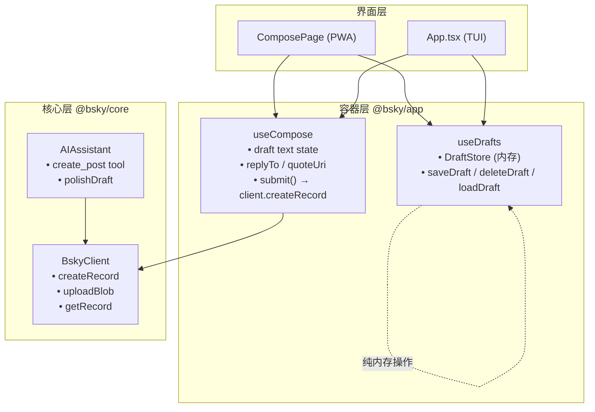
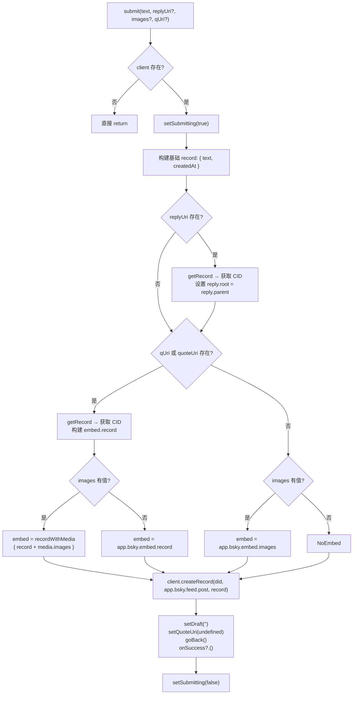
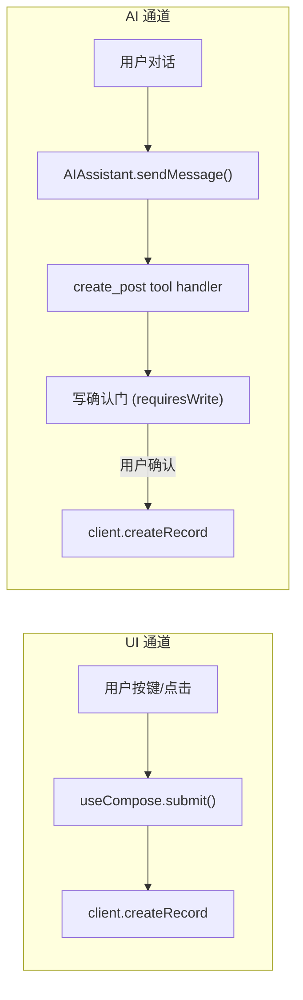

## 概述

`useCompose` 与 `useDrafts` 是 `@bsky/app` 层提供的两个 React 钩子，分别负责发帖编辑器的状态管理与本地草稿的增删查改。虽然源于同一仓库，但职责清晰分离：`useCompose` 聚焦单次发帖的完整生命周期——从文本/图片/引用/回复的构建到向 AT Protocol 提交记录；`useDrafts` 则提供一个纯内存的草稿存储层，支持多草稿之间的切换、暂存与删除。二者在 PWA 与 TUI 两套界面中均被直接消费，是实现 "撰写 → 暂存 → 提交" 流程的核心基础设施。

Sources: [useCompose.ts](packages/app/src/hooks/useCompose.ts), [useDrafts.ts](packages/app/src/hooks/useDrafts.ts)

---

## 架构定位与数据流

两个钩子处于架构的 "容器层"（`@bsky/app`），位于 `@bsky/core`（AT Protocol 客户端）之上，`pwa` / `tui` 界面层之下。它们不直接发起网络请求，而是通过依赖注入的 `BskyClient` 实例来执行所有写操作。



上图揭示了两个关键设计决策：其一，草稿存储是纯内存的——`useDrafts` 不涉及 IndexedDB、localStorage 或文件系统，在 PWA 中刷新页面即丢失，但 TUI 环境下随进程存活；其二，`useCompose.submit()` 是唯一直接调用 `client.createRecord` 的 UI 层入口，与 AI 层的 `create_post` 工具（位于 `tools.ts`）在功能上对应但互不耦合。

Sources: [useCompose.ts#L1-L109](packages/app/src/hooks/useCompose.ts), [useDrafts.ts#L1-L57](packages/app/src/hooks/useDrafts.ts), [tools.ts#L662-L720](packages/core/src/at/tools.ts)

---

## useCompose：发帖编辑器的状态引擎

### 接口签名

```typescript
export function useCompose(
  client: BskyClient | null,
  goBack: () => void,
  onSuccess?: () => void
)
```

三个参数中，`client` 在认证未完成时可能为 `null`，此时调用 `submit()` 会直接返回；`goBack` 是提交成功或取消回退时的导航回调；`onSuccess` 是可选的提交后附加动作（例如在 PWA 中传入 `goHome` 以返回时间线）。

### 核心状态与返回值

| 返回值 | 类型 | 说明 |
|--------|------|------|
| `draft` | `string` | 当前编辑的文本内容 |
| `setDraft` | `(v: string) => void` | 文本 setter，用于受控组件绑定 |
| `submitting` | `boolean` | 提交中标志位，用于禁用按钮 |
| `error` | `string \| null` | 提交失败时的错误消息 |
| `replyTo` | `string \| undefined` | 回复目标的 AT URI |
| `setReplyTo` | `(v: string \| undefined) => void` | replyTo setter |
| `quoteUri` | `string \| undefined` | 引用帖子的 AT URI |
| `setQuoteUri` | `(v: string \| undefined) => void` | quoteUri setter |
| `submit` | `(text, replyUri?, images?, qUri?) => Promise<void>` | 执行发帖的核心方法 |

Sources: [useCompose.ts#L15-L42](packages/app/src/hooks/useCompose.ts)

### submit() 的执行流程

`submit()` 是钩子中最复杂的函数，其内部按以下顺序组装 Record 并调用 `client.createRecord`：



此流程中值得注意的设计选择：**回复结构的 root 与 parent 均设为同一 URI**——这在 AT Protocol 中实际上是正确的，因为当回复深度 > 1 时，root 应为讨论串根节点而非直接父节点。但当前实现并未递归查找真正的根节点，这可能导致深层嵌套回复的 root CID 不准确。相比之下，AI 工具端的 `create_post` 工具（`tools.ts`）实现了完整的根节点查找逻辑，通过 `getPostThread` 遍历 parent 链直到根。这是两个接口之间一个值得追踪的行为差异。

Sources: [useCompose.ts#L44-L100](packages/app/src/hooks/useCompose.ts), [tools.ts#L670-L710](packages/core/src/at/tools.ts)

### URI 解析工具函数

```typescript
function uriToParts(uri: string) {
  const match = uri.match(/^at:\/\/(did:plc:[^/]+)\/([^/]+)\/([^/]+)$/);
  if (!match) throw new Error(`Invalid URI: ${uri}`);
  return { did: match[1]!, collection: match[2]!, rkey: match[3]! };
}
```

这个纯辅助函数从 AT URI 中提取 `did`、`collection`、`rkey` 三个部分，用于调用 `client.getRecord`。它仅支持 `did:plc:*` 格式的 DID。

Sources: [useCompose.ts#L102-L108](packages/app/src/hooks/useCompose.ts)

---

## useDrafts：纯内存草稿存储器

### Draft 数据类型

```typescript
export interface Draft {
  id: string;
  text: string;
  replyTo?: string;   // 可选的回复目标 URI
  quoteUri?: string;  // 可选的引用帖子 URI
  createdAt: string;  // 首次创建时间 (ISO)
  updatedAt: string;  // 最后更新时间 (ISO)
}
```

草稿的核心信息即为发帖所需的最小数据集，不保存图片 blob 引用——这意味着从草稿恢复时，图片需要重新上传。

Sources: [useCompose.ts#L7-L13](packages/app/src/hooks/useCompose.ts)

### DraftStore 模式：纯对象而非类

`createDraftsStore()` 是一个**工厂函数**，返回一个普通对象（POJO）而非类实例。这与当前架构中 "单向监听器 Store 模式"（参见 [单向监听器 Store 模式](16-dan-xiang-jian-ting-qi-store-mo-shi-chun-dui-xiang-zhuang-tai-guan-li-react-ding-yue)）保持一致。

```typescript
export interface DraftStore {
  drafts: Draft[];
  saveDraft(d: Omit<Draft, 'createdAt' | 'updatedAt'>): void;
  deleteDraft(id: string): void;
  loadDraft(id: string): Draft | undefined;
}
```

三个操作方法的特点是：

- **`saveDraft`**：按 `id` 查找已存在草稿，若存在则更新（保留 `createdAt`、更新 `updatedAt`），否则新建（设置 `createdAt` 和 `updatedAt` 为当前时间）。这是一个 UPSERT 语义。
- **`deleteDraft`**：按 `id` 过滤，不涉及任何确认逻辑。
- **`loadDraft`**：简单线性查找。

Sources: [useDrafts.ts#L6-L34](packages/app/src/hooks/useDrafts.ts)

### 使用 React 的 useDrafts 钩子

```typescript
export function useDrafts() {
  const [store] = useState(() => createDraftsStore());
  const [, tick] = useState(0);

  const saveDraft = useCallback((d) => {
    store.saveDraft(d);
    tick(n => n + 1);
  }, [store]);

  // ...deleteDraft 同理

  return {
    drafts: store.drafts,
    saveDraft,
    deleteDraft,
    loadDraft: store.loadDraft.bind(store),
  };
}
```

这里的实现模式值得关注：**通过 `useState(0)` 的 tick 计数器来强制 React 重渲染**。当 `store.saveDraft` 修改了 `store.drafts` 数组（注意是原地修改，数组引用未变），React 不会自动感知——因此每次写操作后调用 `tick(n => n + 1)` 触发重渲染，让消费组件读取到最新的 `store.drafts`。这是一种轻量级的非 Immutable 状态管理技巧，在该项目的 Store 模式中频繁出现。

`loadDraft` 是只读操作，不触发重渲染，因此直接 `.bind(store)` 暴露。

Sources: [useDrafts.ts#L36-L57](packages/app/src/hooks/useDrafts.ts)

---

## 双界面消费对比

两个钩子同时服务于 PWA 的 React Web 界面和 TUI 的 Ink 终端界面，但各自在此基础上的交互层差异显著。

| 维度 | PWA (ComposePage.tsx) | TUI (App.tsx) |
|------|----------------------|---------------|
| **文本输入** | `<textarea>` 受控组件，显示 300 字符上限 | `ink-text-input` 单行输入，300 字符上限 |
| **图片上传** | `<input type="file">` 多选，JavaScript File API 读取 → `client.uploadBlob` | 文件路径输入框，`fs.readFileSync` 读取 → `client.uploadBlob` |
| **引用预览** | 实时获取被引用帖子的作者、文本、图片，渲染可视化预览卡片 | 仅显示 quoteUri 文本 |
| **草稿交互** | 离开时 `confirm()` 询问保存；草稿列表可 Load / Delete；新增草稿按钮 | 键盘驱动：`Esc` → 保存提示，`D` → 打开草稿列表（`j/k` 导航，`Enter` 加载，`d` 删除，`n` 保存新草稿） |
| **提交前流程** | 先遍历上传图片获取 blobRef，再调 `submit()` | 图片已在 `imagePathInput` 提交时上传，`submit()` 直接使用已缓存的 `composeImages` |
| **导航回调** | `goBack` 返回上级，`goHome` 作为 `onSuccess` | 同一模式，`goBack` + `goHome` 作为 `onSuccess` |

### PWA 图片上传的异步处理

PWA 端的图片处理是一个**两步走**流程：首先通过 File API 读取文件为 `Uint8Array`，逐一调用 `client.uploadBlob` 获取 `blobRef`；若任意一张上传失败，立即中止并标记错误。全部成功后，将所有 `blobRef` 打包为 `ComposeImage[]` 传入 `submit()`。过程中的上传进度通过 `LocalImage.uploading` 状态驱动 UI 的加载动画。

### TUI 草稿列表的键盘导航

TUI 端充分利用了终端键盘的交互优势：

- **`j` / `k` 或上下箭头**：在草稿列表中移动光标
- **`Enter`**：加载选中的草稿，恢复 text、replyTo 和 quoteUri
- **`d`**：删除当前选中的草稿
- **`n`**：将当前编辑内容**另存为**新草稿（不清除编辑器内容）
- **`Esc`**：退出草稿列表；若编辑器中有内容未保存，弹出保存确认提示（`y`/`n` 响应）

Sources: [ComposePage.tsx](packages/pwa/src/components/ComposePage.tsx), [App.tsx#L60-L260](packages/tui/src/components/App.tsx)

---

## 与 AI 工具的交互边界

在 AI 集成场景中，`useCompose` 和 `useDrafts` 并非直接与 AI 系统交互，而是与 `AIAssistant` 的 `create_post` 工具形成**两套平行的发帖通道**：



两者的核心差异在于：

- **`useCompose.submit()`** 不需要写确认门——用户通过 UI 主动触发，天然具有意图确认语义。
- **`create_post` 工具**需要经过 `AIAssistant` 的写确认门（`requiresWrite: true`），在工具执行前弹出确认对话框（在 TUI 中通过 `ConfirmDialog` 组件实现），用户批准后才实际调用 `client.createRecord`。

另外，`polishDraft` 函数（位于 `assistant.ts`）为 AI 润色草稿提供了独立的入口，它不直接修改 `useCompose` 的 draft 状态，而是返回润色后的文本字符串，由消费方决定是否替换当前编辑器内容。

Sources: [assistant.ts#L630-L647](packages/core/src/ai/assistant.ts), [tools.ts#L722](packages/core/src/at/tools.ts)

---

## 设计权衡与潜在改进

### 1. 草稿持久化的缺失

当前 `useDrafts` 使用纯内存存储，TUI 环境下随进程存活，PWA 环境下刷新即失。这是有意识的设计简化——草稿不属于核心业务流程，且用户期望的草稿持久化行为可以通过外部机制（如 localStorage 自动保存）补充。潜在改进方向是与 `ChatStorage` 抽象（参见 [聊天存储接口](27-liao-tian-cun-chu-jie-kou-chatstorage-chou-xiang-yu-tui-pwa-shuang-shi-xian)）类似的持久化层。

### 2. 回复 root CID 溯源的精确性

如前所述，`useCompose` 的回复构建直接将 `replyTo` 同时作为 root 和 parent，而 `tools.ts` 中的 `create_post` 实现了真正的根节点查找。这一差异可能导致深层嵌套回复的 CID 记录不一致。建议在后续迭代中统一为 `create_post` 所使用的递归查找策略。

### 3. 图片数据的草稿隔离

`Draft` 类型不包含图片信息，导致从草稿恢复时无法还原附件。这是一个合理的设计取舍——图片 blob 引用具有时效性且体积较大，不适合存储在纯文本的草稿结构中。但对于需要完整"保存草稿 → 恢复继续编辑"流程的场景，可以考虑在 Draft 中添加 `imageRefs: Array<{ blobRef, alt }>` 字段。

### 4. Tick 计数器模式的重渲染开销

`useDrafts` 通过 `tick(n => n + 1)` 触发重渲染的模式虽然简洁，但当草稿数量较大（>100）时，每次写操作都会导致整个组件树重新渲染。对于大草稿列表场景，可考虑迁移至 `useSyncExternalStore` 或使用该项目的 Store 模式来实现精准订阅。

Sources: [useDrafts.ts#L36-L57](packages/app/src/hooks/useDrafts.ts)

---

## 模块导出路径

两个钩子通过 `@bsky/app` 的入口文件统一导出：

```typescript
// packages/app/src/index.ts
export { useCompose } from './hooks/useCompose.js';
export type { ComposeImage, Draft } from './hooks/useCompose.js';
export { useDrafts } from './hooks/useDrafts.js';
export type { DraftStore } from './hooks/useDrafts.js';
```

这意味着消费方只需 `import { useCompose, useDrafts } from '@bsky/app'` 即可引入，无需关心内部模块路径。

Sources: [index.ts](packages/app/src/index.ts#L9-L14)

---

## 总结

`useCompose` 与 `useDrafts` 以极简的 API Surface 覆盖了发帖编辑的核心场景。`useCompose` 通过单一 `submit()` 函数封装了 AT Protocol 帖子的完整构建逻辑，包括回复、引用、图片嵌入三种复合情况的处理；`useDrafts` 则使用轻量级的 POJO Store + tick 计数器模式提供草稿的 CRUD 操作。两者在 PWA 和 TUI 中的消费方式虽有差异（Web 的 File API 与终端的文件路径、鼠标点击与键盘导航），但底层状态和提交逻辑完全复用，体现了 `@bsky/app` 层作为 "一次编写，双端运行" 抽象的设计目标。

若希望深入了解相关主题，建议按以下顺序阅读：
- [数据钩子清单：useAuth / useTimeline / useThread / useProfile 等](17-shu-ju-gou-zi-qing-dan-useauth-usetimeline-usethread-useprofile-deng) — 查看其他应用层钩子的结构与一致性
- [BskyClient：AT 协议 HTTP 客户端、双端点架构与 JWT 自动刷新](10-bskyclient-at-xie-yi-http-ke-hu-duan-shuang-duan-dian-jia-gou-yu-jwt-zi-dong-shua-xin) — 了解 `submit()` 所依赖的底层客户端实现
- [31 个 AI 工具系统：工具定义、读写安全门与工具执行循环](11-31-ge-ai-gong-ju-xi-tong-gong-ju-ding-yi-du-xie-an-quan-men-yu-gong-ju-zhi-xing-xun-huan) — 对比 `create_post` 工具与 `useCompose.submit` 的异同