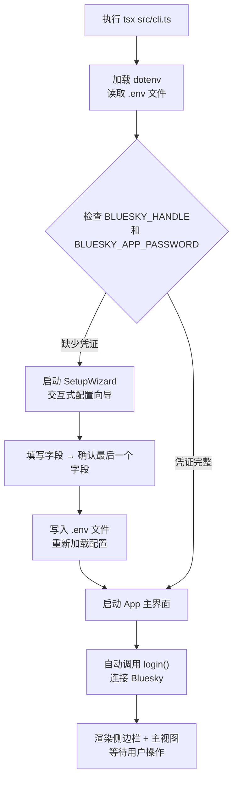

本文档提供 **TUI（终端用户界面）客户端** 的完整安装与运行指引。从零开始，你只需要一个终端模拟器和 5 分钟，就能在命令行中体验完整的 Bluesky 社交网络——包括时间线浏览、帖子互动、AI 智能对话、多语言翻译等功能。本指南面向新手开发者，假定你具备基本的命令行操作经验。

---

## 前置依赖

安装 TUI 客户端前，请确保你的系统满足以下要求：

| 依赖项 | 最低版本 | 说明 |
|--------|---------|------|
| **Node.js** | >= 18 | 运行时环境，推荐 v20 LTS |
| **pnpm** | 任意版本 | 包管理器，通过 `npm install -g pnpm` 安装 |
| **终端模拟器** | — | 必需支持 **raw mode**（Windows Terminal、iTerm2、Kitty、GNOME Terminal 等均支持） |

Sources: [package.json](package.json#L13-L14), [README.md](README.md#L23-L24)

> **Windows 用户注意**：推荐使用 **Windows Terminal**（而非旧版 cmd.exe 或 PowerShell 5），它完整支持 raw mode 和 Unicode 渲染。如果使用 VS Code 集成终端，请确认终端类型设为支持 raw mode 的配置文件。

---

## 项目架构概览

在开始安装之前，理解项目的包结构有助于你快速定位：

```mermaid
graph TD
    subgraph "单体仓库 (Monorepo)"
        Core["@bsky/core<br/>零 UI 依赖层"]
        App["@bsky/app<br/>状态管理 + React 钩子"]
        TUI["@bsky/tui<br/>终端 UI (Ink)"]
        PWA["@bsky/pwa<br/>网页 UI (React DOM)"]
    end

    Core -->|"被依赖"| App
    App -->|"被依赖"| TUI
    App -->|"被依赖"| PWA
    
    style Core fill:#2d3748,stroke:#4a9eff
    style App fill:#2d3748,stroke:#4a9eff
    style TUI fill:#1a365d,stroke:#63b3ed
    style PWA fill:#1a365d,stroke:#63b3ed
```



**业务逻辑在 `@bsky/core` 和 `@bsky/app` 中只写一次**，TUI 和 PWA 是纯粹的渲染层，共享同一套 React 钩子和状态管理。这意味着你在终端中看到的功能（时间线、AI 对话、翻译等）与网页版完全一致。

Sources: [README.md](README.md#L147-L156), [docs/PACKAGES.md](docs/PACKAGES.md#L3-L171)

---

## 安装步骤

### 第一步：克隆仓库

```bash
git clone https://github.com/epheiamoe/bsky.git
cd bsky
```

Sources: [README.md](README.md#L28-L29)

### 第二步：安装依赖

项目使用 pnpm workspace 管理四个相互依赖的包。安装命令会自动解析 `@bsky/core` → `@bsky/app` → `@bsky/tui` 的依赖链：

```bash
pnpm install
```

安装完成后，检查 `packages/` 目录下是否生成了 `node_modules` 和符号链接。如果遇到 `esbuild` 相关错误，请确认 `.npmrc` 中的配置正确，或设置环境变量 `NODE_ENV=production` 后重试。

Sources: [pnpm-workspace.yaml](pnpm-workspace.yaml#L1-L3), [package.json](package.json#L17)

### 第三步：编译所有包

```bash
pnpm -r build
```

这会依次执行 `packages/core`、`packages/app` 和 `packages/tui` 的 TypeScript 编译。编译产物输出到各包的 `dist/` 目录。

Sources: [package.json](package.json#L7)

> **可选步骤**：运行 `pnpm -r typecheck` 可以执行全量 TypeScript 类型检查，确保你的环境配置无误。[README.md](README.md#L139)

---

## 配置 Bluesky 凭证与 AI 密钥

TUI 客户端需要两种凭证才能运行：**Bluesky 账户凭证** 和 **AI/LLM API 密钥**。以下对比了两种配置方式：

| 配置方式 | 适用场景 | 操作复杂度 |
|---------|---------|-----------|
| **手动编辑 `.env` 文件** | 熟悉配置项的高级用户 | 低 —— 一次编辑 |
| **交互式 SetupWizard** | 首次使用的新手 | 极低 —— 逐字段引导 |

### 方式一：手动配置 .env（推荐）

项目根目录提供了 `.env.example` 模板，复制并填写即可：

```bash
# 在项目根目录执行
cp .env.example .env
```

编辑 `.env` 文件，填入以下配置：

```env
# === Bluesky 账户（必需）===
BLUESKY_HANDLE=你的用户名.bsky.social
BLUESKY_APP_PASSWORD=你的应用密码

# === AI/LLM 配置（推荐配置 DeepSeek）===
LLM_API_KEY=sk-你的API密钥
LLM_BASE_URL=https://api.deepseek.com
LLM_MODEL=deepseek-v4-flash

# === 翻译目标语言（可选，默认为 zh）===
TRANSLATE_TARGET_LANG=zh
```

#### 获取 Bluesky 应用密码

在 Bluesky 网站上进入 **Settings → Privacy & Security → App Passwords**，创建一个新的应用密码（名称任意，如 "bsky-tui"），复制生成的一串形如 `xxxx-xxxx-xxxx-xxxx` 的密码。

#### 获取 AI API 密钥

推荐使用 **DeepSeek**（价格低廉、性能优秀）：
1. 访问 [platform.deepseek.com](https://platform.deepseek.com) 注册账号
2. 进入 API Keys 页面创建新密钥
3. 将密钥填入 `LLM_API_KEY` 字段

你也可以使用任何 OpenAI 兼容的 API（如 OpenAI、Groq 等），只需相应修改 `LLM_BASE_URL` 和 `LLM_MODEL`。

Sources: [.env.example](.env.example#L1-L11), [docs/ENV.md](docs/ENV.md#L1-L33)

### 方式二：交互式 SetupWizard（首次运行时自动触发）

如果你没有创建 `.env` 文件就直接启动客户端，系统会自动启动一个交互式配置向导。它会在终端中逐字段引导你输入：

```
🦋 Bluesky TUI — 首次设置向导
欢迎使用 Bluesky TUI！请完成以下配置，即可开始体验。
▸ Bluesky 用户名                           ← 当前焦点
  Bluesky 应用密码
  LLM API 密钥（可选）
  LLM 基础 URL (https://api.deepseek.com)
  LLM 模型 (deepseek-v4-flash)
  界面语言 (zh)
  
Tab/↑↓:切换字段  Enter:确认字段(最后一个字段确认后保存)
```

每个字段说明：
- **Bluesky 用户名**：你的完整 handle（如 `user.bsky.social`）— 必填
- **Bluesky 应用密码**：上述步骤获取的应用密码 — 必填
- **LLM API 密钥**：AI 服务的 API key — 可选（不填则 AI 功能不可用）
- **LLM 基础 URL**：默认为 `https://api.deepseek.com`
- **LLM 模型**：默认为 `deepseek-v4-flash`
- **界面语言**：支持 `zh`（中文）、`en`（英文）、`ja`（日文）

填写完成后，向导会自动将配置写入项目根目录的 `.env` 文件并启动主界面。

Sources: [packages/tui/src/components/SetupWizard.tsx](packages/tui/src/components/SetupWizard.tsx#L1-L155)

---

## 运行 TUI 客户端

### 启动命令

```bash
# 方式一：从项目根目录运行
cd packages/tui && npx tsx src/cli.ts

# 方式二：或使用 pnpm 直接执行（推荐，自动处理路径）
cd packages/tui && pnpm dev
```

两个命令效果相同，内部都调用了 `tsx src/cli.ts`。`tsx` 是一个 TypeScript 执行器，免去了每次修改代码后重新编译的步骤。

Sources: [packages/tui/package.json](packages/tui/package.json#L20), [packages/tui/src/cli.ts](packages/tui/src/cli.ts#L1-L127)

### 启动流程说明

当执行上述命令时，内部发生以下过程：



Sources: [packages/tui/src/cli.ts](packages/tui/src/cli.ts#L21-L89)

---

## 首次使用体验

启动成功后，你会看到一个分栏的终端界面：

```
┌──────────────┬──────────────────────────────────────────┐
│ 🦋 Bluesky   │  📋  时间线                              │
│ ───────────  │  ▲ 20% (1/40)                            │
│  📋 时间线 [t]│  [1] 👤 @alice.bsky.social              │
│  🔔 通知 [n] │      今天的日出真是太美了！🌅             │
│  🔍 搜索 [s] │  [2] 👤 @bob.bsky.social                 │
│  👤 资料 [p] │      AI 生成的代码质量越来越好了          │
│  🔖 收藏 [b] │  [3] 👤 @charlie.bsky.social             │
│  🤖 AI 对话[a]│     刚看完《三体》第三部，太震撼了        │
│  ✏️ 发帖 [c] │  ...                                     │
│  ───────────  │  ▼ 80%                                  │
│  ← Esc 返回   │  [t]时间线 [n]通知 [s]搜索 ...          │
└──────────────┴──────────────────────────────────────────┘
```

**界面布局说明**：

| 区域 | 位置 | 功能 |
|------|------|------|
| **侧边栏** | 左侧（约 14% 宽度） | 导航菜单 + 面包屑路径 + 通知徽章 |
| **主视图** | 右侧（剩余宽度） | 根据当前视图显示不同内容 |
| **底部提示** | 最底部（footer） | 当前视图的可用快捷键提示 |

Sources: [packages/tui/src/components/App.tsx](packages/tui/src/components/App.tsx#L33-L41), [packages/tui/src/components/Sidebar.tsx](packages/tui/src/components/Sidebar.tsx#L41-L88)

### 核心视图一览

启动后默认进入 **时间线（Feed）视图**，按以下快捷键切换视图：

| 快捷键 | 视图 | 说明 |
|--------|------|------|
| `t` | 时间线 | 主页动态，Bluesky 算法推荐 |
| `n` | 通知 | 点赞、转发、回复等互动通知 |
| `s` | 搜索 | 搜索用户和帖子 |
| `p` | 个人资料 | 查看/编辑自己的 Bluesky 资料 |
| `b` | 书签 | 浏览已收藏的帖子 |
| `a` | AI 对话 | 启动 AI 助手（支持 31 个 Bluesky 工具调用） |
| `c` | 发帖 | 撰写新帖子或回复 |
| `,` (逗号) | 设置 | 编辑 .env 中的 AI 配置项 |
| `Esc` | 返回 | 返回上一级视图 |

Sources: [packages/tui/src/components/App.tsx](packages/tui/src/components/App.tsx#L109-L200), [docs/KEYBOARD.md](docs/KEYBOARD.md#L49-L73)

### 时间线视图基本操作

在时间线视图中，使用以下快捷键浏览和互动：

| 操作 | 快捷键 | 说明 |
|------|--------|------|
| 上/下移动光标 | `↑/↓` 或 `j/k` | 逐条滚动帖子 |
| 翻页 | `PgUp` / `PgDn` | 一次移动 5 条 |
| 查看帖子详情 | `Enter` | 打开帖子及其回复线程 |
| 加载更多 | `m` | 翻页加载更早的帖子 |
| 刷新 | `r` | 从顶部重新加载 |
| 收藏/取消收藏 | `v` | 对当前光标所在的帖子操作 |
| 鼠标滚轮 | 滚动 | 上/下移动光标 |

Sources: [docs/KEYBOARD.md](docs/KEYBOARD.md#L78-L93)

---

## 常见问题与故障排除

### 1. 启动后终端空白或立即退出

**可能原因**：终端不支持 raw mode 或 .env 配置错误。

**解决方案**：
- 确认使用了支持 raw mode 的终端（Windows Terminal、iTerm2、Kitty）
- 检查 `.env` 文件中的 `BLUESKY_HANDLE` 和 `BLUESKY_APP_PASSWORD` 是否填写正确
- 尝试先删除 `.env` 文件，让 SetupWizard 重新引导配置

Sources: [packages/tui/src/cli.ts](packages/tui/src/cli.ts#L92-L100)

### 2. "Failed to load config after setup" 错误

**可能原因**：SetupWizard 写入 .env 文件后，`dotenv.config()` 无法正确重新加载。

**解决方案**：手动检查 `.env` 文件内容是否完整。确认没有拼写错误的变量名（如 `BLUESKY_HANDLE` 而非 `BLUESKY_HANDLE`）。重启客户端。

Sources: [packages/tui/src/cli.ts](packages/tui/src/cli.ts#L78-L83)

### 3. 登录失败（认证错误）

**可能原因**：Bluesky 应用密码过期或错误。

**解决方案**：
- 重新登录 [bsky.app](https://bsky.app) → Settings → App Passwords
- 删除旧的应用密码，创建新密码并更新 `.env`
- 注意：**不要使用主密码**，必须使用应用密码

### 4. AI 功能不可用

**可能原因**：缺少 `LLM_API_KEY` 或 API 地址配置错误。

**解决方案**：
- 确认 `LLM_API_KEY` 已填写（可以在运行中按 `,` 键进入 Settings 视图修改）
- 如果使用自有 API，确认 `LLM_BASE_URL` 指向正确的 OpenAI 兼容端点
- DeepSeek 默认端点：`https://api.deepseek.com`
- 模型确认：DeepSeek 用户默认使用 `deepseek-v4-flash`

### 5. CJK（中文/日文/韩文）字符显示错位

**可能原因**：终端字体不支持全角字符，或 TUI 的 `visualWidth` 计算与终端实际渲染不一致。

**解决方案**：
- 使用支持 CJK 的终端字体（如 Noto Sans CJK、Sarasa Gothic、JetBrains Mono Nerd Font 等）
- Windows Terminal 中设置 `profiles.defaults.font.face` 为支持 CJK 的字体

Sources: [packages/tui/src/utils/text.ts](packages/tui/src/utils/text.ts#L1-L81)

### 6. 鼠标滚轮无效

**可能原因**：终端未启用鼠标追踪。

**解决方案**：
- iTerm2：确保 "Enable mouse reporting" 选项开启
- Windows Terminal：默认支持鼠标滚轮
- 如果完全无法使用，可以完全用键盘操作（`↑/↓` 或 `j/k`）

Sources: [packages/tui/src/utils/mouse.ts](packages/tui/src/utils/mouse.ts#L14-L22)

---

## 下一步阅读

你已经成功启动并运行了 TUI 客户端！建议按以下顺序深入了解项目：

1. **了解核心架构** —— 阅读 [单体仓库架构：core → app → tui/pwa 的三层依赖体系](5-dan-ti-cang-ku-jia-gou-core-app-tui-pwa-de-san-ceng-yi-lai-ti-xi)，理解各包的职责划分
2. **掌握键盘快捷键** —— 阅读 [键盘快捷键架构：5 个 useInput 处理器与全局保留键规则](21-jian-pan-kuai-jie-jian-jia-gou-5-ge-useinput-chu-li-qi-yu-quan-ju-bao-liu-jian-gui-ze)，获得完整的操作参考
3. **AI 集成深度体验** —— 阅读 [AIAssistant：多轮工具调用引擎与 SSE 流式输出](12-aiassistant-duo-lun-gong-ju-diao-yong-yin-qing-yu-sse-liu-shi-shu-chu)，了解 AI 助手背后的 31 个 Bluesky API 工具
4. **TUI 文本渲染原理** —— 阅读 [TUI 文本工具：CJK 感知的 visualWidth / wrapLines 与终端鼠标追踪](22-tui-wen-ben-gong-ju-cjk-gan-zhi-de-visualwidth-wraplines-yu-zhong-duan-shu-biao-zhui-zong)，了解终端中 CJK 文本处理的挑战与方案
5. **环境变量全参考** —— 阅读 [环境变量配置指南（TUI 的 .env 与 PWA 的 localStorage）](4-huan-jing-bian-liang-pei-zhi-zhi-nan-tui-de-env-yu-pwa-de-localstorage)，了解所有配置项的详细说明