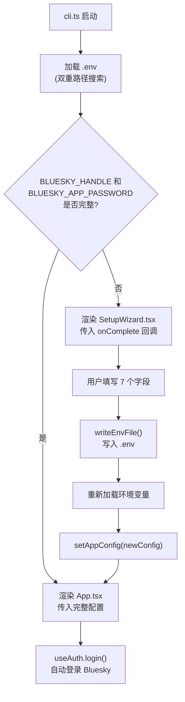

TUI 客户端的启动入口由 `cli.ts` 和 `SetupWizard.tsx` 共同构成，设计了一个"检查环境 → 条件渲染"的两阶段启动模型。核心思想是：**如果 `.env` 文件已存在且包含必要的 Bluesky 凭证，则直接进入应用主界面；否则，启动交互式配置向导**。这一模式借鉴了现代 CLI 工具（如 `aws configure`、`gh auth login`）的 first-run 体验范式，将配置过程从手动编辑文件升级为表单驱动的引导流程。

## 两阶段启动模型

`cli.ts` 是 TUI 的绝对入口点（`package.json` 中通过 `"dev": "tsx src/cli.ts"` 指定），它在渲染任何 React 组件之前执行三个关键动作：**加载环境变量、验证凭证完整性、决定渲染目标**。



**双重路径搜索机制**在 `cli.ts` 的第 16-19 行中实现：

```typescript
const envPaths = [
  path.resolve(__dirname, '..', '..', '..', '.env'),  // 从 package 目录向上查找
  path.resolve(process.cwd(), '.env'),                 // 从工作目录查找
];
```

这意味着无论用户是在项目根目录执行 `pnpm dev`，还是在 `packages/tui/` 子目录下运行，都能正确加载 `.env` 文件。`cli.ts` 的 `getConfigFromEnv()` 函数（第 41-56 行）负责解析环境变量并构建 `AppConfig` 对象，该对象中包含 `blueskyHandle`、`blueskyPassword`、`aiConfig`（含 apiKey、baseUrl、model、thinkingEnabled）以及 `targetLang`。如果缺少 handle 或 password，函数返回 `null`，触发 SetupWizard 的渲染。

Sources: [cli.ts](packages/tui/src/cli.ts#L1-L93)

## SetupWizard：七字段交互式表单

`SetupWizard.tsx` 是一个纯 Ink 组件，利用 `ink-text-input` 实现文本输入，使用 `useInput` 处理键盘导航。其核心数据结构是 `FIELDS` 常量数组（第 29-43 行），定义了七个配置字段：

| 字段键 | 标签国际化 Key | 密码模式 | 默认值 | 校验规则 |
|--------|---------------|---------|--------|---------|
| `blueskyHandle` | `setup.blueskyHandle` | 否 | 无 | 必填 |
| `blueskyPassword` | `setup.blueskyPassword` | **是** | 无 | 必填 |
| `llmApiKey` | `setup.llmApiKey` | **是** | 无 | 可选 |
| `llmBaseUrl` | `setup.llmBaseUrl` | 否 | `https://api.deepseek.com` | 可选 |
| `llmModel` | `setup.llmModel` | 否 | `deepseek-v4-flash` | 可选 |
| `llmThinkingEnabled` | `setup.thinkMode` | 否 | `true` | 必须为 true/false/yes/no |
| `locale` | `setup.locale` | 否 | `zh` | 必须为 zh/en/ja |

每个字段渲染为两行：第一行显示字段标签及当前状态（已完成/聚焦中/待完成），第二行仅在聚焦时显示带边框的输入框。组件使用 `focusIndex` 状态（第 52 行）追踪当前聚焦字段，通过 `Tab` 键和方向键进行切换，支持循环导航。

**三个关键设计细节**：

1. **即时国际化切换**：当用户在 locale 字段按下回车时，`handleFieldSubmit` 函数（第 74-79 行）立即调用 `setLocale()`，后续字段的标签文本会动态切换到新语言——这意味着用户填写前几个字段时可能看到的是英文，在切换语言后剩余字段将显示为目标语言。

2. **密码字段隐私保护**：`isPassword` 标记为 `true` 的字段（blueskyPassword、llmApiKey）在完成输入后显示为 `****`（第 130 行），而非明文回显，防止旁观者窥屏。

3. **校验与错误反馈**：每个字段可挂载 `validate` 函数（第 5-6 行），校验失败时在表单底部显示红色错误提示（第 150-154 行），阻止进入下一字段。错误的定位是非阻塞的——用户可以通过 `Tab` 键切换到其他字段先行修改，但当前字段未通过校验时无法前进。

Sources: [SetupWizard.tsx](packages/tui/src/components/SetupWizard.tsx#L1-L161)

## 配置持久化机制

`writeEnvFile()` 函数（`cli.ts` 第 58-71 行）负责将 SetupWizard 收集的数据写入 `.env` 文件。它拼接七行环境变量配置，写入 `process.cwd()` 下的 `.env` 文件：

```typescript
function writeEnvFile(config: SetupConfig): string {
  const envPath = path.resolve(process.cwd(), '.env');
  const lines = [
    `BLUESKY_HANDLE=${config.blueskyHandle}`,
    `BLUESKY_APP_PASSWORD=${config.blueskyPassword}`,
    `LLM_API_KEY=${config.llmApiKey}`,
    `LLM_BASE_URL=${config.llmBaseUrl || 'https://api.deepseek.com'}`,
    `LLM_MODEL=${config.llmModel || 'deepseek-v4-flash'}`,
    `LLM_THINKING_ENABLED=${config.llmThinkingEnabled !== false}`,
    config.locale ? `TRANSLATE_TARGET_LANG=${config.locale}` : '',
  ].filter(Boolean);
  writeFileSync(envPath, lines.join('\n') + '\n', 'utf-8');
  return envPath;
}
```

写入完成后，`Root` 组件调用 `dotenv.config({ path: envPath, override: true })` 重新加载环境变量（第 80 行），然后再次调用 `getConfigFromEnv()` 构建配置对象。如果此时仍然失败（极少数情况），程序会以 `process.exit(1)` 终止并报错。这种"写入-重载-验证"的三步策略确保了配置的原子性和一致性。

Sources: [cli.ts](packages/tui/src/cli.ts#L58-L93)

## 终端 Raw Mode 与输入流处理

`cli.ts` 的第 96-121 行处理了一个重要的终端兼容性问题：**Raw Mode 的优雅降级**。Ink 框架依赖终端的 raw mode 来捕获按键事件，但某些环境（如 CI 流水线、非 TTY 管道）不支持 raw mode。

```mermaid
flowchart LR
    A["检查 stdin.isTTY"] -->|"是"| B["setRawMode(true)"]
    A -->|"否"| C["创建虚拟 Readable 流"]
    B --> D["使用 process.stdin"]
    C --> E["监听 process.stdin 'data' 事件<br/>将数据写入虚拟流"]
    D --> F["render(&#60;Root&#62;, {stdin: process.stdin})"]
    E --> F
    F --> G["isRawModeSupported 属性<br/>传递给 App 组件"]
    G --> H["底部黄色警告条:<br/>⚠ Terminal not in raw mode"]
```



当 raw mode 不可用时，代码创建一个「代理 Readable 流」（第 110-121 行），该流伪装成 TTY（设置 `isTTY = true` 并 mock `setRawMode` 方法），同时监听 `process.stdin` 的 `'data'` 事件并将数据推入代理流。这种设计确保了即使在不支持 raw mode 的环境中，Ink 仍然能够正常接收用户输入，唯一的代价是底部会显示黄色警告条（`App.tsx` 第 454-456 行）。

Sources: [cli.ts](packages/tui/src/cli.ts#L95-L128), [App.tsx](packages/tui/src/components/App.tsx#L454-L456)

## 从配置到主界面：App 组件的初始化流程

一旦配置就绪，`Root` 组件渲染 `App.tsx`，后者接收 `AppConfig` 并触发完整的应用初始化链：

```
App.tsx 挂载
├── useNavigation() → 创建栈式导航器，初始视图为 'feed'
├── useAuth() → 创建 auth store，暴露 client/loading/login
├── useEffect → 自动调用 login(config.blueskyHandle, config.blueskyPassword)
│   └── createAuthStore().login() → new BskyClient().login(handle, password)
│       ├── 设置 loading = true
│       ├── 登录成功 → client = BskyClient 实例
│       ├── 获取用户 Profile
│       └── 设置 loading = false
├── useTimeline(client) → 加载 Feed 时间线
├── useNotifications(client) → 监听通知未读数
└── useI18n(config.targetLang) → 设置界面语言
```

其中 `useAuth` 钩子（`packages/app/src/hooks/useAuth.ts`）采用**单向监听器 Store 模式**：`createAuthStore()`（`packages/app/src/stores/auth.ts`）创建一个纯对象 store，通过 `subscribe/notify` 模式通知 React 组件重新渲染。登录成功后，`client` 被注入到所有数据钩子中（`useTimeline`、`useNotifications`、`useThread` 等），形成一个依赖注入链。

登录过程中，`App.tsx` 第 445-447 行显示 `${t('login.connecting')}` 的加载状态。一旦 `authLoading` 变为 `false`，`renderView()` 根据 `currentView.type` 切换主内容区域。默认视图为 `'feed'`，渲染 `PostList` 组件。

Sources: [App.tsx](packages/tui/src/components/App.tsx#L33-L78), [auth.ts](packages/app/src/stores/auth.ts#L18-L42), [useAuth.ts](packages/app/src/hooks/useAuth.ts#L1-L22)

## 布局架构：三栏式终端 UI

`App.tsx` 的渲染输出（第 432-458 行）采用经典的三行结构：

```
┌──────────────────────────────────────────────────────┐
│ 🦋 Bluesky @user.bsky.social  🟢         📋 动态  12:30│  ← 顶栏 (1行)
├──────────┬───────────────────────────────────────────┤
│ 🦋 Bluesky│  📋 动态                                    │
│ ──────────│  [帖子列表...]                               │  ← 侧边栏(14%宽度)
│ 📋 动态[t]│                                            │    + 主内容区
│ 🔔 通知[n]│                                            │
│ 🔍 搜索[s]│                                            │
│ 👤 个人[p]│                                            │
│ 🔖 收藏[b]│                                            │
│ 🤖 AI[a] │                                            │
│ ✏️ 发帖[c]│                                            │
│ ──────────│                                            │
│ ← Esc返回│                                            │
├──────────┴───────────────────────────────────────────┤
│ Esc:返回 t:动态 n:通知 p:个人 s:搜索 a:AI c:发帖    12:30│  ← 底栏 (1行)
└──────────────────────────────────────────────────────┘
```

**顶栏**（第 434-442 行）：蓝色背景显示应用名、当前用户、连接状态（绿灯/红灯）、当前视图面包屑和时间。**侧边栏**（`Sidebar.tsx`）宽度为终端宽度的 14%（最小 16 列），展示导航选项卡列表，每个选项卡标注快捷键。当前激活的选项卡以蓝色高亮显示并带有 `▶` 箭头。**底栏**（第 449-453 行）动态显示当前视图的可用操作提示，通过 `footerHint()` 函数（第 476-481 行）根据 `currentView.type` 和 `canGoBack` 状态生成。

如果 raw mode 不支持，底栏下方还会追加一行橙色警告（第 454-456 行）。

Sources: [App.tsx](packages/tui/src/components/App.tsx#L432-L458), [Sidebar.tsx](packages/tui/src/components/Sidebar.tsx#L1-L96)

## 键盘快捷键的全局协调

`App.tsx` 第 109-289 行使用 `useInput` 注册全局键盘处理器，按键处理优先级如下：

| 优先级 | 按键 | 行为 | 作用域 |
|-------|------|------|-------|
| 最高 | `Tab` | 切换 AI 聊天的主/副焦点面板 | 全局，仅 aiChat 视图 |
| 最高 | `Esc` | 关闭当前对话框/返回上一视图 | 全局 |
| 高 | `↑/↓` | Feed/收藏列表上下选择 | feed, bookmarks |
| 高 | `Enter` | 进入选中帖子的详情/线程 | feed, bookmarks |
| 中 | `Ctrl+G` | 打开 AI 聊天（携带当前线程 URI） | 全局 |
| 中 | `,` | 打开设置面板 | 全局 |
| 低 | `t/n/p/s/a/c/b` | 视图切换导航 | 全局 |

其中 `Esc` 的处理最为复杂（第 115-128 行），它需要根据当前上下文决定行为：在 compose 视图中，如果正在输入图片路径则取消输入，如果有草稿文本则弹出保存确认，如果打开草稿列表则关闭列表；在 aiChat 视图中，如果焦点在 AI 面板则切回主面板，否则返回上一页。这种上下文感知的 `Esc` 行为是终端应用 UX 的关键设计模式。

Sources: [App.tsx](packages/tui/src/components/App.tsx#L108-L289)

## SettingsView：运行时配置编辑

除了首次启动的 SetupWizard，用户还可以在运行时通过按下 `,` 键打开 `SettingsView.tsx`，这是一个轻量版的配置编辑器，允许修改五个 LLM 相关环境变量。与 SetupWizard 不同，SettingsView 直接读取并覆写 `.env` 文件的对应行（第 41-64 行），而非从头创建。它采用**合并写入**策略：保留 `.env` 中非 LLM 相关的内容，仅替换匹配的键值对。保存后显示 1.5 秒的成功提示，然后自动返回上一视图。

需要注意的是，SettingsView 的修改**需要重启应用才能生效**（第 92 行提示），因为环境变量仅在进程启动时加载一次，运行时修改 `.env` 文件不会自动影响已运行的进程。

Sources: [SettingsView.tsx](packages/tui/src/components/SettingsView.tsx#L1-L96)

## 进一步阅读

- [导航状态机：基于栈的 AppView 路由与视图切换](7-dao-hang-zhuang-tai-ji-ji-yu-zhan-de-appview-lu-you-yu-shi-tu-qie-huan) — 了解 `createNavigation` 栈式路由器的内部机制
- [键盘快捷键架构：5 个 useInput 处理器与全局保留键规则](21-jian-pan-kuai-jie-jian-jia-gou-5-ge-useinput-chu-li-qi-yu-quan-ju-bao-liu-jian-gui-ze) — 深入 TUI 键盘事件的分发体系
- [环境变量配置指南（TUI 的 .env 与 PWA 的 localStorage）](4-huan-jing-bian-liang-pei-zhi-zhi-nan-tui-de-env-yu-pwa-de-localstorage) — .env 文件的完整字段说明
- [TUI 文本工具：CJK 感知的 visualWidth / wrapLines 与终端鼠标追踪](22-tui-wen-ben-gong-ju-cjk-gan-zhi-de-visualwidth-wraplines-yu-zhong-duan-shu-biao-zhui-zong) — 本文提到的 mouse.ts 工具的详细文档