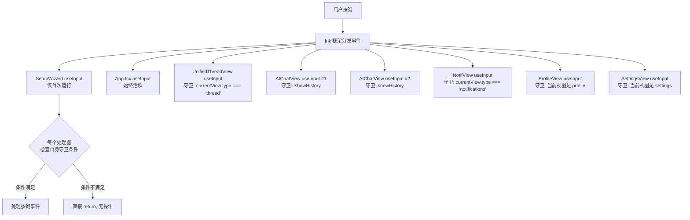
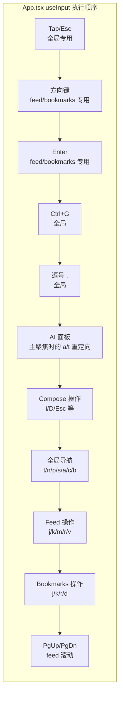
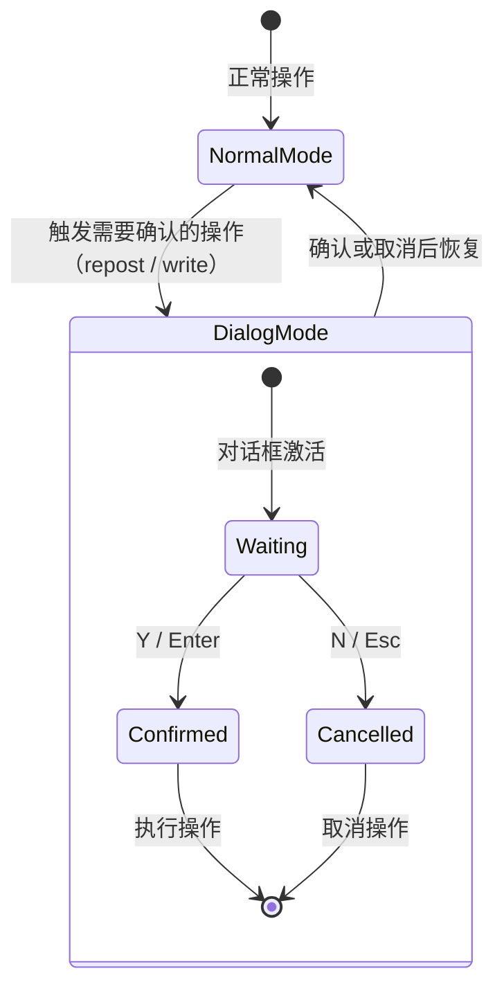

TUI（终端用户界面）的键盘快捷键系统采用 Ink 框架提供的 `useInput` 钩子进行事件分发。整个应用由分布在 **7 个组件中的 8 个 `useInput 调用**（其中 AIChatView 包含两个独立处理器）共同构成键盘事件网络。设计核心原则是：**Ink 在每次按键时按注册顺序触发所有 useInput 回调，每个处理器必须通过条件守卫（guard）自我限定作用范围，避免键位冲突。** 本页深入剖析该架构的层级结构、全局保留键规则、冲突解决策略，以及扩展指南。

Sources: [docs/KEYBOARD.md](docs/KEYBOARD.md#L1-L12), [AGENTS.md](AGENTS.md#L71-L76)

---

## 架构概览：事件传播模型

Ink 的 `useInput` 不提供优先级或阻止传播机制——所有已注册的处理器在每次按键时**全部被执行**。这意味着整个键盘系统依赖于**白名单守卫模式**：每个处理器在回调开头检查当前视图是否属于它的管辖范围，如果不是则直接 `return`，不做任何处理。



> **关键洞察**：这种"广播式"事件模型意味着同一个按键（如 `c`）在不同视图中可以有不同的含义——Feed 中 `c` 跳转到发帖页面，Thread 中 `c` 为回复当前帖子。App.tsx 的全局处理器会首先拦截不属于 thread/compose 视图的按键，而 ThreadView 的 `c` 处理器仅在 thread 视图下激活。

Sources: [packages/tui/src/components/App.tsx](packages/tui/src/components/App.tsx#L87-L88), [packages/tui/src/components/UnifiedThreadView.tsx](packages/tui/src/components/UnifiedThreadView.tsx#L48-L49), [docs/KEYBOARD.md](docs/KEYBOARD.md#L7-L12)

---

## 7 个 useInput 处理器的详细清单

以下表格列出了所有 `useInput` 处理器、其所属文件、作用域守卫条件，以及处理的核心键位：

| 编号 | 组件 | 文件位置 | 守卫条件 | 处理的键位 |
|------|------|----------|----------|-----------|
| 1 | **SetupWizard** | [SetupWizard.tsx](packages/tui/src/components/SetupWizard.tsx#L122-L129) | 首次运行，App 尚未挂载 | Tab/↑↓ 切换输入字段 |
| 2 | **App.tsx** | [App.tsx](packages/tui/src/components/App.tsx#L87-L180) | 始终活跃（App 挂载后） | Tab, Esc, Ctrl+G, 全局导航(t/n/p/s/a/c/b), 方向键, Enter, feed/bookmarks/compose 操作 |
| 3 | **UnifiedThreadView** | [UnifiedThreadView.tsx](packages/tui/src/components/UnifiedThreadView.tsx#L48-L116) | `currentView.type === 'thread'` | j/k/↑↓ 移动光标, Enter 聚焦, h 回主题, l 点赞, r 转发, c 回复, v 收藏, y 复制 URI, f 翻译, u 关注, g 查看资料 |
| 4 | **AIChatView（聊天模式）** | [AIChatView.tsx](packages/tui/src/components/AIChatView.tsx#L89-L101) | `!showHistory`（聊天活跃） | PgUp/PgDn 滚动, ↑↓ 微调滚动（非聚焦时）, u 撤销, r 重试, 确认对话框 Y/N |
| 5 | **AIChatView（历史模式）** | [AIChatView.tsx](packages/tui/src/components/AIChatView.tsx#L103-L113) | `showHistory`（历史列表） | Esc 返回, ↑↓ 选择, n 新建对话, l 加载对话, d 删除对话 |
| 6 | **NotifView** | [NotifView.tsx](packages/tui/src/components/NotifView.tsx#L19-L32) | `currentView.type === 'notifications'` | Esc 返回, j/k/↑↓ 导航, Enter 查看帖子, r/R 刷新 |
| 7 | **ProfileView** | [ProfileView.tsx](packages/tui/src/components/ProfileView.tsx#L30-L80) | 当前视图是 profile | Esc 返回, Tab/←→ 切换标签, j/k/↑↓ 导航帖子, Enter 查看, a AI 聊天, f 翻译简介, u 关注/取消, m 加载更多, p/P 关注者/关注列表 |
| 8 | **SettingsView** | [SettingsView.tsx](packages/tui/src/components/SettingsView.tsx#L77-L82) | 当前视图是 settings | Esc 返回, Tab/↑↓ 切换字段 |

> **注意**：官方文档列出的"5 个 useInput 处理器"（见 [docs/KEYBOARD.md](docs/KEYBOARD.md#L7-L12)）仅计数了核心永久工作流的处理器。本文档扩展至全部 8 个，涵盖 SetupWizard（首次运行）、ProfileView（资料页）和 SettingsView（设置页）等附属视图。

Sources: [docs/KEYBOARD.md](docs/KEYBOARD.md#L7-L17), [packages/tui/src/components/App.tsx](packages/tui/src/components/App.tsx#L87-L180), [packages/tui/src/components/UnifiedThreadView.tsx](packages/tui/src/components/UnifiedThreadView.tsx#L48-L116), [packages/tui/src/components/AIChatView.tsx](packages/tui/src/components/AIChatView.tsx#L89-L113), [packages/tui/src/components/NotifView.tsx](packages/tui/src/components/NotifView.tsx#L19-L32), [packages/tui/src/components/ProfileView.tsx](packages/tui/src/components/ProfileView.tsx#L30-L80), [packages/tui/src/components/SettingsView.tsx](packages/tui/src/components/SettingsView.tsx#L77-L82), [packages/tui/src/components/SetupWizard.tsx](packages/tui/src/components/SetupWizard.tsx#L122-L129)

---

## 全局处理器（App.tsx）的优先级与守卫链

App.tsx 的 `useInput` 处理器是整个系统中最复杂的一个，因为它**始终活跃**，且必须在全局快捷键与视图专用快捷键之间做仲裁。其执行顺序决定了整个键盘系统的行为边界：

### 守卫顺序（按代码执行流）



每个步骤都包含 `return;`——一旦条件匹配，事件就被消耗，不再继续向下传播到后续条件。这意味着：

1. **Tab/Esc 拥有最高优先级**，在 compose 和 aiChat 视图中，Esc 的"逐级退出"策略（例如 compose 中先关闭草稿保存提示 → 关闭草稿列表 → 关闭图片输入 → 提示保存 → 返回）保证了用户不会意外丢失数据。
2. **方向键被 feed 和 bookmarks 视图独占**——其他视图（如 thread）的方向键由各自的 useInput 处理器处理，不受 App.tsx 影响。
3. **Compose 视图会阻止所有全局导航快捷键**——当 `currentView.type === 'compose'` 时，compose 内部的逻辑块通过 `return;` 提前拦截了键位，全局的 `t/n/p/s/a/c/b` 等导航键不会在 compose 中触发。

### Esc 的逐级退出策略

| 当前状态 | 第一次 Esc | 第二次 Esc | 第三次 Esc |
|----------|-----------|-----------|-----------|
| compose + draftSavePrompt 打开 | 关闭保存提示 | — | — |
| compose + draftListOpen 打开 | 关闭草稿列表 | — | — |
| compose + imagePathInput 激活 | 取消图片输入 | — | — |
| compose + 有输入文本 | 显示保存草稿提示 | 关闭提示 | — |
| compose + 无文本 | goBack() | — | — |
| aiChat + focusedPanel === 'ai' | unfocus AI (setFocusedPanel('main')) | goBack() | — |
| aiChat + focusedPanel === 'main' | goBack() | — | — |
| feed | 无操作 | — | — |
| thread/profile/notifications/search/bookmarks | goBack() | — | — |

Sources: [packages/tui/src/components/App.tsx](packages/tui/src/components/App.tsx#L90-L190)

---

## 全局保留键规则

为了保证整个应用键位一致性，部分键被**永久保留**用于全局功能，在任何视图中都不能被重新定义为视图本地操作：

| 键位 | 全局功能 | 保留理由 |
|------|---------|---------|
| `t` | goHome() — 返回时间线 | 最常使用的"回家"键 |
| `n` | goTo 通知页面 | 导航到通知 |
| `p` | goTo 个人资料 | 查看自己的资料 |
| `s` | goTo 搜索 | 快速搜索 |
| `a` | goTo AI 聊天 | 启动 AI 助手 |
| `c` | goTo 发帖 (compose) | 快速发帖 |
| `b` | goTo 书签 | 查看收藏 |
| `Esc` | goBack() — 返回上级 | 通用退出/返回 |
| `Tab` | 切换 AI 面板聚焦 | AI 面板焦点切换 |
| `Ctrl+G` | goTo AI Chat (带当前上下文) | AI 快速启动 |

### 可用键位池

添加新视图快捷键时，可以从以下未被保留的键位中选择（需同时检查冲突表）：

**安全键位**：`f`, `z`, `x`, `w`, `u`, `o`, `g`, `q`, `e`, `d`（bookmarks 中已使用）, `l`（thread/AI-history 中已使用）, `h`（thread 中已使用）, `y`（thread 中已使用）, `i`（compose 中已使用）, `,`（设置）

> **原则**：`d` 在 bookmarks/AI-history 中使用，`l` 在 thread/AI-history 中使用，`h` 和 `y` 在 thread 中使用，`i` 在 compose 中使用——但不能在其他视图中重复使用相同含义，需通过守卫来隔离。

Sources: [docs/KEYBOARD.md](docs/KEYBOARD.md#L56-L73)

---

## 键位冲突表

以下表格展示了同一键位在不同视图中的不同语义。这是架构设计中的核心复杂度所在，也是为何每个处理器都必须有严格守卫的原因：

| 键位 | Feed | Thread | Bookmarks | Notifications | AI Chat | Compose | Profile |
|------|------|--------|-----------|---------------|---------|---------|---------|
| `t` | goHome | goHome | goHome | goHome | goHome | **blocked** | goHome |
| `a` | goTo AI | goTo AI | goTo AI | goTo AI | goHome (main聚焦时) | **blocked** | goTo AI |
| `c` | goTo compose | reply(回复) | goTo compose | goTo compose | goTo compose | **blocked** | goTo compose |
| `b` | goTo 书签 | goTo 书签 | goTo 书签(全局) | goTo 书签 | goTo 书签 | **blocked** | goTo 书签 |
| `r` | refresh(刷新) | repost(转发) | — | refresh(刷新) | retry(重试) | — | — |
| `j`/`↓` | 光标下移 | 光标下移 | 光标下移 | 光标下移 | 滚动3行(非聚焦) | — | 光标下移 |
| `k`/`↑` | 光标上移 | 光标上移 | 光标上移 | 光标上移 | 滚动3行(非聚焦) | — | 光标上移 |
| `l` | — | like(点赞) | — | — | load(加载对话) | — | — |
| `d` | — | — | delete(删除书签) | — | delete(删除对话) | — | — |
| `h` | — | go to root(主题帖) | — | — | — | — | — |
| `y` | — | yank URI(复制链接) | — | — | — | — | — |
| `f` | — | translate(翻译) | — | — | — | — | translate(翻译简介) |
| `u` | — | follow/unfollow | — | — | undo(撤销) | — | follow/unfollow |
| `g` | — | go to profile(查看资料) | — | — | — | — | — |
| `i` | — | — | — | — | — | add image(添加图片) | — |
| `m` | load more(加载更多) | — | — | — | — | — | load more(加载更多) |
| `Enter` | view thread(查看帖子) | refocus(聚焦帖子) | view thread(查看帖子) | view post(查看帖子) | TextInput(发送消息) | submit(提交帖子) | view thread(查看帖子) |
| `,` | settings | settings | settings | settings | settings | settings | settings |

> **关键冲突模式**：`c` 在 thread 视图中被 ThreadView 的本地区域守卫拦截——App.tsx 的全局处理器会检查 `if (currentView.type !== 'thread')` 再执行 `c` 的导航逻辑，从而让 ThreadView 的 `c`（回复）优先执行。同理，`a` 在 AI Chat 视图的 main 聚焦模式下被重定向为 `goTo('feed')`，而不是全局的 `goTo('aiChat')`。

Sources: [docs/KEYBOARD.md](docs/KEYBOARD.md#L218-L245), [packages/tui/src/components/App.tsx](packages/tui/src/components/App.tsx#L140-L160), [packages/tui/src/components/UnifiedThreadView.tsx](packages/tui/src/components/UnifiedThreadView.tsx#L48-L116)

---

## 视图内确认对话框的键盘锁定

某些操作（如 ThreadView 中的转发、AIChatView 中的写操作确认）会触发模态对话框，此时键盘事件的传播行为发生根本变化：

### 对话框锁定模式



在对话框模式下，`useInput` 处理器会**首先检查对话框状态**，如果对话框活跃，则**只处理 Y/N/Esc（或特定选项键）**，其他所有键都被忽略。以 ThreadView 的转发对话框为例：

```typescript
// UnifiedThreadView.tsx - 对话框守卫
if (repostDialog) {
  if (input === 'q' || input === 'Q') {
    goTo({ type: 'compose', quoteUri: repostDialog.uri });
    setRepostDialog(null); return;
  }
  if (key.escape) { setRepostDialog(null); return; }
  if (input === 'r' || input === 'R' || key.return) {
    if (repostDialog.phase === 'choice') { setRepostDialog({ ...repostDialog, phase: 'confirm' }); return; }
    if (repostDialog.phase === 'confirm') { void repostPost(repostDialog.uri); setRepostDialog(null); return; }
    return; // ← 关键：return 阻止事件继续传播到后续的普通键位处理
  }
  // ... 更多确认阶段处理
  return; // ← 所有对话框模式下的键都被拦截
}
```

AIChatView 的写操作确认对话框采用了相同的模式：当 `pendingConfirmation` 为 true 时，只接受 Y/Enter（确认）和 N/Esc（拒绝），其余键全部被 `return;` 拦截。

Sources: [packages/tui/src/components/UnifiedThreadView.tsx](packages/tui/src/components/UnifiedThreadView.tsx#L51-L65), [packages/tui/src/components/AIChatView.tsx](packages/tui/src/components/AIChatView.tsx#L93-L96)

---

## AI 面板聚焦的双焦点系统

AI Chat 视图引入了一个独特的**双焦点系统**，由 App.tsx 维护的 `focusedPanel` 状态管理：

```mermaid
flowchart TB
    subgraph "focusedPanel 状态"
        FP1[main<br/>主面板聚焦] -->|Tab| FP2[ai<br/>AI 面板聚焦]
        FP2 -->|Tab| FP1
    end

    subgraph "main 聚焦时"
        M1[全局导航键生效<br/>t/n/p/s/a/c/b]
        M2[方向键传递给<br/>AIChatView 滚动]
        M3[a/t 重定向为 goHome]
        M4[Esc → goBack]
    end

    subgraph "AI 聚焦时"
        A1[键盘直接传递给<br/>TextInput 编辑器]
        A2[方向键支持<br/>文本编辑]
        A3[Esc → unfocus AI<br/>setFocusedPanel('main')]
    end

    FP1 --> M1
    FP1 --> M2
    FP1 --> M3
    FP1 --> M4
    FP2 --> A1
    FP2 --> A2
    FP2 --> A3
```

这种设计的核心原因在于：终端中的 AI 聊天需要同时支持**阅读模式**（浏览聊天记录、滚动）和**输入模式**（在 TextInput 中键入消息）。Tab 键在两者之间切换：

- **main 聚焦**：方向键/PgUp/PgDn 控制聊天记录滚动，u/r 触发撤销/重试，a/t 跳转到 feed（覆盖全局导航的默认行为）
- **AI 聚焦**：所有键盘输入直接传递到 `TextInput` 组件，支持文本编辑；唯一的例外是 Esc，用于退出 AI 聚焦模式

> **注意**：`AIChatView` 组件本身也接收 `focused` prop，该 prop 控制其内部的 `useInput` 处理器的行为——当 `focused === true`（即 `focusedPanel === 'ai'`）时，AIChatView 内部的滚动键盘处理被禁用，确保方向键直接传递给 TextInput。

Sources: [packages/tui/src/components/App.tsx](packages/tui/src/components/App.tsx#L90-L95), [packages/tui/src/components/AIChatView.tsx](packages/tui/src/components/AIChatView.tsx#L89-L100)

---

## 鼠标滚动：与键盘系统并行的辅助输入

除了 `useInput` 键盘处理，App.tsx 还有一个**独立的 `process.stdin.on('data')` 监听器**用于追踪终端鼠标事件（基于 ANSI 转义序列 `\x1b[?1000h`）：

```typescript
// App.tsx - 鼠标滚动追踪
useEffect(() => {
  if (!stdout) return;
  enableMouseTracking(stdout);
  const onData = (data: Buffer) => {
    const evt = parseMouseEvent(data);
    if (!evt) return;
    if (evt.type === 'scrollUp') {
      if (currentView.type === 'feed') setFeedIdx(i => Math.max(0, i - 1));
    } else if (evt.type === 'scrollDown') {
      if (currentView.type === 'feed') setFeedIdx(i => Math.min(posts.length - 1, i + 1));
    }
  };
  process.stdin.on('data', onData);
  return () => {
    process.stdin.off('data', onData);
    disableMouseTracking(stdout);
  };
}, [stdout, currentView.type, posts.length]);
```

鼠标事件的解析由 `packages/tui/src/utils/mouse.ts` 中的 `parseMouseEvent` 函数处理。目前仅 feed 视图支持鼠标滚动，每个滚动事件等同于一次 `j`/`k` 导航操作。函数式组件卸载时会自动清理监听器并关闭鼠标追踪。

Sources: [packages/tui/src/components/App.tsx](packages/tui/src/components/App.tsx#L154-L171), [packages/tui/src/utils/mouse.ts](packages/tui/src/utils/mouse.ts)

---

## 添加新快捷键的标准化流程

根据 AGENTS.md 中记录的强制性步骤，添加新快捷键必须遵循以下流程：

1. **检查全局保留键表**——确认目标键不在 `t/n/p/s/a/c/b/Esc/Tab/Ctrl+G` 中
2. **检查冲突表**——确认目标键在其他视图中没有冲突的含义；如果存在冲突，必须确保视图守卫能够正确隔离
3. **在目标组件中添加 `useInput` 或扩展已有处理器**——遵循现有守卫模式，在回调开头添加视图类型检查
4. **在 App.tsx 中添加守卫**——如果新快捷键可能与其他全局键冲突，需在 App.tsx 的对应位置添加条件检查
5. **更新 i18n 中的键盘提示字符串**——在 `packages/app/src/i18n/locales/{zh,en,ja}.ts` 中找到对应的 `keys.*` 条目，添加或修改提示文字
6. **更新 `docs/KEYBOARD.md`**——添加新快捷键到对应视图的表格中，并更新冲突表

> **强制验证步骤**：在合并前必须检查新快捷键在所有 8 个视图（feed, thread, bookmarks, notifications, aiChat, compose, profile, search）中的行为，确保没有意外冲突。由于 Ink 事件模型在开发环境与生产环境中表现一致，该验证可以在本地终端完成。

Sources: [AGENTS.md](AGENTS.md#L71-L76), [docs/KEYBOARD.md](docs/KEYBOARD.md#L247-L254)

---

## 架构设计的关键原则

1. **App.tsx 作为中心仲裁者**：所有全局键由 App.tsx 统一处理，视图本地键由各自组件处理。App.tsx 的 `currentView.type` 守卫确保它不会处理本应由子视图处理的键。

2. **守卫优先于命名空间**：Ink 不提供像 Web 的 `event.stopPropagation()` 这样的阻止传播机制。因此每个处理器必须通过**主动不处理**来实现隔离，而非通过阻止传播。

3. **Compose 视图中全局键被完全阻止**：由于 compose 视图中的 TextInput 需要捕获几乎所有键盘输入（包括字母键），App.tsx 的 compose 逻辑块通过 `return;` 在全局导航检查之前拦截了所有事件。

4. **对话框模式使用"全拦截"策略**：任何需要用户确认的模态对话框（转发确认、写操作确认）都会在 `useInput` 回调的最前端进行拦截，阻止所有非对话框键位的传播。

5. **i18n 驱动的键盘提示**：每个视图的键盘快捷键提示都通过国际化系统动态渲染，存储在 `keys.*` 命名空间下。提示信息会随 locale 切换而改变，但快捷键本身是固定的。

Sources: [packages/tui/src/components/App.tsx](packages/tui/src/components/App.tsx#L90-L190), [docs/KEYBOARD.md](docs/KEYBOARD.md#L1-L12)

---

## 延伸阅读

- [导航状态机：基于栈的 AppView 路由与视图切换](7-dao-hang-zhuang-tai-ji-ji-yu-zhan-de-appview-lu-you-yu-shi-tu-qie-huan) — 理解 `currentView` 状态如何驱动键盘行为
- [TUI 入口与 SetupWizard：交互式首次配置流程](20-tui-ru-kou-yu-setupwizard-jiao-hu-shi-shou-ci-pei-zhi-liu-cheng) — SetupWizard 的键盘交互详解
- [TUI 文本工具：CJK 感知的 visualWidth / wrapLines 与终端鼠标追踪](22-tui-wen-ben-gong-ju-cjk-gan-zhi-de-visualwidth-wraplines-yu-zhong-duan-shu-biao-zhui-zong) — 鼠标追踪工具函数实现
- [国际化系统：zh/en/ja 三语言单例 Store 与即时切换](29-guo-ji-hua-xi-tong-zh-en-ja-san-yu-yan-dan-li-store-yu-ji-shi-qie-huan) — `keys.*` 提示字符串的国际化
- [核心术语与命名约定](9-he-xin-zhu-yu-yu-ming-ming-yue-ding-tao-lun-chuan-ui-yuan-su-dai-ma-ming-ming-gui-fan) — 组件视图类型命名规范