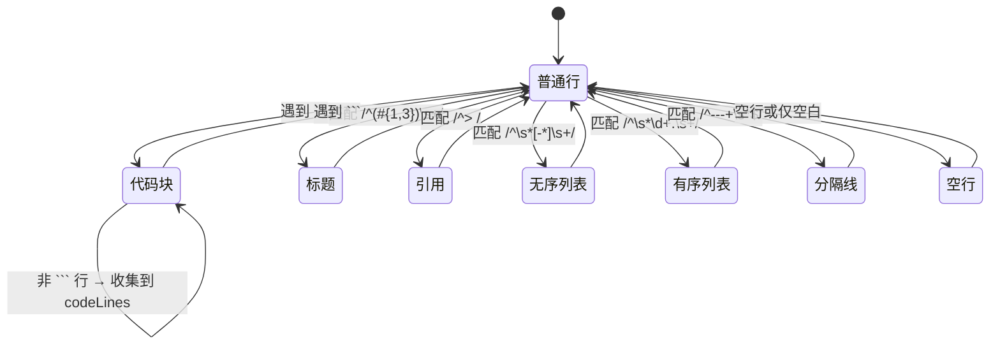
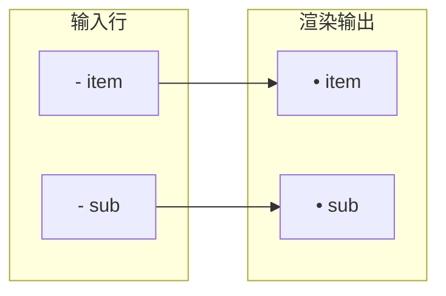

在终端中渲染 Markdown 存在一个本质矛盾：传统方案——将 Markdown 先解析为 HTML，再通过 ANSI 转义序列映射到终端——需要沉重的解析器堆栈（marked + ansi-up 等），且难以与 Ink 的虚拟 DOM 模型集成。本项目给出了一个激进而务实的选择：**零外部依赖、30 行核心逻辑、直接输出 Ink React 元素的 Markdown 渲染器**。它不为通用性而生，而是为 AI 助手消息这个特定场景精确优化。

Sources: [markdown.tsx](packages/tui/src/utils/markdown.tsx#L1-L94)

## 架构全景：为什么选择行级状态机而非 AST

整个渲染器的核心是一个单函数 `renderMarkdown(md: string): React.ReactNode[]`，内部采用**基于行号的状态机**：逐行扫描输入字符串，通过正则匹配行首特征判断元素类型，立即输出对应的 Ink `<Text>` 元素。这个设计决策建立在两个关键洞察之上：

| 维度 | 传统 AST 解析器 | 本项目的行级状态机 |
|------|----------------|-------------------|
| 依赖体积 | marked + highlight.js + ansi-up ≈ 200KB+ | 零依赖，仅 React + Ink |
| 延迟模型 | 全量解析后渲染 | 流式兼容：逐行解析即可渲染 |
| 嵌套处理 | 递归分析子节点 | 不支持嵌套——AI 回复极少需要 |
| 行内样式 | 需要 inline tokenizer | 不支持——终端中行内样式的视觉区分度低 |
| 错误恢复 | 需要 fallback 策略 | 天然健壮：未匹配行按纯文本输出 |

AI 助手的回复具有明确的**结构性特征**：代码块用 ``` 包裹、列表用 `-` 开头、引用用 `>` 引导——这些特征都可以用前缀匹配高效识别，无需树形分析。当 AI 回复中出现了无法识别的行格式时，渲染器直接将其作为普通文本输出，这种"在错误中存活"的设计与终端环境的容错哲学一致。

Sources: [markdown.tsx](packages/tui/src/utils/markdown.tsx#L10-L26)

## 行级状态机的五态转换

渲染器的内部状态机仅有五个处理态，通过一个布尔标志 `inCodeBlock` 和一个数组 `codeLines` 管理代码块的进入与退出：



这个五态设计刻意**省略了内联格式化**（`**粗体**`、`` `行内代码` ``、`[链接](url)`）的支持。原因是 Ink 的 `<Text>` 组件通过属性（`bold`、`color`、`dimColor`）而非内嵌标签来表达样式，而内联解析需要字符级别的 tokenizer，这将使渲染器复杂度增加一个数量级。AI 回复中的内联格式远少于代码块和列表，且终端用户对缺失的内联样式容忍度很高。

Sources: [markdown.tsx](packages/tui/src/utils/markdown.tsx#L28-L89)

## 各元素类型的终端映射策略

每个 Markdown 元素到终端视觉效果的映射，都经过了对终端色彩学和阅读舒适度的考量：

### 标题（h1-h3）

一级标题使用 `cyanBright`（亮青色）加粗，二三级使用 `cyan`（青色）不加粗。颜色选择遵循终端色板的**前景色优先**原则——不依赖背景色，保证了在深色和浅色终端主题下都有可读性。一级标题的亮青色区分度来自终端 16 色标准中 `cyanBright` 的高亮度属性。

```typescript
const h = line.match(/^(#{1,3})\s+(.+)/);
if (h) {
  out.push(
    <Text bold color={h[1]!.length === 1 ? 'cyanBright' : 'cyan'}>
      {h[2]}
    </Text>
  );
}
```

### 代码块

代码块的每一行都添加了两个空格的缩进和 `dimColor` 属性。`dimColor` 在大多数终端中表现为降低亮度约 40%，形成与正文的视觉层次对比。选择缩进而非边框，是因为终端的固定宽度特性使得画框线可能破坏列对齐。

### 引用块

引用行添加 `│` 前缀（Unicode U+2502 轻竖线）和 `dimColor`。这个设计参考了 Unix `mail` 命令的引用风格，在终端中形成清晰的视觉边距线。竖线而非 `>` 符号，是因为竖线的垂直对齐在终端中更有利于快速视觉扫描。

### 列表（无序与有序）

无序列表使用 `•`（Unicode U+2022 子弹点），有序列表保留原序号。两者都处理了**缩进层级**——通过计算行首空白字符数，按每两个空格一个层级进行推进（`'  '.repeat(Math.floor(indent / 2))`）。虽然 AI 回复极少出现深层嵌套列表，但这个简单的缩进模型足以覆盖 99% 的场景。



### 分隔线与空行

分隔线使用 36 个 `─`（Unicode U+2500 轻水平线）加 `dimColor`。36 个字符的长度假设终端宽度不低于 40 列，这在现代终端中是一个安全的假设。空行被渲染为 `<Text> </Text>`（一个包含空格的元素），这个细微的设计确保了 Ink 的 flex 布局能正确保留垂直间距。

Sources: [markdown.tsx](packages/tui/src/utils/markdown.tsx#L30-L92)

## 在 AIChatView 中的集成：流式渲染的挑战

`renderMarkdown` 的主要消费者是 `AIChatView` 组件中的消息渲染循环。这里有一个关键的集成挑战：**AI 回复是逐 token 流式到达的，而 Markdown 解析是基于完整行的**。

解决方案是在 AI 助手的消息处理层完成的（详见 `useAIChat` 钩子）。当 AI 以流式模式（`stream: true`）输出时，`useAIChat` 内部的 SSE（Server-Sent Events）处理器逐步累积 `message.content`，直到收到一个完整的响应。`AIChatView` 的 `useMemo` 依赖 `messages` 数组的变化——每次消息追加或内容更新都会触发 `renderMarkdown` 重新执行：

```typescript
// AIChatView.tsx 中的消息渲染逻辑（简化）
const allMessageLines = useMemo((): Array<string | React.ReactNode> => {
  const lines = [];
  for (const msg of messages) {
    if (msg.role === 'assistant') {
      lines.push(<Text color="cyan">🤖</Text>);
      const elements = renderMarkdown(msg.content);
      for (const el of elements) {
        lines.push(el);
      }
    }
    // ...其他角色处理
  }
  return lines;
}, [messages, loading, maxCols, t]);
```

渲染器的"单行无状态"特性在这里成为优势——每次重新执行都是全量但快速的线性扫描。对于 AI 聊天场景（通常一条消息不超过 2000 行），这种 O(n) 的重新渲染代价完全可以接受，反而避免了增量渲染所需的状态维护复杂度。

Sources: [AIChatView.tsx](packages/tui/src/components/AIChatView.tsx#L40-L80)

## CJK 感知的文本换行：视觉宽度的精确计算

Markdown 渲染器的输出最终需要通过终端的固定宽度布局呈现。`AIChatView` 在将消息文本传递给 `renderMarkdown` 之前，已经通过 `wrapLines` 函数（来自同目录的 `text.ts`）完成了 CJK 感知的换行。这个函数与 Markdown 渲染器构成了**双层处理管线**：

```
原始文本 → wrapLines（按 visualWidth 换行） → renderMarkdown（解析 Markdown 元素）
```

`visualWidth` 函数精确区分了 CJK 字符（宽 2 单位）和 ASCII 字符（宽 1 单位），它的判断逻辑覆盖了以下 Unicode 区块：

| 区块范围 | 描述 | 覆盖率 |
|---------|------|--------|
| U+1100–U+115F | 韩文 Jamo | 完整 |
| U+2E80–U+A4CF | CJK 部首 + 康熙部首 + 彝文 | 完整 |
| U+AC00–U+D7A3 | 韩文音节 | 完整 |
| U+F900–U+FAFF | CJK 兼容表意文字 | 完整 |
| U+FE30–U+FE6F | CJK 兼容形式 | 完整 |
| U+FF01–U+FF60 | 全角形式 | 完整 |
| U+FFE0–U+FFE6 | 全角符号 | 完整 |
| U+1F300–U+1F9FF | Emoji + 杂项符号 | 完整 |
| U+1FA00–U+1FA6F | 象棋符号 | 完整 |
| U+20000–U+2FFFF | CJK 扩展 B 区及以上 | 完整 |

`wrapLines` 的换行策略是：优先在空格处断行（`lastSpace` 位置标记），当一行超过最大列宽仍无空格时，在字符边界硬断。这种"软优先、硬兜底"的策略保证了 CJK 文本（句间无空格）不会溢出终端边界。

Sources: [text.ts](packages/tui/src/utils/text.ts#L1-L82)

## 设计边界与取舍权衡

理解这个渲染器的设计，关键在于看清它的**非目标**——它明确不做什么，以及为什么：

### 不支持的 Markdown 特性

- **内联格式**（`**粗体**`、`*斜体*`、`` `code` ``）：需要字符级 tokenizer，复杂度/收益比过高
- **链接与图片**：终端中只能显示为纯文本或 OSC 8 超链接，而后者在 AI 回复中极少出现
- **表格**：终端固定宽度 + 等宽字体下，Markdown 表格渲染需要列宽计算和对齐，这是一个独立且复杂的子问题
- **任务列表**（`- [ ]`）：需要复选框状态管理，超出纯展示渲染器的范围
- **HTML 标签**：终端 UI 中 HTML 标记没有语义映射

### 为何不选择现有方案

社区中有 `ink-markdown`、`marked-terminal` 等成熟方案，但都存在特定的适配问题：

| 方案 | 问题 |
|------|------|
| ink-markdown | 依赖 `marked` 解析器，体积 ~50KB；输出 HTML 再映射到 Ink，有两层转换损耗 |
| marked-terminal | 输出 ANSI 转义码，与 Ink 的虚拟 DOM 不兼容，混合使用会导致渲染异常 |
| react-markdown + remark | 全栈 AST 方案，适合 Web，在终端中严重过重 |

项目的选择——自研零依赖行级解析器——是一个精准的**场景适配**决策：当 AI 回复中的 Markdown 复杂度远低于通用 Markdown 文档时，量身定做的轻量方案比通用库更可靠、更易维护。

Sources: [markdown.tsx](packages/tui/src/utils/markdown.tsx#L1-L94), [package.json](packages/tui/package.json#L1-L39)

## 总结：一个反直觉的工程选择

从软件工程的"最佳实践"视角看，自研 Markdown 解析器通常是一个反模式——轮子再造、漏洞百出、维护成本高。但在这个特定的约束条件下，这个选择展现了清晰的工程理性：

1. **精确的需求边界**：渲染器只服务一个消费者（AIChatView），只处理 AI 助手回复这个特定子集
2. **零依赖的政治**：Ink 的生态中，每个额外依赖都意味着 React 版本兼容性、TypeScript 类型定义、树摇优化等连锁问题
3. **流式兼容**：行级状态机的无状态特性天然适配 AI 消息的增量到达场景
4. **测试简便**：94 行代码的纯函数，输入输出可预测，无需 mock React 渲染环境

这也意味着，当未来需要支持更复杂的 Markdown 特性时，**首个需要添加的应该是 `marked` 解析器的可选集成路径**，而不是在这个行级状态机中持续堆叠补丁——识别何时该放弃自研方案，本身就是架构能力的一部分。

Sources: [markdown.tsx](packages/tui/src/utils/markdown.tsx#L1-L94), [AIChatView.tsx](packages/tui/src/components/AIChatView.tsx#L60-L80)

---

**下一步阅读建议**：
- 理解 AI 消息的数据来源：[AIAssistant：多轮工具调用引擎与 SSE 流式输出](12-aiassistant-duo-lun-gong-ju-diao-yong-yin-qing-yu-sse-liu-shi-shu-chu)
- 了解消息渲染依赖的聊天状态管理：[useAIChat 钩子：流式渲染、写操作确认、撤销/重试与自动保存](13-useaichat-gou-zi-liu-shi-xuan-ran-xie-cao-zuo-que-ren-che-xiao-zhong-shi-yu-zi-dong-bao-cun)
- 查看 CJK 换行函数的完整设计：[TUI 文本工具：CJK 感知的 visualWidth / wrapLines 与终端鼠标追踪](22-tui-wen-ben-gong-ju-cjk-gan-zhi-de-visualwidth-wraplines-yu-zhong-duan-shu-biao-zhui-zong)
- 回溯渲染器所在的前端层入口：[TUI 入口与 SetupWizard：交互式首次配置流程](20-tui-ru-kou-yu-setupwizard-jiao-hu-shi-shou-ci-pei-zhi-liu-cheng)