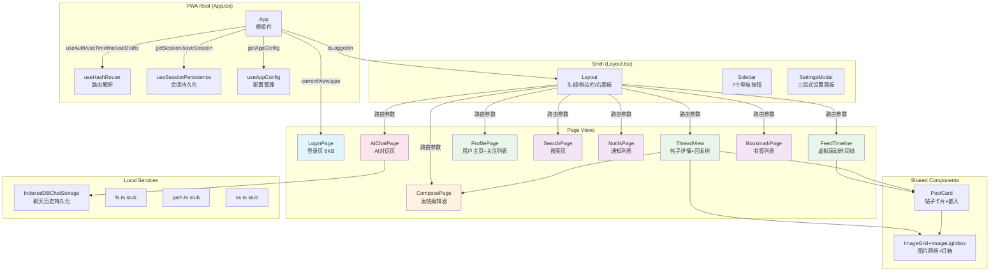

PWA 包（`packages/pwa`）是整个项目面向 Web 浏览器的渲染层，实现了完整的 SPA 客户端。与 TUI 终端界面共享 `@bsky/app` 层的所有业务逻辑钩子和 `@bsky/core` 的 AT 协议客户端，但拥有自己独立的组件树、路由系统、持久化服务和 CSS 样式体系。全包 13 个组件、3 个本地钩子、3 个后端 stubs 和 1 个 IndexedDB 服务，构成了一个完全自洽的浏览器应用。

## 架构总览：从 App 根组件到 9 个视图页面的渲染树

PWA 的组件树是一个三层结构——根组件 `App.tsx` 作为路由与状态协调中枢，`Layout.tsx` 提供全局壳层（header + sidebar + right panel），而具体的页面视图组件则根据 `AppView` 类型动态切换渲染。



**流程图解读**：根组件 `App.tsx` 是唯一的状态协调中心。它同时持有 `useHashRouter`（导航状态）、`useAuth`（认证状态）、`useTimeline`（时间线数据）和 `useDrafts`（草稿数据），并将这些数据以 props 下发给 Layout 和各页面。Layout 仅负责壳层渲染，不持有业务数据。页面组件则各自调用 `@bsky/app` 层的钩子获取专属数据。

Sources: [App.tsx](packages/pwa/src/App.ts#L19-L203), [Layout.tsx](packages/pwa/src/components/Layout.tsx#L24-L167)

## 页面组件清单：9 个视图 + 1 个登录页

PWA 包包含了 10 个顶层页面级别的组件，分别对应不同的 AppView 路由类型。每个页面组件的 props 模式高度一致——都接收 `client: BskyClient` 和导航回调（`goBack`/`goTo`）作为基础设施参数。

| 组件 | 对应路由 | 核心 `@bsky/app` 依赖 | 独有特性 | 代码行数 |
|------|---------|----------------------|---------|---------|
| `LoginPage` | 未登录态 | `useI18n` | 表单校验、App Password 指引 | 99 行 |
| `FeedTimeline` | `#/feed` | `useTimeline` | **@tanstack/react-virtual** 虚拟滚动、滚动位置恢复、IntersectionObserver 自动加载 | 189 行 |
| `ThreadView` | `#/thread?uri=` | `useThread`, `useBookmarks`, `useTranslation` | 父子帖分层渲染、关注/取消关注、ActionButtons 操作栏（6 种操作） | 408 行 |
| `ComposePage` | `#/compose` | `useCompose`, `useDrafts` | 图片上传（≤4 张 / 1MB）、引用预览、草稿存取、300 字限制 | 318 行 |
| `ProfilePage` | `#/profile?actor=` | `useProfile`, `useTranslation` | 双虚拟滚动（帖子+关注列表）、关注列表弹窗、头像/背景灯箱 | 449 行 |
| `SearchPage` | `#/search?q=` | `useSearch` | Enter 键搜索、URL 参数预填充 | 90 行 |
| `NotifsPage` | `#/notifications` | `useNotifications` | 6 种通知理由表情映射、timeAgo 相对时间 | 135 行 |
| `AIChatPage` | `#/ai` | `useAIChat`, `useChatHistory` | **写操作确认模态框**、消息类型渲染（4 种角色）、引导问题列表、撤回/重试 | 351 行 |
| `BookmarkPage` | `#/bookmarks` | `useBookmarks` | 单篇移除书签、全部刷新 | 72 行 |
| `SettingsModal` | 模态弹窗 | `useI18n` | 三段式标签（Bluesky/AI/General）、本地配置即时保存 | 240 行 |

`ThreadView` 和 `ProfilePage` 是代码量最大的两个页面（408 行和 449 行），原因在于它们各自包含了一个完整的功能子系统——前者有 `ActionButtons`（点赞、转发、回复、书签、AI 分析、翻译、复制链接共 7 个操作按钮）+ 翻译结果展示 + 关注切换，后者有双列表虚拟滚动 + 关注列表弹窗 + 头像/背景灯箱。

Sources: [FeedTimeline.tsx](packages/pwa/src/components/FeedTimeline.tsx#L37-L188), [ThreadView.tsx](packages/pwa/src/components/ThreadView.tsx#L120-L408), [ComposePage.tsx](packages/pwa/src/components/ComposePage.tsx#L55-L317), [ProfilePage.tsx](packages/pwa/src/components/ProfilePage.tsx#L39-L449)

## 共享组件层：PostCard、ImageGrid 与 ImageLightbox

`PostCard.tsx` 是整个 PWA 中使用频率最高的共享组件——在 FeedTimeline、ThreadView、ProfilePage、SearchPage 和 BookmarkPage 中均有实例化。它通过 TypeScript 联合类型（`PostCardWithPost | PostCardWithLine`）同时支持两种数据源输入：

- **PostView 模式**：从 `@bsky/core` 的 API 返回对象提取内容、嵌入媒体
- **FlatLine 模式**：从 `@bsky/app` 的 `useThread` 返回的扁平线程行数据渲染

`PostCard` 的内部还包含了 `ImageGrid`（自适应网格布局：1 图满格、2 图双列、3 图首行双列第二行跨列、4 图 2×2）和 `ImageLightbox`（通过 `createPortal` 渲染到 `document.body` 的全屏灯箱），这两个子组件同样通过 `export { ImageGrid, ImageLightbox }` 暴露给 ThreadView 复用。

```typescript
// PostCard 的双数据源联合类型——同一个卡片组件服务 5 个不同的页面
type PostCardProps = PostCardWithPost | PostCardWithLine;

interface PostCardBaseProps {
  onClick?: () => void;
  isSelected?: boolean;
  children?: React.ReactNode;  // 用于 ThreadView 注入 ActionButtons
  goTo?: (v: AppView) => void;
  repostBy?: string;
}
```

Sources: [PostCard.tsx](packages/pwa/src/components/PostCard.tsx#L201-L373)

## 本地钩子层：3 个 PWA 专有钩子

PWA 包的 `hooks/` 目录下有三个本地钩子，它们不依赖 `@bsky/app` 的 React 钩子体系，而是直接与浏览器 API（`localStorage`、`window.history`、`window.location.hash`）交互：

### `useHashRouter`——基于 history.pushState + popstate 的 hash 路由系统

这是 PWA 的导航中枢。它维护 `currentView: AppView` 状态和 `canGoBack` 标志位，通过 `parseHash()` 和 `encodeView()` 两个纯函数在 URL hash 和 AppView 对象之间做双向序列化。

支持的 9 种 hash 格式：

| hash 路径 | AppView 类型 | 参数 |
|-----------|-------------|------|
| `#/feed` | `feed` | 无 |
| `#/thread?uri=at://...` | `thread` | `uri` |
| `#/profile?actor=did:plc:...` | `profile` | `actor` |
| `#/notifications` | `notifications` | 无 |
| `#/search?q=...` | `search` | `query` |
| `#/bookmarks` | `bookmarks` | 无 |
| `#/compose?replyTo=&quoteUri=` | `compose` | `replyTo`, `quoteUri` |
| `#/ai?context=at://...` | `aiChat` | `contextUri` |

初始化时检测当前 URL，若没有 hash 则自动 `replaceState` 到 `#/feed`；`goBack` 调用 `window.history.back()`，`goHome` 推入 `#/feed` 并重置 `canGoBack = false`。

Sources: [useHashRouter.ts](packages/pwa/src/hooks/useHashRouter.ts#L18-L61)

### `useSessionPersistence`——localStorage 会话持久化

三个纯函数操作 `localStorage` 键 `bsky_session`，序列化存储 `accessJwt`、`refreshJwt`、`handle` 和 `did`。在 `App.tsx` 中通过 `useEffect` 在挂载时恢复会话、在登录成功后保存会话、在认证错误时清空会话。

Sources: [useSessionPersistence.ts](packages/pwa/src/hooks/useSessionPersistence.ts#L1-L27)

### `useAppConfig`——localStorage 应用配置管理

同样基于 `localStorage`（键 `bsky_app_config`）存储用户偏好——AI 配置（`apiKey`/`baseUrl`/`model`）、翻译目标语言、翻译模式、深色模式和思考模式。通过 `saveAppConfig` 和 `updateAppConfig` 操作，`SettingsModal` 中三个设置面板分别调用这两个函数实现即时持久化。

Sources: [useAppConfig.ts](packages/pwa/src/hooks/useAppConfig.ts#L1-L45)

## 服务层：IndexedDB 聊天存储与浏览器兼容 stub

### `IndexedDBChatStorage`

这是 `@bsky/app` 层 `ChatStorage` 接口（定义于 `packages/app/src/services/chatStorage.ts`）的 PWA 实现。通过 `indexedDB.open` 操作 `bsky-chats` 数据库中的 `chats` 对象存储（主键为 `id`），实现了四个核心方法：

- **saveChat**：`put` 操作 upsert 聊天记录
- **loadChat**：`get` 按 ID 加载
- **listChats**：`getAll` 获取全部并降序排序
- **deleteChat**：`delete` 按 ID 删除

`AIChatPage` 在组件内部通过 `useMemo(() => new IndexedDBChatStorage(), [])` 实例化，然后注入 `useAIChat` 钩子作为存储后端。`useChatHistory(storage)` 则负责渲染侧边栏中的历史对话列表。

Sources: [indexeddb-chat-storage.ts](packages/pwa/src/services/indexeddb-chat-storage.ts#L1-L77)

### Node.js 模块 stub

`stubs/` 目录下的三个文件是为了在浏览器环境中编译原 TUI 代码中引用 Node.js 内置模块 (`fs`/`path`/`os`) 的依赖而设的空壳。`fs.ts` 返回所有方法都为 no-op（`existsSync ⇒ false`、`writeFileSync ⇒ {}`等），`path.ts` 的 `join` 简单用 `'/'` 拼接，`os.ts` 的 `homedir` 返回 `'/'`。

Sources: [fs.ts](packages/pwa/src/stubs/fs.ts#L1-L8), [path.ts](packages/pwa/src/stubs/path.ts#L1-L3), [os.ts](packages/pwa/src/stubs/os.ts#L1-L3)

## 数据流全景：PWA 特有层与共享层的边界划分

PWA 的组件体系与 `@bsky/app` 的钩子体系之间有一条清晰的边界线：

```
┌─────────────────────────────────────────────────────┐
│                  PWA 特有层 (packages/pwa)            │
│                                                      │
│  useHashRouter     useAppConfig    useSessionPersistence
│  (history API)      (localStorage)     (localStorage) │
│                                                      │
│  13个组件 (Layout/PostCard/FeedTimeline/...)         │
│  + Tailwind CSS + react-markdown + react-virtual    │
│  + IndexedDBChatStorage                             │
├─────────────────────────────────────────────────────┤
│               @bsky/app 共享层 (packages/app)         │
│                                                      │
│  useAuth  useTimeline  useThread  useProfile         │
│  useCompose  useDrafts  useAIChat  useChatHistory    │
│  useSearch  useNotifications  useBookmarks           │
│  useTranslation  useI18n                             │
│  + 单向监听器 Store 模式                              │
├─────────────────────────────────────────────────────┤
│            @bsky/core 共享层 (packages/core)          │
│                                                      │
│  BskyClient (AT协议 HTTP客户端 + JWT自动刷新)         │
│  所有类型定义 (PostView, AIConfig, etc.)              │
└─────────────────────────────────────────────────────┘
```

**关键洞察**：PWA 页面组件**只消费** `@bsky/app` 的钩子返回的数据，从不直接调用 AT 协议 API。所有 API 调用都封装在钩子内部。这使得 PWA 的页面组件保持纯粹的表现层职责——它们接收数据并渲染 UI，不关心数据是如何获取的。

Sources: [@bsky/app index.ts](packages/app/src/index.ts#L4-L31)

## 下一步阅读建议

- 若想深入理解路由系统的实现细节，请移步 [Hash 路由系统：useHashRouter 与基于 URL hash 的 SPA 导航](25-hash-lu-you-xi-tong-usehashrouter-yu-ji-yu-url-hash-de-spa-dao-hang)
- 了解 PWA 离线能力的架构，参考 [PWA 离线支持：Service Worker、manifest.json 与桌面安装](26-pwa-chi-xian-zhi-chi-service-worker-manifest-json-yu-zhuo-mian-an-zhuang)
- 探索聊天存储的接口与双端实现，参见 [聊天存储接口：ChatStorage 抽象与 TUI/PWA 双实现](27-liao-tian-cun-chu-jie-kou-chatstorage-chou-xiang-yu-tui-pwa-shuang-shi-xian)
- 若想查看 PWA 使用的共享钩子的全貌，回到核心目录 [数据钩子清单：useAuth / useTimeline / useThread / useProfile 等](17-shu-ju-gou-zi-qing-dan-useauth-usetimeline-usethread-useprofile-deng)