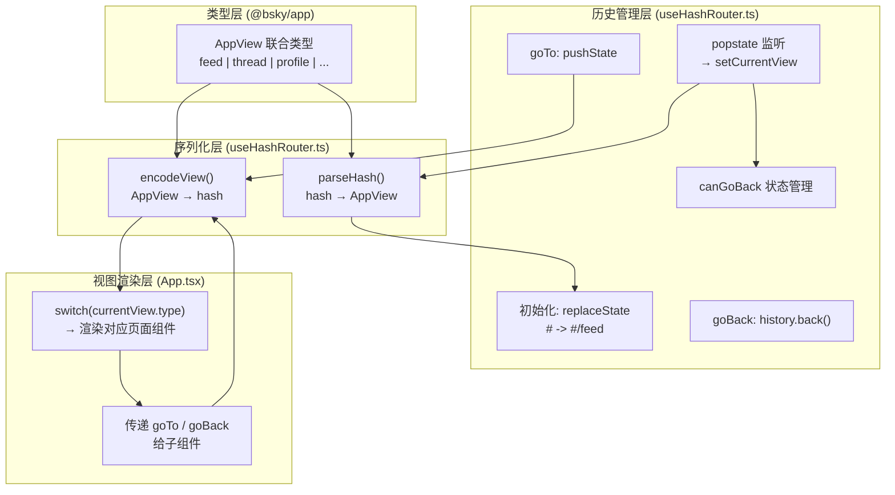
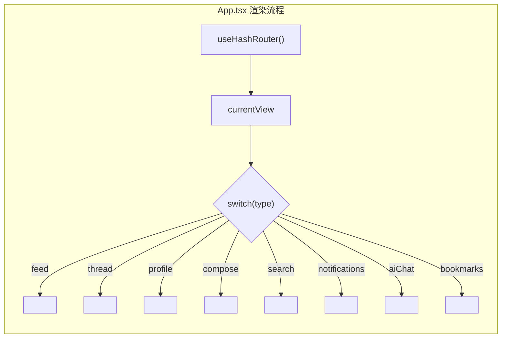
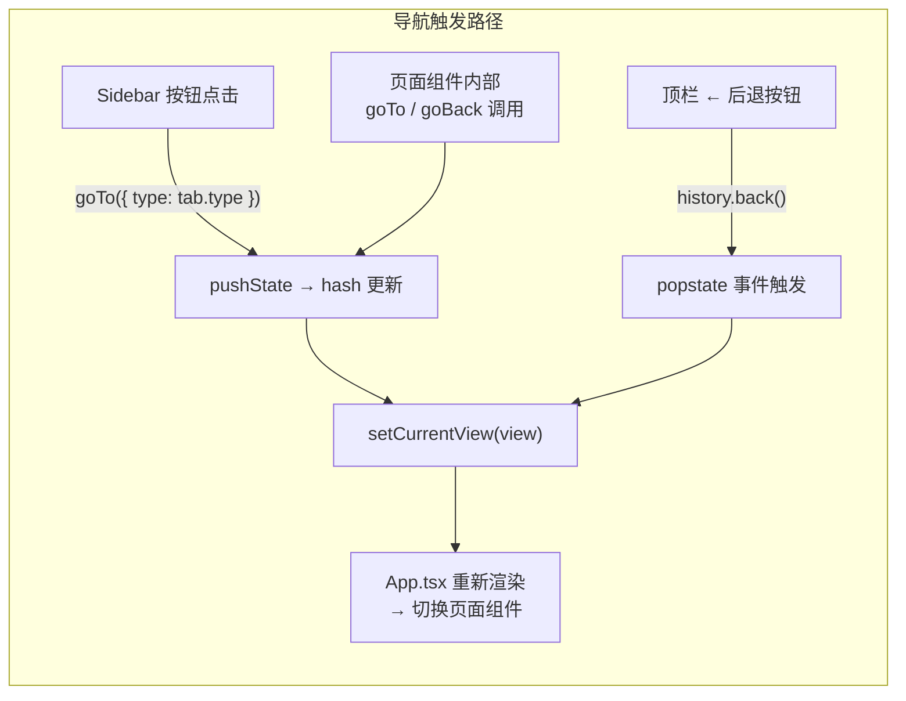

PWA 客户端部署于静态托管环境（Cloudflare Pages），无法依赖服务器端 URL 重写。为支持浏览器原生前进/后退导航、URL 分享与页面刷新后状态恢复，PWA 实现了基于 URL hash 的 SPA 路由系统。这套系统的核心是 `useHashRouter` 钩子——一个零外部依赖的 hash 路由方案，与 `@bsky/app` 层定义的 `AppView` 类型系统无缝对接。

Sources: [useHashRouter.ts](packages/pwa/src/hooks/useHashRouter.ts#L1-L25)

## 架构概览：从 AppView 到 URL hash 的双向映射

hash 路由系统的核心架构可以概括为三个层次：**类型层**（定义所有可能的视图）、**序列化层**（`parseHash`/`encodeView` 完成 AppView ↔ hash 的双向转换）、以及 **历史管理层**（`pushState` + `popstate` 监听）。这三层在 `useHashRouter` 钩子中整合为一个统一的 API，暴露给 `App.tsx` 及其他组件使用。



与 TUI 客户端采用的内存栈导航不同（`packages/app/src/state/navigation.ts` 中的 `createNavigation()`），PWA 的 `useHashRouter` 放弃了内部的 `stack: AppView[]` 数组，转而利用浏览器的 history 栈本身作为导航状态的管理容器。两者暴露的接口完全一致——`{ currentView, canGoBack, goTo, goBack, goHome }`——因此上层组件无需关心具体实现。

Sources: [useHashRouter.ts](packages/pwa/src/hooks/useHashRouter.ts#L27-L75), [navigation.ts](packages/app/src/state/navigation.ts#L1-L49)

## Hash 格式规范：8 种视图的 URL 编码

每个 `AppView` 都有对应的 hash 格式。`encodeView` 函数负责将类型安全的 `AppView` 对象序列化为 URL 字符串，`parseHash` 则执行反向解析。所有动态参数（AT URI、handle、搜索关键词等）都经过 `encodeURIComponent`/`decodeURIComponent` 转义，确保特殊字符不会破坏 URL 结构。

| AppView 类型 | Hash 格式 | 参数说明 |
|---|---|---|
| `{ type: 'feed' }` | `#/feed` | 默认首页，无参数 |
| `{ type: 'thread', uri }` | `#/thread?uri=at%3A%2F%2F...` | `uri` 为 AT Protocol 帖子 URI |
| `{ type: 'profile', actor }` | `#/profile?actor=did%3Aplc%3A...` | `actor` 为 DID 或 handle |
| `{ type: 'notifications' }` | `#/notifications` | 无参数 |
| `{ type: 'search', query? }` | `#/search` 或 `#/search?q=xxx` | `q` 为可选搜索关键词 |
| `{ type: 'bookmarks' }` | `#/bookmarks` | 无参数 |
| `{ type: 'compose', replyTo?, quoteUri? }` | `#/compose` 或 `#/compose?replyTo=...&quoteUri=...` | `replyTo` 为回复目标 URI，`quoteUri` 为引用帖子 URI |
| `{ type: 'aiChat', contextUri? }` | `#/ai` 或 `#/ai?context=at%3A%2F%2F...` | `context` 为 AI 上下文 URI |

`parseHash` 的实现遵循"防御性解析"原则：遇到未知路径或缺失必要参数时，统一回退到 `{ type: 'feed' }`，确保用户不会看到空白页面。例如，`/thread` 若缺少 `?uri=` 参数，自动降级为 feed 视图。

Sources: [useHashRouter.ts](packages/pwa/src/hooks/useHashRouter.ts#L80-L136)

## 历史栈管理：pushState 与 popstate 的协调

`useHashRouter` 在初始化时进行一次 `replaceState` 操作，将空 hash（`#`）或根路径（`#/`）统一标准化为 `#/feed`。这一标准化确保了路由状态的一致性，并为后续的 `canGoBack` 判断提供了明确的基准。

```typescript
// 初始化：标准化 hash
useEffect(() => {
  if (!window.location.hash || window.location.hash === '#/' || window.location.hash === '#/feed') {
    window.history.replaceState(null, '', '#/feed');
  }
  // ... popstate 监听 ...
}, []);
```

`goTo(view)` 使用 `pushState` 而非 `replaceState`，这意味着每次导航都会在浏览器历史栈中留下一个条目，用户可以通过浏览器后退按钮按时间顺序回溯。`goBack()` 则直接调用 `window.history.back()`，由浏览器触发 `popstate` 事件，钩子监听到该事件后重新解析 hash 并更新 `currentView`。

`canGoBack` 的状态管理需要同时考虑两个因素：浏览器历史栈的深度（`window.history.length > 1`）以及当前 hash 是否为 feed 主页。这避免了在历史栈深度足够但用户已经回到首页时错误地显示后退按钮。

Sources: [useHashRouter.ts](packages/pwa/src/hooks/useHashRouter.ts#L27-L75)

## 在 App.tsx 中的视图分发

`App.tsx` 是路由系统的消费端。它从 `useHashRouter` 获取 `currentView`，然后通过 `switch` 语句将 `currentView.type` 映射到对应的页面组件。每个页面组件接收 `goTo` 和 `goBack`（或 `goHome`）作为 props，使子组件能够在用户交互时触发导航。



页面组件之间存在隐式的"导航契约"：`FeedTimeline` 通过 `goTo({ type: 'thread', uri })` 导航到帖子详情；`ThreadView` 中点击用户头像会调用 `goTo({ type: 'profile', actor: handle })`；`ComposePage` 发帖成功后调用 `goHome()` 返回主页。这种基于 props 传递的导航模式保持了组件的纯渲染特性，所有导航逻辑集中在 `useHashRouter` 中。

Sources: [App.tsx](packages/pwa/src/App.tsx#L67-L200)

## Layout 组件与 Sidebar：导航的 UI 呈现

`Layout` 组件负责路由系统的 UI 层：顶栏的后退按钮、桌面端侧边栏和移动端汉堡菜单。后退按钮仅在 `canGoBack === true` 时渲染，移动端侧边栏通过覆盖层实现，用户点击遮罩层或选择一个导航项后自动关闭。

`Sidebar` 组件使用 `SIDEBAR_TABS` 常量数组定义了 7 个导航入口：feed、notifications、search、bookmarks、profile、aiChat 和 compose。当前激活的导航项通过 `currentView.type` 匹配高亮，profile 页面需要用户已登录（存在 handle）才能导航。草稿数量（`draftCount`）和通知数量（`notifCount`）以徽章形式显示在对应导航项旁。



Sidebar 中的 profile 导航是一个特例：当用户点击 profile 标签时，代码检查当前是否已登录，若已登录则调用 `goTo({ type: 'profile', actor: handle })`，将当前用户的 handle 作为参数传递。这种设计避免了在未登录状态下跳转到空白的 profile 页面。

Sources: [Layout.tsx](packages/pwa/src/components/Layout.tsx#L1-L167), [Sidebar.tsx](packages/pwa/src/components/Sidebar.tsx#L1-L68)

## 与 TUI 栈导航的对比

`useHashRouter` 与 `packages/app/src/state/navigation.ts` 中定义的 `createNavigation()` 虽然接口一致，但实现哲学截然不同。TUI 的导航维护一个纯粹的内存栈，不依赖 URL；PWA 的导航利用浏览器历史栈，每次导航都改变 URL hash。

| 维度 | TUI `createNavigation()` | PWA `useHashRouter()` |
|---|---|---|
| 状态容器 | `stack: AppView[]` 内存数组 | `window.history` 浏览器栈 |
| 前进 | `.pushStack(view)` | `history.pushState()` |
| 后退 | `.popStack()` | `history.back()` (触发 popstate) |
| 首页 | 重置栈为 `[{ type: 'feed' }]` | `pushState('#/feed')` |
| 跨会话恢复 | 不支持（终端无 URL） | 支持（hash 在页面刷新后保留） |
| URL 可分享性 | 不支持 | 支持（完整 hash 编码） |
| 依赖项 | 无 | `window.location` + `history` API |

一个重要的设计差异在于"回退"行为：TUI 的内存栈模型可以在 `goBack()` 时精确控制回退的目标页面；而 PWA 依赖 `history.back()`，回退行为完全由浏览器控制。这意味着，如果用户在 PWA 中通过搜索进入了一个页面，然后使用浏览器的前进/后退按钮，其行为与期望的"应用内部导航"是一致的——因为每次 `goTo` 都对应一次 `pushState`。

Sources: [navigation.ts](packages/app/src/state/navigation.ts#L18-L49), [useNavigation.ts](packages/app/src/hooks/useNavigation.ts#L1-L21)

## 事件响应与导航循环

`useHashRouter` 的事件响应模型可概括为一个闭环：用户交互 → `goTo/goBack` → hash 变更 → `popstate` 事件（或 React setState 同步更新）→ `setCurrentView` → 组件重渲染 → `switch` 分发到对应页面。这个循环的关键在于 `pushState` 不会触发 `popstate` 事件，因此 `goTo` 中需要手动调用 `setCurrentView` 来同步状态；而 `goBack` 调用的 `history.back()` 会触发 `popstate`，状态更新由事件监听器完成。

```
用户操作
    │
    ├── 点击导航链接 / 应用内跳转
    │   └── goTo() ── pushState() + setCurrentView()  // 同步更新
    │
    ├── 点击浏览器后退 / 前进按钮
    │   └── popstate 事件 ── parseHash() + setCurrentView()  // 事件驱动
    │
    └── 直接修改 URL hash（地址栏输入）
        └── popstate 事件 ── parseHash() + setCurrentView()  // 事件驱动
```

两个场景下的 `canGoBack` 判断逻辑略有不同：`goTo` 调用后直接将 `canGoBack` 设为 `true`（因为栈中至少有两个条目）；`popstate` 处理时则根据当前 hash 是否为 `#/feed` 动态判断。这一区分确保了"回到 feed 页面时隐藏后退按钮"的语义正确性。

Sources: [useHashRouter.ts](packages/pwa/src/hooks/useHashRouter.ts#L27-L75)

## 下一步阅读

- [导航状态机：基于栈的 AppView 路由与视图切换](7-dao-hang-zhuang-tai-ji-ji-yu-zhan-de-appview-lu-you-yu-shi-tu-qie-huan) —— TUI 端的内存栈导航实现，与本页的 hash 路由形成对照
- [PWA 组件全景：页面组件、钩子与服务层清单](24-pwa-zu-jian-quan-jing-ye-mian-zu-jian-gou-zi-yu-fu-wu-ceng-qing-dan) —— 路由系统分发的所有页面组件的完整清单
- [PWA 离线支持：Service Worker、manifest.json 与桌面安装](26-pwa-chi-xian-zhi-chi-service-worker-manifest-json-yu-zhuo-mian-an-zhuang) —— PWA 的静态部署与服务注册，与 hash 路由的选择密切相关