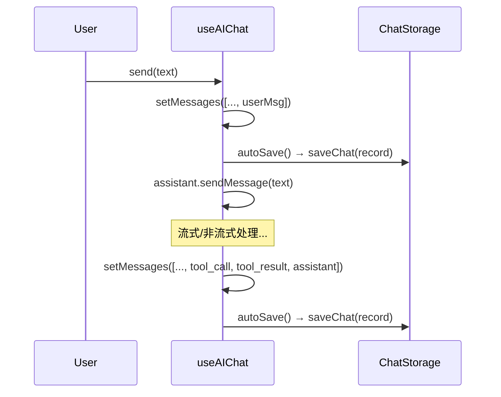

AI 聊天历史持久化是双界面架构中最具代表性的"一次接口定义，两种环境实现"的设计案例。核心思路是：将聊天记录的 CRUD 操作抽象为四个异步方法的接口，然后在 Node.js 的 TUI 端用文件系统实现，在浏览器端的 PWA 用 IndexedDB 实现。上层 React 钩子 `useAIChat` 和 `useChatHistory` 完全不知道底层存储机制，只依赖接口契约。

## 接口定义：四方法的异步契约

接口和数据模型全部定义在 `packages/app/src/services/chatStorage.ts` 中，位于 app 层（Layer 1），不依赖任何 UI 框架或运行时 API。整个体系围绕四个类型展开：

```typescript
interface ChatStorage {
  saveChat(chat: ChatRecord): Promise<void>;
  loadChat(id: string): Promise<ChatRecord | null>;
  listChats(): Promise<ChatSummary[]>;
  deleteChat(id: string): Promise<void>;
}
```

`ChatRecord` 是完整的聊天记录，包含 `id`（UUID v4）、`title`（截取用户第一条消息前 80 字符）、可选的 `contextUri`（关联的帖子 AT URI）、消息数组 `messages`，以及 `createdAt`/`updatedAt` 两个时间戳。`ChatSummary` 是列表视图所需的轻量摘要——只有 `id`、`title`、`messageCount` 和 `updatedAt`，省去了加载完整消息体的开销。`AIChatMessage` 则定义了消息的五种角色：`user`、`assistant`、`tool_call`、`tool_result`、`thinking`，以及可选的 `toolName` 和 `isError` 标记。Sources: [chatStorage.ts](packages/app/src/services/chatStorage.ts#L1-L37)

## TUI 实现：FileChatStorage——基于文件系统的 JSON 持久化

`FileChatStorage` 与接口定义在同一个文件中，是 TUI 终端的默认实现。它的存储路径默认为 `~/.bsky-tui/chats/`，每个聊天对话对应一个 `{chatId}.json` 文件。构造函数会在首次调用时递归创建目录。

**写入路径**：`saveChat()` 将整个 `ChatRecord` 序列化为格式化 JSON，同步写入文件系统。`updatedAt` 在每次保存时自动更新为当前 ISO 时间戳。**读取路径**：`loadChat()` 按 id 读取对应 JSON 文件并反序列化；如果文件不存在或内容损坏，静默返回 `null`。**列表查询**：`listChats()` 扫描目录下所有 `.json` 文件，逐个解析提取摘要，按 `updatedAt` 降序排列。损坏文件会被 `try/catch` 静默跳过。**删除**：`deleteChat()` 执行文件删除操作，文件不存在时不会报错。

```typescript
export class FileChatStorage implements ChatStorage {
  private dir: string;
  constructor(dir?: string) {
    this.dir = dir ?? path.join(homedir(), '.bsky-tui', 'chats');
  }
  // saveChat → fs.writeFileSync, loadChat → fs.readFileSync
  // listChats → fs.readdirSync + filter('.json') + parse + sort
  // deleteChat → fs.unlinkSync
}
```

文件系统的实现优势在于零额外依赖——Node.js 内置的 `fs`、`path`、`os` 模块即可完成所有工作。但这种方式在浏览器环境下完全不可用，因为 Web API 不提供文件系统访问。Sources: [chatStorage.ts](packages/app/src/services/chatStorage.ts#L39-L89)

## PWA 实现：IndexedDBChatStorage——浏览器端的 NoSQL 持久化

`IndexedDBChatStorage` 位于 `packages/pwa/src/services/indexeddb-chat-storage.ts`，是 PWA 浏览器的存储实现。它使用浏览器内置的 IndexedDB 作为底层存储引擎，数据库名为 `bsky-chats`，版本号为 1，单表 `chats`，以 `id` 字段作为主键。

实现的核心是三个辅助函数：`openDB()` 打开数据库连接并在首次升级时创建对象存储；`withStore(mode)` 打开数据库后创建指定模式的事务并返回对象存储引用。这两个辅助函数将 IndexedDB 的回调式 API 封装为 Promise，使得四个接口方法的实现异常简洁：

```typescript
async saveChat(chat: ChatRecord): Promise<void> {
  const store = await withStore('readwrite');
  // store.put(...) — 写入时会确保 updatedAt 不为空
}
async loadChat(id: string): Promise<ChatRecord | null> {
  const store = await withStore('readonly');
  // store.get(id) — 返回 null 当记录不存在
}
async listChats(): Promise<ChatSummary[]> {
  const store = await withStore('readonly');
  // store.getAll() — 获取全部记录后映射为摘要并排序
}
async deleteChat(id: string): Promise<void> {
  const store = await withStore('readwrite');
  // store.delete(id)
}
```

`listChats()` 的特殊之处在于：它获取所有 `ChatRecord` 后，只提取 `id`、`title`、`messageCount`（仅统计 `user` 和 `assistant` 角色的消息）、`updatedAt` 四个字段返回，大幅减少了列表渲染时的数据传输量。同时按时间降序排列，最新的对话排在最前面。Sources: [indexeddb-chat-storage.ts](packages/pwa/src/services/indexeddb-chat-storage.ts#L1-L77)

两种实现的对比可以用下表概括：

| 维度 | FileChatStorage (TUI) | IndexedDBChatStorage (PWA) |
|------|----------------------|---------------------------|
| 运行时环境 | Node.js (终端) | 浏览器 (Web) |
| 底层存储 | 文件系统 (`~/.bsky-tui/chats/*.json`) | IndexedDB (`bsky-chats` 数据库) |
| 序列化格式 | JSON 文本文件 | IndexedDB 原生结构化存储 |
| 数据隔离 | 按文件隔离，每个对话一个 JSON | 按主键隔离，每条记录一行 |
| 目录/表创建 | 构造函数中 `fs.mkdirSync` | `onupgradeneeded` 时自动创建 |
| 错误处理 | try/catch 静默跳过损坏文件 | Promise reject 由调用方处理 |
| 依赖 | `fs`、`path`、`os` 内置模块 | `indexedDB` 浏览器 API |
| 并发安全 | 同步 I/O，单线程无竞态 | IndexedDB 事务隔离 |

## 上层钩子：useChatHistory——注入存储实现的桥梁

`useChatHistory` 是 app 层暴露的 React 钩子，位于 `packages/app/src/hooks/useChatHistory.ts`，是上层 UI 组件与存储实现之间的桥梁。它接受一个可选的 `ChatStorage` 实例作为参数，默认使用 `getDefaultStorage()` 返回的单例 `FileChatStorage`。

钩子的内部逻辑围绕四个核心操作展开：
- `refresh()`：调用 `store.listChats()` 获取对话列表并更新状态，在组件挂载时自动执行一次
- `loadConversation(id)`：调用 `store.loadChat(id)` 加载完整对话
- `saveConversation(chat)`：调用 `store.saveChat(chat)` 后自动刷新列表
- `deleteConversation(id)`：调用 `store.deleteChat(id)` 后自动刷新列表

每次增删操作后的自动刷新机制，确保了对话列表始终与存储层保持同步，无需手动触发重新加载。Sources: [useChatHistory.ts](packages/app/src/hooks/useChatHistory.ts#L1-L49)

## 集成路径：TUI 与 PWA 的消费模式对比

**TUI 端**（`AIChatView.tsx`）使用默认的 `FileChatStorage`，通过 `getDefaultStorage()` 工厂函数获取单例：

```typescript
const storage = getDefaultStorage();  // FileChatStorage 单例
const { messages, send } = useAIChat(client, aiConfig, postContext, {
  chatId, storage, environment: 'tui', stream: true
});
const { conversations, deleteConversation } = useChatHistory(storage);
```

**PWA 端**（`AIChatPage.tsx`）显式实例化 `IndexedDBChatStorage`，并用 `useMemo` 确保组件重渲染时不会重复创建：

```typescript
const storage = useMemo(() => new IndexedDBChatStorage(), []);
const { messages, send } = useAIChat(client, aiConfig, contextUri, {
  chatId, storage, stream: true, environment: 'pwa'
});
const { conversations, deleteConversation } = useChatHistory(storage);
```

两种消费模式的结构完全一致——创建存储实例 → 传入 `useAIChat` 和 `useChatHistory` → 使用返回的状态和操作函数。唯一的区别是 TUI 使用默认单例工厂而 PWA 显式实例化，这是因为 TUI 的 `FileChatStorage` 可以无参数构造，而 PWA 需要一个 `IndexedDBChatStorage` —— 它不在 app 包的默认导出中，由 pwa 包自行管理。Sources: [AIChatView.tsx](packages/tui/src/components/AIChatView.tsx#L17-L20), [AIChatPage.tsx](packages/pwa/src/components/AIChatPage.tsx#L17-L21)

## 自动保存与恢复流程

整个存储系统的核心使用场景有两个：自动保存（用户发送消息后自动写入）和恢复（切换对话后从存储中拉取）。

**自动保存流程**发生在 `useAIChat` 内部：`send()` 函数更新 `messages` 状态后，通过 `autoSave()` 回调将当前完整的消息数组写入存储。写入是增量式的——每次用户发送新消息或 AI 回复完成后都会触发一次 `saveChat`，覆盖之前同 id 的记录。



**恢复流程**由 `chatId` 的变化触发。当用户在历史列表中选择一个对话，`useAIChat` 检测到 `options.chatId` 变化后，调用 `storage.loadChat(id)` 获取完整 `ChatRecord`，然后将 `record.messages` 直接设置到 `messages` 状态中。关键的架构决策是：**恢复时只还原 UI 消息，不还原 AIAssistant 内部的消息历史**。这意味着 LLM 不会记住之前的工具调用结果，但用户界面能完整显示对话内容。每次新消息发送时，系统会重新设置上下文系统提示。Sources: [useAIChat.ts](packages/app/src/hooks/useAIChat.ts#L58-L71), [useAIChat.ts](packages/app/src/hooks/useAIChat.ts#L108-L120)

这个设计权衡了存储复杂度与功能完整性——如果要在恢复时同时还原 AIAssistant 的内部状态，需要额外序列化工具执行上下文和消息历史，这会让存储层变得复杂且容易被不同 LLM 版本破坏。当前的"UI 恢复 + 系统提示重建"策略，在用户体验和实现简洁性之间取得了平衡。

## 下一站

理解聊天的持久化机制后，下一步可以深入了解 PWA 端 IndexedDB 存储的完整实现细节和浏览器特有考虑：`[PWA IndexedDB 实现：浏览器端聊天历史持久化](28-pwa-indexeddb-shi-xian-liu-lan-qi-duan-liao-tian-li-shi-chi-jiu-hua)`。或者从更宏观的视角回顾整个单体仓库架构中的数据流：`[单体仓库架构：core → app → tui/pwa 的三层依赖体系](5-dan-ti-cang-ku-jia-gou-core-app-tui-pwa-de-san-ceng-yi-lai-ti-xi)`。