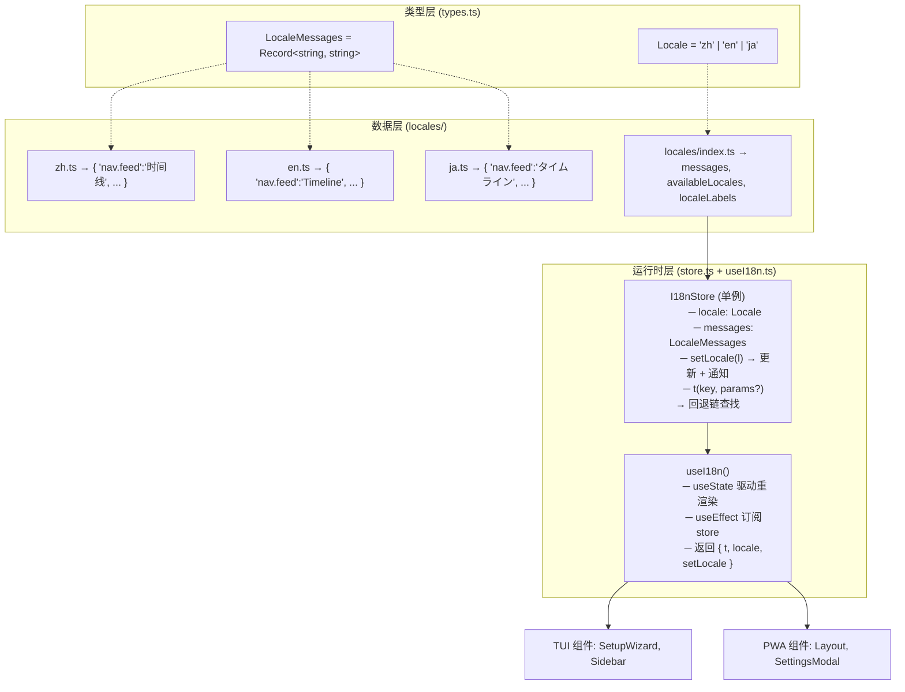

国际化（i18n）系统为整个应用提供三种语言（中文、英文、日文）的界面文本支持，核心设计围绕三个目标展开：**零成本切换**——语言变更即时生效，无需刷新；**开发友好**——通过 `t(key)` 函数以键值对方式获取翻译文本，支持模板插值和嵌套回退；**架构统一**——TUI 终端界面和 PWA 浏览器界面共用同一套国际化逻辑。系统位于 `packages/app/src/i18n/`，是一个独立于 UI 框架的纯逻辑层，通过 React Hook 桥接到组件层。Sources: [packages/app/src/i18n/store.ts](packages/app/src/i18n/store.ts#L1-L85) | [packages/app/src/i18n/useI18n.ts](packages/app/src/i18n/useI18n.ts#L1-L23)

## 架构全景：三层模型

国际化系统的架构可以分解为三个层次——**类型层**定义语言和消息的静态约束，**数据层**承载实际的翻译文本，**运行时层**封装了状态管理、模板引擎和 React 集成。以下示意图展示了三者之间的关系：



Sources: [packages/app/src/i18n/types.ts](packages/app/src/i18n/types.ts#L1-L4) | [packages/app/src/i18n/locales/index.ts](packages/app/src/i18n/locales/index.ts#L1-L15) | [packages/app/src/i18n/store.ts](packages/app/src/i18n/store.ts#L1-L85) | [packages/app/src/i18n/useI18n.ts](packages/app/src/i18n/useI18n.ts#L1-L23)

## 单例 Store：纯对象状态 + 监听器集合

`I18nStore` 是系统的运行时核体，它采用与项目其他 Store（如 `AuthStore`）相同的单向监听器模式，但做了重要的升级——使用 `Set<() => void>` 而非单一回调，允许多个组件同时订阅变更。`createI18nStore()` 工厂函数创建包含完整状态的纯对象，而 `getI18nStore()` 函数通过闭包变量 `_instance` 保证全局唯一性：

```typescript
// 模块级闭包，存储单例引用
let _instance: I18nStore | null = null;

export function getI18nStore(initialLocale?: Locale): I18nStore {
  if (!_instance) {
    _instance = createI18nStore(initialLocale);
  }
  return _instance;
}
```

Store 的关键机制有三：

**语言切换**——`setLocale(locale)` 方法先验证目标语言是否存在于 `allMessages` 中，然后同时更新 `locale` 和 `messages` 两个字段，最后遍历 `listeners` 集合逐一调用通知函数。这意味着所有订阅者会同步接收到变更信号。

**模板插值**——`interpolate(text, params?)` 函数使用正则 `/\{(\w+)\}/g` 匹配 `{key}` 格式的占位符，并在 `params` 对象中查找对应值。如果未找到对应的参数，则保留原始 `{key}` 文本，避免出现 undefined 字符串。这在需要动态数字的场景中尤为重要——例如 `compose.charCount: '{current}/{max}'` 在渲染时会被替换为 `"120/300"` 之类的实际数值。

**三层回退链**——`t(key, params?)` 方法的查找顺序体现了防御性设计：先在当前语言的消息字典中查找，如果找不到则回退到英文（最完备的语言包），再找不到则回退到中文，最终仍失败时返回原始 key。这种设计确保即使某个语言的翻译条目缺失，界面也不会出现空白或崩溃，而是优雅地展示其他语言版本或键名本身。

Sources: [packages/app/src/i18n/store.ts](packages/app/src/i18n/store.ts#L31-L85) | [packages/app/src/i18n/store.ts](packages/app/src/i18n/store.ts#L5-L12)

## React Hook 桥接：useState 驱动订阅

`useI18n()` 是连接纯逻辑 Store 与 React 组件树的桥梁。它的核心挑战在于：Store 是模块级别的单例，不依赖 React 生命周期，而组件需要在其状态变更时自动重渲染。解决方案使用了一个精妙的模式——`useState(0)` 配合数字递增：

```typescript
export function useI18n(initialLocale?: Locale) {
  const store = getI18nStore(initialLocale);
  const [, force] = useState(0);
  const tick = useCallback(() => force(n => n + 1), []);

  useEffect(() => store.subscribe(tick), [store, tick]);

  return {
    t: useCallback((key: string, params?: Record<string, string | number>) =>
      store.t(key, params), [store]),
    locale: store.locale,
    setLocale: useCallback((l: Locale) => store.setLocale(l), [store]),
    availableLocales,
    localeLabels,
  };
}
```

`force(n => n + 1)` 不依赖任何状态值，纯粹通过 setState 触发组件重新渲染。组件挂载时通过 `useEffect` 订阅 store 的变更通知，卸载时 `subscribe` 返回的清理函数会自动取消订阅。所有返回的引用都通过 `useCallback` 记忆化，避免因函数引用变化导致子组件不必要地重渲染。

`locale` 属性直接从 store 读取当前值而非通过 state 管理，这意味着 hook 返回的 `locale` 在每次渲染时都是最新值。调用 `setLocale()` 时，store 会立即同步更新 `locale` 字段，然后触发所有订阅组件重渲染，实现即时切换效果。

Sources: [packages/app/src/i18n/useI18n.ts](packages/app/src/i18n/useI18n.ts#L1-L23)

## 翻译文本组织：领域前缀命名空间

三份语言包文件（`zh.ts`、`en.ts`、`ja.ts`）各自导出一个约 260 个键值对的 `LocaleMessages` 对象。键的命名采用**领域前缀 + 点号 + 语义名称**的扁平化结构，没有嵌套层级。这种设计虽然看似简单，却与 `Record<string, string>` 的类型约束完美契合——查找时间复杂度为 O(1)，无需递归遍历。

以下表格展示了主要领域前缀及其涵盖范围：

| 前缀 | 覆盖范围 | 示例键 |
|---|---|---|
| `nav.` | 侧边栏导航和面包屑 | `nav.feed`, `nav.back`, `breadcrumb.thread` |
| `action.` | 通用操作按钮 | `action.like`, `action.delete`, `action.translate` |
| `status.` | 加载/空/错误状态 | `status.loading`, `status.empty`, `status.error` |
| `compose.` | 发帖编辑器 | `compose.placeholder`, `compose.charCount` |
| `thread.` | 讨论串视图 | `thread.replies`, `thread.translateEnabled` |
| `notifications.` | 通知列表 | `notifications.reason.like`, `notifications.empty` |
| `search.` | 搜索功能 | `search.searching`, `search.noResults` |
| `profile.` | 用户资料 | `profile.followers`, `profile.follow` |
| `bookmarks.` | 书签功能 | `bookmarks.title`, `bookmarks.empty` |
| `ai.` | AI 对话 | `ai.thinking`, `ai.newChat` |
| `login.` | 登录界面 | `login.title`, `login.passwordHint` |
| `settings.` | 设置界面 | `settings.targetLang`, `settings.saveAI` |
| `theme.` | 主题切换 | `theme.dark`, `theme.switchLight` |
| `common.` | 通用文本 | `common.loading`, `common.escBack` |
| `keys.` | 键盘快捷键提示 (TUI) | `keys.feed`, `keys.thread` |
| `setup.` | 初始化设置向导 (TUI) | `setup.title`, `setup.locale` |
| `post.` | 帖子卡片 | `post.imageCount` |
| `image.` | 图片相关 | `image.cdnHint` |
| `layout.` | 布局组件 (PWA) | `layout.aiSuggestions` |

语言包的注册中心 `locales/index.ts` 将三个语言包聚合成 `messages: Record<Locale, LocaleMessages>` 映射表，同时导出 `availableLocales: Locale[]` 和 `localeLabels: Record<Locale, string>` —— 后者用于在 UI 中以下拉框形式展示语言选项。

Sources: [packages/app/src/i18n/locales/zh.ts](packages/app/src/i18n/locales/zh.ts#L1-L262) | [packages/app/src/i18n/locales/en.ts](packages/app/src/i18n/locales/en.ts#L1-L242) | [packages/app/src/i18n/locales/ja.ts](packages/app/src/i18n/locales/ja.ts#L1-L242) | [packages/app/src/i18n/locales/index.ts](packages/app/src/i18n/locales/index.ts#L1-L15)

## 即时切换：TUI 与 PWA 的双界面集成

语言切换的即时性体现在两个界面中完全不同的实现方式，但最终都归结于调用 `setLocale()` 这一个入口。

**TUI 端：SetupWizard**——初始化配置向导中，`locale` 是一个输入字段。当用户输入 `zh`/`en`/`ja` 并回车时，`handleFieldSubmit` 会立即调用 `setLocale(loc)`。这意味着后续所有字段的标签（如 `t('setup.llmApiKey')`）会立刻以新语言显示，用户无需等待配置完成即可验证语言是否生效。这是一个精细的交互设计——语言设置在配置界面中具有最高优先级，因为它直接影响配置过程中所有提示文本的可读性。

**PWA 端：SettingsModal**——设置弹窗的「通用」标签页中使用 `<select>` 下拉框展示语言选项。下拉框的 `onChange` 直接调用 `setLocale(e.target.value)`，变更立即传播到所有已挂载的组件——包括侧边栏的导航标签、发帖编辑器的提示文字、AI 对话页面的按钮文本等。PWA 没有将 locale 持久化到 `AppConfig` 中（当前版本的持久化由 `useAppConfig` 的 `localStorage` 机制处理，但 locale 本身由 i18n store 管理，两者解耦）。这种设计选择意味着语言偏好仅在当前会话中有效，重启后需要重新设置——这是一个值得了解的权衡。

**切换性能**——由于所有组件通过 `useI18n` hook 订阅了同一个 store，一次 `setLocale()` 调用会触发所有使用该 hook 的组件重渲染。得益于 React 的 Diff 算法和 `useCallback` 记忆化，实际 DOM 变更仅限于翻译文本发生变化的部分，不会造成全页面刷新。

Sources: [packages/tui/src/components/SetupWizard.tsx](packages/tui/src/components/SetupWizard.tsx#L60-L75) | [packages/pwa/src/components/SettingsModal.tsx](packages/pwa/src/components/SettingsModal.tsx#L216-L226) | [packages/tui/src/components/Sidebar.tsx](packages/tui/src/components/Sidebar.tsx#L44-L60)

## 与其他 Store 模式对比

项目中存在多个遵循类似「纯对象 + 监听器」模式的 Store——`AuthStore`、`PostDetailStore`、`TimelineStore` 以及 `I18nStore`。理解它们之间的差异有助于把握架构的设计演进：

| 特性 | I18nStore | AuthStore | 分析 |
|---|---|---|---|
| 实例化方式 | `getI18nStore()` 全局单例 | `createAuthStore()` 手动创建 | I18n 需要跨所有组件共享同一实例，而 Auth 可在测试时隔离 |
| 监听器结构 | `Set<() => void>` 多订阅者 | 单一 `listener: (() => void) \| null` | I18n 的 Set 结构支持多个 hook 实例同时订阅（PWA + TUI 同存时尤为重要） |
| 订阅清理 | `subscribe()` 返回取消函数 | 无自动清理，需手动置 null | I18n 的返回函数可供 `useEffect` 自动调用，更符合 React 习惯 |
| 切换影响面 | 全组件重渲染 | 仅自有逻辑 | I18n 的变更影响整个 UI 语言，Auth 变更主要影响登录状态 |

Sources: [packages/app/src/stores/auth.ts](packages/app/src/stores/auth.ts#L1-L70) | [packages/app/src/i18n/store.ts](packages/app/src/i18n/store.ts#L31-L85)

## 公共 API 一览

国际化系统通过 `@bsky/app` 包的 `index.ts` 导出以下公开接口：

**类型导出**——`Locale`（`'zh' | 'en' | 'ja'`）、`LocaleMessages`（`Record<string, string>`）、`UseI18nReturn`（`useI18n` 的返回值类型）

**React Hook**——`useI18n(initialLocale?)` 返回包含 `t` 翻译函数、当前 `locale`、`setLocale` 切换方法、`availableLocales` 可用语言列表和 `localeLabels` 语言标签的对象

**工具数据**——`availableLocales`（`['zh', 'en', 'ja']`）供 UI 循环渲染语言选择器，`localeLabels`（`{ zh: '中文', en: 'English', ja: '日本語' }`）供展示语言名称

这些导出被 TUI 组件（`SetupWizard`、`Sidebar`）和 PWA 组件（`Layout`、`SettingsModal`）统一引用，体现了 `@bsky/app` 作为共享逻辑层的定位。Sources: [packages/app/src/index.ts](packages/app/src/index.ts#L25-L31) | [packages/app/src/i18n/index.ts](packages/app/src/i18n/index.ts#L1-L5)

## 下一步阅读

完成本页后，你可以深入了解项目中其他与国际化相关的系统：

- **智能翻译系统**——[双模式翻译（simple/json）与指数退避重试](14-zhi-neng-fan-yi-xi-tong-shuang-mo-shi-fan-yi-simple-json-yu-zhi-shu-tui-bi-zhong-shi)：本页的 `useTranslation` hook 与 i18n 系统互补——i18n 处理 UI 文本的本地化，而 Translation 系统用于动态翻译帖子内容
- **单向监听器 Store 模式**——[纯对象状态管理 + React 订阅](16-dan-xiang-jian-ting-qi-store-mo-shi-chun-dui-xiang-zhuang-tai-guan-li-react-ding-yue)：本文的 I18nStore 是该模式的直接应用，深入阅读可以理解整套状态管理哲学
- **PWA 设计系统**——[语义色板、排版、布局与组件规范](8-pwa-she-ji-xi-tong-yu-yi-se-ban-pai-ban-bu-ju-yu-zu-jian-gui-fan)：PWA 界面中的 `t()` 调用与设计系统的组件规范相辅相成